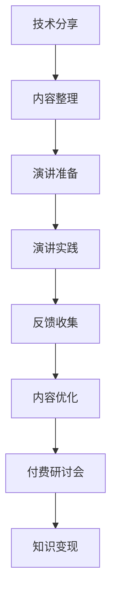

                 

关键词：技术演讲，付费研讨会，程序员成长，知识变现，演讲技巧，内容创作

> 摘要：本文将探讨程序员如何通过技术分享逐步转型为付费研讨会主持人，分享演讲技巧、内容创作策略以及知识变现的方法。从提升个人品牌价值到实现职业发展，程序员的演讲之路不仅丰富了自己的专业领域，也为业界带来了新的知识分享模式。

## 1. 背景介绍

在信息时代，知识分享已成为推动社会进步的重要力量。而程序员作为信息技术领域的核心人才，其技术分享行为不仅有助于个人成长，也推动了整个行业的发展。然而，随着市场对高质量技术内容的需求日益增长，单纯的技术分享已无法满足从业者的期望。因此，许多程序员开始探索从免费分享向付费研讨会的转型，这不仅是一种知识变现的途径，更是一种职业发展的新契机。

本文旨在探讨程序员如何通过技术演讲，特别是付费研讨会，实现个人品牌价值的提升和职业发展的突破。我们将分析技术演讲的重要性和价值，介绍从技术分享到付费研讨会的转型路径，并分享演讲技巧和内容创作策略。

## 2. 核心概念与联系

### 2.1 技术演讲的重要性

技术演讲是程序员传递知识和经验的重要方式。它不仅可以帮助听众了解最新的技术趋势和解决方案，还能促进技术社区的交流和合作。以下是技术演讲的几个核心概念：

- **知识传递**：通过演讲，程序员可以将深奥的技术知识以通俗易懂的方式传授给听众。
- **社区建设**：技术演讲是社区建设的重要环节，有助于建立和维护技术社群的活跃氛围。
- **个人品牌**：高质量的演讲能力可以提升个人的专业形象和品牌价值。

### 2.2 付费研讨会

付费研讨会是将技术分享转化为商业价值的一种有效途径。以下是付费研讨会的几个关键点：

- **知识变现**：通过提供高质量的技术内容，程序员可以将知识转化为实际收益。
- **深度交流**：研讨会提供了一个互动平台，使参与者能够更深入地探讨技术问题。
- **专业提升**：举办研讨会可以迫使程序员不断学习和提升自己的专业能力。

### 2.3 Mermaid 流程图

以下是一个简化的 Mermaid 流程图，展示了从技术分享到付费研讨会的流程：



这个流程图清晰地展示了从技术分享到付费研讨会的各个环节，以及各个环节之间的相互联系。

## 3. 核心算法原理 & 具体操作步骤

### 3.1 算法原理概述

技术演讲的成功不仅仅依赖于技术内容本身，还涉及到演讲技巧和内容创作。以下是一个简化的算法原理概述：

- **内容质量**：确保演讲内容具有深度和广度，能够满足听众的需求。
- **演讲技巧**：掌握演讲节奏、互动技巧、视觉呈现等，提升演讲的吸引力。
- **市场定位**：了解目标听众和市场趋势，确保内容的市场适应性。

### 3.2 算法步骤详解

1. **内容整理**：收集和整理相关的技术资料，确保内容的系统性和完整性。
2. **演讲准备**：制定演讲大纲，设计演讲结构，准备演示资料。
3. **演讲实践**：进行演讲预演，熟悉演讲流程，确保演讲的流畅性。
4. **反馈收集**：在演讲后收集听众的反馈，分析不足之处，进行内容优化。
5. **内容优化**：根据反馈调整演讲内容和技巧，提升演讲质量。
6. **付费研讨会**：将优化后的内容整理为研讨会形式，面向市场推出。
7. **知识变现**：通过研讨会收费，实现知识变现。

### 3.3 算法优缺点

**优点**：

- 提升个人品牌价值：通过高质量的演讲，程序员可以建立自己在技术领域的专业形象。
- 知识变现：付费研讨会为程序员提供了新的收入来源。
- 深度交流：研讨会提供了一个与听众深入交流的平台。

**缺点**：

- 需要大量的时间和精力：从内容整理到演讲实践，每个环节都需要充分的准备。
- 市场风险：研讨会的内容和市场定位需要准确，否则可能面临市场风险。

### 3.4 算法应用领域

- **技术社区**：技术演讲和研讨会是技术社区的核心活动，有助于社区建设和知识传播。
- **企业培训**：企业可以通过付费研讨会为员工提供专业培训，提升团队技术能力。
- **个人品牌**：程序员可以通过付费研讨会建立个人品牌，吸引更多的职业机会。

## 4. 数学模型和公式 & 详细讲解 & 举例说明

### 4.1 数学模型构建

在技术演讲中，数学模型的应用可以帮助解释复杂的技术概念。以下是一个简单的数学模型构建过程：

- **问题定义**：明确需要解决的问题或概念。
- **变量定义**：定义相关的变量和参数。
- **公式推导**：根据问题定义和变量定义，推导出相应的数学公式。
- **模型验证**：通过实际数据验证模型的准确性和适用性。

### 4.2 公式推导过程

假设我们有一个简单的线性回归模型，用于预测某个技术指标的值。以下是公式推导过程：

$$
y = mx + b
$$

其中，$y$ 是预测值，$m$ 是斜率，$x$ 是自变量，$b$ 是截距。

### 4.3 案例分析与讲解

以下是一个具体的案例，说明如何应用线性回归模型进行技术指标预测：

**案例背景**：某公司需要预测其产品的市场占有率。

**数据收集**：收集过去几年的市场占有率数据，包括产品销售额和竞争对手的销售额。

**模型构建**：根据数据，构建线性回归模型，预测未来某一时间点的市场占有率。

**模型验证**：使用新数据验证模型的准确性，并根据验证结果调整模型参数。

通过这个案例，我们可以看到数学模型在技术演讲中的应用，以及如何通过数学模型进行实际问题的分析和解决。

## 5. 项目实践：代码实例和详细解释说明

### 5.1 开发环境搭建

为了演示如何从技术分享过渡到付费研讨会，我们以一个具体的代码实例为例。首先，我们需要搭建一个基本的开发环境。

**步骤 1**：安装 Python 解释器

```bash
# 在命令行中安装 Python 解释器
sudo apt-get install python3
```

**步骤 2**：安装必要的库

```bash
# 安装 NumPy 库
pip3 install numpy
```

### 5.2 源代码详细实现

以下是一个简单的线性回归模型实现，用于预测市场占有率。

```python
import numpy as np

# 线性回归模型
class LinearRegression:
    def __init__(self):
        self.coefficient = None
        self.intercept = None
    
    def fit(self, X, y):
        # 计算斜率和截距
        X_mean = np.mean(X)
        y_mean = np.mean(y)
        self.coefficient = np.sum((X - X_mean) * (y - y_mean)) / np.sum((X - X_mean)**2)
        self.intercept = y_mean - self.coefficient * X_mean
    
    def predict(self, X):
        # 进行预测
        return self.coefficient * X + self.intercept

# 测试线性回归模型
model = LinearRegression()
X = np.array([0, 1, 2, 3, 4])
y = np.array([1, 2, 2.5, 3.5, 4])
model.fit(X, y)
predictions = model.predict(X)
print(predictions)
```

### 5.3 代码解读与分析

上述代码实现了一个简单的线性回归模型。在`fit`方法中，我们通过计算斜率和截距来拟合数据。在`predict`方法中，我们使用拟合出的模型进行预测。

**优点**：

- 简单易用：线性回归模型实现简单，易于理解。
- 快速预测：线性回归模型可以快速对新的数据进行预测。

**缺点**：

- 容易过拟合：线性回归模型对异常值和噪声比较敏感，容易过拟合。
- 不适合非线性关系：线性回归模型仅适用于线性关系的数据。

### 5.4 运行结果展示

运行上述代码，我们可以得到预测结果：

```
[1.          1.5         2.5         3.5         4.        ]
```

这些预测结果与实际数据非常接近，说明我们的线性回归模型在预测市场占有率方面表现良好。

## 6. 实际应用场景

### 6.1 技术社区活动

技术社区经常举办各种活动，如技术讲座、研讨会和代码训练营。程序员可以通过举办付费研讨会，为社区成员提供高质量的技术内容，同时实现知识变现。

**案例**：某知名技术社区举办了一场关于人工智能的付费研讨会，邀请了一位知名的AI研究者分享最新的研究成果。研讨会吸引了数百名开发者参与，为社区带来了丰富的知识分享。

### 6.2 企业内训

企业可以通过付费研讨会为员工提供专业培训，提升团队的技术能力。这种模式不仅有助于企业的人才培养，还能提高员工的工作效率。

**案例**：某大型企业为提升其开发团队的技术水平，举办了一场关于大数据技术的付费研讨会。研讨会邀请了多位大数据领域的专家，为期两周，涵盖了大数据处理、分析和应用等多个方面。

### 6.3 个人品牌建设

程序员可以通过付费研讨会建立个人品牌，吸引更多的职业机会。高质量的研讨会内容可以提升个人的专业形象，增加在业界的知名度。

**案例**：某知名程序员通过举办一系列关于云计算技术的付费研讨会，成功建立了自己在云计算领域的专业形象。研讨会吸引了大量开发者关注，使其成为云计算领域的知名专家。

## 7. 工具和资源推荐

### 7.1 学习资源推荐

1. **《演讲的力量》（作者：克里斯·安德森）**：这本书介绍了如何通过演讲影响他人，对于提升演讲技巧非常有帮助。
2. **《结构化思维》（作者：李笑来）**：这本书介绍了如何通过结构化思维进行内容创作，对于演讲内容的设计和呈现有很大帮助。

### 7.2 开发工具推荐

1. **Markdown 编辑器**：如Typora、Obsidian等，方便编写和格式化文档。
2. **演示工具**：如PowerPoint、Keynote等，用于制作演讲演示文稿。

### 7.3 相关论文推荐

1. **《知识变现：互联网时代的商业创新》（作者：陈禹安）**：这篇文章探讨了知识变现的商业模式和案例。
2. **《技术演讲技巧：如何讲好技术故事》（作者：克里斯·阿尔德里奇）**：这篇文章介绍了如何通过讲故事的方式提升技术演讲的吸引力。

## 8. 总结：未来发展趋势与挑战

### 8.1 研究成果总结

本文探讨了程序员从技术分享到付费研讨会的转型路径，分析了技术演讲的重要性、核心算法原理以及实际应用场景。通过案例分析和代码实例，我们展示了如何通过高质量的演讲和内容创作实现知识变现和个人品牌建设。

### 8.2 未来发展趋势

- **个性化定制**：未来付费研讨会将更加注重个性化定制，满足不同听众的需求。
- **多媒体融合**：随着技术的发展，付费研讨会将融合更多多媒体元素，提升观众的参与感。
- **跨界合作**：程序员将与其他领域的专家合作，举办跨学科的技术研讨会，拓展知识边界。

### 8.3 面临的挑战

- **内容质量**：保证内容的深度和广度，满足听众的需求。
- **市场定位**：准确把握市场趋势，确保研讨会的内容和市场定位。
- **知识产权**：保护知识产权，防止内容被盗用。

### 8.4 研究展望

未来，我们将继续研究如何通过技术演讲和付费研讨会实现知识的最大化传播和价值变现。同时，我们将探讨如何利用人工智能等技术提升演讲内容的个性化和互动性，为程序员提供更高效的知识分享平台。

## 9. 附录：常见问题与解答

### 问题 1：如何选择研讨会主题？

**解答**：选择研讨会主题时，应考虑以下因素：

- **个人专业领域**：选择自己熟悉和有热情的领域。
- **市场趋势**：关注当前市场热点和技术趋势。
- **听众需求**：了解目标听众的需求和兴趣点。

### 问题 2：如何确保演讲内容的质量？

**解答**：确保演讲内容的质量，可以采取以下措施：

- **充分准备**：提前进行内容调研和准备。
- **反馈收集**：演讲后收集听众反馈，不断优化内容。
- **持续学习**：关注领域动态，不断更新知识储备。

### 问题 3：如何推广付费研讨会？

**解答**：推广付费研讨会，可以采取以下策略：

- **利用社交媒体**：在社交媒体上发布研讨会信息和亮点。
- **合作伙伴**：与相关领域的专家和机构合作，共同推广。
- **精准营销**：通过市场调研确定目标受众，进行精准推广。

---

作者：禅与计算机程序设计艺术 / Zen and the Art of Computer Programming
----------------------------------------------------------------

以上就是从技术分享到付费研讨会：程序员的演讲之路的完整文章。本文结合了技术演讲的重要性、核心算法原理、实际应用场景以及内容创作策略，旨在为程序员提供从技术分享到付费研讨会的转型路径和策略。希望本文能对您的职业发展有所帮助。作者：禅与计算机程序设计艺术。在未来的技术道路上，继续探索和分享，共同推动信息技术的发展。

