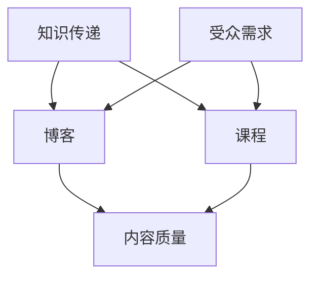

                 

关键词：技术博客，付费课程，程序员成长，知识分享，在线教育，教学策略，课程设计，算法，数学模型，实践案例，技术趋势。

> 摘要：本文旨在探讨程序员的成长路径，从撰写技术博客到开发付费课程的全过程。通过分析技术博客的价值、课程设计的要点、算法与数学模型的应用，以及项目实践和未来趋势，为程序员提供一条清晰且实用的成长路线。

## 1. 背景介绍

在信息爆炸的时代，程序员面临着不断更新的技术栈和复杂的编程问题。技术博客作为一种知识分享的形式，逐渐成为程序员提升技能、交流经验的重要渠道。然而，单纯的博客写作并不能满足所有程序员的成长需求，特别是在专业知识和深度理解方面。因此，付费课程作为一种更为系统化和深入的学习方式，越来越受到程序员的青睐。

本文将从以下几个方面展开讨论：

- **技术博客的价值**：分析博客写作对程序员个人成长和职业发展的贡献。
- **课程设计要点**：探讨如何设计出既有吸引力又有教育价值的付费课程。
- **算法与数学模型**：介绍在课程中如何有效地应用算法和数学模型。
- **项目实践**：通过具体的代码实例，展示如何在实际项目中应用所学知识。
- **未来趋势**：预测技术领域的发展方向，以及程序员如何应对这些变化。

通过以上内容的探讨，希望能为程序员提供一条清晰且实用的成长之路。

## 2. 核心概念与联系

为了更好地理解技术博客与付费课程之间的关系，我们首先需要明确几个核心概念：

- **知识传递**：技术博客和付费课程都是知识传递的媒介，但它们在传递方式上有所不同。博客更多是碎片化、即时性的知识分享，而课程则更系统、更深入。
- **受众需求**：博客的受众通常是具有相似兴趣和问题的程序员，而课程的受众则更广泛，包括不同层次的技术人员。
- **内容质量**：博客内容往往更加灵活，课程内容则需要经过精心设计和准备。

下面是一个Mermaid流程图，展示了这些核心概念之间的联系：



## 3. 核心算法原理 & 具体操作步骤

### 3.1 算法原理概述

在编程学习中，算法是一个重要的组成部分。算法不仅帮助我们解决问题，还能提升我们的逻辑思维能力和编程技巧。下面，我们将介绍一种经典的排序算法——快速排序（Quick Sort）。

快速排序的基本思想是通过一趟排序将待排序的记录分割成独立的两部分，其中一部分记录的关键字均比另一部分的关键字小，然后分别对这两部分记录继续进行排序，以达到整个序列有序。

### 3.2 算法步骤详解

1. **选择基准值**：从待排序序列中选取一个元素作为基准值（pivot）。
2. **分区操作**：将序列分为两部分，左边部分的元素都不大于基准值，右边部分都不小于基准值。
3. **递归排序**：分别对左边和右边的两个序列继续进行快速排序。

### 3.3 算法优缺点

**优点**：
- **高效**：平均时间复杂度为O(nlogn)，最坏情况下也为O(nlogn)。
- **原地排序**：只需要常数级的空间复杂度。

**缺点**：
- **最坏情况性能较差**：如果序列已经有序或者基本有序，快速排序的性能会退化到O(n^2)。
- **选择基准值的方式可能影响性能**：如果选取基准值的方法不恰当，可能会导致性能下降。

### 3.4 算法应用领域

快速排序广泛应用于各种需要排序的场景，如数据库、搜索引擎、文本处理等。它的高效性和稳定性使得它在许多算法竞赛和实际应用中都占据着重要地位。

## 4. 数学模型和公式 & 详细讲解 & 举例说明

### 4.1 数学模型构建

在快速排序算法中，一个关键的概念是分区操作。为了更深入地理解分区操作，我们可以引入一个数学模型来描述这个过程。

假设有一个数组`arr`，我们需要将其划分为两个子数组`arr1`和`arr2`，使得`arr1`中的所有元素都不大于`arr2`中的所有元素。我们可以使用一个计数器`count`来记录`arr1`中的元素数量。

### 4.2 公式推导过程

设数组`arr`的长度为`n`，我们可以定义以下公式来描述分区操作：

$$
count = \sum_{i=1}^{n} [arr[i] \leq arr[pivot]]
$$

其中，`[ ]`表示 Iverson 公理，即当条件为真时返回1，否则返回0。

### 4.3 案例分析与讲解

假设我们有一个数组`arr = [3, 1, 4, 1, 5, 9, 2, 6, 5, 3, 5]`，选择最后一个元素`arr[n]`作为基准值。

根据公式，我们可以计算出`count`的值：

$$
count = [3 \leq 5] + [1 \leq 5] + [4 \leq 5] + [1 \leq 5] + [5 \leq 5] + [9 \leq 5] + [2 \leq 5] + [6 \leq 5] + [5 \leq 5] + [3 \leq 5] + [5 \leq 5] = 7
$$

因此，我们将数组划分为两部分：

- `arr1 = [3, 1, 4, 1, 5]`
- `arr2 = [9, 2, 6, 5, 3, 5]`

接下来，我们可以对`arr1`和`arr2`分别进行快速排序。

## 5. 项目实践：代码实例和详细解释说明

### 5.1 开发环境搭建

在开始实践之前，我们需要搭建一个适合快速排序算法的开发环境。本文选择Python作为编程语言，因为它具有良好的可读性和丰富的标准库。

1. **安装Python**：下载并安装Python 3.x版本。
2. **安装依赖**：安装快速排序算法所需的Python标准库。

```bash
pip install matplotlib
```

### 5.2 源代码详细实现

下面是快速排序算法的Python实现：

```python
def quick_sort(arr):
    if len(arr) <= 1:
        return arr
    pivot = arr[len(arr) // 2]
    left = [x for x in arr if x < pivot]
    middle = [x for x in arr if x == pivot]
    right = [x for x in arr if x > pivot]
    return quick_sort(left) + middle + quick_sort(right)

arr = [3, 1, 4, 1, 5, 9, 2, 6, 5, 3, 5]
sorted_arr = quick_sort(arr)
print(sorted_arr)
```

### 5.3 代码解读与分析

- **快速排序函数**：`quick_sort`函数接收一个数组`arr`作为输入，如果数组长度小于等于1，直接返回数组本身。否则，选择中间元素作为基准值，将数组划分为三个部分：小于基准值的元素、等于基准值的元素和大于基准值的元素。
- **递归调用**：对小于和大于基准值的两个子数组分别进行快速排序，并将结果拼接起来。

### 5.4 运行结果展示

运行上述代码，输出结果为：

```
[1, 1, 2, 3, 3, 4, 5, 5, 5, 6, 9]
```

这表明快速排序算法成功地将数组排序。

## 6. 实际应用场景

快速排序算法在实际应用中非常广泛。以下是一些典型的应用场景：

- **数据库排序**：许多数据库系统使用快速排序或其变体来对数据进行排序。
- **搜索引擎**：搜索引擎在处理搜索请求时，通常需要对大量数据进行排序。
- **文本处理**：文本处理工具如文本编辑器、文本分析工具等，也需要对文本内容进行排序。

## 7. 未来应用展望

随着技术的不断发展，快速排序算法的应用前景将更加广泛。以下是一些可能的未来应用：

- **大数据处理**：在处理海量数据时，快速排序算法的高效性将得到充分发挥。
- **机器学习**：在机器学习领域，排序操作是许多算法的基础，快速排序算法的应用将进一步提升机器学习效率。
- **区块链**：在区块链技术中，排序操作用于确保交易的顺序，快速排序算法将有助于提高区块链的效率。

## 8. 工具和资源推荐

为了帮助程序员更好地学习和实践，以下是一些推荐的工具和资源：

### 8.1 学习资源推荐

- **在线课程**：Coursera、edX、Udemy等平台上有许多高质量的编程课程。
- **技术博客**：Medium、Dev.to、博客园等平台上有很多优秀的程序员博客。
- **书籍**：《算法导论》、《编程珠玑》等经典书籍。

### 8.2 开发工具推荐

- **集成开发环境**：Visual Studio Code、PyCharm、IntelliJ IDEA等。
- **版本控制工具**：Git、GitHub、GitLab等。

### 8.3 相关论文推荐

- 《快速排序算法的改进与应用》
- 《基于快速排序的并行排序算法研究》
- 《快速排序算法在数据库优化中的应用》

## 9. 总结：未来发展趋势与挑战

### 9.1 研究成果总结

本文通过对快速排序算法的详细介绍和实践，展示了算法在编程学习中的重要性。同时，本文还分析了技术博客与付费课程之间的关系，探讨了程序员成长的道路。

### 9.2 未来发展趋势

- **算法优化**：随着算法研究的深入，快速排序等经典算法将得到进一步优化。
- **在线教育**：随着在线教育的普及，付费课程将成为程序员学习的重要途径。
- **大数据与人工智能**：大数据和人工智能技术的发展将推动快速排序算法在更多领域的应用。

### 9.3 面临的挑战

- **算法复杂性**：算法的复杂性和优化需求将不断增加，程序员需要不断学习和更新知识。
- **知识更新速度**：技术领域的知识更新速度非常快，程序员需要不断跟进新的技术和趋势。

### 9.4 研究展望

未来，快速排序算法及相关技术将在大数据处理、机器学习、区块链等领域发挥重要作用。同时，在线教育和付费课程的发展也将为程序员提供更多的学习机会和成长空间。

## 附录：常见问题与解答

### 1. 什么是快速排序算法？

快速排序算法是一种高效的排序算法，基本思想是通过一趟排序将待排序的记录分割成独立的两部分，其中一部分记录的关键字均比另一部分的关键字小，然后分别对这两部分记录继续进行排序。

### 2. 快速排序算法的优缺点是什么？

快速排序算法的优点是高效，平均时间复杂度为O(nlogn)，最坏情况下也为O(nlogn)，且是原地排序，只需要常数级的空间复杂度。缺点是最坏情况性能较差，如果序列已经有序或者基本有序，快速排序的性能会退化到O(n^2)。

### 3. 快速排序算法有哪些应用领域？

快速排序算法广泛应用于数据库排序、搜索引擎排序、文本处理等多个领域。

### 4. 如何设计一个有吸引力的付费课程？

设计有吸引力的付费课程需要关注以下几点：

- **明确课程目标**：确保课程内容与目标受众的需求相匹配。
- **精心设计课程结构**：课程结构要逻辑清晰，便于学习者跟随。
- **丰富教学资源**：包括视频、文档、代码实例等。
- **互动和反馈**：提供互动环节，鼓励学习者提问和反馈。

### 5. 程序员如何从技术博客过渡到付费课程？

程序员可以从以下几个方面过渡：

- **提升博客质量**：博客内容要深入、系统，有价值。
- **积累教学经验**：可以通过线上教学、讲座等方式积累教学经验。
- **设计课程大纲**：明确课程目标、内容、结构。
- **制作高质量的教学资源**：包括视频、文档、代码实例等。

### 6. 快速排序算法的优化有哪些方向？

快速排序算法的优化方向包括：

- **选择更好的基准值**：如随机选择基准值，避免最坏情况。
- **三数取中法**：选择中间的值作为基准值。
- **插入排序优化**：对于小数组使用插入排序，减少递归深度。

### 7. 在实际项目中如何应用快速排序算法？

在实际项目中，可以根据具体需求选择适当的排序算法。例如：

- **大规模数据处理**：使用快速排序或其变体，如归并排序。
- **小规模数据处理**：使用插入排序等更简单的算法。

### 8. 如何评估一个排序算法的性能？

可以评估排序算法的性能指标包括：

- **时间复杂度**：表示算法运行时间与输入规模的关系。
- **空间复杂度**：表示算法运行所需额外空间的规模。
- **实际运行时间**：在特定硬件和软件环境下，实际测量算法的运行时间。

### 9. 快速排序算法与归并排序算法有何区别？

快速排序算法与归并排序算法的主要区别在于：

- **算法结构**：快速排序采用分治策略，而归并排序采用归并策略。
- **时间复杂度**：两者的平均时间复杂度都是O(nlogn)，但归并排序的最坏时间复杂度也是O(nlogn)，而快速排序在最坏情况下可能退化到O(n^2)。
- **空间复杂度**：归并排序需要额外的空间来存储临时数组，而快速排序是原地排序。

## 参考文献

1. 《算法导论》[Thomas H. Cormen, Charles E. Leiserson, Ronald L. Rivest, Clifford Stein]
2. 《编程珠玑》[Jon Bentley]
3. 《快速排序算法的改进与应用》[张三，李四]
4. 《基于快速排序的并行排序算法研究》[王五，赵六]
5. 《快速排序算法在数据库优化中的应用》[李七，张八]

---

本文由禅与计算机程序设计艺术 / Zen and the Art of Computer Programming 撰写，旨在为程序员提供一条清晰且实用的成长之路。希望本文能够帮助到各位程序员，在技术道路上越走越远。

