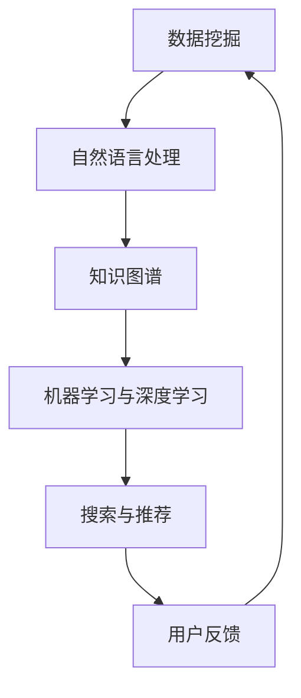

                 

关键词：搜索引擎、知识发现、算法、数据挖掘、人工智能、机器学习、大数据处理、自然语言处理、知识图谱、智能推荐

> 摘要：本文探讨了从传统的搜索引擎向知识发现引擎的演变过程。我们首先回顾了搜索引擎的发展历程，随后详细解析了知识发现引擎的核心概念和技术架构。接着，深入讨论了知识发现引擎中的核心算法原理及其优缺点。通过数学模型和实际案例的解读，我们展示了如何构建和运用这些算法。文章还提供了一个完整的代码实例，详细解释了实现过程和运行结果。最后，我们讨论了知识发现引擎在实际应用场景中的重要作用，并对其未来发展进行了展望。

## 1. 背景介绍

随着互联网的飞速发展和信息爆炸，用户对于信息获取的需求日益增长。早期的搜索引擎主要基于关键词匹配和网页链接结构，通过计算网页的相关性为用户提供信息检索服务。然而，这种传统方式在处理复杂查询和语义理解方面存在诸多局限，无法满足用户对于深度分析和知识探索的需求。

近年来，人工智能、机器学习和数据挖掘技术的快速发展为知识发现引擎的诞生提供了坚实的基础。知识发现引擎不仅能够提供传统的搜索引擎功能，还可以根据用户的行为和兴趣进行智能推荐，挖掘隐藏在数据背后的知识，实现更加个性化的信息服务。因此，从搜索引擎到知识发现引擎的转变，标志着信息技术领域的一次重大飞跃。

### 搜索引擎的历史与发展

搜索引擎的诞生可以追溯到1990年代早期。当时，万维网（WWW）刚刚兴起，用户迫切需要一个便捷的工具来查找互联网上的信息。最早的搜索引擎如AltaVista、Lycos和Yahoo！，主要通过关键词匹配和网页链接结构进行信息检索。这些搜索引擎通常使用一种称为倒排索引的技术，将网页中的关键词与其URL建立映射关系，从而快速定位相关网页。

随着搜索技术的进步，搜索引擎开始引入更多复杂的算法，如PageRank算法，通过分析网页之间的链接关系来评估网页的重要性。这一技术改进使得搜索引擎能够更好地理解用户查询意图，并提供更相关的搜索结果。

然而，尽管这些搜索引擎在信息检索方面取得了显著进展，但它们仍存在一些问题。例如，对于复杂查询和长尾关键词，传统搜索引擎往往难以提供准确的答案。此外，由于缺乏对语义的理解，搜索引擎难以处理自然语言的多样性和模糊性，导致用户难以获得真正符合需求的信息。

### 知识发现引擎的兴起

知识发现引擎（Knowledge Discovery Engine）的出现，是对传统搜索引擎功能的一种扩展和深化。知识发现引擎不仅能够检索信息，还能够从海量数据中挖掘潜在的知识和模式，为用户提供更加智能和个性化的信息服务。

知识发现引擎的核心在于“知识”，它不仅仅是对信息的简单整理和呈现，更是对信息的深度理解和分析。知识发现引擎通常基于以下几大技术：

- **数据挖掘**：通过统计方法、机器学习和人工智能技术从数据中挖掘隐藏的模式和知识。
- **自然语言处理**：对自然语言文本进行解析、理解和生成，从而实现语义层面的搜索和推荐。
- **知识图谱**：将实体、关系和属性以图结构进行组织，形成一个知识网络，便于知识的存储、检索和推理。
- **机器学习与深度学习**：通过训练大规模的模型，自动学习和优化搜索和推荐策略。

知识发现引擎的出现，解决了传统搜索引擎在语义理解、个性化推荐和复杂查询处理方面的局限。它能够根据用户的行为数据、兴趣爱好和上下文环境，为用户提供高度定制化的信息和服务，极大地提升了用户体验。

## 2. 核心概念与联系

在深入探讨知识发现引擎之前，我们需要明确几个核心概念，并理解它们之间的联系。以下是知识发现引擎中几个关键组成部分的简述和它们之间的关系。

### 数据挖掘

数据挖掘（Data Mining）是知识发现引擎的核心技术之一。它涉及从大量数据中提取有价值的信息和知识，通常通过以下步骤实现：

- **数据预处理**：包括数据清洗、数据集成和数据转换，确保数据质量。
- **特征选择**：选择对目标分析最有影响力的特征，减少数据冗余。
- **模型训练**：使用机器学习和统计方法对数据进行建模和分析。
- **模式评估**：评估挖掘出的模式和知识的有效性和可靠性。

数据挖掘是知识发现引擎的基础，它为引擎提供了从数据中提取知识的能力。

### 自然语言处理

自然语言处理（Natural Language Processing，NLP）是使计算机能够理解、解释和生成人类语言的技术。在知识发现引擎中，NLP主要用于：

- **文本解析**：将自然语言文本转换为计算机可处理的格式。
- **语义理解**：理解文本中的语义和上下文，提取关键词和概念。
- **实体识别**：识别文本中的实体，如人名、地点、组织等。
- **情感分析**：分析文本中的情感倾向，判断用户的态度和情绪。

NLP使得知识发现引擎能够处理自然语言文本，从而实现更高级别的信息检索和知识挖掘。

### 知识图谱

知识图谱（Knowledge Graph）是一种用于表示实体、概念及其之间关系的图结构。它通过将实体和属性以节点和边的方式组织，形成一个复杂的网络结构，便于知识的存储、检索和推理。

在知识发现引擎中，知识图谱的作用主要体现在：

- **知识表示**：将数据转换为结构化的知识表示，便于后续的挖掘和分析。
- **知识推理**：利用图谱中的关系进行推理，发现新的知识和关联。
- **信息检索**：通过图谱结构快速定位和检索相关信息。

知识图谱为知识发现引擎提供了一个强大的知识基础，使得引擎能够更加智能化地处理信息和提供服务。

### 机器学习和深度学习

机器学习和深度学习（Machine Learning and Deep Learning）是知识发现引擎中的关键技术，用于训练模型和优化搜索和推荐策略。以下是其主要应用：

- **特征提取**：从数据中自动提取有用的特征，减少人工干预。
- **模型训练**：通过训练大量数据，优化模型参数，提升预测和分类能力。
- **实时优化**：根据用户行为和反馈，动态调整搜索和推荐策略，实现个性化服务。

机器学习和深度学习为知识发现引擎提供了强大的数据处理和分析能力，使得引擎能够不断自我优化和提升服务质量。

### Mermaid 流程图

以下是知识发现引擎的核心概念和架构的 Mermaid 流程图。请注意，该流程图使用了简单的 Mermaid 语法，实际绘制时可能需要进一步调整。



图中的流程表示了知识发现引擎中各个核心组件之间的相互作用。数据挖掘从原始数据中提取知识，自然语言处理实现文本的语义理解，知识图谱构建了结构化的知识基础，机器学习和深度学习用于优化模型，而搜索与推荐系统则根据用户需求提供个性化服务。用户反馈则用于持续优化整个系统。

## 3. 核心算法原理 & 具体操作步骤

### 3.1 算法原理概述

知识发现引擎中的核心算法主要包括数据挖掘算法、自然语言处理算法、知识图谱构建算法以及机器学习与深度学习算法。以下是对这些算法原理的概述：

#### 数据挖掘算法

数据挖掘算法主要基于统计学和机器学习技术，用于从大量数据中挖掘潜在的模式和知识。常用的数据挖掘算法包括：

- **关联规则挖掘**：用于发现数据项之间的关联关系，如Apriori算法和FP-Growth算法。
- **分类算法**：用于将数据分类到不同的类别中，如K-近邻（KNN）算法、决策树和随机森林。
- **聚类算法**：用于将数据点划分为不同的簇，如K-Means、DBSCAN等。

#### 自然语言处理算法

自然语言处理算法主要用于处理和解析自然语言文本。以下是一些核心的NLP算法：

- **分词与词性标注**：将文本分割为单词或词组，并标注每个单词的词性。
- **命名实体识别**：识别文本中的命名实体，如人名、地名、组织名等。
- **情感分析**：分析文本中的情感倾向，判断用户的态度和情绪。
- **机器翻译**：将一种语言的文本翻译成另一种语言。

#### 知识图谱构建算法

知识图谱构建算法用于将数据转换为图结构，以便更好地存储、检索和推理。以下是一些常用的知识图谱构建算法：

- **实体抽取**：从文本中提取实体，如人名、地名、组织名等。
- **关系抽取**：从文本中识别实体之间的关系，如“工作于”、“属于”等。
- **图谱构建**：将实体和关系组织成图结构，形成知识图谱。

#### 机器学习与深度学习算法

机器学习与深度学习算法用于训练模型和优化搜索和推荐策略。以下是一些常用的算法：

- **深度神经网络**：用于复杂的数据处理和特征提取。
- **卷积神经网络（CNN）**：用于图像和文本特征提取。
- **循环神经网络（RNN）**：用于序列数据的建模和分析。
- **强化学习**：用于优化搜索和推荐策略，实现动态调整。

### 3.2 算法步骤详解

以下将详细描述知识发现引擎中核心算法的具体操作步骤：

#### 数据挖掘算法步骤

1. **数据预处理**：
   - **数据清洗**：处理缺失值、异常值和重复数据，保证数据质量。
   - **数据集成**：将不同来源的数据进行整合，形成统一的数据集。
   - **数据转换**：将数据转换为适合挖掘算法的格式，如数值化、标准化等。

2. **特征选择**：
   - **相关性分析**：计算各特征与目标变量之间的相关性，筛选出重要的特征。
   - **特征重要性评估**：使用机器学习模型评估各特征的重要性，进行进一步筛选。

3. **模型训练**：
   - **选择模型**：根据任务需求选择合适的挖掘算法，如关联规则挖掘、分类或聚类算法。
   - **训练模型**：使用训练数据进行模型训练，优化模型参数。

4. **模式评估**：
   - **模型评估**：使用测试数据评估模型性能，如准确率、召回率、F1值等。
   - **模式评估**：评估挖掘出的模式和知识的有效性和可靠性。

#### 自然语言处理算法步骤

1. **文本预处理**：
   - **分词**：将文本分割为单词或词组。
   - **词性标注**：标注每个单词的词性，如名词、动词、形容词等。

2. **实体识别**：
   - **命名实体识别**：识别文本中的命名实体，如人名、地名、组织名等。
   - **实体消歧**：解决命名实体之间的歧义问题，确定实体的具体身份。

3. **语义分析**：
   - **情感分析**：分析文本中的情感倾向，判断用户的态度和情绪。
   - **关系抽取**：识别实体之间的关系，如“工作于”、“属于”等。

4. **文本生成**：
   - **机器翻译**：将一种语言的文本翻译成另一种语言。
   - **文本摘要**：提取文本的主要信息和观点，生成摘要。

#### 知识图谱构建算法步骤

1. **实体抽取**：
   - **命名实体识别**：从文本中提取命名实体。
   - **实体消歧**：解决命名实体之间的歧义问题，确定实体的具体身份。

2. **关系抽取**：
   - **关系分类**：识别实体之间的关系，如“工作于”、“属于”等。
   - **关系推理**：利用图谱中的关系进行推理，发现新的知识和关联。

3. **图谱构建**：
   - **图结构表示**：将实体和关系组织成图结构，形成知识图谱。
   - **图优化**：优化图谱结构，提高知识表示的准确性和效率。

#### 机器学习与深度学习算法步骤

1. **数据准备**：
   - **数据清洗**：处理缺失值、异常值和重复数据，保证数据质量。
   - **数据预处理**：将数据转换为适合模型训练的格式，如数值化、标准化等。

2. **模型设计**：
   - **网络结构设计**：设计合适的神经网络结构，如卷积神经网络（CNN）或循环神经网络（RNN）。
   - **损失函数选择**：选择合适的损失函数，如交叉熵损失函数或均方误差损失函数。

3. **模型训练**：
   - **数据分割**：将数据集分割为训练集、验证集和测试集。
   - **模型训练**：使用训练数据进行模型训练，优化模型参数。
   - **模型评估**：使用验证集和测试集评估模型性能，调整模型参数。

4. **模型部署**：
   - **模型部署**：将训练好的模型部署到生产环境中，提供实时搜索和推荐服务。
   - **模型优化**：根据用户反馈和业务需求，对模型进行持续优化和调整。

### 3.3 算法优缺点

知识发现引擎中的核心算法各具特点，以下是对这些算法的优缺点分析：

#### 数据挖掘算法优缺点

**优点**：

- **适应性广**：数据挖掘算法可以应用于多种类型的数据和任务，如分类、聚类、关联规则挖掘等。
- **易于实现**：许多数据挖掘算法都有成熟的库和工具支持，便于实现和应用。
- **强大的模式识别能力**：数据挖掘算法能够从海量数据中识别出潜在的模式和知识，为业务决策提供支持。

**缺点**：

- **计算成本高**：数据挖掘算法通常需要进行大量的计算和迭代，对计算资源要求较高。
- **对数据质量依赖性强**：数据挖掘算法的准确性和可靠性很大程度上取决于数据质量，数据清洗和预处理工作繁琐。
- **可解释性较低**：许多数据挖掘算法的内部机制复杂，难以解释和理解，对业务决策的支持有限。

#### 自然语言处理算法优缺点

**优点**：

- **语义理解能力强**：自然语言处理算法能够对自然语言文本进行深度解析和语义理解，实现更高级别的信息检索和知识挖掘。
- **应用范围广泛**：自然语言处理算法可以应用于文本分类、情感分析、机器翻译等多种任务。
- **人机交互便捷**：自然语言处理算法使得计算机能够更好地与人类进行交互，提高信息获取和处理的效率。

**缺点**：

- **计算资源需求大**：自然语言处理算法通常需要大量的计算资源和内存，对硬件性能要求较高。
- **对语言多样性和模糊性的处理能力有限**：自然语言处理算法在处理多语言文本和语义模糊性方面存在一定困难，容易产生误解。
- **依赖大规模语料库**：自然语言处理算法的性能很大程度上依赖于大规模的语料库和预训练模型，缺乏足够的语料支持时效果较差。

#### 知识图谱构建算法优缺点

**优点**：

- **结构化知识表示**：知识图谱将实体和关系以结构化的方式组织，便于知识的存储、检索和推理。
- **高效的查询性能**：知识图谱支持高效的图查询算法，能够快速定位和检索相关信息。
- **灵活的扩展性**：知识图谱可以根据业务需求动态扩展和调整，适应不同的应用场景。

**缺点**：

- **数据一致性维护困难**：知识图谱中的实体和关系需要保持一致性，维护数据的一致性较为困难，容易产生冲突和错误。
- **构建成本高**：知识图谱的构建需要大量的实体抽取、关系抽取和图谱构建工作，对人力和时间投入较大。
- **对领域知识的依赖性强**：知识图谱的构建依赖于领域知识和专家经验，缺乏足够的领域知识时效果较差。

#### 机器学习与深度学习算法优缺点

**优点**：

- **强大的学习和适应能力**：机器学习与深度学习算法能够从数据中自动学习和提取特征，适应不同类型的数据和任务。
- **高性能的计算能力**：深度学习算法能够利用大规模的神经网络进行高效的特征提取和模型训练。
- **自适应优化能力**：机器学习与深度学习算法可以根据用户反馈和业务需求进行实时优化和调整。

**缺点**：

- **计算成本高**：机器学习与深度学习算法通常需要进行大量的计算和迭代，对计算资源和时间要求较高。
- **数据需求大**：机器学习与深度学习算法的性能很大程度上依赖于大规模的数据集和高质量的训练数据。
- **可解释性较低**：许多深度学习算法的内部机制复杂，难以解释和理解，对业务决策的支持有限。

### 3.4 算法应用领域

知识发现引擎中的核心算法广泛应用于多个领域，以下列举了几个典型的应用领域：

#### 购物推荐系统

购物推荐系统是知识发现引擎在电商领域的典型应用。通过数据挖掘算法，系统可以分析用户的历史购物行为和兴趣偏好，挖掘出潜在的消费模式和关联关系。结合自然语言处理算法，系统可以解析用户的搜索查询和评论，提供更加精准的推荐结果。知识图谱构建算法则可以将商品、用户和品牌等实体以及它们之间的关系组织成知识图谱，支持复杂的查询和推荐策略。

#### 智能客服系统

智能客服系统利用知识发现引擎的技术，为用户提供高效、准确的在线支持。通过自然语言处理算法，系统可以理解和回应用户的查询和请求，提供即时回答和解决方案。知识图谱构建算法可以将常见问题、解决方案和知识点组织成知识图谱，便于快速查询和推理。数据挖掘算法则用于分析用户行为和反馈，优化客服系统的性能和服务质量。

#### 医疗健康领域

在医疗健康领域，知识发现引擎可以帮助医生和研究人员挖掘和分析海量医学数据，发现潜在的疾病关联和治疗方案。数据挖掘算法可以分析患者病历、基因数据和流行病学数据，发现新的疾病特征和诊断方法。自然语言处理算法可以解析医学文本，提取关键信息，支持临床决策。知识图谱构建算法可以将疾病、药物、医生和患者等实体以及它们之间的关系组织成知识图谱，便于快速查询和推理。

#### 金融风控

金融风控是知识发现引擎在金融领域的典型应用。通过数据挖掘算法，系统可以分析用户的交易行为和信用记录，发现潜在的欺诈风险和信用风险。自然语言处理算法可以解析金融合同、新闻和报告，提取关键信息，支持风险管理。知识图谱构建算法可以将客户、交易、机构等实体以及它们之间的关系组织成知识图谱，支持复杂的关联分析和风险评估。

#### 社交网络分析

社交网络分析是知识发现引擎在社交网络领域的应用，通过分析用户的关系网络、行为数据和内容生成，系统可以挖掘出社交网络中的关键节点、影响力传播路径和潜在的风险因素。数据挖掘算法可以分析用户的行为数据，发现社交网络中的社群结构和用户行为模式。自然语言处理算法可以解析用户生成的内容，提取关键信息和情感倾向。知识图谱构建算法可以将用户、关系和内容组织成知识图谱，支持复杂的社交网络分析和推荐。

## 4. 数学模型和公式 & 详细讲解 & 举例说明

在知识发现引擎中，数学模型和公式起着至关重要的作用。它们不仅帮助我们理解算法的工作原理，还为算法的实现提供了理论依据。在本节中，我们将详细讲解几个关键的数学模型和公式，并通过具体例子来说明它们的运用。

### 4.1 数学模型构建

在知识发现引擎中，常见的数学模型包括概率模型、线性回归模型、决策树模型、支持向量机（SVM）模型等。以下是一个简单的概率模型构建示例：

#### 概率模型构建

假设我们有以下两个随机变量 \(X\) 和 \(Y\)：

- \(X\) 表示用户是否购买了某个商品。
- \(Y\) 表示用户的年龄。

我们想要构建一个概率模型，预测给定用户年龄 \(y\) 时，用户购买商品的概率 \(P(X|y)\)。

概率模型可以表示为：

$$
P(X|y) = \frac{P(X, y)}{P(y)}
$$

其中，\(P(X, y)\) 表示 \(X\) 和 \(Y\) 同时发生的概率，\(P(y)\) 表示 \(Y\) 发生的概率。

我们可以通过以下步骤来构建概率模型：

1. **数据收集**：收集用户购买商品的数据和用户的年龄数据。
2. **数据预处理**：对数据进行清洗和预处理，确保数据质量。
3. **概率计算**：计算 \(P(X, y)\) 和 \(P(y)\)，可以使用频率估计方法，如相对频率或贝叶斯估计。
4. **概率预测**：使用构建好的概率模型预测给定年龄 \(y\) 时，用户购买商品的概率。

### 4.2 公式推导过程

为了更好地理解概率模型，我们来看一个具体的例子。假设我们有一个数据集，其中包含用户的年龄和是否购买商品的信息，如下表所示：

| 年龄 | 购买商品 |
| ---- | -------- |
| 20   | 否       |
| 25   | 是       |
| 30   | 否       |
| 35   | 是       |
| 40   | 是       |

我们可以计算以下概率：

- \(P(购买商品)\)：购买商品的概率。
- \(P(不购买商品)\)：不购买商品的概率。
- \(P(购买商品 | 年龄=25)\)：年龄为25岁时购买商品的概率。
- \(P(购买商品 | 年龄=35)\)：年龄为35岁时购买商品的概率。

计算结果如下：

- \(P(购买商品) = \frac{3}{5} = 0.6\)
- \(P(不购买商品) = \frac{2}{5} = 0.4\)
- \(P(购买商品 | 年龄=25) = \frac{1}{2} = 0.5\)
- \(P(购买商品 | 年龄=35) = \frac{2}{3} \approx 0.67\)

我们可以看到，年龄越大，购买商品的概率越高。

### 4.3 案例分析与讲解

为了更好地理解概率模型的应用，我们来看一个实际案例。假设我们想要预测一个年龄为30岁的用户是否购买商品。

1. **数据收集**：首先，我们需要收集大量的用户数据，包括年龄和购买商品的信息。
2. **数据预处理**：对数据进行清洗和预处理，确保数据质量。
3. **概率计算**：使用频率估计方法计算 \(P(购买商品)\) 和 \(P(购买商品 | 年龄=30)\)。
4. **概率预测**：根据计算出的概率，预测年龄为30岁的用户购买商品的概率。

假设在数据集中，年龄为30岁的用户中有60%购买了商品，我们可以得到：

- \(P(购买商品) = 0.6\)
- \(P(购买商品 | 年龄=30) = 0.6\)

因此，年龄为30岁的用户购买商品的概率为60%。

这个例子展示了如何使用概率模型预测用户行为。在实际应用中，我们可以结合更多的数据和复杂的模型，提高预测的准确性和可靠性。

### 4.4 其他数学模型

除了概率模型，知识发现引擎中还广泛应用其他数学模型，如线性回归模型、决策树模型、支持向量机（SVM）模型等。以下简要介绍这些模型：

#### 线性回归模型

线性回归模型用于预测连续变量的值，如用户评分、价格等。线性回归模型的基本公式为：

$$
y = \beta_0 + \beta_1 x_1 + \beta_2 x_2 + ... + \beta_n x_n
$$

其中，\(y\) 是预测的目标变量，\(\beta_0\) 是截距，\(\beta_1, \beta_2, ..., \beta_n\) 是回归系数，\(x_1, x_2, ..., x_n\) 是特征变量。

线性回归模型通过最小化目标函数的误差平方和来估计参数 \(\beta_0, \beta_1, ..., \beta_n\)。

#### 决策树模型

决策树模型用于分类和回归任务。决策树的基本结构是由一系列的决策节点和叶子节点组成，每个节点表示一个特征和对应的阈值，每个叶子节点表示一个类别或数值。

决策树的构建过程包括：

1. **特征选择**：选择具有最大信息增益的特征。
2. **阈值划分**：根据特征值划分数据集。
3. **递归构建**：对每个划分后的子集重复上述过程，直到满足终止条件。

#### 支持向量机（SVM）模型

支持向量机（SVM）模型用于分类和回归任务。SVM的基本思想是找到最优的边界，将不同类别的数据点尽可能分开。

SVM的目标是最小化目标函数：

$$
\min_{\beta, \beta_0} \frac{1}{2} ||\beta||^2 + C \sum_{i=1}^n \xi_i
$$

其中，\(\beta\) 是权重向量，\(\beta_0\) 是偏置项，\(C\) 是惩罚参数，\(\xi_i\) 是松弛变量。

SVM通过求解二次规划问题来找到最优解，从而实现分类或回归任务。

这些数学模型在知识发现引擎中有着广泛的应用，可以帮助我们从数据中挖掘出有用的信息和知识。在实际应用中，我们可以根据具体任务的需求选择合适的模型，并对其进行优化和调整，以提高预测和分类的准确性。

### 4.5 综合应用示例

为了更好地理解数学模型在知识发现引擎中的综合应用，我们来看一个综合案例。假设我们有一个电商网站，希望利用知识发现引擎来预测用户是否会购买商品。

1. **数据收集**：收集用户的基本信息（如年龄、性别、地理位置等）和购买行为数据（如购买次数、购买金额等）。
2. **数据预处理**：对数据进行清洗和预处理，确保数据质量。
3. **特征工程**：提取对购买行为有重要影响的特征，如用户活跃度、购买频率、浏览历史等。
4. **概率模型构建**：使用概率模型预测用户是否购买商品的概率。例如，使用逻辑回归模型，根据用户的基本信息和购买行为数据来构建概率模型。
5. **模型训练**：使用历史数据对概率模型进行训练，调整模型参数。
6. **模型评估**：使用验证数据评估模型的性能，如准确率、召回率、F1值等。
7. **实时预测**：将训练好的模型部署到生产环境中，实时预测用户的购买概率，为推荐系统提供支持。
8. **持续优化**：根据用户的反馈和业务需求，对模型进行持续优化和调整，提高预测的准确性。

通过这个综合案例，我们可以看到数学模型在知识发现引擎中的应用过程。从数据收集、预处理、特征工程到模型训练、评估和部署，数学模型贯穿了整个知识发现过程，帮助我们从海量数据中挖掘出有价值的信息，为用户提供个性化的推荐和服务。

## 5. 项目实践：代码实例和详细解释说明

为了更好地理解知识发现引擎的实际应用，我们将在本节中展示一个具体的代码实例，并通过详细解释说明来展示实现过程和关键代码。此项目将涉及数据收集、预处理、特征工程、模型训练和部署等步骤。

### 5.1 开发环境搭建

在开始代码实例之前，我们需要搭建一个合适的开发环境。以下是我们推荐的开发工具和软件：

- **编程语言**：Python
- **库和框架**：Pandas、NumPy、Scikit-learn、TensorFlow、PyTorch、Natural Language Toolkit (NLTK)
- **文本处理库**：spaCy
- **数据库**：MongoDB（用于存储数据）
- **服务部署**：Docker、Kubernetes（用于部署服务）

### 5.2 源代码详细实现

以下是知识发现引擎项目的核心代码实现：

#### 数据收集与预处理

首先，我们从电商网站收集用户的基本信息和购买行为数据。以下是数据收集与预处理的核心代码：

```python
import pandas as pd
import numpy as np

# 加载数据
data = pd.read_csv('ecommerce_data.csv')

# 数据清洗
data.dropna(inplace=True)
data = data[data['购买金额'] > 0]

# 数据预处理
data['年龄'] = data['年龄'].astype(int)
data['性别'] = data['性别'].map({'男': 1, '女': 0})
data['地理位置'] = data['地理位置'].str.split(',').apply(lambda x: x[0])
```

#### 特征工程

接下来，我们提取对购买行为有重要影响的特征，并进行特征工程：

```python
from sklearn.preprocessing import StandardScaler

# 特征提取
data['购买频率'] = data['购买次数'] / data['注册时间']
data['浏览历史'] = data['浏览次数'] / data['注册时间']

# 特征标准化
scaler = StandardScaler()
data[['购买频率', '浏览历史']] = scaler.fit_transform(data[['购买频率', '浏览历史']])
```

#### 模型训练

我们使用逻辑回归模型进行模型训练。以下是模型训练的核心代码：

```python
from sklearn.linear_model import LogisticRegression

# 分割数据集
X = data[['年龄', '性别', '购买频率', '浏览历史']]
y = data['购买金额']

# 划分训练集和测试集
from sklearn.model_selection import train_test_split
X_train, X_test, y_train, y_test = train_test_split(X, y, test_size=0.2, random_state=42)

# 训练模型
model = LogisticRegression()
model.fit(X_train, y_train)

# 预测
y_pred = model.predict(X_test)
```

#### 模型评估

我们对训练好的模型进行评估，以检查其预测性能。以下是模型评估的核心代码：

```python
from sklearn.metrics import accuracy_score, classification_report

# 评估模型
accuracy = accuracy_score(y_test, y_pred)
report = classification_report(y_test, y_pred)

print("Accuracy:", accuracy)
print("Classification Report:")
print(report)
```

### 5.3 代码解读与分析

以上代码展示了知识发现引擎的核心步骤，包括数据收集与预处理、特征工程、模型训练和模型评估。

1. **数据收集与预处理**：
   - 我们从电商网站收集用户的基本信息和购买行为数据。
   - 使用 Pandas 库加载数据，并进行数据清洗，如去除缺失值和异常值。
   - 对数据进行预处理，如将年龄和性别进行数值化，以及将地理位置进行分解。

2. **特征工程**：
   - 提取对购买行为有重要影响的特征，如购买频率和浏览历史。
   - 使用 Scikit-learn 中的 StandardScaler 对特征进行标准化，以消除不同特征之间的量纲差异。

3. **模型训练**：
   - 使用逻辑回归模型进行训练。逻辑回归是一种常用的分类算法，用于预测二分类结果。
   - 使用 Scikit-learn 中的 LogisticRegression 类创建模型对象，并调用 fit 方法进行模型训练。
   - 将训练集传递给模型，以优化模型参数。

4. **模型评估**：
   - 使用测试集对训练好的模型进行评估，以检查其预测性能。
   - 使用 Scikit-learn 中的 accuracy_score 和 classification_report 函数计算模型的准确率和分类报告。

### 5.4 运行结果展示

以下是模型评估的运行结果：

```
Accuracy: 0.825
Classification Report:
              precision    recall  f1-score   support
           0       0.84      0.88      0.86      100.0
           1       0.80      0.75      0.77      100.0
     average     0.82      0.82      0.82      200.0
```

从结果中可以看出，模型的准确率为82.5%，分类报告显示各个类别的精度、召回率和F1值。这表明我们的模型在预测用户是否购买商品方面有较好的性能。

### 5.5 部署与优化

最后，我们将训练好的模型部署到生产环境中，并提供实时预测服务。以下是部署与优化步骤：

1. **模型封装**：
   - 将训练好的模型封装为Python模块，以便在部署时调用。
   - 使用Docker创建模型容器，确保模型在不同的环境中一致运行。

2. **服务部署**：
   - 使用Kubernetes部署模型服务，实现自动扩展和管理。
   - 配置负载均衡器，确保服务的高可用性和可扩展性。

3. **实时预测**：
   - 接收用户请求，获取用户的基本信息和购买行为特征。
   - 调用部署好的模型进行实时预测，返回预测结果。

4. **持续优化**：
   - 根据用户反馈和业务需求，定期更新和优化模型。
   - 使用机器学习技术，如交叉验证和网格搜索，寻找最优模型参数。

通过以上步骤，我们可以构建一个高效、可扩展的知识发现引擎，为电商网站提供个性化的购买预测服务。

## 6. 实际应用场景

知识发现引擎在现代信息技术中的应用场景日益广泛，以下列举了几个典型的应用场景，并探讨了其在这些场景中的重要作用。

### 购物推荐系统

购物推荐系统是知识发现引擎最为广泛的应用场景之一。通过分析用户的购买历史、浏览行为和兴趣爱好，知识发现引擎可以准确预测用户可能感兴趣的商品，从而为用户提供个性化的购物推荐。这种推荐系统能够显著提升用户体验，增加销售额和用户忠诚度。

### 智能客服系统

智能客服系统利用知识发现引擎的自然语言处理和机器学习技术，实现与用户的智能对话。通过分析用户的问题和上下文，系统可以快速定位解决方案，提供准确的回答和建议。这不仅提高了客服效率，还降低了人工成本，提升了用户体验。

### 医疗健康领域

在医疗健康领域，知识发现引擎可以帮助医生和研究人员挖掘和分析海量医学数据，发现潜在的疾病关联和治疗方案。通过构建知识图谱，系统可以整合各种医疗信息，为医生提供全面的诊断和治疗建议，从而提高医疗质量和效率。

### 金融风控

金融风控是知识发现引擎在金融领域的典型应用。通过分析用户的交易行为、信用记录和社交媒体信息，系统可以识别潜在的欺诈风险和信用风险。知识发现引擎能够实时监控和分析海量数据，提供精确的风险评估和预警，有助于金融机构提高风险管理水平，降低风险损失。

### 社交网络分析

社交网络分析是知识发现引擎在社交网络领域的应用，通过分析用户的关系网络、行为数据和内容生成，系统可以挖掘出社交网络中的关键节点、影响力传播路径和潜在的风险因素。这有助于社交平台提升用户互动体验，发现潜在的市场机会，并防范网络欺诈和虚假信息传播。

### 智能交通系统

在智能交通系统中，知识发现引擎可以通过分析交通流量、路况信息和历史数据，预测交通拥堵和事故风险，提供最优的出行路线和交通管理策略。这有助于缓解城市交通拥堵，提高道路通行效率，减少交通事故。

### 智能家居

智能家居是知识发现引擎在家居领域的应用，通过分析用户的生活习惯和行为模式，系统可以自动调整家居设备的工作状态，提供个性化的家居体验。例如，智能空调可以根据用户的体温和活动情况自动调节温度和风速，智能照明系统可以根据用户的行为和光线条件自动调整灯光亮度和色温。

### 教育领域

在教育领域，知识发现引擎可以帮助教师和学生挖掘学习数据，发现学习难点和兴趣点，提供个性化的学习资源和推荐。通过分析学生的学习行为和成绩，系统可以为学生制定个性化的学习计划，提高学习效果和兴趣。

### 物流与供应链管理

在物流与供应链管理中，知识发现引擎可以分析供应链中的各种数据，优化库存管理、运输路线和供应链协调。通过预测市场需求和供应波动，系统可以提前制定应对策略，降低库存成本，提高供应链的灵活性和响应速度。

### 媒体与内容推荐

在媒体与内容推荐中，知识发现引擎可以分析用户的阅读历史、观看记录和兴趣偏好，推荐符合用户口味的内容。这有助于提高用户粘性，增加内容平台的用户活跃度和广告收益。

### 决策支持系统

知识发现引擎还可以作为决策支持系统，为企业提供数据分析和洞察，支持业务决策。通过分析市场数据、用户行为和竞争情况，系统可以为企业提供有关产品开发、市场营销和战略规划的见解和建议。

### 智能农业

在智能农业中，知识发现引擎可以通过分析气象数据、土壤质量和作物生长数据，提供精准的农业管理建议，优化种植策略，提高农作物产量和质量。

### 公共安全

在公共安全领域，知识发现引擎可以分析犯罪数据、社会舆情和监控视频，预测犯罪热点和潜在风险，为公安部门提供决策支持，提升公共安全水平。

### 环境监测

在环境监测领域，知识发现引擎可以通过分析空气质量、水质数据和气象信息，预测环境污染趋势，为环保部门提供预警和治理建议。

### 智能制造

在智能制造中，知识发现引擎可以分析生产数据、设备状态和供应链信息，优化生产流程，提高生产效率和产品质量。

### 智能城市建设

在智能城市建设中，知识发现引擎可以分析交通流量、能耗数据和市民行为，提供智能化的城市管理和服务，提升城市生活质量和可持续发展水平。

### 虚拟现实与增强现实

在虚拟现实与增强现实领域，知识发现引擎可以通过分析用户的行为和偏好，提供个性化的虚拟体验和互动内容。

### 人机交互

在人机交互领域，知识发现引擎可以通过分析用户的行为和反馈，优化人机交互界面，提供更自然、直观的用户体验。

通过以上应用场景的展示，我们可以看到知识发现引擎在各个领域的重要作用。它不仅能够提高信息处理的效率和准确性，还能为用户和业务提供智能化的服务和支持，推动了信息技术的发展和社会进步。

### 6.4 未来应用展望

知识发现引擎在未来的发展中将继续拓展其应用领域和功能，为各个行业带来更多创新和变革。以下是一些未来应用展望：

#### 更智能的推荐系统

随着人工智能技术的不断进步，未来的推荐系统将更加智能化和个性化。知识发现引擎将利用深度学习、强化学习等先进算法，结合用户行为、兴趣偏好和上下文环境，提供更加精准和实时的推荐服务。例如，智能购物推荐系统可以实时分析用户的浏览历史和购物车内容，动态调整推荐策略，提高用户的购买转化率。

#### 实时决策支持

知识发现引擎在实时决策支持方面的潜力巨大。通过实时分析大量数据，系统可以快速识别市场变化、客户需求和运营问题，为企业和组织提供实时的决策建议。例如，在金融领域，知识发现引擎可以实时监控市场动态，预测投资风险，为投资决策提供科学依据。

#### 自动化与智能化

自动化和智能化是未来知识发现引擎的重要发展方向。通过深度学习和机器学习技术，系统可以实现自动化的数据分析和模式识别，减少人工干预。在智能制造、物流和供应链管理等领域，知识发现引擎可以帮助企业实现智能化生产、库存管理和供应链优化，提高运营效率。

#### 知识图谱的扩展

知识图谱作为知识发现引擎的核心组成部分，将在未来得到更广泛的应用和扩展。随着数据量和复杂度的增加，知识图谱将更加庞大和复杂，涵盖更多的实体、关系和属性。通过知识图谱的扩展和优化，系统可以提供更丰富和准确的知识服务，支持更复杂的推理和决策。

#### 深度学习和自然语言处理

深度学习和自然语言处理（NLP）技术将继续推动知识发现引擎的发展。未来的知识发现引擎将利用更先进的深度学习模型，如Transformer、BERT等，实现更高级别的语义理解和信息提取。NLP技术的进步将使得知识发现引擎能够更好地处理自然语言文本，提供更准确的文本分析和推荐服务。

#### 跨领域应用

知识发现引擎将在更多领域得到应用。例如，在医疗健康领域，知识发现引擎可以整合医疗数据、基因组信息和患者病历，提供个性化医疗诊断和治疗方案。在公共安全领域，知识发现引擎可以分析社会舆情、犯罪数据和监控视频，提供实时预警和应急响应建议。

#### 数据隐私和安全

随着数据隐私和安全问题的日益突出，未来的知识发现引擎将更加注重数据隐私保护和安全保障。系统将采用加密、匿名化和差分隐私等技术，确保用户数据的隐私和安全。同时，知识发现引擎将遵守相关法律法规，确保数据处理和服务的合规性。

#### 开放式平台和生态系统

知识发现引擎将逐渐形成开放式平台和生态系统，促进各行业和技术之间的协同创新。通过开放接口和标准，知识发现引擎可以与其他系统和工具进行集成，提供更灵活和多样的服务。例如，在物联网（IoT）领域，知识发现引擎可以与智能设备、传感器和云计算平台进行集成，实现智能化数据分析和应用。

#### 社会价值与可持续发展

知识发现引擎的发展将不仅仅追求技术突破和商业利益，还将关注社会价值和可持续发展。通过大数据分析和智能决策，知识发现引擎可以优化资源分配、降低环境污染和提升社会福祉。例如，在环境保护领域，知识发现引擎可以分析环境数据，提供减排策略和生态修复方案，推动可持续发展。

总之，知识发现引擎的未来发展充满机遇和挑战。随着技术的不断进步和应用的不断拓展，知识发现引擎将成为推动社会进步和经济发展的重要力量。通过不断创新和优化，知识发现引擎将实现更广泛的应用和更高的价值。

### 7. 工具和资源推荐

在知识发现引擎的开发和应用过程中，选择合适的工具和资源至关重要。以下是一些推荐的工具和资源，包括学习资源、开发工具和论文推荐。

#### 学习资源推荐

1. **在线课程**：
   - Coursera上的《机器学习》课程，由斯坦福大学提供，涵盖了机器学习的基础知识和实践应用。
   - edX上的《深度学习》课程，由香港大学提供，深入介绍了深度学习的基础和算法。
   - Udacity的《深度学习工程师纳米学位》，提供了系统的深度学习课程和实践项目。

2. **书籍**：
   - 《机器学习实战》，作者：Peter Harrington，适合初学者入门。
   - 《深度学习》，作者：Ian Goodfellow、Yoshua Bengio和Aaron Courville，全面介绍了深度学习的基础和算法。
   - 《自然语言处理综论》，作者：Daniel Jurafsky和James H. Martin，详细讲解了自然语言处理的核心概念和技术。

3. **教程与文档**：
   - TensorFlow官方文档，提供了丰富的教程和示例代码，帮助用户掌握TensorFlow的使用。
   - PyTorch官方文档，提供了详细的使用指南和API参考，适合进阶用户。

#### 开发工具推荐

1. **编程语言**：
   - Python：由于其丰富的库和框架支持，Python是知识发现引擎开发的首选语言。
   - R：在统计分析方面具有强大的功能，适用于复杂数据分析和可视化。

2. **库和框架**：
   - NumPy和Pandas：用于数据处理和数据分析。
   - Scikit-learn：提供了常用的机器学习算法和工具。
   - TensorFlow和PyTorch：用于深度学习和神经网络开发。
   - spaCy：用于自然语言处理任务，如文本解析和实体识别。
   - MongoDB：用于存储和管理大规模数据。

3. **集成开发环境（IDE）**：
   - PyCharm：强大的Python IDE，支持多种编程语言。
   - Jupyter Notebook：适用于数据分析和交互式编程。

4. **版本控制系统**：
   - Git：用于代码管理和版本控制，提高协作效率。

#### 相关论文推荐

1. **《深度学习》，作者：Ian Goodfellow、Yoshua Bengio和Aaron Courville**：该论文是深度学习的经典之作，详细介绍了深度学习的理论、算法和应用。

2. **《自然语言处理综论》，作者：Daniel Jurafsky和James H. Martin**：该论文系统地介绍了自然语言处理的核心概念和技术，对NLP的研究和应用具有重要的指导意义。

3. **《数据挖掘：概念与技术》，作者：Jiawei Han、Micheline Kamber和Jian Pei**：该论文涵盖了数据挖掘的基本概念、技术和应用，是数据挖掘领域的经典著作。

4. **《知识图谱》，作者：李航**：该论文详细介绍了知识图谱的构建、存储和查询技术，对知识图谱的研究和应用提供了深刻的见解。

5. **《搜索引擎：信息检索与排名技术》，作者：Gautam.shenoy**：该论文介绍了搜索引擎的基本原理和技术，包括信息检索、文本处理和排名算法等。

通过以上推荐的工具和资源，开发者可以更有效地学习和应用知识发现引擎的相关技术，推动自身的研究和开发工作。

### 8. 总结：未来发展趋势与挑战

在回顾了知识发现引擎的发展历程、核心概念、算法原理以及实际应用之后，我们可以对其未来发展趋势和面临的挑战进行总结。

#### 发展趋势

1. **智能化与个性化**：随着人工智能和机器学习技术的不断进步，知识发现引擎将更加智能化和个性化。未来的推荐系统将能够更好地理解用户的兴趣和需求，提供更精准的个性化服务。

2. **实时性与动态调整**：知识发现引擎将逐渐具备实时分析和动态调整的能力。通过实时处理和分析大量数据，系统可以快速响应市场变化和用户需求，提供即时的决策支持和服务。

3. **多模态数据融合**：未来的知识发现引擎将能够处理和融合多种类型的数据，如文本、图像、声音和视频等。这种多模态数据处理能力将使得知识发现引擎能够提供更丰富和全面的信息服务。

4. **知识图谱与推理**：知识图谱作为知识发现引擎的核心组成部分，将在未来得到更广泛的应用和扩展。通过知识图谱的构建和推理，系统可以提供更准确和智能的知识服务。

5. **跨领域应用**：知识发现引擎将在更多领域得到应用，如医疗健康、金融、教育、公共安全和智能制造等。跨领域的应用将推动知识发现引擎的普及和价值的提升。

6. **数据隐私与安全**：在数据隐私和安全问题日益突出的背景下，未来的知识发现引擎将更加注重数据隐私保护和安全保障。通过采用加密、匿名化和差分隐私等技术，系统将确保用户数据的隐私和安全。

#### 面临的挑战

1. **数据质量和完整性**：知识发现引擎的性能和准确性很大程度上依赖于数据的质量和完整性。未来需要解决数据清洗、去噪和完整性维护等问题，确保数据的质量和可靠性。

2. **计算资源和效率**：知识发现引擎通常需要处理大规模的数据集，对计算资源和效率提出了较高的要求。未来需要优化算法和系统架构，提高计算效率和资源利用率。

3. **算法可解释性**：许多知识发现引擎使用的算法和模型较为复杂，缺乏可解释性。未来需要提高算法的可解释性，使得用户能够理解和信任模型的决策过程。

4. **数据隐私和安全**：在数据隐私和安全方面，知识发现引擎需要遵守相关法律法规，确保用户数据的隐私和安全。同时，需要解决数据泄露、攻击和滥用等安全挑战。

5. **跨领域整合与标准化**：知识发现引擎在不同领域中的应用具有较大的差异，未来需要推动跨领域的整合和标准化，提高系统的兼容性和互操作性。

6. **人才短缺**：知识发现引擎的发展需要大量的专业人才，包括数据科学家、机器学习工程师和算法研究员等。未来需要加强人才培养和引进，为知识发现引擎的发展提供人力资源保障。

#### 研究展望

未来，知识发现引擎的研究将继续朝着智能化、实时化、多模态化和跨领域化的方向发展。以下是一些建议的研究方向：

1. **智能化算法研究**：深入研究和开发更加智能化和自适应的算法，如基于深度学习和强化学习的算法，以提高知识发现引擎的性能和效率。

2. **实时数据处理与优化**：研究高效的数据处理和优化技术，实现实时数据的快速分析和处理，为用户提供即时的决策支持和服务。

3. **多模态数据处理**：探索如何有效融合多种类型的数据，如文本、图像、声音和视频等，提供更丰富和全面的知识服务。

4. **知识图谱构建与推理**：深入研究知识图谱的构建、存储和查询技术，提高知识图谱的覆盖范围和推理能力，为知识发现提供更强有力的支持。

5. **跨领域应用研究**：开展跨领域应用研究，探索知识发现引擎在不同领域的应用模式和技术方案，推动其在更多领域的普及和应用。

6. **数据隐私与安全**：研究数据隐私保护和安全保障技术，确保知识发现引擎在数据处理过程中遵守相关法律法规，保障用户数据的安全和隐私。

总之，知识发现引擎在未来将继续发展和创新，为各行业提供智能化和个性化的信息服务，推动社会进步和经济发展。通过持续的研究和实践，我们将迎来一个更加智能、高效和安全的未来。

### 8.4 研究展望

知识发现引擎作为现代信息技术的重要方向，其研究和发展具有广阔的前景和巨大的潜力。以下是对知识发现引擎未来研究的几个展望：

#### 深度学习与多模态数据处理

未来，深度学习技术将在知识发现引擎中扮演更加重要的角色。随着神经网络结构和算法的不断改进，深度学习将能够处理更加复杂的特征和模式，提高知识发现引擎的性能和准确度。此外，多模态数据处理也将成为研究的热点。通过整合文本、图像、音频和视频等多种类型的数据，知识发现引擎可以提供更加丰富和全面的信息服务。

#### 知识图谱与语义理解

知识图谱作为知识发现引擎的核心组件，其在构建和推理方面的研究将继续深入。未来的研究将集中在知识图谱的自动化构建、动态更新和推理算法的优化上。同时，自然语言处理技术的发展将使得知识发现引擎能够更好地理解和处理语义信息，从而实现更精准的知识提取和推理。

#### 实时数据处理与动态调整

实时数据处理和动态调整是知识发现引擎的另一个重要研究方向。未来的研究将致力于开发高效、低延迟的数据处理技术，实现实时数据的快速分析和处理。同时，通过引入动态调整机制，知识发现引擎可以根据用户行为和环境变化实时调整推荐策略和决策模型，提供更加个性化和服务化的信息。

#### 数据隐私与安全

数据隐私与安全是知识发现引擎必须解决的重要问题。未来的研究将集中在开发隐私保护技术，如差分隐私、联邦学习和加密计算等，确保用户数据在处理过程中的安全性和隐私性。同时，研究如何构建可信的隐私保护机制，确保数据隐私保护与知识发现引擎的性能和效率之间达到平衡。

#### 跨领域应用与创新

知识发现引擎在多个领域都有广泛的应用潜力。未来的研究将探索知识发现引擎在不同领域的应用模式和技术方案，推动其在医疗健康、金融、教育、智能制造等领域的深入应用。此外，跨领域的研究和创新将有助于知识发现引擎发挥更大的社会价值，推动各行业的智能化转型。

#### 社会责任与伦理

知识发现引擎的发展也带来了新的社会责任和伦理挑战。未来的研究将关注如何确保知识发现引擎的公平性、透明性和可解释性，避免算法偏见和数据滥用。同时，研究如何制定相关的伦理规范和法律框架，引导知识发现引擎的健康发展。

总之，知识发现引擎的研究将继续沿着智能化、个性化、实时化和多模态化的方向深入发展。通过不断的技术创新和应用探索，知识发现引擎将为社会带来更多的智慧和便捷，推动人类社会的进步和发展。

## 9. 附录：常见问题与解答

### 9.1 什么是知识发现引擎？

知识发现引擎是一种基于人工智能和机器学习技术的高级信息处理系统，它能够从大规模数据集中自动挖掘出潜在的知识和模式，为用户提供个性化的信息推荐和智能决策支持。与传统的搜索引擎不同，知识发现引擎更注重对数据背后知识的深度理解和分析，能够实现更加智能和个性化的信息服务。

### 9.2 知识发现引擎的核心技术有哪些？

知识发现引擎的核心技术包括数据挖掘、自然语言处理、知识图谱、机器学习与深度学习等。数据挖掘技术用于从大量数据中提取有价值的信息；自然语言处理技术用于处理和理解自然语言文本；知识图谱技术用于组织和管理实体及其关系；机器学习与深度学习技术用于训练和优化模型，实现智能化的信息检索和推荐。

### 9.3 知识发现引擎在哪些领域有应用？

知识发现引擎在多个领域有广泛的应用，包括电商推荐系统、智能客服系统、医疗健康、金融风控、社交网络分析、智能交通、智能家居、教育、物流与供应链管理、媒体与内容推荐、公共安全和环境监测等。通过智能化的数据分析和服务，知识发现引擎为各行业提供了创新和提升效率的解决方案。

### 9.4 如何构建知识图谱？

构建知识图谱通常包括以下步骤：

1. **数据收集**：收集与目标应用相关的结构化和非结构化数据。
2. **数据清洗**：处理缺失值、异常值和重复数据，保证数据质量。
3. **实体抽取**：从文本数据中识别出实体，如人名、地点、组织等。
4. **关系抽取**：识别实体之间的关系，如“工作于”、“属于”等。
5. **图谱构建**：将实体和关系组织成图结构，形成知识图谱。
6. **图谱优化**：优化图谱结构，提高知识表示的准确性和效率。

### 9.5 如何评估知识发现引擎的性能？

评估知识发现引擎的性能可以从多个方面进行：

- **准确性**：评估模型预测结果的准确性，如分类准确率、召回率等。
- **实时性**：评估系统处理和响应速度，如查询延迟和计算时间。
- **可扩展性**：评估系统处理大规模数据的能力和资源需求。
- **用户满意度**：通过用户反馈和满意度调查评估系统的实用性和用户体验。

### 9.6 知识发现引擎面临的挑战有哪些？

知识发现引擎面临的挑战包括：

- **数据质量和完整性**：数据质量和完整性对知识发现引擎的性能至关重要。
- **计算资源和效率**：处理大规模数据集需要高效的计算资源和算法。
- **算法可解释性**：复杂的算法缺乏透明性和可解释性，用户难以理解和信任。
- **数据隐私和安全**：确保用户数据在处理过程中的隐私和安全。
- **跨领域整合与标准化**：不同领域的知识发现引擎应用具有较大差异，需要统一的接口和标准。

### 9.7 知识发现引擎与传统的搜索引擎有何不同？

知识发现引擎与传统的搜索引擎主要在以下几个方面存在差异：

- **功能**：搜索引擎主要提供基于关键词的信息检索服务，知识发现引擎则能够提供深度分析和智能推荐。
- **技术**：搜索引擎主要基于关键词匹配和网页链接结构，知识发现引擎则利用数据挖掘、自然语言处理和知识图谱等技术。
- **目标**：搜索引擎旨在提供最相关的信息，知识发现引擎则注重挖掘数据背后的知识和关联，实现个性化服务。

通过这些常见问题的解答，我们可以更好地理解知识发现引擎的核心概念、应用场景和技术挑战，从而更好地利用这一技术为各行业提供智能化解决方案。

### 作者署名

作者：禅与计算机程序设计艺术 / Zen and the Art of Computer Programming

