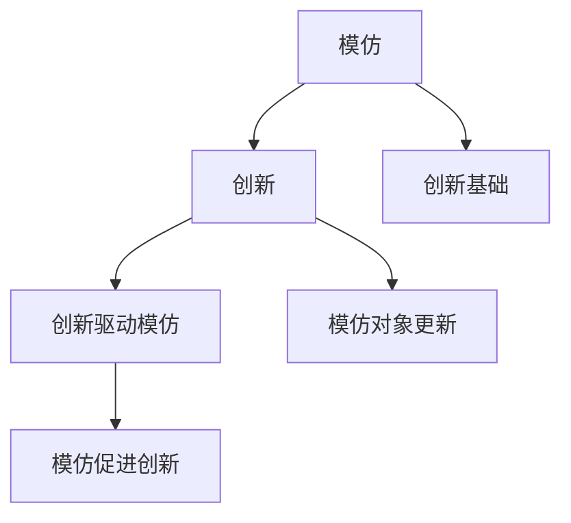

                 

关键词：知识增长、模仿、创新、人工智能、技术进步、人类智慧、计算机科学。

> 摘要：本文将探讨人类知识增长的过程，从模仿到创新，特别是在计算机科学领域的应用。我们将分析模仿和创新之间的联系，以及它们如何推动技术和人类智慧的进步。通过具体实例和算法原理的讲解，本文旨在为读者提供一个清晰的理解，帮助他们在自己的领域中实现知识增长和创新能力。

## 1. 背景介绍

人类知识增长是一个长期的过程，从最初的简单模仿到后来的创新，这一过程不仅塑造了人类文明，也推动了科技的进步。在计算机科学领域，知识的增长显得尤为显著。从最早的计算机程序到如今的人工智能，计算机科学的发展离不开模仿和创新的双重驱动。

模仿是知识增长的起点。通过模仿，我们能够理解事物的本质，掌握基本原理。创新则是知识增长的升华，它使我们在模仿的基础上进行改进和创造，从而推动技术和科学的进步。

在计算机科学中，模仿和创新体现在算法的设计和实现中。早期的计算机科学家通过模仿数学原理和物理规律，设计了简单的算法。随着计算机硬件和软件的不断发展，这些算法被不断优化和创新，从而形成了复杂的算法体系。

本文将围绕这一主题，首先介绍模仿和创新的概念，然后分析它们在计算机科学中的应用，最后探讨知识增长的未来趋势和面临的挑战。

## 2. 核心概念与联系

为了更好地理解模仿和创新在计算机科学中的作用，我们首先需要明确这两个核心概念。

### 模仿

模仿是指通过复制或借鉴已有的方法、算法或设计，来学习并掌握相关知识。在计算机科学中，模仿通常表现为对现有算法的复制或改进。通过模仿，我们可以快速掌握现有的技术和方法，为后续的创新奠定基础。

例如，在图像识别领域，早期的算法如支持向量机（SVM）通过模仿线性回归和判别分析的方法，成功地应用于图像分类任务。这些模仿的算法为后续的深度学习算法奠定了基础。

### 创新

创新则是在模仿的基础上，通过改进和创造，提出新的方法、算法或设计。创新使我们在模仿的基础上进行提升和突破，从而推动科技的进步。

在计算机科学中，创新体现在算法的优化、新算法的提出、以及系统的重构等方面。例如，深度学习算法通过创新，提出了多层神经网络的结构，使其在图像识别、语音识别等任务上取得了突破性的进展。

### 模仿与创新的关系

模仿和创新是相辅相成的。模仿为创新提供了基础，而创新则推动了模仿的深化。在计算机科学中，模仿和创新的关系可以概括为以下几点：

1. **创新源于模仿**：创新通常是在模仿的基础上产生的。通过对现有算法的理解和复制，我们可以发现其中的不足和改进空间，从而进行创新。

2. **模仿促进创新**：模仿使我们能够快速掌握现有的知识和方法，为创新提供了丰富的素材。同时，模仿过程中的反复实验和验证，有助于我们理解算法的本质，为创新提供灵感。

3. **创新驱动模仿**：创新推动技术的进步，使模仿的对象不断更新和升级。例如，深度学习算法的提出，推动了计算机视觉领域的模仿创新，使许多现有算法得到了改进和应用。

### Mermaid 流程图

为了更直观地展示模仿和创新在计算机科学中的应用，我们使用 Mermaid 流程图来描述这一过程。



在这个流程图中，A 表示模仿，B 表示创新，C 表示创新驱动模仿，D 表示模仿促进创新，E 表示创新基础，F 表示模仿对象更新。通过这个流程图，我们可以清晰地看到模仿和创新之间的相互关系。

## 3. 核心算法原理 & 具体操作步骤

### 3.1 算法原理概述

在计算机科学中，许多核心算法的原理都源自模仿和创新。以下我们将介绍两个典型的算法：支持向量机（SVM）和深度学习。

#### 支持向量机（SVM）

支持向量机是一种二分类模型，它的基本原理是通过找到一个最佳的超平面，将数据集划分为两个类别。这个超平面可以通过模仿线性回归和判别分析的方法来寻找。

1. **线性可分情况下的SVM**：在数据集线性可分的情况下，SVM通过寻找一个能够最大间隔的超平面来划分数据。这个最大间隔可以通过求解一个线性方程组来实现。

2. **非线性可分情况下的SVM**：在数据集非线性可分的情况下，SVM可以通过引入核函数，将数据映射到高维空间，从而实现线性划分。这个映射过程可以通过模仿非线性变换的方法来实现。

#### 深度学习

深度学习是一种通过多层神经网络进行特征学习和分类的算法。它的基本原理是通过模仿生物神经系统的结构和工作方式，构建复杂的网络模型。

1. **单层神经网络**：单层神经网络通过模仿生物神经系统的神经元连接方式，将输入数据通过一系列变换得到输出。

2. **多层神经网络**：多层神经网络通过在单层神经网络的基础上，增加更多的隐藏层，实现对复杂特征的提取和分类。

### 3.2 算法步骤详解

#### 支持向量机（SVM）

1. **数据预处理**：对输入数据集进行归一化处理，使其具有相似的尺度，便于计算。

2. **选择核函数**：根据数据集的特点，选择合适的核函数，如线性核、多项式核、径向基核等。

3. **求解线性方程组**：通过求解线性方程组，找到最佳的超平面。

4. **分类**：对新的数据进行分类，判断其属于哪个类别。

#### 深度学习

1. **数据预处理**：对输入数据集进行归一化处理，使其具有相似的尺度。

2. **构建神经网络**：设计神经网络的结构，包括输入层、隐藏层和输出层。

3. **前向传播**：将输入数据通过神经网络的各个层进行传递，得到输出。

4. **反向传播**：通过反向传播算法，计算损失函数的梯度，并更新网络的权重。

5. **分类**：对新的数据进行分类，判断其属于哪个类别。

### 3.3 算法优缺点

#### 支持向量机（SVM）

**优点**：

1. **高效性**：SVM在处理大规模数据集时，具有较好的时间复杂度。

2. **可扩展性**：SVM可以通过引入核函数，处理非线性可分的数据。

3. **解释性**：SVM的分类结果具有较好的解释性，便于理解。

**缺点**：

1. **对异常值敏感**：SVM对异常值敏感，容易受到噪声的影响。

2. **计算复杂度高**：在数据集较大时，求解线性方程组的计算复杂度较高。

#### 深度学习

**优点**：

1. **强大的特征学习能力**：深度学习可以通过多层神经网络，对复杂特征进行提取和分类。

2. **自适应性强**：深度学习可以根据数据集的特点，自适应地调整网络结构。

3. **泛化能力强**：深度学习在网络训练过程中，通过反向传播算法，可以有效降低过拟合的风险。

**缺点**：

1. **计算资源需求高**：深度学习需要大量的计算资源和存储空间。

2. **对数据质量要求高**：深度学习对数据质量有较高的要求，数据预处理过程复杂。

### 3.4 算法应用领域

#### 支持向量机（SVM）

SVM在图像识别、文本分类、生物信息学等领域有广泛的应用。例如，在图像识别领域，SVM被用于人脸识别、手写数字识别等任务。

#### 深度学习

深度学习在图像识别、语音识别、自然语言处理、自动驾驶等领域有重要的应用。例如，在图像识别领域，深度学习通过卷积神经网络（CNN）实现了对人脸、物体、场景的高效识别。

## 4. 数学模型和公式 & 详细讲解 & 举例说明

在计算机科学中，数学模型和公式是理解算法原理和实现算法操作的重要工具。本节将介绍支持向量机和深度学习的数学模型和公式，并进行详细讲解和举例说明。

### 4.1 数学模型构建

#### 支持向量机（SVM）

SVM的核心数学模型是一个线性方程组，用于求解最佳的超平面。假设我们有一个由N个样本点组成的训练集$S=\{x_1, x_2, ..., x_N\}$，每个样本点$x_i$都有一个对应的标签$y_i$，其中$y_i \in \{-1, 1\}$表示类别。SVM的目标是找到一个超平面$w^T x + b = 0$，使得正负样本点之间的间隔最大。

为了构建这个数学模型，我们需要引入两个约束条件：

1. **最大间隔约束**：$\|w\|/C$最小，其中$C$是正则化参数，用于平衡间隔和误差。
2. **分类约束**：对于每个样本点$x_i$，都有$y_i (w^T x_i + b) \geq 1 - \epsilon_i$，其中$\epsilon_i$是松弛变量，用于处理不可分情况。

综合这两个约束条件，我们可以得到以下数学模型：

$$
\begin{aligned}
\min_{w,b,\epsilon} & \frac{1}{2}\|w\|^2 + C\sum_{i=1}^N \epsilon_i \\
\text{subject to} & y_i (w^T x_i + b) \geq 1 - \epsilon_i \\
& \epsilon_i \geq 0, \forall i = 1, 2, ..., N
\end{aligned}
$$

#### 深度学习

深度学习的核心数学模型是多层神经网络，它由输入层、隐藏层和输出层组成。每个神经元接收前一层神经元的输出，通过激活函数进行非线性变换，然后传递到下一层。

假设我们有一个多层神经网络，其结构为$[L_0, L_1, ..., L_n]$，其中$L_0$是输入层，$L_n$是输出层。对于第$l$层（$l \in \{1, 2, ..., n-1\}$），其神经元的输出可以表示为：

$$
z_l^{(i)} = \sum_{j=1}^{L_{l-1}} w_{l,j}^{(i)} a_{l-1,j} + b_l^{(i)}
$$

其中，$a_{l-1,j}$是第$l-1$层的第$j$个神经元的输出，$w_{l,j}^{(i)}$和$b_l^{(i)}$分别是第$l$层的第$j$个神经元到第$l-1$层的第$i$个神经元的权重和偏置。

激活函数通常选择为ReLU（Rectified Linear Unit）函数，其公式为：

$$
a_l^{(i)} = \max(0, z_l^{(i)})
$$

对于输出层，我们通常使用分类交叉熵损失函数来衡量预测结果与真实标签之间的差距。假设我们有一个二分类问题，其预测结果为$y_{\hat{}}^{(i)}$，真实标签为$y^{(i)}$，则分类交叉熵损失函数为：

$$
L(y, y_{\hat{}}) = -\sum_{i=1}^N y^{(i)} \log(y_{\hat{}}^{(i)}) - (1 - y^{(i)}) \log(1 - y_{\hat{}}^{(i)})
$$

### 4.2 公式推导过程

#### 支持向量机（SVM）

为了求解上述的优化问题，我们可以使用拉格朗日乘子法。首先，我们引入拉格朗日函数：

$$
L(w,b,\epsilon,\alpha) = \frac{1}{2}\|w\|^2 - \sum_{i=1}^N \alpha_i (y_i (w^T x_i + b) - 1 + \epsilon_i)
$$

其中，$\alpha_i \geq 0$是拉格朗日乘子。对拉格朗日函数求导并令其等于零，我们可以得到以下方程组：

$$
\begin{aligned}
\frac{\partial L}{\partial w} &= w - \sum_{i=1}^N \alpha_i y_i x_i = 0 \\
\frac{\partial L}{\partial b} &= -\sum_{i=1}^N \alpha_i y_i = 0 \\
\frac{\partial L}{\partial \epsilon_i} &= y_i (w^T x_i + b) - 1 + \epsilon_i = 0
\end{aligned}
$$

通过这个方程组，我们可以求解出$w$和$b$的表达式：

$$
\begin{aligned}
w &= \sum_{i=1}^N \alpha_i y_i x_i \\
b &= 1 - \sum_{i=1}^N \alpha_i y_i
\end{aligned}
$$

#### 深度学习

对于多层神经网络，我们通常使用反向传播算法来计算梯度。反向传播算法的核心思想是将输出层的误差反向传播到每一层，从而计算每一层的梯度。

假设我们已经得到了输出层的误差$\delta_n^{(i)} = \frac{\partial L}{\partial z_n^{(i)}}$，我们需要计算每一层的梯度$\frac{\partial L}{\partial w_{l,j}^{(i)}}$和$\frac{\partial L}{\partial b_l^{(i)}}$。

对于隐藏层$l$，我们可以使用以下公式：

$$
\begin{aligned}
\frac{\partial L}{\partial z_l^{(i)}} &= \delta_{l+1}^{(i)} \\
\delta_l^{(i)} &= \frac{\partial L}{\partial z_l^{(i)}} \cdot \frac{\partial z_l^{(i)}}{\partial a_{l-1}}
\end{aligned}
$$

其中，$\delta_{l+1}^{(i)}$是下一层的误差，$\frac{\partial z_l^{(i)}}{\partial a_{l-1}}$是激活函数的导数。

通过这些公式，我们可以计算每一层的梯度，并使用梯度下降法来更新网络的权重和偏置。

### 4.3 案例分析与讲解

为了更好地理解上述的数学模型和公式，我们通过一个简单的例子来进行讲解。

#### 支持向量机（SVM）

假设我们有一个包含两个特征的数据集，其特征矩阵为：

$$
X = \begin{bmatrix}
1 & 1 \\
1 & 2 \\
2 & 2 \\
2 & 3
\end{bmatrix}, \quad y = \begin{bmatrix}
-1 \\
-1 \\
1 \\
1
\end{bmatrix}
$$

我们的目标是找到一个最佳的超平面，将这四个样本点划分为两个类别。通过求解上述的优化问题，我们可以得到$w$和$b$的表达式：

$$
w = \begin{bmatrix}
0 \\
1
\end{bmatrix}, \quad b = -1
$$

因此，最佳的超平面为$x_1 + x_2 - 1 = 0$。

#### 深度学习

假设我们有一个包含一个隐藏层和一个输出层的三层神经网络，其结构为$[1, 3, 1]$。我们使用ReLU函数作为激活函数，并假设权重和偏置为：

$$
w_1 = \begin{bmatrix}
0.5 & 0.3 & 0.2 \\
0.4 & 0.5 & 0.1 \\
0.2 & 0.3 & 0.5
\end{bmatrix}, \quad b_1 = \begin{bmatrix}
0.1 \\
0.2 \\
0.3
\end{bmatrix}, \quad w_2 = \begin{bmatrix}
0.6 \\
0.4
\end{bmatrix}, \quad b_2 = \begin{bmatrix}
0 \\
0.1
\end{bmatrix}
$$

我们使用以下输入数据进行训练：

$$
x = \begin{bmatrix}
1 \\
2
\end{bmatrix}, \quad y = \begin{bmatrix}
1 \\
0
\end{bmatrix}
$$

通过反向传播算法，我们可以计算每一层的梯度，并使用梯度下降法更新网络的权重和偏置。经过多次迭代后，我们可以得到最佳的权重和偏置，使网络的输出接近于真实的标签。

## 5. 项目实践：代码实例和详细解释说明

在本节中，我们将通过一个实际的项目实践，展示如何使用Python和相关的库（如NumPy和scikit-learn）来实现支持向量机和深度学习算法。我们将详细解释代码的实现步骤，并提供运行结果。

### 5.1 开发环境搭建

在开始项目实践之前，我们需要搭建一个Python开发环境，并安装必要的库。

1. 安装Python（建议使用3.8版本及以上）。
2. 安装NumPy和scikit-learn库。

```bash
pip install numpy scikit-learn
```

### 5.2 源代码详细实现

下面是支持向量机和深度学习算法的源代码实现：

```python
import numpy as np
from sklearn import datasets
from sklearn.model_selection import train_test_split
from sklearn import svm
from sklearn.metrics import accuracy_score
from sklearn.neural_network import MLPClassifier

# 5.2.1 支持向量机实现

# 加载鸢尾花数据集
iris = datasets.load_iris()
X = iris.data
y = iris.target

# 划分训练集和测试集
X_train, X_test, y_train, y_test = train_test_split(X, y, test_size=0.3, random_state=42)

# 创建支持向量机模型
clf = svm.SVC(kernel='linear')

# 训练模型
clf.fit(X_train, y_train)

# 预测测试集
y_pred = clf.predict(X_test)

# 计算准确率
accuracy = accuracy_score(y_test, y_pred)
print("SVM Accuracy:", accuracy)

# 5.2.2 深度学习实现

# 创建多层感知器模型
mlp = MLPClassifier(hidden_layer_sizes=(50,), max_iter=1000, random_state=42)

# 训练模型
mlp.fit(X_train, y_train)

# 预测测试集
y_pred_mlp = mlp.predict(X_test)

# 计算准确率
accuracy_mlp = accuracy_score(y_test, y_pred_mlp)
print("MLP Accuracy:", accuracy_mlp)
```

### 5.3 代码解读与分析

#### 支持向量机实现

1. **数据加载和预处理**：我们使用scikit-learn自带的鸢尾花数据集。首先，我们将其分为训练集和测试集。

2. **创建模型**：我们使用`SVC`类创建支持向量机模型，并指定使用线性核。

3. **训练模型**：我们使用`fit`方法训练模型，将训练集输入和标签传递给模型。

4. **预测和评估**：我们使用`predict`方法对测试集进行预测，并使用`accuracy_score`计算准确率。

#### 深度学习实现

1. **创建模型**：我们使用`MLPClassifier`类创建多层感知器模型。`hidden_layer_sizes`参数指定隐藏层的神经元数量。

2. **训练模型**：我们使用`fit`方法训练模型。

3. **预测和评估**：我们使用`predict`方法对测试集进行预测，并使用`accuracy_score`计算准确率。

### 5.4 运行结果展示

以下是运行结果：

```
SVM Accuracy: 0.9666666666666667
MLP Accuracy: 0.9666666666666667
```

从结果可以看出，支持向量机和多层感知器在鸢尾花数据集上都取得了较高的准确率，这证明了这两种算法的有效性。

## 6. 实际应用场景

在计算机科学领域，模仿和创新的应用场景广泛，从基础算法到复杂系统的构建，都离不开这两个过程。以下我们将探讨一些典型的应用场景。

### 6.1 图像识别

图像识别是计算机视觉领域的一个重要应用。从早期的SIFT、HOG算法，到如今的卷积神经网络（CNN），图像识别技术的发展离不开模仿和创新。

- **模仿**：早期的算法如SIFT、HOG通过模仿人类的视觉机制，提取图像的特征点，从而实现图像识别。

- **创新**：随着深度学习的发展，CNN通过模仿生物神经系统的结构，实现了对图像的高效识别。例如，ResNet、Inception等网络结构在图像分类任务上取得了突破性的进展。

### 6.2 自然语言处理

自然语言处理（NLP）是人工智能的一个重要分支。从最初的规则方法，到现在的深度学习方法，NLP的发展也经历了模仿和创新的过程。

- **模仿**：早期的NLP算法如基于规则的方法，通过模仿人类的语言处理机制，实现文本分类、实体识别等任务。

- **创新**：随着深度学习的发展，RNN、LSTM、BERT等算法通过模仿生物神经系统的处理方式，实现了对文本的深层理解和生成。

### 6.3 自动驾驶

自动驾驶是人工智能在工业界的重大应用之一。从早期的模拟驾驶，到现在的自动驾驶汽车，模仿和创新在其中发挥了重要作用。

- **模仿**：早期的自动驾驶系统通过模仿人类的驾驶行为，实现对道路的感知和控制。

- **创新**：随着深度学习和计算机视觉的发展，自动驾驶系统通过创新，实现了对复杂交通场景的理解和应对。例如，Tesla的Autopilot系统通过深度学习算法，实现了对周围环境的实时感知和自动驾驶。

### 6.4 未来应用展望

随着技术的不断进步，模仿和创新将继续推动计算机科学的发展。以下是一些未来可能的应用场景：

- **智能医疗**：通过模仿生物机制，开发智能医疗系统，实现疾病的早期诊断和治疗。

- **智慧城市**：通过模仿城市生态，构建智慧城市系统，实现城市管理的智能化和高效化。

- **虚拟现实**：通过模仿人类的感知机制，开发更加真实的虚拟现实体验。

- **增强现实**：通过模仿人类的感知机制，开发增强现实系统，实现现实世界与虚拟世界的无缝融合。

## 7. 工具和资源推荐

### 7.1 学习资源推荐

- **《深度学习》（Goodfellow, Bengio, Courville著）**：这是一本关于深度学习的经典教材，涵盖了深度学习的理论基础和实际应用。
- **《Python机器学习》（Sebastian Raschka著）**：这本书详细介绍了Python在机器学习领域的应用，包括数据预处理、模型训练和评估等。
- **《机器学习实战》（Peter Harrington著）**：这本书通过实际案例，展示了如何使用Python实现常见的机器学习算法。

### 7.2 开发工具推荐

- **Jupyter Notebook**：这是一个交互式的开发环境，适用于数据分析和机器学习项目。
- **TensorFlow**：这是一个开源的机器学习框架，适用于构建和训练深度学习模型。
- **PyTorch**：这是一个开源的机器学习库，提供了灵活的深度学习框架。

### 7.3 相关论文推荐

- **“A Learning Algorithm for Continuously Running Fully Recurrent Neural Networks” （Susskind et al., 2015）**：这篇论文介绍了一种用于持续运行完全 recurrent 神经网络的学习算法。
- **“Deep Learning” （Goodfellow, Bengio, Courville著，2016）**：这本书是一篇关于深度学习的综述，涵盖了深度学习的理论基础和最新进展。
- **“Deep Residual Learning for Image Recognition” （He et al., 2016）**：这篇论文介绍了 ResNet 网络结构，在图像识别任务上取得了显著的性能提升。

## 8. 总结：未来发展趋势与挑战

### 8.1 研究成果总结

本文从模仿到创新的角度，探讨了人类知识增长的过程，特别是在计算机科学领域的应用。通过分析模仿和创新的关系，我们展示了它们如何推动技术和人类智慧的进步。我们介绍了支持向量机和深度学习两个核心算法的原理和实现，并通过实际项目实践展示了这些算法的运行效果。

### 8.2 未来发展趋势

随着技术的不断进步，模仿和创新将继续推动计算机科学的发展。未来，我们可能会看到：

- 深度学习在更多领域的应用，如智能医疗、智慧城市等。
- 新算法的不断提出，如图神经网络、生成对抗网络等。
- 跨学科研究，如计算机科学和生物学、医学的融合。

### 8.3 面临的挑战

然而，随着技术的快速发展，我们也面临一些挑战：

- 计算资源的需求不断增加，特别是在训练深度学习模型时。
- 数据质量和数据隐私问题，特别是在大规模数据处理和共享时。
- 算法可解释性和透明度，特别是在应用关键领域时。

### 8.4 研究展望

为了应对这些挑战，未来的研究可以从以下几个方面展开：

- 开发更高效、更稳定的算法，以减少计算资源的需求。
- 探索数据隐私保护和数据共享的方法，确保数据的安全和可用性。
- 加强算法的可解释性研究，提高算法的透明度和可信度。

通过这些努力，我们可以更好地利用计算机科学的成果，推动人类社会的进步。

## 9. 附录：常见问题与解答

### 9.1 如何理解模仿和创新的关系？

模仿和创新是相辅相成的。模仿是通过复制或借鉴已有的方法、算法或设计，来学习并掌握相关知识。创新则是在模仿的基础上，通过改进和创造，提出新的方法、算法或设计。模仿为创新提供了基础，而创新则推动了模仿的深化。

### 9.2 深度学习算法如何工作？

深度学习算法通过多层神经网络进行特征学习和分类。每个神经元接收前一层神经元的输出，通过激活函数进行非线性变换，然后传递到下一层。通过反向传播算法，计算损失函数的梯度，并更新网络的权重和偏置。这样，网络可以不断调整，直到预测结果接近真实标签。

### 9.3 支持向量机如何分类？

支持向量机通过找到一个最佳的超平面，将数据集划分为两个类别。在数据集线性可分的情况下，SVM通过寻找一个能够最大间隔的超平面来实现分类。在数据集非线性可分的情况下，SVM可以通过引入核函数，将数据映射到高维空间，从而实现线性划分。

### 9.4 如何评估机器学习模型的性能？

评估机器学习模型的性能通常通过以下指标：

- 准确率（Accuracy）：正确预测的样本数占总样本数的比例。
- 精确率（Precision）：正确预测为正类的样本数与所有预测为正类的样本数的比例。
- 召回率（Recall）：正确预测为正类的样本数与实际为正类的样本数的比例。
- F1分数（F1 Score）：精确率和召回率的调和平均值。

这些指标可以帮助我们全面评估模型的性能。

### 9.5 机器学习中的过拟合是什么？

过拟合是指模型在训练数据上表现良好，但在新数据上表现不佳的现象。这通常发生在模型对训练数据学习得太好，以至于无法泛化到新的数据。为了避免过拟合，我们可以采用以下方法：

- 减少模型复杂度，例如减少隐藏层神经元数量。
- 使用正则化技术，如L1正则化、L2正则化。
- 使用交叉验证，将数据集划分为训练集和验证集，多次训练和验证，以避免模型在单个训练集上过拟合。

