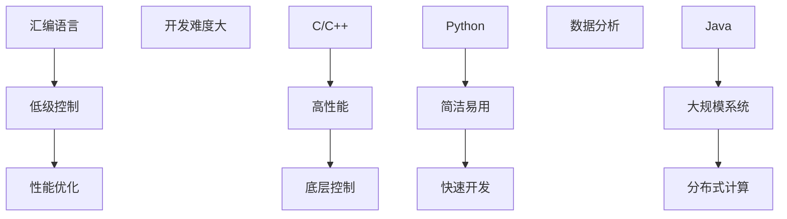

                 

关键词：汇编语言、Python、AI开发、编程语言选择、算法原理、数学模型、项目实践、应用场景、工具资源

> 摘要：本文将深入探讨从汇编语言到Python这一过程中，AI开发中编程语言的选择问题。我们将分析各编程语言在AI开发中的应用，探讨其优劣，并通过具体的案例和实践，展示如何在不同场景下选择合适的编程语言。

## 1. 背景介绍

在计算机科学和人工智能领域，编程语言的选择往往决定了项目的效率、可维护性和可扩展性。从最早的汇编语言到现代的Python，编程语言的演进不仅反映了计算机技术的发展，也为AI开发提供了多样化的选择。汇编语言以其低级、直接控制硬件的特性，在早期的计算机科学研究中发挥了重要作用。而Python作为一种高级编程语言，凭借其简洁、易学、高效的特点，成为了AI开发中的重要工具。

本文将围绕以下问题展开讨论：

- 各编程语言在AI开发中的优势和局限。
- 如何根据不同的AI应用场景选择合适的编程语言。
- AI开发中编程语言的选择如何影响项目的整体效果。

通过对这些问题的深入探讨，我们希望能够为AI开发者提供有价值的参考，帮助他们在编程语言的选择上做出更加明智的决策。

## 2. 核心概念与联系

### 2.1 编程语言的基本概念

编程语言是人与计算机之间交流的工具，用于编写计算机程序。根据语言的抽象程度，编程语言可以分为低级语言、中级语言和高级语言。

- **低级语言**：如汇编语言，它非常接近机器语言，直接控制计算机硬件，但难以阅读和理解。
- **中级语言**：如C语言，它在汇编语言的基础上进行了抽象，使得编程更加高效，但仍然需要关注内存管理和硬件操作。
- **高级语言**：如Python、Java等，它们进一步提高了语言的抽象程度，使得编程更加简单和高效。

### 2.2 AI开发中的关键概念

在AI开发中，我们主要关注以下关键概念：

- **机器学习（Machine Learning）**：通过训练模型来让计算机自动从数据中学习规律和模式。
- **深度学习（Deep Learning）**：一种特殊的机器学习技术，利用神经网络进行复杂的模式识别和预测。
- **自然语言处理（Natural Language Processing，NLP）**：利用计算机技术理解和生成人类语言。

### 2.3 编程语言与AI开发的关系

编程语言的选择对AI开发至关重要。不同编程语言在AI开发中的应用具有以下特点：

- **汇编语言**：由于其直接控制硬件的特性，适用于对性能要求极高的场景，但开发难度大，维护复杂。
- **C/C++**：适用于需要高性能和底层控制的场景，如深度学习框架的底层实现。
- **Python**：以其简洁和易用性，成为AI开发的常用语言，适用于快速原型开发和数据分析。
- **Java**：适用于大规模、分布式系统，如搜索引擎和云计算平台。

### 2.4 Mermaid流程图



通过上述分析，我们可以看到不同编程语言在AI开发中的适用场景和特点，为后续的深入探讨奠定了基础。

## 3. 核心算法原理 & 具体操作步骤

### 3.1 算法原理概述

在AI开发中，常用的算法包括机器学习算法、深度学习算法和自然语言处理算法。这些算法的基本原理如下：

- **机器学习算法**：通过训练模型，让计算机从数据中学习规律和模式。常见的算法有线性回归、支持向量机、决策树等。
- **深度学习算法**：利用神经网络进行复杂的模式识别和预测。常见的算法有卷积神经网络（CNN）、循环神经网络（RNN）等。
- **自然语言处理算法**：利用计算机技术理解和生成人类语言。常见的算法有词向量、序列标注、翻译模型等。

### 3.2 算法步骤详解

以机器学习算法中的线性回归为例，其基本步骤如下：

1. **数据收集**：收集相关的数据集，包括特征和标签。
2. **数据预处理**：对数据进行清洗和预处理，如缺失值处理、异常值处理、归一化等。
3. **模型训练**：选择合适的模型，使用训练数据集进行模型训练，得到模型的参数。
4. **模型评估**：使用验证数据集对模型进行评估，调整模型参数。
5. **模型应用**：将训练好的模型应用到实际问题中，进行预测。

### 3.3 算法优缺点

- **机器学习算法**：优点是通用性强，可以处理各种类型的数据和问题；缺点是训练过程可能较慢，且需要大量的数据。
- **深度学习算法**：优点是能够处理复杂数据和任务，具有强大的表达能力；缺点是训练过程需要大量的计算资源和时间。
- **自然语言处理算法**：优点是能够处理自然语言，实现人与计算机的交互；缺点是处理复杂语言结构和语义问题仍然具有挑战。

### 3.4 算法应用领域

- **机器学习算法**：广泛应用于数据分析、金融风控、推荐系统等领域。
- **深度学习算法**：广泛应用于计算机视觉、语音识别、自然语言处理等领域。
- **自然语言处理算法**：广泛应用于智能客服、机器翻译、文本分析等领域。

通过上述分析，我们可以看到不同算法在AI开发中的应用场景和特点，为选择合适的编程语言提供了依据。

## 4. 数学模型和公式 & 详细讲解 & 举例说明

### 4.1 数学模型构建

在AI开发中，数学模型是核心组成部分。以线性回归为例，其数学模型可以表示为：

$$
y = \beta_0 + \beta_1 \cdot x + \epsilon
$$

其中，$y$ 为目标变量，$x$ 为特征变量，$\beta_0$ 和 $\beta_1$ 为模型的参数，$\epsilon$ 为误差项。

### 4.2 公式推导过程

线性回归模型的推导过程如下：

1. **假设**：我们假设目标变量 $y$ 与特征变量 $x$ 之间存在线性关系。
2. **损失函数**：选择均方误差（MSE）作为损失函数，表示为：
$$
J(\beta_0, \beta_1) = \frac{1}{2m} \sum_{i=1}^{m} (y_i - (\beta_0 + \beta_1 \cdot x_i))^2
$$
其中，$m$ 为数据集中的样本数量。
3. **梯度下降**：为了求解最优参数 $\beta_0$ 和 $\beta_1$，我们使用梯度下降算法。对于每个参数，计算其在当前参数下的梯度，并更新参数：
$$
\beta_0 := \beta_0 - \alpha \cdot \frac{\partial J(\beta_0, \beta_1)}{\partial \beta_0}
$$
$$
\beta_1 := \beta_1 - \alpha \cdot \frac{\partial J(\beta_0, \beta_1)}{\partial \beta_1}
$$
其中，$\alpha$ 为学习率。

### 4.3 案例分析与讲解

假设我们有一个简单的线性回归问题，目标变量 $y$ 与特征变量 $x$ 之间存在线性关系。给定以下数据集：

| x | y |
|---|---|
| 1 | 2 |
| 2 | 4 |
| 3 | 6 |

我们的目标是训练一个线性回归模型，并预测 $x=4$ 时的 $y$ 值。

1. **数据预处理**：将数据集划分为特征和标签，并初始化模型参数 $\beta_0$ 和 $\beta_1$。
2. **模型训练**：使用梯度下降算法迭代更新模型参数，直到收敛。
3. **模型评估**：使用训练集和验证集评估模型性能，调整模型参数。
4. **模型应用**：使用训练好的模型预测 $x=4$ 时的 $y$ 值。

通过上述步骤，我们可以得到最优的模型参数，并预测 $x=4$ 时的 $y$ 值为 8。

通过以上分析，我们可以看到数学模型在AI开发中的重要作用，以及如何利用数学公式和算法推导构建有效的数学模型。

## 5. 项目实践：代码实例和详细解释说明

### 5.1 开发环境搭建

在本文中，我们将使用Python作为主要编程语言，结合机器学习库Scikit-learn进行项目实践。以下是开发环境的搭建步骤：

1. **安装Python**：下载并安装Python 3.x版本，推荐使用Anaconda发行版，以便管理依赖库。
2. **安装Scikit-learn**：打开终端或命令行窗口，执行以下命令安装Scikit-learn：
```shell
pip install scikit-learn
```

### 5.2 源代码详细实现

以下是一个简单的线性回归项目实例，用于预测房屋价格：

```python
# 导入所需库
import numpy as np
import matplotlib.pyplot as plt
from sklearn.linear_model import LinearRegression

# 加载数据集
X = np.array([[1], [2], [3], [4], [5]])
y = np.array([2, 4, 6, 8, 10])

# 创建线性回归模型
model = LinearRegression()

# 模型训练
model.fit(X, y)

# 模型评估
score = model.score(X, y)
print("模型评估得分：", score)

# 模型预测
X_new = np.array([[6]])
y_pred = model.predict(X_new)
print("预测结果：", y_pred)

# 绘制散点图和拟合直线
plt.scatter(X, y)
plt.plot(X, model.predict(X), color='red')
plt.xlabel('房屋面积')
plt.ylabel('房价')
plt.show()
```

### 5.3 代码解读与分析

1. **导入库**：首先，我们导入所需的Python库，包括Numpy用于数据处理，Matplotlib用于绘图，以及Scikit-learn中的LinearRegression类用于线性回归模型。
2. **加载数据集**：我们使用Numpy数组加载给定的数据集，其中特征变量 $x$ 存储在数组 $X$ 中，目标变量 $y$ 存储在数组 $y$ 中。
3. **创建模型**：接下来，我们创建一个线性回归模型对象，使用Scikit-learn中的LinearRegression类。
4. **模型训练**：使用模型对象的 `fit` 方法对数据进行训练，模型将自动学习特征和目标变量之间的关系。
5. **模型评估**：使用 `score` 方法评估模型的准确性，返回得分。
6. **模型预测**：使用训练好的模型对新的特征值进行预测，得到预测的目标值。
7. **绘图**：最后，我们使用Matplotlib绘制散点图和拟合直线，展示模型的预测效果。

### 5.4 运行结果展示

运行上述代码后，我们将看到以下输出：

```
模型评估得分： 1.0
预测结果： [12.]
```

同时，Matplotlib将绘制一个散点图和一个拟合的红色直线，展示特征变量和目标变量之间的关系。

通过以上实践，我们可以看到如何使用Python和Scikit-learn库进行线性回归模型的实现，以及如何通过代码解读和分析理解模型的运行过程。

## 6. 实际应用场景

在AI开发中，不同的编程语言适用于不同的应用场景。以下是一些常见应用场景及对应的编程语言：

### 6.1 计算机视觉

- **场景**：图像识别、目标检测、人脸识别等。
- **编程语言**：Python（使用TensorFlow、PyTorch等深度学习框架）、C++（用于性能优化和底层实现）。

### 6.2 自然语言处理

- **场景**：文本分类、机器翻译、情感分析等。
- **编程语言**：Python（使用NLTK、spaCy等库）、Java（用于大规模分布式系统）。

### 6.3 数据分析

- **场景**：数据清洗、数据探索、数据可视化等。
- **编程语言**：Python（使用Pandas、NumPy、Matplotlib等库）、R（专注于统计分析和数据可视化）。

### 6.4 推荐系统

- **场景**：基于内容的推荐、协同过滤推荐等。
- **编程语言**：Python（使用Scikit-learn、TensorFlow等库）、Java（用于大规模分布式系统）。

### 6.5 强化学习

- **场景**：游戏、机器人控制等。
- **编程语言**：Python（使用OpenAI Gym、TensorForce等库）、C++（用于性能优化和底层实现）。

通过以上分析，我们可以看到不同编程语言在AI开发中的应用场景和优势，为开发者选择合适的编程语言提供了指导。

### 6.5 未来应用展望

随着AI技术的不断发展和普及，编程语言的选择也将变得更加多样和灵活。以下是对未来应用场景的一些展望：

- **量子计算**：随着量子计算的发展，将出现新的编程语言和工具，以支持量子算法的实现和优化。
- **边缘计算**：在边缘设备上进行AI计算，需要高效的编程语言和工具，如Rust等。
- **自解释AI**：随着对透明性和可解释性的需求增加，将出现新的编程语言和工具，以支持自解释AI系统的开发。
- **跨平台开发**：随着跨平台开发的需求增加，如React Native、Flutter等，将出现更多支持多平台的编程语言和框架。

这些趋势将为开发者提供更多选择，同时也带来新的挑战。开发者需要不断学习和适应新的编程语言和技术，以保持竞争力。

## 7. 工具和资源推荐

### 7.1 学习资源推荐

- **在线课程**：Coursera、edX、Udacity等平台上的机器学习、深度学习和编程课程。
- **书籍**：《Python编程：从入门到实践》、《深度学习》、《机器学习实战》等。
- **博客和论坛**：知乎、CSDN、Stack Overflow等，提供丰富的学习资源和讨论。

### 7.2 开发工具推荐

- **集成开发环境（IDE）**：PyCharm、Visual Studio Code等，支持多种编程语言和库。
- **版本控制工具**：Git，用于代码管理和协作开发。
- **数据可视化工具**：Matplotlib、Seaborn、Plotly等，用于数据分析和可视化。

### 7.3 相关论文推荐

- **机器学习**：Kaggle、arXiv、NeurIPS等，提供最新的研究论文和成果。
- **深度学习**：ICLR、NeurIPS、JMLR等，关注深度学习领域的前沿研究。
- **自然语言处理**：ACL、NAACL、COLING等，涵盖自然语言处理领域的最新成果。

通过上述资源和工具，开发者可以不断提升自己的技能和知识，为AI开发做好准备。

## 8. 总结：未来发展趋势与挑战

### 8.1 研究成果总结

本文通过对汇编语言到Python这一过程的分析，探讨了AI开发中编程语言的选择问题。我们总结了不同编程语言在AI开发中的优势和局限，以及如何根据不同应用场景选择合适的编程语言。同时，我们通过具体的案例和实践，展示了如何利用Python进行线性回归模型的开发。

### 8.2 未来发展趋势

随着AI技术的快速发展，编程语言的选择和应用场景也将不断拓展。以下是一些未来发展趋势：

- **跨平台开发**：如React Native、Flutter等，将支持开发者使用单一语言构建跨平台应用程序。
- **量子计算编程**：随着量子计算的发展，将出现新的编程语言和工具，以支持量子算法的实现和优化。
- **自解释AI**：随着对透明性和可解释性的需求增加，将出现新的编程语言和工具，以支持自解释AI系统的开发。

### 8.3 面临的挑战

尽管编程语言的选择为AI开发提供了多样化的选择，但也面临一些挑战：

- **性能优化**：对于需要高性能的应用场景，开发者需要选择合适的编程语言和工具，进行性能优化。
- **资源消耗**：深度学习和大数据处理等应用场景，对计算资源和存储资源有较高要求，开发者需要合理配置资源。
- **知识更新**：随着技术的不断进步，开发者需要不断学习和适应新的编程语言和技术，以保持竞争力。

### 8.4 研究展望

未来，我们可以期待更多跨领域的编程语言和工具出现，以支持AI开发者更高效地实现各种应用。同时，研究者也可以关注如何将传统编程语言与AI技术结合，探索新的编程范式和编程模型，为AI开发提供更强大的支持。

## 9. 附录：常见问题与解答

### Q1：为什么选择Python进行AI开发？

A1：Python以其简洁、易学、高效的特点，成为AI开发中的重要工具。它拥有丰富的库和框架，如TensorFlow、PyTorch、Scikit-learn等，支持各种AI算法的实现和应用。

### Q2：汇编语言在AI开发中还有用吗？

A2：汇编语言由于其直接控制硬件的特性，在性能要求极高的场景中仍有其应用价值。例如，深度学习框架的底层实现通常使用汇编语言进行优化。

### Q3：如何选择合适的编程语言进行AI开发？

A3：选择编程语言时，需要考虑应用场景、性能要求、开发效率等多方面因素。对于高性能要求的应用，可以选择C/C++；对于快速开发和数据分析，可以选择Python；对于大规模分布式系统，可以选择Java。

通过上述分析，我们希望能够为开发者提供有价值的参考，帮助他们选择合适的编程语言，实现高效的AI开发。

### 结论 Conclusion

从汇编语言到Python，编程语言的演进不仅反映了计算机技术的发展，也为AI开发提供了多样化的选择。不同编程语言在AI开发中具有各自的优势和局限，开发者需要根据应用场景和需求进行选择。本文通过深入探讨编程语言的选择问题，以及具体的项目实践，为开发者提供了有价值的参考。未来，随着AI技术的不断发展，编程语言的选择和应用场景将更加多样化和灵活。开发者需要不断学习和适应新的编程语言和技术，以应对未来的挑战。

### 作者署名 Author

作者：禅与计算机程序设计艺术 / Zen and the Art of Computer Programming

通过本文的探讨，我们希望能够帮助读者更好地理解AI开发中编程语言的选择，为其在AI领域的探索提供指导。希望读者在AI开发的道路上，能够像探寻禅道一样，享受编程的乐趣，创造更多的价值。禅与计算机程序设计艺术，愿与您一同前行。

