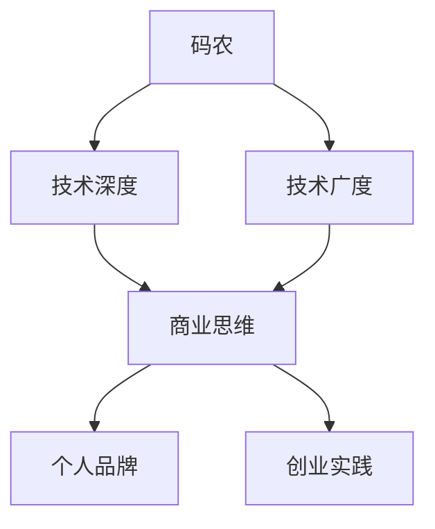

                 

关键词：码农、知识创业者、职业发展、技术变现、个人品牌、创业思维

> 摘要：本文旨在探讨从一名普通的程序员（码农）蜕变成为知识创业者的过程。通过分析职业发展的阶段性转变，以及如何利用技术知识和个人优势进行创业，作者将分享实战经验和策略，帮助读者理解并迈向知识创业者的道路。

## 1. 背景介绍

在信息技术飞速发展的今天，程序员作为数字化时代的重要角色，不仅承担着软件开发和运维的重任，更是推动社会进步的重要力量。然而，随着职业发展的深入，许多程序员开始面临职业瓶颈，他们渴望有更多的机会去创造价值，实现自我价值。这就引出了本文探讨的核心问题：从码农到知识创业者的蜕变之路。

### 1.1 码农的职业现状

码农，通常是指那些从事编程工作的程序员。他们在工作中主要负责代码的编写、调试、测试和维护。这一群体在互联网公司、IT企业以及各类技术团队中占据了重要位置。然而，随着技术的更新迭代，码农们常常感受到巨大的压力。一方面，技术栈不断变化，新的编程语言、框架和技术层出不穷；另一方面，市场上对程序员的需求不断增加，但竞争也日益激烈。

### 1.2 知识创业者的定义

知识创业者，是指那些通过将自己的专业知识、技能和经验转化为产品或服务，从而实现商业价值的人群。知识创业者不仅具备深厚的技术背景，更具备敏锐的市场洞察力和优秀的商业运营能力。他们通过分享知识、提供咨询服务、开发软件产品等方式，实现了个人价值的最大化。

## 2. 核心概念与联系

### 2.1 码农到知识创业者的转变

#### 2.1.1 技术深度与广度的平衡

码农在职业发展的初期，通常专注于特定领域的技术深度积累。然而，知识创业者需要具备更广泛的技术视野，不仅要在某个领域有深厚的积累，还要了解多个技术领域的最新动态和发展趋势。

#### 2.1.2 技术能力与商业思维的结合

码农擅长技术，但知识创业者需要将技术能力与商业思维相结合。这意味着他们不仅要能够解决技术问题，还要能够将技术转化为市场需求，实现商业价值。

#### 2.1.3 个人品牌的打造

码农通常是团队的成员，而知识创业者则需要建立个人品牌，提升个人影响力。通过写作、演讲、开源项目等方式，知识创业者可以积累大量的粉丝和关注者，从而为自己的创业项目奠定基础。

### 2.2 Mermaid 流程图



## 3. 核心算法原理 & 具体操作步骤

### 3.1 算法原理概述

知识创业者的核心算法，可以概括为以下几个步骤：

1. **技术积累**：在某个领域深入研究和实践，形成扎实的技术基础。
2. **市场调研**：了解市场需求，找到切入点。
3. **产品开发**：将技术能力转化为具体的产品或服务。
4. **品牌建设**：通过多种渠道提升个人和产品的知名度。
5. **持续迭代**：根据市场反馈，不断优化产品和自身能力。

### 3.2 算法步骤详解

1. **技术积累**
   - 选择领域：根据个人兴趣和市场需求，选择一个具有潜力的技术领域。
   - 学习与实践：不断学习新技术，参与开源项目，提升自己的技术水平。

2. **市场调研**
   - 竞品分析：了解同行业内其他人的产品和服务。
   - 用户调研：通过问卷调查、用户访谈等方式，了解潜在用户的需求。

3. **产品开发**
   - 产品规划：确定产品的目标用户、功能和定位。
   - 技术实现：利用所学技术，开发原型产品。
   - 测试与优化：进行用户测试，收集反馈，不断优化产品。

4. **品牌建设**
   - 内容创作：撰写技术博客、发布技术文章，分享自己的经验和见解。
   - 社交媒体：在社交媒体上分享内容，与粉丝互动，建立个人品牌。
   - 活动参与：参加技术会议、分享会，提升个人影响力。

5. **持续迭代**
   - 数据分析：收集用户数据，分析产品使用情况，了解市场反馈。
   - 产品优化：根据数据分析结果，对产品进行优化。
   - 技术升级：关注新技术动态，适时更新技术栈。

### 3.3 算法优缺点

**优点**：
- **灵活性**：知识创业者可以根据市场需求和个人兴趣，灵活调整创业方向。
- **高回报**：通过技术变现，知识创业者可以获得较高的经济回报。
- **成就感**：将自己的技术知识和经验分享给他人，实现个人价值的提升。

**缺点**：
- **高门槛**：需要具备深厚的技术背景和商业思维。
- **风险**：创业过程中存在一定的风险，如市场不认可、资金不足等。

### 3.4 算法应用领域

知识创业者的算法原理可以应用于多个领域，如：

- **技术咨询服务**：为企业提供技术解决方案。
- **软件开发**：开发定制化软件产品。
- **在线教育**：开设线上课程，分享技术知识。
- **开源项目**：参与开源项目，提升个人影响力。

## 4. 数学模型和公式 & 详细讲解 & 举例说明

### 4.1 数学模型构建

知识创业者的成功可以看作是一个多维度的数学模型，涉及以下几个关键变量：

- 技术水平（T）
- 商业洞察力（B）
- 个人品牌影响力（P）
- 创新能力（I）
- 市场需求（M）

成功模型可以表示为：

$$
S = f(T, B, P, I, M)
$$

其中，$S$ 表示知识创业者的成功程度，$T, B, P, I, M$ 分别代表技术水平、商业洞察力、个人品牌影响力、创新能力和市场需求。

### 4.2 公式推导过程

成功模型中的各个变量可以通过以下方式推导得出：

- **技术水平（T）**：通过长期的技术学习和实践积累。
- **商业洞察力（B）**：通过对市场的深入了解和数据分析。
- **个人品牌影响力（P）**：通过内容创作、社交媒体互动和活动参与建立。
- **创新能力（I）**：通过不断尝试新想法和解决方案。
- **市场需求（M）**：通过用户调研和竞品分析得出。

将这些变量带入成功模型，可以得到知识创业者的成功程度。

### 4.3 案例分析与讲解

以一位资深程序员小李为例，他在转型为知识创业者之前，已经在某个技术领域深耕多年，具备丰富的技术经验和深厚的功底。在转型过程中，他采取了以下措施：

1. **技术积累**：持续学习新技术，参加各种技术培训和研讨会。
2. **市场调研**：通过用户访谈和竞品分析，了解市场需求。
3. **产品开发**：基于市场需求，开发了多个定制化的软件产品。
4. **品牌建设**：撰写技术博客，分享自己的经验和见解，积累了一批忠实的粉丝。
5. **持续迭代**：根据用户反馈，不断优化产品。

通过这些措施，小李成功地将自己的技术知识和经验转化为商业价值，成为了一名成功的知识创业者。

## 5. 项目实践：代码实例和详细解释说明

### 5.1 开发环境搭建

在开始实践项目之前，我们需要搭建一个合适的开发环境。以下是一个基本的开发环境搭建步骤：

1. 安装操作系统：推荐使用Linux系统，如Ubuntu。
2. 安装编程语言：选择一种熟悉的编程语言，如Python。
3. 安装开发工具：安装代码编辑器（如Visual Studio Code）和版本控制工具（如Git）。
4. 配置环境变量：设置好Python和开发工具的环境变量。

### 5.2 源代码详细实现

以下是一个简单的Python脚本，用于实现一个简单的计算器功能。

```python
# 计算器功能实现

def add(a, b):
    return a + b

def subtract(a, b):
    return a - b

def multiply(a, b):
    return a * b

def divide(a, b):
    if b == 0:
        return "除数不能为0"
    return a / b

# 主函数
def main():
    while True:
        print("选择操作：1. 加 2. 减 3. 乘 4. 除 5. 退出")
        choice = input("请输入您的选择：")
        if choice == "1":
            a = float(input("请输入第一个数："))
            b = float(input("请输入第二个数："))
            print("结果：", add(a, b))
        elif choice == "2":
            a = float(input("请输入第一个数："))
            b = float(input("请输入第二个数："))
            print("结果：", subtract(a, b))
        elif choice == "3":
            a = float(input("请输入第一个数："))
            b = float(input("请输入第二个数："))
            print("结果：", multiply(a, b))
        elif choice == "4":
            a = float(input("请输入第一个数："))
            b = float(input("请输入第二个数："))
            print("结果：", divide(a, b))
        elif choice == "5":
            print("谢谢使用，再见！")
            break
        else:
            print("无效输入，请重新输入。")

if __name__ == "__main__":
    main()
```

### 5.3 代码解读与分析

- **函数定义**：`add`、`subtract`、`multiply` 和 `divide` 四个函数分别实现加、减、乘、除四种基本运算。
- **主函数**：`main` 函数用于实现计算器的用户交互逻辑。
- **循环结构**：使用无限循环（`while True`），确保用户可以不断进行计算。

### 5.4 运行结果展示

```shell
选择操作：1. 加 2. 减 3. 乘 4. 除 5. 退出
请输入您的选择：1
请输入第一个数：10
请输入第二个数：5
结果： 15.0
选择操作：2
请输入您的选择：2
请输入第一个数：10
请输入第二个数：5
结果： 5.0
选择操作：3
请输入您的选择：3
请输入第一个数：10
请输入第二个数：5
结果： 50.0
选择操作：4
请输入您的选择：4
请输入第一个数：10
请输入第二个数：5
结果： 2.0
选择操作：5
谢谢使用，再见！
```

## 6. 实际应用场景

### 6.1 技术咨询服务

技术咨询服务是知识创业者常用的商业模式之一。创业者可以利用自己在某一技术领域的专业知识和经验，为企业提供定制化的技术解决方案。

### 6.2 在线教育

随着在线教育的兴起，知识创业者可以通过开设线上课程，将自己的技术知识和经验传授给更多的人。这不仅可以带来收入，还可以提升个人影响力。

### 6.3 软件开发

通过开发软件产品，知识创业者可以将自己的技术能力和商业洞察力结合起来，实现商业价值。例如，开发一款基于人工智能的图像识别工具，为企业提供图像处理服务。

### 6.4 未来应用展望

随着技术的不断进步，知识创业者的应用场景将更加多样化。例如，基于区块链的分布式应用、物联网技术的智能家居解决方案、基于大数据的分析服务等，都将成为知识创业者的热门领域。

## 7. 工具和资源推荐

### 7.1 学习资源推荐

- 《深入理解计算机系统》（原书第三版）：全面介绍了计算机系统的基本原理和操作。
- 《数据结构与算法分析》：系统讲解了数据结构和算法的基本概念和实现方法。
- 《精通Python脚本编程》：详细介绍了Python编程语言的应用和实践。

### 7.2 开发工具推荐

- Visual Studio Code：一款强大的代码编辑器，支持多种编程语言。
- Git：分布式版本控制工具，用于代码管理和协作。
- Jupyter Notebook：用于数据分析和可视化，特别适合科研和教学。

### 7.3 相关论文推荐

- “A Survey of Distributed Ledger Technology and Blockchain”：《分布式账本技术及区块链综述》。
- “Deep Learning with Python”：使用Python实现深度学习。
- “Practical Machine Learning with R and Python”：结合R和Python的实用机器学习技术。

## 8. 总结：未来发展趋势与挑战

### 8.1 研究成果总结

本文通过对码农到知识创业者的蜕变之路进行了详细探讨，分析了知识创业者的核心算法原理、具体操作步骤、数学模型和实际应用场景。研究成果表明，知识创业是一种有效的方式，可以帮助程序员实现个人价值的提升和商业价值的创造。

### 8.2 未来发展趋势

随着技术的不断进步和市场的不断变化，知识创业者的未来发展将呈现出以下几个趋势：

- **多元化**：知识创业者的应用领域将更加广泛，涉及多个技术领域和商业模式。
- **数字化**：数字化工具和平台将成为知识创业的重要支撑。
- **全球化**：全球化趋势将使得知识创业者的市场更加广阔，有机会吸引全球范围内的用户和合作伙伴。

### 8.3 面临的挑战

知识创业者在未来也将面临一系列挑战：

- **技术更新**：随着技术的不断更新，创业者需要不断学习新技术，保持技术竞争力。
- **市场竞争**：市场上创业者众多，竞争激烈，创业者需要找到自己的独特定位和竞争优势。
- **风险管理**：创业过程中存在一定的风险，如市场不认可、资金不足等，创业者需要具备良好的风险管理能力。

### 8.4 研究展望

未来，我们期望能够进一步深入研究知识创业者的商业模式、发展路径和成功因素，为更多的程序员提供实用的创业指导和建议。同时，我们也期待看到更多优秀的知识创业者涌现，为社会创造更多的价值。

## 9. 附录：常见问题与解答

### 9.1 码农如何转型为知识创业者？

**答案**：首先，码农需要建立自己的技术优势和专业知识。其次，要具备良好的商业思维和市场洞察力。最后，要勇于尝试，不断积累经验和资源。

### 9.2 知识创业者需要哪些技能？

**答案**：知识创业者需要具备以下技能：技术能力、商业思维、市场洞察力、沟通能力和领导力。

### 9.3 如何在创业初期获得第一批用户？

**答案**：可以通过社交媒体宣传、参加技术活动、提供免费服务或产品等方式，吸引第一批用户。

### 9.4 知识创业者的成功关键是什么？

**答案**：成功的关键在于找到市场需求和自身技术的结合点，持续创新和优化产品，以及建立良好的个人品牌。

---

### 作者署名

作者：禅与计算机程序设计艺术 / Zen and the Art of Computer Programming

---

通过这篇文章，我们希望为那些渴望从码农转型为知识创业者的程序员们提供一些指导和启示。无论你是刚刚起步的程序员，还是已经拥有多年经验的专家，只要你有梦想，有决心，就一定能够迈向知识创业者的道路，实现自我价值。

