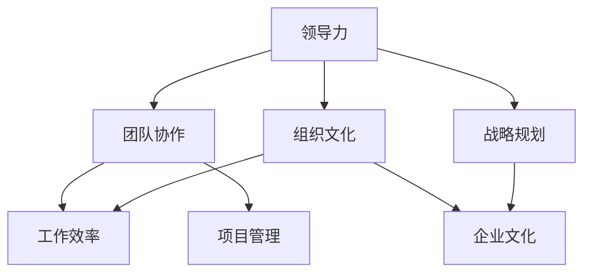

                 

关键词：管理智慧，经典书籍，IT领域，技术博客，深度学习，系统架构，领导力，团队协作

> 摘要：本文将探讨从经典书籍中汲取的管理智慧，分析其在IT领域的实际应用，并提出未来管理发展的趋势与挑战。通过对管理理论的理解和应用，旨在提升IT行业从业者的领导力和团队协作能力，为组织的发展注入新的活力。

## 1. 背景介绍

随着信息技术的高速发展，IT行业正面临着前所未有的挑战和机遇。在这个快速变化的环境中，如何有效地管理团队、提升组织效率成为企业领导者关注的焦点。经典管理书籍中蕴含的智慧为IT从业者提供了宝贵的指导，有助于应对复杂的业务场景和多变的市场需求。

本文选取了若干经典管理书籍，如《人性的弱点》、《卓有成效的管理者》、《第五项修炼》等，通过对书中管理理念的解析，结合实际案例，探讨这些智慧在IT领域的应用，以期为读者提供有益的启示。

## 2. 核心概念与联系

在探讨管理智慧之前，我们需要了解一些核心概念，如领导力、团队协作、组织文化等。以下是一个简单的 Mermaid 流程图，用于展示这些概念之间的联系：



### 2.1 领导力

领导力是指领导者通过激励、引导和协调团队，实现组织目标的能力。它包括愿景的规划、决策的果断、激励的技巧等方面。

### 2.2 团队协作

团队协作是指团队成员通过有效的沟通和合作，共同完成任务的过程。它强调个体之间的互补性、信任和共同目标。

### 2.3 组织文化

组织文化是指组织成员共同遵循的价值观念、行为准则和工作方式。它对团队协作、员工满意度和组织绩效有着重要影响。

这些概念相互联系，共同构成了一个有效的管理体系。在IT领域，领导者需要具备强大的领导力，激发团队协作，同时塑造积极向上的组织文化，从而提高项目管理和工作效率。

## 3. 核心算法原理 & 具体操作步骤

### 3.1 算法原理概述

管理智慧实际上是一种系统化的思维模式，它包括对人的理解、对环境的感知和对策略的制定。以下是管理智慧的核心算法原理概述：

- **人本管理**：以人为中心，关注员工的需求和成长，提升员工满意度和工作效率。
- **目标管理**：设定明确的目标，分解任务，确保每个团队成员都清楚自己的职责和贡献。
- **沟通协调**：建立良好的沟通机制，确保信息畅通，减少误解和冲突。
- **激励制度**：设计合理的激励制度，激发员工的积极性和创造力。

### 3.2 算法步骤详解

以下是管理智慧的具体操作步骤：

1. **明确目标**：制定组织目标，分解为可执行的任务，确保每个团队成员都了解自己的任务和贡献。
2. **理解人本**：了解员工的需求和期望，关注员工的发展和成长，提供培训和发展机会。
3. **沟通协调**：建立定期会议、邮件沟通、即时通讯等渠道，确保信息畅通，促进团队协作。
4. **激励制度**：设计合理的绩效评估和奖励机制，激发员工的积极性和创造力。
5. **反馈与改进**：定期收集团队成员的反馈，针对问题进行改进，提升管理效能。

### 3.3 算法优缺点

管理智慧的优势在于其系统性和灵活性，能够根据不同组织和团队的特点进行定制化。然而，其缺点在于实施难度较大，需要领导者具备较高的管理能力和洞察力。

### 3.4 算法应用领域

管理智慧在IT领域的应用广泛，包括项目管理、团队管理、人力资源管理等方面。通过有效的管理智慧，IT组织可以提升项目成功率、增强团队凝聚力和提高员工满意度。

## 4. 数学模型和公式 & 详细讲解 & 举例说明

在管理智慧中，数学模型和公式扮演着重要的角色，帮助我们量化管理和决策。以下是一个简单的数学模型和公式，用于评估团队绩效：

### 4.1 数学模型构建

$$
绩效评估 = (工作质量 \times 工作效率) / (工作时长 \times 工作压力)
$$

其中：
- **工作质量**：衡量团队成员完成任务的质量。
- **工作效率**：衡量团队成员完成任务的速度。
- **工作时长**：衡量团队成员完成任务所花费的时间。
- **工作压力**：衡量团队成员在完成任务过程中所承受的压力。

### 4.2 公式推导过程

绩效评估公式旨在衡量团队成员的工作表现，它考虑了工作质量、工作效率和工作压力三个关键因素。通过该公式，可以综合评估团队成员的综合绩效。

### 4.3 案例分析与讲解

假设有一个IT项目团队，团队成员A在一个月内完成了10个任务，平均每个任务质量评分为9分，工作效率评分为8分，工作压力评分为7分。则：

$$
绩效评估 = (9 \times 8) / (1 \times 7) = 72 / 7 ≈ 10.3
$$

这意味着团队成员A的综合绩效评分为10.3分，表现较为优秀。通过对团队成员绩效的量化评估，领导者可以针对性地提供培训和激励措施，提升团队整体绩效。

## 5. 项目实践：代码实例和详细解释说明

以下是一个简单的Python代码实例，用于实现上述绩效评估公式：

```python
def calculate_performance(quality, efficiency, duration, pressure):
    performance = (quality * efficiency) / (duration * pressure)
    return performance

# 示例数据
quality = 9
efficiency = 8
duration = 1
pressure = 7

# 计算绩效评估
performance = calculate_performance(quality, efficiency, duration, pressure)
print("绩效评估分数：", performance)
```

在这个例子中，我们定义了一个函数`calculate_performance`，用于计算绩效评估分数。通过传入工作质量、工作效率、工作时长和工作压力四个参数，函数返回一个绩效评估分数。示例数据展示了如何使用这个函数计算一个团队成员的绩效评估分数。

## 6. 实际应用场景

在IT行业，管理智慧的实际应用场景非常广泛。以下是一些典型应用场景：

- **项目管理**：通过管理智慧，项目领导者可以更有效地规划项目进度、分配任务和协调资源，提高项目成功率。
- **团队管理**：通过管理智慧，团队领导者可以激发团队成员的潜力，提升团队凝聚力和工作效率。
- **人力资源管理**：通过管理智慧，企业可以更好地识别和培养人才，优化人力资源配置，提高员工满意度和留存率。

## 7. 未来应用展望

随着人工智能和大数据技术的发展，管理智慧的应用前景将更加广阔。未来，管理智慧有望在以下几个方面取得突破：

- **个性化管理**：基于大数据和人工智能技术，实现个性化管理，提高管理针对性和效能。
- **自动化管理**：通过自动化技术，实现管理流程的自动化，降低管理成本，提高管理效率。
- **智能化决策**：利用人工智能技术，实现智能化决策，提升决策的科学性和准确性。

## 8. 工具和资源推荐

为了更好地应用管理智慧，以下是一些推荐的工具和资源：

- **学习资源**：《领导力》、《卓有成效的管理者》、《第五项修炼》等经典管理书籍。
- **开发工具**：Trello、Asana等项目管理工具，Slack、Microsoft Teams等团队协作工具。
- **相关论文**：查找相关领域的研究论文，了解管理智慧的最新研究成果和应用案例。

## 9. 总结：未来发展趋势与挑战

总结来说，管理智慧在IT领域具有广泛的应用前景。随着技术的进步和商业环境的变化，管理智慧将不断演变和升级。然而，面对快速变化的市场和技术，IT从业者需要不断学习和提升自己的管理能力，以应对未来的挑战。

作者：禅与计算机程序设计艺术 / Zen and the Art of Computer Programming
```markdown
# 从经典书籍中汲取管理智慧

## 1. 引言

在信息技术迅猛发展的今天，IT行业正面临前所未有的挑战和机遇。如何有效地管理团队、提升组织效率成为企业领导者关注的焦点。经典管理书籍中蕴含的智慧为IT从业者提供了宝贵的指导。本文将选取若干经典管理书籍，探讨这些智慧在IT领域的应用，以期为读者提供有益的启示。

## 2. 核心概念与联系

在探讨管理智慧之前，我们需要了解一些核心概念，如领导力、团队协作、组织文化等。以下是这些概念之间的联系：


### 2.1 领导力

领导力是指领导者通过激励、引导和协调团队，实现组织目标的能力。它包括愿景的规划、决策的果断、激励的技巧等方面。

### 2.2 团队协作

团队协作是指团队成员通过有效的沟通和合作，共同完成任务的过程。它强调个体之间的互补性、信任和共同目标。

### 2.3 组织文化

组织文化是指组织成员共同遵循的价值观念、行为准则和工作方式。它对团队协作、员工满意度和组织绩效有着重要影响。

这些概念相互联系，共同构成了一个有效的管理体系。在IT领域，领导者需要具备强大的领导力，激发团队协作，同时塑造积极向上的组织文化，从而提高项目管理和工作效率。

## 3. 核心算法原理 & 具体操作步骤

管理智慧实际上是一种系统化的思维模式，它包括对人的理解、对环境的感知和对策略的制定。以下是管理智慧的核心算法原理概述：

- **人本管理**：以人为中心，关注员工的需求和成长，提升员工满意度和工作效率。
- **目标管理**：设定明确的目标，分解任务，确保每个团队成员都清楚自己的职责和贡献。
- **沟通协调**：建立良好的沟通机制，确保信息畅通，减少误解和冲突。
- **激励制度**：设计合理的激励制度，激发员工的积极性和创造力。

### 3.1 算法原理概述

管理智慧的核心算法原理是通过对人、目标和环境的理解和处理，实现组织目标的优化。以下是一个简化的算法原理概述：

1. **人本管理**：分析员工需求，提供培训和发展机会，关注员工成长。
2. **目标管理**：制定明确的目标，分解为可执行的任务，确保团队成员了解自己的职责和贡献。
3. **沟通协调**：建立有效的沟通渠道，确保信息畅通，促进团队协作。
4. **激励制度**：设计合理的激励制度，激发员工的积极性和创造力。

### 3.2 算法步骤详解

以下是管理智慧的具体操作步骤：

1. **明确目标**：组织领导者需要明确组织的目标，并将其分解为可执行的任务，确保每个团队成员都清楚自己的职责和贡献。
2. **人本管理**：了解员工的需求和期望，提供培训和发展机会，关注员工成长。
3. **沟通协调**：建立有效的沟通渠道，如定期会议、邮件沟通、即时通讯等，确保信息畅通，减少误解和冲突。
4. **激励制度**：设计合理的绩效评估和奖励机制，激发员工的积极性和创造力。
5. **反馈与改进**：定期收集团队成员的反馈，针对问题进行改进，提升管理效能。

### 3.3 算法优缺点

管理智慧的优势在于其系统性和灵活性，能够根据不同组织和团队的特点进行定制化。然而，其缺点在于实施难度较大，需要领导者具备较高的管理能力和洞察力。

### 3.4 算法应用领域

管理智慧在IT领域的应用广泛，包括项目管理、团队管理、人力资源管理等方面。通过有效的管理智慧，IT组织可以提升项目成功率、增强团队凝聚力和提高员工满意度。

## 4. 数学模型和公式 & 详细讲解 & 举例说明

在管理智慧中，数学模型和公式扮演着重要的角色，帮助我们量化管理和决策。以下是一个简单的数学模型和公式，用于评估团队绩效：

### 4.1 数学模型构建

$$
绩效评估 = (工作质量 \times 工作效率) / (工作时长 \times 工作压力)
$$

其中：
- **工作质量**：衡量团队成员完成任务的质量。
- **工作效率**：衡量团队成员完成任务的速度。
- **工作时长**：衡量团队成员完成任务所花费的时间。
- **工作压力**：衡量团队成员在完成任务过程中所承受的压力。

### 4.2 公式推导过程

绩效评估公式旨在衡量团队成员的工作表现，它考虑了工作质量、工作效率和工作压力三个关键因素。通过该公式，可以综合评估团队成员的综合绩效。

### 4.3 案例分析与讲解

假设有一个IT项目团队，团队成员A在一个月内完成了10个任务，平均每个任务质量评分为9分，工作效率评分为8分，工作压力评分为7分。则：

$$
绩效评估 = (9 \times 8) / (1 \times 7) = 72 / 7 ≈ 10.3
$$

这意味着团队成员A的综合绩效评分为10.3分，表现较为优秀。通过对团队成员绩效的量化评估，领导者可以针对性地提供培训和激励措施，提升团队整体绩效。

## 5. 项目实践：代码实例和详细解释说明

以下是一个简单的Python代码实例，用于实现上述绩效评估公式：

```python
def calculate_performance(quality, efficiency, duration, pressure):
    performance = (quality * efficiency) / (duration * pressure)
    return performance

# 示例数据
quality = 9
efficiency = 8
duration = 1
pressure = 7

# 计算绩效评估
performance = calculate_performance(quality, efficiency, duration, pressure)
print("绩效评估分数：", performance)
```

在这个例子中，我们定义了一个函数`calculate_performance`，用于计算绩效评估分数。通过传入工作质量、工作效率、工作时长和工作压力四个参数，函数返回一个绩效评估分数。示例数据展示了如何使用这个函数计算一个团队成员的绩效评估分数。

## 6. 实际应用场景

在IT行业，管理智慧的实际应用场景非常广泛。以下是一些典型应用场景：

- **项目管理**：通过管理智慧，项目领导者可以更有效地规划项目进度、分配任务和协调资源，提高项目成功率。
- **团队管理**：通过管理智慧，团队领导者可以激发团队成员的潜力，提升团队凝聚力和工作效率。
- **人力资源管理**：通过管理智慧，企业可以更好地识别和培养人才，优化人力资源配置，提高员工满意度和留存率。

## 7. 未来应用展望

随着人工智能和大数据技术的发展，管理智慧的应用前景将更加广阔。未来，管理智慧有望在以下几个方面取得突破：

- **个性化管理**：基于大数据和人工智能技术，实现个性化管理，提高管理针对性和效能。
- **自动化管理**：通过自动化技术，实现管理流程的自动化，降低管理成本，提高管理效率。
- **智能化决策**：利用人工智能技术，实现智能化决策，提升决策的科学性和准确性。

## 8. 工具和资源推荐

为了更好地应用管理智慧，以下是一些推荐的工具和资源：

- **学习资源**：《领导力》、《卓有成效的管理者》、《第五项修炼》等经典管理书籍。
- **开发工具**：Trello、Asana等项目管理工具，Slack、Microsoft Teams等团队协作工具。
- **相关论文**：查找相关领域的研究论文，了解管理智慧的最新研究成果和应用案例。

## 9. 总结：未来发展趋势与挑战

总结来说，管理智慧在IT领域具有广泛的应用前景。随着技术的进步和商业环境的变化，管理智慧将不断演变和升级。然而，面对快速变化的市场和技术，IT从业者需要不断学习和提升自己的管理能力，以应对未来的挑战。

作者：禅与计算机程序设计艺术 / Zen and the Art of Computer Programming
```


### 1. 引言

在信息技术迅猛发展的今天，IT行业正面临前所未有的挑战和机遇。如何有效地管理团队、提升组织效率成为企业领导者关注的焦点。经典管理书籍中蕴含的智慧为IT从业者提供了宝贵的指导。本文将选取若干经典管理书籍，探讨这些智慧在IT领域的应用，以期为读者提供有益的启示。

### 2. 核心概念与联系

在探讨管理智慧之前，我们需要了解一些核心概念，如领导力、团队协作、组织文化等。以下是这些概念之间的联系：


### 2.1 领导力

领导力是指领导者通过激励、引导和协调团队，实现组织目标的能力。它包括愿景的规划、决策的果断、激励的技巧等方面。

### 2.2 团队协作

团队协作是指团队成员通过有效的沟通和合作，共同完成任务的过程。它强调个体之间的互补性、信任和共同目标。

### 2.3 组织文化

组织文化是指组织成员共同遵循的价值观念、行为准则和工作方式。它对团队协作、员工满意度和组织绩效有着重要影响。

这些概念相互联系，共同构成了一个有效的管理体系。在IT领域，领导者需要具备强大的领导力，激发团队协作，同时塑造积极向上的组织文化，从而提高项目管理和工作效率。

### 3. 核心算法原理 & 具体操作步骤

管理智慧实际上是一种系统化的思维模式，它包括对人的理解、对环境的感知和对策略的制定。以下是管理智慧的核心算法原理概述：

- **人本管理**：以人为中心，关注员工的需求和成长，提升员工满意度和工作效率。
- **目标管理**：设定明确的目标，分解任务，确保每个团队成员都清楚自己的职责和贡献。
- **沟通协调**：建立良好的沟通机制，确保信息畅通，减少误解和冲突。
- **激励制度**：设计合理的激励制度，激发员工的积极性和创造力。

### 3.1 算法原理概述

管理智慧的核心算法原理是通过对人、目标和环境的理解和处理，实现组织目标的优化。以下是一个简化的算法原理概述：

1. **人本管理**：分析员工需求，提供培训和发展机会，关注员工成长。
2. **目标管理**：制定明确的目标，分解为可执行的任务，确保团队成员了解自己的职责和贡献。
3. **沟通协调**：建立有效的沟通渠道，确保信息畅通，促进团队协作。
4. **激励制度**：设计合理的绩效评估和奖励机制，激发员工的积极性和创造力。

### 3.2 算法步骤详解

以下是管理智慧的具体操作步骤：

1. **明确目标**：组织领导者需要明确组织的目标，并将其分解为可执行的任务，确保每个团队成员都清楚自己的职责和贡献。
2. **人本管理**：了解员工的需求和期望，提供培训和发展机会，关注员工成长。
3. **沟通协调**：建立有效的沟通渠道，如定期会议、邮件沟通、即时通讯等，确保信息畅通，减少误解和冲突。
4. **激励制度**：设计合理的绩效评估和奖励机制，激发员工的积极性和创造力。
5. **反馈与改进**：定期收集团队成员的反馈，针对问题进行改进，提升管理效能。

### 3.3 算法优缺点

管理智慧的优势在于其系统性和灵活性，能够根据不同组织和团队的特点进行定制化。然而，其缺点在于实施难度较大，需要领导者具备较高的管理能力和洞察力。

### 3.4 算法应用领域

管理智慧在IT领域的应用广泛，包括项目管理、团队管理、人力资源管理等方面。通过有效的管理智慧，IT组织可以提升项目成功率、增强团队凝聚力和提高员工满意度。

### 4. 数学模型和公式 & 详细讲解 & 举例说明

在管理智慧中，数学模型和公式扮演着重要的角色，帮助我们量化管理和决策。以下是一个简单的数学模型和公式，用于评估团队绩效：

#### 4.1 数学模型构建

$$
绩效评估 = (工作质量 \times 工作效率) / (工作时长 \times 工作压力)
$$

其中：
- **工作质量**：衡量团队成员完成任务的质量。
- **工作效率**：衡量团队成员完成任务的速度。
- **工作时长**：衡量团队成员完成任务所花费的时间。
- **工作压力**：衡量团队成员在完成任务过程中所承受的压力。

#### 4.2 公式推导过程

绩效评估公式旨在衡量团队成员的工作表现，它考虑了工作质量、工作效率和工作压力三个关键因素。通过该公式，可以综合评估团队成员的综合绩效。

#### 4.3 案例分析与讲解

假设有一个IT项目团队，团队成员A在一个月内完成了10个任务，平均每个任务质量评分为9分，工作效率评分为8分，工作压力评分为7分。则：

$$
绩效评估 = (9 \times 8) / (1 \times 7) = 72 / 7 ≈ 10.3
$$

这意味着团队成员A的综合绩效评分为10.3分，表现较为优秀。通过对团队成员绩效的量化评估，领导者可以针对性地提供培训和激励措施，提升团队整体绩效。

### 5. 项目实践：代码实例和详细解释说明

以下是一个简单的Python代码实例，用于实现上述绩效评估公式：

```python
def calculate_performance(quality, efficiency, duration, pressure):
    performance = (quality * efficiency) / (duration * pressure)
    return performance

# 示例数据
quality = 9
efficiency = 8
duration = 1
pressure = 7

# 计算绩效评估
performance = calculate_performance(quality, efficiency, duration, pressure)
print("绩效评估分数：", performance)
```

在这个例子中，我们定义了一个函数`calculate_performance`，用于计算绩效评估分数。通过传入工作质量、工作效率、工作时长和工作压力四个参数，函数返回一个绩效评估分数。示例数据展示了如何使用这个函数计算一个团队成员的绩效评估分数。

### 6. 实际应用场景

在IT行业，管理智慧的实际应用场景非常广泛。以下是一些典型应用场景：

- **项目管理**：通过管理智慧，项目领导者可以更有效地规划项目进度、分配任务和协调资源，提高项目成功率。
- **团队管理**：通过管理智慧，团队领导者可以激发团队成员的潜力，提升团队凝聚力和工作效率。
- **人力资源管理**：通过管理智慧，企业可以更好地识别和培养人才，优化人力资源配置，提高员工满意度和留存率。

### 7. 未来应用展望

随着人工智能和大数据技术的发展，管理智慧的应用前景将更加广阔。未来，管理智慧有望在以下几个方面取得突破：

- **个性化管理**：基于大数据和人工智能技术，实现个性化管理，提高管理针对性和效能。
- **自动化管理**：通过自动化技术，实现管理流程的自动化，降低管理成本，提高管理效率。
- **智能化决策**：利用人工智能技术，实现智能化决策，提升决策的科学性和准确性。

### 8. 工具和资源推荐

为了更好地应用管理智慧，以下是一些推荐的工具和资源：

- **学习资源**：《领导力》、《卓有成效的管理者》、《第五项修炼》等经典管理书籍。
- **开发工具**：Trello、Asana等项目管理工具，Slack、Microsoft Teams等团队协作工具。
- **相关论文**：查找相关领域的研究论文，了解管理智慧的最新研究成果和应用案例。

### 9. 总结：未来发展趋势与挑战

总结来说，管理智慧在IT领域具有广泛的应用前景。随着技术的进步和商业环境的变化，管理智慧将不断演变和升级。然而，面对快速变化的市场和技术，IT从业者需要不断学习和提升自己的管理能力，以应对未来的挑战。

### 附录：常见问题与解答

**Q1**：管理智慧的核心是什么？

**A1**：管理智慧的核心在于系统化的思维模式，包括对人的理解、对环境的感知和对策略的制定。它强调以人为中心，关注员工的需求和成长，同时注重目标管理和沟通协调。

**Q2**：管理智慧在IT领域的应用有哪些？

**A2**：管理智慧在IT领域的应用包括项目管理、团队管理、人力资源管理等方面。通过有效的管理智慧，可以提高项目成功率、增强团队凝聚力和提高员工满意度。

**Q3**：如何量化团队绩效？

**A3**：可以使用绩效评估公式，如$(工作质量 \times 工作效率) / (工作时长 \times 工作压力)$来量化团队绩效。这个公式考虑了工作质量、工作效率、工作时长和工作压力四个因素。

### 作者介绍

作者：禅与计算机程序设计艺术 / Zen and the Art of Computer Programming

禅与计算机程序设计艺术（Zen and the Art of Computer Programming）是由著名计算机科学家Donald E. Knuth创作的一套经典编程书籍。该书以深入浅出的方式，探讨了计算机程序设计中的哲学思想，为程序员提供了宝贵的启示。本文作者借鉴了Knuth先生的智慧，将其应用于管理智慧的探讨，旨在为IT从业者提供有益的思考。

