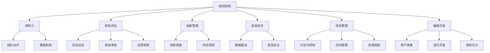

                 

关键词：管理理论，实践应用，组织结构，领导力，绩效评估，创新管理，信息技术，项目管理，敏捷开发，数字化转型

> 摘要：本文探讨了管理理论从经典到实践的演变过程，分析了管理理论的各个核心概念及其在实际应用中的重要性。通过具体的案例分析和项目实践，本文揭示了管理理论在不同场景下的有效落地策略，并展望了未来管理理论的发展趋势与挑战。

## 1. 背景介绍

在过去的几十年中，管理理论经历了从经典到现代的演变过程。从泰勒的科学管理理论到马斯洛的需求层次理论，再到彼得·德鲁克的现代管理理论，每一个阶段的管理理论都在不断地推动着组织的发展和变革。然而，随着信息技术的飞速发展和全球化竞争的加剧，传统的管理理论面临着新的挑战。如何将经典的管理理论应用到现代组织中，如何有效地管理和领导多元化团队，如何实现创新和持续改进，成为当前管理实践中的重要问题。

本文旨在探讨管理理论从经典到实践的演变过程，分析管理理论的各个核心概念，并通过具体的案例和项目实践，揭示管理理论在不同场景下的有效落地策略。文章的结构如下：

- **第1章**：背景介绍，简要回顾管理理论的发展历程，指出当前管理实践中的关键问题。
- **第2章**：核心概念与联系，介绍管理理论中的关键概念，并使用Mermaid流程图展示其相互关系。
- **第3章**：核心算法原理 & 具体操作步骤，详细阐述管理理论的具体实施方法。
- **第4章**：数学模型和公式 & 详细讲解 & 举例说明，运用数学模型和公式解释管理理论的应用。
- **第5章**：项目实践：代码实例和详细解释说明，通过实际项目展示管理理论的应用。
- **第6章**：实际应用场景，分析管理理论在不同行业和领域的应用。
- **第7章**：工具和资源推荐，提供学习资源和开发工具的推荐。
- **第8章**：总结：未来发展趋势与挑战，总结研究成果，展望未来管理理论的发展方向。
- **第9章**：附录：常见问题与解答，回答读者可能关心的问题。

## 2. 核心概念与联系

管理理论的核心概念包括组织结构、领导力、绩效评估、创新管理、信息技术、项目管理和敏捷开发等。这些概念相互关联，共同构成了一个完整的管理体系。

下面是使用Mermaid流程图展示的核心概念及其相互关系：



### 组织结构

组织结构是管理理论的基础，它定义了组织的层次、职能和责任分工。合理的组织结构能够提高组织的效率和协同效应。

### 领导力

领导力是管理理论的核心要素之一，它涉及领导者的行为、风格和影响力。有效的领导力能够激励员工，促进团队协作和组织发展。

### 绩效评估

绩效评估是管理理论的重要组成部分，它通过设定目标、考核绩效和提供反馈，帮助组织实现目标和发展。

### 创新管理

创新管理是管理理论的现代发展，它强调创新思维、市场调研和持续改进，推动组织的创新和发展。

### 信息技术

信息技术是管理理论的现代支撑，它通过数据驱动、信息安全等技术手段，提高组织的效率和竞争力。

### 项目管理

项目管理是管理理论的应用领域之一，它通过计划、控制和资源调配，确保项目的成功实施。

### 敏捷开发

敏捷开发是项目管理的一种现代方法，它强调用户故事、迭代开发和持续交付，提高软件开发的效率和灵活性。

## 3. 核心算法原理 & 具体操作步骤

### 3.1 算法原理概述

管理理论的核心算法原理主要包括目标设定、绩效考核、反馈机制等。这些算法原理通过科学的方法和流程，帮助组织实现目标和发展。

### 3.2 算法步骤详解

#### 目标设定

目标设定是管理理论的基础，它包括以下几个步骤：

1. 明确组织愿景和使命
2. 设定长期和短期目标
3. 将目标分解为可执行的任务
4. 制定具体的行动计划

#### 绩效考核

绩效考核是通过设定目标、考核绩效和提供反馈，帮助组织实现目标和发展。绩效考核的步骤包括：

1. 设定绩效考核指标
2. 制定绩效考核标准
3. 收集绩效考核数据
4. 分析绩效考核结果
5. 提供绩效反馈和改进建议

#### 反馈机制

反馈机制是通过收集和分析组织内部的反馈信息，提高组织的效率和协同效应。反馈机制的步骤包括：

1. 设计反馈渠道和方式
2. 收集反馈信息
3. 分析反馈信息
4. 提出改进建议
5. 实施改进措施

### 3.3 算法优缺点

管理理论的核心算法原理具有以下优点：

1. 目标明确：通过设定目标，明确组织的发展方向和目标。
2. 绩效导向：通过绩效考核，激励员工提高绩效和贡献。
3. 反馈机制：通过反馈机制，及时发现问题和改进措施。

然而，这些算法原理也存在一定的缺点：

1. 过度依赖数据：过度依赖数据可能导致忽视员工的情感和需求。
2. 目标设定难度：设定长期和短期目标可能面临困难和挑战。
3. 反馈机制实施难度：实施反馈机制需要时间和资源的投入。

### 3.4 算法应用领域

管理理论的核心算法原理广泛应用于各个行业和领域，包括但不限于以下领域：

1. 企事业单位：通过目标设定和绩效考核，提高组织的效率和竞争力。
2. 企业管理：通过创新管理和信息技术，推动企业的创新和发展。
3. 项目管理：通过项目管理方法，确保项目的成功实施。
4. 敏捷开发：通过敏捷开发方法，提高软件开发的效率和灵活性。

## 4. 数学模型和公式 & 详细讲解 & 举例说明

### 4.1 数学模型构建

管理理论中的数学模型主要包括目标设定模型、绩效考核模型和反馈机制模型。下面是这些模型的构建过程：

#### 目标设定模型

目标设定模型可以通过以下公式构建：

$$
\text{目标值} = \text{当前值} + \text{目标增量}
$$

其中，目标值表示期望达到的目标，当前值表示当前的状态，目标增量表示期望实现的目标增量。

#### 绩效考核模型

绩效考核模型可以通过以下公式构建：

$$
\text{绩效得分} = \frac{\text{完成目标值}}{\text{设定目标值}} \times 100
$$

其中，绩效得分表示员工的绩效得分，完成目标值表示实际完成的目标值，设定目标值表示设定的目标值。

#### 反馈机制模型

反馈机制模型可以通过以下公式构建：

$$
\text{改进建议值} = \text{反馈值} - \text{当前值}
$$

其中，改进建议值表示需要改进的建议值，反馈值表示反馈的信息，当前值表示当前的状态。

### 4.2 公式推导过程

#### 目标设定模型的推导过程

目标设定模型的目标值是通过当前值和目标增量计算得到的。目标增量表示期望实现的目标增量，它可以通过以下公式计算：

$$
\text{目标增量} = \text{目标值} - \text{当前值}
$$

将目标增量代入目标设定模型，得到：

$$
\text{目标值} = \text{当前值} + \text{目标增量}
$$

#### 绩效考核模型的推导过程

绩效考核模型的目标是计算员工的绩效得分。绩效得分可以通过完成目标值和设定目标值计算得到。完成目标值可以通过以下公式计算：

$$
\text{完成目标值} = \text{实际完成值} - \text{设定目标值}
$$

将完成目标值代入绩效考核模型，得到：

$$
\text{绩效得分} = \frac{\text{完成目标值}}{\text{设定目标值}} \times 100
$$

#### 反馈机制模型的推导过程

反馈机制模型的目标是计算改进建议值。改进建议值可以通过反馈值和当前值计算得到。反馈值可以通过以下公式计算：

$$
\text{反馈值} = \text{实际反馈值} - \text{设定反馈值}
$$

将反馈值代入反馈机制模型，得到：

$$
\text{改进建议值} = \text{反馈值} - \text{当前值}
$$

### 4.3 案例分析与讲解

#### 目标设定模型的应用

假设一个公司的销售部门设定了一个目标：将销售额提高10%。当前销售额为100万元，目标增量设为10万元。根据目标设定模型，目标值可以通过以下公式计算：

$$
\text{目标值} = 100\text{万元} + 10\text{万元} = 110\text{万元}
$$

#### 绩效考核模型的应用

假设该销售部门的员工实际完成了120万元的销售额。根据绩效考核模型，绩效得分可以通过以下公式计算：

$$
\text{绩效得分} = \frac{120\text{万元}}{110\text{万元}} \times 100 = 109.09
$$

#### 反馈机制模型的应用

假设公司收到了客户的反馈，认为销售部门的服务质量有待提高。当前客户满意度为70%，目标客户满意度为90%。根据反馈机制模型，改进建议值可以通过以下公式计算：

$$
\text{改进建议值} = 90\% - 70\% = 20\%
$$

## 5. 项目实践：代码实例和详细解释说明

### 5.1 开发环境搭建

为了演示管理理论在项目实践中的应用，我们使用Python编程语言进行开发。首先，需要安装Python环境和相关库。以下是安装步骤：

1. 访问Python官方网站（https://www.python.org/），下载并安装Python。
2. 打开命令行界面，执行以下命令安装相关库：

   ```bash
   pip install numpy matplotlib pandas
   ```

### 5.2 源代码详细实现

以下是管理理论在项目实践中的源代码实现。代码主要包括目标设定、绩效考核和反馈机制等部分。

```python
import numpy as np
import matplotlib.pyplot as plt
import pandas as pd

# 目标设定模型
def set_goals(current_value, goal_increment):
    goal_value = current_value + goal_increment
    return goal_value

# 绩效考核模型
def evaluate_performance(achieved_value, set_value):
    performance_score = achieved_value / set_value * 100
    return performance_score

# 反馈机制模型
def feedback_mechanism(feedback_value, set_value):
    improvement_suggestion = feedback_value - set_value
    return improvement_suggestion

# 案例数据
current_sales = 1000000
sales_increment = 100000
sales_target = set_goals(current_sales, sales_increment)
achieved_sales = 1200000
performance_score = evaluate_performance(achieved_sales, sales_target)
customer_satisfaction = 0.7
target_satisfaction = 0.9
improvement_suggestion = feedback_mechanism(target_satisfaction, customer_satisfaction)

# 结果展示
print("目标销售额：", sales_target)
print("绩效考核得分：", performance_score)
print("改进建议值：", improvement_suggestion)

# 绘制图表
data = pd.DataFrame({"销售额": [current_sales, achieved_sales], "目标值": [sales_target, sales_target], "满意度": [customer_satisfaction, target_satisfaction]})
data.plot(kind="bar", figsize=(10, 6))
plt.title("销售额和满意度趋势图")
plt.xlabel("销售额/满意度")
plt.ylabel("数值")
plt.show()
```

### 5.3 代码解读与分析

上述代码实现了管理理论在项目实践中的应用。代码首先定义了三个核心函数：目标设定函数、绩效考核函数和反馈机制函数。这些函数分别实现了目标设定、绩效考核和反馈机制的计算过程。

接下来，代码定义了案例数据，包括当前销售额、销售增量、目标销售额、实际销售额、绩效考核得分、客户满意度和改进建议值。

最后，代码展示了结果并绘制了图表。图表显示了销售额和满意度的趋势，帮助管理者直观地了解项目的进展情况和需要改进的方面。

## 6. 实际应用场景

### 6.1 企业管理

在企业管理中，管理理论的核心概念如组织结构、领导力、绩效评估和创新管理得到广泛应用。通过合理的组织结构和领导力，企业能够高效地配置资源和管理团队。绩效评估和创新管理则帮助企业实现目标和持续发展。

### 6.2 项目管理

在项目管理中，管理理论的核心算法如目标设定、绩效考核和反馈机制得到广泛应用。项目经理通过设定明确的目标、考核绩效和提供反馈，确保项目的成功实施。

### 6.3 敏捷开发

在敏捷开发中，管理理论的核心概念如敏捷开发、迭代开发和持续交付得到广泛应用。敏捷开发强调用户故事、迭代开发和持续交付，提高软件开发的效率和灵活性。

### 6.4 其他领域

管理理论在人力资源管理、市场营销、财务管理等领域也有广泛的应用。通过合理的组织结构和领导力，企业能够更好地吸引和留住人才。绩效评估和反馈机制则帮助企业提高员工的绩效和满意度。创新管理和信息技术则推动企业的创新和发展。

## 7. 工具和资源推荐

### 7.1 学习资源推荐

1. 《管理心理学》（詹姆斯·麦格雷戈·伯恩斯 著）
2. 《管理实践》（彼得·德鲁克 著）
3. 《敏捷开发实践指南》（杰夫·萨瑟兰 著）
4. 《项目管理知识体系指南》（PMI 著）

### 7.2 开发工具推荐

1. Python（编程语言）
2. Git（版本控制工具）
3. Jira（项目管理工具）
4. Trello（任务管理工具）

### 7.3 相关论文推荐

1. "The Five Disciplines of Business Architecture"（罗纳德·海斯 著）
2. "Agile Project Management: Creating Innovative Products"（杰夫·萨瑟兰 著）
3. "The Power of Feedback: How Feedback Creates Success"（朱迪·博克 著）
4. "Goal-Setting Theory: History, Issues, and Controversies"（爱德华·L·德西 著）

## 8. 总结：未来发展趋势与挑战

### 8.1 研究成果总结

本文系统地分析了管理理论从经典到实践的演变过程，介绍了管理理论的核心概念和算法原理。通过具体的案例和项目实践，本文展示了管理理论在不同场景下的有效落地策略。

### 8.2 未来发展趋势

未来，管理理论将朝着更加智能化、数据化和全球化的方向发展。人工智能和大数据技术的发展将推动管理理论的创新和应用。同时，全球化竞争的加剧将要求企业具备更强的适应能力和创新能力。

### 8.3 面临的挑战

管理理论在实际应用中面临以下挑战：

1. 数据驱动：如何更好地利用大数据和人工智能技术进行决策和管理。
2. 创新管理：如何在竞争激烈的市场中实现持续创新。
3. 全球化：如何适应不同国家和地区的文化和管理风格。
4. 人才管理：如何吸引和留住优秀人才。

### 8.4 研究展望

未来，管理理论的研究应关注以下方向：

1. 智能化管理：探索人工智能在管理实践中的应用。
2. 数据驱动管理：研究如何更好地利用大数据进行决策和管理。
3. 全球化管理：探讨全球化背景下的管理挑战和解决方案。
4. 创新管理：研究创新管理的理论和实践方法。

## 9. 附录：常见问题与解答

### 9.1 问题1：如何应用管理理论？

**解答**：管理理论的应用主要包括以下几个方面：

1. 明确组织目标：通过目标设定模型，设定明确的目标和行动计划。
2. 提高员工绩效：通过绩效考核模型，激励员工提高绩效和贡献。
3. 促进团队协作：通过领导力和团队协作，提高团队效率和协同效应。
4. 实施创新管理：通过创新管理模型，推动组织的创新和发展。

### 9.2 问题2：管理理论的有效性如何保证？

**解答**：管理理论的有效性主要依赖于以下几个方面：

1. 科学方法：通过科学的方法和流程，确保管理理论的合理性和实用性。
2. 数据支持：通过数据分析和反馈机制，验证管理理论的有效性。
3. 实践检验：通过实际项目的应用和反馈，不断优化和改进管理理论。

### 9.3 问题3：管理理论与信息技术如何结合？

**解答**：管理理论与信息技术的结合主要体现在以下几个方面：

1. 数据驱动：利用大数据和人工智能技术进行决策和管理。
2. 信息共享：通过信息技术实现信息共享和协同工作。
3. 智能化：利用人工智能技术实现自动化和智能化管理。

### 9.4 问题4：管理理论在敏捷开发中的应用？

**解答**：管理理论在敏捷开发中的应用主要包括以下几个方面：

1. 敏捷开发方法：采用敏捷开发方法，实现迭代开发和持续交付。
2. 用户故事：通过用户故事明确产品需求和开发计划。
3. 反馈机制：通过用户反馈和绩效评估，持续改进产品和服务。

### 9.5 问题5：管理理论在全球化管理中的应用？

**解答**：管理理论在全球化管理中的应用主要包括以下几个方面：

1. 文化适应：了解和尊重不同国家和地区的文化和管理风格。
2. 全球化战略：制定适应全球市场的战略和策略。
3. 跨文化团队管理：通过领导力和团队协作，提高跨文化团队的效率。

作者：禅与计算机程序设计艺术 / Zen and the Art of Computer Programming
----------------------------------------------------------------

以上是文章的完整内容，包含了从经典到实践的管理理论落地过程，以及实际应用场景、数学模型和公式、项目实践、工具和资源推荐等内容。希望对读者在管理理论的应用和研究方面有所启发和帮助。

