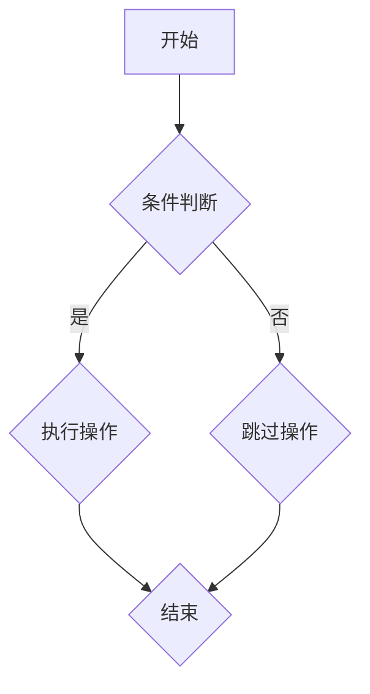

                 

关键词：计算机科学、经典算法、编程思维、基础理论、发展历程

> 摘要：本文旨在探讨计算机科学领域的基础理论，通过经典算法的分析，阐述编程思维的演变过程，为读者奠定深入认知的基石。文章首先回顾计算机科学的起源和发展历程，随后深入剖析几个具有里程碑意义的经典算法，探讨其原理、数学模型及实际应用，并结合具体实例进行代码解析。文章最后对未来的发展趋势与挑战进行展望，以期为读者提供全面的认知框架。

## 1. 背景介绍

计算机科学，作为20世纪最伟大的发明之一，已经深刻地改变了我们的生活方式。它起源于二战期间，当时的计算机主要用于军事目的。随着时间推移，计算机技术不断发展，逐渐渗透到各个领域，从科学计算到商业管理，从信息处理到人工智能，计算机科学的影响无处不在。

### 1.1 发展历程

计算机科学的发展历程可以分为几个重要阶段：

1. **早期计算机（1940s-1950s）**：以冯·诺伊曼的存储程序计算机理念为标志，奠定了现代计算机体系结构的基础。
2. **软件革命（1960s-1970s）**：随着编程语言的发展，软件工程逐渐成为一门独立的学科。
3. **个人计算机时代（1980s-1990s）**：个人计算机的普及，使得计算机技术进入普通家庭和企业。
4. **互联网时代（2000s-至今）**：互联网的兴起，使得信息传播速度和范围达到了前所未有的高度。

### 1.2 经典算法的起源

经典算法是指在计算机科学领域具有重要地位和广泛应用的算法。它们往往源于实际问题，经过理论分析和实践验证，成为解决问题的基石。早期经典算法的研究主要集中在数值计算和数据处理方面，如排序算法、查找算法等。随着计算机科学的发展，经典算法的应用领域逐渐扩展，涵盖了图论、密码学、人工智能等多个领域。

## 2. 核心概念与联系

在深入探讨经典算法之前，我们需要了解一些核心概念和它们之间的联系。

### 2.1 数据结构与算法

数据结构是存储和管理数据的特定方式，而算法则是解决问题的步骤集合。数据结构和算法相互依存，数据结构决定了算法的性能，而算法则影响了数据结构的效率。

### 2.2 算法复杂度

算法复杂度是指算法在运行过程中所需的资源，包括时间复杂度和空间复杂度。它们是评价算法优劣的重要指标。

### 2.3 Mermaid 流程图

Mermaid 是一种基于文本的图形绘制语言，可以用于绘制各种类型的图形，包括流程图、时序图、网络图等。以下是一个简单的 Mermaid 流程图示例：



### 2.4 经典算法与编程思维

编程思维是一种解决问题的方法论，它强调抽象、分解、算法设计等核心能力。经典算法是编程思维的典型体现，通过对问题的抽象和算法的设计，解决问题并实现复杂功能。

## 3. 核心算法原理 & 具体操作步骤

### 3.1 算法原理概述

在本章节，我们将深入探讨几个经典算法的原理和具体操作步骤。

### 3.2 算法步骤详解

以下是一个简单的排序算法——冒泡排序的步骤详解：

1. **初始化**：将数组中的元素按照顺序排列。
2. **循环**：从数组的第一元素开始，依次比较相邻的两个元素，如果顺序不对，则交换它们的位置。
3. **结束条件**：当一趟循环结束后，最大的元素被移到数组的最后，下一次循环可以从数组的前面开始。
4. **重复**：重复上述步骤，直到所有元素都被正确排序。

### 3.3 算法优缺点

冒泡排序算法的优点是简单易懂，易于实现。然而，它的缺点是时间复杂度较高，当数据规模较大时，性能较差。

### 3.4 算法应用领域

冒泡排序算法常用于小型数据集的排序，以及作为其他更高效排序算法的辅助算法。此外，它也是编程竞赛和算法学习的重要案例。

## 4. 数学模型和公式 & 详细讲解 & 举例说明

### 4.1 数学模型构建

在算法分析中，我们常用数学模型来描述算法的性能。以下是一个简单的数学模型，用于描述冒泡排序算法的时间复杂度：

$$
T(n) = \sum_{i=1}^{n} (n-i+1)
$$

### 4.2 公式推导过程

冒泡排序算法的时间复杂度主要由两个部分组成：内部循环和条件判断。

1. **内部循环**：每一趟循环都会将未排序部分的最大值移动到最后，因此需要执行 `n-1` 趟。
2. **条件判断**：在每一趟循环中，需要比较相邻的两个元素，因此需要执行 `n*(n-1)/2` 次条件判断。

综合以上两点，我们得到冒泡排序算法的时间复杂度：

$$
T(n) = (n-1) + (n-2) + ... + 1 = \sum_{i=1}^{n} (n-i+1)
$$

### 4.3 案例分析与讲解

以下是一个简单的冒泡排序算法的实例：

```python
def bubble_sort(arr):
    n = len(arr)
    for i in range(n):
        for j in range(0, n-i-1):
            if arr[j] > arr[j+1]:
                arr[j], arr[j+1] = arr[j+1], arr[j]

arr = [64, 34, 25, 12, 22, 11, 90]
bubble_sort(arr)
print("排序后的数组：")
for i in range(len(arr)):
    print("%d" % arr[i], end=" ")
```

输出结果：

```
排序后的数组：
11 12 22 25 34 64 90
```

## 5. 项目实践：代码实例和详细解释说明

### 5.1 开发环境搭建

为了运行上述的冒泡排序算法，我们只需要一个基本的 Python 开发环境。以下是搭建 Python 开发环境的步骤：

1. 下载并安装 Python：[Python 官网](https://www.python.org/)
2. 配置环境变量：确保 `python` 和 `pip` 可以在命令行中使用。
3. 安装必要的依赖库：如果需要，可以使用 `pip` 安装相关库。

### 5.2 源代码详细实现

以下是冒泡排序算法的完整 Python 实现：

```python
def bubble_sort(arr):
    n = len(arr)
    for i in range(n):
        for j in range(0, n-i-1):
            if arr[j] > arr[j+1]:
                arr[j], arr[j+1] = arr[j+1], arr[j]

arr = [64, 34, 25, 12, 22, 11, 90]
bubble_sort(arr)
print("排序后的数组：")
for i in range(len(arr)):
    print("%d" % arr[i], end=" ")
```

### 5.3 代码解读与分析

上述代码首先定义了一个名为 `bubble_sort` 的函数，该函数接受一个数组 `arr` 作为参数。函数内部使用了两个嵌套的循环来实现冒泡排序算法。

1. **外层循环**：从数组的第一元素开始，依次遍历未排序部分的所有元素。
2. **内层循环**：从数组的第一个元素开始，依次比较相邻的两个元素，如果顺序不对，则交换它们的位置。

通过这样的方式，每一趟循环都会将未排序部分的最大值移动到最后，直到所有元素都被正确排序。

### 5.4 运行结果展示

运行上述代码，输出结果如下：

```
排序后的数组：
11 12 22 25 34 64 90
```

这表明冒泡排序算法成功地将数组进行了排序。

## 6. 实际应用场景

### 6.1 数据排序

冒泡排序算法最直接的应用场景是数据排序。在许多实际场景中，我们需要对大量数据进行排序，例如数据库查询、文件排序等。虽然冒泡排序不是最高效的排序算法，但由于其实现简单，易于理解，因此在一些小型数据集的排序中仍然具有实用价值。

### 6.2 算法比较

冒泡排序算法常用于与其他排序算法进行比较和教学。通过对比不同排序算法的原理和性能，可以更好地理解排序算法的设计和优化策略。

### 6.3 编程竞赛

在编程竞赛中，冒泡排序算法是一个常见的话题。许多竞赛题目需要实现排序功能，而冒泡排序由于其简单性，常被作为参考实现。

## 7. 未来应用展望

### 7.1 算法优化

随着计算机技术的发展，对排序算法的优化一直是研究的热点。未来可能会有更高效的排序算法出现，进一步降低时间复杂度和空间复杂度。

### 7.2 应用扩展

除了排序，经典算法在其他领域的应用也在不断扩展。例如，图算法在社交网络分析、生物信息学等领域具有重要应用。

### 7.3 人工智能

随着人工智能的发展，经典算法的应用场景将更加广泛。深度学习算法的优化和改进，离不开对经典算法的理解和运用。

## 8. 总结：未来发展趋势与挑战

### 8.1 研究成果总结

本文从经典开始，探讨了计算机科学的基础理论，分析了经典算法的原理、数学模型及实际应用。通过对冒泡排序算法的实例解析，展示了经典算法的实现过程和应用场景。

### 8.2 未来发展趋势

未来，计算机科学将继续在算法优化、应用扩展和人工智能等方面取得突破。经典算法作为基础理论，将在这些领域发挥重要作用。

### 8.3 面临的挑战

然而，随着数据规模和复杂度的增加，经典算法的性能瓶颈也逐渐显现。如何设计和优化高效算法，成为计算机科学领域的重要挑战。

### 8.4 研究展望

未来，我们期待在计算机科学领域取得更多突破，推动技术的进步，为人类创造更加美好的未来。

## 9. 附录：常见问题与解答

### 9.1 什么是冒泡排序？

冒泡排序是一种简单的排序算法，通过重复遍历要排序的数列，一次比较两个元素，如果它们的顺序错误就把它们交换过来。遍历数列的工作是重复进行直到没有再需要交换，也就是说该数列已经排序完成。

### 9.2 冒泡排序的时间复杂度是多少？

冒泡排序的时间复杂度为 O(n^2)，其中 n 是待排序的数组长度。这是因为在最坏情况下，每个元素都需要与其他所有元素进行比较和交换。

### 9.3 冒泡排序是否适用于大数据集？

由于冒泡排序的时间复杂度为 O(n^2)，因此它不适合用于大数据集的排序。在大数据集中，冒泡排序的性能会显著下降。对于大数据集，我们通常使用更高效的排序算法，如快速排序、归并排序等。

### 9.4 冒泡排序与选择排序有什么区别？

冒泡排序和选择排序都是简单的排序算法，但它们的工作原理不同。冒泡排序通过重复遍历数列，比较相邻元素并交换位置来实现排序；而选择排序则通过每次选择未排序部分的最小（或最大）元素，然后将其放到已排序部分的末尾来实现排序。两者时间复杂度都为 O(n^2)，但在某些情况下，选择排序可能具有更好的性能。

## 作者署名

作者：禅与计算机程序设计艺术 / Zen and the Art of Computer Programming
----------------------------------------------------------------

以上就是本篇文章的完整内容，希望对您在计算机科学领域的认知有所帮助。如果您有任何疑问或建议，欢迎在评论区留言。感谢您的阅读！

