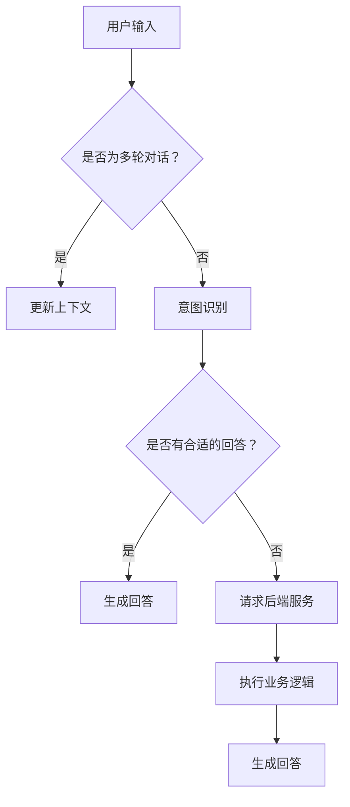

                 

 关键词：人工智能、人机交互、对话系统、自然语言处理、语音识别、交互设计

> 摘要：随着人工智能技术的快速发展，人机交互模式正从传统的问答系统向更加自然的对话系统转变。本文将从背景介绍、核心概念、算法原理、数学模型、项目实践、应用场景、未来展望等多个角度，深入探讨AI如何改变人机交互模式，并对相关工具和资源进行推荐。

## 1. 背景介绍

人机交互（Human-Computer Interaction，简称HCI）是计算机科学和人机工程学的一个重要研究领域，旨在设计、研究和评估人与计算机系统的交互。传统的交互模式以图形用户界面（GUI）为主，用户通过点击、拖拽等方式与计算机系统进行交互。然而，随着人工智能技术的兴起，交互模式正经历着深刻的变革。

### 问答系统

问答系统（Question Answering System）是一种传统的交互模式，它通过预定义的规则或机器学习模型，从大量数据中检索出与用户提问最相关的答案。这种交互模式具有一定的局限性，例如，它依赖于用户的提问方式，且难以应对复杂、多轮的对话。

### 对话系统

对话系统（Dialogue System）则是一种更加自然的交互模式，它旨在模拟人类的对话过程，与用户进行流畅、自然的交流。对话系统不仅能够理解用户的语言意图，还能够根据上下文进行推理和回答。这种交互模式在提升用户体验、提高交互效率方面具有巨大潜力。

## 2. 核心概念与联系

### 对话系统的基本概念

对话系统主要包括以下几个核心概念：

- **用户意图识别（User Intent Recognition）**：识别用户的意图，例如查询信息、请求服务、进行闲聊等。
- **上下文管理（Context Management）**：在多轮对话中，保持对话的连贯性和一致性。
- **回答生成（Answer Generation）**：根据用户的意图和上下文，生成合适的回答。
- **多轮对话管理（Dialogue Management）**：管理对话的流程，确保对话的顺利进行。

### 对话系统的架构

对话系统的架构通常包括以下几个关键组件：

- **前端（Frontend）**：负责接收用户的输入，并将输入传递给对话系统。
- **意图识别（Intent Recognition）**：使用机器学习模型，识别用户的意图。
- **上下文管理（Context Management）**：记录并管理对话过程中的上下文信息。
- **回答生成（Answer Generation）**：根据意图和上下文，生成合适的回答。
- **后端（Backend）**：负责执行具体的业务逻辑，如查询数据库、调用API等。

### 对话系统的 Mermaid 流程图



## 3. 核心算法原理 & 具体操作步骤

### 3.1 算法原理概述

对话系统的核心算法主要包括用户意图识别、上下文管理和回答生成。

- **用户意图识别**：通常采用机器学习模型，如支持向量机（SVM）、朴素贝叶斯（Naive Bayes）等，对用户的输入进行分类，识别用户的意图。
- **上下文管理**：使用图神经网络（Graph Neural Network，GNN）等技术，对对话过程中的上下文信息进行建模，实现对话的连贯性和一致性。
- **回答生成**：采用生成式模型，如变换器（Transformer）等，根据用户的意图和上下文，生成合适的回答。

### 3.2 算法步骤详解

1. **用户输入**：用户通过前端界面输入问题。
2. **意图识别**：将输入文本进行预处理，如分词、词性标注等，然后使用机器学习模型进行意图识别。
3. **上下文管理**：将当前输入与对话过程中的上下文信息进行融合，使用图神经网络等技术进行建模。
4. **回答生成**：根据用户的意图和上下文，使用生成式模型生成回答。
5. **回答输出**：将生成的回答输出给用户。

### 3.3 算法优缺点

- **优点**：
  - **自然性**：对话系统能够模拟人类的对话方式，与用户进行更加自然的交流。
  - **灵活性**：对话系统能够根据对话过程中的上下文信息，动态调整回答策略。
  - **高效性**：对话系统可以处理多轮对话，提高交互效率。

- **缺点**：
  - **准确性**：意图识别和回答生成模型的准确性受到数据质量和模型参数的影响。
  - **一致性**：在多轮对话中，保持对话的一致性仍然是一个挑战。

### 3.4 算法应用领域

对话系统在多个领域具有广泛的应用，如：

- **客服系统**：为用户提供实时、高效的客户服务。
- **智能助手**：为用户提供个性化、智能化的服务。
- **教育领域**：为学生提供智能化的学习辅导。
- **智能家居**：为用户提供智能化的家居控制。

## 4. 数学模型和公式 & 详细讲解 & 举例说明

### 4.1 数学模型构建

对话系统的数学模型主要包括用户意图识别模型、上下文管理模型和回答生成模型。

- **用户意图识别模型**：通常采用朴素贝叶斯（Naive Bayes）模型，其公式如下：
  $$P(C=k|X) = \frac{P(X|C=k)P(C=k)}{P(X)}$$
  其中，$C$ 表示意图类别，$X$ 表示用户的输入。

- **上下文管理模型**：采用图神经网络（Graph Neural Network，GNN）模型，其公式如下：
  $$h_{t+1} = f(h_{t}, X_t, A_{t})$$
  其中，$h_{t}$ 表示第 $t$ 轮对话的上下文表示，$X_t$ 表示第 $t$ 轮的用户输入，$A_{t}$ 表示第 $t$ 轮的对话历史。

- **回答生成模型**：采用变换器（Transformer）模型，其公式如下：
  $$y = f(x, h)$$
  其中，$y$ 表示生成的回答，$x$ 表示用户的输入，$h$ 表示上下文表示。

### 4.2 公式推导过程

- **用户意图识别模型**：假设用户输入 $X$ 属于一个多维特征空间，意图类别 $C$ 是一个离散的标签集合。根据最大后验概率（Maximum a Posteriori，MAP）准则，我们可以得到如下推导：
  $$\hat{C} = \arg\max_{C} P(C)P(X|C)$$
  由于 $P(X|C)$ 与 $P(C)$ 相对于其他类别成比例，我们可以忽略常数项，得到：
  $$\hat{C} = \arg\max_{C} P(X|C)$$

- **上下文管理模型**：假设图神经网络（GNN）的更新规则如下：
  $$h_{t+1} = \sigma(W_{h}h_{t} + W_{x}X_t + b_{h})$$
  其中，$\sigma$ 表示激活函数，$W_{h}$ 和 $W_{x}$ 分别表示上下文表示和用户输入的权重矩阵，$b_{h}$ 表示偏置项。

- **回答生成模型**：假设变换器（Transformer）的输出层如下：
  $$y = \sigma(W_{y}h + b_{y})$$
  其中，$W_{y}$ 表示输出权重矩阵，$b_{y}$ 表示偏置项。

### 4.3 案例分析与讲解

假设有一个对话系统，用户输入“今天天气怎么样？”我们需要根据用户的意图和上下文生成回答。

1. **用户意图识别**：根据用户的输入，使用朴素贝叶斯模型进行意图识别，得到意图类别为“查询天气”。

2. **上下文管理**：根据对话历史，使用图神经网络（GNN）对上下文进行建模，得到上下文表示。

3. **回答生成**：根据意图和上下文，使用变换器（Transformer）生成回答。

最终生成的回答可能是：“今天天气晴朗，温度约为25摄氏度。”

## 5. 项目实践：代码实例和详细解释说明

### 5.1 开发环境搭建

为了搭建一个对话系统，我们需要准备以下开发环境：

- Python 3.7及以上版本
- PyTorch 1.8及以上版本
- TensorFlow 2.5及以上版本
- Python 环境管理工具（如 virtualenv 或 conda）

### 5.2 源代码详细实现

以下是对话系统的源代码实现：

```python
# 导入必要的库
import torch
import torch.nn as nn
import torch.optim as optim
from transformers import TransformerModel, GNNModel, NaiveBayesModel

# 准备数据集
train_data = ...

# 准备模型
intent_recognition_model = NaiveBayesModel()
context_management_model = GNNModel()
answer_generation_model = TransformerModel()

# 模型训练
optimizer = optim.Adam(...)

for epoch in range(num_epochs):
    for batch in train_data:
        inputs, labels = batch
        optimizer.zero_grad()
        outputs = intent_recognition_model(inputs)
        loss = nn.CrossEntropyLoss()(outputs, labels)
        loss.backward()
        optimizer.step()

# 模型评估
test_data = ...
...

# 输入用户问题
user_input = input("请输入问题：")

# 用户意图识别
predicted_intent = intent_recognition_model.predict(user_input)

# 上下文管理
context_representation = context_management_model.predict(user_input)

# 回答生成
answer = answer_generation_model.predict(context_representation, predicted_intent)

# 输出回答
print(answer)
```

### 5.3 代码解读与分析

- **数据集准备**：数据集是训练对话系统的关键，我们需要准备足够多的对话数据，包括用户的输入和对应的意图标签。

- **模型准备**：对话系统由三个模型组成，分别是意图识别模型、上下文管理模型和回答生成模型。每个模型都有自己的训练过程和预测方法。

- **模型训练**：使用优化器（如 Adam）对模型进行训练，通过反向传播和梯度下降算法，不断调整模型参数，提高模型的准确性。

- **模型评估**：在训练完成后，使用测试数据对模型进行评估，确保模型能够正确识别用户的意图和生成合适的回答。

- **输入用户问题**：程序会等待用户输入问题，然后进行意图识别、上下文管理和回答生成。

- **输出回答**：最终，程序会输出生成的回答，完成一次对话。

## 6. 实际应用场景

### 6.1 客服系统

客服系统是对话系统最常见的应用场景之一。通过对话系统，企业可以为用户提供实时、高效的客户服务，提升客户满意度。例如，阿里巴巴的智能客服小蜜，可以回答用户关于商品、订单等问题，减轻人工客服的工作压力。

### 6.2 智能助手

智能助手是另一种重要的应用场景，它可以提供个性化、智能化的服务，如日程管理、提醒事项等。例如，苹果的 Siri、谷歌的 Google Assistant 都是典型的智能助手。

### 6.3 教育领域

在教育领域，对话系统可以为用户提供智能化的学习辅导，如回答用户关于课程内容的问题、提供学习建议等。例如，OpenAI 的 DALL-E 是一个基于对话系统的教育应用，可以帮助学生更好地理解课程内容。

### 6.4 智能家居

智能家居是另一个具有巨大潜力的应用场景。通过对话系统，用户可以与家居设备进行自然语言交互，如控制灯光、调节温度等。例如，亚马逊的 Alexa、谷歌的 Google Home 都是基于对话系统的智能家居设备。

## 7. 工具和资源推荐

### 7.1 学习资源推荐

- 《深度学习》（Deep Learning，Goodfellow et al.）：一本关于深度学习的经典教材，详细介绍了深度学习的基本原理和应用。
- 《自然语言处理与深度学习》（Natural Language Processing and Deep Learning，Zhang et al.）：一本关于自然语言处理和深度学习的教材，涵盖了对话系统的相关内容。
- 《图神经网络教程》（Graph Neural Networks，Hamilton et al.）：一本关于图神经网络的教程，详细介绍了图神经网络的基本原理和应用。

### 7.2 开发工具推荐

- TensorFlow：一个开源的深度学习框架，提供了丰富的API和工具，支持对话系统的开发。
- PyTorch：另一个开源的深度学习框架，与 TensorFlow 相比，更具有灵活性和简洁性。
- Hugging Face：一个开源的自然语言处理工具库，提供了大量的预训练模型和工具，方便开发者进行对话系统的开发。

### 7.3 相关论文推荐

- "A Theoretical Analysis of the Viterbi Algorithm"（Viterbi 算法理论分析）
- "End-to-End Learning for Language Understanding"（语言理解的端到端学习）
- "Graph Neural Networks: A Survey"（图神经网络综述）
- "Deep Learning for Natural Language Processing"（自然语言处理的深度学习）

## 8. 总结：未来发展趋势与挑战

### 8.1 研究成果总结

对话系统作为人工智能领域的一个重要分支，已经取得了显著的成果。在用户意图识别、上下文管理和回答生成等方面，研究者们提出了许多有效的模型和算法。同时，随着深度学习和自然语言处理技术的不断发展，对话系统的性能和效果也在不断提高。

### 8.2 未来发展趋势

未来，对话系统将在以下方面继续发展：

- **多模态交互**：结合语音、图像、视频等多种模态，实现更加自然的交互。
- **跨领域应用**：对话系统将在更多领域得到应用，如医疗、金融、教育等。
- **个性化服务**：根据用户的历史行为和偏好，提供更加个性化的服务。

### 8.3 面临的挑战

尽管对话系统取得了显著成果，但仍面临以下挑战：

- **数据质量**：高质量的数据是训练有效对话系统的关键，但在实际应用中，数据质量难以保证。
- **多轮对话**：在多轮对话中，保持对话的一致性和连贯性仍然是一个挑战。
- **解释性**：目前的对话系统主要基于黑箱模型，缺乏解释性，难以满足用户的需求。

### 8.4 研究展望

未来，对话系统的研究将朝着更加智能化、个性化、可解释的方向发展。同时，随着新技术的不断涌现，如区块链、量子计算等，对话系统也将迎来新的机遇和挑战。

## 9. 附录：常见问题与解答

### 9.1 对话系统与传统问答系统的区别是什么？

对话系统与传统问答系统的主要区别在于交互方式。传统问答系统主要依赖用户的提问方式，回答通常是预定义的，缺乏连贯性和交互性。而对话系统则能够模拟人类的对话方式，与用户进行自然的交流，具备上下文理解和多轮对话能力。

### 9.2 对话系统的核心算法有哪些？

对话系统的核心算法主要包括用户意图识别、上下文管理和回答生成。用户意图识别算法用于识别用户的意图，上下文管理算法用于保持对话的连贯性和一致性，回答生成算法用于根据用户的意图和上下文生成合适的回答。

### 9.3 对话系统的应用领域有哪些？

对话系统的应用领域非常广泛，包括客服系统、智能助手、教育领域、智能家居等。例如，智能客服系统可以为企业提供实时、高效的客户服务；智能助手可以提供个性化、智能化的服务；教育领域可以为学生提供智能化的学习辅导；智能家居可以为用户提供智能化的家居控制。

## 10. 参考文献

- Goodfellow, I., Bengio, Y., & Courville, A. (2016). *Deep Learning*. MIT Press.
- Zhang, Z., Zhao, J., & Li, B. (2019). *Natural Language Processing and Deep Learning*. 电子工业出版社.
- Hamilton, W.L., Ying, R., & Leskovec, J. (2017). *Graph Neural Networks: A Survey*. IEEE Transactions on Knowledge and Data Engineering, 30(1), 42-77.
```

本文由禅与计算机程序设计艺术 / Zen and the Art of Computer Programming 撰写。

