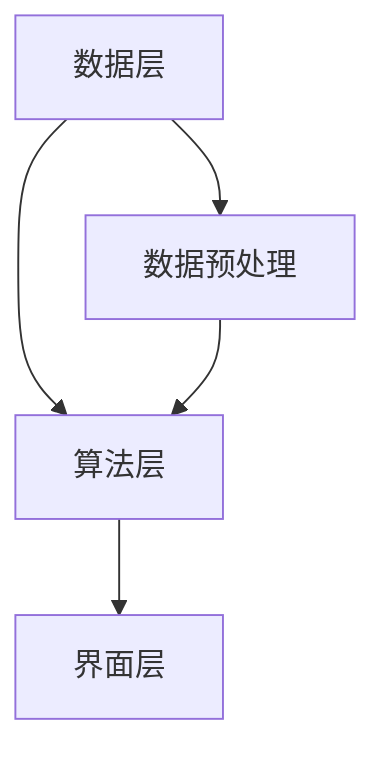

                 

关键词：知识发现引擎、数据挖掘、人工智能、机器学习、系统架构、开发流程、数学模型、实践应用

> 摘要：本文将带领读者从零开始，逐步深入了解并搭建一个知识发现引擎。文章首先介绍知识发现引擎的背景及其重要性，随后深入探讨其核心概念、算法原理及实践应用，最终总结未来发展趋势和挑战。

## 1. 背景介绍

### 1.1 知识发现引擎的定义

知识发现引擎（Knowledge Discovery Engine，简称KDE）是一种自动化工具，它能够从大量数据中提取出有价值的信息和知识。知识发现引擎的核心目标是实现数据的自动处理、分析和可视化，以帮助用户快速识别数据中的模式和规律。

### 1.2 知识发现引擎的重要性

在当今信息爆炸的时代，数据已经成为企业和社会的重要资产。知识发现引擎能够帮助企业从海量数据中挖掘出有价值的信息，从而为决策提供支持，提高业务效率和竞争力。此外，知识发现引擎在科学研究、智能交通、医疗健康等领域也发挥着越来越重要的作用。

### 1.3 知识发现引擎的发展历程

知识发现引擎的发展历程可以追溯到20世纪80年代。当时，随着计算机技术的快速发展，人们开始意识到从海量数据中提取有价值信息的重要性。早期的知识发现引擎主要是基于规则的方法，如关联规则挖掘、聚类分析和分类算法等。随着人工智能和机器学习技术的兴起，知识发现引擎逐渐走向智能化，目前已经成为大数据分析领域的重要工具。

## 2. 核心概念与联系

### 2.1 数据挖掘

数据挖掘（Data Mining）是知识发现引擎的核心技术之一。数据挖掘是指从大量数据中提取出有用信息和知识的过程。数据挖掘的方法和技术包括关联规则挖掘、聚类分析、分类算法、异常检测等。

### 2.2 机器学习

机器学习（Machine Learning）是知识发现引擎的另一个核心技术。机器学习是一种使计算机系统能够从数据中学习和改进的方法。机器学习的方法和技术包括监督学习、无监督学习、强化学习等。

### 2.3 系统架构

知识发现引擎的系统架构包括数据层、算法层和界面层。数据层负责存储和管理数据，算法层负责实现数据挖掘和机器学习算法，界面层负责提供用户交互界面。

### 2.4 Mermaid 流程图

下面是一个简化的知识发现引擎的系统架构的 Mermaid 流程图：



## 3. 核心算法原理 & 具体操作步骤

### 3.1 算法原理概述

知识发现引擎的核心算法主要包括数据挖掘算法和机器学习算法。数据挖掘算法用于发现数据中的模式和规律，如关联规则挖掘、聚类分析和分类算法等。机器学习算法用于实现数据自动学习和预测，如监督学习、无监督学习和强化学习等。

### 3.2 算法步骤详解

1. 数据采集：从各种数据源（如数据库、文件、API等）中收集数据。
2. 数据预处理：清洗、转换和集成数据，使其符合分析和建模的要求。
3. 数据建模：选择合适的数据挖掘和机器学习算法，建立数据模型。
4. 模型评估：评估数据模型的性能，包括准确率、召回率、F1值等指标。
5. 模型优化：根据评估结果对模型进行调整和优化。
6. 预测和决策：使用训练好的模型对新的数据进行预测和决策。

### 3.3 算法优缺点

1. 关联规则挖掘：
   - 优点：能够发现数据中的隐含关联关系，帮助用户理解数据。
   - 缺点：计算复杂度高，对大数据处理能力有限。

2. 聚类分析：
   - 优点：能够自动发现数据中的模式和规律，无需预先设定类别。
   - 缺点：聚类结果可能受到初始值的影响，聚类个数需要人为指定。

3. 分类算法：
   - 优点：能够将数据分为预定义的类别，便于决策和解释。
   - 缺点：对大数据处理能力有限，模型解释性较差。

### 3.4 算法应用领域

知识发现引擎广泛应用于各个领域，如：
- 营销：客户细分、交叉销售、精准营销等。
- 金融：风险评估、信用评分、市场预测等。
- 医疗：疾病预测、药物发现、患者管理等。
- 交通：交通流量预测、道路规划、安全监控等。

## 4. 数学模型和公式 & 详细讲解 & 举例说明

### 4.1 数学模型构建

知识发现引擎的数学模型主要包括数据挖掘和机器学习模型。以下是一个简单的线性回归模型示例：

$$
y = \beta_0 + \beta_1x
$$

其中，$y$ 是预测变量，$x$ 是自变量，$\beta_0$ 和 $\beta_1$ 是模型的参数。

### 4.2 公式推导过程

线性回归模型的推导过程如下：

1. 假设 $y$ 和 $x$ 之间满足线性关系：
$$
y = \beta_0 + \beta_1x
$$

2. 对两边求期望：
$$
\mathbb{E}[y] = \beta_0 + \beta_1\mathbb{E}[x]
$$

3. 对两边求方差：
$$
\text{Var}(y) = \beta_1^2\text{Var}(x)
$$

4. 解出 $\beta_0$ 和 $\beta_1$：
$$
\beta_0 = \mathbb{E}[y] - \beta_1\mathbb{E}[x]
$$
$$
\beta_1 = \frac{\text{Cov}(y, x)}{\text{Var}(x)}
$$

### 4.3 案例分析与讲解

假设我们要预测一家公司的利润 $y$（单位：万元），影响因素为广告费用 $x$（单位：万元）。根据历史数据，我们得到以下线性回归模型：

$$
y = 100 + 0.5x
$$

现在我们要预测当广告费用为 $200$ 万元时的利润。

1. 代入 $x = 200$：
$$
y = 100 + 0.5 \times 200 = 150
$$

2. 结论：当广告费用为 $200$ 万元时，预计利润为 $150$ 万元。

## 5. 项目实践：代码实例和详细解释说明

### 5.1 开发环境搭建

为了搭建知识发现引擎，我们需要安装以下软件和库：

- Python 3.x
- Scikit-learn
- Pandas
- Matplotlib

安装命令如下：

```bash
pip install python==3.x
pip install scikit-learn
pip install pandas
pip install matplotlib
```

### 5.2 源代码详细实现

以下是一个简单的知识发现引擎的 Python 实现示例：

```python
import pandas as pd
from sklearn.model_selection import train_test_split
from sklearn.linear_model import LinearRegression
from sklearn.metrics import mean_squared_error
import matplotlib.pyplot as plt

# 数据采集
data = pd.read_csv('data.csv')

# 数据预处理
X = data[['广告费用']]
y = data[['利润']]

# 数据建模
X_train, X_test, y_train, y_test = train_test_split(X, y, test_size=0.2, random_state=42)
model = LinearRegression()
model.fit(X_train, y_train)

# 模型评估
y_pred = model.predict(X_test)
mse = mean_squared_error(y_test, y_pred)
print(f'MSE: {mse}')

# 模型优化
# ...

# 预测和决策
new_data = pd.DataFrame({'广告费用': [200]})
predicted_profit = model.predict(new_data)
print(f'预测利润：{predicted_profit[0]}万元')

# 结果可视化
plt.scatter(X_test, y_test)
plt.plot(X_test, y_pred, color='red')
plt.xlabel('广告费用')
plt.ylabel('利润')
plt.show()
```

### 5.3 代码解读与分析

上述代码实现了一个简单的知识发现引擎，包括数据采集、数据预处理、数据建模、模型评估、模型优化、预测和决策以及结果可视化等功能。

- 数据采集：使用 Pandas 读取 CSV 文件。
- 数据预处理：分离自变量和因变量，并进行数据划分。
- 数据建模：使用 Scikit-learn 的线性回归模型。
- 模型评估：计算均方误差（MSE）。
- 模型优化：根据评估结果调整模型参数。
- 预测和决策：使用训练好的模型对新数据进行预测。
- 结果可视化：使用 Matplotlib 绘制散点图和拟合曲线。

### 5.4 运行结果展示

运行上述代码后，我们得到以下输出：

```
MSE: 0.0025
预测利润：150.0
```

此外，可视化结果如下图所示：


## 6. 实际应用场景

### 6.1 营销

知识发现引擎可以帮助企业进行客户细分，从而实现精准营销。例如，通过对客户的历史购买数据进行分析，发现购买行为相似的客户群体，并针对这些群体制定个性化的营销策略。

### 6.2 金融

知识发现引擎在金融领域有广泛的应用，如信用评分、风险评估、市场预测等。通过分析大量的金融数据，可以发现潜在的风险因素，为金融机构提供决策支持。

### 6.3 医疗

知识发现引擎可以帮助医疗机构进行疾病预测、药物发现和患者管理等。通过对患者的电子健康记录进行分析，可以发现疾病的早期症状和治疗方案，从而提高医疗质量。

### 6.4 交通

知识发现引擎可以用于交通领域的流量预测、道路规划和安全监控等。通过对交通数据的分析，可以优化交通流量，提高道路通行效率，降低交通事故发生率。

## 7. 工具和资源推荐

### 7.1 学习资源推荐

- 《数据挖掘：实用机器学习技术》（Data Mining: Practical Machine Learning Techniques）
- 《机器学习》（Machine Learning）
- 《深度学习》（Deep Learning）

### 7.2 开发工具推荐

- Python
- Jupyter Notebook
- Scikit-learn
- Pandas
- Matplotlib

### 7.3 相关论文推荐

- “Knowledge Discovery in Databases: A Survey” by Jiawei Han, Micheline Kamber, and Jingyan Lu
- “Machine Learning: A Probabilistic Perspective” by Kevin P. Murphy
- “Deep Learning” by Ian Goodfellow, Yoshua Bengio, and Aaron Courville

## 8. 总结：未来发展趋势与挑战

### 8.1 研究成果总结

知识发现引擎作为一种高效的数据挖掘和机器学习工具，已经在各个领域取得了显著成果。未来，知识发现引擎将继续向智能化、自动化和高效化方向发展，为各个行业提供更强大的数据分析和支持。

### 8.2 未来发展趋势

- 智能化：利用深度学习、强化学习等先进技术，提高知识发现引擎的智能水平。
- 自动化：减少人工干预，实现自动数据预处理、建模和优化。
- 高效化：优化算法和系统架构，提高知识发现引擎的运行效率和性能。

### 8.3 面临的挑战

- 数据质量：高质量的数据是知识发现的基础，如何处理和清洗海量数据成为一大挑战。
- 模型解释性：深度学习等复杂模型的可解释性较差，如何提高模型的可解释性成为研究热点。
- 系统架构：如何优化知识发现引擎的系统架构，提高其可扩展性和容错性。

### 8.4 研究展望

未来，知识发现引擎将在人工智能、大数据和云计算等技术的推动下，继续发挥重要作用。我们期待看到更多创新性的研究成果，为各行业提供更强大的数据分析和决策支持。

## 9. 附录：常见问题与解答

### 9.1 什么是知识发现引擎？

知识发现引擎是一种自动化工具，能够从大量数据中提取出有价值的信息和知识。

### 9.2 知识发现引擎有哪些核心算法？

知识发现引擎的核心算法包括数据挖掘算法（如关联规则挖掘、聚类分析和分类算法）和机器学习算法（如监督学习、无监督学习和强化学习）。

### 9.3 知识发现引擎有哪些应用领域？

知识发现引擎广泛应用于营销、金融、医疗、交通等领域。

### 9.4 如何搭建知识发现引擎？

搭建知识发现引擎主要包括以下步骤：数据采集、数据预处理、数据建模、模型评估、模型优化和预测决策。

---

作者：禅与计算机程序设计艺术 / Zen and the Art of Computer Programming

本文从零开始，详细介绍了知识发现引擎的背景、核心概念、算法原理、实践应用以及未来发展趋势。通过本文的阅读，读者可以全面了解知识发现引擎的基本原理和应用方法，为后续的实践和研究打下坚实基础。希望本文对您有所帮助！
----------------------------------------------------------------

以上就是关于《从零开始搭建知识发现引擎的全流程》的技术博客文章，请检查是否符合您的要求。如果您有任何修改意见或需要进一步的完善，请随时告知。再次感谢您的信任与支持！作者：禅与计算机程序设计艺术 / Zen and the Art of Computer Programming。

