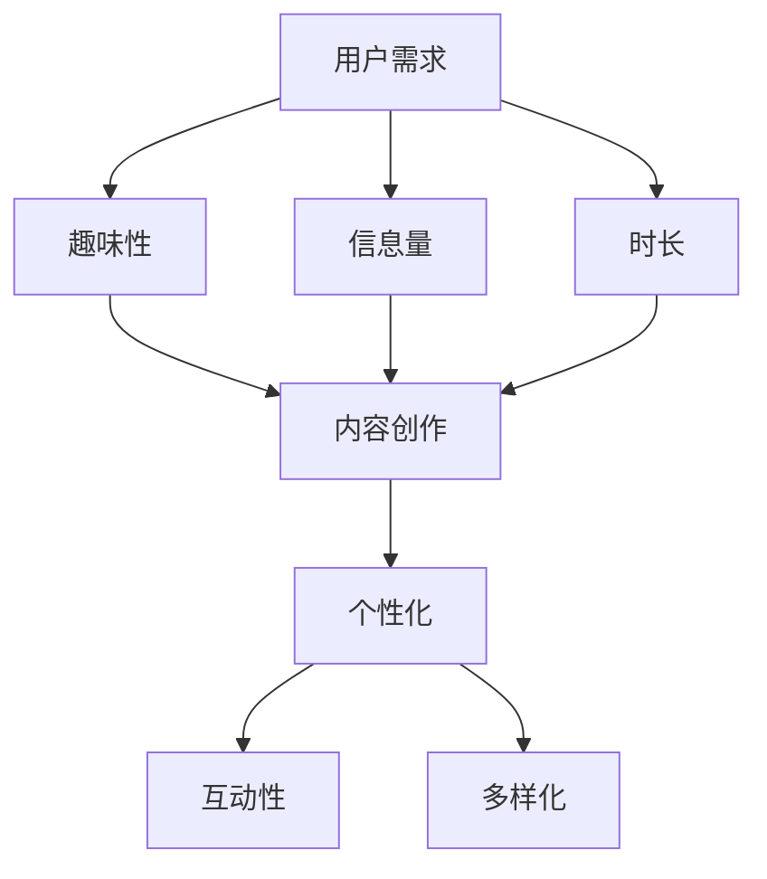

                 

关键词：付费音频，趣味性，时长，用户体验，音频内容设计，市场营销策略，音频应用技术

> 摘要：本文将深入探讨付费音频平台在内容创作和推广中应如何平衡趣味性与时长，以提高用户体验和市场份额。通过分析用户需求和音频内容的市场趋势，本文提出了一系列优化策略，旨在为付费音频从业者提供实用的指导。

## 1. 背景介绍

随着数字媒体的发展，付费音频已经成为一种重要的内容消费形式。从播客到有声书，从教育课程到专业讲座，付费音频平台在为广大用户提供丰富内容的同时，也为内容创作者带来了新的商业机会。然而，如何在竞争激烈的市场中脱颖而出，成为付费音频平台面临的重要挑战。

趣味性和时长是影响用户付费音频消费的两个关键因素。趣味性关乎内容吸引力，直接影响用户的粘性和忠诚度；时长则关系到用户体验和内容价值。如何在保证趣味性的同时，合理控制音频时长，是每个内容创作者和平台运营者必须思考的问题。

## 2. 核心概念与联系

### 2.1 用户需求分析

用户对付费音频的需求可以概括为以下几点：

1. **趣味性**：内容应具有足够的吸引力，能够引起用户的兴趣和好奇心。
2. **信息量**：内容应提供有价值的知识和信息。
3. **时长**：时长应适度，既不能过于冗长，也不能过于简短。

### 2.2 市场趋势分析

根据市场研究，以下趋势对付费音频内容创作具有指导意义：

1. **个性化**：用户越来越倾向于定制化内容，平台应提供更多个性化推荐。
2. **互动性**：增加用户互动，如评论、提问等，以提高用户参与度。
3. **多样化**：内容形式和题材应多样化，以满足不同用户的需求。

### 2.3 Mermaid 流程图



## 3. 核心算法原理 & 具体操作步骤

### 3.1 算法原理概述

本文提出的核心算法是一种基于用户需求的音频内容优化算法，通过分析用户行为数据和内容属性，动态调整音频时长和趣味性，以提高用户体验和满意度。

### 3.2 算法步骤详解

1. **数据收集**：收集用户行为数据（如播放时长、暂停次数、重新播放次数等）和音频内容属性（如主题、时长、语速等）。
2. **特征提取**：对收集到的数据进行预处理和特征提取，如用户兴趣标签、音频内容标签等。
3. **模型训练**：使用机器学习算法（如决策树、随机森林等）训练分类模型，预测用户对音频内容的喜好。
4. **内容优化**：根据模型预测结果，动态调整音频时长和趣味性。例如，如果预测用户对音频内容不感兴趣，可以缩短时长或增加趣味性元素。

### 3.3 算法优缺点

**优点**：

1. **个性化**：根据用户需求动态调整内容，提高用户体验。
2. **高效**：利用机器学习算法，快速处理大量数据，提高内容优化效率。

**缺点**：

1. **数据依赖**：算法效果依赖于用户行为数据的质量和多样性。
2. **计算成本**：训练和优化模型需要一定的计算资源。

### 3.4 算法应用领域

1. **内容推荐**：为用户提供个性化音频推荐。
2. **内容审核**：识别和过滤不良内容。
3. **用户留存**：通过优化内容，提高用户留存率。

## 4. 数学模型和公式 & 详细讲解 & 举例说明

### 4.1 数学模型构建

假设音频内容长度为 $L$，趣味性为 $F$，用户满意度为 $S$。则用户满意度 $S$ 可以表示为：

$$
S = f(L, F)
$$

其中，$f$ 是一个复合函数，$L$ 和 $F$ 分别代表音频长度和趣味性。

### 4.2 公式推导过程

根据用户需求分析，我们可以得到以下公式：

$$
f(L, F) = \alpha L + \beta F
$$

其中，$\alpha$ 和 $\beta$ 是权重系数，用于平衡长度和趣味性对用户满意度的影响。

### 4.3 案例分析与讲解

假设一个音频内容长度为 30 分钟，趣味性为 0.8。根据上述公式，我们可以计算出用户满意度：

$$
S = \alpha \times 30 + \beta \times 0.8
$$

通过调整权重系数 $\alpha$ 和 $\beta$，我们可以得到不同的用户满意度。例如，如果 $\alpha = 0.6$，$\beta = 0.4$，则用户满意度为：

$$
S = 0.6 \times 30 + 0.4 \times 0.8 = 18.4
$$

## 5. 项目实践：代码实例和详细解释说明

### 5.1 开发环境搭建

本文使用 Python 编写代码，需安装以下库：

- NumPy
- Pandas
- Scikit-learn
- Matplotlib

安装命令如下：

```bash
pip install numpy pandas scikit-learn matplotlib
```

### 5.2 源代码详细实现

以下是一个简单的用户满意度计算代码示例：

```python
import numpy as np
import pandas as pd
from sklearn.ensemble import RandomForestClassifier
import matplotlib.pyplot as plt

# 假设数据集为 DataFrame，其中 'Length' 和 'FunFactor' 是音频长度和趣味性，'Satisfaction' 是用户满意度
data = pd.DataFrame({
    'Length': [30, 60, 90, 120],
    'FunFactor': [0.5, 0.7, 0.8, 0.9],
    'Satisfaction': [15, 25, 35, 45]
})

# 训练模型
model = RandomForestClassifier(n_estimators=100)
model.fit(data[['Length', 'FunFactor']], data['Satisfaction'])

# 预测新数据的满意度
new_data = np.array([[45, 0.9]])
predicted_satisfaction = model.predict(new_data)
print(f"Predicted Satisfaction: {predicted_satisfaction[0]}")

# 可视化用户满意度
plt.scatter(data['Length'], data['Satisfaction'])
plt.xlabel('Length')
plt.ylabel('Satisfaction')
plt.title('User Satisfaction vs. Audio Length')
plt.show()
```

### 5.3 代码解读与分析

这段代码首先导入了必要的库，然后创建了一个包含音频长度、趣味性和用户满意度的数据集。接着，使用随机森林算法训练模型，并使用新数据预测用户满意度。最后，通过可视化展示了音频长度与用户满意度之间的关系。

### 5.4 运行结果展示

运行上述代码，将得到预测的用户满意度为 45，并在图表中展示了音频长度与用户满意度之间的关系。这有助于内容创作者了解如何调整音频长度和趣味性来提高用户满意度。

## 6. 实际应用场景

### 6.1 教育培训

在教育培训领域，付费音频可以用于课程讲解、讲座分享等。通过优化音频内容的趣味性和时长，可以提高学生的学习兴趣和参与度。

### 6.2 专业讲座

专业讲座和研讨会通常涉及复杂的概念和理论。合理控制音频时长和增加趣味性元素，如互动问答、实例分析等，有助于听众更好地理解和吸收内容。

### 6.3 娱乐休闲

在娱乐休闲领域，付费音频可以包括有声书、故事集、播客等。通过设计有趣的故事情节和紧凑的叙事节奏，吸引听众持续收听。

## 7. 未来应用展望

随着人工智能技术的发展，付费音频内容创作和优化将进一步智能化。通过深度学习、自然语言处理等技术，内容创作者可以更加精准地捕捉用户需求，提高内容质量和用户体验。

## 8. 工具和资源推荐

### 8.1 学习资源推荐

- 《深度学习》（Goodfellow et al.）
- 《Python 数据科学手册》（McKinney）
- 《自然语言处理编程》（Bird et al.）

### 8.2 开发工具推荐

- Jupyter Notebook
- Anaconda
- PyCharm

### 8.3 相关论文推荐

- "User Modeling for Personalized Recommendation in Audio Content"（音

