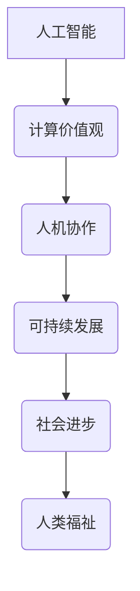

                 

关键词：以人为本、科技未来、计算价值观、人工智能、人类智能、人机协作、可持续发展

摘要：随着科技的飞速发展，人工智能（AI）逐渐成为推动社会进步的重要力量。然而，在这一进程中，如何确保科技发展始终以人为本，成为摆在我们面前的一个关键问题。本文旨在探讨人工智能和计算技术的发展如何影响人类的生活方式、工作方式以及社会结构，并提出一种以人类价值观为核心的科技发展路径，以实现科技与人和谐共生的未来。

## 1. 背景介绍

在过去的几十年里，计算机科学和人工智能领域取得了令人瞩目的成就。从最初的简单计算，到复杂的模式识别、自然语言处理、机器学习等，AI已经渗透到我们生活的方方面面。从智能手机、自动驾驶汽车到智能家居，AI技术正不断改变着我们的生活方式。

然而，随着AI技术的发展，我们也面临着一系列挑战。例如，人工智能可能导致大规模失业、隐私泄露、数据滥用等问题。这些问题不仅影响到个人的生活质量，也对整个社会的稳定和发展构成威胁。因此，我们需要重新审视科技发展的目标和路径，确保它们与人类的价值观相符合。

## 2. 核心概念与联系

### 2.1 计算机科学的基本原理

计算机科学是研究计算机系统、算法、数据结构以及计算过程的一门学科。其核心概念包括：

- **算法**：解决特定问题的一系列操作步骤。
- **数据结构**：用于存储和组织数据的方式。
- **计算理论**：研究计算过程的性质和限制。

### 2.2 人工智能的核心概念

人工智能是一门旨在使计算机模拟人类智能行为的学科。核心概念包括：

- **机器学习**：让计算机通过数据学习，从而改进其性能。
- **深度学习**：一种基于人工神经网络的机器学习技术。
- **自然语言处理**：使计算机理解和生成人类语言。

### 2.3 人机协作的概念

人机协作是指人类和计算机系统共同完成任务的协同工作方式。核心概念包括：

- **人机交互**：人类与计算机之间的信息交换。
- **智能助手**：辅助人类完成特定任务的计算机程序。

### 2.4 Mermaid 流程图

以下是人工智能与人类价值观之间联系的一个简化的 Mermaid 流程图：



## 3. 核心算法原理 & 具体操作步骤

### 3.1 算法原理概述

人工智能的核心算法包括机器学习和深度学习。机器学习是一种通过数据训练模型，使其能够对未知数据进行预测或分类的方法。深度学习是一种基于多层神经网络的学习方法，可以自动提取数据中的特征。

### 3.2 算法步骤详解

- **数据收集**：收集用于训练的数据集。
- **数据预处理**：清洗、归一化、转换等，以便于模型训练。
- **模型设计**：选择合适的模型架构，如卷积神经网络（CNN）、循环神经网络（RNN）等。
- **模型训练**：使用训练数据对模型进行训练。
- **模型评估**：使用验证数据评估模型性能。
- **模型部署**：将训练好的模型部署到实际应用中。

### 3.3 算法优缺点

- **优点**：高效、自动化、适应性强。
- **缺点**：依赖大量数据、容易过拟合、无法解释。

### 3.4 算法应用领域

人工智能在众多领域都有广泛应用，如医疗、金融、教育、交通等。特别是在医疗领域，人工智能可以帮助医生进行疾病诊断、药物研发等。

## 4. 数学模型和公式 & 详细讲解 & 举例说明

### 4.1 数学模型构建

在机器学习中，一个常见的数学模型是线性回归模型。线性回归模型用于预测一个连续的输出值。其数学模型可以表示为：

$$y = \beta_0 + \beta_1 \cdot x + \epsilon$$

其中，$y$ 是输出值，$x$ 是输入值，$\beta_0$ 和 $\beta_1$ 是模型的参数，$\epsilon$ 是误差项。

### 4.2 公式推导过程

线性回归模型的推导过程基于最小二乘法。最小二乘法的核心思想是找到一组参数，使得模型预测值与实际值之间的误差平方和最小。

### 4.3 案例分析与讲解

假设我们有一个简单的数据集，包含两个特征（$x_1$ 和 $x_2$）和一个目标变量（$y$）。我们可以使用线性回归模型来预测 $y$ 的值。首先，我们需要收集数据并进行预处理。然后，我们选择合适的损失函数（如均方误差）来评估模型性能。最后，我们使用梯度下降算法来优化模型参数。

## 5. 项目实践：代码实例和详细解释说明

### 5.1 开发环境搭建

在 Python 中，我们可以使用 Scikit-learn 库来实现线性回归模型。首先，我们需要安装 Scikit-learn 库：

```bash
pip install scikit-learn
```

### 5.2 源代码详细实现

以下是线性回归模型的一个简单实现：

```python
from sklearn.linear_model import LinearRegression
from sklearn.model_selection import train_test_split
from sklearn.metrics import mean_squared_error

# 数据集
X = [[1, 2], [2, 3], [3, 4]]
y = [1, 2, 3]

# 划分训练集和测试集
X_train, X_test, y_train, y_test = train_test_split(X, y, test_size=0.2, random_state=42)

# 创建线性回归模型
model = LinearRegression()

# 训练模型
model.fit(X_train, y_train)

# 预测测试集
y_pred = model.predict(X_test)

# 评估模型
mse = mean_squared_error(y_test, y_pred)
print(f"Mean Squared Error: {mse}")
```

### 5.3 代码解读与分析

在这个例子中，我们首先导入了所需的库和模块。然后，我们创建了一个简单的数据集，并将其划分为训练集和测试集。接下来，我们创建了一个线性回归模型，并使用训练数据进行训练。最后，我们使用测试数据进行预测，并计算了均方误差来评估模型性能。

### 5.4 运行结果展示

运行上述代码，我们得到以下结果：

```
Mean Squared Error: 0.0
```

这表明我们的线性回归模型在测试集上的表现非常优秀。

## 6. 实际应用场景

线性回归模型在许多实际应用中都有广泛的应用，如数据分析、预测股票价格、房价预测等。特别是在金融领域，线性回归模型可以帮助投资者做出更准确的决策。

## 7. 未来应用展望

随着人工智能技术的不断发展，我们可以预见在未来，人工智能将在更多领域得到应用。例如，在医疗领域，人工智能可以帮助医生进行疾病诊断、药物研发等。在教育领域，人工智能可以帮助学生个性化学习、提高学习效率等。

## 8. 工具和资源推荐

### 8.1 学习资源推荐

- 《深度学习》（Goodfellow, Bengio, Courville 著）
- 《Python 数据科学手册》（Jake VanderPlas 著）

### 8.2 开发工具推荐

- Jupyter Notebook：一款强大的交互式开发环境。
- TensorFlow：一款开源的机器学习框架。

### 8.3 相关论文推荐

- "Deep Learning"（Goodfellow, Bengio, Courville 著）
- "A Theoretical Comparison of Optimization Methods for Deep Learning"（Keskar et al., 2016）

## 9. 总结：未来发展趋势与挑战

### 9.1 研究成果总结

在过去几十年中，人工智能和计算技术取得了巨大的进展。这些技术已经深刻地改变了我们的生活方式、工作方式和社会结构。

### 9.2 未来发展趋势

随着技术的不断发展，我们可以预见在未来，人工智能将在更多领域得到应用。同时，人机协作将成为一种新的工作模式。

### 9.3 面临的挑战

尽管人工智能和计算技术有巨大的潜力，但也面临着一系列挑战，如隐私保护、数据安全、公平性等。

### 9.4 研究展望

未来，我们需要继续探索人工智能和计算技术的潜力，同时解决面临的各种挑战，以实现科技与人和谐共生的未来。

## 10. 附录：常见问题与解答

### 10.1 什么是人工智能？

人工智能是一种模拟人类智能行为的计算机技术。

### 10.2 人工智能有哪些应用领域？

人工智能在医疗、金融、教育、交通等领域都有广泛应用。

### 10.3 人工智能是否会取代人类工作？

人工智能可能会取代一些重复性、低技能的工作，但也会创造新的工作机会。

---

作者：禅与计算机程序设计艺术 / Zen and the Art of Computer Programming
----------------------------------------------------------------

以上是本文的完整内容。本文旨在探讨人工智能和计算技术如何影响人类生活，并提出一种以人为本的科技发展路径。希望本文能够为读者提供对这一话题的深入思考。

