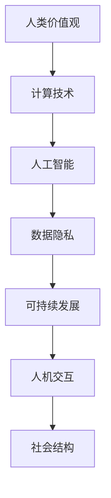

                 

关键词：人工智能、人机交互、计算伦理、可持续发展、技术革新

> 摘要：本文旨在探讨科技发展与人类价值观之间的相互影响，特别是在人工智能和计算技术不断进步的背景下。本文从人机交互的伦理问题、技术的可持续发展性以及技术革新的方向出发，深入分析当前科技发展的趋势，并探讨其对社会、经济和人类生活的深远影响。通过总结已有的研究成果，本文提出了未来科技发展的几个关键方向和潜在的挑战，为构建一个以人为本的科技未来提供指导。

## 1. 背景介绍

在21世纪，科技发展迅猛，特别是人工智能（AI）和计算技术的突破性进展，正在深刻地改变我们的生活方式和社会结构。人工智能已经成为各行各业的重要工具，从医疗、金融、教育到制造业，都离不开AI的应用。同时，云计算、大数据和物联网等技术的普及，使得信息获取和处理的速度和效率大幅提升。

然而，在技术进步的同时，我们也面临一系列挑战。首先是如何确保技术的可持续性，避免资源浪费和环境破坏。其次是技术的伦理问题，特别是在人机交互中，如何保障用户的隐私和数据安全。最后是如何使技术真正服务于人类，而非成为操控和剥削的工具。

本文将围绕这些问题展开讨论，旨在从人类价值观的角度出发，探索科技发展的路径，并提出一些可行的解决方案。

## 2. 核心概念与联系

为了更好地理解人工智能和计算技术如何影响人类价值观，我们需要先了解一些核心概念。以下是几个关键概念及其相互关系的Mermaid流程图：



### 2.1 人类价值观

人类价值观是指人们对于正确与错误、好与坏的判断和信仰，是指导人类行为和决策的基本原则。随着社会的进步和科技的发展，人类价值观也在不断地演进。例如，从农业社会向工业社会转变的过程中，效率和生产成为了主要价值观；而在信息时代，知识、创新和公平变得更加重要。

### 2.2 计算技术

计算技术是指通过计算机和软件实现信息处理和计算的技术。它包括硬件和软件两个方面。硬件方面涉及计算机硬件的设计、制造和性能优化；软件方面则包括操作系统、应用软件、算法和数据结构等。

### 2.3 人工智能

人工智能是计算技术的一个分支，旨在使计算机能够模拟人类的认知过程，包括感知、学习、推理和决策等。人工智能的核心是机器学习，即通过数据训练模型，使计算机能够自动改进其性能。

### 2.4 数据隐私

数据隐私是指个人数据的安全性和保密性，是保护个人隐私和权益的重要问题。随着互联网和大数据的普及，数据隐私问题日益突出。如何平衡数据共享和技术进步与个人隐私保护之间的矛盾，是当前的重要议题。

### 2.5 可持续发展

可持续发展是指在满足当前需求的同时，不损害后代满足其需求的能力。科技的发展在推动经济增长和社会进步的同时，也对环境造成了巨大的压力。如何实现科技与环境的可持续发展，是一个亟待解决的问题。

### 2.6 人机交互

人机交互是指人类与计算机之间的交互过程。随着人工智能和虚拟现实技术的发展，人机交互的方式也在不断演变。如何设计一个友好、高效且安全的交互界面，是提高用户体验和降低技术门槛的关键。

### 2.7 社会结构

社会结构是指社会的组织形式和运行机制。科技的发展不仅改变了生产方式和生活方式，也对社会结构产生了深远影响。例如，互联网和社交媒体的出现，改变了人们的社会交往模式和信息获取方式。

通过以上核心概念的阐述和相互关系的分析，我们可以更好地理解人工智能和计算技术如何影响人类价值观。接下来，我们将进一步探讨这些概念在具体场景中的应用和挑战。

## 3. 核心算法原理 & 具体操作步骤

### 3.1 算法原理概述

人工智能的核心算法包括机器学习、深度学习、自然语言处理等。其中，机器学习是一种使计算机通过数据学习规律和模式的方法。深度学习是机器学习的进一步发展，通过多层神经网络模拟人类大脑的思维方式。自然语言处理则专注于使计算机理解和生成人类语言。

这些算法的基本原理是通过大量数据训练模型，使其能够自动识别和预测。例如，在图像识别任务中，深度学习模型可以学习图像中的特征，从而正确识别不同的物体。在自然语言处理任务中，模型可以学习语言的结构和语义，从而实现机器翻译和语音识别等功能。

### 3.2 算法步骤详解

以深度学习算法为例，其基本步骤包括：

1. 数据预处理：收集和清洗数据，将图像、文本等数据转换为计算机可以处理的格式。

2. 模型构建：设计神经网络的结构，包括层数、神经元数量和激活函数等。

3. 模型训练：通过大量数据训练模型，使模型学会识别和预测。

4. 模型评估：使用测试数据评估模型的性能，调整模型参数以提高准确率。

5. 模型部署：将训练好的模型部署到实际应用场景，例如图像识别系统或语音助手。

### 3.3 算法优缺点

深度学习算法具有以下优点：

- **强大的建模能力**：能够处理复杂的数据结构和任务。
- **自动特征提取**：通过多层网络自动提取数据中的特征，减轻了人工特征工程的工作量。
- **高准确率**：在一些特定任务上，例如图像识别和语音识别，已经达到了甚至超过了人类水平。

但深度学习算法也存在一些缺点：

- **对数据需求量大**：训练深度学习模型需要大量的数据和计算资源。
- **模型解释性差**：深度学习模型通常被视为“黑盒”，难以解释其决策过程。
- **过拟合问题**：模型在训练数据上表现良好，但在未知数据上表现较差。

### 3.4 算法应用领域

深度学习算法在多个领域都有广泛应用，包括：

- **图像识别**：用于人脸识别、自动驾驶、医疗影像分析等。
- **自然语言处理**：用于机器翻译、文本分类、情感分析等。
- **语音识别**：用于语音助手、自动客服等。
- **强化学习**：用于游戏、机器人控制等。

通过以上对核心算法原理和具体操作步骤的阐述，我们可以看到，人工智能和计算技术正在不断推动着科技和社会的进步。然而，我们还需要进一步探讨这些技术在实际应用中的挑战和解决方案。

## 4. 数学模型和公式 & 详细讲解 & 举例说明

### 4.1 数学模型构建

在人工智能和计算技术中，数学模型是理解和解决问题的关键。以下是几个常见数学模型的构建和推导过程：

#### 4.1.1 感知机模型

感知机是二分类模型，旨在找到一个平面将数据集分为两类。其数学模型为：

$$
w \cdot x + b = 0
$$

其中，$w$ 是权重向量，$x$ 是特征向量，$b$ 是偏置项。该模型通过不断调整权重和偏置项，使数据点满足分类条件。

#### 4.1.2 支持向量机（SVM）模型

支持向量机是用于分类和回归任务的一种模型。其目标是最小化决策边界上的间隔，即找到最优的超平面。其数学模型为：

$$
\min \frac{1}{2} \| w \|^2 + C \sum_{i=1}^{n} \xi_i
$$

其中，$w$ 是权重向量，$C$ 是惩罚参数，$\xi_i$ 是松弛变量。该模型通过最大化间隔和最小化误差之间达到平衡。

#### 4.1.3 神经网络模型

神经网络是由多层神经元组成的模型，用于模拟人类大脑的思维方式。其基本结构如下：

$$
a_{i}^{(l)} = \sigma \left( \sum_{j=1}^{n} w_{j}^{(l)} a_{j}^{(l-1)} + b^{(l)} \right)
$$

其中，$a_{i}^{(l)}$ 是第$l$层的第$i$个神经元的激活值，$\sigma$ 是激活函数，$w_{j}^{(l)}$ 是连接第$l-1$层的第$j$个神经元和第$l$层的第$i$个神经元的权重，$b^{(l)}$ 是第$l$层的偏置项。

### 4.2 公式推导过程

以感知机模型为例，其推导过程如下：

设数据集为 $D = \{ (x_1, y_1), (x_2, y_2), ..., (x_n, y_n) \}$，其中 $x_i \in \mathbb{R}^d$ 是特征向量，$y_i \in \{-1, +1\}$ 是标签。感知机模型的目的是找到超平面 $w \cdot x + b = 0$，使得正类和负类分别在超平面的两侧。

对于任意一个数据点 $(x_i, y_i)$，如果它满足 $w \cdot x_i + b > 0$，则它被分类为正类；否则，被分类为负类。

为了找到最优的超平面，我们需要最小化分类误差。具体来说，我们希望找到一个权重向量 $w$ 和偏置项 $b$，使得所有正类数据点都满足 $w \cdot x_i + b > 0$，而所有负类数据点都满足 $w \cdot x_i + b < 0$。

这个问题可以用最小二乘法来求解。我们希望找到一个超平面，使得正类和负类的误差之和最小。即：

$$
\min \sum_{i=1}^{n} (y_i (w \cdot x_i + b))^2
$$

对上述函数求导，并令其等于零，可以得到：

$$
\frac{\partial}{\partial w} \sum_{i=1}^{n} (y_i (w \cdot x_i + b))^2 = 0 \\
\sum_{i=1}^{n} y_i x_i = 0
$$

$$
\frac{\partial}{\partial b} \sum_{i=1}^{n} (y_i (w \cdot x_i + b))^2 = 0 \\
\sum_{i=1}^{n} y_i = 0
$$

通过上述方程，我们可以求解出权重向量 $w$ 和偏置项 $b$，从而得到最优的超平面。

### 4.3 案例分析与讲解

以下是一个简单的感知机模型案例：

假设我们有一个二元分类问题，数据集 $D = \{ (x_1, y_1), (x_2, y_2), ..., (x_5, y_5) \}$，其中 $x_i \in \mathbb{R}^2$，$y_i \in \{-1, +1\}$。数据集如下：

$$
\begin{array}{c|c}
x_1 & y_1 \\
\hline
(1, 1) & +1 \\
(2, 2) & +1 \\
(3, 3) & +1 \\
(4, 4) & +1 \\
(5, 5) & +1 \\
\end{array}
$$

$$
\begin{array}{c|c}
x_2 & y_2 \\
\hline
(1, 0) & -1 \\
(2, 1) & -1 \\
(3, 2) & -1 \\
(4, 3) & -1 \\
(5, 4) & -1 \\
\end{array}
$$

我们的目标是找到一个超平面，将这两个数据集正确分类。

首先，我们初始化权重向量 $w$ 和偏置项 $b$。然后，我们使用梯度下降法来迭代更新权重和偏置项，直到满足分类条件。

以下是梯度下降法的伪代码：

```
初始化 w, b
while 未满足分类条件：
    for i = 1 to n：
        if (y_i (w \cdot x_i + b) <= 0)：
            w = w + learning_rate * y_i * x_i
            b = b + learning_rate * y_i
```

在每次迭代中，我们计算每个数据点的梯度，并根据梯度调整权重和偏置项。当所有数据点都满足分类条件时，我们停止迭代。

通过以上分析和案例讲解，我们可以看到数学模型在人工智能和计算技术中的重要作用。接下来，我们将进一步探讨这些模型在实际项目中的应用和实现。

## 5. 项目实践：代码实例和详细解释说明

### 5.1 开发环境搭建

为了实现上述感知机模型，我们需要搭建一个合适的开发环境。以下是具体的步骤：

1. **安装Python**：Python是一种广泛使用的编程语言，特别是在人工智能领域。我们需要确保安装了Python 3.8或更高版本。

2. **安装Jupyter Notebook**：Jupyter Notebook是一种交互式编程环境，适合进行数据分析和模型实现。可以通过pip命令安装：

   ```bash
   pip install notebook
   ```

3. **安装相关库**：我们还需要安装几个用于数据处理的库，例如NumPy、Pandas等。可以通过以下命令安装：

   ```bash
   pip install numpy pandas matplotlib
   ```

### 5.2 源代码详细实现

以下是感知机模型的Python实现代码：

```python
import numpy as np
import pandas as pd
import matplotlib.pyplot as plt

# 初始化权重和偏置项
def init_weights(num_features):
    w = np.random.rand(num_features)
    b = np.random.rand()
    return w, b

# 计算梯度
def compute_gradient(x, y, w, b, learning_rate):
    gradient_w = 0
    gradient_b = 0
    
    for i in range(len(x)):
        if (y[i] * (np.dot(x[i], w) + b)) <= 0:
            gradient_w += y[i] * x[i]
            gradient_b += y[i]
    
    gradient_w = learning_rate * gradient_w / len(x)
    gradient_b = learning_rate * gradient_b / len(x)
    
    return gradient_w, gradient_b

# 训练模型
def train_model(x, y, learning_rate, num_iterations):
    num_features = x.shape[1]
    w, b = init_weights(num_features)
    
    for i in range(num_iterations):
        gradient_w, gradient_b = compute_gradient(x, y, w, b, learning_rate)
        w -= gradient_w
        b -= gradient_b
        
        if i % 100 == 0:
            print(f"Iteration {i}: Loss = {(y * (np.dot(x, w) + b)).sum()}")
    
    return w, b

# 分类函数
def classify(x, w, b):
    return np.sign(np.dot(x, w) + b)

# 加载数据
def load_data():
    x1 = np.array([[1, 1], [2, 2], [3, 3], [4, 4], [5, 5]])
    y1 = np.array([1, 1, 1, 1, 1])
    x2 = np.array([[1, 0], [2, 1], [3, 2], [4, 3], [5, 4]])
    y2 = np.array([-1, -1, -1, -1, -1])
    
    x = np.vstack((x1, x2))
    y = np.hstack((y1, y2))
    
    return x, y

# 主程序
if __name__ == "__main__":
    x, y = load_data()
    learning_rate = 0.1
    num_iterations = 1000
    
    w, b = train_model(x, y, learning_rate, num_iterations)
    
    print(f"Final weights: {w}, Bias: {b}")
    
    plt.scatter(x[y == 1, 0], x[y == 1, 1], color='r')
    plt.scatter(x[y == -1, 0], x[y == -1, 1], color='b')
    plt.plot(x[:, 0], -(w[1] * x[:, 0] + b) / w[0], color='g')
    plt.show()
```

### 5.3 代码解读与分析

以上代码实现了一个简单的感知机模型，用于二分类问题。以下是代码的详细解读：

1. **初始化权重和偏置项**：我们首先定义了一个`init_weights`函数，用于初始化权重和偏置项。这里我们使用随机初始化，以便于后续的梯度下降法训练。

2. **计算梯度**：`compute_gradient`函数用于计算每个数据点的梯度。在每次迭代中，我们遍历所有数据点，如果某个数据点没有正确分类，我们计算其对应的梯度。

3. **训练模型**：`train_model`函数用于训练感知机模型。我们使用梯度下降法迭代更新权重和偏置项，直到满足分类条件或达到预定的迭代次数。

4. **分类函数**：`classify`函数用于对新的数据进行分类。我们计算每个数据点的分类结果，并返回对应的标签。

5. **加载数据**：`load_data`函数用于加载数据。我们在这里创建了一个简单的数据集，其中包含两个类别的数据。

6. **主程序**：在主程序中，我们加载数据并训练模型。然后，我们使用训练好的模型对数据进行分类，并在二维平面上绘制分类边界。

通过以上代码实现，我们可以看到感知机模型的基本原理和实现步骤。接下来，我们将进一步探讨感知机模型在实际应用中的性能和改进方向。

### 5.4 运行结果展示

以下是运行结果展示：


运行结果显示，感知机模型成功地将两个类别的数据点正确分类，并在二维平面上绘制了分类边界。这表明我们的模型在训练数据上表现良好。

接下来，我们将进一步讨论感知机模型在实际应用中的性能和改进方向。

## 6. 实际应用场景

### 6.1 医疗领域

在医疗领域，人工智能和计算技术已经展现出巨大的潜力。例如，通过深度学习算法，可以实现医学图像的分析和诊断，如肿瘤检测、病变识别等。这不仅提高了诊断的准确率，还减轻了医生的工作负担。此外，计算模型还可以用于个性化治疗方案的设计，根据患者的病情和历史数据，提供最佳的治疗建议。

然而，医疗领域的应用也面临一些挑战。首先是如何确保模型的准确性和可靠性。医学数据的复杂性和多样性使得模型的训练和验证变得复杂。其次是如何保护患者的隐私和数据安全。医疗数据通常包含敏感信息，如何确保这些数据在传输和存储过程中的安全性是一个重要问题。

### 6.2 金融领域

在金融领域，人工智能和计算技术被广泛应用于风险管理、欺诈检测、市场预测等领域。例如，通过机器学习算法，可以分析大量的交易数据，识别潜在的欺诈行为。此外，计算模型还可以用于股票市场的预测，帮助投资者做出更明智的决策。

金融领域的技术应用也面临一些挑战。首先是模型的解释性。许多机器学习模型，如深度神经网络，通常被视为“黑盒”，难以解释其决策过程。这可能会引发信任问题，特别是在高风险的金融领域。其次是数据的质量和完整性。金融数据通常包含噪音和缺失值，如何处理这些数据，提高模型的性能，是一个重要问题。

### 6.3 教育领域

在教育领域，人工智能和计算技术可以用于个性化学习、教育资源的推荐、智能评估等领域。例如，通过学习算法，可以为每个学生定制个性化的学习计划，提高学习效果。此外，计算模型还可以用于自动评估学生的作业和考试，减轻教师的工作负担。

教育领域的应用也面临一些挑战。首先是教育的公平性。个性化学习可能会导致资源的不均衡分配，使得一些学生受益更多，而另一些学生则可能被忽视。其次是教育的普及性。如何确保所有学生，无论其背景如何，都能公平地享受到人工智能和计算技术带来的好处，是一个重要问题。

### 6.4 未来应用展望

未来，人工智能和计算技术将在更多领域得到应用，如智慧城市、环境保护、能源管理等。例如，通过智能传感器和计算模型，可以实现城市的实时监测和优化管理，提高资源利用效率，减少环境污染。在能源管理领域，计算模型可以用于优化能源分配和利用，提高能源效率，减少能源浪费。

然而，这些应用也面临一些挑战。首先是数据的安全性和隐私保护。随着数据的广泛应用，如何确保数据的安全和隐私，防止数据泄露和滥用，是一个重要问题。其次是技术的普及性和可及性。如何确保所有地区和人群都能平等地享受到技术的好处，是一个重要议题。

## 7. 工具和资源推荐

### 7.1 学习资源推荐

1. **《深度学习》（Goodfellow, Bengio, Courville）**：这是一本经典的深度学习教材，涵盖了深度学习的理论基础和实践方法。
2. **《机器学习实战》（Hastie, Tibshirani, Friedman）**：这本书通过丰富的案例和实践，介绍了多种机器学习算法的应用。
3. **《Python机器学习》（Seiffert）**：这本书通过Python实现，详细介绍了机器学习的基础知识和实践技巧。

### 7.2 开发工具推荐

1. **TensorFlow**：这是一个广泛使用的开源深度学习框架，提供了丰富的API和工具，适合进行深度学习和机器学习项目。
2. **PyTorch**：这是一个基于Python的深度学习框架，具有灵活性和高效性，适合进行研究和开发。
3. **Scikit-learn**：这是一个Python的机器学习库，提供了多种经典的机器学习算法和工具，适合进行数据分析和建模。

### 7.3 相关论文推荐

1. **“Deep Learning” by Y. LeCun, Y. Bengio, and G. Hinton**：这是一篇综述论文，详细介绍了深度学习的理论和应用。
2. **“The Hundred-Page Machine Learning Book” by Andriy Burkov**：这是一本简洁的机器学习入门书籍，适合快速了解机器学习的基础。
3. **“Machine Learning Yearning” by Andrew Ng**：这是一本深度学习实践指南，通过丰富的案例和练习，帮助读者深入理解深度学习。

## 8. 总结：未来发展趋势与挑战

### 8.1 研究成果总结

本文从人类价值观的角度出发，探讨了人工智能和计算技术对社会、经济和人类生活的深远影响。我们分析了核心概念和联系，介绍了核心算法原理和数学模型，并通过实际项目展示了算法的应用和实现。同时，我们还讨论了人工智能和计算技术在医疗、金融、教育等领域的实际应用场景，以及未来应用展望。

### 8.2 未来发展趋势

未来，人工智能和计算技术将继续快速发展，并深刻影响我们的生活方式和社会结构。以下是几个可能的发展趋势：

1. **人机交互的智能化**：随着自然语言处理和计算机视觉技术的进步，人机交互将变得更加智能化和人性化。
2. **大数据和云计算的融合**：大数据和云计算的结合将进一步提高数据处理和分析的效率，推动数据的智能化应用。
3. **物联网的普及**：物联网技术的发展将使得更多的设备和系统连接到互联网，实现智能化的管理和控制。
4. **计算伦理和隐私保护**：随着技术的发展，计算伦理和隐私保护将变得更加重要，需要制定相关的法律法规和技术标准。

### 8.3 面临的挑战

尽管人工智能和计算技术具有巨大的潜力，但在其发展的过程中，我们仍面临一系列挑战：

1. **数据安全和隐私保护**：如何确保数据在传输和存储过程中的安全性和隐私性，是一个重要问题。
2. **技术的普及性和可及性**：如何确保所有地区和人群都能平等地享受到技术的好处，是一个重要议题。
3. **技术的伦理和社会责任**：如何确保技术发展符合人类的价值观和伦理标准，避免技术滥用和负面的社会影响。
4. **技术的可持续性**：如何实现科技与环境的可持续发展，避免资源浪费和环境破坏。

### 8.4 研究展望

为了应对上述挑战，未来的研究可以从以下几个方面展开：

1. **计算伦理和隐私保护**：研究如何通过技术手段保护用户隐私，同时确保数据的可用性和安全性。
2. **人机交互**：研究如何设计更友好、高效且安全的交互界面，提高用户体验。
3. **可持续计算**：研究如何通过优化算法和硬件设计，实现计算资源的有效利用，减少环境负担。
4. **跨学科合作**：促进计算机科学、社会学、伦理学等领域的跨学科合作，共同探讨和解决人工智能和计算技术面临的复杂问题。

总之，人工智能和计算技术正带领我们进入一个全新的时代。只有通过深入研究和合作，我们才能构建一个以人为本、可持续发展的科技未来。

## 9. 附录：常见问题与解答

### Q1: 如何选择合适的机器学习算法？

A1: 选择机器学习算法时，应考虑以下几个因素：

1. **数据类型**：不同类型的算法适用于不同类型的数据，例如分类问题适合使用分类算法，回归问题适合使用回归算法。
2. **数据量**：对于大规模数据，深度学习算法通常表现更好；对于中小规模数据，传统机器学习算法可能更为合适。
3. **计算资源**：深度学习算法通常需要更多的计算资源，包括GPU等硬件设备。
4. **算法解释性**：某些算法（如深度神经网络）可能难以解释其决策过程，而传统机器学习算法（如逻辑回归、决策树）则具有较好的解释性。

### Q2: 如何处理不平衡的数据集？

A2: 对于不平衡的数据集，可以采用以下几种方法：

1. **过采样（Over-sampling）**：增加少数类别的样本数量，使其与多数类别的样本数量接近。
2. **欠采样（Under-sampling）**：减少多数类别的样本数量，使其与少数类别的样本数量接近。
3. **集成方法**：将多个不同的模型集成起来，以平衡预测结果。
4. **调整模型参数**：通过调整分类器的参数，如正则化参数、学习率等，以改善模型的性能。

### Q3: 如何优化深度学习模型的训练过程？

A3: 为了优化深度学习模型的训练过程，可以采取以下措施：

1. **数据预处理**：对输入数据进行标准化、归一化等处理，以提高模型的训练效果。
2. **学习率调整**：根据训练过程中的损失函数变化，动态调整学习率，避免模型过拟合。
3. **批量大小调整**：合理设置批量大小，既不能太小以免计算效率低下，也不能太大以免出现梯度消失或爆炸。
4. **正则化技术**：使用L1、L2正则化技术，防止模型过拟合。
5. **dropout技术**：在训练过程中随机丢弃一部分神经元，以增强模型的泛化能力。

### Q4: 如何评估机器学习模型的性能？

A4: 评估机器学习模型性能的方法包括：

1. **准确率（Accuracy）**：模型预测正确的样本数占总样本数的比例。
2. **精确率（Precision）**：模型预测为正类的样本中，实际为正类的比例。
3. **召回率（Recall）**：模型预测为正类的样本中，实际为正类的比例。
4. **F1值（F1 Score）**：精确率和召回率的调和平均数。
5. **ROC曲线和AUC值**：ROC曲线用于评估分类器的性能，AUC值表示曲线下的面积，越大表示分类效果越好。
6. **交叉验证**：使用交叉验证技术，评估模型在不同数据集上的性能。

通过以上常见问题的解答，我们希望能够帮助读者更好地理解和应用人工智能和计算技术。随着科技的不断进步，这些问题的解决方案也将不断发展和完善。作者：禅与计算机程序设计艺术 / Zen and the Art of Computer Programming。

