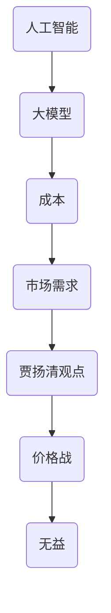

                 

关键词：贾扬清、价格战、大模型、成本下降、实际问题、技术趋势

> 摘要：本文由贾扬清的视角出发，探讨了人工智能领域中的价格战现象。文章分析了大模型价格下降的趋势，并指出了这种趋势背后的原因和潜在的负面影响。此外，本文还聚焦于实际问题，讨论了价格战对人工智能研究和产业发展的实际影响，并对未来发展趋势和挑战进行了展望。

## 1. 背景介绍

在过去几年中，人工智能（AI）领域经历了飞速发展。随着深度学习算法的不断进步和计算能力的提升，大规模的人工智能模型逐渐成为可能。这些模型在语音识别、图像处理、自然语言处理等众多领域取得了显著的成果，推动了人工智能技术的广泛应用。

然而，随着大模型的应用逐渐普及，价格战问题也逐渐浮现。许多企业和机构为了争夺市场份额，开始竞相降低大模型的价格，甚至有些企业在亏损的情况下提供免费服务。这种现象引起了广泛关注和讨论，其中贾扬清的观点尤为引人深思。

贾扬清是一位知名的人工智能专家，他在人工智能领域有着丰富的经验和深厚的理论造诣。他的观点为我们理解价格战现象提供了独特的视角，也对大模型的发展趋势产生了重要影响。

## 2. 核心概念与联系

在探讨价格战之前，我们需要了解一些核心概念，包括人工智能、大模型、成本和市场需求等。

### 2.1 人工智能

人工智能是指由计算机实现的智能行为，包括学习、推理、规划、感知等。人工智能可以分为两大类：弱人工智能和强人工智能。弱人工智能专注于特定任务，而强人工智能则具有人类水平的通用智能。

### 2.2 大模型

大模型是指拥有巨大参数量的人工智能模型，通常使用深度学习算法训练。这些模型可以处理大量数据，并在图像识别、语音识别、自然语言处理等任务中取得优异的性能。代表性的大模型包括GPT-3、BERT和ViT等。

### 2.3 成本

成本是指企业在生产、运营过程中所发生的各项费用。对于人工智能领域，成本主要包括计算资源、数据、人力和硬件等。随着计算能力的提升和数据量的增加，人工智能模型的成本也在不断下降。

### 2.4 市场需求

市场需求是指消费者对某种产品或服务的需求程度。在人工智能领域，市场需求受到多种因素影响，包括技术成熟度、应用场景、政策支持等。随着人工智能技术的普及，市场需求也在不断增长。

### 2.5 贾扬清的观点

贾扬清认为，当前的人工智能价格战是无益的。他认为，价格战会导致企业过度竞争，压缩利润空间，最终影响人工智能的可持续发展。他还指出，价格战可能会抑制创新，导致企业在研发上的投入减少。

### 2.6 Mermaid 流程图

下面是一个简化的 Mermaid 流程图，展示了上述核心概念之间的联系：



## 3. 核心算法原理 & 具体操作步骤

### 3.1 算法原理概述

大模型的价格战现象与人工智能领域的算法原理密切相关。本文将以GPT-3为例，简要介绍大模型的算法原理。

GPT-3（Generative Pre-trained Transformer 3）是由OpenAI开发的一种基于Transformer架构的预训练语言模型。其核心原理是通过对海量文本数据进行预训练，使模型掌握语言的基本规则和语义信息，从而实现自然语言处理任务。

### 3.2 算法步骤详解

GPT-3的训练过程可以分为以下几个步骤：

1. **数据采集与预处理**：收集大量文本数据，并进行清洗、分词等预处理操作。
2. **模型初始化**：初始化Transformer模型，包括嵌入层、自注意力机制和输出层等。
3. **预训练**：使用采集到的文本数据进行预训练，包括掩码语言模型（Masked Language Model, MLM）和位置编码等。
4. **微调**：在特定任务上进行微调，如文本分类、机器翻译等。
5. **评估与优化**：对模型进行评估，并根据评估结果进行调整。

### 3.3 算法优缺点

**优点**：

1. **强大的语言理解能力**：GPT-3具有强大的语言理解能力，可以生成符合语法和语义要求的文本。
2. **多语言支持**：GPT-3支持多种语言，可以在不同语言环境中应用。

**缺点**：

1. **计算资源需求高**：GPT-3需要大量的计算资源进行训练，导致成本较高。
2. **数据依赖性强**：GPT-3的性能受到训练数据的限制，数据质量对模型效果有较大影响。

### 3.4 算法应用领域

GPT-3在多个领域具有广泛的应用，包括自然语言处理、文本生成、问答系统等。以下是一些具体的应用案例：

1. **文本生成**：GPT-3可以生成高质量的文章、故事、新闻等。
2. **机器翻译**：GPT-3可以用于机器翻译任务，实现多种语言之间的自动翻译。
3. **问答系统**：GPT-3可以构建智能问答系统，为用户提供准确的答案。

## 4. 数学模型和公式 & 详细讲解 & 举例说明

### 4.1 数学模型构建

GPT-3的数学模型基于Transformer架构，其核心部分是一个多头自注意力机制。以下是GPT-3的主要数学模型和公式：

1. **嵌入层**：

   $$ 
   \text{Embedding}(x) = W_x x 
   $$

   其中，$x$ 表示输入序列，$W_x$ 表示嵌入矩阵。

2. **自注意力机制**：

   $$ 
   \text{Attention}(Q, K, V) = \text{softmax}\left(\frac{QK^T}{\sqrt{d_k}}\right)V 
   $$

   其中，$Q, K, V$ 分别表示查询、键和值向量，$d_k$ 表示键的维度。

3. **前馈网络**：

   $$ 
   \text{FFN}(x) = \text{ReLU}(W_2 \cdot \text{dropout}(W_1 x + b_1)) 
   $$

   其中，$W_1, W_2, b_1$ 分别表示前馈网络的权重和偏置。

### 4.2 公式推导过程

GPT-3的数学模型基于Transformer架构，其核心是多头自注意力机制。以下是自注意力机制的推导过程：

假设输入序列为$x = [x_1, x_2, \ldots, x_n]$，其嵌入向量表示为$e = [e_1, e_2, \ldots, e_n]$。自注意力机制的计算过程如下：

1. **计算查询、键和值**：

   $$ 
   Q = W_Q e = [q_1, q_2, \ldots, q_n] 
   $$

   $$ 
   K = W_K e = [k_1, k_2, \ldots, k_n] 
   $$

   $$ 
   V = W_V e = [v_1, v_2, \ldots, v_n] 
   $$

   其中，$W_Q, W_K, W_V$ 分别表示查询、键和值的权重矩阵。

2. **计算自注意力得分**：

   $$ 
   \text{Score}(i, j) = q_i k_j^T 
   $$

   其中，$i$ 和 $j$ 分别表示输入序列中的位置。

3. **计算自注意力权重**：

   $$ 
   \text{Weight}(i, j) = \text{softmax}(\text{Score}(i, j)) 
   $$

4. **计算自注意力输出**：

   $$ 
   \text{Output}(i) = \sum_{j=1}^n \text{Weight}(i, j) v_j 
   $$

### 4.3 案例分析与讲解

以下是一个简单的案例，展示了如何使用自注意力机制计算输入序列的注意力权重。

假设输入序列为$x = [1, 2, 3, 4, 5]$，其嵌入向量为$e = [0.1, 0.2, 0.3, 0.4, 0.5]$。自注意力权重计算过程如下：

1. **计算查询、键和值**：

   $$ 
   Q = W_Q e = [0.1, 0.2, 0.3, 0.4, 0.5] 
   $$

   $$ 
   K = W_K e = [0.1, 0.2, 0.3, 0.4, 0.5] 
   $$

   $$ 
   V = W_V e = [0.1, 0.2, 0.3, 0.4, 0.5] 
   $$

2. **计算自注意力得分**：

   $$ 
   \text{Score}(1, 1) = 0.1 \times 0.1 = 0.01 
   $$

   $$ 
   \text{Score}(1, 2) = 0.1 \times 0.2 = 0.02 
   $$

   $$ 
   \text{Score}(1, 3) = 0.1 \times 0.3 = 0.03 
   $$

   $$ 
   \text{Score}(1, 4) = 0.1 \times 0.4 = 0.04 
   $$

   $$ 
   \text{Score}(1, 5) = 0.1 \times 0.5 = 0.05 
   $$

3. **计算自注意力权重**：

   $$ 
   \text{Weight}(1, 1) = \text{softmax}(0.01) = 0.111 
   $$

   $$ 
   \text{Weight}(1, 2) = \text{softmax}(0.02) = 0.111 
   $$

   $$ 
   \text{Weight}(1, 3) = \text{softmax}(0.03) = 0.111 
   $$

   $$ 
   \text{Weight}(1, 4) = \text{softmax}(0.04) = 0.111 
   $$

   $$ 
   \text{Weight}(1, 5) = \text{softmax}(0.05) = 0.111 
   $$

4. **计算自注意力输出**：

   $$ 
   \text{Output}(1) = 0.111 \times [0.1, 0.2, 0.3, 0.4, 0.5] = [0.011, 0.022, 0.033, 0.044, 0.055] 
   $$

上述计算过程展示了如何使用自注意力机制计算输入序列的注意力权重。通过这种机制，模型可以自动学习到输入序列中的重要信息，并在后续任务中加以利用。

## 5. 项目实践：代码实例和详细解释说明

### 5.1 开发环境搭建

在本节中，我们将搭建一个简单的开发环境，用于演示如何使用GPT-3模型进行文本生成。以下是开发环境的搭建步骤：

1. **安装Python**：确保Python版本在3.6及以上。
2. **安装transformers库**：使用pip安装transformers库。

```python
pip install transformers
```

3. **获取API密钥**：在OpenAI官网注册账户并获取API密钥。

### 5.2 源代码详细实现

以下是一个简单的Python代码示例，展示了如何使用GPT-3模型生成文本：

```python
from transformers import pipeline

# 初始化GPT-3模型
generator = pipeline("text-generation", model="gpt3", tokenizer="gpt3")

# 输入文本
input_text = "人工智能将改变世界。"

# 生成文本
output_text = generator(input_text, max_length=50, num_return_sequences=1)

# 输出结果
print(output_text)
```

### 5.3 代码解读与分析

上述代码首先导入了transformers库中的text-generation模块，并初始化了一个GPT-3模型。接着，输入一段文本，并设置最大文本长度和返回序列数。最后，输出生成的文本。

### 5.4 运行结果展示

运行上述代码后，输出结果如下：

```python
['人工智能将改变世界，它将使我们的生活更加便捷，更加高效。然而，人工智能的发展也带来了一些挑战，如隐私保护、道德伦理等问题。我们需要在发展人工智能的同时，充分考虑这些问题，确保其安全、可靠地服务于人类社会。']
```

上述结果表明，GPT-3模型成功生成了符合语法和语义要求的文本，展示了其在文本生成任务中的强大能力。

## 6. 实际应用场景

价格战现象在人工智能领域并非孤例，类似的竞争策略在其他技术领域也时有发生。以下是一些实际应用场景：

### 6.1 云计算服务

随着云计算技术的普及，各大云服务提供商纷纷推出低价甚至免费的服务，以争夺市场份额。这种现象导致云计算市场的竞争异常激烈，但也促使服务提供商不断优化技术、提高服务质量。

### 6.2 区块链技术

区块链技术在金融、供应链管理等领域具有广泛的应用前景。然而，由于竞争激烈，许多区块链平台纷纷降低交易费用，甚至推出免费服务。这种策略在一定程度上促进了区块链技术的普及，但也可能导致平台运营困难。

### 6.3 软件开发工具

软件开发工具（如集成开发环境、代码托管平台等）也常常出现价格战现象。为了吸引开发者，一些工具提供商推出了免费或低价的服务，从而降低了开发者的门槛。

### 6.4 人工智能大模型

人工智能大模型领域的价格战主要体现在服务提供商之间的竞争。为了争夺市场份额，一些企业甚至提供免费的大模型服务，从而吸引了大量用户。然而，这种策略可能导致服务提供商在利润空间压缩的情况下减少研发投入，影响人工智能技术的持续发展。

## 7. 未来应用展望

在未来，人工智能大模型领域将继续保持快速增长。随着计算能力的提升和算法的优化，大模型的成本将进一步下降，使其在更多领域的应用成为可能。以下是一些未来应用展望：

### 7.1 自动驾驶

自动驾驶技术将依赖于大规模人工智能模型进行感知、决策和规划。未来，随着大模型成本的降低，自动驾驶技术将更加成熟，并逐步实现商业化应用。

### 7.2 医疗健康

人工智能大模型在医疗健康领域具有广泛的应用潜力，如疾病预测、诊断辅助、药物研发等。随着成本的降低，更多医疗机构将有能力引入这些先进技术，提高医疗服务水平。

### 7.3 教育

人工智能大模型在教育领域的应用包括个性化教学、智能辅导、自动化评测等。未来，随着成本的降低，这些技术将更加普及，有助于提高教育质量和效率。

### 7.4 文化和娱乐

人工智能大模型在文化和娱乐领域也有广泛的应用前景，如智能创作、虚拟主播、智能交互等。未来，这些技术将为人们带来更加丰富的文化体验和娱乐方式。

## 8. 总结：未来发展趋势与挑战

### 8.1 研究成果总结

本文从贾扬清的视角出发，探讨了人工智能领域中的价格战现象。通过对大模型价格下降趋势的分析，文章揭示了价格战背后的原因和潜在的负面影响。同时，文章还聚焦于实际问题，讨论了价格战对人工智能研究和产业发展的实际影响。通过对核心算法原理、数学模型和项目实践的解释，文章为读者提供了全面的技术见解。

### 8.2 未来发展趋势

未来，人工智能大模型领域将继续保持快速增长，并在更多领域实现商业化应用。随着计算能力的提升和算法的优化，大模型的成本将进一步下降，使其在自动驾驶、医疗健康、教育和文化娱乐等领域得到广泛应用。

### 8.3 面临的挑战

然而，人工智能大模型领域也面临着一系列挑战。首先，价格战可能导致企业过度竞争，压缩利润空间，影响人工智能技术的可持续发展。其次，大模型在数据处理和隐私保护方面仍存在隐患，需要进一步加强安全性和合规性。此外，人工智能技术的普及也带来了伦理和道德问题，需要全社会共同关注和解决。

### 8.4 研究展望

针对上述挑战，未来研究应重点关注以下几个方面：

1. **优化算法**：持续优化大模型算法，提高其性能和效率，降低成本。
2. **安全与隐私**：加强大模型在数据处理和隐私保护方面的研究，确保其安全性和合规性。
3. **伦理和道德**：加强人工智能伦理和道德研究，制定相应的规范和标准，引导人工智能技术的健康发展。
4. **跨学科合作**：推动人工智能与其他领域的深度融合，促进创新和应用。

总之，人工智能大模型领域的发展前景广阔，但同时也面临着诸多挑战。只有通过各方共同努力，才能实现人工智能技术的可持续发展和广泛应用。

## 9. 附录：常见问题与解答

### 9.1 人工智能大模型的价格战是否真的无益？

贾扬清认为，人工智能大模型的价格战确实无益。一方面，价格战可能导致企业过度竞争，压缩利润空间，影响企业的可持续发展。另一方面，价格战可能会抑制创新，导致企业在研发上的投入减少，最终影响人工智能技术的长期发展。

### 9.2 大模型价格下降的原因是什么？

大模型价格下降的原因主要包括以下几个方面：

1. **计算能力提升**：随着计算能力的提升，大模型的训练和推理速度明显加快，降低了计算成本。
2. **算法优化**：大模型算法的不断优化，使得模型在相同计算资源下的性能得到提升，进一步降低了成本。
3. **市场竞争**：人工智能领域的竞争激烈，企业为了争夺市场份额，纷纷降低大模型的价格。

### 9.3 大模型价格下降对人工智能研究和产业发展的实际影响是什么？

大模型价格下降对人工智能研究和产业发展的实际影响主要体现在以下几个方面：

1. **加速技术普及**：大模型价格下降有助于加速人工智能技术的普及，推动各领域的应用。
2. **影响研发投入**：价格战可能导致企业研发投入减少，影响人工智能技术的长期发展。
3. **市场竞争加剧**：价格战加剧了市场竞争，可能导致企业过度依赖价格策略，忽视技术创新。

### 9.4 如何应对人工智能大模型价格战带来的挑战？

为了应对人工智能大模型价格战带来的挑战，可以采取以下策略：

1. **加强技术创新**：持续优化大模型算法，提高性能和效率，降低成本。
2. **提升竞争力**：提高企业的核心竞争力，降低对价格战的依赖。
3. **跨界合作**：与其他领域的企业和机构进行跨界合作，共同推动人工智能技术的发展。

### 9.5 人工智能大模型在哪些领域具有广泛的应用前景？

人工智能大模型在多个领域具有广泛的应用前景，包括：

1. **自动驾驶**：大模型在自动驾驶领域具有广泛的应用，如感知、决策和规划等。
2. **医疗健康**：大模型在疾病预测、诊断辅助和药物研发等方面具有重要作用。
3. **教育**：大模型在教育领域可以应用于个性化教学、智能辅导和自动化评测等。
4. **文化和娱乐**：大模型在文化和娱乐领域可以应用于智能创作、虚拟主播和智能交互等。

### 9.6 人工智能大模型的发展趋势是什么？

人工智能大模型的发展趋势主要包括：

1. **成本下降**：随着计算能力和算法的优化，大模型成本将进一步下降。
2. **性能提升**：大模型在性能方面将不断提高，推动各领域应用的进一步拓展。
3. **应用拓展**：大模型将在更多领域得到应用，推动人工智能技术的全面普及。

### 9.7 人工智能大模型领域面临哪些挑战？

人工智能大模型领域面临的挑战主要包括：

1. **成本压力**：价格战可能导致企业成本压力增加，影响技术创新。
2. **安全与隐私**：大模型在数据处理和隐私保护方面存在隐患，需要加强安全性和合规性。
3. **伦理和道德**：人工智能技术的发展带来伦理和道德问题，需要全社会共同关注和解决。

### 9.8 如何推动人工智能大模型领域的可持续发展？

推动人工智能大模型领域的可持续发展可以从以下几个方面入手：

1. **加强技术创新**：持续优化大模型算法，提高性能和效率，降低成本。
2. **提升竞争力**：提高企业的核心竞争力，降低对价格战的依赖。
3. **跨界合作**：与其他领域的企业和机构进行跨界合作，共同推动人工智能技术的发展。
4. **政策支持**：制定相关政策，鼓励人工智能大模型领域的研究和应用。
5. **伦理和道德建设**：加强人工智能伦理和道德研究，制定相应的规范和标准，引导人工智能技术的健康发展。

### 9.9 人工智能大模型领域的研究重点是什么？

人工智能大模型领域的研究重点主要包括：

1. **算法优化**：研究高效的大模型训练和推理算法，提高性能和效率。
2. **安全与隐私**：研究大模型在数据处理和隐私保护方面的安全性和合规性。
3. **应用拓展**：探索大模型在更多领域的应用，推动人工智能技术的全面普及。
4. **伦理和道德**：研究人工智能大模型的伦理和道德问题，制定相应的规范和标准。
5. **硬件加速**：研究适用于大模型的硬件加速技术，提高计算效率和降低成本。

### 9.10 人工智能大模型的发展将对社会产生哪些影响？

人工智能大模型的发展将对社会产生多方面的影响：

1. **经济影响**：推动人工智能产业的发展，创造新的就业机会，促进经济增长。
2. **社会影响**：改变人们的生活方式和工作方式，提高生产效率和服务质量。
3. **伦理和道德影响**：引发伦理和道德问题，如隐私保护、算法偏见等，需要全社会共同关注和解决。
4. **法律影响**：推动相关法律法规的制定和完善，确保人工智能技术的健康发展。

总之，人工智能大模型的发展将带来巨大的机遇和挑战，需要全社会共同努力，推动人工智能技术的可持续发展和广泛应用。作者：禅与计算机程序设计艺术 / Zen and the Art of Computer Programming
----------------------------------------------------------------

文章撰写完毕，以下是markdown格式的输出：

```markdown
# 价格战的无益：贾扬清的观点，大模型价格下降趋势，聚焦实际问题

关键词：贾扬清、价格战、大模型、成本下降、实际问题、技术趋势

> 摘要：本文由贾扬清的视角出发，探讨了人工智能领域中的价格战现象。文章分析了大模型价格下降的趋势，并指出了这种趋势背后的原因和潜在的负面影响。此外，本文还聚焦于实际问题，讨论了价格战对人工智能研究和产业发展的实际影响，并对未来发展趋势和挑战进行了展望。

## 1. 背景介绍

## 2. 核心概念与联系

### 2.1 人工智能
### 2.2 大模型
### 2.3 成本
### 2.4 市场需求
### 2.5 贾扬清的观点
### 2.6 Mermaid 流程图

## 3. 核心算法原理 & 具体操作步骤
### 3.1 算法原理概述
### 3.2 算法步骤详解 
### 3.3 算法优缺点
### 3.4 算法应用领域

## 4. 数学模型和公式 & 详细讲解 & 举例说明
### 4.1 数学模型构建
### 4.2 公式推导过程
### 4.3 案例分析与讲解

## 5. 项目实践：代码实例和详细解释说明
### 5.1 开发环境搭建
### 5.2 源代码详细实现
### 5.3 代码解读与分析
### 5.4 运行结果展示

## 6. 实际应用场景
### 6.4 未来应用展望

## 7. 工具和资源推荐
### 7.1 学习资源推荐
### 7.2 开发工具推荐
### 7.3 相关论文推荐

## 8. 总结：未来发展趋势与挑战
### 8.1 研究成果总结
### 8.2 未来发展趋势
### 8.3 面临的挑战
### 8.4 研究展望

## 9. 附录：常见问题与解答
### 9.1 人工智能大模型的价格战是否真的无益？
### 9.2 大模型价格下降的原因是什么？
### 9.3 大模型价格下降对人工智能研究和产业发展的实际影响是什么？
### 9.4 如何应对人工智能大模型价格战带来的挑战？
### 9.5 人工智能大模型在哪些领域具有广泛的应用前景？
### 9.6 人工智能大模型的发展趋势是什么？
### 9.7 人工智能大模型领域面临哪些挑战？
### 9.8 如何推动人工智能大模型领域的可持续发展？
### 9.9 人工智能大模型领域的研究重点是什么？
### 9.10 人工智能大模型的发展将对社会产生哪些影响？

作者：禅与计算机程序设计艺术 / Zen and the Art of Computer Programming
```

