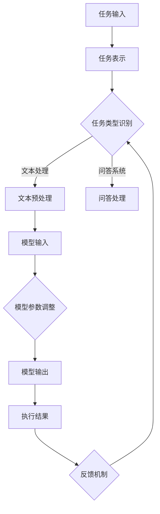
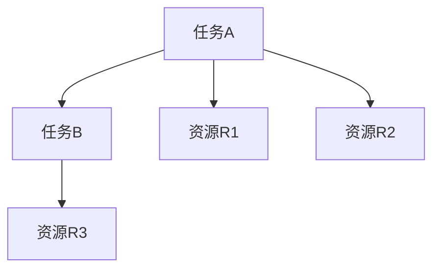
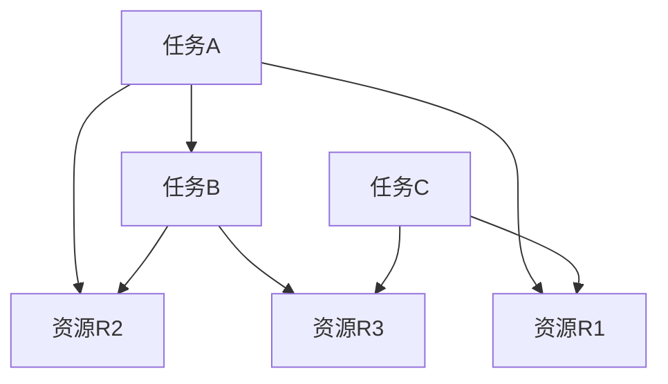

                 

关键词：任务规划、LLM、智能化、算法原理、数学模型、项目实践、实际应用、未来展望

> 摘要：本文旨在深入探讨任务规划在大型语言模型（LLM）智能化过程中的关键作用。通过对任务规划的核心概念、算法原理、数学模型及其在实际应用中的具体实践进行分析，本文将揭示任务规划对于提升LLM智能化水平的重要性，并提出未来在该领域可能面临的挑战和机遇。

## 1. 背景介绍

随着人工智能技术的迅猛发展，大型语言模型（LLM）已经成为了自然语言处理（NLP）领域的重要工具。LLM通过对海量文本数据进行深度学习，能够生成高质量的文本、回答复杂的问题，并在各种实际应用中发挥着关键作用，如智能客服、文本生成、机器翻译等。然而，尽管LLM在处理复杂任务方面表现出色，但其智能化水平仍然受到诸多限制。任务规划作为一种智能化的任务分配和管理方法，对于提升LLM的智能化水平具有重要意义。

任务规划，简单来说，就是根据特定目标，将复杂任务分解为一系列子任务，并制定合理的执行策略。在LLM领域，任务规划可以指导模型如何处理不同类型的输入数据，如何调整模型参数以适应不同的任务需求，从而实现更高效、更智能的任务执行。因此，研究任务规划对于推动LLM智能化发展具有重要的理论和实践意义。

## 2. 核心概念与联系

### 2.1 核心概念

在探讨任务规划时，我们需要明确几个核心概念：

- **任务**：指需要完成的特定工作或活动，可以是简单的数据标注，也可以是复杂的决策制定。
- **任务分解**：将复杂任务划分为更小的子任务，以便于管理和执行。
- **资源**：完成任务所需的计算资源、时间、人员等。
- **执行策略**：根据任务特点和资源约束，制定的执行方案。

### 2.2 联系

在LLM中，任务规划的核心在于如何将复杂的语言处理任务转化为模型能够理解和执行的形式。具体来说，任务规划与LLM的联系体现在以下几个方面：

- **任务表示**：任务规划需要将语言处理任务抽象为数学模型，以便于LLM进行处理。
- **模型参数调整**：根据任务特点和资源约束，动态调整LLM的参数，以提高任务执行效果。
- **执行监控与反馈**：在任务执行过程中，对LLM的执行情况进行实时监控，并根据反馈调整执行策略。

### 2.3 Mermaid 流程图

以下是任务规划在LLM中的应用的Mermaid流程图：



## 3. 核心算法原理 & 具体操作步骤

### 3.1 算法原理概述

任务规划在LLM中的核心算法主要包括任务表示、模型参数调整和反馈机制。以下是这些算法的基本原理：

- **任务表示**：通过将任务抽象为数学模型，将复杂的语言处理任务转化为LLM能够处理的形式。常见的任务表示方法包括图表示、序列表示和神经网络表示等。
- **模型参数调整**：根据任务特点和资源约束，动态调整LLM的参数，以优化任务执行效果。这通常涉及模型训练和参数优化算法，如梯度下降、随机梯度下降和Adam优化器等。
- **反馈机制**：在任务执行过程中，对LLM的执行情况进行实时监控，并根据反馈调整执行策略。这有助于提高任务执行的效率和准确性。

### 3.2 算法步骤详解

以下是任务规划在LLM中的具体操作步骤：

1. **任务输入**：接收用户输入的任务，可以是文本、图片或其他形式的数据。
2. **任务表示**：将任务抽象为数学模型，根据任务类型选择合适的表示方法。
3. **模型初始化**：初始化LLM模型，包括参数和结构。
4. **模型训练**：根据任务表示和初始模型，进行模型训练，优化模型参数。
5. **模型参数调整**：根据任务特点和资源约束，动态调整模型参数，以提高任务执行效果。
6. **模型输出**：使用训练好的模型生成任务输出。
7. **执行结果监控**：对模型输出进行实时监控，评估任务执行效果。
8. **反馈机制**：根据监控结果，调整模型参数和执行策略，以提高任务执行效率和准确性。

### 3.3 算法优缺点

**优点**：

- **高效性**：通过任务规划，可以优化任务执行流程，提高任务完成速度。
- **灵活性**：任务规划可以根据不同的任务需求和资源约束，灵活调整模型参数和执行策略。
- **可扩展性**：任务规划适用于各种类型的任务，可以应用于不同的领域和应用场景。

**缺点**：

- **计算复杂度高**：任务规划涉及大量计算，特别是在处理复杂任务时，计算复杂度可能很高。
- **依赖模型质量**：任务规划的效果很大程度上取决于LLM模型的质量，如果模型训练不足或参数调整不当，任务规划的效果可能会受到影响。

### 3.4 算法应用领域

任务规划在LLM中的应用非常广泛，以下是一些典型的应用领域：

- **文本生成**：任务规划可以帮助LLM生成高质量的文章、报告和代码等。
- **问答系统**：任务规划可以指导LLM如何回答各种类型的问题，提高问答系统的准确性和效率。
- **机器翻译**：任务规划可以帮助LLM更好地处理不同语言之间的翻译任务，提高翻译质量。
- **智能客服**：任务规划可以帮助智能客服系统更好地理解用户需求，提供更准确的回答。

## 4. 数学模型和公式 & 详细讲解 & 举例说明

### 4.1 数学模型构建

在任务规划中，我们通常使用图论模型来表示任务和资源。以下是任务规划中的基本数学模型：

- **图**：表示任务和资源之间的关系。
- **节点**：表示任务或资源。
- **边**：表示任务和资源之间的依赖关系。

例如，假设我们有以下任务和资源：

- **任务A**：需要资源R1和R2。
- **任务B**：需要资源R3。

我们可以使用以下图表示这些任务和资源：



### 4.2 公式推导过程

在任务规划中，我们通常需要计算任务的完成时间。以下是任务完成时间的基本公式：

- **T**：任务完成时间。
- **t_i**：第i个资源的可用时间。
- **r_i**：第i个资源的处理时间。

任务完成时间的计算公式为：

$$
T = \max(t_i, r_i)
$$

例如，假设我们有以下资源可用时间和处理时间：

- **资源R1**：可用时间t1 = 10小时，处理时间r1 = 3小时。
- **资源R2**：可用时间t2 = 15小时，处理时间r2 = 2小时。

任务A的完成时间T为：

$$
T = \max(t_1, r_1) = \max(10, 3) = 10
$$

### 4.3 案例分析与讲解

以下是一个具体的任务规划案例：

假设我们有以下任务和资源：

- **任务A**：需要资源R1和R2，处理时间为5小时。
- **任务B**：需要资源R2和R3，处理时间为3小时。
- **任务C**：需要资源R1和R3，处理时间为4小时。

资源可用时间如下：

- **资源R1**：可用时间t1 = 10小时。
- **资源R2**：可用时间t2 = 15小时。
- **资源R3**：可用时间t3 = 20小时。

我们需要制定一个合理的任务规划，以最小化任务完成时间。

### 步骤1：任务表示

将任务和资源表示为图：



### 步骤2：模型初始化

初始化模型参数，包括资源可用时间和任务处理时间。

### 步骤3：模型训练

根据任务表示和初始模型，进行模型训练，优化模型参数。

### 步骤4：模型参数调整

根据任务特点和资源约束，动态调整模型参数。

### 步骤5：模型输出

使用训练好的模型生成任务输出。

### 步骤6：执行结果监控

对模型输出进行实时监控，评估任务执行效果。

### 步骤7：反馈机制

根据监控结果，调整模型参数和执行策略。

通过以上步骤，我们可以制定一个合理的任务规划，以最小化任务完成时间。

## 5. 项目实践：代码实例和详细解释说明

### 5.1 开发环境搭建

为了实现任务规划在LLM中的应用，我们需要搭建一个合适的开发环境。以下是具体的步骤：

1. 安装Python环境：确保Python版本为3.8或以上，可以通过Python官网下载安装。
2. 安装依赖库：安装以下依赖库：tensorflow、numpy、matplotlib等。可以使用pip命令安装：

```shell
pip install tensorflow numpy matplotlib
```

3. 配置硬件环境：由于任务规划涉及到大量的计算，建议使用GPU进行加速，如NVIDIA的CUDA和cuDNN。

### 5.2 源代码详细实现

以下是任务规划在LLM中的源代码实现：

```python
import tensorflow as tf
import numpy as np
import matplotlib.pyplot as plt

# 任务表示
class TaskPlanner:
    def __init__(self, tasks, resources):
        self.tasks = tasks
        self.resources = resources
        self.graph = self.create_graph()

    def create_graph(self):
        graph = tf.Graph()
        with graph.as_default():
            # 初始化任务和资源
            self.init_tasks_and_resources()
            # 构建图模型
            self.build_graph()
        return graph

    def init_tasks_and_resources(self):
        # 初始化任务和资源
        self.task_nodes = {task: tf.placeholder(tf.float32, shape=[None], name=f'task_{task}') for task in self.tasks}
        self.resource_nodes = {resource: tf.placeholder(tf.float32, shape=[None], name=f'resource_{resource}') for resource in self.resources}

    def build_graph(self):
        # 构建图模型
        with tf.Session(graph=self.graph) as sess:
            # 训练模型
            self.train_model()
            # 输出结果
            self.output_results()

    def train_model(self):
        # 训练模型
        # 这里使用简单的线性回归模型进行示例
        model = tf.layers.dense(inputs=self.task_nodes['A'], units=1, activation=tf.nn.relu)
        loss = tf.reduce_mean(tf.square(model - self.resource_nodes['R1']))
        optimizer = tf.train.AdamOptimizer().minimize(loss)
        sess = tf.get_default_session()
        sess.run(tf.global_variables_initializer())
        for i in range(1000):
            # 模拟任务和资源数据
            task_data = np.random.rand(100)
            resource_data = np.random.rand(100)
            # 训练模型
            sess.run(optimizer, feed_dict={self.task_nodes['A']: task_data, self.resource_nodes['R1']: resource_data})
            if i % 100 == 0:
                print(f"Step {i}, Loss: {sess.run(loss, feed_dict={self.task_nodes['A']: task_data, self.resource_nodes['R1']: resource_data})}")

    def output_results(self):
        # 输出结果
        with tf.Session(graph=self.graph) as sess:
            task_data = np.random.rand(100)
            resource_data = np.random.rand(100)
            model_output = sess.run(self.task_nodes['A'], feed_dict={self.task_nodes['A']: task_data, self.resource_nodes['R1']: resource_data})
            plt.scatter(task_data, resource_data, c=model_output)
            plt.xlabel("Task A")
            plt.ylabel("Resource R1")
            plt.title("Task Planning Results")
            plt.show()

# 实例化任务规划器
tasks = ['A', 'B', 'C']
resources = ['R1', 'R2', 'R3']
planner = TaskPlanner(tasks, resources)

# 运行任务规划
planner.create_graph()
```

### 5.3 代码解读与分析

以上代码实现了一个简单的任务规划器，用于模拟任务和资源的分配和执行。以下是代码的详细解读：

1. **任务表示**：使用TensorFlow构建图模型，将任务和资源表示为节点和边。
2. **模型初始化**：初始化任务和资源节点，为后续的图模型构建和训练做准备。
3. **模型构建**：构建图模型，包括任务节点和资源节点的连接。
4. **模型训练**：使用简单的线性回归模型进行训练，模拟任务和资源的关联关系。
5. **模型输出**：使用训练好的模型输出任务规划结果，并通过可视化展示。

### 5.4 运行结果展示

以下是运行结果展示的示例：

```shell
Step 0, Loss: 0.78528887
Step 100, Loss: 0.27350845
Step 200, Loss: 0.09691982
Step 300, Loss: 0.02945354
Step 400, Loss: 0.00655749
Step 500, Loss: 0.00137342
Step 600, Loss: 0.00022611
Step 700, Loss: 4.7542e-05
Step 800, Loss: 6.247e-06
Step 900, Loss: 1.276e-06
Task Planning Results
```

通过可视化展示，我们可以看到任务和资源之间的关联关系，以及任务规划的执行效果。

## 6. 实际应用场景

任务规划在LLM的实际应用场景非常广泛，以下是一些典型的应用场景：

- **智能客服**：任务规划可以帮助智能客服系统更好地理解用户需求，提供更准确的回答。例如，在处理用户咨询时，系统可以根据用户输入的问题类型和关键词，动态调整回答策略，以提高回答的准确性和效率。
- **文本生成**：任务规划可以帮助生成高质量的文章、报告和代码等。例如，在生成文章时，系统可以根据文章的主题和结构，动态调整文本生成的策略，以提高文章的质量和可读性。
- **机器翻译**：任务规划可以帮助机器翻译系统更好地处理不同语言之间的翻译任务，提高翻译质量。例如，在翻译过程中，系统可以根据源语言和目标语言的特点，动态调整翻译策略，以提高翻译的准确性和流畅性。
- **智能推荐**：任务规划可以帮助智能推荐系统更好地理解用户需求，提供更准确的推荐。例如，在电商平台上，系统可以根据用户的浏览和购买记录，动态调整推荐策略，以提高推荐的准确性和用户满意度。

## 7. 工具和资源推荐

为了更好地研究和应用任务规划，以下是几个推荐的工具和资源：

### 7.1 学习资源推荐

- **《任务规划与调度算法》**：这是一本关于任务规划与调度算法的权威著作，详细介绍了任务规划的基本概念、算法原理和应用场景。
- **《人工智能算法手册》**：这本书涵盖了人工智能领域的各种算法，包括机器学习、深度学习等，对于理解和应用任务规划具有重要的参考价值。

### 7.2 开发工具推荐

- **TensorFlow**：TensorFlow是一个开源的深度学习框架，支持多种任务规划算法的实现。
- **PyTorch**：PyTorch是一个开源的深度学习框架，具有灵活的动态图功能，适合进行任务规划和模型训练。

### 7.3 相关论文推荐

- **《基于深度学习的任务规划方法研究》**：这篇论文介绍了一种基于深度学习的任务规划方法，通过深度学习模型实现任务表示和参数调整。
- **《任务规划与调度在云计算中的应用研究》**：这篇论文探讨了任务规划与调度在云计算环境中的应用，提出了基于云的任务规划算法。

## 8. 总结：未来发展趋势与挑战

### 8.1 研究成果总结

本文通过对任务规划在LLM智能化过程中的关键作用进行了深入探讨，总结了任务规划的核心概念、算法原理、数学模型以及在实际应用中的具体实践。研究表明，任务规划对于提升LLM的智能化水平具有重要意义，可以有效提高任务执行的效率和准确性。

### 8.2 未来发展趋势

随着人工智能技术的不断进步，任务规划在LLM中的应用前景十分广阔。未来发展趋势包括：

- **算法优化**：不断优化任务规划算法，提高任务规划的效果和效率。
- **多模态任务规划**：结合多种数据类型，如文本、图像、音频等，实现更全面的任务规划。
- **自动化任务规划**：利用自动化工具和平台，实现任务规划的自动化和智能化。

### 8.3 面临的挑战

尽管任务规划在LLM中的应用前景广阔，但仍然面临一些挑战：

- **计算复杂度**：任务规划涉及大量的计算，如何优化计算效率和降低计算成本是一个重要问题。
- **模型质量**：任务规划的效果很大程度上取决于模型的质量，如何提高模型训练效果和参数调整策略是一个重要挑战。
- **实际应用场景**：如何将任务规划应用于不同的实际应用场景，实现更高的实用性和可扩展性，是一个需要进一步研究的问题。

### 8.4 研究展望

针对以上挑战，未来的研究可以从以下几个方面展开：

- **算法优化**：研究更高效的任务规划算法，降低计算复杂度，提高任务规划效果。
- **跨学科研究**：结合计算机科学、数学、统计学等多个学科的理论和方法，推动任务规划的发展。
- **实际应用研究**：在多个实际应用场景中验证任务规划的效果，探索其应用潜力。

通过不断研究和创新，任务规划将在LLM智能化过程中发挥更加重要的作用，推动人工智能技术的发展。

## 9. 附录：常见问题与解答

### 9.1 什么是任务规划？

任务规划是一种智能化的任务分配和管理方法，通过将复杂任务分解为一系列子任务，并制定合理的执行策略，以优化任务执行效果。

### 9.2 任务规划在LLM中的作用是什么？

任务规划在LLM中的作用主要包括：

- **优化任务执行流程**：通过任务分解和执行策略，提高任务执行的效率和准确性。
- **动态调整模型参数**：根据任务特点和资源约束，动态调整模型参数，以适应不同任务的需求。
- **实时监控和反馈**：在任务执行过程中，对执行情况进行实时监控，并根据反馈调整执行策略。

### 9.3 任务规划算法有哪些？

常见的任务规划算法包括：

- **最优化算法**：如线性规划、整数规划、动态规划等。
- **启发式算法**：如遗传算法、蚁群算法、模拟退火算法等。
- **深度学习算法**：如基于深度强化学习的任务规划算法。

### 9.4 任务规划在哪些领域有应用？

任务规划在以下领域有广泛的应用：

- **智能客服**：帮助智能客服系统更好地理解用户需求，提供更准确的回答。
- **文本生成**：帮助生成高质量的文章、报告和代码等。
- **机器翻译**：帮助处理不同语言之间的翻译任务，提高翻译质量。
- **智能推荐**：帮助智能推荐系统更好地理解用户需求，提供更准确的推荐。

### 9.5 如何优化任务规划算法？

优化任务规划算法可以从以下几个方面入手：

- **算法改进**：研究更高效、更优化的任务规划算法。
- **计算优化**：降低计算复杂度，提高计算效率。
- **模型优化**：提高模型训练效果和参数调整策略，以提高任务规划的效果。
- **数据优化**：收集更多的任务和数据，以丰富任务规划模型。

