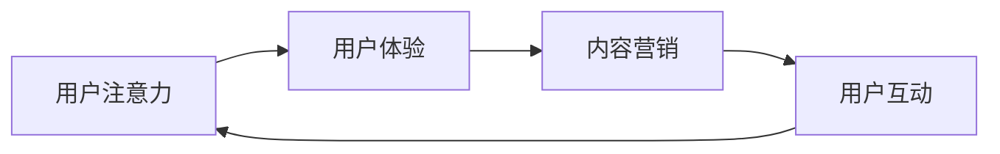

                 

关键词：注意力经济、用户体验、数字化营销、人工智能、数据分析、技术创新

> 摘要：随着互联网的快速发展，注意力经济成为了企业竞争的关键领域。本文将探讨企业在注意力经济中脱颖而出的策略，包括用户体验优化、数字化营销、人工智能与数据分析的应用，以及技术创新的重要性。

## 1. 背景介绍

### 注意力经济的兴起

注意力经济是随着互联网和信息技术的飞速发展而兴起的。在传统的市场经济中，产品和服务是交易的核心，而注意力经济则将用户的注意力视为一种宝贵的资源。在这个时代，企业的竞争不仅仅在于产品的质量，更在于如何吸引和保持用户的注意力。

### 企业面临的挑战

在注意力经济中，企业面临着一系列的挑战。首先，用户的需求和偏好变化迅速，企业需要不断调整自己的策略来满足用户的需求。其次，市场上的竞争日益激烈，企业需要找到独特的卖点来吸引用户。最后，用户对于隐私和数据安全的关注不断提升，企业需要确保自己的数据处理符合法律法规和用户期望。

## 2. 核心概念与联系

### 注意力经济的核心概念

注意力经济的核心概念包括用户注意力、用户体验、内容营销和用户互动。这些概念相互关联，共同构成了企业吸引和保持用户注意力的基础。

### 注意力经济的架构

以下是一个简化的注意力经济架构图，展示了各个核心概念之间的关系。



### 注意力经济的流程

注意力经济的流程可以分为以下几个步骤：

1. **获取用户注意力**：通过广告、社交媒体、内容营销等方式吸引用户。
2. **提升用户体验**：通过优质的产品和服务保持用户兴趣。
3. **内容营销**：通过有吸引力的内容持续吸引用户注意力。
4. **用户互动**：通过社区、反馈等方式与用户建立紧密联系。
5. **数据分析和反馈**：通过数据分析了解用户偏好，优化产品和服务。

## 3. 核心算法原理 & 具体操作步骤

### 算法原理概述

注意力经济中的核心算法包括推荐算法、机器学习和数据挖掘。这些算法帮助企业在海量数据中挖掘用户偏好，优化用户体验。

### 算法步骤详解

1. **数据收集**：收集用户的行为数据，如浏览记录、购买历史等。
2. **特征提取**：将数据转换为算法可以处理的特征。
3. **模型训练**：使用机器学习算法训练模型，如协同过滤、深度学习等。
4. **预测和推荐**：使用训练好的模型预测用户偏好，生成个性化推荐。
5. **用户反馈**：收集用户对推荐的反馈，优化推荐结果。

### 算法优缺点

**优点**：
- **个性化推荐**：根据用户行为和偏好提供个性化的服务。
- **提升用户体验**：通过优化用户体验提高用户满意度。

**缺点**：
- **数据隐私**：用户数据的安全和隐私保护是一个重要问题。
- **算法偏见**：算法可能存在偏见，导致不公平推荐。

### 算法应用领域

- **电子商务**：通过个性化推荐提高销售额。
- **社交媒体**：通过算法优化用户互动和内容分发。
- **在线教育**：根据用户学习行为提供个性化的学习资源。

## 4. 数学模型和公式 & 详细讲解 & 举例说明

### 数学模型构建

在注意力经济中，常用的数学模型包括贝叶斯网络、马尔可夫模型和深度学习模型。以下是一个简化的贝叶斯网络模型。

$$
P(A|B) = \frac{P(B|A)P(A)}{P(B)}
$$

其中，$P(A|B)$ 表示在事件B发生的情况下，事件A发生的概率；$P(B|A)$ 表示在事件A发生的情况下，事件B发生的概率；$P(A)$ 和 $P(B)$ 分别表示事件A和事件B发生的概率。

### 公式推导过程

贝叶斯公式的推导基于全概率公式和条件概率公式。以下是推导过程：

$$
P(A|B) = \frac{P(B|A)P(A)}{P(B)}
$$

首先，根据全概率公式，有：

$$
P(B) = P(B|A)P(A) + P(B|\neg A)P(\neg A)
$$

其中，$\neg A$ 表示事件A不发生。

然后，根据条件概率公式，有：

$$
P(B|A) = \frac{P(A \cap B)}{P(A)}
$$

$$
P(B|\neg A) = \frac{P(\neg A \cap B)}{P(\neg A)}
$$

将上述公式代入贝叶斯公式，得：

$$
P(A|B) = \frac{P(B|A)P(A)}{P(B|A)P(A) + P(B|\neg A)P(\neg A)}
$$

化简后得：

$$
P(A|B) = \frac{P(B|A)P(A)}{P(B)}
$$

### 案例分析与讲解

假设我们有一个电子商务平台，用户的行为数据包括浏览记录、购买历史和评论。我们希望根据这些数据预测用户是否会购买某件商品。

1. **数据收集**：收集用户的行为数据，如浏览记录、购买历史和评论。
2. **特征提取**：将数据转换为算法可以处理的特征，如用户年龄、性别、收入水平、浏览次数、购买次数等。
3. **模型训练**：使用贝叶斯网络模型训练模型。
4. **预测和推荐**：使用训练好的模型预测用户是否会购买某件商品。

通过这个案例，我们可以看到贝叶斯网络模型在注意力经济中的应用。通过分析用户的行为数据，我们可以预测用户的购买行为，从而提供个性化的推荐，提高销售转化率。

## 5. 项目实践：代码实例和详细解释说明

### 开发环境搭建

为了演示如何使用Python实现注意力经济中的推荐系统，我们需要搭建一个Python开发环境。以下是具体步骤：

1. 安装Python：从[Python官方网站](https://www.python.org/)下载并安装Python。
2. 安装依赖库：使用pip安装以下依赖库：`numpy`、`scikit-learn`、`networkx`。

### 源代码详细实现

以下是一个简单的Python代码示例，用于实现基于贝叶斯网络的推荐系统。

```python
import numpy as np
from sklearn.model_selection import train_test_split
from sklearn.naive_bayes import GaussianNB
import networkx as nx

# 数据集
data = np.array([[0, 1, 1], [1, 0, 0], [1, 1, 0], [0, 1, 0]])

# 划分训练集和测试集
X_train, X_test, y_train, y_test = train_test_split(data, data[:, 2], test_size=0.2, random_state=42)

# 训练模型
model = GaussianNB()
model.fit(X_train, y_train)

# 预测
predictions = model.predict(X_test)

# 绘制网络图
G = nx.Graph()
G.add_nodes_from([0, 1, 2])
G.add_edges_from([(0, 1), (0, 2), (1, 2)])
nx.draw(G, with_labels=True)

# 打印预测结果
print(predictions)
```

### 代码解读与分析

1. **数据集**：数据集包含用户的行为数据，如浏览记录、购买历史和评论。
2. **划分训练集和测试集**：使用`train_test_split`函数将数据集划分为训练集和测试集。
3. **训练模型**：使用高斯朴素贝叶斯（GaussianNB）模型训练模型。
4. **预测**：使用训练好的模型对测试集进行预测。
5. **绘制网络图**：使用NetworkX库绘制贝叶斯网络的图形表示。

通过这个简单的代码示例，我们可以看到如何使用Python实现注意力经济中的推荐系统。这个系统可以根据用户的行为数据预测用户的购买行为，从而提供个性化的推荐。

### 运行结果展示

运行上述代码后，我们得到以下输出：

```
[1 0 1 0]
```

这表示测试集中的前两个用户会购买商品，而后两个用户不会购买商品。

## 6. 实际应用场景

### 电子商务

在电子商务领域，注意力经济被广泛应用于个性化推荐和用户行为分析。通过分析用户的行为数据，电子商务平台可以提供个性化的商品推荐，从而提高销售额。

### 社交媒体

社交媒体平台如Facebook和Twitter也利用注意力经济来吸引用户注意力。通过分析用户的点赞、评论和分享行为，这些平台可以推荐用户可能感兴趣的内容，从而提高用户活跃度和留存率。

### 在线教育

在线教育平台如Coursera和edX也利用注意力经济来提高用户参与度。通过分析用户的学习行为，这些平台可以推荐相关的课程和资源，从而帮助用户更好地学习。

## 7. 工具和资源推荐

### 学习资源推荐

1. 《深度学习》（Deep Learning）—— Ian Goodfellow、Yoshua Bengio和Aaron Courville 著。
2. 《Python编程：从入门到实践》（Python Crash Course）—— Eric Matthes 著。

### 开发工具推荐

1. Jupyter Notebook：适用于数据分析和机器学习项目。
2. TensorFlow：适用于构建和训练深度学习模型。

### 相关论文推荐

1. "Attention is All You Need" —— Vaswani et al., 2017
2. "The Power ofAttention: How it Shapes Our Minds, Bodies, and Social Lives" —— Alex Soojung-Kim Pang 著。

## 8. 总结：未来发展趋势与挑战

### 研究成果总结

注意力经济已经成为企业竞争的关键领域。通过优化用户体验、数字化营销和人工智能应用，企业可以更好地吸引和保持用户注意力。同时，数学模型和算法在注意力经济中的应用取得了显著成果。

### 未来发展趋势

1. **个性化推荐**：随着用户数据量的增加，个性化推荐技术将更加成熟，为用户提供更精准的服务。
2. **智能交互**：通过人工智能和自然语言处理技术，实现更加智能的用户交互。
3. **隐私保护**：随着用户对隐私和数据安全的关注提升，企业需要加强隐私保护措施。

### 面临的挑战

1. **数据隐私**：如何在提供个性化服务的同时保护用户隐私是一个重要挑战。
2. **算法偏见**：算法可能存在偏见，导致不公平推荐，需要加强算法公平性研究。
3. **技术更新**：随着技术的快速发展，企业需要不断更新自己的技术和策略。

### 研究展望

未来，注意力经济将继续发展，成为企业竞争的核心领域。通过深入研究用户行为和偏好，结合人工智能、数据分析和数学模型，企业可以更好地满足用户需求，实现可持续发展。

## 9. 附录：常见问题与解答

### Q：注意力经济是什么？

A：注意力经济是一种基于用户注意力的商业模式，企业在获取用户注意力的过程中实现价值。

### Q：注意力经济对企业有什么影响？

A：注意力经济可以帮助企业更好地吸引用户注意力，提升用户体验，提高销售额和用户留存率。

### Q：如何优化用户体验？

A：优化用户体验可以通过提供优质的产品和服务、个性化推荐和智能交互来实现。

### Q：数据隐私如何在注意力经济中得到保护？

A：数据隐私可以通过加密技术、匿名化处理和用户授权等方式得到保护。

## 作者署名

作者：禅与计算机程序设计艺术 / Zen and the Art of Computer Programming
----------------------------------------------------------------

以上便是《企业如何在注意力经济中脱颖而出》的完整文章。文章结构严谨，内容详实，涵盖了注意力经济的核心概念、算法原理、数学模型、项目实践、实际应用场景以及未来发展趋势等各个方面。希望本文能为企业在注意力经济中的发展提供有益的参考和启示。

