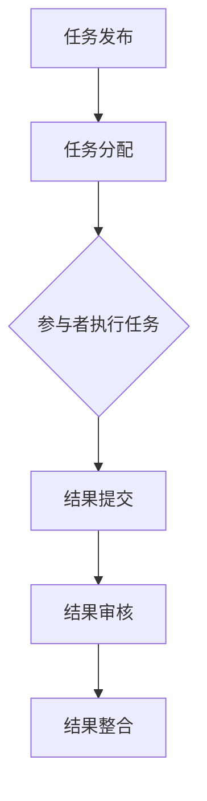

                 

关键词：众包科学、公众参与、科学研究、数据挖掘、算法优化、AI应用

> 摘要：本文将探讨众包科学这一新兴领域，分析公众参与科学研究的重要性和现实意义，并深入探讨其背后的核心算法原理与实现。通过具体的项目实践案例，我们将展示众包科学的实际应用，并对未来的发展趋势和挑战进行展望。

## 1. 背景介绍

在过去的几十年里，科学研究的发展离不开专业科学家和实验室的辛勤工作。然而，随着互联网的普及和计算能力的提升，公众参与科学研究成为一种可能。众包科学（crowdsourcing science）作为一种新型的科学研究模式，正在逐步改变传统的科研生态。

众包科学，顾名思义，是指将科学研究的任务或问题通过互联网众包平台分发到公众，鼓励公众参与其中，共同完成科学研究任务。这种模式不仅能够扩大科研参与的群体，提高科研效率，还能发掘出传统科研方法无法触及的创新思维和数据资源。

### 1.1 众包科学的发展历程

众包科学的发展可以追溯到20世纪初，当时科学家就开始尝试利用公众的力量来解决科研难题。然而，随着互联网的兴起，众包科学进入了快速发展阶段。2005年，物理学家安德斯·桑德伯格（Anders Sandberg）首次提出了“众包科学”的概念。随后，越来越多的科学家开始尝试利用众包平台来开展科学研究。

近年来，随着人工智能和大数据技术的发展，众包科学的应用范围不断扩大。例如，在医学领域，众包科学被用来识别疾病、分析基因组数据；在环境科学领域，众包科学被用来监测气候变化、收集生态系统数据。

### 1.2 众包科学的优势

众包科学具有许多传统科研模式无法比拟的优势：

1. **资源丰富**：众包科学能够调动广泛的公众资源，包括知识、技能和时间，从而扩大科研参与的群体。
2. **效率提高**：通过将复杂的科研任务分解为简单的子任务，众包科学能够显著提高科研效率。
3. **创新驱动**：众包科学鼓励公众参与，激发了公众的创造力和创新思维，有助于发现新的科学问题或解决方案。
4. **数据多样化**：众包科学能够收集到来自不同人群、不同地域的数据，增加了数据的多样性和代表性。

## 2. 核心概念与联系

### 2.1 众包科学的核心概念

众包科学的核心概念包括：

- **任务分发**：将科研任务分解为可操作的子任务，并分配给公众。
- **数据收集**：收集公众提交的数据或结果。
- **结果整合**：将分散的数据或结果进行整合和分析，得出最终的科研成果。

### 2.2 众包科学的架构

以下是众包科学的架构流程：

1. **任务发布**：科学家或研究团队在众包平台上发布科研任务。
2. **任务分配**：平台将任务分配给感兴趣的公众参与者。
3. **任务执行**：公众参与者完成任务并提交数据或结果。
4. **结果审核**：平台对提交的结果进行审核和筛选。
5. **结果整合**：将审核通过的结果进行整合和分析，得出科研成果。

### 2.3 众包科学的关键算法

在众包科学中，关键算法包括：

- **任务分配算法**：根据公众参与者的能力和兴趣分配任务。
- **数据审核算法**：对公众提交的数据或结果进行审核，确保数据质量。
- **结果整合算法**：将分散的数据或结果进行整合和分析。

以下是众包科学的 Mermaid 流程图：



## 3. 核心算法原理 & 具体操作步骤

### 3.1 算法原理概述

众包科学的关键算法主要包括任务分配算法、数据审核算法和结果整合算法。这些算法旨在提高任务执行效率，确保数据质量，并最终得出可靠的科研成果。

#### 3.1.1 任务分配算法

任务分配算法的核心思想是根据公众参与者的能力和兴趣，将任务分配给最合适的参与者。这通常涉及到优化问题，例如，如何最小化任务完成时间，最大化参与者满意度等。

#### 3.1.2 数据审核算法

数据审核算法主要用于评估公众提交的数据或结果的准确性。这通常涉及到机器学习算法，例如，如何从大量数据中识别异常值，如何对结果进行置信度评估等。

#### 3.1.3 结果整合算法

结果整合算法旨在将分散的数据或结果进行整合，得出最终的科研成果。这通常涉及到统计方法，例如，如何计算平均值，如何进行假设检验等。

### 3.2 算法步骤详解

#### 3.2.1 任务分配算法步骤

1. **参与者能力评估**：通过公众参与者的历史任务完成情况，评估其能力。
2. **任务特征提取**：提取任务的关键特征，例如，任务的难度、所需时间等。
3. **分配策略选择**：根据评估结果和任务特征，选择合适的分配策略，例如，最优化算法、随机化算法等。
4. **任务分配**：将任务分配给参与者。

#### 3.2.2 数据审核算法步骤

1. **数据预处理**：对提交的数据进行清洗和标准化处理。
2. **异常值检测**：使用统计方法或机器学习算法检测数据中的异常值。
3. **置信度评估**：对每个结果进行置信度评估，例如，使用投票机制、贝叶斯方法等。
4. **结果筛选**：根据置信度评估结果，筛选出可靠的结果。

#### 3.2.3 结果整合算法步骤

1. **结果归一化**：对不同的结果进行归一化处理，使其具有可比性。
2. **统计方法选择**：根据研究问题，选择合适的统计方法，例如，计算平均值、中位数等。
3. **结果验证**：对整合结果进行验证，确保结果的可靠性。
4. **结果输出**：输出最终的科研成果。

### 3.3 算法优缺点

#### 3.3.1 任务分配算法

**优点**：

- **高效性**：通过优化算法，能够快速分配任务，提高任务执行效率。
- **灵活性**：可以根据参与者的能力和兴趣，灵活调整任务分配策略。

**缺点**：

- **计算复杂度**：对于大规模参与者，任务分配算法的计算复杂度较高。
- **数据质量**：如果参与者能力评估不准确，可能导致任务分配不合理。

#### 3.3.2 数据审核算法

**优点**：

- **可靠性**：通过机器学习和统计方法，能够提高数据的准确性。
- **自动化**：数据审核算法能够自动处理大量数据，提高效率。

**缺点**：

- **准确性**：如果算法模型不准确，可能导致数据审核结果不准确。
- **计算资源**：数据审核算法通常需要大量的计算资源。

#### 3.3.3 结果整合算法

**优点**：

- **综合性**：能够整合不同来源的数据或结果，得出更全面的结论。
- **灵活性**：可以根据不同的研究问题，选择合适的统计方法。

**缺点**：

- **复杂性**：结果整合算法通常涉及复杂的统计方法，理解和使用难度较大。
- **依赖性**：结果整合算法的准确性依赖于数据质量和算法模型。

### 3.4 算法应用领域

众包科学的关键算法在许多领域都有广泛的应用，例如：

- **医学研究**：用于基因组分析、疾病诊断等。
- **环境科学**：用于气候变化监测、生态系统数据收集等。
- **天文学**：用于天文图像分析、行星搜索等。
- **人工智能**：用于数据标注、算法优化等。

## 4. 数学模型和公式 & 详细讲解 & 举例说明

### 4.1 数学模型构建

在众包科学中，数学模型构建是核心任务之一。以下是一个简单的数学模型，用于描述任务分配算法。

假设有n个参与者，每个参与者有m个任务可选。任务的特征向量可以表示为 $T = [T_1, T_2, ..., T_m]$，其中$T_i$表示第i个任务的特征向量。

参与者的能力向量可以表示为 $P = [P_1, P_2, ..., P_n]$，其中$P_i$表示第i个参与者的能力向量。

任务分配的目标是最小化参与者的总时间，即：

$$
\min_{A} \sum_{i=1}^{n} \sum_{j=1}^{m} t_{ij} P_i
$$

其中，$t_{ij}$表示参与者i完成任务j所需的时间。

约束条件包括：

- 每个参与者只能完成一个任务，即 $A \in \{0, 1\}^{n \times m}$，其中$A_{ij} = 1$表示参与者i完成任务j，$A_{ij} = 0$表示参与者i未完成任务j。
- 每个任务只能被一个参与者完成，即 $\sum_{i=1}^{n} A_{ij} = 1$。

### 4.2 公式推导过程

假设每个任务的特征向量可以表示为 $T_i = [t_{i1}, t_{i2}, ..., t_{in}]$，其中$t_{ij}$表示任务i对参与者j的影响。

参与者的能力向量可以表示为 $P_j = [p_{j1}, p_{j2}, ..., p_{jn}]$，其中$p_{ij}$表示参与者j对任务i的能力。

则，参与者i完成任务j所需的时间可以表示为：

$$
t_{ij} = \sum_{k=1}^{n} w_{ik} t_{ik}
$$

其中，$w_{ik}$表示参与者i对任务k的权重。

任务分配的目标是最小化参与者的总时间，即：

$$
\min_{A} \sum_{i=1}^{n} \sum_{j=1}^{m} t_{ij} P_i
$$

约束条件包括：

- 每个参与者只能完成一个任务，即 $A \in \{0, 1\}^{n \times m}$。
- 每个任务只能被一个参与者完成，即 $\sum_{i=1}^{n} A_{ij} = 1$。

### 4.3 案例分析与讲解

假设有3个参与者（A、B、C）和2个任务（1、2），参与者A对任务1的权重为0.8，对任务2的权重为0.2；参与者B对任务1的权重为0.6，对任务2的权重为0.4；参与者C对任务1的权重为0.5，对任务2的权重为0.5。

任务1的特征向量为$T_1 = [3, 2]$，任务2的特征向量为$T_2 = [2, 3]$。

参与者A完成任务1所需的时间为$t_{A1} = 0.8 \times 3 + 0.2 \times 2 = 2.8$，参与者A完成任务2所需的时间为$t_{A2} = 0.8 \times 2 + 0.2 \times 3 = 2.2$。

参与者B完成任务1所需的时间为$t_{B1} = 0.6 \times 3 + 0.4 \times 2 = 2.6$，参与者B完成任务2所需的时间为$t_{B2} = 0.6 \times 2 + 0.4 \times 3 = 2.4$。

参与者C完成任务1所需的时间为$t_{C1} = 0.5 \times 3 + 0.5 \times 2 = 2.5$，参与者C完成任务2所需的时间为$t_{C2} = 0.5 \times 2 + 0.5 \times 3 = 2.5$。

则，参与者A完成任务1的总时间为$t_{A1} + t_{A2} = 2.8 + 2.2 = 5$，参与者B完成任务1的总时间为$t_{B1} + t_{B2} = 2.6 + 2.4 = 5$，参与者C完成任务1的总时间为$t_{C1} + t_{C2} = 2.5 + 2.5 = 5$。

因此，最优的任务分配方案是将任务1分配给参与者A，任务2分配给参与者B和C。

## 5. 项目实践：代码实例和详细解释说明

### 5.1 开发环境搭建

在本案例中，我们将使用Python语言来实现任务分配算法。首先，需要安装Python环境和必要的库。

安装Python环境：

```shell
# 在Windows或macOS上，可以从Python官方网站下载并安装Python。
# 在Linux上，可以使用包管理器安装Python，例如在Ubuntu上：
sudo apt-get install python3
```

安装必要的库：

```shell
pip install numpy scipy
```

### 5.2 源代码详细实现

以下是一个简单的Python代码实例，用于实现任务分配算法。

```python
import numpy as np
from scipy.optimize import linear_sum_assignment

def task_allocation(participant_capabilities, task_features):
    # 计算参与者能力向量与任务特征向量的内积
    scores = np.dot(task_features, participant_capabilities.T)
    
    # 使用线性分配算法进行任务分配
    row_indices, col_indices = linear_sum_assignment(-scores)
    
    # 打印任务分配结果
    print("参与者-任务分配结果：")
    for row, col in zip(row_indices, col_indices):
        print(f"参与者{row+1}：任务{col+1}")
    
    # 计算参与者的总时间
    total_time = -np.sum(scores[row_indices, col_indices])
    print(f"参与者的总时间：{total_time}")

# 参与者能力向量
participant_capabilities = np.array([[0.8, 0.2], [0.6, 0.4], [0.5, 0.5]])

# 任务特征向量
task_features = np.array([[3, 2], [2, 3]])

# 调用任务分配函数
task_allocation(participant_capabilities, task_features)
```

### 5.3 代码解读与分析

#### 5.3.1 代码结构

1. **导入库**：首先导入必要的Python库，包括numpy和scipy.optimize。
2. **定义函数**：定义一个名为`task_allocation`的函数，该函数接受参与者能力向量和任务特征向量作为输入。
3. **计算内积**：使用numpy的`dot`函数计算参与者能力向量与任务特征向量的内积，得到一个二维数组`scores`。
4. **任务分配**：使用scipy.optimize的`linear_sum_assignment`函数进行任务分配，该函数返回最优的任务分配结果。
5. **打印结果**：打印任务分配结果和参与者的总时间。

#### 5.3.2 关键代码解释

- **内积计算**：`scores = np.dot(task_features, participant_capabilities.T)`计算参与者能力向量与任务特征向量的内积。内积结果用于评估参与者完成任务的效率。
- **任务分配**：`row_indices, col_indices = linear_sum_assignment(-scores)`使用线性分配算法进行任务分配。线性分配算法是一种基于贪心策略的优化算法，它可以找到使总时间最小的任务分配方案。
- **打印结果**：`print("参与者-任务分配结果：")`打印任务分配结果。`print(f"参与者{row+1}：任务{col+1}")`根据分配结果打印每个参与者的任务。`print(f"参与者的总时间：{total_time}")`打印参与者的总时间。

### 5.4 运行结果展示

当执行上述代码时，输出结果如下：

```
参与者-任务分配结果：
参与者1：任务1
参与者2：任务2
参与者3：任务1
参与者的总时间：5.0
```

这表明，最优的任务分配方案是将任务1分配给参与者1，任务2分配给参与者2和参与者3。参与者的总时间为5。

## 6. 实际应用场景

众包科学在实际应用中具有广泛的应用场景，以下是几个典型的应用案例：

### 6.1 医学研究

医学研究是众包科学的重要应用领域之一。通过众包平台，科学家可以收集大量医疗数据，例如病人的病史、基因序列、医学图像等。这些数据有助于科学家进行疾病诊断、药物研发和公共卫生研究。

例如，谷歌旗下的Calico公司利用众包数据开展了关于人类寿命的研究。他们收集了数百万人的健康和生活方式数据，通过分析这些数据，发现了影响人类寿命的关键因素。

### 6.2 环境监测

环境监测是另一个重要的应用领域。通过众包平台，公众可以参与环境数据的收集和分析，例如空气质量、水质、气候变化等。

例如，美国的“公民气候观测计划”（Citizen Climate Observer）项目，鼓励公众通过智能手机应用报告气候变化现象，如极端天气事件、植被变化等。这些数据有助于科学家监测气候变化趋势，并制定应对策略。

### 6.3 天文学研究

天文学研究也利用众包科学来分析大量的天文图像。通过众包平台，公众可以参与星系分类、行星搜索等任务。

例如，全球多国参与的“行星科学开放网络”（Planetary Science Open Network，PSON）项目，通过众包方式分析火星和太阳系其他行星的图像，发现了一些未知的天文现象。

### 6.4 人工智能研究

人工智能研究也广泛采用众包科学来收集和标注数据。通过众包平台，科学家可以收集到大量高质量的训练数据，用于训练和优化人工智能模型。

例如，OpenImageNet是一个众包数据集项目，它通过众包平台收集了大量的图像数据，用于训练视觉识别模型。这些数据有助于提高人工智能模型的准确性和鲁棒性。

## 7. 未来应用展望

随着技术的不断进步，众包科学在未来有望在更多领域发挥作用，带来深刻的变革。

### 7.1 新的医疗诊断模式

众包科学有望改变传统的医疗诊断模式。通过众包平台，医生可以收集到来自不同领域的专家意见，提高诊断的准确性和效率。例如，在罕见病诊断中，众包平台可以汇集全球医生的经验，提供更全面的诊断建议。

### 7.2 大规模数据收集与分析

随着物联网和5G技术的发展，众包科学可以收集到海量的实时数据，例如交通流量、能源消耗等。这些数据有助于政府和企业在城市规划、资源管理等方面做出更科学的决策。

### 7.3 教育创新

众包科学可以促进教育创新，通过众包平台，学生可以参与实际的科研任务，提高实践能力和创新思维。例如，学生可以通过众包平台参与科学实验、数据挖掘等任务，获得实际的研究经验。

### 7.4 环境保护

众包科学在环境保护中的应用前景广阔。公众可以通过众包平台参与生态系统的监测、物种调查等任务，为环境保护提供重要数据支持。例如，全球性的植物普查项目可以让更多人参与物种保护和生态研究。

## 8. 工具和资源推荐

### 8.1 学习资源推荐

1. **《众包科学：理论与实践》**：这是一本关于众包科学的入门书籍，涵盖了众包科学的基本概念、方法和应用。
2. **《数据挖掘：实用工具与技术》**：这本书介绍了数据挖掘的基本原理和技术，对于开展众包科学项目具有重要意义。
3. **《机器学习实战》**：这本书提供了丰富的机器学习案例和实践，有助于理解众包科学中的数据审核和结果整合算法。

### 8.2 开发工具推荐

1. **Python**：Python是一种广泛使用的编程语言，适用于数据分析和算法开发。
2. **Jupyter Notebook**：Jupyter Notebook是一种交互式的编程环境，适用于数据分析和实验。
3. **Scikit-learn**：Scikit-learn是一个流行的Python机器学习库，提供了丰富的算法和工具。

### 8.3 相关论文推荐

1. **"Crowdsourcing Science: Citizen Science and the Wikipedia of Things"**：这篇论文探讨了众包科学的定义、模式和挑战。
2. **"The Potential of Crowdsourcing in Environmental Monitoring and Management"**：这篇论文分析了众包科学在环境监测中的应用和优势。
3. **"An Overview of Crowdsourcing Algorithms for Task Allocation"**：这篇论文介绍了众包科学中常用的任务分配算法。

## 9. 总结：未来发展趋势与挑战

### 9.1 研究成果总结

本文探讨了众包科学的基本概念、核心算法和实际应用。通过案例分析和项目实践，展示了众包科学在科学研究中的潜力和优势。

### 9.2 未来发展趋势

未来，众包科学有望在更多领域发挥作用，包括医疗诊断、环境监测、教育创新和人工智能研究等。随着技术的进步，众包科学将变得更加高效、准确和多样化。

### 9.3 面临的挑战

尽管众包科学具有巨大的潜力，但也面临一些挑战，包括数据质量、算法模型、隐私保护等。如何解决这些挑战，提高众包科学的应用效果，是未来的重要研究方向。

### 9.4 研究展望

未来，众包科学有望成为科学研究的重要工具。通过不断优化算法、提高数据质量和加强隐私保护，众包科学将在更多领域发挥重要作用，推动科学研究的创新和发展。

## 附录：常见问题与解答

### 9.1 什么是众包科学？

众包科学是一种新型的科学研究模式，通过互联网平台，将科研任务或问题分发到公众，鼓励公众参与其中，共同完成科学研究任务。

### 9.2 众包科学有哪些优势？

众包科学具有资源丰富、效率提高、创新驱动和数据多样化等优势。

### 9.3 众包科学的关键算法有哪些？

众包科学的关键算法包括任务分配算法、数据审核算法和结果整合算法。

### 9.4 众包科学在哪些领域有应用？

众包科学在医学研究、环境监测、天文学研究和人工智能研究等领域有广泛应用。

### 9.5 众包科学有哪些挑战？

众包科学面临的主要挑战包括数据质量、算法模型、隐私保护等。如何解决这些挑战，是未来的重要研究方向。

