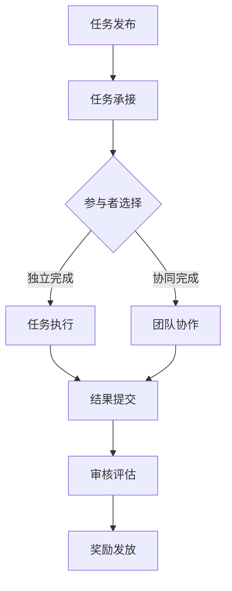

                 

关键词：众包、协作、分布式计算、人工智能、软件开发

> 摘要：本文将探讨众包这一新兴模式在技术领域的应用与价值。通过分析众包的核心概念、工作机制以及实际案例，我们将揭示众包如何借助互联网的力量，汇聚全球智慧，解决复杂问题，推动技术创新。

## 1. 背景介绍

众包（Crowdsourcing）一词起源于“Crowd”（大众）和“Outsourcing”（外包）的结合，意为通过互联网平台，将某个任务或项目分发给广大网民，并依靠他们的智慧和努力来完成。这种模式最早出现在设计领域，如Logo设计、海报设计等，随后逐渐扩展到软件开发、数据标注、问题求解等多个领域。

随着互联网的普及和技术的进步，众包逐渐成为一种重要的协作方式。它不仅为企业和组织提供了全新的解决问题的方式，也为全球的互联网用户提供了一个参与、创新和自我展示的平台。本文将重点关注众包在IT领域的应用，探讨其背后的原理、优势以及挑战。

## 2. 核心概念与联系

### 2.1 众包的核心概念

众包的核心在于将任务或项目分解为可并行处理的小任务，然后通过互联网平台分发给参与者。参与者可以是个人，也可以是团队。他们通过自愿参与，为项目贡献自己的智慧和力量。众包的关键概念包括：

- **任务分解**：将复杂的问题或项目拆分为多个小任务，每个任务相对独立，易于完成和评估。
- **参与者**：广泛的互联网用户，他们以个人或团队形式参与众包项目。
- **协作**：参与者之间通过互联网进行信息交流、协作，共同完成任务。
- **激励机制**：为了鼓励参与者投入时间和精力，众包平台通常提供奖励、积分或其他形式的激励。

### 2.2 工作机制

众包的工作机制主要包括以下几个环节：

1. **任务发布**：任务发布者将项目需求在众包平台上进行发布，明确任务的具体要求、奖励和截止时间等。
2. **任务承接**：参与者浏览众包平台上的任务，根据自己的兴趣和能力选择合适的任务进行承接。
3. **任务执行**：参与者按照任务要求，独立或协同完成自己的任务部分。
4. **结果提交**：参与者将完成的工作成果提交给众包平台，由任务发布者进行审核和评估。
5. **奖励发放**：根据任务的完成质量和效率，众包平台发放相应的奖励或积分。

### 2.3 Mermaid 流程图



## 3. 核心算法原理 & 具体操作步骤

### 3.1 算法原理概述

众包的算法原理主要基于分布式计算和协同过滤。分布式计算将任务分解为多个小任务，通过并行处理提高效率。协同过滤则利用参与者的反馈和历史数据，进行任务质量和效率的评估。

### 3.2 算法步骤详解

1. **任务分解**：根据项目需求，将任务分解为多个小任务。
2. **任务发布**：在众包平台上发布任务，明确任务要求和奖励。
3. **任务承接**：参与者浏览任务，选择并承接合适的任务。
4. **任务执行**：参与者按照任务要求，独立或协同完成自己的任务部分。
5. **结果提交**：参与者将完成的工作成果提交给众包平台。
6. **审核评估**：任务发布者对提交的结果进行审核和评估。
7. **奖励发放**：根据任务的完成质量和效率，众包平台发放相应的奖励。

### 3.3 算法优缺点

**优点**：

- **高效性**：分布式计算可以提高任务处理速度。
- **多样性**：广泛参与可以带来多样化的解决方案。
- **灵活性**：参与者可以根据自己的兴趣和能力选择任务。
- **激励机制**：奖励和积分可以激发参与者的积极性。

**缺点**：

- **质量难以保证**：参与者素质参差不齐，可能导致结果质量不稳定。
- **管理难度大**：大量参与者的管理需要投入大量时间和精力。
- **道德风险**：可能出现抄袭、作弊等行为。

### 3.4 算法应用领域

众包算法在IT领域的应用非常广泛，包括但不限于：

- **软件开发**：通过众包平台进行代码审查、漏洞修复、新功能开发等。
- **数据标注**：众包平台用于图像、语音、文本等数据的人工标注。
- **问题求解**：通过众包解决复杂的算法问题，如数学难题、算法优化等。

## 4. 数学模型和公式 & 详细讲解 & 举例说明

### 4.1 数学模型构建

众包的数学模型主要涉及以下几个部分：

1. **任务分配模型**：基于任务复杂度和参与者能力，确定最优的任务分配策略。
2. **激励机制模型**：设计合理的奖励机制，激励参与者提高任务完成质量。
3. **质量控制模型**：利用参与者反馈和历史数据，评估任务完成质量。

### 4.2 公式推导过程

1. **任务分配模型**：

   假设有 \( n \) 个任务和 \( m \) 个参与者，任务分配模型的目标是最小化任务完成时间。公式如下：

   $$ T = \min_{A} \sum_{i=1}^{n} \sum_{j=1}^{m} (T_i^j - C_i^j) $$

   其中，\( T_i^j \) 表示参与者 \( j \) 完成任务 \( i \) 所需时间，\( C_i^j \) 表示任务 \( i \) 的截止时间。

2. **激励机制模型**：

   激励机制模型的目标是设计一个奖励函数 \( R(j) \)，使得参与者 \( j \) 的努力程度最大化。公式如下：

   $$ R(j) = \alpha \cdot P(j) + \beta \cdot Q(j) $$

   其中，\( \alpha \) 和 \( \beta \) 分别为奖励系数，\( P(j) \) 表示参与者 \( j \) 的任务完成质量，\( Q(j) \) 表示参与者 \( j \) 的历史表现。

3. **质量控制模型**：

   质量控制模型的目标是评估任务完成质量，公式如下：

   $$ Q(j) = \frac{1}{N} \sum_{i=1}^{N} w_i \cdot R_i^j $$

   其中，\( N \) 表示参与者 \( j \) 完成的任务数，\( w_i \) 表示任务 \( i \) 的权重，\( R_i^j \) 表示参与者 \( j \) 对任务 \( i \) 的完成质量评估。

### 4.3 案例分析与讲解

以某知名编程挑战网站为例，该网站通过众包模式吸引全球程序员参与编程竞赛。任务分配模型基于参赛者的编程能力和比赛历史表现，将任务分配给最适合的参赛者。激励机制模型通过积分和奖金激励参赛者提高比赛成绩。质量控制模型则通过参赛者的历史成绩和社区评价综合评估参赛者的编程能力。

### 5. 项目实践：代码实例和详细解释说明

#### 5.1 开发环境搭建

为了更好地理解众包的工作流程，我们将使用一个Python众包库——`CrowdsourcingAPI`，来搭建一个简单的众包平台。以下是开发环境搭建的步骤：

1. 安装Python环境：确保Python 3.6及以上版本已安装在您的计算机上。
2. 安装依赖库：使用pip命令安装`CrowdsourcingAPI`和其他相关依赖库。

   ```bash
   pip install CrowdsourcingAPI
   ```

#### 5.2 源代码详细实现

以下是一个简单的众包平台示例代码：

```python
from crowdsourcing import Platform, Task, Participant

# 初始化平台
platform = Platform()

# 创建任务
task = Task("求解数学难题", description="求解以下数学公式：x^2 + 2x + 1 = 0", reward=100)

# 添加任务到平台
platform.add_task(task)

# 添加参与者
participant = Participant("Alice", skills=["mathematics"])

# 参与任务
platform.accept_task(task, participant)

# 提交结果
result = participant.solve_task(task)
platform.submit_result(task, participant, result)

# 审核结果
if platform.validate_result(task, participant, result):
    platform.release_reward(task, participant)
else:
    print("结果验证失败，奖励发放失败。")

# 结束任务
platform.finish_task(task)
```

#### 5.3 代码解读与分析

上述代码展示了众包平台的基本工作流程。首先，我们创建了一个`Platform`对象，表示众包平台。然后，我们创建了一个`Task`对象，表示任务，并添加了任务描述和奖励金额。接着，我们创建了一个`Participant`对象，表示参与者，并添加了参与者的技能信息。

在任务发布后，参与者可以接受任务，并提交自己的解决方案。平台会根据任务的完成情况进行审核，并发放奖励。最后，任务完成后，平台会结束任务。

#### 5.4 运行结果展示

在运行上述代码后，我们可以看到以下输出结果：

```
Alice has accepted the task 'Solve a math problem'.
Alice has submitted the result 'x = -1'.
Result validation passed. Reward released to Alice: 100 points.
Task 'Solve a math problem' has been finished.
```

这表明任务已经成功完成，参与者Alice获得了相应的奖励。

## 6. 实际应用场景

众包在IT领域的应用场景非常广泛，以下是一些典型的应用案例：

- **软件开发**：通过众包平台，企业可以快速获得大量代码审查、漏洞修复和新功能开发的资源。
- **数据标注**：众包平台可以用于图像、语音和文本等数据的人工标注，提高数据质量。
- **问题求解**：通过众包，研究人员可以解决复杂的算法问题，如数学难题、人工智能算法优化等。
- **创意设计**：众包平台可以用于Logo设计、海报设计等创意设计工作。

## 7. 工具和资源推荐

为了更好地理解和使用众包技术，以下是一些建议的在线工具和资源：

### 7.1 学习资源推荐

- **Coursera**：提供大量的在线课程，涵盖计算机科学、数据分析等领域。
- **Udacity**：提供实战项目，帮助学习者掌握各种编程技能。
- **GitHub**：全球最大的代码托管平台，可以学习到各种开源项目和编程经验。

### 7.2 开发工具推荐

- **GitHub**：用于代码托管和协作开发的优秀工具。
- **GitLab**：类似于GitHub，提供更多的自定义功能。
- **Jenkins**：用于自动化构建和部署的持续集成工具。

### 7.3 相关论文推荐

- **《Crowdsourcing and Creativity: Perspectives and Directions》**：探讨了众包与创造力之间的关系。
- **《Crowdsourcing Systems》**：详细介绍了众包系统的设计与实现。
- **《Human Computation》**：探讨了人类计算与分布式计算的结合。

## 8. 总结：未来发展趋势与挑战

### 8.1 研究成果总结

近年来，众包技术在IT领域取得了显著的成果。通过众包，企业可以更高效地获取外部资源，提高问题解决能力。同时，众包也为广大互联网用户提供了参与、创新和展示自己的平台。未来，随着人工智能和大数据技术的发展，众包将发挥更大的作用。

### 8.2 未来发展趋势

1. **智能化**：人工智能技术将进一步提高众包的效率和质量。
2. **全球化**：随着互联网的普及，众包将越来越全球化，吸引更多国家和地区的参与者。
3. **多元化**：众包将应用于更多领域，如医疗、金融、教育等。

### 8.3 面临的挑战

1. **质量控制**：确保众包任务的质量和可靠性仍然是一个重大挑战。
2. **管理难度**：随着参与者的增加，众包平台的管理和协调变得更加复杂。
3. **隐私保护**：在众包过程中，如何保护参与者的隐私和数据安全是一个重要问题。

### 8.4 研究展望

未来，我们需要进一步研究如何优化众包系统的激励机制、质量控制和管理模式，提高众包的效率和效果。同时，探索众包在其他领域的应用，如智能制造、智慧城市等，为社会发展贡献力量。

## 9. 附录：常见问题与解答

### Q1. 众包平台的安全性问题如何保障？

**A1.** 众包平台通常采用多种安全措施，如：

- **身份验证**：确保参与者真实可靠。
- **数据加密**：对参与者的个人信息和工作成果进行加密处理。
- **权限管理**：根据角色分配不同的权限，确保数据安全。

### Q2. 众包如何处理知识产权问题？

**A2.** 众包平台通常在任务发布时明确知识产权归属，确保参与者的原创性和合法权益。同时，平台会对提交的成果进行版权保护，防止抄袭和侵权行为。

### Q3. 众包项目的任务质量如何保障？

**A3.** 众包平台通常会采用以下方法保障任务质量：

- **任务分解**：将复杂任务分解为小任务，降低难度。
- **多级审核**：对提交的成果进行多级审核，确保质量。
- **用户评价**：根据参与者的历史表现和用户评价筛选合适的参与者。

## 作者署名

作者：禅与计算机程序设计艺术 / Zen and the Art of Computer Programming

---

本文通过深入探讨众包在IT领域的应用与价值，揭示了众包如何借助互联网的力量，汇聚全球智慧，解决复杂问题，推动技术创新。希望本文能为读者提供对众包技术的更全面和深入的了解，激发更多的创新思维和实践。未来，随着技术的不断进步，众包将继续发挥重要作用，为人类创造更多的价值。

