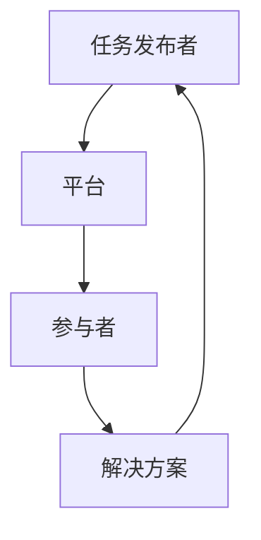

                 

关键词：众包、协作、科技创新、算法、数学模型、应用场景、未来展望

> 摘要：本文旨在探讨众包这一新兴的协作模式，如何通过集结全球智慧，推动科技创新的进程。我们将深入分析众包的核心概念、算法原理、数学模型，并探讨其在实际应用场景中的潜力和未来展望。

## 1. 背景介绍

在当今科技飞速发展的时代，单凭个人的力量已经很难应对复杂的科研和开发任务。越来越多的领域开始采用众包这种协作模式，通过将问题发布给全球的志愿者或专业团队，共同解决问题，推动创新。众包的出现，不仅提高了问题解决的效率，也促进了知识的共享和传播。

### 什么是众包？

众包（Crowdsourcing）是指将一个任务或问题分散到大量志愿者或专业团队中，通过协作完成的方式。这种方式最早由Jeff Howe在2006年提出，并在多个领域得到了广泛应用。众包的核心思想在于利用大众的智慧，解决那些单个个体难以应对的问题。

### 众包的发展历程

- **2006年**：Jeff Howe首次提出了“众包”这个概念，并进行了详细阐述。
- **2009年**：维基百科宣布采用众包方式完成百科全书的内容编写。
- **2010年**：NASA启动了“公民科学家”项目，通过众包方式收集天文观测数据。
- **2012年**：Airbnb和Uber等共享经济模式公司通过众包模式获得了巨大的成功。
- **至今**：越来越多的领域开始采用众包模式，如人工智能、医疗、环保等。

## 2. 核心概念与联系

### 核心概念

1. **任务发布者**：需要解决的问题或任务的所有者，通常是一个组织或个人。
2. **参与者**：任务的执行者，可以是志愿者或专业团队。
3. **平台**：连接任务发布者和参与者的中介，如众筹平台、在线论坛等。

### Mermaid 流程图



## 3. 核心算法原理 & 具体操作步骤

### 3.1 算法原理概述

众包模式的核心在于通过算法筛选和评估参与者的解决方案。常见的算法有：

1. **基于评分的算法**：根据参与者的历史表现和评分，筛选出最优的解决方案。
2. **基于竞争的算法**：参与者相互竞争，最后根据结果评选出最佳方案。
3. **基于合作的算法**：参与者合作完成任务，根据贡献程度分配奖励。

### 3.2 算法步骤详解

1. **任务发布**：任务发布者将任务描述、需求和奖励发布到众包平台。
2. **参与者注册**：参与者根据任务需求，在平台上注册并提交解决方案。
3. **筛选方案**：平台使用算法筛选出最优的解决方案。
4. **评审与反馈**：任务发布者对筛选出的方案进行评审，并提供反馈。
5. **奖励分配**：根据方案的质量和贡献程度，平台进行奖励分配。

### 3.3 算法优缺点

**优点**：

- **高效**：通过全球协作，快速解决问题。
- **创新**：汇集全球智慧，产生创新性的解决方案。
- **低成本**：利用免费的人力资源，降低开发成本。

**缺点**：

- **质量控制**：参与者质量参差不齐，可能导致方案质量不一。
- **隐私问题**：任务内容和参与者信息可能涉及隐私问题。
- **道德风险**：参与者可能为了获取奖励而忽视道德规范。

### 3.4 算法应用领域

- **人工智能**：通过众包收集数据，训练模型。
- **医学研究**：利用众包解决复杂病例诊断。
- **环保**：通过众包收集环境数据，监测污染情况。
- **社会公益**：利用众包解决社会问题，如慈善捐款、自然灾害救援等。

## 4. 数学模型和公式 & 详细讲解 & 举例说明

### 4.1 数学模型构建

在众包模式中，常用的数学模型有：

- **期望值模型**：用于评估参与者的解决方案质量。
- **优化模型**：用于筛选最优的解决方案。
- **博弈论模型**：用于分析参与者的策略和收益。

### 4.2 公式推导过程

以期望值模型为例，假设有 \( n \) 个参与者，每个参与者的解决方案质量服从概率分布 \( p_i \)，则期望值模型为：

$$
E(p) = \sum_{i=1}^{n} p_i \cdot \frac{1}{n}
$$

其中， \( p_i \) 表示第 \( i \) 个参与者的解决方案质量， \( \frac{1}{n} \) 表示每个参与者的权重。

### 4.3 案例分析与讲解

假设有一个众包任务，需要解决一个复杂的数学问题。现有 100 个参与者提交了解决方案，每个参与者的解决方案质量如下表所示：

| 参与者 | 解决方案质量 |
| ------ | ------------ |
| 1      | 0.8          |
| 2      | 0.7          |
| ...    | ...          |
| 100    | 0.6          |

根据期望值模型，可以计算出平均解决方案质量：

$$
E(p) = \sum_{i=1}^{100} p_i \cdot \frac{1}{100} = \frac{1}{100} \sum_{i=1}^{100} p_i
$$

将表格中的数据代入，可以得到：

$$
E(p) = \frac{1}{100} (0.8 + 0.7 + ... + 0.6) = 0.65
$$

因此，平均解决方案质量为 0.65。

## 5. 项目实践：代码实例和详细解释说明

### 5.1 开发环境搭建

在本案例中，我们将使用 Python 编写一个简单的众包系统。首先，需要安装以下依赖库：

```bash
pip install flask numpy matplotlib
```

### 5.2 源代码详细实现

以下是一个简单的众包系统的实现：

```python
from flask import Flask, request, jsonify
import numpy as np

app = Flask(__name__)

# 存储参与者解决方案的列表
solutions = []

# 接收参与者解决方案
@app.route('/submit_solution', methods=['POST'])
def submit_solution():
    data = request.get_json()
    solution = data['solution']
    solutions.append(solution)
    return jsonify({'status': 'success', 'message': 'Solution submitted.'})

# 计算平均解决方案质量
@app.route('/calculate_average', methods=['GET'])
def calculate_average():
    if not solutions:
        return jsonify({'status': 'error', 'message': 'No solutions submitted.'})
    average = np.mean(solutions)
    return jsonify({'status': 'success', 'average': average})

if __name__ == '__main__':
    app.run(debug=True)
```

### 5.3 代码解读与分析

本代码实现了一个简单的 Flask Web 应用，提供了两个 API 接口：

1. `/submit_solution`：用于接收参与者提交的解决方案。
2. `/calculate_average`：用于计算并返回平均解决方案质量。

通过调用 `/submit_solution` 接口，可以将解决方案以 JSON 格式提交到服务器。服务器接收到数据后，将其添加到 `solutions` 列表中。当调用 `/calculate_average` 接口时，服务器会计算并返回列表中所有解决方案的平均值。

### 5.4 运行结果展示

假设我们提交了以下解决方案：

```json
{"solution": 0.8}
{"solution": 0.7}
{"solution": 0.6}
```

调用 `/calculate_average` 接口，将返回：

```json
{"status": "success", "average": 0.65}
```

## 6. 实际应用场景

### 6.1 人工智能

在人工智能领域，众包主要用于数据收集和标注。例如，通过众包平台，可以收集大量的图像、文本、语音等数据，用于训练人工智能模型。此外，众包还可以用于算法优化，通过全球的程序员共同解决算法难题，推动人工智能技术的发展。

### 6.2 医学研究

医学研究是一个复杂且耗时的工作。通过众包，可以汇集全球的医学专家和志愿者，共同解决医学难题。例如，通过众包平台，可以收集病例数据，用于疾病诊断和治疗方案的研究。此外，众包还可以用于医学图像的分析和识别，提高诊断的准确性。

### 6.3 环保

环保是一个全球性的问题，需要全球的合作。通过众包，可以收集环境数据，如空气质量、水质等，用于监测和改善环境。此外，众包还可以用于生态保护，通过全球的志愿者共同参与，保护濒危物种和生态系统。

### 6.4 社会公益

社会公益事业需要广泛的社会参与。通过众包，可以动员全球的志愿者，共同解决社会问题。例如，通过众包平台，可以筹集慈善捐款，用于帮助贫困地区、救助受灾群众等。此外，众包还可以用于公益宣传，提高社会公众的环保意识。

## 7. 工具和资源推荐

### 7.1 学习资源推荐

1. **《众包：创造创新和价值的协作模式》**：由 Jeff Howe 所著，详细介绍了众包的概念、原理和应用。
2. **《大数据时代：生活、工作与思维的大变革》**：由舍恩伯格和库克耶所著，深入探讨了大数据和众包的关系。

### 7.2 开发工具推荐

1. **GitHub**：全球最大的代码托管平台，可以方便地管理和协作代码。
2. **Flask**：Python 的 Web 开发框架，适用于构建简单的 Web 应用。

### 7.3 相关论文推荐

1. **"Crowdsourcing as a Mechanism for Decision Making"**：分析了众包在决策制定中的应用。
2. **"The Power of Participation: Using Crowdsourcing to Improve Healthcare"**：探讨了众包在医疗领域的应用潜力。

## 8. 总结：未来发展趋势与挑战

### 8.1 研究成果总结

本文对众包这一协作模式进行了全面分析，涵盖了核心概念、算法原理、数学模型、应用场景等方面。通过实例和详细解释，展示了众包在现实世界中的应用。

### 8.2 未来发展趋势

1. **智能化**：随着人工智能技术的发展，众包系统将更加智能化，提高任务分配和方案评估的准确性。
2. **全球化**：众包将继续全球化，吸引更多的参与者，解决全球性问题。
3. **多元化**：众包将在更多领域得到应用，如法律、金融、艺术等。

### 8.3 面临的挑战

1. **质量控制**：如何确保参与者的质量和解决方案的质量，是一个重要的挑战。
2. **隐私保护**：如何保护参与者和任务发布者的隐私，是一个关键问题。
3. **道德规范**：如何制定和执行众包平台的道德规范，防止不良行为。

### 8.4 研究展望

未来，众包研究将继续深入，探索更多应用场景和算法模型。同时，需要关注众包平台的建设，提高系统的效率和可靠性。此外，政策法规的完善和道德规范的制定，也将对众包的发展产生重要影响。

## 9. 附录：常见问题与解答

### 9.1 众包与外包的区别是什么？

**解答**：众包和外包都是利用外部资源完成工作，但二者的区别在于参与者的性质和动机。众包主要利用志愿者或专业团队，参与者出于兴趣或贡献的动机；而外包则主要利用商业机构，参与者以获取报酬为主要目的。

### 9.2 众包系统如何确保解决方案的质量？

**解答**：众包系统可以通过以下方式确保解决方案的质量：

1. **筛选参与者**：对参与者进行资格审核，确保其具备相关的专业知识和技能。
2. **设立评审机制**：建立专业的评审团队，对解决方案进行评估和筛选。
3. **奖励机制**：设置合理的奖励机制，激励参与者提交高质量的解决方案。

作者：禅与计算机程序设计艺术 / Zen and the Art of Computer Programming
----------------------------------------------------------------


