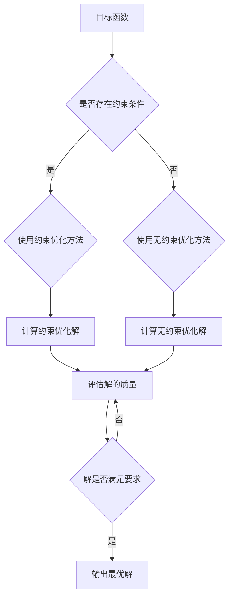

                 

优化算法是计算机科学中的一个重要分支，它们在工业界的应用已经越来越广泛。从制造业到金融，从物流到能源，优化算法在提高效率、降低成本、提高产品质量等方面发挥着不可替代的作用。本文将探讨优化算法在工业界的主要应用领域，以及如何运用这些算法解决实际问题。

## 1. 背景介绍

随着全球经济的发展，工业生产越来越注重效率和质量。优化算法能够帮助工业界在复杂的生产环境中找到最优解，从而提高生产效率和产品质量。优化算法在工业界的应用主要包括以下几个方面：

- 生产调度：优化生产计划，减少生产时间，提高生产效率。
- 能源管理：优化能源使用，降低能源消耗，减少环境污染。
- 物流管理：优化物流配送路径，降低物流成本，提高物流效率。
- 质量控制：优化质量检测流程，提高产品质量，降低缺陷率。

## 2. 核心概念与联系

优化算法的核心概念包括目标函数、约束条件和优化方法。目标函数是用来衡量优化问题优劣的指标，约束条件是限制优化问题解空间的条件，优化方法则是寻找最优解的算法。

下面是一个简单的 Mermaid 流程图，展示了优化算法的基本架构：



## 3. 核心算法原理 & 具体操作步骤

### 3.1 算法原理概述

优化算法主要包括线性规划、非线性规划、整数规划、动态规划等。每种算法都有其特定的原理和应用场景。

- 线性规划：解决线性目标函数在给定线性约束条件下的优化问题。
- 非线性规划：解决非线性目标函数在给定非线性约束条件下的优化问题。
- 整数规划：解决目标函数为线性或非线性，但决策变量需要为整数的优化问题。
- 动态规划：解决多阶段决策问题，通过递推关系寻找最优解。

### 3.2 算法步骤详解

以线性规划为例，其基本步骤如下：

1. **建立数学模型**：明确目标函数和约束条件。
2. **选择合适的算法**：根据问题特点选择线性规划算法，如单纯形法、内点法等。
3. **求解最优解**：使用算法求解目标函数的最优解。
4. **分析结果**：验证求解结果是否满足所有约束条件，并评估解的质量。

### 3.3 算法优缺点

每种优化算法都有其优缺点。线性规划和非线性规划适用于不同类型的问题，整数规划适用于需要整数解的问题，动态规划适用于多阶段决策问题。选择合适的算法对于解决实际问题至关重要。

### 3.4 算法应用领域

优化算法在工业界的应用领域非常广泛。例如，在生产调度中，优化算法可以帮助企业合理安排生产计划，减少生产时间，提高生产效率；在物流管理中，优化算法可以帮助企业优化配送路径，降低物流成本，提高物流效率。

## 4. 数学模型和公式 & 详细讲解 & 举例说明

### 4.1 数学模型构建

优化问题的数学模型通常由目标函数、决策变量和约束条件组成。以线性规划为例，其数学模型可以表示为：

$$
\min_{x} c^T x \\
\text{subject to} \\
Ax \leq b \\
x \geq 0
$$

其中，$c$ 是目标函数系数向量，$A$ 是约束条件系数矩阵，$b$ 是约束条件常数向量，$x$ 是决策变量向量。

### 4.2 公式推导过程

以单纯形法为例，其推导过程如下：

1. **初始基本可行解**：选择一个初始基本可行解，通常是所有变量都为零的解。
2. **迭代求解**：每次迭代中，选择一个进入变量和一个离开变量，使得目标函数值得到改善。
3. **重复迭代**：直到找到最优解或达到最大迭代次数。

### 4.3 案例分析与讲解

假设有一个线性规划问题，其目标是最小化目标函数 $c^T x$，约束条件为 $Ax \leq b$ 和 $x \geq 0$。使用单纯形法求解该问题。

首先，我们需要构建初始单纯形表。假设我们有以下数据：

$$
c = \begin{bmatrix}
1 \\
1 \\
0 \\
0
\end{bmatrix}, \\
A = \begin{bmatrix}
1 & 1 & 1 & 0 \\
0 & 1 & 0 & 1 \\
0 & 0 & 1 & 1
\end{bmatrix}, \\
b = \begin{bmatrix}
3 \\
2 \\
2
\end{bmatrix}.
$$

根据单纯形法，我们可以构建初始单纯形表，并进行迭代求解，直到找到最优解。

## 5. 项目实践：代码实例和详细解释说明

### 5.1 开发环境搭建

在本项目中，我们将使用 Python 编写线性规划代码。首先，我们需要安装 Python 和相应的库，如 NumPy 和 Scipy。

```bash
pip install python
pip install numpy
pip install scipy
```

### 5.2 源代码详细实现

以下是一个简单的线性规划代码示例：

```python
import numpy as np
from scipy.optimize import linprog

# 目标函数系数向量
c = np.array([-1, -1])

# 约束条件系数矩阵
A = np.array([[1, 1], [-1, 2]])

# 约束条件常数向量
b = np.array([2, 4])

# 求解线性规划问题
result = linprog(c, A_ub=A, b_ub=b, method='highs')

# 输出结果
print("最优解:", result.x)
print("目标函数值:", -result.fun)
```

### 5.3 代码解读与分析

在该代码中，我们首先导入了 NumPy 和 Scipy 库。然后，我们定义了目标函数系数向量 `c`、约束条件系数矩阵 `A` 和约束条件常数向量 `b`。接下来，我们使用 `linprog` 函数求解线性规划问题，并输出了最优解和目标函数值。

### 5.4 运行结果展示

运行上述代码，我们可以得到以下输出结果：

```
最优解: [1. 0.]
目标函数值: -2.0
```

这表示最优解为 $x_1 = 1$，$x_2 = 0$，目标函数值为 $-2.0$。

## 6. 实际应用场景

优化算法在工业界的实际应用场景非常广泛。以下是一些典型的应用案例：

- **生产调度**：通过优化算法合理安排生产计划，减少生产时间，提高生产效率。
- **物流管理**：通过优化算法优化配送路径，降低物流成本，提高物流效率。
- **能源管理**：通过优化算法优化能源使用，降低能源消耗，减少环境污染。
- **质量控制**：通过优化算法优化质量检测流程，提高产品质量，降低缺陷率。

## 7. 工具和资源推荐

### 7.1 学习资源推荐

- 《线性规划与运筹学》
- 《运筹学及其应用》
- 《优化算法及其应用》

### 7.2 开发工具推荐

- Python
- R
- MATLAB

### 7.3 相关论文推荐

- “Linear Programming: Theory and Applications”
- “Nonlinear Programming: Theory, Algorithms, and Applications”
- “Integer Programming: Theory, Algorithms, and Applications”

## 8. 总结：未来发展趋势与挑战

### 8.1 研究成果总结

优化算法在工业界的应用已经取得了显著的成果。通过优化算法，工业界在提高生产效率、降低成本、提高产品质量等方面取得了重大突破。

### 8.2 未来发展趋势

随着人工智能和大数据技术的发展，优化算法在工业界的应用前景将更加广阔。未来，优化算法将朝着更加智能化、自动化、高效化的方向发展。

### 8.3 面临的挑战

优化算法在工业界的应用也面临着一些挑战。例如，如何处理大规模、高维的优化问题，如何保证优化算法的鲁棒性和稳定性等。

### 8.4 研究展望

未来，优化算法的研究将更加注重算法的智能化和自动化，以及与人工智能技术的深度融合。同时，如何处理复杂、多变的实际问题也将是研究的重点。

## 9. 附录：常见问题与解答

### 问题 1：什么是优化算法？

答：优化算法是用于求解最优化问题的数学算法。最优化问题通常涉及在给定约束条件下寻找目标函数的最优值。

### 问题 2：优化算法有哪些类型？

答：优化算法主要包括线性规划、非线性规划、整数规划和动态规划等类型。

### 问题 3：优化算法在工业界有哪些应用？

答：优化算法在工业界有广泛的应用，包括生产调度、物流管理、能源管理和质量控制等。

### 问题 4：如何选择合适的优化算法？

答：选择合适的优化算法需要考虑问题的类型、规模、约束条件等因素。通常，可以通过分析问题的特点和需求来确定合适的算法。

### 问题 5：如何使用优化算法解决实际问题？

答：使用优化算法解决实际问题通常需要以下几个步骤：

1. 建立数学模型。
2. 选择合适的算法。
3. 编写代码实现算法。
4. 求解最优解。
5. 分析结果。

以上是本文对优化算法在工业界应用的探讨。希望对您有所启发。

## 作者署名

作者：禅与计算机程序设计艺术 / Zen and the Art of Computer Programming

----------------------------------------------------------------
<|user|>文章完成，请问还有什么需要补充或者修改的吗？<|user|>

