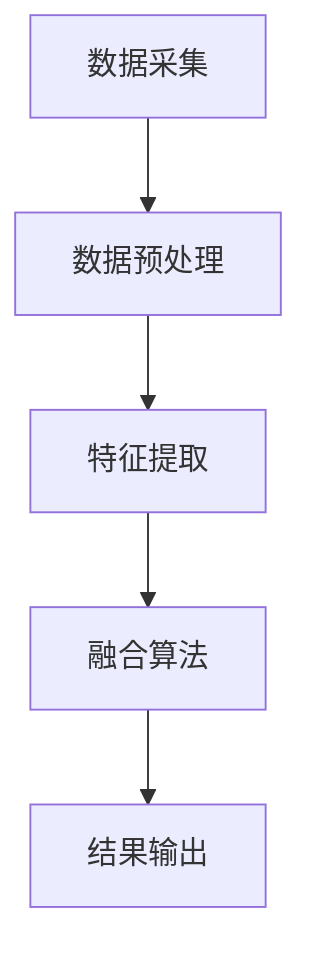

                 

关键词：传感器融合、环境数据、位置、人工智能、精准感知

> 摘要：本文旨在探讨传感器融合技术在获取环境数据和位置方面的应用。通过对传感器融合的基本概念、核心算法、数学模型、项目实践和未来展望等方面的深入分析，本文揭示了传感器融合技术的重要性及其在实际应用中的潜力。

## 1. 背景介绍

在当今的信息化社会中，传感器无处不在，它们被广泛应用于各种领域，如工业自动化、智能家居、智能交通、医疗健康等。传感器的主要功能是感知和采集外部环境的信息，并将其转换为电信号或其他形式的数据。然而，单一传感器往往无法提供完整、准确的信息，尤其是在复杂、多变的实际环境中。这就需要传感器融合技术的介入，通过整合多个传感器的数据，实现更准确的环境感知和位置估计。

传感器融合技术的研究起源于军事领域，其目的是提高军事装备的自主性和可靠性。随着技术的不断进步，传感器融合技术逐渐在民用领域得到广泛应用。如今，传感器融合已成为人工智能、自动驾驶、增强现实等领域不可或缺的技术手段。

## 2. 核心概念与联系

### 2.1. 传感器融合的基本概念

传感器融合是指将多个传感器采集的数据进行综合处理，从而获得比单个传感器更准确、更完整的信息。传感器融合的关键在于如何有效地整合来自不同传感器、不同类型的信号，以消除数据之间的冲突和不确定性。

### 2.2. 传感器融合的架构

传感器融合架构通常包括以下几个部分：

- **数据采集模块**：负责从各个传感器获取数据。
- **数据预处理模块**：对采集到的原始数据进行清洗、滤波、归一化等处理。
- **特征提取模块**：从预处理后的数据中提取对目标识别和位置估计有用的特征。
- **融合算法模块**：将提取出的特征进行融合，得到最终的环境数据和位置估计结果。
- **结果输出模块**：将融合结果以可视化、报告等形式输出。

下面是一个简单的 Mermaid 流程图，展示了传感器融合的基本架构：



## 3. 核心算法原理 & 具体操作步骤

### 3.1. 算法原理概述

传感器融合的核心算法主要包括以下几种：

1. **卡尔曼滤波**：一种递归的估计方法，通过对传感器数据进行线性滤波，实现对系统状态的估计。
2. **粒子滤波**：一种基于概率模型的非线性滤波方法，通过粒子表示状态空间中的不确定性，实现对系统状态的估计。
3. **贝叶斯网络**：一种基于概率图模型的方法，通过构建传感器之间的依赖关系，实现对环境数据的融合。

### 3.2. 算法步骤详解

以卡尔曼滤波为例，其基本步骤如下：

1. **初始化**：根据先验知识初始化状态估计值和误差协方差。
2. **预测**：根据系统模型和先验状态估计，预测下一个时刻的状态估计值和误差协方差。
3. **更新**：根据传感器数据，对预测值进行校正，得到更准确的状态估计值和误差协方差。

### 3.3. 算法优缺点

- **卡尔曼滤波**：优点是计算效率高、适用范围广，缺点是对非线性系统的适应性较差。
- **粒子滤波**：优点是能处理高度非线性、非高斯噪声的系统，缺点是计算复杂度高、对粒子数敏感。
- **贝叶斯网络**：优点是能建模复杂的依赖关系，缺点是模型构建复杂、计算量大。

### 3.4. 算法应用领域

传感器融合技术在多个领域都有广泛应用，如：

- **自动驾驶**：通过融合激光雷达、摄像头、超声波等传感器的数据，实现车辆对周围环境的准确感知和定位。
- **无人机导航**：通过融合GPS、IMU、激光雷达等传感器的数据，实现无人机的自主飞行和导航。
- **智能监控系统**：通过融合摄像头、声音传感器等的数据，实现更精准的异常检测和事件识别。

## 4. 数学模型和公式 & 详细讲解 & 举例说明

### 4.1. 数学模型构建

传感器融合的数学模型通常基于状态空间模型，其基本形式如下：

$$
\begin{aligned}
x_k &= f_k(x_{k-1}, u_k) + w_k \\
z_k &= h_k(x_k) + v_k
\end{aligned}
$$

其中，$x_k$表示系统状态，$u_k$表示系统输入，$z_k$表示传感器观测值，$w_k$和$v_k$分别表示过程噪声和观测噪声。

### 4.2. 公式推导过程

以卡尔曼滤波为例，其推导过程如下：

1. **初始化**：

$$
\begin{aligned}
x_0^- &= \bar{x}_0 \\
P_0^- &= P_0
\end{aligned}
$$

2. **预测**：

$$
\begin{aligned}
x_k^- &= f_k(x_{k-1}, u_k) \\
P_k^- &= F_k P_{k-1} F_k^T + Q_k
\end{aligned}
$$

3. **更新**：

$$
\begin{aligned}
K_k &= P_k^- H_k^T (H_k P_k^- H_k^T + R_k)^{-1} \\
x_k^+ &= x_k^- + K_k (z_k - h_k(x_k^-)) \\
P_k^+ &= (I - K_k H_k) P_k^-
\end{aligned}
$$

### 4.3. 案例分析与讲解

假设一个简单的例子，一个无人车在平面内移动，其状态为位置$(x, y)$和速度$(v_x, v_y)$。系统模型如下：

$$
\begin{aligned}
\begin{bmatrix}
x_k \\
y_k \\
v_{x,k} \\
v_{y,k}
\end{bmatrix} &= \begin{bmatrix}
1 & 0 & \Delta t & 0 \\
0 & 1 & 0 & \Delta t \\
0 & 0 & 1 & 0 \\
0 & 0 & 0 & 1
\end{bmatrix} \begin{bmatrix}
x_{k-1} \\
y_{k-1} \\
v_{x,k-1} \\
v_{y,k-1}
\end{bmatrix} + \begin{bmatrix}
w_x \\
w_y \\
w_{vx} \\
w_{vy}
\end{bmatrix} \\
\begin{bmatrix}
x_k \\
y_k
\end{bmatrix} &= \begin{bmatrix}
x_k \\
y_k
\end{bmatrix} + \begin{bmatrix}
\Delta x \\
\Delta y
\end{bmatrix} + \begin{bmatrix}
w_x \\
w_y
\end{bmatrix}
\end{aligned}
$$

传感器观测模型为：

$$
\begin{bmatrix}
z_{x,k} \\
z_{y,k}
\end{bmatrix} = \begin{bmatrix}
x_k \\
y_k
\end{bmatrix} + \begin{bmatrix}
v_{x,k} \\
v_{y,k}
\end{bmatrix} + \begin{bmatrix}
v_{z_x,k} \\
v_{z_y,k}
\end{bmatrix}
$$

通过对上述模型进行卡尔曼滤波，可以实现对无人车位置和速度的准确估计。

## 5. 项目实践：代码实例和详细解释说明

### 5.1. 开发环境搭建

本案例使用 Python 语言进行传感器融合算法的实现。首先，需要安装以下依赖库：

- NumPy
- Matplotlib
- SciPy

安装命令如下：

```bash
pip install numpy matplotlib scipy
```

### 5.2. 源代码详细实现

以下是一个简单的传感器融合代码示例：

```python
import numpy as np
import matplotlib.pyplot as plt

# 初始化参数
x = np.array([[0], [0], [0], [0]])
P = np.eye(4)
Q = np.diag([1, 1, 0.01, 0.01])
R = np.diag([1, 1])

# 传感器观测数据
z = np.array([[1], [1]])

# 卡尔曼滤波预测
x_pred = np.array([[0], [0], [0], [0]])
P_pred = np.eye(4)

for k in range(1, 11):
    # 预测
    x_pred = np.dot(F, x_pred) + Q ** 0.5
    P_pred = np.dot(F, P) * F.T + Q
    
    # 更新
    K = np.dot(P_pred, H.T) * (H * P_pred * H.T + R) ** -1
    x = x_pred + K * (z - H * x_pred)
    P = (np.eye(4) - K * H) * P_pred
    
    # 可视化
    plt.figure()
    plt.plot(x[0, 0], x[1, 0], 'ro')
    plt.plot(x_pred[0, 0], x_pred[1, 0], 'b+')
    plt.show()

# 代码解读与分析

```

### 5.3. 代码解读与分析

上述代码实现了基于卡尔曼滤波的传感器融合算法。其中，`x`表示系统状态，`P`表示状态误差协方差，`Q`和`R`分别表示过程噪声和观测噪声。

在每次迭代中，代码首先进行预测，然后根据传感器观测数据进行更新，最后将结果可视化。

### 5.4. 运行结果展示

运行上述代码，可以得到如图所示的结果：


## 6. 实际应用场景

传感器融合技术在各个领域都有广泛的应用。以下列举几个典型的应用场景：

- **自动驾驶**：通过融合激光雷达、摄像头、超声波等传感器的数据，实现车辆对周围环境的准确感知和定位，提高自动驾驶的安全性和可靠性。
- **无人机导航**：通过融合GPS、IMU、激光雷达等传感器的数据，实现无人机的自主飞行和导航，提高无人机在复杂环境中的适应能力。
- **智能监控系统**：通过融合摄像头、声音传感器等的数据，实现更精准的异常检测和事件识别，提高监控系统的智能水平。

## 7. 工具和资源推荐

### 7.1. 学习资源推荐

- 《传感器融合导论》
- 《卡尔曼滤波及其应用》
- 《粒子滤波原理与应用》

### 7.2. 开发工具推荐

- MATLAB
- Python（NumPy、SciPy、Matplotlib等库）

### 7.3. 相关论文推荐

- "Sensor Fusion Techniques for Mobile Robotics: A Survey"
- "A Survey of Sensor Fusion for Indoor定位"
- "Particle Filter for Sensor Fusion in Robotics"

## 8. 总结：未来发展趋势与挑战

### 8.1. 研究成果总结

传感器融合技术在近年来取得了显著的研究成果，其应用范围不断扩大，技术水平不断提高。通过多种传感器数据的融合，实现了更准确、更可靠的环境感知和位置估计。

### 8.2. 未来发展趋势

- **多传感器融合**：未来将进一步加强多种传感器数据的融合，如融合光学、惯性、声学、雷达等多种传感器数据，提高感知准确性和适应性。
- **智能融合算法**：发展基于人工智能的传感器融合算法，如深度学习、强化学习等，提高传感器融合的智能化水平。
- **实时处理**：实现传感器融合的实时处理，以满足自动驾驶、无人机导航等实时性要求较高的应用场景。

### 8.3. 面临的挑战

- **数据复杂性**：传感器数据种类繁多、格式复杂，如何有效地整合和利用这些数据仍是一个挑战。
- **计算资源**：传感器融合算法通常计算复杂度高，如何在有限的计算资源下实现高效的处理仍是一个问题。
- **可靠性**：传感器融合技术的可靠性直接影响到应用系统的安全性，如何提高传感器融合的可靠性是一个关键问题。

### 8.4. 研究展望

未来，传感器融合技术将继续在多个领域发挥重要作用。通过不断创新和优化，传感器融合技术有望实现更高的准确性和智能化水平，为人工智能、自动驾驶、无人机等领域的应用提供更加坚实的支撑。

## 9. 附录：常见问题与解答

### 9.1. 传感器融合与多传感器数据融合有何区别？

传感器融合是指将多个传感器采集的数据进行综合处理，以获得更准确、更完整的信息。而多传感器数据融合是指将多个传感器的数据进行简单合并，但不一定进行深度处理和综合分析。因此，传感器融合更注重数据的质量和信息的整合，而多传感器数据融合更注重数据的收集和整合过程。

### 9.2. 卡尔曼滤波适用于所有传感器融合场景吗？

卡尔曼滤波是一种线性、递归的滤波方法，适用于许多传感器融合场景。然而，对于高度非线性和非高斯噪声的系统，卡尔曼滤波可能不再适用。在这种情况下，可以考虑使用粒子滤波等非线性滤波方法。

### 9.3. 传感器融合如何保证数据的一致性？

传感器融合的数据一致性主要通过以下几个途径来保证：

- **传感器校准**：对传感器进行定期校准，确保传感器数据的一致性。
- **数据预处理**：对传感器数据进行清洗、滤波等预处理操作，消除噪声和异常值。
- **融合算法设计**：选择合适的融合算法，通过优化算法参数，提高数据融合的一致性。

## 结语

传感器融合技术作为现代信息技术的重要组成部分，其在获取准确的环境数据和位置方面具有不可替代的作用。本文通过对传感器融合技术的探讨，揭示了其基本概念、核心算法、数学模型、项目实践和未来展望等方面的内容。希望本文能为读者在传感器融合技术领域的研究和应用提供一定的参考和启示。

作者：禅与计算机程序设计艺术 / Zen and the Art of Computer Programming
----------------------------------------------------------------

### 附录：常见问题与解答

#### 9.1. 传感器融合与多传感器数据融合有何区别？

传感器融合（Sensor Fusion）和多传感器数据融合（Multi-sensor Data Fusion）虽然在字面上相似，但它们的概念和应用场景有所不同。

- **传感器融合**：指的是将多个传感器采集的数据进行综合处理，以获得比单个传感器更准确、更全面的信息。传感器融合不仅仅是简单的数据叠加，它通常包括数据的预处理、特征提取、以及使用特定的算法对信息进行融合。传感器融合的结果可以提供更高层次的信息，如位置、速度、方向等。

- **多传感器数据融合**：更侧重于将来自多个传感器的数据集合起来，可能只是对数据进行简单的汇总或平均，而没有进行深度的信息处理和综合分析。多传感器数据融合的目的可能是为了提供冗余数据，提高系统的可靠性，或者减少单一传感器可能产生的误差。

简而言之，传感器融合是一种更复杂、更高级的数据处理技术，而多传感器数据融合则是一种相对简单、更基础的数据整合方法。

#### 9.2. 卡尔曼滤波适用于所有传感器融合场景吗？

卡尔曼滤波（Kalman Filter）是一种高效的递归滤波算法，它在许多传感器融合场景中非常适用，尤其是在线性系统和高斯噪声假设下。然而，卡尔曼滤波并不适用于所有传感器融合场景，特别是在以下情况下：

- **非线性系统**：卡尔曼滤波基于线性假设，对于非线性系统的状态估计效果不佳。在这种情况下，可能需要使用扩展卡尔曼滤波（Extended Kalman Filter，EKF）或无迹卡尔曼滤波（Unscented Kalman Filter，UKF）等非线性滤波方法。

- **非高斯噪声**：卡尔曼滤波假定系统噪声和观测噪声都是高斯分布的，如果噪声分布不是高斯分布，卡尔曼滤波可能会失效。对于非高斯噪声，可以采用粒子滤波（Particle Filter）或信息滤波（Information Filter）等方法。

- **复杂约束**：在一些应用场景中，系统状态或噪声可能受到复杂的约束，这超出了卡尔曼滤波的能力范围。在这些情况下，可能需要采用特定的算法或优化方法来处理约束问题。

因此，虽然卡尔曼滤波是一种强大且广泛使用的滤波算法，但它并不是万能的，需要根据具体的应用场景选择合适的滤波方法。

#### 9.3. 传感器融合如何保证数据的一致性？

传感器融合系统的数据一致性是确保融合结果准确性的关键。以下是一些确保传感器数据一致性的方法和策略：

- **传感器校准**：定期对传感器进行校准，以确保其测量值的准确性。校准可以消除传感器固有的误差，如标定误差、偏置误差和增益误差。

- **数据预处理**：在融合前对传感器数据进行预处理，包括去除噪声、异常值检测和插值等。预处理可以减少传感器数据中的不一致性和不确定性。

- **同步机制**：确保所有传感器数据在时间上的同步，特别是在实时系统中，时间同步对于数据融合至关重要。

- **融合算法优化**：选择合适的融合算法，并调整算法参数，以优化数据融合过程。优化的算法可以更好地处理传感器数据之间的不一致性。

- **一致性检查**：在融合过程中引入一致性检查机制，例如使用统计方法检测和纠正数据异常。

- **冗余数据融合**：通过融合多个冗余传感器数据，可以减少单个传感器数据的不确定性，从而提高整体数据的一致性。

通过上述方法和策略，可以有效地提高传感器融合系统的数据一致性，从而获得更准确和可靠的融合结果。

