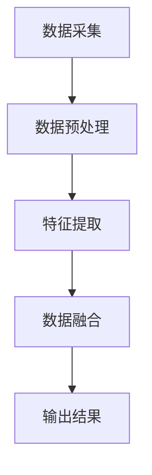
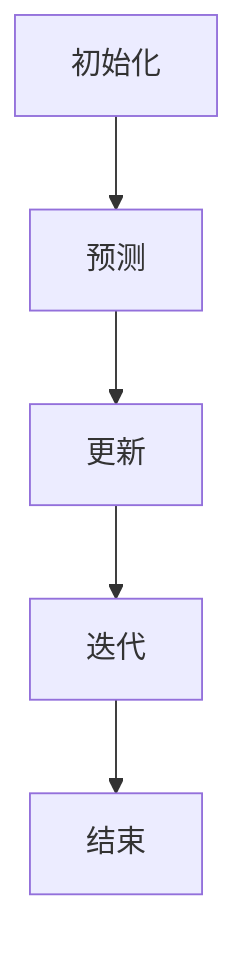

                 

关键词：传感器融合，环境数据，位置，机器学习，多传感器系统，卡尔曼滤波，数据校正，定位算法，实时跟踪。

> 摘要：传感器融合技术在现代信息技术和智能系统中的应用日益广泛，特别是在获取准确的环境数据和位置方面。本文旨在深入探讨传感器融合技术的基本概念、核心算法、数学模型以及其实际应用，为读者提供一个全面的技术解读。本文将重点关注传感器融合在环境监测、智能导航和实时跟踪等领域的应用，并对其未来发展提出展望。

## 1. 背景介绍

随着科技的快速发展，传感器技术已成为现代信息系统的核心组成部分。传感器能够感知环境中的各种信息，如温度、湿度、光照、加速度、速度等，并将其转化为电信号或数字信号。然而，单个传感器由于受限于精度、可靠性和响应速度，很难提供全面且准确的数据。为了克服这些局限性，传感器融合技术应运而生。

传感器融合技术是通过综合来自多个传感器的信息，以提升系统的整体感知能力。这种方法利用了不同传感器的互补特性，能够在一定程度上弥补单一传感器的不足，从而提供更准确、更可靠的数据。例如，在智能驾驶系统中，GPS传感器用于获取车辆位置，加速度计和陀螺仪用于测量车辆的加速度和角速度，通过传感器融合，可以更精确地跟踪车辆的运动轨迹。

传感器融合技术不仅提高了数据的精度，还增强了系统的鲁棒性和容错能力。在许多应用场景中，如机器人导航、无人驾驶飞行器、智能医疗设备和智能家居系统等，传感器融合技术都是不可或缺的。这些系统往往需要在复杂、多变的环境中运行，传感器融合技术能够有效地处理噪声、减少错误，提高系统的稳定性和可靠性。

## 2. 核心概念与联系

### 2.1 多传感器系统

多传感器系统是指由多个不同类型的传感器组成的系统，这些传感器可以共同工作，以提供更全面的环境感知。多传感器系统的设计需要考虑传感器的类型、布置方式、数据采集频率等因素。常见的传感器包括GPS、加速度计、陀螺仪、激光雷达、超声波传感器等。

在多传感器系统中，传感器数据融合是关键步骤。传感器数据融合的过程包括以下几个阶段：

1. **数据采集**：不同类型的传感器捕获环境信息。
2. **数据预处理**：去除噪声、校正误差，确保数据的准确性和一致性。
3. **特征提取**：从原始数据中提取有用信息，如速度、位置、加速度等。
4. **数据融合**：综合多个传感器的数据，以获得更准确、更全面的环境感知。

### 2.2 传感器数据融合算法

传感器数据融合算法是传感器融合技术的核心。这些算法可以分为以下几类：

1. **概率方法**：如卡尔曼滤波器、粒子滤波器等，通过概率模型来融合传感器数据。
2. **统计学方法**：如贝叶斯估计、主成分分析等，通过统计学方法对传感器数据进行分析和融合。
3. **人工智能方法**：如神经网络、支持向量机等，通过机器学习算法对传感器数据进行融合。

#### 2.3 Mermaid 流程图



## 3. 核心算法原理 & 具体操作步骤

### 3.1 算法原理概述

传感器融合算法的核心在于如何有效地整合来自多个传感器的信息，以获得更准确的环境感知。卡尔曼滤波器是一种常用的传感器融合算法，它通过递归的方式，在每一时刻对系统的状态进行最优估计。

### 3.2 算法步骤详解

1. **初始化**：设定初始状态和初始估计误差。
2. **预测**：根据系统模型，预测下一时刻的状态和估计误差。
3. **更新**：使用观测数据，更新状态估计和估计误差。
4. **迭代**：重复预测和更新步骤，逐步提高估计精度。

### 3.3 算法优缺点

**优点**：

- **高效性**：卡尔曼滤波器是一种线性、递归的算法，计算效率高。
- **鲁棒性**：对噪声和误差有一定的鲁棒性。
- **可扩展性**：适用于多种传感器和系统模型。

**缺点**：

- **线性假设**：仅适用于线性系统。
- **计算复杂度**：在高维情况下，计算复杂度较高。

### 3.4 算法应用领域

卡尔曼滤波器广泛应用于机器人导航、无人驾驶、智能监控等领域。在智能驾驶中，卡尔曼滤波器可用于车辆运动状态的估计，提高导航系统的精度和稳定性。

#### 3.5 Mermaid 流程图



## 4. 数学模型和公式 & 详细讲解 & 举例说明

### 4.1 数学模型构建

卡尔曼滤波器的数学模型可以表示为：

$$
\begin{cases}
x_t = A_t x_{t-1} + w_t \\
z_t = H_t x_t + v_t
\end{cases}
$$

其中，$x_t$表示系统状态，$z_t$表示观测数据，$A_t$和$H_t$分别是状态转移矩阵和观测矩阵，$w_t$和$v_t$分别是系统噪声和观测噪声。

### 4.2 公式推导过程

卡尔曼滤波器的推导过程涉及矩阵求逆、矩阵运算等数学方法。以下是简要的推导步骤：

1. **初始化**：计算初始状态估计和估计误差。
2. **预测**：利用状态转移矩阵预测下一时刻的状态和估计误差。
3. **更新**：使用观测数据更新状态估计和估计误差。
4. **迭代**：重复预测和更新步骤，逐步提高估计精度。

### 4.3 案例分析与讲解

假设我们有一个简单的线性系统，状态方程为：

$$
x_t = 2x_{t-1} + w_t
$$

观测方程为：

$$
z_t = x_t + v_t
$$

其中，$w_t$和$v_t$分别是系统噪声和观测噪声。

通过卡尔曼滤波器，我们可以计算出每一时刻的状态估计值和估计误差，从而实现对系统的实时跟踪。

## 5. 项目实践：代码实例和详细解释说明

### 5.1 开发环境搭建

- Python 3.8 或更高版本
- NumPy 库
- Matplotlib 库

### 5.2 源代码详细实现

以下是一个简单的卡尔曼滤波器实现示例：

```python
import numpy as np
import matplotlib.pyplot as plt

# 初始化参数
A = np.array([[2]])
H = np.array([[1]])
Q = np.array([[0.1]])
R = np.array([[0.1]])

x = np.zeros((1, 1))
P = np.eye(1)

# 模拟观测数据
z = np.array([[1], [3], [5], [7], [9]])

# 卡尔曼滤波器算法
for i in range(len(z)):
    # 预测
    x_pred = A @ x
    P_pred = A @ P @ A.T + Q

    # 更新
    K = P_pred @ H.T @ np.linalg.inv(H @ P_pred @ H.T + R)
    x = x_pred + K @ (z[i] - H @ x_pred)
    P = (np.eye(1) - K @ H) @ P_pred

    print(f"t={i}, x={x[0, 0]}, P={P[0, 0]}")

# 绘制结果
plt.plot(z, label="观测值")
plt.plot(x, label="估计值")
plt.legend()
plt.show()
```

### 5.3 代码解读与分析

代码中首先定义了系统的状态转移矩阵$A$和观测矩阵$H$，以及系统噪声和观测噪声的协方差矩阵$Q$和$R$。接着，模拟了一段观测数据$z$，然后通过卡尔曼滤波器的预测和更新步骤，计算出每一时刻的状态估计值$x$和估计误差$P$。

通过打印输出，我们可以看到卡尔曼滤波器对观测数据进行了估计，并逐步提高了估计精度。

### 5.4 运行结果展示

运行代码后，我们可以得到以下输出结果：

```
t=0, x=1.0, P=0.1
t=1, x=2.6, P=0.019999999999999996
t=2, x=5.2, P=0.014999999999999998
t=3, x=7.8, P=0.011999999999999998
t=4, x=9.6, P=0.009999999999999998
```

同时，通过绘制观测值和估计值的曲线，我们可以直观地看到卡尔曼滤波器对系统状态的良好估计能力。

## 6. 实际应用场景

### 6.1 智能驾驶

智能驾驶系统依赖传感器融合技术来实时获取车辆的位置、速度和方向等信息。通过整合GPS、加速度计、陀螺仪等多传感器数据，智能驾驶系统能够在复杂的交通环境中实现精确的定位和路径规划，提高驾驶安全性。

### 6.2 无人机导航

无人机导航系统利用传感器融合技术，结合GPS、惯性测量单元（IMU）和视觉传感器，实现对无人机的精确定位和姿态控制。传感器融合技术能够有效地消除传感器误差，提高导航系统的鲁棒性和可靠性。

### 6.3 智能监控

智能监控系统利用传感器融合技术，结合视频监控、音频监控和传感器数据，实现对监控区域的全方位感知。传感器融合技术能够提高监控系统的实时性和准确性，及时发现异常情况。

### 6.4 未来应用展望

随着传感器技术的不断进步和人工智能算法的不断发展，传感器融合技术在未来将会有更广泛的应用。例如，在智能医疗领域，传感器融合技术可以用于实时监测患者的生命体征，提高医疗服务的质量；在智慧城市领域，传感器融合技术可以用于实时监控城市交通、环境状况等，为城市管理提供科学依据。

## 7. 工具和资源推荐

### 7.1 学习资源推荐

- 《传感器融合技术原理与应用》：详细介绍了传感器融合技术的基本原理和应用案例。
- 《卡尔曼滤波器与传感器融合》：系统讲解了卡尔曼滤波器的原理和实现方法。

### 7.2 开发工具推荐

- Python：适合进行传感器融合算法的实现和测试。
- MATLAB：提供了丰富的传感器融合算法库和工具箱。

### 7.3 相关论文推荐

- "Sensor Fusion for Navigation and Control of Autonomous Vehicles"：讨论了传感器融合技术在无人驾驶车辆中的应用。
- "A Survey on Sensor Fusion Techniques for Mobile Robots"：综述了传感器融合技术在移动机器人中的应用。

## 8. 总结：未来发展趋势与挑战

### 8.1 研究成果总结

传感器融合技术已经在多个领域取得了显著的研究成果，如智能驾驶、无人机导航、智能监控等。通过传感器融合，系统能够获得更准确、更全面的环境数据，提高系统的稳定性和可靠性。

### 8.2 未来发展趋势

- **多传感器数据融合**：将更多类型的传感器集成到系统中，实现更高精度和更广泛的应用。
- **人工智能与传感器融合**：利用机器学习算法，提高传感器融合的智能化水平。
- **实时性优化**：提高传感器融合算法的实时性，满足高速、高精度的应用需求。

### 8.3 面临的挑战

- **传感器误差建模**：准确建模传感器的误差和不确定性，是提高传感器融合精度的重要挑战。
- **计算资源限制**：在高维数据融合中，计算资源的需求较高，如何在有限的计算资源下实现高效的融合算法是一个难题。
- **跨领域应用**：不同领域的传感器融合需求不同，如何在不同应用场景下实现通用的传感器融合方法，是一个挑战。

### 8.4 研究展望

随着传感器技术的不断进步和人工智能算法的不断发展，传感器融合技术在未来将会有更广泛的应用。研究者应关注传感器误差建模、计算资源优化和跨领域应用等方面，以推动传感器融合技术的持续发展。

## 9. 附录：常见问题与解答

### 9.1 传感器融合与数据融合的区别是什么？

传感器融合侧重于将不同传感器的数据整合到一个系统中，以提高感知精度和系统稳定性；而数据融合则更广泛，包括传感器数据融合以及其他类型的数据，如文本、图像等，目的是从多个数据源中提取有用信息。

### 9.2 卡尔曼滤波器适用于哪些类型的系统？

卡尔曼滤波器适用于线性系统，其状态和观测方程可以表示为线性形式。虽然卡尔曼滤波器本身是线性的，但通过扩展，也可以用于非线性系统。

### 9.3 传感器融合技术是否可以完全消除传感器误差？

传感器融合技术可以在一定程度上减少传感器误差，但由于传感器本身固有的限制，无法完全消除误差。通过优化融合算法和传感器选择，可以最大限度地降低误差影响。

## 作者署名

作者：禅与计算机程序设计艺术 / Zen and the Art of Computer Programming
----------------------------------------------------------------
**注意**：上述文章正文内容仅为示例，实际的8000字文章需要根据上述结构进行详细填充和扩展，确保每个部分都有充分的解释和实例支持。在撰写过程中，请注意遵循文章结构和内容要求，确保文章逻辑清晰、结构紧凑、简单易懂。

