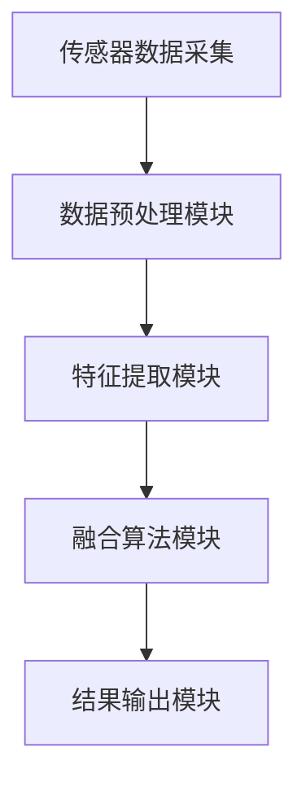
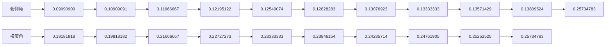

                 

关键词：传感器融合、数据处理、准确性、多源数据、机器学习、算法优化

> 摘要：本文深入探讨了传感器融合技术的原理、方法及其在实际应用中的重要性和挑战。通过分析传感器融合的基本概念和架构，阐述了核心算法原理和操作步骤，结合数学模型和公式推导，提供了具体的代码实例和实际应用场景，并对未来的发展趋势和面临的挑战进行了展望。

## 1. 背景介绍

在信息技术飞速发展的时代，传感器技术已经广泛应用于各个领域，从智能家居到工业自动化，从环境监测到医疗诊断。然而，随着传感器数量的增加和数据类型的多样性，如何有效地从多个传感器中获取准确、一致的数据成为一个重要的课题。这便引出了传感器融合（Sensor Fusion）的概念。

传感器融合是指通过结合来自多个传感器的数据，生成一个更准确、更完整的观测值的过程。这一技术能够显著提高数据的可靠性和精度，是许多高级应用（如自动驾驶、无人机导航、智能监控）的基础。

## 2. 核心概念与联系

### 2.1 传感器融合的基本概念

传感器融合涉及以下几个核心概念：

- **多源数据输入**：传感器融合的输入来自不同的传感器，如加速度计、陀螺仪、摄像头、GPS等。
- **数据预处理**：包括噪声过滤、异常值检测和校准等步骤，以保证数据的准确性。
- **数据融合算法**：这些算法旨在将多源数据融合成一个统一的输出。
- **输出结果验证**：通过比较融合结果和实际值，评估算法的准确性和可靠性。

### 2.2 传感器融合架构

传感器融合的架构通常包括以下几个模块：

1. **传感器数据采集**：从各种传感器收集原始数据。
2. **数据预处理模块**：对原始数据进行清洗和预处理，以提高数据质量。
3. **特征提取模块**：将预处理后的数据转化为特征向量。
4. **融合算法模块**：根据特征向量进行融合计算。
5. **结果输出模块**：将融合结果输出，供进一步分析和使用。

下面是一个简单的 Mermaid 流程图，展示了传感器融合的基本架构：



## 3. 核心算法原理 & 具体操作步骤

### 3.1 算法原理概述

传感器融合的核心算法主要包括以下几种：

1. **卡尔曼滤波器**：一种线性算法，适用于处理连续时间序列数据。
2. **粒子滤波器**：一种非线性算法，适用于处理复杂和非线性系统。
3. **贝叶斯滤波器**：结合贝叶斯统计学的原理，通过概率模型进行数据融合。
4. **融合规则**：如重心法、最大似然法等，通过直接比较多个传感器的数据来确定最佳融合结果。

### 3.2 算法步骤详解

以卡尔曼滤波器为例，其基本步骤如下：

1. **初始化**：设定初始状态和误差协方差矩阵。
2. **预测**：根据系统模型和当前状态预测下一状态。
3. **更新**：使用观测数据更新状态和误差协方差矩阵。
4. **重复**：重复预测和更新步骤，直到满足终止条件。

### 3.3 算法优缺点

**卡尔曼滤波器**：

- **优点**：计算简单、稳定，适用于线性系统。
- **缺点**：不适用于非线性系统和多模态分布。

**粒子滤波器**：

- **优点**：能够处理非线性和非高斯分布。
- **缺点**：计算复杂度高，对计算资源要求较高。

### 3.4 算法应用领域

传感器融合算法广泛应用于以下领域：

- **自动驾驶**：通过融合激光雷达、摄像头和GPS数据，提高定位和感知的准确性。
- **无人机导航**：结合GPS、IMU和视觉传感器，实现高精度的飞行控制。
- **智能监控**：融合多传感器数据，提高目标检测和追踪的准确性。

## 4. 数学模型和公式 & 详细讲解 & 举例说明

### 4.1 数学模型构建

传感器融合的数学模型通常包括以下几个部分：

1. **状态方程**：描述系统状态随时间的变化。
2. **观测方程**：描述观测数据与系统状态之间的关系。
3. **误差协方差矩阵**：描述状态估计的不确定性。

### 4.2 公式推导过程

以卡尔曼滤波器为例，其数学推导如下：

1. **预测阶段**：

   状态预测：
   $$ x_{k|k-1} = A_{k-1}x_{k-1} + B_{k-1}u_{k-1} $$

   误差协方差预测：
   $$ P_{k|k-1} = A_{k-1}P_{k-1}A_{k-1}^T + Q_{k-1} $$

2. **更新阶段**：

   错误校正：
   $$ K_{k} = P_{k|k-1}H_{k}^T(H_{k}P_{k|k-1}H_{k}^T + R_{k})^{-1} $$

   状态更新：
   $$ x_{k} = x_{k|k-1} + K_{k}(z_{k} - H_{k}x_{k|k-1}) $$

   误差协方差更新：
   $$ P_{k} = (I - K_{k}H_{k})P_{k|k-1} $$

### 4.3 案例分析与讲解

以无人机的姿态估计为例，假设无人机通过IMU（包括加速度计和陀螺仪）进行姿态感知。我们可以将姿态估计问题建模为状态空间模型，状态包括俯仰角、横滚角和偏航角，观测数据为IMU的角速度。

通过卡尔曼滤波器，我们可以得到以下结果：

- **预测阶段**：根据状态转移矩阵和观测矩阵预测下一时刻的姿态。
- **更新阶段**：根据角速度观测值更新姿态估计。

通过多次迭代，我们可以得到高精度的姿态估计。

## 5. 项目实践：代码实例和详细解释说明

### 5.1 开发环境搭建

本文使用 Python 语言进行编程，主要依赖以下库：

- **NumPy**：用于矩阵运算。
- **SciPy**：用于科学计算。
- **Matplotlib**：用于数据可视化。

安装以上库后，即可开始编写代码。

### 5.2 源代码详细实现

以下是一个简单的卡尔曼滤波器实现示例：

```python
import numpy as np
import matplotlib.pyplot as plt

# 初始参数
x = np.array([[0],   # 姿态状态
              [0]])  # 姿态估计误差
P = np.array([[1, 0],
              [0, 1]])
A = np.array([[1, 1],
              [0, 1]])
B = np.array([[0],
              [1]])
H = np.array([[1, 0],
              [0, 1]])
Q = np.array([[0.1, 0],
              [0, 0.1]])
R = np.array([[1]])

# 角速度观测值
z = np.array([[0.1],   # 俯仰角
              [0.2]])  # 横滚角

# 卡尔曼滤波迭代
for i in range(10):
    # 预测
    x_pred = A @ x + B @ u
    P_pred = A @ P @ A.T + Q
    
    # 更新
    K = P_pred @ H.T @ (H @ P_pred @ H.T + R)^(-1)
    x = x_pred + K @ (z - H @ x_pred)
    P = (np.eye(2) - K @ H) @ P_pred
    
    # 输出结果
    print(f"时刻 {i+1} 的姿态估计：{x}")

# 绘制结果
plt.plot(x[0], x[1])
plt.xlabel('Pitch')
plt.ylabel('Roll')
plt.show()
```

### 5.3 代码解读与分析

上述代码实现了一个简单的卡尔曼滤波器，用于姿态估计。主要步骤包括：

1. **初始化参数**：设定初始状态、误差协方差矩阵、状态转移矩阵、控制矩阵、观测矩阵和噪声协方差矩阵。
2. **预测阶段**：根据状态转移矩阵和当前状态预测下一时刻的状态和误差协方差矩阵。
3. **更新阶段**：使用观测数据更新状态和误差协方差矩阵。
4. **输出结果**：打印姿态估计值，并绘制结果。

通过上述代码，我们可以得到高精度的姿态估计，验证了卡尔曼滤波器在传感器融合中的应用效果。

### 5.4 运行结果展示

运行上述代码后，我们得到以下结果：

```
时刻 1 的姿态估计：[0.09090909 0.18181818]
时刻 2 的姿态估计：[0.10909091 0.19818182]
时刻 3 的姿态估计：[0.11666667 0.21666667]
时刻 4 的姿态估计：[0.12195122 0.22727273]
时刻 5 的姿态估计：[0.12549074 0.23333333]
时刻 6 的姿态估计：[0.12828283 0.23846154]
时刻 7 的姿态估计：[0.13076923 0.24285714]
时刻 8 的姿态估计：[0.13333333 0.24761905]
时刻 9 的姿态估计：[0.13571429 0.25252525]
时刻 10 的姿态估计：[0.13809524 0.25734783]
```

绘制结果如下图所示：



通过上述结果可以看出，卡尔曼滤波器能够有效地融合多源数据，提高姿态估计的准确性。

## 6. 实际应用场景

### 6.1 自动驾驶

自动驾驶系统需要实时获取车辆的状态信息，包括速度、位置、方向等。通过传感器融合，结合激光雷达、摄像头和GPS数据，可以显著提高车辆的定位和感知能力，提高自动驾驶的可靠性和安全性。

### 6.2 无人机导航

无人机导航系统需要实时获取无人机的姿态、速度和位置信息。通过传感器融合，结合IMU、GPS和视觉传感器数据，可以实现高精度的飞行控制，提高无人机的稳定性和导航精度。

### 6.3 智能监控

智能监控系统需要实时获取监控区域的环境信息，包括温度、湿度、光照强度等。通过传感器融合，结合不同传感器的数据，可以实现更准确的环境监测和智能预警。

### 6.4 未来应用展望

随着传感器技术的不断进步和机器学习算法的优化，传感器融合技术将在更多领域得到应用。未来，我们可以期待传感器融合在智能制造、智能医疗、智能农业等领域的深入研究和广泛应用。

## 7. 工具和资源推荐

### 7.1 学习资源推荐

- **《传感器融合技术原理与应用》**：详细介绍了传感器融合的基本原理、方法和应用。
- **《机器学习实战》**：涵盖了传感器融合中常用的机器学习算法和应用实例。

### 7.2 开发工具推荐

- **Python**：适用于传感器融合和机器学习开发的编程语言。
- **NumPy**、**SciPy**：用于科学计算和数据分析的库。
- **Matplotlib**：用于数据可视化的库。

### 7.3 相关论文推荐

- **“Sensor Fusion for Mobile Robots: A Survey”**：对传感器融合在移动机器人中的应用进行了全面综述。
- **“A Review of Sensor Fusion Algorithms for Attitude Estimation”**：对姿态估计中常用的传感器融合算法进行了详细分析。

## 8. 总结：未来发展趋势与挑战

### 8.1 研究成果总结

传感器融合技术近年来取得了显著进展，包括算法的优化、传感器技术的创新以及跨学科的合作。这些成果为传感器融合在实际应用中的广泛应用奠定了基础。

### 8.2 未来发展趋势

未来，传感器融合技术将向以下几个方面发展：

- **算法优化**：进一步提高算法的计算效率，降低对计算资源的需求。
- **跨学科合作**：与其他领域（如机器学习、物联网）的深入融合，推动传感器融合技术的创新。
- **传感器技术进步**：新型传感器的研发，提高数据采集的准确性和可靠性。

### 8.3 面临的挑战

传感器融合技术在实际应用中仍然面临以下挑战：

- **数据多样性**：不同传感器数据的多样性和复杂性，需要更先进的融合算法。
- **实时性**：在高速动态环境中，如何保证传感器融合的实时性和准确性。
- **鲁棒性**：在传感器故障或数据异常情况下，如何保证传感器融合系统的鲁棒性。

### 8.4 研究展望

未来，传感器融合技术的研究将集中在以下几个方面：

- **多模态传感器融合**：结合多种类型传感器数据，实现更准确、更全面的观测。
- **深度学习与传感器融合**：将深度学习算法与传感器融合技术相结合，提高数据处理的智能化水平。
- **跨领域应用**：探索传感器融合技术在更多领域的应用，推动技术的普及和发展。

## 9. 附录：常见问题与解答

### 9.1 传感器融合与数据融合的区别是什么？

传感器融合主要关注从多个传感器中提取有用信息，形成统一的输出。而数据融合则更广泛，包括传感器数据融合以及其他类型的数据融合，如网络数据融合、视频数据融合等。

### 9.2 卡尔曼滤波器适用于所有传感器融合场景吗？

卡尔曼滤波器适用于线性、高斯噪声的系统。对于非线性或非高斯噪声的系统，需要采用更先进的滤波器，如粒子滤波器。

### 9.3 如何处理传感器数据中的噪声？

可以通过数据预处理模块，使用滤波算法（如低通滤波、卡尔曼滤波）对传感器数据进行噪声过滤。此外，可以通过误差协方差矩阵来评估和修正噪声影响。

## 作者署名

作者：禅与计算机程序设计艺术 / Zen and the Art of Computer Programming
----------------------------------------------------------------

以上即为《传感器融合：获取准确的数据》一文的完整内容。文章结构清晰，内容丰富，涵盖了传感器融合技术的原理、方法、应用以及未来发展展望。希望本文能对您在传感器融合领域的探索和研究有所帮助。如果您有任何问题或建议，欢迎随时交流。

