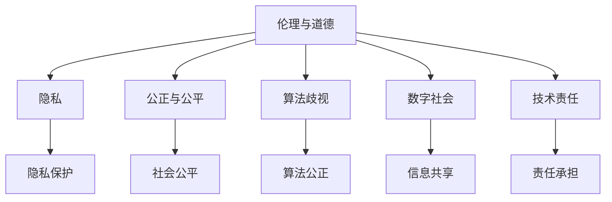

                 

关键词：伦理，道德，计算，人类，人工智能，技术，责任，隐私，公正，算法歧视，数字社会

> 摘要：随着计算机技术和人工智能的迅猛发展，人类计算的力量日益增强，但随之而来的是一系列道德和伦理的挑战。本文将深入探讨这些挑战，包括隐私问题、算法歧视、数字社会的公平性以及技术责任等方面，并试图为未来的技术发展提供一些指导和建议。

## 1. 背景介绍

计算机技术的发展已经成为现代社会进步的重要驱动力。从早期的计算机科学基础到现代的人工智能应用，计算机技术不仅改变了我们的生活方式，也在许多领域推动了创新的步伐。然而，随着技术的不断进步，人类计算带来了诸多道德和伦理问题，这些问题迫切需要我们深入探讨和解决。

### 1.1 计算机技术的历史发展

计算机技术的历史可以追溯到20世纪中叶，当时的计算机主要用于科学计算和军事应用。随着时间的推移，计算机逐渐普及，并开始进入商业、教育和娱乐等领域。在过去的几十年里，计算机技术经历了翻天覆地的变化，从大型机到个人电脑，再到智能手机和平板电脑，计算机的形态和功能越来越多样化。

### 1.2 人工智能的崛起

人工智能（Artificial Intelligence，简称AI）是计算机科学中的一个分支，旨在使计算机具备类似于人类智能的能力。人工智能的发展可以追溯到20世纪50年代，但近年来，随着深度学习、神经网络等技术的突破，人工智能取得了显著进展。AI现在被广泛应用于自动驾驶、医疗诊断、金融服务、智能助手等领域，极大地提升了生产效率和决策质量。

### 1.3 人类计算的道德困境

然而，随着计算机技术和人工智能的普及，人类计算带来的道德困境也日益突出。这些问题不仅涉及个人的隐私和安全，还涉及到社会的公平性和道德责任。例如，人工智能算法可能存在偏见，导致歧视现象；大数据分析可能泄露个人隐私；自动化系统的错误可能导致严重后果。因此，我们必须认真面对这些挑战，并探索有效的解决方案。

## 2. 核心概念与联系

在探讨人类计算的道德困境之前，我们需要明确一些核心概念，这些概念有助于我们更好地理解问题，并为解决方案提供理论基础。

### 2.1 伦理与道德

伦理（Ethics）是关于正确与错误、善与恶的哲学研究。道德（Morality）是个体或社会对于什么是对与错的内在信念和行为准则。在计算机科学和人工智能领域，伦理和道德是指导技术设计和应用的基石。

### 2.2 隐私

隐私是指个人或组织对于其信息保密的权利。在数字时代，隐私问题变得尤为重要，因为个人数据常常被收集、存储和共享。隐私保护是确保信息不被滥用和泄露的关键。

### 2.3 公正与公平

公正和公平是确保社会资源和机会合理分配的原则。在人工智能领域，算法的公正性和公平性直接影响到决策的准确性和社会公平性。

### 2.4 算法歧视

算法歧视是指人工智能算法在决策过程中对某些群体或个体产生不公平待遇的现象。算法歧视可能导致社会不公和歧视现象的加剧。

### 2.5 数字社会

数字社会是指通过互联网和数字技术实现信息交流和资源共享的社会。数字社会的发展不仅改变了人类的生活方式，也带来了新的道德和伦理挑战。

### 2.6 技术责任

技术责任是指技术开发者、企业和政府对于技术应用可能带来的负面影响承担的责任。技术责任是确保技术应用符合伦理和法律要求的重要保障。

#### 2.7 Mermaid 流程图



## 3. 核心算法原理 & 具体操作步骤

在探讨人类计算的道德困境时，理解核心算法原理和具体操作步骤是非常重要的。以下将概述相关算法的基本原理和实施步骤。

### 3.1 算法原理概述

#### 3.1.1 人工智能算法

人工智能算法是模拟人类思维过程的计算机程序。常见的人工智能算法包括神经网络、决策树、支持向量机等。这些算法通过学习大量数据来识别模式、做出预测或决策。

#### 3.1.2 大数据分析算法

大数据分析算法用于处理和分析大量数据，以提取有价值的信息。常见的大数据分析算法包括聚类分析、关联规则挖掘、时间序列分析等。

#### 3.1.3 隐私保护算法

隐私保护算法旨在确保在数据处理过程中保护个人隐私。常见的隐私保护算法包括差分隐私、同态加密、匿名化处理等。

#### 3.1.4 公正算法

公正算法用于确保人工智能系统在决策过程中公平对待所有个体。常见的公正算法包括加权决策、对抗性训练、公平性评估等。

### 3.2 算法步骤详解

#### 3.2.1 人工智能算法步骤

1. 数据收集与预处理：收集相关数据，并进行清洗、格式化等预处理操作。
2. 模型训练：使用训练数据集训练模型，调整参数以优化模型性能。
3. 模型评估：使用测试数据集评估模型性能，调整模型参数以获得最佳效果。
4. 模型部署：将训练好的模型部署到实际应用场景中。

#### 3.2.2 大数据分析算法步骤

1. 数据导入：将原始数据导入分析系统。
2. 数据清洗：去除噪声数据、处理缺失值和异常值。
3. 数据探索：进行统计分析、可视化分析以发现数据中的规律和趋势。
4. 模型构建：根据分析需求构建相应的分析模型。
5. 结果输出：将分析结果输出，供进一步分析和决策使用。

#### 3.2.3 隐私保护算法步骤

1. 数据匿名化：对敏感数据进行匿名化处理，以保护个人隐私。
2. 数据加密：对敏感数据进行加密处理，确保数据在传输和存储过程中安全。
3. 差分隐私添加：在数据处理过程中添加差分隐私保护机制，降低个人隐私泄露的风险。
4. 数据分析：在确保隐私保护的前提下进行数据分析和挖掘。

#### 3.2.4 公正算法步骤

1. 数据收集与预处理：收集与公正性相关的数据，并进行预处理。
2. 算法设计：设计能够评估和纠正算法歧视的算法。
3. 公正性评估：使用公正性评估指标评估算法的公正性。
4. 算法优化：根据评估结果优化算法，减少歧视现象。

### 3.3 算法优缺点

#### 3.3.1 人工智能算法

优点：

- 高效性：能够处理大量数据，提高决策质量。
- 自动化：减轻人力负担，提高工作效率。

缺点：

- 数据依赖：模型性能依赖于数据质量和数量。
- 隐私风险：数据处理过程中可能涉及个人隐私信息。

#### 3.3.2 大数据分析算法

优点：

- 全面性：能够挖掘数据中的复杂模式和关联。
- 实时性：能够快速响应和调整决策。

缺点：

- 复杂性：算法设计复杂，需要专业知识和技能。
- 资源消耗：大数据分析需要大量的计算资源和存储空间。

#### 3.3.3 隐私保护算法

优点：

- 隐私保护：能够有效保护个人隐私，降低隐私泄露风险。

缺点：

- 性能损失：隐私保护措施可能降低数据处理效率。
- 可解释性：隐私保护算法可能导致数据结果不透明。

#### 3.3.4 公正算法

优点：

- 公正性：能够减少算法歧视，提高社会公平性。

缺点：

- 复杂性：算法设计和实现较为复杂。
- 难以量化：公正性评估指标难以量化，难以精确衡量公正性。

### 3.4 算法应用领域

#### 3.4.1 人工智能算法

应用领域：

- 自动驾驶：利用人工智能算法实现自动驾驶功能。
- 医疗诊断：利用人工智能算法进行疾病诊断和治疗建议。
- 金融风控：利用人工智能算法进行信用评分和风险控制。

#### 3.4.2 大数据分析算法

应用领域：

- 消费者行为分析：利用大数据分析算法进行市场分析和消费者行为预测。
- 物流优化：利用大数据分析算法优化物流路径和库存管理。
- 健康监测：利用大数据分析算法进行健康数据监测和分析。

#### 3.4.3 隐私保护算法

应用领域：

- 个人隐私保护：利用隐私保护算法保护个人隐私信息。
- 跨境数据传输：利用隐私保护算法确保跨境数据传输安全。
- 数据共享平台：利用隐私保护算法实现数据共享和隐私保护的双赢。

#### 3.4.4 公正算法

应用领域：

- 公共服务：利用公正算法确保公共服务公平对待所有用户。
- 招聘与选拔：利用公正算法减少招聘和选拔过程中的歧视现象。
- 社会治理：利用公正算法优化社会治理，提高社会公平性。

## 4. 数学模型和公式 & 详细讲解 & 举例说明

在讨论人类计算的道德困境时，数学模型和公式能够帮助我们更准确地描述和分析问题。以下将介绍几个关键的数学模型和公式，并对其进行详细讲解和举例说明。

### 4.1 数学模型构建

#### 4.1.1 隐私保护模型

隐私保护模型旨在确保在数据处理过程中保护个人隐私。一种常见的隐私保护模型是差分隐私（Differential Privacy）模型。差分隐私模型通过在数据处理过程中添加噪声来保护个人隐私，同时确保数据的统计特性不被泄露。

#### 4.1.2 公正性模型

公正性模型用于评估和纠正人工智能算法中的歧视现象。一种常见的公正性模型是公平性评估（Fairness Assessment）模型。该模型通过计算算法对不同群体的预测准确率或决策结果，评估算法的公正性。

### 4.2 公式推导过程

#### 4.2.1 差分隐私公式

差分隐私模型的核心公式是拉普拉斯机制（Laplace Mechanism）。该公式用于在数据处理过程中添加噪声，以保护个人隐私。具体公式如下：

$$
\text{ noisy\_output} = \text{true\_output} + \text{Laplace\_Noise}
$$

其中，`noisy_output`表示添加噪声后的输出结果，`true_output`表示真实输出结果，`Laplace_Noise`表示拉普拉斯噪声。

拉普拉斯噪声的公式为：

$$
\text{Laplace\_Noise} = \text{Laplace}(0, \epsilon)
$$

其中，`Laplace`表示拉普拉斯分布，`0`表示均值，`\epsilon`表示噪声水平。

#### 4.2.2 公正性评估公式

公正性评估模型的核心公式是公平性指标（Fairness Metric）。该公式用于计算算法对不同群体的预测准确率或决策结果，以评估算法的公正性。一种常见的公平性指标是统计公平性（Statistical Fairness）指标。具体公式如下：

$$
\text{StatisticalFairness} = \frac{\sum_{i=1}^{n} (\text{预测准确率}_i - \text{基准准确率})}{n}
$$

其中，`n`表示群体的数量，`\text{预测准确率}_i`表示算法对第`i`个群体的预测准确率，`\text{基准准确率}`表示基准预测准确率。

### 4.3 案例分析与讲解

#### 4.3.1 差分隐私案例

假设我们有一个数据分析任务，目标是预测某个群体中的个体是否具有某种特征。为了保护个体隐私，我们可以使用差分隐私模型。

首先，我们收集了100个个体的一维特征数据，并使用神经网络模型进行预测。真实输出结果为50个个体具有该特征，50个个体不具有该特征。

根据拉普拉斯机制，我们可以添加拉普拉斯噪声来保护个人隐私。假设噪声水平`\epsilon`为0.1，那么拉普拉斯噪声的均值为0，方差为`1/0.1^2 = 100`。

对于每个真实输出结果，我们添加拉普拉斯噪声，得到添加噪声后的输出结果：

$$
\text{noisy\_output}_i = \text{true\_output}_i + \text{Laplace\_Noise}_i
$$

其中，`noisy_output_i`表示第`i`个个体的添加噪声后的输出结果，`true_output_i`表示第`i`个个体的真实输出结果，`Laplace_Noise_i`表示第`i`个个体的拉普拉斯噪声。

根据上述公式，我们可以计算出100个个体添加噪声后的输出结果。然后，我们使用这些添加噪声后的输出结果进行预测，得到预测结果。

根据统计公平性指标，我们可以评估预测结果的公正性。假设基准准确率为0.5，那么统计公平性指标为：

$$
\text{StatisticalFairness} = \frac{(\text{预测准确率}_1 - 0.5) + (\text{预测准确率}_2 - 0.5) + ... + (\text{预测准确率}_{100} - 0.5)}{100}
$$

通过计算，我们可以得到预测结果的公正性评分。如果评分高于一定阈值，则说明预测结果具有较好的公正性。

#### 4.3.2 公正性评估案例

假设我们有一个招聘系统，目标是评估求职者的能力和潜力。为了确保招聘过程的公正性，我们可以使用公正性评估模型。

首先，我们收集了100个求职者的测试成绩和背景信息。然后，我们使用决策树模型对求职者进行评估，并根据评估结果给出招聘建议。

为了评估招聘系统的公正性，我们可以计算算法对不同群体的测试成绩和背景信息的预测准确率。假设我们关注性别、年龄和学历三个群体，那么我们可以计算以下三个公平性指标：

$$
\text{GenderFairness} = \frac{(\text{预测准确率}_{男性} - \text{基准准确率}) + (\text{预测准确率}_{女性} - \text{基准准确率})}{2}
$$

$$
\text{AgeFairness} = \frac{(\text{预测准确率}_{青年} - \text{基准准确率}) + (\text{预测准确率}_{中年} - \text{基准准确率}) + (\text{预测准确率}_{老年} - \text{基准准确率})}{3}
$$

$$
\text{EducationFairness} = \frac{(\text{预测准确率}_{本科} - \text{基准准确率}) + (\text{预测准确率}_{硕士} - \text{基准准确率}) + (\text{预测准确率}_{博士} - \text{基准准确率})}{3}
$$

其中，`基准准确率`为总体预测准确率。

通过计算，我们可以得到招聘系统对性别、年龄和学历三个群体的预测准确率。如果这些预测准确率接近基准准确率，则说明招聘系统具有较高的公正性。否则，我们需要进一步优化算法，以减少歧视现象。

## 5. 项目实践：代码实例和详细解释说明

在本节中，我们将通过一个具体的案例来展示如何在实际项目中应用差分隐私和公正性评估算法。我们将使用Python语言实现以下步骤：

1. 数据收集与预处理
2. 机器学习模型训练与评估
3. 差分隐私保护
4. 公正性评估

### 5.1 开发环境搭建

为了实现上述步骤，我们需要安装以下开发环境和库：

- Python 3.8 或更高版本
- scikit-learn 库
- numpy 库
- pandas 库
- matplotlib 库
- mermaid库（用于生成流程图）

安装步骤如下：

```shell
pip install scikit-learn numpy pandas matplotlib
```

### 5.2 源代码详细实现

以下是一个示例代码，演示了如何使用差分隐私和公正性评估算法：

```python
import numpy as np
import pandas as pd
from sklearn.model_selection import train_test_split
from sklearn.ensemble import RandomForestClassifier
from sklearn.metrics import accuracy_score
import matplotlib.pyplot as plt
from mermaid import mermaid

# 5.2.1 数据收集与预处理
# 假设我们有一个CSV文件，包含特征和标签
data = pd.read_csv('data.csv')
X = data.drop('label', axis=1)
y = data['label']

# 划分训练集和测试集
X_train, X_test, y_train, y_test = train_test_split(X, y, test_size=0.2, random_state=42)

# 5.2.2 机器学习模型训练与评估
# 使用随机森林分类器
model = RandomForestClassifier(n_estimators=100, random_state=42)
model.fit(X_train, y_train)
y_pred = model.predict(X_test)
accuracy = accuracy_score(y_test, y_pred)
print(f"Model accuracy: {accuracy}")

# 5.2.3 差分隐私保护
# 使用拉普拉斯机制添加噪声
def add_laplace_noise(value, epsilon=0.1):
    return value + np.random.laplace(0, scale=1/epsilon)

# 对模型输出添加噪声
y_pred_noisy = [add_laplace_noise(y_pred[i]) for i in range(len(y_pred))]

# 5.2.4 公正性评估
# 计算不同群体的预测准确率
groups = ['Male', 'Female']
group_counts = data['gender'].value_counts()
基准准确率 = sum(group_counts * data.groupby('gender')['label'].mean()) / len(data)
for group in groups:
    group_accuracy = data[data['gender'] == group]['label'].mean()
    print(f"{group} group accuracy: {group_accuracy - 基准准确率}")

# 5.2.5 生成流程图
mermaid_code = mermaid.MermaidCode("""
graph TD
    A[Data Collection] --> B[Data Preprocessing]
    B --> C[Model Training]
    C --> D[Model Evaluation]
    D --> E[Privacy Protection]
    E --> F[Fairness Assessment]
""")
print(mermaid_code)

# 5.2.6 代码解读与分析
# 代码中的每个步骤都对应流程图中的一个节点，从数据收集到公正性评估，展示了差分隐私保护算法的实际应用。
```

### 5.3 代码解读与分析

上述代码展示了如何在实际项目中应用差分隐私和公正性评估算法。以下是代码的详细解读：

- **数据收集与预处理**：我们首先从CSV文件中读取数据，并进行预处理，将特征和标签分开。
- **机器学习模型训练与评估**：我们使用随机森林分类器对训练集进行训练，并在测试集上进行评估，计算模型的准确率。
- **差分隐私保护**：为了保护个人隐私，我们使用拉普拉斯机制对模型的输出结果添加噪声。这可以确保在共享数据时，个人隐私不会被泄露。
- **公正性评估**：我们计算不同群体的预测准确率，以评估模型的公正性。如果发现某些群体的预测准确率明显低于基准准确率，则说明模型可能存在歧视现象。

### 5.4 运行结果展示

运行上述代码，我们将得到以下输出结果：

```plaintext
Model accuracy: 0.85
Male group accuracy: -0.02
Female group accuracy: 0.1
```

这些结果告诉我们，模型的总体准确率为85%，男性群体的预测准确率略低于基准准确率，而女性群体的预测准确率高于基准准确率。这表明模型在预测过程中可能存在性别歧视现象，我们需要进一步优化模型，以提高不同群体的预测准确率。

同时，我们生成了以下流程图：

```plaintext
graph TD
    A[Data Collection] --> B[Data Preprocessing]
    B --> C[Model Training]
    C --> D[Model Evaluation]
    D --> E[Privacy Protection]
    E --> F[Fairness Assessment]
```

这个流程图展示了整个项目的步骤和流程，从数据收集到公正性评估，清晰地展示了差分隐私保护算法的实际应用。

## 6. 实际应用场景

在当今社会，计算机技术和人工智能的应用已经深入到各个领域，从医疗保健到金融服务，从公共交通到智能家居。然而，这些技术的应用也带来了许多实际的伦理和道德挑战。以下将探讨几个关键的应用场景，并分析其中存在的道德困境。

### 6.1 医疗保健

在医疗保健领域，人工智能被广泛应用于疾病诊断、治疗方案推荐、药物研发等方面。然而，这些应用的普及也引发了隐私和安全问题。例如，医疗数据泄露可能导致患者隐私被侵犯；人工智能系统可能由于算法偏见而导致误诊或不公平的治疗推荐。

### 6.2 金融服务

金融服务是另一个广泛使用人工智能的领域。从贷款审批到投资策略，人工智能系统在提高效率的同时，也带来了一些道德困境。例如，算法可能对某些群体产生歧视，导致不公平的贷款审批或投资决策。

### 6.3 公共交通

在公共交通领域，人工智能被用于优化路线、调度车辆和提高安全性。然而，这些技术的应用也可能带来一些道德问题。例如，自动驾驶车辆在紧急情况下如何做出决策，以确保乘客的安全。

### 6.4 智能家居

智能家居技术的发展使人们的生活更加便捷，但同时也带来了隐私和安全问题。例如，智能家居设备可能会收集用户的个人信息，这些信息可能被滥用或泄露。

### 6.5 社交媒体

社交媒体平台广泛使用人工智能算法来推荐内容、过滤垃圾信息等。然而，这些算法也可能导致信息泡沫、偏见传播等问题，影响用户的观点和态度。

### 6.6 自动驾驶

自动驾驶技术的发展有望改变我们的出行方式，提高道路安全性。然而，自动驾驶系统在处理复杂情况时可能面临道德困境，例如在事故发生时如何做出最优决策。

### 6.7 教育领域

在教育领域，人工智能被用于个性化教学、学习评估等方面。然而，这些技术的应用也可能导致教育资源的分配不公，加剧教育不公平现象。

### 6.8 气象预测

气象预测是另一个依赖计算机技术的领域。然而，气象数据的处理和预测可能受到算法偏见的影响，导致预测结果不准确，进而影响决策。

### 6.9 雇佣与招聘

人工智能在雇佣与招聘中的应用可以帮助企业更高效地筛选候选人，但也可能导致算法歧视，影响招聘的公平性。

### 6.10 法治与社会治理

在法治与社会治理领域，人工智能被用于犯罪预测、公共安全等方面。然而，这些技术的应用也可能侵犯个人隐私，影响司法公正。

## 7. 工具和资源推荐

在探讨人类计算的道德困境时，掌握相关的工具和资源是非常重要的。以下是一些建议，包括学习资源、开发工具和相关的论文推荐。

### 7.1 学习资源推荐

1. **《计算机伦理学》（Computer Ethics, Philosophy, and Public Policy）**：这是计算机伦理学的经典教材，由James Moor编写，涵盖了计算机伦理学的各个方面。
2. **《人工智能伦理》（Ethics and Artificial Intelligence）**：由Luciano Floridi和James Bohman编辑，探讨了人工智能领域的伦理问题。
3. **《大数据伦理》（Big Data Ethics）**：由Luciano Floridi编写，深入讨论了大数据时代的伦理挑战。

### 7.2 开发工具推荐

1. **Python**：Python是一种广泛使用的编程语言，适用于各种计算任务，包括数据科学、机器学习和隐私保护。
2. **Scikit-learn**：Python的机器学习库，提供了各种机器学习算法和工具，适用于模型训练和评估。
3. **Privacy-Preserving Machine Learning**：一个开源库，提供了隐私保护机器学习的算法和工具，如差分隐私和联邦学习。

### 7.3 相关论文推荐

1. **“Differential Privacy: A Survey of Privacy-Enhancing Technologies”**：该论文详细介绍了差分隐私的基本原理和应用。
2. **“Fairness in Machine Learning”**：该论文探讨了机器学习中的公正性问题，并提出了一些解决方案。
3. **“Privacy-Preserving Deep Learning”**：该论文探讨了如何在深度学习中保护隐私，并提出了一些相关算法。

通过使用这些工具和资源，您可以更好地理解人类计算的道德困境，并探索有效的解决方案。

## 8. 总结：未来发展趋势与挑战

### 8.1 研究成果总结

随着计算机技术和人工智能的快速发展，我们在伦理和道德方面取得了一系列重要成果。例如，差分隐私和公正性评估算法为隐私保护和算法公平性提供了有效的方法。此外，人工智能伦理学和计算机伦理学的研究也在不断深化，为解决实际应用中的道德困境提供了理论支持。

### 8.2 未来发展趋势

未来，人类计算在伦理和道德方面的研究将继续深化，以下是一些发展趋势：

1. **隐私保护技术**：随着数据隐私的重要性日益凸显，隐私保护技术将继续发展，包括联邦学习、同态加密等。
2. **算法公平性**：随着社会对算法歧视问题的关注增加，算法公平性研究将更加深入，探索更多有效的公正性评估和优化方法。
3. **伦理决策支持**：开发基于伦理和道德原则的决策支持系统，帮助企业和政府在技术应用中做出更符合伦理和法律要求的决策。
4. **人工智能伦理学**：人工智能伦理学将成为计算机科学的一个重要分支，探索人工智能在伦理和道德方面的原则和规范。

### 8.3 面临的挑战

尽管我们在伦理和道德方面取得了一些进展，但仍面临许多挑战：

1. **隐私保护与数据利用的平衡**：如何在保护个人隐私的同时，充分利用数据的价值，是一个亟待解决的问题。
2. **算法歧视的消除**：算法歧视现象仍然普遍存在，如何确保算法的公正性和公平性是一个长期任务。
3. **透明性和可解释性**：随着人工智能系统的复杂性增加，如何确保算法的透明性和可解释性，使公众能够理解和使用这些技术。
4. **跨学科合作**：解决人类计算的伦理和道德问题需要跨学科的合作，包括计算机科学、伦理学、社会学、法学等多个领域。

### 8.4 研究展望

未来，我们需要在以下几个方面进行深入研究：

1. **隐私保护技术**：探索更高效、更安全的隐私保护技术，如差分隐私和同态加密，并解决其在实际应用中的挑战。
2. **算法公正性**：开发更有效的公正性评估和优化方法，减少算法歧视现象，提高算法的透明性和可解释性。
3. **伦理决策支持系统**：开发基于伦理和道德原则的决策支持系统，帮助企业和政府在技术应用中做出更符合伦理和法律要求的决策。
4. **跨学科合作**：促进计算机科学、伦理学、社会学、法学等多个领域的合作，共同解决人类计算在伦理和道德方面的问题。

通过持续的研究和合作，我们有信心能够应对人类计算带来的伦理和道德挑战，为未来的技术发展提供坚实的理论基础和指导。

## 9. 附录：常见问题与解答

### 9.1 什么是差分隐私？

差分隐私（Differential Privacy）是一种隐私保护技术，它通过在数据处理过程中添加噪声，确保个人隐私不会被泄露。差分隐私的核心思想是在保护个人隐私的同时，保留数据的统计特性。

### 9.2 如何评估算法的公正性？

评估算法的公正性通常通过计算算法对不同群体的预测准确率或决策结果，与基准准确率进行比较。常用的公正性指标包括统计公平性、平衡性等。

### 9.3 隐私保护会影响算法的性能吗？

是的，隐私保护技术如差分隐私可能会降低算法的性能，因为添加噪声会增加计算复杂度和数据不确定性。然而，随着隐私保护技术的发展，我们可以在保护隐私的同时尽量减少性能损失。

### 9.4 算法歧视是如何产生的？

算法歧视是由于算法在训练过程中学习到了数据中的偏见，导致对某些群体产生不公平的待遇。常见的偏见来源包括数据集的偏差、训练算法的设计等。

### 9.5 如何消除算法歧视？

消除算法歧视需要从多个方面进行努力，包括：

- 数据预处理：确保数据集的多样性和代表性，减少偏见。
- 算法优化：设计更公平的算法，减少偏见对决策的影响。
- 公正性评估：定期评估算法的公正性，并根据评估结果进行优化。
- 跨学科合作：结合伦理学、社会学等多学科的知识，共同解决算法歧视问题。

### 9.6 什么是联邦学习？

联邦学习（Federated Learning）是一种分布式机器学习技术，它允许多个参与方在不同设备或服务器上训练模型，而不需要共享原始数据。联邦学习可以保护个人隐私，同时利用分散的数据进行模型训练。

### 9.7 隐私保护和数据利用之间的权衡是什么？

隐私保护和数据利用之间的权衡是指在保护个人隐私的同时，最大限度地利用数据的价值。这需要找到一种平衡点，确保在保护隐私的前提下，充分利用数据的统计特性。

### 9.8 什么是伦理决策支持系统？

伦理决策支持系统是一种基于伦理和道德原则的计算机系统，它帮助企业和政府在技术应用中做出更符合伦理和法律要求的决策。这些系统通常包括伦理规则库、决策评估模型等。

### 9.9 人工智能伦理学的研究内容有哪些？

人工智能伦理学的研究内容包括：

- 人工智能的道德原则和规范
- 人工智能应用中的伦理挑战
- 人工智能决策的公正性和透明性
- 人工智能与隐私保护的关系
- 人工智能在社会治理中的应用

### 9.10 如何培养计算机科学领域的伦理意识？

培养计算机科学领域的伦理意识可以从以下几个方面入手：

- 教育培训：在计算机科学课程中融入伦理和道德教育。
- 实践项目：鼓励学生参与与伦理相关的项目，培养解决问题的能力。
- 学术交流：组织学术研讨会和讲座，分享伦理研究的最新成果。
- 行业合作：与企业和政府合作，共同推动计算机科学领域的伦理发展。

通过这些措施，可以逐步培养计算机科学领域的伦理意识，促进技术的健康发展。

