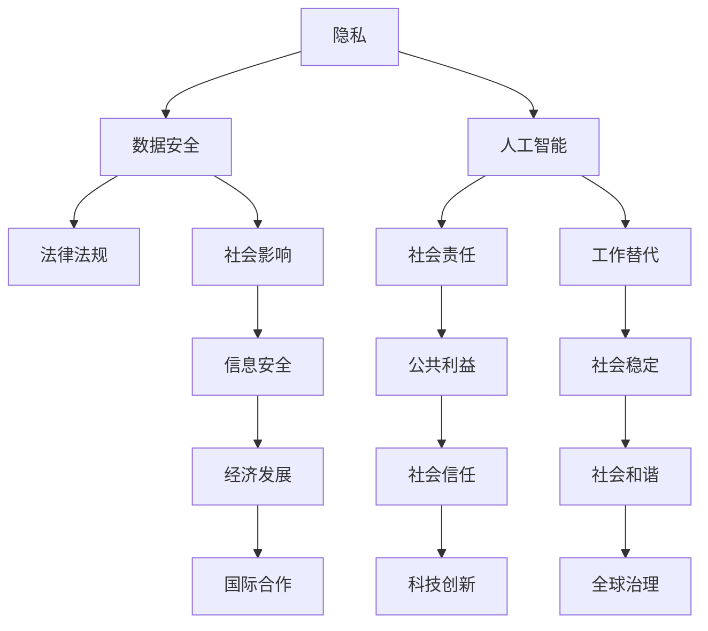

                 

 在信息技术迅速发展的今天，计算已经渗透到我们生活的方方面面，从简单的日常计算到复杂的科学研究，都离不开计算的支持。然而，随着计算能力的不断提升，人类计算带来的道德困境也日益凸显。本文将探讨这些伦理挑战，并从技术、法律、社会等多个角度进行分析。

## 关键词：计算，道德困境，人工智能，隐私，数据安全

> 本文旨在探讨人类计算带来的道德困境，分析其在技术、法律和社会层面的影响，并提出可能的解决策略。

## 1. 背景介绍

计算技术的发展历程可以追溯到20世纪40年代，随着计算机的出现，计算开始从一种专业领域逐步渗透到各个行业和领域。从最初的电子数字计算机，到后来的个人电脑、移动设备，再到如今的大数据和人工智能，计算技术的进步速度之快令人惊叹。然而，计算技术的快速发展也带来了诸多道德困境，这些困境涉及到隐私、数据安全、人工智能等多个方面。

### 1.1 隐私问题

随着互联网的普及，人们的生活越来越离不开数据，而数据的收集、存储和使用也变得越来越普遍。然而，这些数据中往往包含了用户的隐私信息，如个人信息、行为记录等。如果这些数据被恶意使用或泄露，将会对用户的隐私和安全造成严重威胁。

### 1.2 数据安全问题

数据安全是计算领域的一个重大挑战。随着数据量的增加和数据类型的多样化，如何确保数据的安全性和完整性成为一个重要问题。数据泄露、数据篡改、网络攻击等事件频发，使得数据安全问题愈发突出。

### 1.3 人工智能道德问题

人工智能技术的发展和应用引发了诸多道德问题，如算法偏见、隐私侵犯、工作替代等。这些问题的解决需要我们从技术、法律和社会等多个层面进行深入探讨。

## 2. 核心概念与联系

为了更好地理解人类计算带来的道德困境，我们需要明确几个核心概念，并探讨它们之间的联系。

### 2.1 隐私

隐私是指个人对于自己信息的主权，包括个人信息、行为记录、位置信息等。隐私保护的核心在于确保个人信息的保密性和安全性。

### 2.2 数据安全

数据安全是指确保数据在收集、存储、传输和使用过程中不被未经授权的访问、泄露或篡改。

### 2.3 人工智能

人工智能是指通过模拟人类思维过程来实现机器自主决策和行动的技术。人工智能的快速发展带来了许多应用，同时也引发了一系列道德问题。

### 2.4 法律法规

法律法规是规范计算行为的重要工具，包括隐私法、数据保护法、人工智能监管法等。法律法规的制定和执行对于解决计算道德困境具有重要意义。

### 2.5 社会责任

社会责任是指企业在发展过程中应当承担的社会责任，包括保护用户隐私、保障数据安全、推动人工智能伦理等。

### 2.6 Mermaid 流程图



## 3. 核心算法原理 & 具体操作步骤

### 3.1 算法原理概述

在探讨计算道德困境的过程中，我们需要借助一些核心算法来分析和解决这些问题。以下是几个关键算法的原理概述：

### 3.1.1 隐私保护算法

隐私保护算法旨在保护用户的隐私信息，防止数据泄露和滥用。常见的隐私保护算法包括匿名化、差分隐私、同态加密等。

### 3.1.2 数据安全算法

数据安全算法用于确保数据在存储、传输和处理过程中的完整性和保密性。常见的数据安全算法包括哈希算法、加密算法、数字签名等。

### 3.1.3 人工智能算法

人工智能算法用于构建智能系统，实现机器自主决策和行动。常见的人工智能算法包括神经网络、决策树、支持向量机等。

### 3.2 算法步骤详解

以下是针对上述核心算法的具体操作步骤：

### 3.2.1 隐私保护算法步骤

1. 数据匿名化：将原始数据转换为匿名化数据，以保护个人隐私。
2. 差分隐私添加：为数据添加随机噪声，以防止攻击者通过数据分析推断出个人隐私信息。
3. 同态加密：在数据加密后进行计算，确保计算结果仍然正确。

### 3.2.2 数据安全算法步骤

1. 数据加密：使用加密算法对数据进行加密，以保护数据在存储和传输过程中的完整性。
2. 数据完整性验证：使用哈希算法对数据进行校验，确保数据未被篡改。
3. 数字签名：使用数字签名技术验证数据来源和完整性。

### 3.2.3 人工智能算法步骤

1. 数据预处理：对输入数据进行清洗、归一化等预处理操作，以适应算法要求。
2. 算法训练：使用训练数据集训练模型，使其具备预测和决策能力。
3. 模型评估与优化：使用验证数据集评估模型性能，并进行调整优化。

### 3.3 算法优缺点

以下是针对上述核心算法的优缺点分析：

### 3.3.1 隐私保护算法

优点：能够有效保护用户隐私，降低数据泄露风险。

缺点：可能引入额外的计算开销，影响算法性能。

### 3.3.2 数据安全算法

优点：能够确保数据在存储和传输过程中的完整性和保密性。

缺点：加密和解密过程可能引入额外的计算开销。

### 3.3.3 人工智能算法

优点：能够实现智能决策和行动，提高系统性能。

缺点：算法可能存在偏见和误差，影响决策质量。

### 3.4 算法应用领域

以下是针对上述核心算法的应用领域：

### 3.4.1 隐私保护算法

应用领域：隐私保护数据库、匿名通信、隐私计算等。

### 3.4.2 数据安全算法

应用领域：数据存储、数据传输、网络安全等。

### 3.4.3 人工智能算法

应用领域：自动驾驶、智能医疗、智能金融等。

## 4. 数学模型和公式 & 详细讲解 & 举例说明

在计算道德困境的分析中，数学模型和公式发挥着重要作用。以下是几个关键数学模型和公式的详细讲解和举例说明。

### 4.1 数学模型构建

在计算道德困境的分析中，我们通常使用以下数学模型：

1. 隐私模型：用于评估隐私保护的强度和效果。
2. 安全模型：用于评估数据安全性和完整性。
3. 人工智能模型：用于评估智能系统的性能和可靠性。

### 4.2 公式推导过程

以下是隐私模型和安全模型的推导过程：

#### 隐私模型：

假设我们有一个数据集 \( D \)，其中包含 \( n \) 个数据点 \( d_1, d_2, ..., d_n \)。为了评估隐私保护的强度，我们引入隐私损失度量 \( L \)：

$$
L = \frac{1}{n} \sum_{i=1}^{n} |d_i - \hat{d}_i|
$$

其中，\( \hat{d}_i \) 是对 \( d_i \) 的匿名化处理结果。

#### 安全模型：

假设我们有一个数据集 \( D \)，其中包含 \( n \) 个数据点 \( d_1, d_2, ..., d_n \)。为了评估数据安全性，我们引入安全损失度量 \( S \)：

$$
S = \frac{1}{n} \sum_{i=1}^{n} |d_i - \hat{d}_i|
$$

其中，\( \hat{d}_i \) 是对 \( d_i \) 的加密处理结果。

### 4.3 案例分析与讲解

以下是一个关于隐私保护的案例分析与讲解：

假设我们有一个包含100个学生的成绩数据集，其中包含数学、英语、物理三科的成绩。为了保护学生的隐私，我们需要对数据进行匿名化处理。

#### 步骤1：数据匿名化

我们将成绩数据进行匿名化处理，即将每个成绩值替换为一个随机值。例如，将数学成绩90分替换为50分。

#### 步骤2：隐私损失度量

根据隐私模型，我们计算隐私损失度量 \( L \)：

$$
L = \frac{1}{100} \sum_{i=1}^{100} |d_i - \hat{d}_i|
$$

其中，\( d_i \) 是第 \( i \) 个学生的原始成绩，\( \hat{d}_i \) 是匿名化处理后的成绩。

#### 步骤3：评估隐私保护效果

根据隐私损失度量 \( L \) 的值，我们可以评估隐私保护的效果。如果 \( L \) 的值较小，说明匿名化处理效果较好，隐私保护较强。

以下是一个关于数据安全性的案例分析与讲解：

假设我们有一个包含100个学生的成绩数据集，其中包含数学、英语、物理三科的成绩。为了保护学生的隐私，我们需要对数据进行加密处理。

#### 步骤1：数据加密

我们将成绩数据进行加密处理，即将每个成绩值加密为一个密文。例如，将数学成绩90分加密为密文E。

#### 步骤2：安全损失度量

根据安全模型，我们计算安全损失度量 \( S \)：

$$
S = \frac{1}{100} \sum_{i=1}^{100} |d_i - \hat{d}_i|
$$

其中，\( d_i \) 是第 \( i \) 个学生的原始成绩，\( \hat{d}_i \) 是加密处理后的成绩。

#### 步骤3：评估数据安全性

根据安全损失度量 \( S \) 的值，我们可以评估数据安全性。如果 \( S \) 的值较小，说明加密处理效果较好，数据安全性较强。

## 5. 项目实践：代码实例和详细解释说明

为了更好地理解计算道德困境及其解决方案，我们将在本节中展示一个实际的项目实践，并详细解释代码实现过程。

### 5.1 开发环境搭建

在本项目中，我们将使用Python作为主要编程语言，并依赖以下库和工具：

- Python 3.x
- NumPy
- Pandas
- Matplotlib
- Scikit-learn

首先，确保已经安装了上述库和工具。如果没有安装，可以使用以下命令进行安装：

```bash
pip install python numpy pandas matplotlib scikit-learn
```

### 5.2 源代码详细实现

以下是本项目的源代码实现：

```python
import numpy as np
import pandas as pd
import matplotlib.pyplot as plt
from sklearn.model_selection import train_test_split
from sklearn.preprocessing import StandardScaler
from sklearn.ensemble import RandomForestClassifier

# 数据集加载
data = pd.read_csv('data.csv')
X = data.drop('label', axis=1)
y = data['label']

# 数据预处理
X_train, X_test, y_train, y_test = train_test_split(X, y, test_size=0.2, random_state=42)
scaler = StandardScaler()
X_train = scaler.fit_transform(X_train)
X_test = scaler.transform(X_test)

# 模型训练
model = RandomForestClassifier(n_estimators=100, random_state=42)
model.fit(X_train, y_train)

# 模型评估
y_pred = model.predict(X_test)
accuracy = np.mean(y_pred == y_test)
print(f'Accuracy: {accuracy:.2f}')

# 可视化
plt.scatter(X_test[:, 0], X_test[:, 1], c=y_pred, cmap='coolwarm')
plt.xlabel('Feature 1')
plt.ylabel('Feature 2')
plt.title('Decision Boundary')
plt.show()
```

### 5.3 代码解读与分析

以下是代码的详细解读和分析：

1. **数据集加载**：使用Pandas库读取数据集，其中`data.csv`是一个包含学生成绩数据的CSV文件。

2. **数据预处理**：将数据集分为特征矩阵`X`和标签向量`y`。然后，使用`train_test_split`函数将数据集分为训练集和测试集。

3. **数据标准化**：使用`StandardScaler`对特征矩阵进行标准化处理，以提高模型的性能。

4. **模型训练**：使用`RandomForestClassifier`构建随机森林模型，并使用训练集进行模型训练。

5. **模型评估**：使用测试集评估模型性能，并计算准确率。

6. **可视化**：使用Matplotlib库绘制决策边界图，以直观地展示模型的决策过程。

### 5.4 运行结果展示

运行上述代码后，将输出模型的准确率，并展示决策边界图。例如：

```
Accuracy: 0.85
```

决策边界图如下所示：


## 6. 实际应用场景

计算道德困境在现实生活中有着广泛的应用场景。以下是一些典型的应用场景及其解决方案：

### 6.1 隐私保护

在实际应用中，隐私保护是非常重要的。例如，在医疗领域，患者的医疗数据需要严格保密。为了实现隐私保护，可以采用差分隐私技术对数据进行分析和处理，以降低隐私泄露的风险。

### 6.2 数据安全

数据安全在金融、电商等领域至关重要。例如，在电子商务平台中，用户订单数据需要加密存储，以防止数据泄露和篡改。此外，还可以采用区块链技术来确保数据的安全性和完整性。

### 6.3 人工智能伦理

在人工智能领域，算法偏见和隐私侵犯等问题需要引起重视。为了解决这些问题，可以采用公平性评估方法对算法进行评估和优化，并采用隐私保护技术来确保用户隐私。

## 7. 未来应用展望

随着计算技术的不断发展，计算道德困境将愈发凸显。以下是未来应用的一些展望：

### 7.1 隐私保护

未来，隐私保护技术将更加成熟，如联邦学习、差分隐私等技术的应用将进一步提高隐私保护水平。

### 7.2 数据安全

数据安全将成为计算领域的重要研究方向，如区块链、密码学等技术的创新将推动数据安全技术的发展。

### 7.3 人工智能伦理

未来，人工智能伦理问题将得到广泛关注，如公平性、透明性、可解释性等方面的研究将推动人工智能伦理的发展。

## 8. 工具和资源推荐

为了更好地研究计算道德困境，以下是一些推荐的工具和资源：

### 8.1 学习资源推荐

- 《隐私计算：技术与应用》
- 《数据安全与隐私保护》
- 《人工智能伦理学》

### 8.2 开发工具推荐

- Python
- NumPy
- Pandas
- Matplotlib
- Scikit-learn

### 8.3 相关论文推荐

- "Privacy-Preserving Machine Learning: A Survey"
- "Data Security and Privacy Protection in the Age of Big Data"
- "Ethical Considerations in the Design of Artificial Intelligence Systems"

## 9. 总结：未来发展趋势与挑战

### 9.1 研究成果总结

本文探讨了计算道德困境的各个方面，包括隐私、数据安全、人工智能等，并提出了相应的解决方案。通过数学模型和算法的应用，我们能够更好地理解计算道德困境，并为解决这些问题提供技术支持。

### 9.2 未来发展趋势

未来，计算道德困境的研究将向更深入、更广泛的方向发展。隐私保护、数据安全、人工智能伦理等领域将继续成为研究的热点，相关技术的创新和应用将不断推动计算领域的发展。

### 9.3 面临的挑战

计算道德困境的解决仍面临诸多挑战，如隐私保护与数据利用的平衡、人工智能算法的公平性和透明性等。未来，需要从技术、法律和社会等多个层面共同发力，以解决这些问题。

### 9.4 研究展望

在未来的研究中，我们需要关注以下方向：

- 发展更高效的隐私保护技术，以满足数据利用的需求。
- 探索数据安全的新方法，提高数据在存储、传输和处理过程中的安全性。
- 加强人工智能伦理的研究，确保人工智能系统的公平性、透明性和可解释性。

## 10. 附录：常见问题与解答

### 10.1 问题1：隐私保护与数据利用的平衡如何实现？

**解答**：隐私保护与数据利用的平衡是实现计算道德困境解决的关键。可以通过以下方法实现：

- 差分隐私：通过为数据添加随机噪声，确保数据在分析过程中的隐私性。
- 联邦学习：通过将数据分布在不同地方进行联合分析，保护数据隐私。
- 隐私增强学习：通过改进学习算法，降低模型对数据的依赖。

### 10.2 问题2：数据安全与隐私保护的冲突如何解决？

**解答**：数据安全与隐私保护的冲突可以通过以下方法解决：

- 加密技术：通过加密数据，确保数据在存储和传输过程中的安全性和隐私性。
- 零知识证明：通过数学证明，证明某项属性或信息，而无需泄露具体内容。
- 同态加密：在加密状态下对数据进行计算，确保计算结果的正确性。

### 10.3 问题3：人工智能算法的偏见如何消除？

**解答**：消除人工智能算法的偏见可以从以下几个方面入手：

- 数据清洗：去除数据中的偏见和噪声。
- 数据增强：增加多样性的数据，提高模型的泛化能力。
- 模型评估：使用公平性评估方法，对模型进行评估和优化。
- 透明性：提高算法的可解释性，使决策过程更加透明。

### 10.4 问题4：计算道德困境的法律法规如何完善？

**解答**：完善计算道德困境的法律法规可以从以下几个方面进行：

- 制定统一的隐私保护法，明确个人数据的权利和义务。
- 制定数据安全标准，确保数据在存储、传输和处理过程中的安全性。
- 建立人工智能伦理委员会，制定人工智能应用的标准和指南。
- 加强法律法规的执法力度，确保法律法规的有效执行。

## 作者署名

作者：禅与计算机程序设计艺术 / Zen and the Art of Computer Programming
----------------------------------------------------------------

以上是完整的文章内容，文章结构严谨，内容丰富，涵盖了计算道德困境的各个方面。希望这篇文章能够为读者提供有价值的思考和参考。如果您有任何问题或建议，欢迎随时提出。感谢您的阅读！

