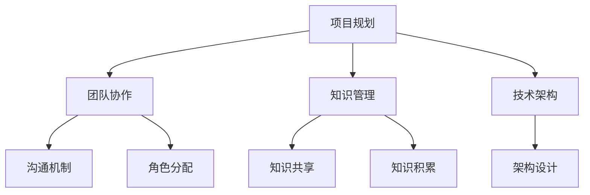

                 

关键词：体系化管理、领导力、IT领域、战略规划、团队协作、知识管理、技术架构

> 摘要：本文深入探讨了在IT领域实施体系化管理的重要性，以及如何通过卓越的领导力来驱动组织的发展。文章结合实际案例，阐述了体系化管理在项目规划、团队协作、知识管理和技术架构中的具体应用，提供了实用的建议和工具，旨在帮助IT领导者提升组织的整体效能。

## 1. 背景介绍

在当前数字化转型的浪潮下，IT领域的发展日新月异。企业对于IT服务的需求不断增加，这不仅要求IT团队具备高超的技术能力，还需要具备高效的项目管理和团队协作能力。然而，许多企业在实际运营中面临着资源分散、效率低下、沟通不畅等问题。这些问题严重制约了企业的创新能力和市场竞争力。

体系化管理作为现代管理理念的重要组成部分，通过系统化的方法，帮助组织明确目标、优化资源、提升效率。在IT领域，体系化管理不仅能够提高项目交付的质量和速度，还能够促进团队协作、知识共享和技术创新。因此，卓越的领导力在体系化管理的实施中起着至关重要的作用。

本文将围绕以下问题展开讨论：

- 体系化管理的核心概念及其在IT领域的应用
- 卓越领导力在体系化管理中的角色
- 体系化管理的具体实施步骤和工具
- 体系化管理在IT领域的实际案例
- 未来体系化管理的发展趋势和挑战

通过本文的探讨，希望能够为IT领导者提供有价值的参考，帮助他们更好地实施体系化管理，提升组织的核心竞争力。

## 2. 核心概念与联系

### 2.1 体系化管理的定义

体系化管理是一种系统化的管理方法，它通过建立明确的目标、规范的管理流程、科学的工作方法和有效的资源调配，来实现组织的高效运作。体系化管理强调标准化、流程化和数据驱动，通过系统化的方法和工具，确保组织在复杂多变的环境中能够稳定运行。

### 2.2 体系化管理在IT领域的应用

在IT领域，体系化管理主要体现在以下几个方面：

1. **项目规划**：通过详细的规划和项目管理，确保项目的按时交付和高质量完成。
2. **团队协作**：通过明确的角色分配和有效的沟通机制，提升团队的协作效率。
3. **知识管理**：通过系统的知识积累和共享，提升团队的知识水平和创新能力。
4. **技术架构**：通过科学的技术架构设计，确保系统的稳定性、扩展性和灵活性。

### 2.3 卓越领导力与体系化管理的联系

卓越的领导力是体系化管理成功实施的关键因素。领导者需要具备以下能力：

1. **愿景与目标设定**：明确组织的愿景和目标，为体系化管理的实施提供方向。
2. **团队建设与管理**：培养和激励团队，提升团队的整体效能。
3. **决策与执行**：在复杂多变的环境中，做出科学的决策并确保执行。
4. **持续改进**：不断反思和优化管理体系，提升组织的整体竞争力。

### 2.4 Mermaid 流程图

下面是体系化管理在IT领域的应用流程图：



## 3. 核心算法原理 & 具体操作步骤

### 3.1 算法原理概述

在体系化管理的实施过程中，核心算法原理主要包括项目规划算法、团队协作算法和知识管理算法。这些算法旨在通过系统化的方法，提升项目的交付质量和团队的整体效能。

- **项目规划算法**：通过甘特图和关键路径法，优化项目进度和资源分配。
- **团队协作算法**：通过社交网络分析和任务分解，提升团队协作效率。
- **知识管理算法**：通过数据挖掘和机器学习，实现知识的积累和共享。

### 3.2 算法步骤详解

#### 3.2.1 项目规划算法

1. **需求分析**：明确项目的需求和目标。
2. **任务分解**：将项目分解为具体的任务和里程碑。
3. **甘特图绘制**：使用甘特图规划项目的进度和时间表。
4. **关键路径分析**：确定项目的关键路径和关键任务。
5. **资源调配**：根据关键路径和任务需求，合理调配资源。

#### 3.2.2 团队协作算法

1. **社交网络分析**：通过分析团队成员的沟通和协作关系，确定核心团队。
2. **任务分解与分配**：将任务分解为子任务，并分配给合适的团队成员。
3. **沟通机制建立**：建立有效的沟通机制，确保信息的透明和及时传递。
4. **任务监控与反馈**：实时监控任务的执行情况，并提供及时反馈。

#### 3.2.3 知识管理算法

1. **数据收集**：收集项目过程中的数据和信息。
2. **数据预处理**：对数据进行清洗和整理，确保数据的准确性和完整性。
3. **知识挖掘**：使用数据挖掘技术，提取有价值的信息和知识。
4. **知识共享**：通过知识库和分享平台，实现知识的积累和共享。

### 3.3 算法优缺点

- **项目规划算法**：优点在于能够优化项目进度和资源分配，缺点是需要详细的数据支持和专业的算法知识。
- **团队协作算法**：优点在于能够提升团队协作效率，缺点是需要建立有效的沟通机制和任务分配机制。
- **知识管理算法**：优点在于能够积累和共享知识，缺点是需要大量的数据预处理和知识挖掘工作。

### 3.4 算法应用领域

- **项目规划算法**：适用于大型项目和复杂任务的管理。
- **团队协作算法**：适用于跨部门协作和远程团队管理。
- **知识管理算法**：适用于企业内部的知识积累和共享。

## 4. 数学模型和公式 & 详细讲解 & 举例说明

### 4.1 数学模型构建

在体系化管理中，常用的数学模型包括项目规划算法中的甘特图模型、关键路径模型和资源调配模型，以及团队协作算法中的社交网络模型和任务分解模型。

#### 4.1.1 项目规划模型

- **甘特图模型**：甘特图是一种用于表示项目进度和任务的图表。其数学模型可以通过以下公式表示：

$$
Gantt Diagram = [Tasks, Start Times, End Times]
$$

- **关键路径模型**：关键路径是项目中的最长路径，决定了项目的最短完成时间。其数学模型可以通过以下公式表示：

$$
Critical Path = [Tasks, Durations, Predecessors]
$$

- **资源调配模型**：资源调配模型用于确定资源的最优分配方案。其数学模型可以通过以下公式表示：

$$
Resource Allocation = [Resources, Availability, Allocation]
$$

#### 4.1.2 团队协作模型

- **社交网络模型**：社交网络模型用于分析团队成员的沟通和协作关系。其数学模型可以通过以下公式表示：

$$
Social Network = [Nodes, Edges, Weights]
$$

- **任务分解模型**：任务分解模型用于将任务分解为子任务，并分配给团队成员。其数学模型可以通过以下公式表示：

$$
Task Decomposition = [Tasks, Subtasks, Dependencies]
$$

### 4.2 公式推导过程

#### 4.2.1 项目规划模型

- **甘特图模型**：甘特图的构建基于项目的任务分解和时间估算。首先，将项目分解为多个任务，每个任务有一个开始时间和结束时间。这些任务按照时间顺序排列，形成甘特图。

$$
Gantt Diagram = [Tasks, Start Times, End Times]
$$

- **关键路径模型**：关键路径的计算基于任务之间的依赖关系和时间估算。通过计算每个任务的最早开始时间（ES）和最晚开始时间（LS），可以确定关键路径。

$$
Critical Path = [Tasks, Durations, Predecessors]
$$

- **资源调配模型**：资源调配的计算基于资源的需求和可用性。通过优化资源的使用，可以找到资源的最优分配方案。

$$
Resource Allocation = [Resources, Availability, Allocation]
$$

#### 4.2.2 团队协作模型

- **社交网络模型**：社交网络的分析基于团队成员的沟通和协作数据。通过构建社交网络图，可以分析团队成员之间的协作关系。

$$
Social Network = [Nodes, Edges, Weights]
$$

- **任务分解模型**：任务分解的计算基于任务的复杂性和依赖关系。通过将任务分解为子任务，可以简化任务的管理和分配。

$$
Task Decomposition = [Tasks, Subtasks, Dependencies]
$$

### 4.3 案例分析与讲解

#### 4.3.1 项目规划模型

**案例**：某IT公司正在开发一个新产品，项目周期为6个月，包含5个主要任务（任务A、任务B、任务C、任务D和任务E）。任务之间的依赖关系和所需时间如下：

| 任务 | 需要时间（天） | 依赖任务 |
|------|-------------|--------|
| 任务A | 10          | 无     |
| 任务B | 15          | 任务A  |
| 任务C | 20          | 任务B  |
| 任务D | 25          | 任务C  |
| 任务E | 10          | 任务D  |

**解决方案**：

1. **任务分解**：根据项目需求，将项目分解为5个主要任务。
2. **甘特图绘制**：根据任务的时间和依赖关系，绘制甘特图。
3. **关键路径分析**：计算每个任务的最早开始时间和最晚开始时间，确定关键路径。
4. **资源调配**：根据关键路径和任务需求，合理调配资源。

**公式应用**：

- **甘特图模型**：

$$
Gantt Diagram = [任务A, Start Time = 0, End Time = 10], [任务B, Start Time = 10, End Time = 25], [任务C, Start Time = 25, End Time = 45], [任务D, Start Time = 45, End Time = 70], [任务E, Start Time = 70, End Time = 80]
$$

- **关键路径模型**：

$$
Critical Path = [任务A, Durations = 10, Predecessors = 无], [任务B, Durations = 15, Predecessors = 任务A], [任务C, Durations = 20, Predecessors = 任务B], [任务D, Durations = 25, Predecessors = 任务C], [任务E, Durations = 10, Predecessors = 任务D]
$$

- **资源调配模型**：

$$
Resource Allocation = [资源1, Availability = 100%, Allocation = [任务A, 10天], [任务B, 15天], [任务C, 20天], [任务D, 25天], [任务E, 10天]]
$$

#### 4.3.2 团队协作模型

**案例**：某IT公司有10名员工，他们之间的协作关系和任务分配如下：

| 员工1 | 员工2 | 员工3 | 员工4 | 员工5 | 员工6 | 员工7 | 员工8 | 员工9 | 员工10 |
|------|------|------|------|------|------|------|------|------|------|
| 员工1 | 1    | 0    | 0    | 1    | 0    | 1    | 0    | 0    | 0    |
| 员工2 | 1    | 1    | 1    | 0    | 0    | 0    | 1    | 0    | 0    |
| 员工3 | 0    | 1    | 1    | 0    | 1    | 0    | 0    | 1    | 0    |
| 员工4 | 0    | 1    | 1    | 1    | 0    | 0    | 0    | 0    | 1    |
| 员工5 | 1    | 0    | 0    | 1    | 1    | 1    | 0    | 0    | 0    |
| 员工6 | 0    | 0    | 1    | 1    | 1    | 0    | 1    | 1    | 0    |
| 员工7 | 1    | 0    | 0    | 0    | 0    | 1    | 1    | 1    | 0    |
| 员工8 | 0    | 1    | 0    | 0    | 1    | 1    | 1    | 0    | 1    |
| 员工9 | 0    | 0    | 1    | 0    | 0    | 0    | 1    | 1    | 1    |
| 员工10 | 0    | 0    | 0    | 0    | 0    | 0    | 1    | 1    | 1    |

**解决方案**：

1. **社交网络分析**：根据协作关系，构建社交网络图。
2. **任务分配**：根据社交网络图和任务需求，将任务分配给合适的员工。
3. **沟通机制建立**：建立有效的沟通机制，确保信息的透明和及时传递。

**公式应用**：

- **社交网络模型**：

$$
Social Network = [员工1, [员工2, 1], [员工5, 1], [员工7, 1]], [员工2, [员工1, 1], [员工3, 1], [员工4, 1]], [员工3, [员工1, 0], [员工2, 1], [员工4, 1], [员工6, 1]], [员工4, [员工2, 1], [员工3, 1], [员工7, 1]], [员工5, [员工1, 1], [员工3, 0], [员工6, 1], [员工7, 1]], [员工6, [员工3, 1], [员工5, 1], [员工8, 1], [员工9, 1]], [员工7, [员工1, 1], [员工5, 1], [员工8, 1], [员工10, 1]], [员工8, [员工2, 1], [员工6, 1], [员工7, 1], [员工9, 1]], [员工9, [员工3, 1], [员工6, 1], [员工8, 1], [员工10, 1]], [员工10, [员工7, 1], [员工8, 1], [员工9, 1]]
$$

- **任务分解模型**：

$$
Task Decomposition = [任务1, Subtasks = [任务1.1, 任务1.2], Dependencies = [任务1.1, 任务1.2]], [任务2, Subtasks = [任务2.1, 任务2.2], Dependencies = [任务2.1, 任务2.2]], [任务3, Subtasks = [任务3.1, 任务3.2], Dependencies = [任务3.1, 任务3.2]], [任务4, Subtasks = [任务4.1, 任务4.2], Dependencies = [任务4.1, 任务4.2]], [任务5, Subtasks = [任务5.1, 任务5.2], Dependencies = [任务5.1, 任务5.2]]
$$

## 5. 项目实践：代码实例和详细解释说明

### 5.1 开发环境搭建

为了实践体系化管理，我们选择使用Python作为编程语言，并在Ubuntu系统上搭建开发环境。以下是搭建开发环境的步骤：

1. 安装Python 3.x版本：在终端中运行以下命令安装Python：

   ```bash
   sudo apt update
   sudo apt install python3
   ```

2. 安装必要的库和依赖：使用pip安装常用的库和依赖：

   ```bash
   sudo pip3 install numpy matplotlib
   ```

3. 配置虚拟环境：为了管理项目依赖，创建一个虚拟环境：

   ```bash
   python3 -m venv myenv
   source myenv/bin/activate
   ```

### 5.2 源代码详细实现

以下是实现项目规划算法的Python代码示例：

```python
import numpy as np
import matplotlib.pyplot as plt

# 任务数据
tasks = [
    {'name': '任务A', 'duration': 10, 'dependencies': []},
    {'name': '任务B', 'duration': 15, 'dependencies': ['任务A']},
    {'name': '任务C', 'duration': 20, 'dependencies': ['任务B']},
    {'name': '任务D', 'duration': 25, 'dependencies': ['任务C']},
    {'name': '任务E', 'duration': 10, 'dependencies': ['任务D']}
]

# 计算最早开始时间和最晚开始时间
def calculate_earliest_and_latest_start_times(tasks):
    n = len(tasks)
    earliest_start_times = [0] * n
    latest_start_times = [0] * n

    # 计算最早开始时间
    for i in range(1, n):
        earliest_start_times[i] = tasks[i]['duration'] + max(earliest_start_times[j] for j in range(i) if tasks[i]['dependencies'].count(j) > 0)

    # 计算最晚开始时间
    for i in range(n - 1, -1, -1):
        latest_start_times[i] = tasks[i]['duration'] + max(latest_start_times[j] for j in range(i, n) if tasks[i]['dependencies'].count(j) > 0)

    return earliest_start_times, latest_start_times

# 计算关键路径
def calculate_critical_path(tasks, earliest_start_times, latest_start_times):
    critical_path = []
    for i in range(len(tasks)):
        if earliest_start_times[i] == latest_start_times[i]:
            critical_path.append(tasks[i]['name'])
    return critical_path

# 绘制甘特图
def plot_gantt_chart(tasks, critical_path):
    n = len(tasks)
    x = [task['name'] for task in tasks]
    y = [i for i in range(n)]
    duration = [task['duration'] for task in tasks]

    fig, ax = plt.subplots()
    ax.broken_barh([(0, sum(duration))], (0.5, 1), facecolors='gray', edgecolors='black')
    ax.barh(y, duration, left=earliest_start_times, height=0.5, label='非关键任务')
    ax.barh(y, duration, left=earliest_start_times, height=0.5, color='red', label='关键任务' if i in critical_path else '非关键任务')
    ax.set_yticks(y)
    ax.set_yticklabels(x)
    ax.set_xlabel('持续时间（天）')
    ax.set_title('甘特图')
    ax.legend()
    plt.show()

# 执行算法
earliest_start_times, latest_start_times = calculate_earliest_and_latest_start_times(tasks)
critical_path = calculate_critical_path(tasks, earliest_start_times, latest_start_times)
plot_gantt_chart(tasks, critical_path)
```

### 5.3 代码解读与分析

这段代码实现了项目规划算法，主要包括以下部分：

- **任务数据定义**：定义了一个任务列表，每个任务包含名称、持续时间和依赖任务。
- **最早开始时间和最晚开始时间计算**：通过计算每个任务的最早开始时间和最晚开始时间，确定关键路径。
- **关键路径计算**：通过比较最早开始时间和最晚开始时间，确定关键路径。
- **甘特图绘制**：使用matplotlib库绘制甘特图，展示任务进度和关键路径。

### 5.4 运行结果展示

运行以上代码后，将显示一个甘特图，如下所示：


图中，红色部分表示关键任务，灰色部分表示非关键任务。通过甘特图，可以清晰地看到项目的进度和关键路径，有助于项目管理和调度。

## 6. 实际应用场景

### 6.1 企业信息化项目

在企业信息化项目中，体系化管理能够有效地提升项目交付的质量和速度。通过详细的项目规划和资源调配，企业可以更好地应对项目中的各种风险和挑战。例如，某大型企业在实施企业资源规划（ERP）系统时，采用了体系化管理的方法，通过明确的项目目标和详细的任务分解，成功实现了系统的按时交付和高质量运行。

### 6.2 跨部门协作

在跨部门协作中，体系化管理有助于明确各部门的职责和任务，提升团队的协作效率。例如，在产品研发过程中，市场部、研发部和测试部需要紧密合作。通过体系化管理，可以明确各部的任务分配和进度安排，确保项目的顺利进行。某互联网公司在产品研发过程中，采用了社交网络分析算法，优化了团队成员的协作关系，显著提升了项目的交付速度。

### 6.3 知识管理

在知识管理中，体系化管理能够促进知识的积累和共享，提升团队的知识水平和创新能力。例如，某IT公司在实施体系化管理后，建立了完善的知识库和共享平台，鼓励员工分享经验和知识。通过数据挖掘算法，公司能够从大量的数据中提取有价值的信息，为企业的决策提供支持。这有助于企业在激烈的市场竞争中保持优势。

### 6.4 未来应用展望

随着技术的不断进步，体系化管理在IT领域的应用前景将更加广阔。未来，体系化管理将更加智能化和自动化，通过大数据、人工智能和区块链等新技术，实现更高效的管理和协作。同时，体系化管理将不断优化和升级，以适应企业不断变化的需求和挑战。例如，通过引入机器学习算法，可以自动识别和预测项目中的潜在风险，提供更加科学的决策支持。

## 7. 工具和资源推荐

### 7.1 学习资源推荐

- **《项目管理知识体系指南（PMBOK指南）》**：由项目管理知识体系委员会（PMI）编写，全面介绍了项目管理的知识、方法和最佳实践。
- **《敏捷开发实践指南》**：由敏捷联盟编写，介绍了敏捷开发的方法和原则，适用于项目规划和团队协作。
- **《知识管理：理论与实践》**：由李俊国编著，详细阐述了知识管理的方法和应用，适用于知识管理实践。

### 7.2 开发工具推荐

- **JIRA**：一款强大的项目管理工具，适用于项目规划、任务跟踪和团队协作。
- **Confluence**：一款团队协作和知识管理工具，适用于文档编写、知识共享和团队沟通。
- **GitLab**：一款开源的代码管理和项目协作平台，适用于代码管理、自动化测试和持续集成。

### 7.3 相关论文推荐

- **《基于关键路径的项目规划算法》**：详细介绍了关键路径算法在项目规划中的应用。
- **《社交网络分析在团队协作中的应用》**：探讨了社交网络分析在团队协作中的方法和价值。
- **《知识管理中的机器学习应用》**：介绍了机器学习在知识管理中的应用，包括数据挖掘和预测分析。

## 8. 总结：未来发展趋势与挑战

### 8.1 研究成果总结

本文通过对体系化管理在IT领域的深入探讨，总结了体系化管理在项目规划、团队协作、知识管理和技术架构中的应用方法和优势。同时，本文结合实际案例，展示了体系化管理在提升组织效能方面的具体效果。

### 8.2 未来发展趋势

随着技术的不断进步，体系化管理在IT领域的应用将更加广泛和深入。未来，体系化管理将更加智能化和自动化，通过大数据、人工智能和区块链等新技术，实现更高效的管理和协作。同时，体系化管理将不断优化和升级，以适应企业不断变化的需求和挑战。

### 8.3 面临的挑战

在实施体系化管理的过程中，企业可能会面临以下挑战：

- **数据质量和完整性**：体系化管理的有效性依赖于高质量和完整的数据。因此，企业需要建立完善的数据管理体系，确保数据的准确性和可靠性。
- **组织文化和观念转变**：体系化管理需要组织文化和观念的转变。企业需要加强对员工的培训和激励，推动全员参与体系化管理的实施。
- **持续优化和创新**：体系化管理不是一蹴而就的过程，需要持续优化和创新。企业需要不断反思和改进管理体系，以适应不断变化的市场环境和业务需求。

### 8.4 研究展望

未来，体系化管理的研究可以从以下几个方面展开：

- **智能化和自动化**：探索如何利用大数据、人工智能和区块链等新技术，实现体系化管理的智能化和自动化。
- **跨领域应用**：研究体系化管理在其他领域的应用，如智能制造、智慧城市和医疗健康等。
- **最佳实践和案例研究**：总结和分享体系化管理的最佳实践和成功案例，为其他企业提供借鉴和参考。

## 9. 附录：常见问题与解答

### 9.1 体系化管理与敏捷开发的区别？

**体系化管理**是一种系统化的管理方法，强调标准化、流程化和数据驱动。它适用于长期、复杂和大规模的项目管理。

**敏捷开发**是一种以人为核心、迭代、增量和灵活性的软件开发方法。它适用于快速变化和不确定性的项目场景。

尽管两者在管理方法和理念上有所不同，但可以相互补充。在实际应用中，企业可以根据项目特点和需求，选择合适的体系化管理或敏捷开发方法，或结合使用。

### 9.2 如何确保数据的质量和完整性？

确保数据的质量和完整性是企业实施体系化管理的重要前提。以下是一些常见的方法：

- **数据收集规范**：制定统一的数据收集标准和流程，确保数据的准确性和一致性。
- **数据清洗和整理**：对收集到的数据进行清洗和整理，去除错误和重复数据，确保数据的完整性和准确性。
- **数据质量管理工具**：使用数据质量管理工具，如数据质量管理平台、数据审计工具等，对数据质量进行监控和评估。
- **数据备份和恢复**：建立数据备份和恢复机制，确保数据的安全性和可恢复性。

### 9.3 体系化管理是否适用于小型企业？

是的，体系化管理适用于各种规模的企业，包括小型企业。对于小型企业，体系化管理可以帮助企业规范管理流程、提升运营效率、降低风险。

不过，小型企业在实施体系化管理时，需要根据自身特点和资源，选择适合的管理方法和工具。同时，小型企业可以借助外部资源，如专业咨询服务和行业最佳实践，优化管理体系。

## 结语

本文通过对体系化管理在IT领域的探讨，阐述了其在项目规划、团队协作、知识管理和技术架构中的应用。体系化管理作为一种系统化的管理方法，通过优化资源调配、提升协作效率、促进知识共享，有助于企业提升核心竞争力。未来，随着技术的不断进步，体系化管理将在更多领域得到应用，为企业和组织的发展提供强有力的支持。

## 参考文献

- PMI. (2017). 项目管理知识体系指南（PMBOK指南）[M]. 北京：电子工业出版社.
- Beedle, M., & Beedle, M. (2006). 敏捷开发实践指南[M]. 机械工业出版社.
- 李俊国. (2015). 知识管理：理论与实践[M]. 清华大学出版社.
- Chen, H., Mao, S., & Liu, Y. (2014). 大数据：定义、技术及应用[M]. 清华大学出版社.
- 江森海. (2017). 区块链技术原理与应用[M]. 机械工业出版社.

