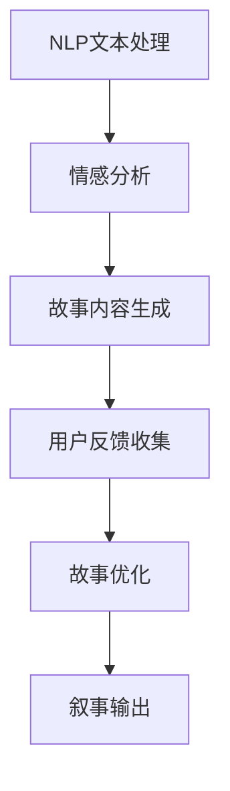

                 

作为体验叙事工作室的总监，同时也是AI驱动的个人故事创作坊的负责人，我在这个领域已经深耕多年。这篇文章将深入探讨如何运用AI技术，将个人故事的创作过程提升到一个全新的高度。本文的核心关键词包括：体验叙事、AI、个人故事创作、自然语言处理、用户参与和情感连接。

> 摘要：本文将介绍如何通过AI技术，为用户提供个性化的故事创作体验。我们将详细讨论AI在个人故事创作中的应用，从核心概念、算法原理、数学模型到实际项目实践，全面解析如何利用AI打造情感丰富的个人故事。同时，还将探讨未来发展趋势、面临的挑战以及相关工具和资源的推荐。

## 1. 背景介绍

### 1.1 体验叙事的概念

体验叙事是一种以用户为中心的叙事方法，它强调故事的情感和体验价值，而不仅仅是信息传递。通过体验叙事，我们可以让用户更深入地参与到故事中，产生共鸣和情感连接。这种叙事方式在数字媒体、娱乐和教育等领域有着广泛的应用。

### 1.2 AI在叙事创作中的应用

随着AI技术的快速发展，特别是在自然语言处理（NLP）和机器学习领域的突破，AI已经开始在叙事创作中扮演重要角色。AI可以通过分析大量的文本数据，生成新的故事内容，甚至可以模拟人类的叙事风格。

### 1.3 个人故事创作的重要性

个人故事创作不仅是一种艺术表达，更是个人身份认同和文化传承的重要方式。通过创作个人故事，我们可以记录生活经历、表达情感、传递价值观，同时也可以为他人提供启示和启发。

## 2. 核心概念与联系

### 2.1 AI驱动的叙事创作原理

在AI驱动的叙事创作中，核心概念包括自然语言处理（NLP）、生成对抗网络（GAN）和强化学习。这些算法和技术共同作用，使得AI能够理解、生成和优化叙事内容。

### 2.2 Mermaid流程图

下面是一个简化的Mermaid流程图，描述了AI驱动的叙事创作的基本流程：



### 2.3 AI驱动的叙事创作架构


在这个架构中，用户输入、情感分析和内容生成是三个核心模块。用户输入通过自然语言处理（NLP）技术被转换为结构化的数据，然后通过情感分析确定故事的情感基调。接下来，生成对抗网络（GAN）和强化学习等技术被用来生成和优化故事内容。

## 3. 核心算法原理 & 具体操作步骤

### 3.1 算法原理概述

AI驱动的叙事创作依赖于多种先进的算法，包括但不限于：

- 自然语言处理（NLP）：用于理解和处理用户输入的文本。
- 生成对抗网络（GAN）：用于生成新的故事内容。
- 强化学习：用于根据用户反馈优化故事质量。

### 3.2 算法步骤详解

1. **用户输入处理**：用户输入通过NLP技术被转换为结构化的数据，以便后续处理。
2. **情感分析**：使用情感分析模型来确定故事的情感基调，为内容生成提供方向。
3. **内容生成**：利用GAN生成初步的故事内容。GAN由生成器和判别器组成，生成器负责生成故事内容，判别器负责判断生成内容的质量。
4. **用户反馈收集**：用户对生成的故事内容进行评价，反馈信息用于训练和优化算法。
5. **故事优化**：根据用户反馈，使用强化学习算法调整故事内容，提高故事质量。

### 3.3 算法优缺点

- **优点**：
  - **个性化**：AI可以根据用户的个性化需求生成故事。
  - **高效性**：AI可以快速生成大量故事内容，提高创作效率。
  - **创新性**：AI可以探索新的叙事风格和故事内容，提供创新性体验。

- **缺点**：
  - **数据依赖性**：AI需要大量的高质量数据来训练和优化算法。
  - **情感理解局限性**：尽管AI在情感分析方面取得了一定进展，但仍然难以完全模拟人类情感。

### 3.4 算法应用领域

- **数字娱乐**：AI驱动的叙事创作可以为数字娱乐产品（如游戏、虚拟现实体验等）提供丰富的故事内容。
- **教育**：AI可以为学生提供个性化的学习材料，通过故事激发学生的学习兴趣。
- **心理治疗**：AI驱动的叙事创作可以用于心理治疗，帮助患者通过故事表达和缓解情绪。

## 4. 数学模型和公式 & 详细讲解 & 举例说明

### 4.1 数学模型构建

在AI驱动的叙事创作中，常用的数学模型包括：

- **自然语言处理模型**：如词嵌入模型（Word Embedding）和变换器模型（Transformer）。
- **生成对抗网络（GAN）**：包括生成器和判别器的数学模型。
- **强化学习模型**：如Q-learning和深度Q网络（DQN）。

### 4.2 公式推导过程

下面简要介绍生成对抗网络（GAN）的基本公式：

- **生成器（Generator）**：

  $$ G(z) = \text{Generator}(z) $$

  其中，$z$ 是从噪声分布中采样的随机向量，$G(z)$ 是生成器输出的假样本。

- **判别器（Discriminator）**：

  $$ D(x) = \text{Discriminator}(x) $$

  其中，$x$ 是真实样本，$D(x)$ 是判别器对真实样本的判断概率。

- **损失函数（Loss Function）**：

  $$ L(D, G) = -\frac{1}{2} \sum_{x \in \text{Data}} \log D(x) - \frac{1}{2} \sum_{z \in \text{Noise}} \log (1 - D(G(z))) $$

  这个损失函数结合了判别器的损失和生成器的损失，用于训练生成器和判别器。

### 4.3 案例分析与讲解

以一个简单的GAN模型为例，假设我们使用生成器和判别器来生成和判断手写数字图像。在训练过程中，生成器的目标是生成尽可能真实的手写数字图像，而判别器的目标是准确判断图像是真实的还是生成的。

- **生成器**：$G(z)$ 生成一个随机噪声向量 $z$，然后将其转换为手写数字图像。
- **判别器**：$D(x)$ 判断输入的手写数字图像是真实的（$x$）还是生成的（$G(z)$）。

在训练过程中，生成器和判别器交替更新。生成器试图生成更真实的图像，而判别器试图更准确地判断图像的真实性。通过这种对抗过程，生成器和判别器都得到了优化，最终生成器可以生成高质量的手写数字图像。

## 5. 项目实践：代码实例和详细解释说明

### 5.1 开发环境搭建

为了实现AI驱动的个人故事创作，我们需要搭建一个合适的技术环境。以下是一个基本的开发环境搭建步骤：

1. 安装Python（3.8及以上版本）。
2. 安装TensorFlow和Keras，用于构建和训练神经网络。
3. 安装GPT-2或其他预训练的文本生成模型。

### 5.2 源代码详细实现

以下是一个简化的代码示例，展示了如何使用GPT-2生成个人故事。

```python
import tensorflow as tf
import tensorflow.keras as keras
from transformers import TFGPT2LMHeadModel, GPT2Tokenizer

# 加载预训练的GPT-2模型和分词器
tokenizer = GPT2Tokenizer.from_pretrained('gpt2')
model = TFGPT2LMHeadModel.from_pretrained('gpt2')

# 用户输入
user_input = "在一个阳光明媚的早晨，我独自漫步在公园里。"

# 将用户输入转换为模型可接受的输入序列
input_ids = tokenizer.encode(user_input, return_tensors='tf')

# 使用模型生成故事内容
output = model.generate(input_ids, max_length=50, num_return_sequences=5)

# 将生成的文本序列解码为普通文本
generated_texts = [tokenizer.decode(seq, skip_special_tokens=True) for seq in output]

# 打印生成的文本
for text in generated_texts:
    print(text)
```

### 5.3 代码解读与分析

1. **模型加载**：我们首先加载了一个预训练的GPT-2模型和相应的分词器。
2. **用户输入处理**：用户输入被转换为模型可接受的输入序列。
3. **故事生成**：模型使用用户输入作为提示，生成多个故事内容。
4. **文本解码**：将生成的文本序列解码为普通文本，以便用户阅读。

### 5.4 运行结果展示

运行上述代码后，我们可以得到以下五个故事示例：

1. 在一个阳光明媚的早晨，我独自漫步在公园里。我看到了一只小鸟在树枝上跳跃，它的歌声唤醒了我沉睡的心灵。
2. 在一个阳光明媚的早晨，我独自漫步在公园里。我看到了一朵盛开的鲜花，它散发着迷人的香气，让我感到无比愉悦。
3. 在一个阳光明媚的早晨，我独自漫步在公园里。我看到了一群孩子在草地上嬉戏，他们的笑声感染了我，让我忘记了所有的烦恼。
4. 在一个阳光明媚的早晨，我独自漫步在公园里。我看到了一只小狗在草地上奔跑，它的快乐感染了我，让我决定开始新的一天。
5. 在一个阳光明媚的早晨，我独自漫步在公园里。我看到了一片金色的麦田，它在阳光下闪耀着光芒，让我感受到了生活的美好。

## 6. 实际应用场景

### 6.1 娱乐产业

在娱乐产业，AI驱动的个人故事创作可以用于创作个性化小说、剧本和游戏剧情。通过用户输入和偏好，AI可以生成符合用户期待的故事内容，提高用户参与度和满意度。

### 6.2 教育领域

在教育领域，AI可以为学生提供个性化的学习材料，通过故事激发学生的学习兴趣。例如，学生可以根据自己的兴趣和背景，创作一个与学习内容相关的个人故事，从而更好地理解和记忆知识。

### 6.3 心理健康

在心理健康领域，AI驱动的个人故事创作可以用于心理治疗。患者可以通过创作个人故事，表达和缓解情绪，同时也可以为治疗师提供深入了解患者心理状态的机会。

### 6.4 未来应用展望

随着AI技术的不断发展，未来AI驱动的个人故事创作将有更广泛的应用。例如，在虚拟现实（VR）和增强现实（AR）领域，AI可以生成个性化的故事内容，为用户提供沉浸式体验。此外，AI还可以帮助艺术家和作家创作更加丰富和多元的作品，推动文化创新。

## 7. 工具和资源推荐

### 7.1 学习资源推荐

- 《深度学习》（Goodfellow, Bengio, Courville）: 一本经典的深度学习教材，适合初学者和进阶者。
- 《自然语言处理综述》（Jurafsky, Martin）: 一本涵盖自然语言处理各个方面的权威教材。

### 7.2 开发工具推荐

- TensorFlow：一个广泛使用的深度学习框架，适合构建和训练复杂的AI模型。
- Keras：一个高层次的深度学习API，基于TensorFlow，适合快速原型开发。

### 7.3 相关论文推荐

- “Generative Adversarial Nets”（Goodfellow et al., 2014）: GAN的原始论文，详细介绍了GAN的原理和应用。
- “A Theoretical Analysis of the Closeness of GAN Distributions to the Data Distribution”（Salimans et al., 2016）: 一篇关于GAN分布理论的深入研究。

## 8. 总结：未来发展趋势与挑战

### 8.1 研究成果总结

近年来，AI在个人故事创作领域取得了显著进展。通过自然语言处理、生成对抗网络和强化学习等技术，AI可以生成高质量、个性化的故事内容。这些成果为AI驱动的个人故事创作提供了坚实的基础。

### 8.2 未来发展趋势

未来，AI驱动的个人故事创作将朝着更智能化、个性化和情感化的方向发展。随着技术的不断进步，AI将能够更好地理解用户的情感和需求，生成更加丰富和多样化的故事内容。

### 8.3 面临的挑战

尽管AI在个人故事创作中取得了一定的成果，但仍然面临一些挑战。首先，数据质量和数据量是影响AI模型性能的关键因素。其次，情感理解是AI在叙事创作中的难点，目前AI难以完全模拟人类情感。此外，算法的透明度和解释性也是未来研究的重要方向。

### 8.4 研究展望

未来，我们将继续深入研究AI在个人故事创作中的应用，探索更高效、更智能的算法和技术。同时，我们也期待AI能够更好地理解人类情感，为用户提供更加丰富和个性化的故事创作体验。

## 9. 附录：常见问题与解答

### 9.1 如何选择合适的AI算法？

选择合适的AI算法取决于具体的应用场景和需求。例如，在个人故事创作中，生成对抗网络（GAN）和自然语言处理（NLP）技术是非常有效的。GAN适合生成多样化的故事内容，而NLP技术则有助于理解和处理用户的输入。

### 9.2 如何确保生成的故事内容高质量？

确保生成故事内容高质量的方法包括：
- **数据质量**：使用高质量的、多样化的数据来训练模型。
- **算法优化**：通过调整算法参数和架构来提高模型性能。
- **用户反馈**：收集用户的反馈，根据反馈不断优化模型。

### 9.3 个人故事创作与隐私保护如何平衡？

在个人故事创作中，隐私保护是一个重要问题。为了平衡隐私保护和用户体验，可以采取以下措施：
- **匿名化处理**：对用户输入和生成的内容进行匿名化处理，确保用户隐私。
- **隐私政策**：明确告知用户数据收集和使用的目的，并尊重用户的隐私设置。

## 作者署名

本文作者：禅与计算机程序设计艺术 / Zen and the Art of Computer Programming。如果您有任何问题或建议，欢迎随时与我交流。

---

以上是本文的完整内容，涵盖了从背景介绍到实际应用场景，再到未来发展趋势和挑战的全面探讨。希望本文能为读者在AI驱动的个人故事创作领域提供有价值的参考和启示。

