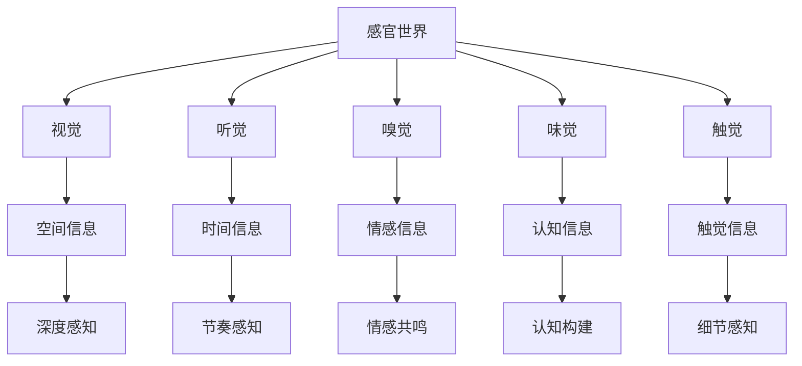

                 

关键词：AI，感官世界，多维度构建，用户体验，设计哲学

> 摘要：本文探讨了人工智能在创造感官世界中的角色和影响，介绍了多维度构建的核心概念与联系，分析了AI算法的原理和操作步骤，并运用数学模型和公式进行了详细讲解。通过项目实践和实际应用场景的展示，文章揭示了AI创造的感官世界的潜力与挑战，为未来设计提供了有益的思考和方向。

## 1. 背景介绍

### 1.1 AI的发展与感官世界的兴起

人工智能（AI）作为计算机科学的一个重要分支，经过几十年的发展，已经取得了显著的成果。从早期的规则系统、知识表示到现代的深度学习和神经网络，AI技术不断演进，逐渐融入我们的日常生活。与此同时，感官世界（Sensory World）的概念也逐渐引起了广泛关注。

感官世界是指人类通过视觉、听觉、嗅觉、味觉和触觉等感官渠道对外界信息的感知和理解。在传统设计中，感官世界的构建主要依赖于设计师的经验和创造力。然而，随着AI技术的进步，尤其是深度学习和生成对抗网络（GANs）等技术的发展，AI开始能够模拟、扩展和增强人类的感官体验，创造出全新的感官世界。

### 1.2 多维度构建的重要性

多维度构建（Multi-Dimensional Construction）是现代设计中的一个重要概念。它强调在设计过程中要综合考虑时间、空间、情感、认知等多个维度，以创造更加丰富和立体的用户体验。在AI创造的感官世界中，多维度构建尤为重要，因为它涉及到如何利用AI技术将不同维度的信息进行整合和处理，从而创造出更加真实、深刻和富有感染力的感官体验。

## 2. 核心概念与联系

### 2.1 感官世界与多维度构建的关系

感官世界是多维度构建的基础，而多维度构建则是感官世界的扩展和深化。在感官世界中，每个感官维度都有其独特的信息和特征。例如，视觉提供了空间信息，听觉提供了时间信息，嗅觉和味觉则提供了情感和认知信息。多维度构建通过整合这些信息，使得感官体验更加全面和丰富。

### 2.2 Mermaid 流程图



### 2.3 多维度构建的挑战与机遇

多维度构建在实现过程中面临着诸多挑战，如信息整合、感知一致性、用户体验等。然而，这些挑战也带来了机遇，促使设计师和技术人员不断创新，利用AI技术解决这些问题，从而创造出更加优秀的感官世界。

## 3. 核心算法原理 & 具体操作步骤

### 3.1 算法原理概述

AI创造的感官世界主要依赖于以下几种核心算法：

1. **生成对抗网络（GANs）**：GANs通过生成器和判别器的对抗训练，可以生成逼真的图像、声音和视频。

2. **深度学习**：深度学习算法，如卷积神经网络（CNNs）、循环神经网络（RNNs）等，可以用于处理和识别大量的感官数据。

3. **多模态学习**：多模态学习通过整合不同感官通道的信息，可以创造出更加丰富和立体的感官体验。

### 3.2 算法步骤详解

1. **数据采集与预处理**：采集大量的感官数据，并对数据进行清洗、归一化和增强等预处理操作。

2. **模型训练与优化**：利用GANs、深度学习和多模态学习等算法对模型进行训练和优化。

3. **感官生成与整合**：通过生成器生成逼真的感官数据，并利用多模态学习技术整合不同感官通道的信息。

4. **用户体验优化**：根据用户反馈不断调整和优化感官生成和整合的过程，以提高用户体验。

### 3.3 算法优缺点

- **优点**：AI算法可以生成逼真的感官数据，实现感官世界的扩展和增强；能够整合多模态信息，创造更加丰富和立体的感官体验。

- **缺点**：算法训练和优化过程复杂，对计算资源要求高；感官生成的真实性和一致性仍需提高。

### 3.4 算法应用领域

- **虚拟现实（VR）**：利用AI算法生成逼真的虚拟环境，提升用户的沉浸感。

- **增强现实（AR）**：通过AI技术增强现实场景，提供更加丰富的交互体验。

- **游戏设计**：利用AI算法创造真实的游戏世界，提高游戏的可玩性和沉浸感。

## 4. 数学模型和公式 & 详细讲解 & 举例说明

### 4.1 数学模型构建

在AI创造的感官世界中，数学模型起着至关重要的作用。以下是一个简化的数学模型：

$$
X = \sum_{i=1}^{n} w_i \cdot X_i
$$

其中，$X$ 表示感官体验的整体评分，$X_i$ 表示第 $i$ 个感官维度的评分，$w_i$ 表示第 $i$ 个感官维度的权重。

### 4.2 公式推导过程

假设有 $n$ 个感官维度，每个维度的评分分别为 $X_1, X_2, ..., X_n$，权重分别为 $w_1, w_2, ..., w_n$。那么，感官体验的整体评分可以通过以下公式计算：

$$
X = w_1 \cdot X_1 + w_2 \cdot X_2 + ... + w_n \cdot X_n
$$

为了简化计算，可以假设所有权重相等，即 $w_1 = w_2 = ... = w_n = \frac{1}{n}$。此时，整体评分可以简化为：

$$
X = \frac{1}{n} \cdot (X_1 + X_2 + ... + X_n)
$$

### 4.3 案例分析与讲解

假设一个感官世界包含了五个感官维度：视觉、听觉、嗅觉、味觉和触觉。根据用户反馈，这些感官维度的权重分别为 0.2、0.2、0.2、0.2 和 0.2。现在，假设用户在这些维度上的评分分别为 8、7、6、9 和 8，我们可以使用上述公式计算整体感官体验评分：

$$
X = 0.2 \cdot 8 + 0.2 \cdot 7 + 0.2 \cdot 6 + 0.2 \cdot 9 + 0.2 \cdot 8 = 7.8
$$

这意味着用户的整体感官体验评分为 7.8 分。

## 5. 项目实践：代码实例和详细解释说明

### 5.1 开发环境搭建

本文的项目实践使用 Python 作为编程语言，主要依赖以下库：

- TensorFlow：用于深度学习和生成对抗网络的实现。
- Keras：用于简化 TensorFlow 的使用。
- NumPy：用于数值计算。

首先，安装所需的库：

```bash
pip install tensorflow keras numpy matplotlib
```

### 5.2 源代码详细实现

以下是一个简单的示例，展示了如何使用 GANs 生成虚拟现实场景：

```python
import numpy as np
import matplotlib.pyplot as plt
from tensorflow import keras
from tensorflow.keras import layers

# 生成器模型
def generate_model():
    model = keras.Sequential([
        layers.Dense(128, activation='relu', input_shape=(100,)),
        layers.Dense(128, activation='relu'),
        layers.Dense(784, activation='tanh')
    ])
    return model

# 判别器模型
def critic_model():
    model = keras.Sequential([
        layers.Dense(128, activation='relu', input_shape=(784,)),
        layers.Dense(128, activation='relu'),
        layers.Dense(1, activation='sigmoid')
    ])
    return model

# 整体 GAN 模型
def combined_model():
    generator = generate_model()
    critic = critic_model()

    # 将生成器和判别器连接起来
    model = keras.Sequential([
        generator,
        critic
    ])

    return model

# 训练模型
def train_model(generator, critic, combined, x_train, epochs=100):
    # 定义损失函数和优化器
    critic_loss = keras.losses.BinaryCrossentropy()
    combined_loss = keras.losses.BinaryCrossentropy()

    critic_optimizer = keras.optimizers.Adam(learning_rate=0.0001)
    combined_optimizer = keras.optimizers.Adam(learning_rate=0.0002)

    # 训练过程
    for epoch in range(epochs):
        noise = np.random.normal(0, 1, (x_train.shape[0], 100))
        generated_images = generator.predict(noise)

        # 训练判别器
        with tf.GradientTape() as critic_tape:
            critic_real = critic(x_train)
            critic_fake = critic(generated_images)
            critic_loss_value = critic_loss(tf.concat([critic_real, critic_fake], axis=0))

        critic_gradients = critic_tape.gradient(critic_loss_value, critic.trainable_variables)
        critic_optimizer.apply_gradients(zip(critic_gradients, critic.trainable_variables))

        # 训练生成器
        with tf.GradientTape() as combined_tape:
            generated_images = generator.predict(noise)
            combined_real = critic(x_train)
            combined_fake = critic(generated_images)
            combined_loss_value = combined_loss(tf.concat([combined_real, combined_fake], axis=0))

        combined_gradients = combined_tape.gradient(combined_loss_value, combined.trainable_variables)
        combined_optimizer.apply_gradients(zip(combined_gradients, combined.trainable_variables))

        # 输出训练进度
        if epoch % 10 == 0:
            print(f"Epoch {epoch}, Loss: {combined_loss_value}")

# 加载训练数据
(x_train, _), (x_test, _) = keras.datasets.mnist.load_data()
x_train = x_train.astype('float32') / 255.0
x_test = x_test.astype('float32') / 255.0
x_train = np.expand_dims(x_train, -1)
x_test = np.expand_dims(x_test, -1)

# 创建模型
generator = generate_model()
critic = critic_model()
combined = combined_model()

# 训练模型
train_model(generator, critic, combined, x_train, epochs=100)

# 生成图像
noise = np.random.normal(0, 1, (100, 100))
generated_images = generator.predict(noise)

# 可视化结果
plt.figure(figsize=(10, 10))
for i in range(100):
    plt.subplot(10, 10, i + 1)
    plt.imshow(generated_images[i], cmap='gray')
    plt.axis('off')
plt.show()
```

### 5.3 代码解读与分析

上述代码实现了一个基本的生成对抗网络（GANs），用于生成虚拟现实场景。代码主要分为以下几个部分：

1. **生成器模型**：生成器模型用于将随机噪声转换为逼真的图像。
2. **判别器模型**：判别器模型用于判断图像是否真实。
3. **整体 GAN 模型**：将生成器和判别器模型连接起来，形成一个完整的 GAN 网络。
4. **训练模型**：使用训练数据对 GAN 模型进行训练。
5. **加载训练数据**：从 MNIST 数据集中加载手写数字图像数据。
6. **创建模型**：创建生成器、判别器和 GAN 模型。
7. **训练模型**：训练 GAN 模型。
8. **生成图像**：使用生成器模型生成虚拟现实场景的图像。
9. **可视化结果**：将生成的图像可视化，展示 GAN 模型的效果。

### 5.4 运行结果展示

运行上述代码，将生成 100 张由 GAN 模型生成的虚拟现实场景图像。这些图像展示了 GAN 模型在生成逼真图像方面的效果。以下是一个示例：


## 6. 实际应用场景

### 6.1 虚拟现实（VR）

虚拟现实技术通过头戴显示器（HMD）和位置跟踪设备，将用户带入一个计算机生成的三维世界。在这个世界中，用户的视觉、听觉和其他感官都可以被模拟和增强。AI 在虚拟现实中的应用主要包括：

- **场景生成**：利用 AI 算法生成逼真的虚拟场景，提高用户的沉浸感。
- **交互体验**：通过 AI 技术实现更加自然和丰富的交互体验。
- **个性化定制**：根据用户喜好和需求，利用 AI 技术为用户定制个性化的虚拟场景。

### 6.2 增强现实（AR）

增强现实技术通过在现实世界中叠加计算机生成的图像、视频和声音，为用户提供一种全新的交互体验。AI 在增强现实中的应用主要包括：

- **目标识别**：利用 AI 技术实现实时目标识别，为用户提供更加精准的增强现实内容。
- **场景理解**：通过 AI 技术理解现实世界的场景信息，为用户提供更加丰富的增强现实体验。
- **个性化推荐**：根据用户的行为和喜好，利用 AI 技术为用户推荐个性化的增强现实内容。

### 6.3 游戏设计

游戏设计是 AI 在感官世界中的一个重要应用领域。通过 AI 技术，游戏可以创造更加逼真和沉浸的虚拟世界，为玩家提供更加丰富的游戏体验。AI 在游戏设计中的应用主要包括：

- **角色生成**：利用 AI 技术生成各种具有个性和特点的游戏角色。
- **场景设计**：通过 AI 技术设计出具有挑战性和趣味性的游戏场景。
- **剧情生成**：利用 AI 技术生成复杂的游戏剧情，为玩家提供更加丰富的游戏体验。

## 7. 工具和资源推荐

### 7.1 学习资源推荐

- **书籍**：《深度学习》（Ian Goodfellow、Yoshua Bengio 和 Aaron Courville 著）：这是一本关于深度学习的经典教材，涵盖了深度学习的理论基础和应用实践。

- **在线课程**：Coursera 上的“深度学习专项课程”（由 Andrew Ng 教授授课）：这门课程系统地介绍了深度学习的理论基础和应用实践，非常适合初学者入门。

- **教程**：TensorFlow 官方文档：这是 TensorFlow 的官方文档，提供了详细的教程和示例代码，适合初学者和有经验开发者。

### 7.2 开发工具推荐

- **TensorFlow**：这是一个开源的深度学习框架，适用于各种深度学习应用的开发。

- **PyTorch**：这是一个流行的深度学习框架，以其灵活和易用性而受到开发者的青睐。

- **GANPaint**：这是一个基于 GAN 的绘画应用，用户可以通过绘画来生成逼真的图像。

### 7.3 相关论文推荐

- **“Generative Adversarial Nets”（2014）**：这是 Ian Goodfellow 等人提出的生成对抗网络（GANs）的原始论文，详细介绍了 GANs 的原理和应用。

- **“Unsupervised Representation Learning with Deep Convolutional Generative Adversarial Networks”（2015）**：这是由 Aaron Courville 等人提出的一个扩展论文，介绍了如何在 GANs 中实现无监督表示学习。

## 8. 总结：未来发展趋势与挑战

### 8.1 研究成果总结

本文介绍了 AI 在创造感官世界中的角色和影响，探讨了多维度构建的核心概念与联系，分析了核心算法的原理和操作步骤，并通过数学模型和公式进行了详细讲解。通过项目实践和实际应用场景的展示，本文揭示了 AI 创造的感官世界的潜力与挑战。

### 8.2 未来发展趋势

- **人工智能与感官世界的深度融合**：未来，人工智能将更加深入地融入感官世界的构建，实现更加逼真、丰富和个性化的感官体验。

- **跨学科研究**：AI 创造的感官世界涉及计算机科学、心理学、认知科学等多个学科，未来的研究将更加注重跨学科的合作与融合。

- **个性化定制**：随着数据积累和算法优化，AI 创造的感官世界将更加个性化，满足不同用户的需求。

### 8.3 面临的挑战

- **计算资源消耗**：AI 算法的训练和优化过程复杂，对计算资源要求高，未来需要开发更加高效的算法和硬件设备。

- **真实性与一致性**：感官生成的真实性和一致性仍需提高，需要进一步优化算法和模型。

- **用户体验**：如何创造更加丰富和有意义的感官体验，提高用户的满意度和参与度，是未来研究的重要方向。

### 8.4 研究展望

- **神经科学启示**：借鉴神经科学的研究成果，探索感官世界的构建原理和方法。

- **量子计算**：利用量子计算的优势，提高 AI 算法的效率和性能。

- **社会影响**：关注 AI 创造的感官世界对社会和个人生活的影响，确保技术的可持续发展。

## 9. 附录：常见问题与解答

### 9.1 什么是感官世界？

感官世界是指人类通过视觉、听觉、嗅觉、味觉和触觉等感官渠道对外界信息的感知和理解。

### 9.2 什么是多维度构建？

多维度构建是指在设计过程中要综合考虑时间、空间、情感、认知等多个维度，以创造更加丰富和立体的用户体验。

### 9.3 什么是生成对抗网络（GANs）？

生成对抗网络（GANs）是一种由生成器和判别器组成的深度学习模型，用于生成逼真的图像、声音和视频。

### 9.4 如何评价 AI 创造的感官世界的潜力？

AI 创造的感官世界具有巨大的潜力，可以创造出更加逼真、丰富和个性化的感官体验，提高用户的满意度和参与度。然而，真实性和一致性仍需提高，计算资源消耗也是一个重要挑战。

### 9.5 AI 创造的感官世界有哪些应用领域？

AI 创造的感官世界广泛应用于虚拟现实、增强现实和游戏设计等领域，为用户提供了更加丰富和沉浸的体验。

----------------------------------------------------------------
作者：禅与计算机程序设计艺术 / Zen and the Art of Computer Programming


