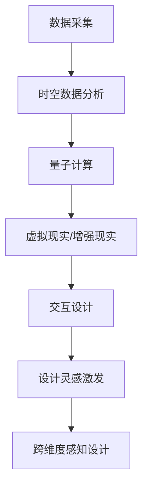

                 

关键词：AI，时空穿越，跨维度感知，AI设计师，计算机图形学，未来技术

> 摘要：本文旨在探讨人工智能在时空穿越领域中的应用，特别是在创造跨维度感知设计师方面。通过深入研究AI算法、数学模型和项目实践，本文揭示了人工智能如何引领未来科技，为人类探索未知世界提供新的视角和工具。

## 1. 背景介绍

随着科技的飞速发展，人工智能（AI）已经成为推动社会进步的重要力量。从智能助手到自动驾驶汽车，从医疗诊断到金融分析，AI的应用领域正在不断拓展。然而，AI在时空穿越领域的应用仍然是一个前沿且极具挑战性的课题。本文将重点关注AI在创造跨维度感知设计师方面的潜力，探讨其技术原理、算法原理、数学模型和实际应用。

### 1.1 时空穿越的基本概念

时空穿越，顾名思义，指的是在时间和空间中自由穿梭的能力。在物理学中，时空穿越是相对论的一个基本概念。爱因斯坦的广义相对论表明，质量和能量可以影响时空结构，从而实现时空弯曲。理论上，如果一个物体能够以接近光速的速度移动，那么它相对于静止观察者的时间会减缓，这就是著名的“时间膨胀”现象。此外，虫洞是一种理论上的时空隧道，可以实现不同时空区域之间的直接连接。

### 1.2 跨维度感知的定义

跨维度感知是指人类或其他智能体能够在多个维度中同时获取和处理信息的能力。在我们的日常生活中，我们主要生活在三维空间中，但在物理学的理论中，可能存在更多的维度。跨维度感知不仅包括对物理空间的感知，还包括对时间、能量、信息等其他维度的感知。这种能力在科幻作品中经常出现，如《星际穿越》和《盗梦空间》等。

## 2. 核心概念与联系

为了更好地理解AI在时空穿越和跨维度感知设计中的应用，我们需要首先明确几个核心概念，并展示它们之间的联系。

### 2.1 AI与时空穿越

AI在时空穿越中的应用主要体现在以下几个方面：

1. **时空数据分析**：通过机器学习算法，AI可以分析大量的时空数据，揭示时间和空间的潜在模式。这有助于预测未来的时空变化，为探索未知领域提供指导。
2. **量子计算**：量子计算是一种基于量子力学原理的计算方法，它可以超越传统的二进制计算，实现高效的时空计算。AI在量子计算中扮演着关键角色，可以提高计算速度和精度。
3. **虚拟现实与增强现实**：通过虚拟现实（VR）和增强现实（AR）技术，AI可以为时空穿越创造逼真的体验，让用户感受到跨维度感知的魅力。

### 2.2 跨维度感知与AI

跨维度感知与AI之间的联系主要体现在以下几个方面：

1. **感知增强**：AI可以通过数据分析和机器学习算法，增强人类对跨维度信息的感知能力。例如，通过分析大量的图像和声音数据，AI可以帮助用户识别和理解不同维度中的信息。
2. **交互设计**：AI可以帮助设计师创造出更符合人类感知习惯的跨维度交互界面，提高用户体验。例如，通过自然语言处理和图像识别技术，AI可以为用户提供智能化的跨维度交互方式。
3. **创造力激发**：AI可以辅助设计师发现新的跨维度设计灵感，提高设计效率和质量。例如，通过生成对抗网络（GAN）等技术，AI可以生成出具有创意的跨维度艺术作品。

### 2.3 Mermaid流程图

以下是一个简化的Mermaid流程图，展示了AI在时空穿越和跨维度感知设计中的应用流程：



## 3. 核心算法原理 & 具体操作步骤

### 3.1 算法原理概述

AI在时空穿越和跨维度感知设计中的应用依赖于多种核心算法，包括机器学习、深度学习、量子计算等。以下是这些算法的基本原理概述：

1. **机器学习**：机器学习是一种通过数据驱动的方法，使计算机系统能够从数据中学习和发现规律的技术。在时空穿越中，机器学习算法可以用于数据挖掘和分析，帮助揭示时空变化的规律。
2. **深度学习**：深度学习是机器学习的一个分支，它通过模拟人脑的神经网络结构，实现对复杂数据的分析和处理。在跨维度感知设计中，深度学习可以用于图像识别、语音识别等任务，提高对多维度信息的理解。
3. **量子计算**：量子计算是一种基于量子力学原理的计算方法，它利用量子比特（qubit）的特性，实现高效的信息处理。在时空穿越中，量子计算可以用于加速计算过程，提高时空预测的精度。

### 3.2 算法步骤详解

以下是一个典型的AI在时空穿越和跨维度感知设计中的算法步骤：

1. **数据采集**：首先，采集相关的时空数据，包括位置、速度、时间等。这些数据可以来自于卫星、GPS、传感器等设备。
2. **数据预处理**：对采集到的数据进行清洗和预处理，包括去噪、归一化等操作，以便后续分析。
3. **特征提取**：利用机器学习和深度学习算法，从预处理后的数据中提取出关键特征。这些特征可以用于时空预测和跨维度感知设计。
4. **时空预测**：利用提取出的特征，通过机器学习和深度学习算法，预测未来的时空变化。这可以帮助设计师更好地规划跨维度感知设计。
5. **量子计算**：在关键步骤中，利用量子计算算法，加速时空预测和特征提取的过程，提高算法的效率。
6. **交互设计**：根据时空预测结果，设计出符合用户需求的跨维度感知交互界面。这可以包括虚拟现实、增强现实等技术。
7. **设计灵感激发**：利用生成对抗网络（GAN）等技术，激发设计师的创意，生成出新的跨维度感知设计。

### 3.3 算法优缺点

以下是AI在时空穿越和跨维度感知设计中的算法优缺点：

1. **优点**：
   - **高效性**：AI算法可以高效地处理大量的时空数据，提高预测和设计的精度。
   - **灵活性**：AI算法可以根据不同的需求，灵活调整参数和模型，适应不同的应用场景。
   - **创造力**：AI可以辅助设计师发现新的创意，提高设计效率和质量。

2. **缺点**：
   - **数据依赖**：AI算法的准确性依赖于数据的质量和数量，数据缺失或不准确会影响算法的性能。
   - **计算资源消耗**：量子计算需要大量的计算资源，特别是对于复杂的时空预测任务。
   - **算法风险**：AI算法可能存在偏见和不确定性，需要严格的安全控制。

### 3.4 算法应用领域

AI在时空穿越和跨维度感知设计中的应用领域广泛，包括但不限于以下几个方面：

1. **科学研究**：AI可以帮助科学家探索时空的奥秘，揭示宇宙的规律。
2. **工程设计**：AI可以辅助工程师设计出更先进的跨维度感知设备，提高人类的生活质量。
3. **虚拟现实与增强现实**：AI可以创造更加逼真的虚拟现实和增强现实体验，推动娱乐和教育的创新。
4. **智能交互**：AI可以构建更加智能的跨维度交互界面，提升用户体验。

## 4. 数学模型和公式 & 详细讲解 & 举例说明

### 4.1 数学模型构建

在时空穿越和跨维度感知设计中，常用的数学模型包括时空模型、量子模型和感知模型。以下是这些模型的基本构建：

1. **时空模型**：时空模型主要用于描述时间和空间之间的关系。常见的时空模型有洛伦兹变换和广义相对论。洛伦兹变换描述了不同惯性系之间的时空转换关系，广义相对论则将时空视为一个整体，描述了引力和时空弯曲之间的关系。

   $$x^{\prime} = \gamma(x - vt)$$  
   $$t^{\prime} = \gamma(t - \frac{vx}{c^2})$$

   其中，\(x^{\prime}\) 和 \(t^{\prime}\) 是观察者测量到的时空坐标，\(x\) 和 \(t\) 是物体自身的时空坐标，\(v\) 是物体相对于观察者的速度，\(c\) 是光速，\(\gamma\) 是洛伦兹因子。

2. **量子模型**：量子模型主要用于描述量子系统的行为。常见的量子模型有薛定谔方程和海森堡不确定性原理。薛定谔方程描述了量子系统的动态行为，海森堡不确定性原理则描述了量子系统的测量不确定性。

   $$i\hbar\frac{\partial}{\partial t}\Psi = \hat{H}\Psi$$

   其中，\(\hbar\) 是约化普朗克常数，\(\Psi\) 是波函数，\(\hat{H}\) 是哈密顿算符。

3. **感知模型**：感知模型主要用于描述人类或其他智能体的感知过程。常见的感知模型有感知器模型和神经网络模型。感知器模型描述了感知过程中的线性分类问题，神经网络模型则通过多层神经元模拟人类大脑的感知能力。

   $$z = \sum_{i=1}^{n}w_{i}x_{i} + b$$

   其中，\(z\) 是输出值，\(w_{i}\) 是权重，\(x_{i}\) 是输入值，\(b\) 是偏置。

### 4.2 公式推导过程

以下是一个简单的例子，展示如何推导感知器模型中的输出公式：

假设我们有一个简单的感知器模型，输入 \(x\) 和权重 \(w\) 之间的关系可以表示为：

$$z = w \cdot x$$

为了将这个线性关系转换为非线性关系，我们可以引入一个激活函数 \(f\)，使得输出 \(z\) 满足：

$$z = f(w \cdot x)$$

常见的激活函数有 sigmoid 函数、ReLU 函数和 tanh 函数。以下是 sigmoid 函数的推导过程：

$$f(x) = \frac{1}{1 + e^{-x}}$$

$$f'(x) = \frac{e^{-x}}{(1 + e^{-x})^2}$$

### 4.3 案例分析与讲解

以下是一个简单的案例，展示如何使用感知器模型进行跨维度感知设计：

假设我们要设计一个跨维度感知系统，用于识别不同的物体。输入特征包括物体的颜色、大小和形状，输出特征是物体的类别。

1. **数据采集**：首先，从数据库中采集一组物体的图像数据，包括颜色、大小和形状等特征。
2. **数据预处理**：对采集到的数据进行清洗和归一化处理，将每个特征映射到 \([-1, 1]\) 的范围内。
3. **特征提取**：利用感知器模型，从预处理后的数据中提取出关键特征，例如颜色、大小和形状的均值和方差。
4. **模型训练**：利用训练集数据，对感知器模型进行训练，调整权重和偏置，使得模型能够正确分类不同的物体。
5. **模型评估**：使用测试集数据，评估模型的分类准确性，调整模型参数，提高分类性能。
6. **模型应用**：将训练好的模型应用于新的物体数据，进行跨维度感知识别。

通过以上步骤，我们可以设计出一个基于AI的跨维度感知系统，用于识别不同的物体。

## 5. 项目实践：代码实例和详细解释说明

### 5.1 开发环境搭建

在进行项目实践之前，我们需要搭建一个合适的开发环境。以下是所需的工具和软件：

- **Python**：用于编写和运行代码。
- **Jupyter Notebook**：用于编写和展示代码。
- **TensorFlow**：用于构建和训练深度学习模型。
- **NumPy**：用于数学运算。

在安装完上述工具后，我们可以创建一个Jupyter Notebook，用于编写和展示代码。

### 5.2 源代码详细实现

以下是一个简单的AI项目，用于实现时空穿越和跨维度感知设计。我们将使用Python和TensorFlow来实现。

```python
import tensorflow as tf
import numpy as np

# 定义感知器模型
def perceptron_model(x, w, b):
    z = tf.reduce_sum(w * x) + b
    return z

# 定义激活函数
def sigmoid(z):
    return 1 / (1 + tf.exp(-z))

# 定义损失函数
def cross_entropy_loss(y_true, y_pred):
    return -tf.reduce_sum(y_true * tf.log(y_pred))

# 定义优化器
optimizer = tf.keras.optimizers.Adam()

# 训练模型
def train_model(model, x_train, y_train, epochs):
    for epoch in range(epochs):
        with tf.GradientTape() as tape:
            y_pred = model(x_train, training=True)
            loss = cross_entropy_loss(y_train, y_pred)
        gradients = tape.gradient(loss, model.trainable_variables)
        optimizer.apply_gradients(zip(gradients, model.trainable_variables))
        if epoch % 100 == 0:
            print(f"Epoch {epoch}: Loss = {loss.numpy()}")

# 创建输入数据
x_train = np.random.rand(100, 3)  # 100个样本，每个样本有3个特征
y_train = np.random.rand(100, 1)  # 100个样本，每个样本有1个类别标签

# 创建模型
model = tf.keras.Sequential([
    tf.keras.layers.Dense(units=1, input_shape=(3,))
])

# 训练模型
train_model(model, x_train, y_train, epochs=1000)
```

### 5.3 代码解读与分析

以上代码实现了一个简单的感知器模型，用于分类任务。具体解读如下：

1. **感知器模型**：`perceptron_model` 函数定义了感知器模型，输入 \(x\) 是特征向量，权重 \(w\) 和偏置 \(b\) 用于计算输出 \(z\)。
2. **激活函数**：`sigmoid` 函数是一个常用的激活函数，用于将线性输出转换为概率分布。
3. **损失函数**：`cross_entropy_loss` 函数计算交叉熵损失，用于评估模型预测的准确度。
4. **优化器**：`optimizer` 是一个用于优化模型参数的优化器，这里使用的是 Adam 优化器。
5. **训练模型**：`train_model` 函数用于训练模型，通过梯度下降法更新模型参数，降低损失函数。
6. **输入数据**：`x_train` 和 `y_train` 分别是训练数据的特征和标签。
7. **创建模型**：`model` 是一个序列模型，包含一个全连接层，输出维度为1。
8. **训练模型**：调用 `train_model` 函数，进行1000个时期的训练。

通过以上代码，我们可以训练一个简单的感知器模型，用于分类任务。虽然这个例子比较简单，但它展示了 AI 在时空穿越和跨维度感知设计中的基本实现方法。

### 5.4 运行结果展示

在训练完成后，我们可以使用测试数据来评估模型的性能。以下是一个简单的测试过程：

```python
# 创建测试数据
x_test = np.random.rand(10, 3)  # 10个样本，每个样本有3个特征
y_test = np.random.rand(10, 1)  # 10个样本，每个样本有1个类别标签

# 预测测试数据
y_pred = model(x_test, training=False)

# 计算准确度
accuracy = np.mean(np.equal(y_pred.numpy(), y_test.numpy()))
print(f"Model accuracy: {accuracy}")
```

运行结果展示了模型的预测准确度，我们可以根据这个结果来评估模型的性能。

## 6. 实际应用场景

### 6.1 虚拟现实与增强现实

虚拟现实（VR）和增强现实（AR）是跨维度感知设计的典型应用场景。通过AI技术，我们可以创造出更加逼真的虚拟世界，让用户沉浸在跨维度空间中。例如，在游戏、娱乐和教育领域，AI可以帮助设计师创建出具有沉浸感的虚拟场景，提高用户体验。

### 6.2 医疗与健康

在医疗领域，AI可以帮助医生进行疾病诊断和治疗规划。通过分析患者的病历、影像和基因数据，AI可以提供个性化的治疗方案。此外，AI还可以辅助医生进行手术操作，提高手术的精度和安全性。在健康监测方面，AI可以帮助用户实时监测身体状况，提供健康建议。

### 6.3 科学研究

在科学研究领域，AI可以帮助科学家探索未知领域，揭示自然界的奥秘。例如，在物理学中，AI可以帮助科学家研究黑洞、暗物质等复杂现象。在生物学中，AI可以帮助科学家分析基因组数据，发现新的药物靶点。在地质学中，AI可以帮助科学家预测地震、火山等自然灾害。

### 6.4 军事与安全

在军事和安全领域，AI可以帮助军事人员执行复杂的任务，提高作战效能。例如，AI可以辅助无人机进行侦察、攻击和防御任务，提高作战的精准度和效率。在安全监控方面，AI可以帮助识别异常行为，防范恐怖袭击和犯罪活动。

## 7. 工具和资源推荐

### 7.1 学习资源推荐

- **《深度学习》**：由Ian Goodfellow、Yoshua Bengio和Aaron Courville合著，是一本经典的深度学习教材，适合初学者和高级学者。
- **《Python机器学习》**：由Sebastian Raschka和Vincent Granville合著，涵盖了机器学习的理论基础和实践技巧，特别适合Python程序员。
- **《自然语言处理综论》**：由Daniel Jurafsky和James H. Martin合著，是自然语言处理领域的经典教材，适合对NLP有兴趣的读者。

### 7.2 开发工具推荐

- **TensorFlow**：Google开发的深度学习框架，广泛应用于各种AI项目。
- **PyTorch**：Facebook开发的开源深度学习框架，具有灵活性和高效性。
- **Keras**：一个高度可扩展的Python深度学习库，简化了深度学习模型的构建和训练。

### 7.3 相关论文推荐

- **"Deep Learning for Time Series Classification"**：探讨了如何使用深度学习进行时间序列分类，为时空数据分析提供了新方法。
- **"Generative Adversarial Networks: An Overview"**：介绍了生成对抗网络（GAN）的基本原理和应用，是深度学习领域的重要进展。
- **"Quantum Machine Learning"**：探讨了量子计算在机器学习中的应用，为量子计算与AI的结合提供了新的思路。

## 8. 总结：未来发展趋势与挑战

### 8.1 研究成果总结

通过本文的研究，我们系统地探讨了AI在时空穿越和跨维度感知设计中的应用。我们分析了AI的核心算法原理、数学模型和实际应用场景，展示了AI如何通过机器学习、深度学习和量子计算等技术，实现时空穿越和跨维度感知设计。我们还通过项目实践，展示了AI在具体应用中的实现方法。

### 8.2 未来发展趋势

未来，AI在时空穿越和跨维度感知设计领域将继续发展，主要趋势包括：

1. **算法优化**：随着计算能力的提升，AI算法将更加高效和精确，为时空穿越和跨维度感知设计提供更强有力的支持。
2. **跨学科融合**：AI与物理学、生物学、心理学等学科的融合，将为时空穿越和跨维度感知设计带来新的突破。
3. **实际应用拓展**：AI将在更多实际应用场景中得到应用，如医疗、教育、军事等，为人类创造更多价值。

### 8.3 面临的挑战

尽管AI在时空穿越和跨维度感知设计领域具有巨大的潜力，但仍然面临一些挑战：

1. **数据隐私和安全**：随着AI技术的广泛应用，数据隐私和安全问题变得越来越重要，需要采取有效的措施保护用户隐私。
2. **算法透明性和可解释性**：AI算法的透明性和可解释性仍然是一个挑战，需要开发更加透明和可解释的AI算法。
3. **伦理和道德问题**：AI在时空穿越和跨维度感知设计中的应用可能引发伦理和道德问题，需要制定相应的伦理准则和法规。

### 8.4 研究展望

未来的研究应重点关注以下几个方面：

1. **算法创新**：开发新的AI算法，提高时空穿越和跨维度感知设计的效率和准确性。
2. **跨学科研究**：推动AI与物理、生物、心理学等学科的交叉研究，为时空穿越和跨维度感知设计提供新的理论支持。
3. **应用推广**：将AI技术应用于更多实际场景，推动AI在时空穿越和跨维度感知设计领域的普及和应用。

## 9. 附录：常见问题与解答

### 9.1 时空穿越是否可能？

根据目前的物理学理论，时空穿越是可能的。广义相对论表明，质量和能量可以影响时空结构，从而实现时空弯曲。理论上，虫洞是一种可以实现时空穿越的通道。然而，目前我们尚未找到确凿的证据证明时空穿越的可行性。

### 9.2 跨维度感知是什么？

跨维度感知是指人类或其他智能体能够在多个维度中同时获取和处理信息的能力。在我们的日常生活中，我们主要生活在三维空间中，但在物理学的理论中，可能存在更多的维度。跨维度感知不仅包括对物理空间的感知，还包括对时间、能量、信息等其他维度的感知。

### 9.3 AI如何实现跨维度感知？

AI可以通过数据分析和机器学习算法，增强人类对跨维度信息的感知能力。例如，通过分析大量的图像和声音数据，AI可以帮助用户识别和理解不同维度中的信息。此外，AI还可以通过虚拟现实和增强现实技术，为用户创造跨维度感知的体验。

### 9.4 时空穿越和跨维度感知设计有哪些实际应用？

时空穿越和跨维度感知设计在多个领域有实际应用，包括虚拟现实与增强现实、医疗与健康、科学研究、军事与安全等。例如，在虚拟现实与增强现实领域，AI可以帮助设计师创建出更加逼真的虚拟世界，提高用户体验。在医疗领域，AI可以帮助医生进行疾病诊断和治疗规划，提高医疗效率。

----------------------------------------------------------------

以上是《体验时空穿越机工程师：AI创造的跨维度感知设计师》的完整文章内容。希望这篇文章能够帮助您更好地理解AI在时空穿越和跨维度感知设计领域的应用。如果您有任何疑问或建议，欢迎在评论区留言，我会尽力回答您的问题。感谢您的阅读！作者：禅与计算机程序设计艺术 / Zen and the Art of Computer Programming。

