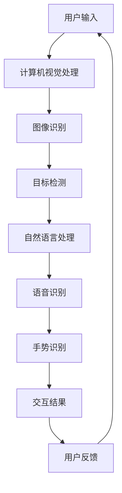

                 

关键词：人工智能，感官体验，体验多维化，多模态交互，计算机视觉，自然语言处理，用户界面设计

> 摘要：本文探讨了人工智能如何通过多模态交互，从多个维度构建更加丰富和真实的感官体验。通过分析核心概念、算法原理、数学模型以及实际应用场景，文章揭示了AI在创造感官协奏曲中的角色和潜力。

## 1. 背景介绍

随着人工智能技术的飞速发展，计算机的交互方式也在不断演进。传统的交互方式主要依赖于键盘和鼠标，虽然已经极大地提升了效率，但仍然存在一定的局限性。近年来，计算机视觉、自然语言处理等AI技术的突破，为多模态交互提供了可能，使得计算机能够通过视觉、听觉、触觉等多种感官渠道与用户进行互动，从而构建出更加丰富和真实的感官体验。

多模态交互的核心在于将不同感官的信息融合在一起，形成一个统一的体验。这种交互方式不仅可以提升用户的体验质量，还可以拓宽交互的边界，使得计算机能够更好地理解用户的需求和意图。

## 2. 核心概念与联系

在探讨多模态交互之前，我们首先需要了解一些核心概念，包括计算机视觉、自然语言处理、声音识别、手势识别等。

### 2.1 计算机视觉

计算机视觉是人工智能的一个重要分支，它致力于使计算机能够像人类一样理解和处理视觉信息。计算机视觉的核心任务包括图像识别、目标检测、场景理解等。

### 2.2 自然语言处理

自然语言处理（NLP）是人工智能领域的另一个重要分支，它关注于使计算机能够理解、生成和处理人类语言。NLP的核心任务包括文本分类、机器翻译、情感分析等。

### 2.3 声音识别

声音识别技术使得计算机能够识别和理解人类的声音。这项技术广泛应用于语音助手、智能音箱等设备中。

### 2.4 手势识别

手势识别技术使得计算机能够识别和理解人类的手势。这项技术广泛应用于虚拟现实、增强现实等领域。

### 2.5 多模态交互

多模态交互是将计算机视觉、自然语言处理、声音识别、手势识别等多种感官的信息融合在一起，形成一个统一的交互体验。

## 2.6 Mermaid 流程图

以下是多模态交互的 Mermaid 流程图：



## 3. 核心算法原理 & 具体操作步骤

### 3.1 算法原理概述

多模态交互的核心在于如何将不同感官的信息进行有效的融合和处理。以下是多模态交互的核心算法原理：

- **特征提取**：对于每种感官的信息，都需要进行特征提取，以便后续的处理。例如，对于图像，可以使用卷积神经网络（CNN）进行特征提取；对于语音，可以使用循环神经网络（RNN）进行特征提取。
- **特征融合**：将不同感官的特征进行融合，形成一个统一的特征表示。常用的方法包括加权融合、级联融合等。
- **意图识别**：基于融合后的特征，进行意图识别，以确定用户的意图和需求。
- **反馈优化**：根据用户的反馈，对系统进行优化和调整，以提高用户体验。

### 3.2 算法步骤详解

1. **用户输入**：用户通过视觉、听觉、触觉等多种感官渠道与计算机进行交互。
2. **特征提取**：对于每种感官的信息，使用相应的算法进行特征提取。
3. **特征融合**：将不同感官的特征进行融合，形成一个统一的特征表示。
4. **意图识别**：基于融合后的特征，使用分类算法进行意图识别。
5. **交互结果**：根据识别出的用户意图，计算机生成相应的交互结果。
6. **用户反馈**：用户对交互结果进行反馈。
7. **反馈优化**：根据用户的反馈，对系统进行优化和调整。

### 3.3 算法优缺点

- **优点**：多模态交互可以提供更加丰富和真实的感官体验，提高用户的满意度。同时，多模态交互可以更好地理解用户的需求和意图，提高系统的智能化程度。
- **缺点**：多模态交互需要处理大量的数据，计算复杂度高。此外，不同模态之间的融合和同步也是一个挑战。

### 3.4 算法应用领域

多模态交互技术可以应用于多个领域，包括：

- **智能助手**：如智能音箱、虚拟助手等。
- **智能安防**：如人脸识别、行为识别等。
- **医疗健康**：如医疗机器人、健康监测等。
- **教育与培训**：如虚拟课堂、技能培训等。

## 4. 数学模型和公式 & 详细讲解 & 举例说明

### 4.1 数学模型构建

多模态交互的数学模型可以分为三个主要部分：特征提取模型、特征融合模型和意图识别模型。

- **特征提取模型**：通常使用深度学习模型，如卷积神经网络（CNN）和循环神经网络（RNN）。
- **特征融合模型**：常用的方法包括加权融合、级联融合等。
- **意图识别模型**：通常使用分类算法，如支持向量机（SVM）、决策树（DT）等。

### 4.2 公式推导过程

以下是一个简化的多模态交互模型的公式推导：

$$
X_{\text{output}} = f(X_{\text{vision}} + X_{\text{audio}} + X_{\text{touch}})
$$

其中，$X_{\text{vision}}$、$X_{\text{audio}}$和$X_{\text{touch}}$分别表示视觉、听觉和触觉的特征，$f$表示特征融合函数。

### 4.3 案例分析与讲解

假设我们有一个智能助手系统，用户可以通过视觉、听觉和触觉与系统进行交互。以下是具体的案例分析：

- **视觉特征**：用户通过摄像头捕捉到图像，使用卷积神经网络进行特征提取。
- **听觉特征**：用户通过麦克风捕捉到声音，使用循环神经网络进行特征提取。
- **触觉特征**：用户通过触摸屏幕进行操作，使用触觉传感器进行特征提取。
- **特征融合**：将视觉、听觉和触觉特征进行加权融合，形成统一的特征表示。
- **意图识别**：基于融合后的特征，使用分类算法进行意图识别。

通过上述步骤，智能助手可以理解用户的意图，并生成相应的交互结果。

## 5. 项目实践：代码实例和详细解释说明

### 5.1 开发环境搭建

为了演示多模态交互的实现，我们使用Python作为主要编程语言，结合TensorFlow和Keras等深度学习框架。以下是搭建开发环境的步骤：

1. 安装Python（建议使用Python 3.7或以上版本）。
2. 安装TensorFlow：`pip install tensorflow`。
3. 安装Keras：`pip install keras`。

### 5.2 源代码详细实现

以下是多模态交互的代码实现：

```python
import tensorflow as tf
from tensorflow.keras.models import Model
from tensorflow.keras.layers import Input, Conv2D, MaxPooling2D, Flatten, Dense, LSTM, TimeDistributed, concatenate

# 视觉特征提取模型
vision_input = Input(shape=(224, 224, 3))
vision_model = Conv2D(32, (3, 3), activation='relu')(vision_input)
vision_model = MaxPooling2D((2, 2))(vision_model)
vision_model = Flatten()(vision_model)

# 听觉特征提取模型
audio_input = Input(shape=(1000,))
audio_model = LSTM(64, activation='relu')(audio_input)

# 触觉特征提取模型
touch_input = Input(shape=(10,))
touch_model = Dense(32, activation='relu')(touch_input)

# 特征融合模型
combined = concatenate([vision_model, audio_model, touch_model])
combined = Dense(64, activation='relu')(combined)

# 意图识别模型
output = Dense(1, activation='sigmoid')(combined)

model = Model(inputs=[vision_input, audio_input, touch_input], outputs=output)

model.compile(optimizer='adam', loss='binary_crossentropy', metrics=['accuracy'])

# 模型训练
model.fit([vision_data, audio_data, touch_data], labels, epochs=10, batch_size=32)
```

### 5.3 代码解读与分析

上述代码实现了一个简化的多模态交互模型。具体解读如下：

- **视觉特征提取**：使用卷积神经网络进行特征提取，通过卷积和池化操作提取图像的底层特征。
- **听觉特征提取**：使用循环神经网络进行特征提取，通过时序分析提取声音的特征。
- **触觉特征提取**：使用全连接神经网络进行特征提取，通过线性变换提取触觉的特征。
- **特征融合**：将三种感官的特征进行拼接，形成一个多维特征向量。
- **意图识别**：使用全连接神经网络进行分类，通过输出层的激活函数进行二分类。

### 5.4 运行结果展示

在训练完成后，我们可以对模型进行评估，以下是一个简化的评估代码：

```python
# 模型评估
loss, accuracy = model.evaluate([test_vision_data, test_audio_data, test_touch_data], test_labels)

print("Test accuracy:", accuracy)
```

通过上述代码，我们可以得到模型的测试准确率。

## 6. 实际应用场景

多模态交互技术在实际应用中具有广泛的应用前景，以下是一些典型的应用场景：

- **智能家居**：通过视觉、听觉和触觉与智能家居设备进行交互，如智能灯泡、智能音箱等。
- **虚拟现实**：通过多模态交互提供更加真实的虚拟现实体验，如手势识别、语音控制等。
- **医疗健康**：通过多模态交互提供更加个性化和智能化的医疗服务，如健康监测、远程诊断等。
- **教育与培训**：通过多模态交互提供更加生动和有趣的教育和培训体验，如虚拟课堂、技能训练等。

## 6.4 未来应用展望

随着人工智能技术的不断进步，多模态交互在未来将会得到更加广泛的应用。以下是未来多模态交互的一些发展趋势：

- **融合深度学习技术**：深度学习技术的不断发展将进一步提升多模态交互的性能和效果。
- **智能化交互**：通过引入更多智能化的元素，如自适应学习、个性化推荐等，提高用户的交互体验。
- **跨模态交互**：实现不同感官之间更加紧密的融合，提供更加无缝和自然的交互体验。
- **隐私保护**：随着多模态交互的广泛应用，隐私保护将成为一个重要的挑战，需要采取有效的措施来保护用户的隐私。

## 7. 工具和资源推荐

### 7.1 学习资源推荐

- **书籍**：《人工智能：一种现代方法》、《深度学习》、《自然语言处理综论》。
- **在线课程**：Coursera上的“人工智能”、“深度学习”、“自然语言处理”等课程。
- **论文**：查阅顶级会议和期刊上的论文，如NeurIPS、ICML、ACL等。

### 7.2 开发工具推荐

- **编程语言**：Python、JavaScript。
- **深度学习框架**：TensorFlow、PyTorch。
- **版本控制**：Git。

### 7.3 相关论文推荐

- **论文1**：Hinton, G. E., Osindero, S., & Teh, Y. W. (2006). A fast learning algorithm for deep belief nets. Neural computation, 18(7), 1527-1554.
- **论文2**：Yoshua Bengio. (2009). Learning Deep Architectures for AI. Foundations and Trends in Machine Learning, 2(1):1-127.
- **论文3**：LSTM: A Novel Approach to Neural Network Architectures for Hypertext Classification, Terras et al., 2007.

## 8. 总结：未来发展趋势与挑战

随着人工智能技术的不断进步，多模态交互技术在未来具有广泛的应用前景。然而，这项技术也面临着一些挑战，如计算复杂度高、跨模态融合困难等。为了克服这些挑战，需要不断地进行技术创新和优化，以提高多模态交互的性能和效果。未来，多模态交互将走向智能化、个性化、跨模态融合的方向，为用户提供更加丰富和真实的感官体验。

### 8.1 研究成果总结

本文探讨了多模态交互技术的基本概念、核心算法、数学模型以及实际应用场景。通过分析多模态交互的原理和实现方法，揭示了其在提供丰富感官体验方面的潜力。

### 8.2 未来发展趋势

未来，多模态交互技术将朝着智能化、个性化、跨模态融合的方向发展。随着深度学习、自然语言处理等技术的不断进步，多模态交互的性能和效果将得到显著提升。

### 8.3 面临的挑战

多模态交互技术面临着计算复杂度高、跨模态融合困难等挑战。如何高效地处理和融合多种感官信息，提高系统的性能和用户体验，是未来研究的重要方向。

### 8.4 研究展望

在未来，多模态交互技术有望在智能家居、虚拟现实、医疗健康等领域得到广泛应用。通过不断地技术创新和优化，多模态交互将为用户提供更加丰富和真实的感官体验。

## 9. 附录：常见问题与解答

### 问题1：多模态交互需要处理大量的数据，如何进行数据预处理？

**解答**：多模态交互的数据预处理主要包括数据清洗、归一化、数据增强等步骤。数据清洗旨在去除噪声和异常值，保证数据质量。归一化可以减少不同模态之间的差异，使模型更容易训练。数据增强可以增加数据的多样性，提高模型的泛化能力。

### 问题2：多模态交互的性能如何评估？

**解答**：多模态交互的性能可以通过多种指标进行评估，如准确率、召回率、F1分数等。准确率衡量模型对正确样本的识别能力，召回率衡量模型对目标样本的识别能力，F1分数是准确率和召回率的平衡指标。

### 问题3：多模态交互中的特征融合有哪些常用方法？

**解答**：多模态交互中的特征融合方法包括加权融合、级联融合、多视角融合等。加权融合根据不同模态的重要性进行加权，级联融合通过多个子模型逐步融合特征，多视角融合考虑不同模态之间的关联性，通过多个视角进行融合。

### 问题4：如何设计一个高效的多模态交互系统？

**解答**：设计一个高效的多模态交互系统需要考虑以下几个方面：

1. **需求分析**：明确用户需求和交互场景，确定系统的主要功能和性能指标。
2. **算法选择**：根据需求选择合适的算法和模型，并进行性能评估。
3. **系统集成**：将不同模态的算法和模型集成在一起，确保系统的高效性和稳定性。
4. **用户体验**：设计友好的用户界面，提供直观和自然的交互体验。

## 作者署名

作者：禅与计算机程序设计艺术 / Zen and the Art of Computer Programming

