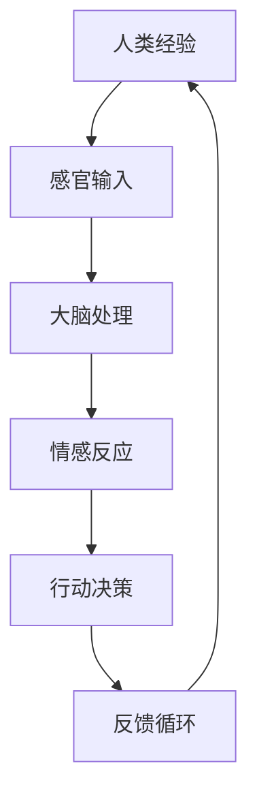

                 

关键词：人工智能，体验，创新，技术进步，未来发展

> 摘要：随着人工智能技术的迅猛发展，人类体验正发生着翻天覆地的变化。本文将探讨人工智能如何开启新的想象空间，改变我们的生活方式，以及未来可能面临的挑战。

## 1. 背景介绍

人工智能（AI）作为一种模拟人类智能行为的技术，正在全球范围内迅速发展。从最初的规则驱动到基于统计学习，再到如今的深度学习和强化学习，AI技术已经取得了显著的进步。如今，AI不仅应用于传统的计算机科学领域，还在医疗、金融、交通、教育等多个行业得到了广泛应用。

### 1.1 人工智能的发展历程

- **1956年**：达特茅斯会议，人工智能概念首次被提出。
- **1960-1970年代**：基于规则的方法占据主导地位。
- **1980-1990年代**：专家系统成为主流。
- **2000年代**：机器学习开始流行，尤其是基于神经网络的算法。
- **2010年代至今**：深度学习引领AI技术进步，应用场景不断扩展。

### 1.2 人工智能的核心技术

- **机器学习**：通过数据驱动的方式让计算机自行学习和改进。
- **深度学习**：利用多层神经网络进行复杂模式识别。
- **自然语言处理（NLP）**：使计算机能够理解和生成人类语言。
- **计算机视觉**：使计算机能够理解和解释视觉信息。

## 2. 核心概念与联系

为了更好地理解人工智能如何影响体验，我们需要先掌握几个核心概念，并在它们之间建立联系。以下是几个关键概念以及它们之间的Mermaid流程图：



### 2.1 感官输入

感官输入是指从外部环境接收到的信息，包括视觉、听觉、触觉、嗅觉和味觉。在人工智能系统中，这些输入通常被传感器和摄像头等设备采集。

### 2.2 大脑处理

大脑处理是指对感官输入进行分析、解释和整合的过程。在人工智能系统中，这一过程由算法和模型来完成，例如深度神经网络。

### 2.3 情感反应

情感反应是指对处理后的信息产生的情感反应。在人工智能系统中，通过机器学习算法，系统可以学会如何根据输入数据产生相应的情感反应。

### 2.4 行动决策

行动决策是指根据情感反应采取的具体行动。在人工智能系统中，这一过程可以通过优化算法和强化学习来实现。

### 2.5 反馈循环

反馈循环是指系统根据行动结果进行调整，以便更好地适应环境。在人工智能系统中，这一过程通过不断迭代和学习来实现。

## 3. 核心算法原理 & 具体操作步骤

### 3.1 算法原理概述

人工智能的核心算法包括机器学习、深度学习和强化学习。以下是这些算法的基本原理：

- **机器学习**：通过训练数据集，让计算机自动识别数据中的模式。
- **深度学习**：利用多层神经网络进行复杂模式识别。
- **强化学习**：通过试错和反馈机制，让计算机在特定环境中做出最佳决策。

### 3.2 算法步骤详解

- **机器学习**：
  1. 数据收集：获取大量带有标签的数据。
  2. 数据预处理：清洗和规范化数据。
  3. 特征提取：从数据中提取有用的特征。
  4. 模型训练：使用训练数据集训练模型。
  5. 模型评估：使用验证数据集评估模型性能。
  6. 模型优化：调整模型参数，提高性能。

- **深度学习**：
  1. 网络架构设计：设计合适的神经网络架构。
  2. 数据输入：将输入数据输入到神经网络中。
  3. 前向传播：通过神经网络计算输出。
  4. 后向传播：根据损失函数计算梯度，更新网络参数。
  5. 优化：使用优化算法（如梯度下降）优化网络参数。

- **强化学习**：
  1. 环境设定：定义环境和目标。
  2. 行动选择：根据当前状态选择行动。
  3. 状态更新：根据行动结果更新状态。
  4. 奖励计算：计算奖励值，用于评估行动效果。
  5. 学习更新：根据奖励值更新策略。

### 3.3 算法优缺点

- **机器学习**：
  - 优点：可以处理大量数据，自动识别模式。
  - 缺点：对数据质量要求高，可能存在过拟合问题。

- **深度学习**：
  - 优点：可以处理复杂的非线性问题。
  - 缺点：计算资源消耗大，对数据量要求较高。

- **强化学习**：
  - 优点：适用于动态环境，可以学习复杂的策略。
  - 缺点：学习过程较慢，对奖励函数设计要求高。

### 3.4 算法应用领域

- **机器学习**：应用于图像识别、语音识别、自然语言处理等领域。
- **深度学习**：应用于自动驾驶、智能医疗、智能金融等领域。
- **强化学习**：应用于游戏、机器人控制、智能交通等领域。

## 4. 数学模型和公式 & 详细讲解 & 举例说明

### 4.1 数学模型构建

在人工智能中，常用的数学模型包括神经网络、决策树、支持向量机等。以下是神经网络的基本构建：

- **输入层**：接收外部输入数据。
- **隐藏层**：对输入数据进行处理和转换。
- **输出层**：生成最终输出。

神经网络中的每个节点（神经元）都可以表示为以下公式：

$$
z = \sum_{i=1}^{n} w_{i}x_{i} + b
$$

其中，$z$ 是节点的输出，$w_{i}$ 是权重，$x_{i}$ 是输入值，$b$ 是偏置。

### 4.2 公式推导过程

以神经网络为例，我们通过以下步骤进行公式推导：

1. **前向传播**：
   - 将输入数据传递到隐藏层。
   - 使用激活函数（如ReLU、Sigmoid、Tanh）处理隐藏层节点。

2. **反向传播**：
   - 计算输出层节点的误差。
   - 误差反向传播到隐藏层，更新权重和偏置。

3. **优化**：
   - 使用梯度下降等优化算法更新网络参数。

### 4.3 案例分析与讲解

以图像分类任务为例，我们使用神经网络进行图像识别：

1. **数据预处理**：
   - 将图像转换为灰度值。
   - 将图像缩放到相同大小。

2. **网络构建**：
   - 设计一个三层神经网络（输入层、隐藏层、输出层）。
   - 选择合适的激活函数。

3. **模型训练**：
   - 使用大量训练数据训练网络。
   - 调整网络参数，优化模型性能。

4. **模型评估**：
   - 使用验证数据集评估模型性能。
   - 调整模型参数，提高准确性。

## 5. 项目实践：代码实例和详细解释说明

### 5.1 开发环境搭建

- 安装Python环境。
- 安装TensorFlow库。

### 5.2 源代码详细实现

```python
import tensorflow as tf

# 创建神经网络模型
model = tf.keras.Sequential([
    tf.keras.layers.Dense(128, activation='relu', input_shape=(784,)),
    tf.keras.layers.Dense(10, activation='softmax')
])

# 编译模型
model.compile(optimizer='adam',
              loss='categorical_crossentropy',
              metrics=['accuracy'])

# 加载MNIST数据集
(x_train, y_train), (x_test, y_test) = tf.keras.datasets.mnist.load_data()

# 数据预处理
x_train = x_train / 255.0
x_test = x_test / 255.0
x_train = x_train.reshape(-1, 784)
x_test = x_test.reshape(-1, 784)

# 训练模型
model.fit(x_train, y_train, epochs=5)

# 评估模型
model.evaluate(x_test, y_test)
```

### 5.3 代码解读与分析

- **导入库**：导入TensorFlow库。
- **创建模型**：定义一个简单的神经网络模型，包含一个输入层、一个隐藏层和一个输出层。
- **编译模型**：设置优化器、损失函数和评估指标。
- **加载数据**：加载MNIST数据集，并进行预处理。
- **训练模型**：使用训练数据进行模型训练。
- **评估模型**：使用测试数据进行模型评估。

## 6. 实际应用场景

### 6.1 医疗领域

- **疾病诊断**：利用AI技术对医学图像进行分析，提高疾病诊断的准确性和效率。
- **个性化治疗**：根据患者的基因数据和病情，提供个性化的治疗方案。

### 6.2 金融领域

- **风险控制**：利用AI技术对金融数据进行分析，识别潜在的风险。
- **智能投顾**：根据用户的投资目标和风险偏好，提供个性化的投资建议。

### 6.3 交通领域

- **自动驾驶**：利用AI技术实现自动驾驶，提高交通安全和效率。
- **智能交通管理**：通过分析交通数据，优化交通流量，减少拥堵。

## 7. 工具和资源推荐

### 7.1 学习资源推荐

- 《深度学习》（Ian Goodfellow, Yoshua Bengio, Aaron Courville）
- 《Python机器学习》（Sebastian Raschka）

### 7.2 开发工具推荐

- TensorFlow
- PyTorch

### 7.3 相关论文推荐

- “A Theoretical Framework for Back-Propagating Neural Networks”（Rumelhart, Hinton, Williams）
- “Deep Learning”（Yoshua Bengio，Yann LeCun，Geoffrey Hinton）

## 8. 总结：未来发展趋势与挑战

### 8.1 研究成果总结

- AI技术已经取得了显著的进步，广泛应用于各个领域。
- 机器学习、深度学习和强化学习等核心算法不断优化，性能不断提高。

### 8.2 未来发展趋势

- AI技术将继续向通用人工智能（AGI）迈进。
- 人工智能将更加智能化、自动化，改变我们的生活和工作方式。

### 8.3 面临的挑战

- 数据隐私和安全问题。
- 道德和伦理问题。
- 技术普及和人才培养问题。

### 8.4 研究展望

- 进一步优化算法，提高计算效率和准确性。
- 探索AI在新兴领域的应用，如量子计算、生物技术等。
- 加强国际合作，推动AI技术的全球发展。

## 9. 附录：常见问题与解答

### 9.1 什么是深度学习？

深度学习是一种基于多层神经网络的学习方法，旨在自动提取数据中的复杂特征，实现图像识别、语音识别等任务。

### 9.2 机器学习与深度学习的区别是什么？

机器学习是一种更广泛的概念，包括深度学习。深度学习是机器学习的一个子领域，专注于使用多层神经网络进行复杂模式识别。

### 9.3 如何处理过拟合问题？

可以通过数据增强、正则化、交叉验证等方法来处理过拟合问题。

## 作者署名

作者：禅与计算机程序设计艺术 / Zen and the Art of Computer Programming
----------------------------------------------------------------

以上是关于《体验的无限可能：AI开启的想象空间》的完整文章。希望这篇文章能够帮助读者更好地理解人工智能技术，以及它对未来社会的影响。随着AI技术的不断发展，我们期待能够创造一个更加智能、便捷、美好的未来。

