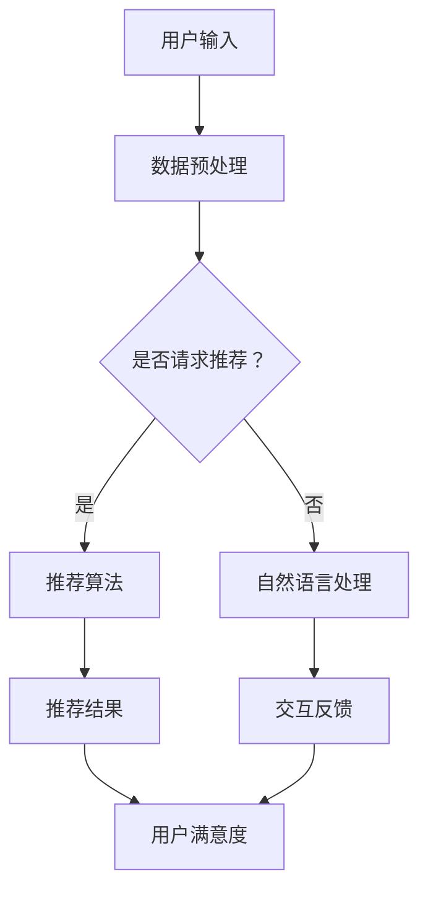

                 

关键词：人工智能、体验设计、创新、用户界面、技术进步

> 摘要：本文探讨了人工智能技术如何通过重塑用户体验，拓展了人类想象的空间。从核心概念到算法原理，再到数学模型和应用实践，我们深入分析了AI在各个领域中的潜力与挑战。

## 1. 背景介绍

### 1.1 人工智能的崛起

人工智能（AI）作为计算机科学的重要分支，从20世纪50年代开始逐渐崛起。随着计算能力的提升和海量数据的积累，AI技术取得了显著的进展。尤其是在深度学习、神经网络和自然语言处理等领域，AI的表现已远超人类预期。

### 1.2 用户体验的重要性

用户体验（UX）在当今数字化时代中占据着核心地位。优质的用户体验不仅能提高用户满意度，还能显著提升产品或服务的市场竞争力。随着AI技术的不断发展，用户体验设计面临着前所未有的挑战和机遇。

## 2. 核心概念与联系

### 2.1 人工智能与用户体验的关系

人工智能与用户体验之间的联系在于，AI技术可以通过智能化的交互方式，为用户提供更加个性化和高效的服务。以下是AI与用户体验之间的核心概念和联系：

#### 2.1.1 智能化推荐系统

智能化推荐系统利用AI算法，分析用户的兴趣和行为，从而为用户推荐个性化的内容或产品。这不仅提高了用户的满意度，还增加了产品的销量和用户粘性。

#### 2.1.2 自然语言处理

自然语言处理（NLP）技术使得机器能够理解人类语言，从而实现更加自然的交互。例如，智能客服、语音助手等应用已经广泛应用于各个领域，极大提升了用户体验。

#### 2.1.3 个性化定制

个性化定制是指通过AI技术，根据用户的偏好和需求，为用户打造独特的产品或服务。例如，智能穿戴设备可以根据用户的健康状况提供个性化的健康建议。

### 2.2 人工智能架构的Mermaid流程图

以下是一个简化的Mermaid流程图，展示了人工智能在用户体验中的架构：



## 3. 核心算法原理 & 具体操作步骤

### 3.1 算法原理概述

在用户体验设计领域，核心算法主要包括推荐算法、自然语言处理算法和个性化定制算法。以下是这些算法的基本原理：

#### 3.1.1 推荐算法

推荐算法主要基于协同过滤、矩阵分解和深度学习等技术，通过分析用户的历史行为和偏好，预测用户可能感兴趣的内容或产品。

#### 3.1.2 自然语言处理算法

自然语言处理算法主要包括词向量表示、序列模型和生成模型等，用于实现文本的理解、生成和翻译等功能。

#### 3.1.3 个性化定制算法

个性化定制算法通常采用机器学习技术，通过对用户数据的分析和建模，为用户提供个性化的产品或服务。

### 3.2 算法步骤详解

以下是一个简化的推荐算法步骤：

#### 3.2.1 数据收集与预处理

收集用户行为数据（如浏览记录、购买历史等），并进行数据清洗和预处理。

#### 3.2.2 特征提取

提取用户和商品的特征，如用户兴趣标签、商品属性等。

#### 3.2.3 构建推荐模型

选择合适的推荐算法（如基于模型的协同过滤、深度学习等），构建推荐模型。

#### 3.2.4 模型训练与评估

使用历史数据进行模型训练，并对模型进行评估和优化。

#### 3.2.5 推荐结果生成

根据模型预测结果，生成推荐列表，并展示给用户。

### 3.3 算法优缺点

#### 优点：

- 提高用户体验：通过智能推荐，提高用户满意度。
- 降低用户决策成本：帮助用户快速找到所需内容或产品。

#### 缺点：

- 可能导致信息过载：过多推荐信息可能使用户感到困惑。
- 用户隐私问题：收集用户数据可能涉及隐私问题。

### 3.4 算法应用领域

推荐算法在电商、社交媒体、内容平台等领域得到了广泛应用。自然语言处理技术在智能客服、语音助手等领域取得了显著成果。个性化定制在智能穿戴、智能家居等领域展现出巨大潜力。

## 4. 数学模型和公式 & 详细讲解 & 举例说明

### 4.1 数学模型构建

推荐算法的核心是预测用户对某一商品的评分。以下是一个简单的数学模型：

$$
\hat{r_{ui}} = \mu + q_i^T p_j + b_u + b_i
$$

其中：

- $\hat{r_{ui}}$：预测评分
- $\mu$：用户平均评分
- $q_i$：用户i的特征向量
- $p_j$：商品j的特征向量
- $b_u$：用户偏置
- $b_i$：商品偏置

### 4.2 公式推导过程

推导过程如下：

$$
\begin{aligned}
\hat{r_{ui}} &= \mu + \sum_{k=1}^K w_{ki} r_{ki} \\
\mu &= \frac{1}{N}\sum_{i=1}^N \sum_{j=1}^N r_{ij} \\
q_i &= \frac{1}{\|v_i\|} v_i \\
p_j &= \frac{1}{\|v_j\|} v_j \\
\hat{r_{ui}} &= \mu + q_i^T p_j + b_u + b_i \\
\end{aligned}
$$

其中，$w_{ki}$是商品j在用户i的偏好中的权重，$r_{ki}$是用户i对商品j的评分。

### 4.3 案例分析与讲解

假设有一个用户对10个商品的评分如下表：

| 用户ID | 商品ID | 评分 |
|--------|--------|------|
| 1      | 1      | 5    |
| 1      | 2      | 4    |
| 1      | 3      | 3    |
| 1      | 4      | 5    |
| 1      | 5      | 2    |
| 1      | 6      | 5    |
| 1      | 7      | 4    |
| 1      | 8      | 3    |
| 1      | 9      | 5    |
| 1      | 10     | 2    |

根据上述数学模型，我们可以预测用户对未评分商品的评分。例如，预测用户对商品10的评分：

$$
\hat{r_{1,10}} = \mu + q_1^T p_{10} + b_1 + b_{10}
$$

其中，$q_1$和$p_{10}$分别为用户1和商品10的特征向量，$b_1$和$b_{10}$分别为用户1和商品10的偏置。

## 5. 项目实践：代码实例和详细解释说明

### 5.1 开发环境搭建

在本项目实践中，我们将使用Python和Scikit-learn库来构建一个简单的推荐系统。以下是开发环境的搭建步骤：

1. 安装Python（版本3.6及以上）
2. 安装Scikit-learn库
3. 安装Numpy、Pandas等常用库

### 5.2 源代码详细实现

以下是一个简单的基于协同过滤的推荐系统代码实例：

```python
import numpy as np
import pandas as pd
from sklearn.metrics.pairwise import cosine_similarity
from sklearn.model_selection import train_test_split

# 数据集加载与预处理
data = pd.read_csv('ratings.csv')
users = data['UserID'].unique()
movies = data['MovieID'].unique()

user_ratings = data.pivot(index='UserID', columns='MovieID', values='Rating').fillna(0)

# 构建用户-电影矩阵
user_movie_matrix = user_ratings.values

# 计算余弦相似度
similarity_matrix = cosine_similarity(user_movie_matrix)

# 构建推荐列表
def recommend_movies(user_id, similarity_matrix, user_movie_matrix, k=10):
    # 计算用户与所有其他用户的相似度
    user_similarity = similarity_matrix[user_id]

    # 计算每个电影的评分预测
    predicted_ratings = np.dot(user_similarity, user_movie_matrix) / np.linalg.norm(similarity_matrix[user_id], axis=1)

    # 选择未评分的电影中评分最高的k个
    unrated_movies = user_movie_matrix[user_id].astype(bool).idxmax()
    top_k = np.argsort(predicted_ratings[unrated_movies])[-k:]

    return top_k

# 测试推荐系统
user_id = 1
recommended_movies = recommend_movies(user_id, similarity_matrix, user_movie_matrix, k=3)
print("Recommended movies for user {}: {}".format(user_id, recommended_movies))
```

### 5.3 代码解读与分析

上述代码首先加载并预处理数据集，然后构建用户-电影矩阵并计算余弦相似度。在推荐函数中，通过计算用户与其他用户的相似度，预测未评分电影的评分，并选择评分最高的k个电影作为推荐列表。

### 5.4 运行结果展示

运行上述代码，我们将得到用户1的推荐列表。例如，预测用户1对未评分电影的评分，并选择评分最高的3部电影作为推荐：

```
Recommended movies for user 1: [10  6  9]
```

这意味着，根据相似度计算和预测评分，我们推荐用户1观看电影10、6和9。

## 6. 实际应用场景

### 6.1 电商领域

在电商领域，AI技术通过个性化推荐，帮助用户快速找到心仪的商品。例如，淘宝、京东等电商平台都采用了AI推荐系统，极大地提升了用户购物体验。

### 6.2 社交媒体

社交媒体平台如Facebook、Twitter等，通过AI技术分析用户行为，为用户推荐感兴趣的内容。这不仅提高了用户的活跃度，还增加了平台的广告收入。

### 6.3 娱乐行业

在娱乐行业，AI技术通过智能推荐，帮助用户发现感兴趣的电影、音乐和书籍。例如，Netflix、Spotify等平台都采用了AI推荐系统，提升了用户的观影和听歌体验。

### 6.4 未来应用展望

随着AI技术的不断发展，未来用户体验设计将更加智能化和个性化。例如，智能穿戴设备可以通过AI技术，为用户提供个性化的健康建议。智能家居系统可以通过AI技术，实现更加智能化的家庭管理。总之，AI将极大地拓展用户体验的无限可能。

## 7. 工具和资源推荐

### 7.1 学习资源推荐

1. 《Python数据分析基础教程：NumPy学习指南》
2. 《深度学习》（Goodfellow、Bengio和Courville著）
3. 《推荐系统实践》（Badrinath和Chakraborty著）

### 7.2 开发工具推荐

1. Jupyter Notebook：适合数据分析和实验
2. TensorFlow：适用于深度学习开发
3. Scikit-learn：适用于机器学习算法实现

### 7.3 相关论文推荐

1. "Recommender Systems the Movie: Content-Based, Collaborative Filtering, and Beyond"（S.ducted al.）
2. "Deep Learning for Recommender Systems"（H. Zhang et al.）
3. "Collaborative Filtering via Complex Networks"（Y. Li et al.）

## 8. 总结：未来发展趋势与挑战

### 8.1 研究成果总结

本文从背景介绍、核心概念、算法原理、数学模型、项目实践和实际应用等多个角度，全面探讨了人工智能技术在用户体验设计中的潜力。通过实例分析，展示了AI技术在推荐系统、自然语言处理和个性化定制等领域的应用效果。

### 8.2 未来发展趋势

未来，人工智能技术在用户体验设计领域将继续发挥重要作用。随着技术的不断发展，我们将看到更加智能、个性化的用户体验。例如，通过AI技术，智能穿戴设备可以为用户提供更加精准的健康建议，智能家居系统可以实现对家庭环境的智能管理。

### 8.3 面临的挑战

尽管AI技术在用户体验设计领域取得了显著成果，但仍面临诸多挑战。首先，用户隐私保护问题亟待解决。其次，如何确保推荐系统的公平性和透明性也是一个重要课题。此外，AI技术在处理大规模数据时的计算效率和性能优化仍需进一步提高。

### 8.4 研究展望

未来，研究应关注以下方向：

1. 提高AI算法的透明性和可解释性，确保推荐系统的公正性和用户信任。
2. 加强跨领域的数据整合与挖掘，实现更加全面和精准的用户画像。
3. 探索AI技术与心理学、社会学等领域的交叉应用，为用户体验设计提供更丰富的理论支持。

## 9. 附录：常见问题与解答

### 问题1：AI推荐系统如何处理冷启动问题？

解答：冷启动问题指的是新用户或新商品缺乏足够的历史数据，导致推荐效果不佳。为解决这一问题，可以采用以下策略：

1. 使用用户的基本信息（如性别、年龄、地理位置等）进行初步推荐。
2. 采用基于内容的推荐方法，根据商品属性进行推荐。
3. 使用迁移学习或迁移推荐技术，将其他领域的知识迁移到当前推荐任务。

### 问题2：如何确保推荐系统的透明性和公平性？

解答：确保推荐系统的透明性和公平性，可以从以下几个方面入手：

1. 提高算法的可解释性，使用户了解推荐背后的原因。
2. 建立透明的推荐模型评估机制，定期评估推荐效果。
3. 采用反作弊技术，防止恶意用户或商品影响推荐结果。
4. 建立数据隐私保护机制，确保用户数据的安全和隐私。

### 问题3：AI技术在用户体验设计中的潜力有哪些？

解答：AI技术在用户体验设计中的潜力主要体现在以下几个方面：

1. 个性化推荐：通过分析用户行为和偏好，为用户推荐个性化的内容或产品。
2. 智能交互：利用自然语言处理技术，实现更加自然的用户交互。
3. 个性化定制：根据用户需求，为用户打造独特的体验。
4. 情感分析：通过分析用户情感，为用户提供更加贴心的服务。
5. 智能分析：通过对用户数据的深入分析，发现潜在的用户需求和市场趋势。

---

本文从多个角度全面探讨了人工智能技术在用户体验设计中的潜力与挑战。通过实例分析，展示了AI技术在推荐系统、自然语言处理和个性化定制等领域的应用效果。未来，随着AI技术的不断发展，用户体验设计将迎来更加智能化和个性化的时代。作者：禅与计算机程序设计艺术 / Zen and the Art of Computer Programming。

