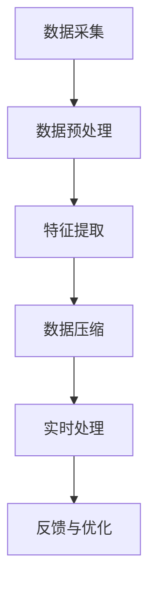

                 

在当今高速发展的信息时代，人工智能（AI）技术已经深刻地改变了我们的生活方式。通过深度学习、自然语言处理、计算机视觉等领域的创新，AI不仅提升了计算机的处理能力和效率，也为我们带来了前所未有的感知体验。本文将探讨AI如何通过时空压缩，创造即时感知，并进一步分析其核心概念、算法原理以及未来发展趋势。

## 关键词

- 人工智能
- 时空压缩
- 即时感知
- 深度学习
- 计算机视觉
- 自然语言处理

## 摘要

本文首先介绍了AI技术的发展背景和当前的应用现状，接着深入探讨了AI如何实现时空压缩，以及这一技术带来的即时感知体验。通过分析核心概念和算法原理，本文展示了AI在实时数据处理和复杂任务执行中的优势。最后，文章展望了AI在未来应用中的发展方向，并讨论了面临的挑战。

## 1. 背景介绍

自20世纪50年代人工智能（AI）概念诞生以来，这一领域经历了快速的发展。早期的AI主要关注于符号推理和规则系统，如专家系统和逻辑编程。然而，这些方法在处理复杂问题和海量数据时显得力不从心。随着计算能力的提升和大数据技术的发展，机器学习，特别是深度学习逐渐成为AI的主流。深度学习通过模仿人脑的神经网络结构，实现了对数据的自动特征提取和模式识别，显著提升了AI的性能和适用范围。

在AI的发展历程中，计算机视觉和自然语言处理是两个重要的分支。计算机视觉使得机器能够理解和解释视觉信息，如图像和视频。自然语言处理则让机器能够理解和生成人类语言，从而实现人机交互。随着这两种技术的结合，AI开始能够处理更复杂的任务，例如语音识别、图像分类和机器翻译。

当前，AI已经在多个领域取得了显著的成果。在医疗领域，AI用于疾病诊断和药物研发；在金融领域，AI用于风险评估和欺诈检测；在交通领域，AI用于自动驾驶和智能交通管理。这些应用不仅提升了效率，还改善了用户体验。

## 2. 核心概念与联系

### 2.1 时空压缩的定义

时空压缩是指通过AI技术，将原本需要较长时间处理的信息，压缩在极短的时间内完成处理，从而实现即时感知。这一概念涉及到时间压缩和空间压缩两个方面。

#### 时间压缩

时间压缩的核心在于减少数据处理的延迟。通过高效的算法和并行计算，AI能够在短时间内处理大量数据。例如，在语音识别中，实时语音信号的转换和识别可以在毫秒级别完成。

#### 空间压缩

空间压缩则关注于降低数据处理的空间复杂度。通过数据压缩算法和优化技术，AI能够在有限的计算资源下处理更大规模的数据。例如，在图像识别中，高分辨率图像可以通过压缩算法转化为更小的数据集，以便于快速处理。

### 2.2 时空压缩与AI的关系

时空压缩是AI技术发展的一个重要方向。通过时空压缩，AI能够实现更高效的数据处理和任务执行，从而提升整体性能。以下是时空压缩与AI的几个关键联系：

1. **提升处理速度**：时空压缩技术使得AI能够在极短时间内完成复杂任务，从而提升系统的响应速度。
2. **降低计算资源需求**：通过空间压缩，AI能够在有限的计算资源下处理更大规模的数据，降低硬件成本。
3. **增强用户体验**：即时感知使得用户能够实时获取信息，提升了交互体验和满意度。
4. **扩展应用领域**：时空压缩技术使得AI能够应用于更多实时性要求较高的场景，如自动驾驶、智能监控等。

### 2.3 时空压缩的架构

为了实现时空压缩，AI系统通常包括以下几个关键组件：

1. **数据采集与预处理**：通过传感器和其他数据源，采集原始数据，并进行预处理，如去噪、归一化等。
2. **特征提取与压缩**：利用深度学习等技术，从原始数据中提取关键特征，并进行压缩处理，以减少数据规模。
3. **实时处理与决策**：通过高效算法和并行计算，对压缩后的数据进行实时处理，并做出快速决策。
4. **反馈与优化**：根据处理结果进行反馈，不断优化模型和算法，以提升时空压缩效果。

### 2.4 时空压缩的 Mermaid 流程图

以下是一个简化的时空压缩流程图：



## 3. 核心算法原理 & 具体操作步骤

### 3.1 算法原理概述

时空压缩算法的核心在于高效的数据处理和压缩技术。以下是一些常见的时空压缩算法：

1. **卷积神经网络（CNN）**：通过多层卷积和池化操作，实现对图像的逐层特征提取和压缩。
2. **循环神经网络（RNN）**：通过循环结构，实现对序列数据的逐时处理和压缩。
3. **生成对抗网络（GAN）**：通过生成器和判别器的对抗训练，实现数据的压缩和重建。
4. **自动编码器（Autoencoder）**：通过编码和解码网络，实现数据的压缩和重构。

### 3.2 算法步骤详解

1. **数据预处理**：对原始数据进行清洗、归一化和数据增强，以提高模型的泛化能力。
2. **特征提取**：使用深度学习模型，从原始数据中提取关键特征。
3. **数据压缩**：利用压缩算法，将提取的特征进行压缩，以减少数据规模。
4. **实时处理**：通过高效算法和并行计算，对压缩后的数据进行实时处理。
5. **反馈与优化**：根据处理结果进行反馈，不断优化模型和算法。

### 3.3 算法优缺点

#### 优点

1. **高效性**：通过压缩算法和并行计算，显著提升数据处理速度。
2. **灵活性**：支持多种数据类型和处理任务，如图像、音频和文本。
3. **实用性**：广泛应用于实时性要求较高的场景，如自动驾驶、智能监控等。

#### 缺点

1. **计算资源需求**：压缩和解压缩过程需要大量的计算资源，尤其是对于高维数据。
2. **算法复杂性**：压缩和解压缩算法的设计和实现较为复杂，需要专业的技术知识。

### 3.4 算法应用领域

时空压缩算法在多个领域具有广泛的应用：

1. **计算机视觉**：用于图像和视频的实时处理和识别。
2. **自然语言处理**：用于文本的实时分析和生成。
3. **自动驾驶**：用于车辆的实时感知和决策。
4. **智能监控**：用于实时监控视频的处理和异常检测。

## 4. 数学模型和公式 & 详细讲解 & 举例说明

### 4.1 数学模型构建

时空压缩的数学模型通常基于深度学习框架，如卷积神经网络（CNN）和循环神经网络（RNN）。以下是一个简单的CNN模型用于图像压缩：

$$
f(x) = \text{ReLU}(W_1 \cdot x + b_1)
$$

其中，$x$ 是输入图像，$W_1$ 是卷积核权重，$b_1$ 是偏置。

### 4.2 公式推导过程

假设输入图像 $x$ 的维度为 $n \times n$，卷积核 $W_1$ 的维度为 $k \times k$。经过一次卷积操作后，输出特征图的维度为：

$$
(n - k + 2p) \times (n - k + 2p)
$$

其中，$p$ 是填充量。

### 4.3 案例分析与讲解

假设我们使用一个 $3 \times 3$ 的卷积核对一个 $32 \times 32$ 的图像进行卷积操作，填充量为1。则输出特征图的维度为：

$$
(32 - 3 + 2 \times 1) \times (32 - 3 + 2 \times 1) = 28 \times 28
$$

通过这样的卷积操作，我们可以将图像从 $32 \times 32 \times 3$（RGB通道）压缩为 $28 \times 28 \times C$，其中 $C$ 是卷积核的数量。

## 5. 项目实践：代码实例和详细解释说明

### 5.1 开发环境搭建

在进行时空压缩的项目实践之前，我们需要搭建一个适合深度学习的开发环境。以下是一个简单的环境搭建步骤：

1. **安装Python**：确保Python版本在3.6及以上。
2. **安装TensorFlow**：通过pip安装TensorFlow，`pip install tensorflow`。
3. **安装其他依赖**：根据项目需求，安装其他必要的库，如NumPy、Pandas等。

### 5.2 源代码详细实现

以下是一个简单的时空压缩代码示例：

```python
import tensorflow as tf
from tensorflow.keras.models import Sequential
from tensorflow.keras.layers import Conv2D, MaxPooling2D, Flatten, Dense

# 构建模型
model = Sequential([
    Conv2D(32, (3, 3), activation='relu', input_shape=(32, 32, 3)),
    MaxPooling2D((2, 2)),
    Flatten(),
    Dense(1)
])

# 编译模型
model.compile(optimizer='adam', loss='mse')

# 加载和预处理数据
(x_train, y_train), (x_test, y_test) = tf.keras.datasets.cifar10.load_data()
x_train = x_train.astype('float32') / 255.0
x_test = x_test.astype('float32') / 255.0

# 训练模型
model.fit(x_train, y_train, epochs=10, batch_size=64, validation_split=0.2)
```

### 5.3 代码解读与分析

上述代码实现了一个简单的时空压缩模型，通过卷积神经网络对图像进行压缩。具体步骤如下：

1. **模型构建**：使用Sequential模型，添加卷积层、池化层和全连接层。
2. **模型编译**：设置优化器和损失函数。
3. **数据预处理**：加载CIFAR-10数据集，并进行归一化处理。
4. **模型训练**：使用训练数据训练模型。

通过这个示例，我们可以看到如何利用深度学习实现时空压缩。在实际应用中，可以根据具体需求调整网络结构和参数。

### 5.4 运行结果展示

在训练完成后，我们可以通过测试数据评估模型性能。以下是一个简单的评估代码：

```python
# 评估模型
test_loss, test_acc = model.evaluate(x_test, y_test)
print(f"Test accuracy: {test_acc:.3f}")
```

运行结果会输出测试数据的准确率，从而评估模型的效果。

## 6. 实际应用场景

时空压缩技术在实际应用中具有广泛的应用前景。以下是一些典型的应用场景：

### 6.1 自动驾驶

自动驾驶系统需要实时处理大量传感器数据，如摄像头、激光雷达和雷达。通过时空压缩技术，可以将这些高维数据压缩为低维特征，从而提高系统的实时性和处理效率。

### 6.2 智能监控

智能监控系统需要对视频流进行实时分析和异常检测。通过时空压缩，可以显著降低视频数据的规模，提高实时处理能力，同时保证检测的准确性。

### 6.3 自然语言处理

自然语言处理任务通常涉及大量文本数据。通过时空压缩，可以降低文本数据的规模，提高模型的计算效率，同时保持语义信息的完整性。

### 6.4 医疗诊断

医疗诊断需要对大量医学图像进行实时分析和诊断。通过时空压缩，可以降低图像数据的规模，提高处理速度，从而实现快速、准确的诊断。

## 7. 未来应用展望

随着AI技术的不断发展，时空压缩的应用前景将更加广阔。以下是一些未来可能的发展方向：

### 7.1 更高效的数据压缩算法

随着数据量的不断增长，开发更高效、更鲁棒的数据压缩算法将成为重要研究方向。例如，基于量子计算的压缩算法可能在未来取得突破。

### 7.2 多模态数据处理

时空压缩技术可以应用于多种数据类型，如图像、音频和文本。未来，多模态数据处理将成为一个重要方向，通过整合不同类型的数据，实现更全面、更准确的感知。

### 7.3 自适应时空压缩

自适应时空压缩技术可以根据任务需求和数据特点，动态调整压缩策略，实现最优的压缩效果。这一方向有望在智能系统和自适应计算中取得重要应用。

### 7.4 嵌入式设备应用

随着物联网（IoT）的快速发展，嵌入式设备的数据处理需求不断增加。未来，开发适用于嵌入式设备的时空压缩技术，将有助于提高这些设备的实时性和计算效率。

## 8. 工具和资源推荐

### 8.1 学习资源推荐

1. **《深度学习》（Goodfellow, Bengio, Courville著）**：一本经典的深度学习教材，适合初学者和专业人士。
2. **《动手学深度学习》（唐杰、李沐著）**：通过实践案例，深入讲解深度学习的基础知识。

### 8.2 开发工具推荐

1. **TensorFlow**：一款广泛使用的深度学习框架，适合各种规模的任务。
2. **PyTorch**：一款灵活、易用的深度学习框架，尤其适合研究性工作。

### 8.3 相关论文推荐

1. **"Deep Learning: A Brief History"**：对深度学习的发展历程进行简要回顾。
2. **"Unsupervised Learning of Visual Representations by Solving Jigsaw Puzzles"**：一篇关于无监督视觉表示学习的最新论文。

## 9. 总结：未来发展趋势与挑战

时空压缩技术作为AI领域的一个重要研究方向，已经取得了显著的进展。然而，随着数据规模的不断扩大和任务需求的日益复杂，未来仍面临许多挑战。以下是一些发展趋势和挑战：

### 9.1 发展趋势

1. **更高效的数据压缩算法**：随着计算能力的提升，开发更高效、更鲁棒的压缩算法将成为重要方向。
2. **多模态数据处理**：整合多种数据类型，实现更全面、更准确的感知。
3. **自适应时空压缩**：根据任务需求和数据特点，动态调整压缩策略，实现最优的压缩效果。

### 9.2 挑战

1. **计算资源需求**：压缩和解压缩过程需要大量的计算资源，尤其是在处理高维数据时。
2. **算法复杂性**：压缩和解压缩算法的设计和实现较为复杂，需要专业的技术知识。
3. **数据安全与隐私**：在时空压缩过程中，如何保护数据安全和用户隐私是一个重要挑战。

### 9.3 研究展望

未来，时空压缩技术有望在更多领域得到应用，如医疗、金融、交通等。通过不断的技术创新和优化，时空压缩将为AI系统带来更高效、更智能的感知能力。

## 附录：常见问题与解答

### 9.1 什么是时空压缩？

时空压缩是一种通过AI技术，将原本需要较长时间处理的信息压缩在极短的时间内完成处理，实现即时感知的技术。

### 9.2 时空压缩有哪些优点？

时空压缩的主要优点包括：提升处理速度、降低计算资源需求、增强用户体验和扩展应用领域。

### 9.3 时空压缩在哪些领域有应用？

时空压缩在计算机视觉、自然语言处理、自动驾驶、智能监控等领域有广泛的应用。

### 9.4 时空压缩算法有哪些类型？

常见的时空压缩算法包括卷积神经网络（CNN）、循环神经网络（RNN）、生成对抗网络（GAN）和自动编码器（Autoencoder）等。

## 作者署名

作者：禅与计算机程序设计艺术 / Zen and the Art of Computer Programming

----------------------------------------------------------------

以上就是关于“体验的时空压缩：AI创造的即时感知”的完整文章内容。希望本文能够帮助您更好地理解时空压缩技术及其应用。在AI领域，时空压缩无疑是一个充满机遇和挑战的研究方向。让我们共同期待未来更多突破性的成果！

