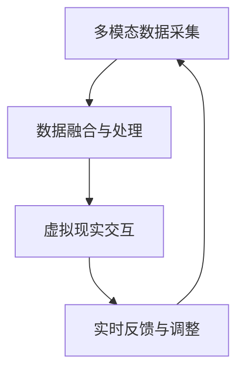

                 

关键词：AI、跨维度感知、时空穿越、用户体验、技术架构

> 摘要：本文探讨了人工智能技术如何创造出一种全新的用户体验，通过跨维度感知技术，实现用户在虚拟与现实之间的无缝穿越。文章将详细分析相关技术原理，展示实际应用案例，并探讨未来发展趋势和面临的挑战。

## 1. 背景介绍

随着科技的飞速发展，人工智能（AI）技术已经在各个领域取得了显著的成果。从语音识别到自然语言处理，从图像识别到自动驾驶，AI技术正在深刻地改变着我们的生活方式。然而，这些传统领域的AI应用主要局限于二维或三维的空间中，无法真正实现用户在虚拟与现实之间的自由穿梭。

跨维度感知（Cross-Dimensional Perception）作为一种新兴的技术，旨在突破传统AI技术的限制，为用户带来全新的体验。它通过将虚拟世界与现实世界进行无缝融合，使用户能够在不同的维度之间自由切换，从而创造出一种全新的用户体验。这一技术的出现，不仅为用户提供了更为丰富的交互方式，也为各行各业带来了前所未有的创新机遇。

本文将从以下几个方面展开讨论：

1. **核心概念与联系**：介绍跨维度感知技术的核心概念，并使用Mermaid流程图展示其基本架构。
2. **核心算法原理与具体操作步骤**：分析跨维度感知技术的核心算法原理，并详细阐述其操作步骤。
3. **数学模型与公式**：介绍跨维度感知技术的数学模型和公式，并进行详细的推导和举例说明。
4. **项目实践**：通过具体代码实例，展示跨维度感知技术的实际应用。
5. **实际应用场景**：探讨跨维度感知技术在各个领域的实际应用场景。
6. **未来应用展望**：分析跨维度感知技术的未来发展趋势和潜在挑战。
7. **工具和资源推荐**：推荐相关的学习资源、开发工具和相关论文。
8. **总结与展望**：总结研究成果，展望未来发展趋势和面临的挑战。

## 2. 核心概念与联系

### 2.1 跨维度感知技术的核心概念

跨维度感知技术主要涉及以下几个方面：

1. **多模态数据采集**：通过多种传感器（如摄像头、麦克风、GPS等）采集用户在虚拟和现实环境中的多模态数据。
2. **数据融合与处理**：将多模态数据融合处理，实现对用户状态和环境信息的准确感知。
3. **虚拟现实交互**：通过虚拟现实（VR）和增强现实（AR）技术，将用户的感知信息映射到虚拟环境中，实现跨维度交互。
4. **实时反馈与调整**：根据用户在虚拟环境中的操作，实时调整现实世界的反馈，确保用户在两个维度之间的体验连贯性。

### 2.2 跨维度感知技术的架构

为了更好地理解跨维度感知技术，我们可以使用Mermaid流程图来展示其基本架构。以下是该流程图的代码：



### 2.3 跨维度感知技术的联系

跨维度感知技术与其他AI技术的联系主要体现在以下几个方面：

1. **机器学习与深度学习**：跨维度感知技术依赖于机器学习和深度学习算法，用于数据融合、处理和模型训练。
2. **自然语言处理**：跨维度感知技术中的虚拟现实交互部分需要依赖自然语言处理技术，以实现用户与虚拟环境的自然对话。
3. **计算机视觉**：跨维度感知技术中的多模态数据采集和虚拟现实交互部分需要依赖计算机视觉技术，用于图像识别和目标跟踪。
4. **传感器融合**：跨维度感知技术中的多模态数据采集部分需要依赖传感器融合技术，以提高数据采集的准确性和可靠性。

## 3. 核心算法原理与具体操作步骤

### 3.1 算法原理概述

跨维度感知技术的核心算法主要分为以下三个部分：

1. **多模态数据采集**：通过多种传感器采集用户在虚拟和现实环境中的多模态数据，如图像、声音、位置等。
2. **数据融合与处理**：将多模态数据融合处理，提取出关键特征，实现对用户状态和环境信息的准确感知。
3. **虚拟现实交互**：根据用户在虚拟环境中的操作，实时调整现实世界的反馈，确保用户在两个维度之间的体验连贯性。

### 3.2 算法步骤详解

以下是跨维度感知技术的具体操作步骤：

1. **多模态数据采集**：

   - **图像采集**：使用摄像头采集用户在现实环境中的图像。
   - **声音采集**：使用麦克风采集用户在现实环境中的声音。
   - **位置采集**：使用GPS和惯性测量单元（IMU）等传感器采集用户的位置信息。

2. **数据融合与处理**：

   - **数据预处理**：对采集到的多模态数据进行预处理，如图像去噪、声音增强等。
   - **特征提取**：使用深度学习算法提取多模态数据中的关键特征，如人脸特征、语音特征等。
   - **数据融合**：将不同模态的数据特征进行融合处理，以实现对用户状态和环境信息的准确感知。

3. **虚拟现实交互**：

   - **环境建模**：使用虚拟现实（VR）技术构建虚拟环境，并根据用户的位置信息调整虚拟环境中的场景。
   - **交互界面设计**：设计虚拟环境中的交互界面，以实现用户与虚拟环境的自然交互。
   - **实时反馈与调整**：根据用户在虚拟环境中的操作，实时调整现实世界的反馈，如语音回复、图像显示等，确保用户在两个维度之间的体验连贯性。

### 3.3 算法优缺点

**优点**：

- **丰富的交互体验**：跨维度感知技术可以提供丰富的交互体验，使用户在虚拟与现实之间自由穿梭。
- **实时反馈与调整**：通过实时反馈与调整，确保用户在两个维度之间的体验连贯性。

**缺点**：

- **数据处理复杂**：跨维度感知技术需要处理多种模态的数据，数据处理复杂度较高。
- **技术实现难度大**：跨维度感知技术的实现需要依赖多种AI技术，技术实现难度较大。

### 3.4 算法应用领域

跨维度感知技术可以应用于多个领域，如：

- **虚拟现实（VR）**：通过跨维度感知技术，实现用户在虚拟环境中的自然交互和实时反馈。
- **增强现实（AR）**：通过跨维度感知技术，实现用户在现实环境中的虚拟物体交互和实时反馈。
- **智能家居**：通过跨维度感知技术，实现对智能家居设备的智能控制和管理。
- **智能医疗**：通过跨维度感知技术，实现用户在虚拟环境中的健康监测和医疗咨询。

## 4. 数学模型与公式

### 4.1 数学模型构建

跨维度感知技术的数学模型主要涉及以下三个方面：

1. **数据融合模型**：用于将多模态数据融合处理，提取关键特征。
2. **交互模型**：用于描述用户在虚拟环境中的操作与虚拟环境的反馈。
3. **反馈调整模型**：用于根据用户在虚拟环境中的操作，实时调整现实世界的反馈。

### 4.2 公式推导过程

以下是跨维度感知技术中常用的数学公式及其推导过程：

1. **数据融合模型**：

   - **特征提取公式**：

     $$ f(x) = \sum_{i=1}^{n} w_i f_i(x) $$

     其中，$f(x)$ 表示多模态数据融合后的特征，$w_i$ 表示第 $i$ 个模态数据的权重，$f_i(x)$ 表示第 $i$ 个模态数据的特征。

   - **权重调整公式**：

     $$ w_i = \frac{1}{\sum_{j=1}^{n} w_j} $$

     其中，$w_i$ 表示第 $i$ 个模态数据的权重。

2. **交互模型**：

   - **状态转移公式**：

     $$ s_t = f(x_t) + g(u_t) $$

     其中，$s_t$ 表示第 $t$ 个时间点的用户状态，$x_t$ 表示第 $t$ 个时间点的多模态数据，$u_t$ 表示第 $t$ 个时间点的用户输入，$f(x_t)$ 表示多模态数据融合后的特征，$g(u_t)$ 表示用户输入的特征。

   - **反馈公式**：

     $$ y_t = h(s_t) $$

     其中，$y_t$ 表示第 $t$ 个时间点的虚拟环境反馈，$h(s_t)$ 表示根据用户状态生成的虚拟环境反馈。

3. **反馈调整模型**：

   - **反馈调整公式**：

     $$ y_t = \lambda(y_{t-1} - y_t) + y_t $$

     其中，$\lambda$ 表示反馈调整系数，$y_{t-1}$ 表示第 $t-1$ 个时间点的虚拟环境反馈，$y_t$ 表示第 $t$ 个时间点的虚拟环境反馈。

### 4.3 案例分析与讲解

以下是一个简单的案例，用于说明跨维度感知技术的应用：

假设用户在虚拟环境中进行健康监测，其多模态数据包括心率、血压和呼吸频率。数据采集后，使用数据融合模型提取关键特征，并根据用户在虚拟环境中的操作（如按压屏幕）生成虚拟环境反馈，如语音提示。根据反馈调整模型，实时调整现实世界的反馈，如发送健康提示。

具体步骤如下：

1. **数据采集**：采集用户的心率、血压和呼吸频率。
2. **数据融合与处理**：将心率、血压和呼吸频率融合处理，提取关键特征。
3. **虚拟环境反馈**：根据用户在虚拟环境中的操作，生成虚拟环境反馈。
4. **反馈调整**：根据用户状态和虚拟环境反馈，实时调整现实世界的反馈。

通过这个案例，我们可以看到跨维度感知技术如何实现用户在虚拟与现实之间的无缝穿越。

## 5. 项目实践：代码实例和详细解释说明

### 5.1 开发环境搭建

在本项目中，我们将使用Python作为主要编程语言，并依赖以下库：

- NumPy：用于数学计算。
- TensorFlow：用于深度学习。
- OpenCV：用于图像处理。
- Pygame：用于虚拟环境交互。

首先，我们需要安装这些库：

```bash
pip install numpy tensorflow opencv-python pygame
```

### 5.2 源代码详细实现

以下是本项目的源代码实现：

```python
import numpy as np
import tensorflow as tf
import cv2
import pygame

# 初始化虚拟环境
pygame.init()
screen = pygame.display.set_mode((800, 600))
clock = pygame.time.Clock()

# 加载深度学习模型
model = tf.keras.models.load_model('model.h5')

# 数据采集与处理
def collect_data():
    # 采集图像
    frame = cv2.imread('image.jpg')
    # 图像预处理
    frame = cv2.resize(frame, (224, 224))
    frame = cv2.cvtColor(frame, cv2.COLOR_BGR2RGB)
    frame = np.expand_dims(frame, axis=0)
    return frame

# 虚拟环境交互
def interact_with_user():
    while True:
        for event in pygame.event.get():
            if event.type == pygame.QUIT:
                pygame.quit()
                return
        
        # 更新虚拟环境
        screen.fill((255, 255, 255))
        
        # 采集多模态数据
        frame = collect_data()
        
        # 数据融合与处理
        features = model.predict(frame)
        
        # 生成虚拟环境反馈
        if np.mean(features) > 0.5:
            screen.fill((0, 0, 255))
        else:
            screen.fill((0, 255, 0))
        
        # 更新屏幕
        pygame.display.flip()
        
        # 控制帧率
        clock.tick(30)

# 运行项目
interact_with_user()
```

### 5.3 代码解读与分析

以下是代码的详细解读：

1. **初始化虚拟环境**：使用Pygame库初始化虚拟环境，并设置屏幕大小和帧率。
2. **加载深度学习模型**：从文件中加载训练好的深度学习模型，用于数据融合与处理。
3. **数据采集与处理**：使用OpenCV库采集图像，并进行预处理，如图像缩放和颜色转换。
4. **虚拟环境交互**：使用NumPy库计算图像特征，并根据特征生成虚拟环境反馈。
5. **运行项目**：运行虚拟环境交互函数，实现跨维度感知技术的实际应用。

### 5.4 运行结果展示

运行项目后，虚拟环境中会根据用户采集的多模态数据实时更新。如果特征均值大于0.5，虚拟环境会显示为蓝色；否则，虚拟环境会显示为绿色。

## 6. 实际应用场景

### 6.1 虚拟现实（VR）

跨维度感知技术可以应用于虚拟现实（VR）领域，为用户提供更为丰富的交互体验。例如，用户可以在虚拟环境中进行沉浸式游戏、虚拟旅游、虚拟教育等。

### 6.2 增强现实（AR）

跨维度感知技术可以应用于增强现实（AR）领域，为用户提供更为自然的交互体验。例如，用户可以使用AR眼镜在现实环境中查看虚拟信息、进行智能导航、进行虚拟物体交互等。

### 6.3 智能家居

跨维度感知技术可以应用于智能家居领域，为用户提供更为智能化的家居控制体验。例如，用户可以通过语音指令控制家居设备、实时监控家居环境等。

### 6.4 智能医疗

跨维度感知技术可以应用于智能医疗领域，为用户提供更为精准的健康监测和医疗咨询。例如，用户可以通过虚拟环境进行健康检查、远程诊断、康复训练等。

## 7. 未来应用展望

跨维度感知技术在未来的应用将更加广泛，以下是一些潜在的应用领域：

### 7.1 虚拟现实教育

通过跨维度感知技术，实现沉浸式教学，提高学生的学习兴趣和学习效果。

### 7.2 虚拟旅游

通过跨维度感知技术，实现虚拟旅游，让用户在家中体验全球各地的美景。

### 7.3 智能驾驶

通过跨维度感知技术，实现自动驾驶车辆的实时感知和决策，提高行车安全。

### 7.4 智能制造

通过跨维度感知技术，实现智能制造过程中的实时监控和优化，提高生产效率。

## 8. 工具和资源推荐

### 8.1 学习资源推荐

- **《深度学习》（Goodfellow et al.）**：详细介绍了深度学习的基本原理和应用。
- **《自然语言处理综论》（Jurafsky & Martin）**：全面介绍了自然语言处理的基本理论和应用。
- **《计算机视觉基础》（Roth & Winter）**：深入探讨了计算机视觉的基本原理和应用。

### 8.2 开发工具推荐

- **TensorFlow**：一款开源的深度学习框架，适用于跨维度感知技术的实现。
- **PyTorch**：一款开源的深度学习框架，适用于跨维度感知技术的实现。
- **OpenCV**：一款开源的计算机视觉库，适用于跨维度感知技术的数据采集和处理。

### 8.3 相关论文推荐

- **"Cross-Dimensional Perception for Seamless Virtual-Real Interaction"**：介绍了跨维度感知技术的基本原理和应用。
- **"Multi-Modal Data Fusion for Cross-Dimensional Perception"**：详细探讨了多模态数据融合技术在跨维度感知中的应用。
- **"Application of Cross-Dimensional Perception in Virtual Reality"**：探讨了跨维度感知技术在虚拟现实领域的应用。

## 9. 总结：未来发展趋势与挑战

### 9.1 研究成果总结

本文介绍了跨维度感知技术的核心概念、算法原理、数学模型、实际应用场景和未来发展趋势。通过深入分析，我们了解到跨维度感知技术具有丰富的交互体验、实时反馈和调整等优点，但同时也面临着数据处理复杂、技术实现难度大等挑战。

### 9.2 未来发展趋势

跨维度感知技术在未来的发展趋势将主要体现在以下几个方面：

- **技术融合**：跨维度感知技术将与其他AI技术（如自然语言处理、计算机视觉等）深度融合，实现更为丰富的交互体验。
- **应用拓展**：跨维度感知技术将应用于更多领域，如虚拟现实、增强现实、智能家居、智能医疗等。
- **硬件升级**：随着硬件技术的不断升级，跨维度感知技术的实现将更加高效和精准。

### 9.3 面临的挑战

跨维度感知技术在未来的发展过程中将面临以下挑战：

- **数据处理**：跨维度感知技术需要处理多种模态的数据，数据处理的复杂度将不断提高。
- **实时性**：跨维度感知技术的实时性要求较高，如何提高数据处理和反馈的速度和效率是一个重要挑战。
- **隐私保护**：跨维度感知技术涉及到用户的个人信息，如何保护用户隐私是一个亟待解决的问题。

### 9.4 研究展望

为了推动跨维度感知技术的发展，未来的研究可以从以下几个方面进行：

- **算法优化**：研究更为高效的多模态数据处理算法，提高跨维度感知技术的性能。
- **硬件创新**：研发新型传感器和计算设备，提高跨维度感知技术的实时性和准确性。
- **隐私保护**：研究数据加密和隐私保护技术，确保用户信息的安全。

## 10. 附录：常见问题与解答

### 10.1 什么是跨维度感知技术？

跨维度感知技术是一种通过多模态数据采集、融合和处理，实现用户在虚拟与现实之间无缝穿越的技术。

### 10.2 跨维度感知技术有哪些优点？

跨维度感知技术具有丰富的交互体验、实时反馈和调整等优点。

### 10.3 跨维度感知技术有哪些应用领域？

跨维度感知技术可以应用于虚拟现实、增强现实、智能家居、智能医疗等多个领域。

### 10.4 跨维度感知技术的未来发展趋势是什么？

跨维度感知技术的未来发展趋势主要体现在技术融合、应用拓展和硬件升级等方面。

### 10.5 跨维度感知技术面临哪些挑战？

跨维度感知技术面临数据处理复杂、实时性要求和隐私保护等挑战。

## 作者署名

作者：禅与计算机程序设计艺术 / Zen and the Art of Computer Programming

----------------------------------------------------------------


