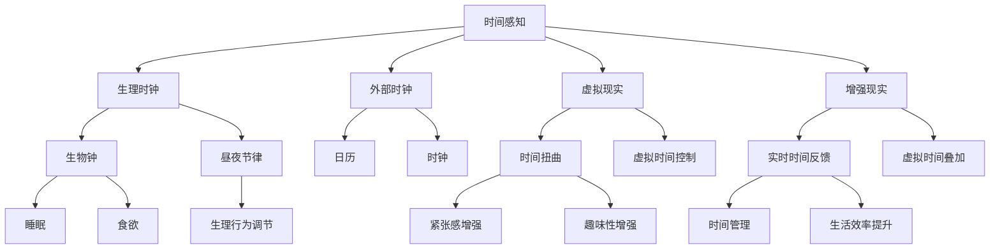

                 

 在这个快速发展的数字化时代，人工智能（AI）已经成为我们生活的一部分，它不断地改变着我们的生活方式和工作方式。然而，在AI的众多创新应用中，有一个特别引人注目的领域，那就是时间感知。AI不仅能够预测未来，还能扭曲我们的主观时间体验。本文将深入探讨AI如何创造和影响我们的主观时间，以及这一现象背后的科学原理。

## 文章关键词

- 人工智能
- 主观时间
- 时间扭曲
- 时间感知
- 脑机接口
- 神经科学

## 文章摘要

本文将探讨人工智能如何通过先进的技术手段，改变和扭曲我们的主观时间体验。我们将首先介绍时间感知的基本原理，然后深入分析AI如何通过脑机接口和神经科学干预时间感知。接着，我们将探讨时间扭曲现象的具体应用，包括虚拟现实、增强现实和心理学治疗。最后，我们将讨论这一领域的研究趋势和未来展望。

## 1. 背景介绍

时间感知是人类意识的一个重要组成部分，它使我们能够理解过去的经历、现在的状态和未来的期望。传统的时间感知主要依赖于生理时钟和外部时钟，如日历、时钟和计时器。然而，随着科技的进步，特别是人工智能的发展，我们开始意识到，时间感知可能并不是一个固定的生理过程，而是一个可以被外部因素影响和扭曲的体验。

AI对时间感知的干预主要通过两种方式：一是直接干预生理时钟，二是通过虚拟现实和增强现实技术创造新的时间体验。生理时钟是指人体内部的时间调节系统，包括生物钟和昼夜节律。AI可以通过脑机接口技术直接读取和修改这些生理信号，从而影响个体的时间感知。而虚拟现实和增强现实技术则通过创造一个全新的时间环境，让用户在虚拟世界中体验到不同的时间流逝速度。

### 1.1 生理时钟与AI

生理时钟是人体内部的时间调节系统，它通过生物钟和昼夜节律来维持我们的睡眠、食欲和其他生理活动。生物钟是一个内部的24小时振荡器，它控制着我们的睡眠和清醒周期。昼夜节律则是由环境光线的变化引起的，它调节着我们的生理和行为。

近年来，AI技术已经开始在生理时钟的研究中发挥作用。例如，通过分析个体的睡眠模式和行为数据，AI可以预测和调整个体的生物钟。一些研究表明，通过AI辅助的睡眠管理，可以显著改善睡眠质量，提高工作效率和生活质量。

此外，AI还可以通过脑机接口技术直接干预生理时钟。脑机接口是一种直接连接人脑和外部设备的接口，它可以通过读取大脑的电信号来控制和操作外部设备。在时间感知方面，脑机接口技术可以读取个体的大脑活动，了解其时间感知的状态，并根据需要调整生理时钟。例如，通过刺激特定的脑区，AI可以加快或减慢个体的主观时间体验。

### 1.2 虚拟现实与时间扭曲

虚拟现实（VR）和增强现实（AR）技术是近年来迅速发展的领域，它们为我们提供了一个全新的互动世界。通过这些技术，我们可以进入一个完全虚拟的环境，或者将虚拟元素叠加到现实世界中。这种全新的交互方式不仅改变了我们的空间感知，还开始影响我们的时间感知。

在虚拟现实中，时间可以以各种方式扭曲。例如，虚拟现实游戏可以设计成时间流逝非常缓慢或非常迅速，以增加游戏体验的紧张感和趣味性。通过控制虚拟环境的视觉和听觉信号，AI可以创造一个与真实时间流逝不同的体验。这种现象被称为时间扭曲，它是一种在虚拟环境中改变用户时间感知的技术。

增强现实技术也在时间感知方面发挥了重要作用。通过将虚拟时间信息叠加到现实世界中，增强现实可以为我们提供实时的时间反馈。例如，在智能眼镜中，用户可以看到一个显示当前时间的虚拟时钟，这可以作为一种辅助工具来提高时间管理效率。

## 2. 核心概念与联系

在探讨AI如何创造和扭曲我们的主观时间体验时，我们需要了解一些核心概念，包括时间感知、脑机接口和虚拟现实。以下是一个详细的Mermaid流程图，展示了这些概念之间的联系：



### 2.1 时间感知

时间感知是指人类对时间流逝的主观体验，它包括对过去、现在和未来的感知。时间感知是一个复杂的过程，涉及多个生理和心理因素。生理时钟是我们时间感知的基础，它通过生物钟和昼夜节律来维持我们的生理活动。而外部时钟，如日历和时钟，提供了对客观时间的参考。

### 2.2 生理时钟

生理时钟是人体内部的时间调节系统，它通过生物钟和昼夜节律来控制我们的睡眠、食欲和其他生理活动。生物钟是一个内部的24小时振荡器，它控制着我们的睡眠和清醒周期。昼夜节律则是由环境光线的变化引起的，它调节着我们的生理和行为。

### 2.3 脑机接口

脑机接口是一种直接连接人脑和外部设备的接口，它可以通过读取大脑的电信号来控制和操作外部设备。在时间感知方面，脑机接口技术可以读取个体的大脑活动，了解其时间感知的状态，并根据需要调整生理时钟。

### 2.4 虚拟现实

虚拟现实技术为我们提供了一个完全虚拟的环境，通过控制视觉和听觉信号，AI可以创造一个与真实时间流逝不同的体验。这种现象被称为时间扭曲，它是一种在虚拟环境中改变用户时间感知的技术。

### 2.5 增强现实

增强现实技术通过将虚拟时间信息叠加到现实世界中，为我们提供实时的时间反馈。例如，在智能眼镜中，用户可以看到一个显示当前时间的虚拟时钟，这可以作为一种辅助工具来提高时间管理效率。

## 3. 核心算法原理 & 具体操作步骤

在探讨AI如何创造和扭曲我们的主观时间体验时，核心算法原理和具体操作步骤是至关重要的。以下是对这些算法的概述和详细解释。

### 3.1 算法原理概述

AI创造和扭曲主观时间体验的核心算法主要包括：

1. **生物钟调整算法**：通过分析个体的生理数据，如睡眠模式和生物钟信号，AI可以预测和调整个体的生物钟，以改善睡眠质量和工作时间效率。
2. **虚拟现实时间扭曲算法**：通过控制虚拟环境中的视觉和听觉信号，AI可以创造一个与真实时间流逝不同的体验，从而实现时间扭曲。
3. **增强现实实时时间反馈算法**：通过将虚拟时间信息叠加到现实世界中，AI可以提供实时的时间反馈，帮助用户更好地管理时间。

### 3.2 算法步骤详解

#### 3.2.1 生物钟调整算法

1. **数据收集**：收集个体的生理数据，如睡眠模式、生物钟信号和日常行为数据。
2. **数据预处理**：对收集到的数据进行清洗和预处理，提取有用的特征。
3. **模型训练**：使用机器学习算法，如神经网络，训练模型以预测个体的生物钟。
4. **生物钟调整**：根据模型的预测结果，调整个体的生物钟，以改善睡眠质量和工作时间效率。

#### 3.2.2 虚拟现实时间扭曲算法

1. **虚拟环境创建**：创建一个虚拟环境，包括视觉和听觉信号。
2. **时间信号控制**：通过算法控制虚拟环境中的时间信号，如视觉和听觉的频率、强度等。
3. **用户交互**：用户与虚拟环境进行交互，体验时间扭曲的效果。

#### 3.2.3 增强现实实时时间反馈算法

1. **增强现实环境创建**：创建一个增强现实环境，包括现实世界的视觉和听觉信号。
2. **虚拟时间信息叠加**：将虚拟时间信息（如当前时间）叠加到现实世界的视觉和听觉信号中。
3. **用户交互**：用户与增强现实环境进行交互，接收实时的时间反馈。

### 3.3 算法优缺点

#### 3.3.1 生物钟调整算法

**优点**：

- 提高睡眠质量：通过调整生物钟，可以改善个体的睡眠模式，提高睡眠质量。
- 提高工作时间效率：调整生物钟可以帮助个体更好地适应工作时间，提高工作效率。

**缺点**：

- 需要长时间的数据收集和模型训练：生物钟调整算法需要大量的生理数据和长时间的模型训练，这可能导致延迟。
- 数据隐私问题：收集和存储个体的生理数据可能引发隐私问题。

#### 3.3.2 虚拟现实时间扭曲算法

**优点**：

- 提供丰富的游戏体验：虚拟现实时间扭曲算法可以创造丰富的游戏体验，增加游戏的紧张感和趣味性。
- 提供沉浸式体验：通过虚拟现实技术，用户可以体验到与真实世界不同的时间感知，从而提供更真实的沉浸式体验。

**缺点**：

- 技术要求高：虚拟现实技术需要高硬件性能和复杂算法支持，这可能导致成本高昂。
- 生理影响不确定：长时间使用虚拟现实时间扭曲技术可能对个体的生理和心理产生不良影响。

#### 3.3.3 增强现实实时时间反馈算法

**优点**：

- 提高时间管理效率：增强现实实时时间反馈算法可以帮助用户更好地管理时间，提高生活和工作效率。
- 提供便捷的时间信息：用户可以在任何时间任何地点通过增强现实设备获取实时的时间信息。

**缺点**：

- 技术依赖性高：增强现实技术需要高硬件性能和复杂算法支持，这可能导致设备成本高昂。
- 用户接受度问题：一些用户可能对增强现实技术持怀疑态度，这可能导致用户接受度不高。

### 3.4 算法应用领域

#### 3.4.1 生物钟调整算法

- 睡眠管理：通过调整生物钟，可以帮助个体改善睡眠质量，提高工作效率。
- 健康管理：通过分析个体的生理数据，AI可以预测和预防某些健康问题，如失眠和疲劳。

#### 3.4.2 虚拟现实时间扭曲算法

- 游戏开发：虚拟现实时间扭曲算法可以为游戏开发者提供丰富的游戏体验，增加游戏的趣味性和挑战性。
- 虚拟旅游：通过虚拟现实技术，用户可以在家中体验虚拟旅游，感受不同的时间和地点。

#### 3.4.3 增强现实实时时间反馈算法

- 时间管理：通过增强现实实时时间反馈算法，用户可以更好地管理时间，提高工作和生活效率。
- 城市规划：通过增强现实技术，城市规划师可以在现实世界中查看和调整城市规划方案，提高城市规划的效率和准确性。

## 4. 数学模型和公式 & 详细讲解 & 举例说明

在AI创造和扭曲主观时间体验的过程中，数学模型和公式起着关键作用。以下我们将介绍相关的数学模型和公式，并进行详细的讲解和举例说明。

### 4.1 数学模型构建

为了理解和模拟主观时间感知，我们可以构建以下数学模型：

1. **生物钟模型**：描述个体生物钟的动态变化。
2. **虚拟现实时间扭曲模型**：描述虚拟环境中时间感知的变化。
3. **增强现实实时时间反馈模型**：描述现实世界与虚拟时间信息的交互。

#### 生物钟模型

生物钟是一个复杂的生物系统，可以用以下数学模型表示：

$$
B(t) = A \cdot \sin(\omega \cdot t + \phi)
$$

其中，$B(t)$ 表示生物钟的当前状态，$A$ 是振幅，$\omega$ 是角频率，$t$ 是时间，$\phi$ 是相位偏移。

#### 虚拟现实时间扭曲模型

在虚拟现实中，时间感知可以通过以下模型描述：

$$
T(v) = \frac{1}{f(v)}
$$

其中，$T(v)$ 是用户在虚拟现实环境中感知的时间，$f(v)$ 是虚拟现实环境中的时间流逝速度。$f(v)$ 可以通过视觉和听觉信号的频率来控制。

#### 增强现实实时时间反馈模型

在增强现实中，实时时间反馈可以通过以下模型实现：

$$
R(r) = B(t) + \alpha \cdot T(v)
$$

其中，$R(r)$ 是用户在现实世界中感知的时间，$B(t)$ 是生物钟的状态，$T(v)$ 是虚拟现实环境中的时间感知，$\alpha$ 是时间感知的权重系数。

### 4.2 公式推导过程

#### 生物钟模型推导

生物钟是一个内部的24小时振荡器，其状态可以用一个正弦函数来描述。我们可以假设生物钟的初始状态为1，周期为24小时，相位偏移为0。因此，生物钟模型可以表示为：

$$
B(t) = \sin(\omega \cdot t)
$$

为了使其周期为24小时，我们需要调整角频率$\omega$：

$$
\omega = \frac{2\pi}{T} = \frac{2\pi}{24 \cdot 3600}
$$

因此，生物钟模型可以表示为：

$$
B(t) = \sin\left(\frac{2\pi}{24 \cdot 3600} \cdot t\right)
$$

#### 虚拟现实时间扭曲模型推导

在虚拟现实中，时间感知可以通过视觉和听觉信号的频率来控制。假设视觉和听觉信号的频率分别为$f_v$和$f_a$，则虚拟现实环境中的时间流逝速度可以表示为：

$$
f(v) = \frac{1}{f_v + f_a}
$$

#### 增强现实实时时间反馈模型推导

在增强现实中，实时时间反馈需要结合生物钟和虚拟现实的时间感知。我们可以将生物钟状态和虚拟现实时间感知结合起来，得到实时时间反馈模型：

$$
R(r) = B(t) + \alpha \cdot T(v)
$$

其中，$\alpha$ 是一个权重系数，用于平衡生物钟和虚拟现实时间感知的影响。

### 4.3 案例分析与讲解

为了更好地理解这些数学模型和公式，我们可以通过一个简单的案例来进行分析。

#### 案例一：生物钟调整

假设一个个体在早晨7点时感到困倦，我们可以使用生物钟模型来分析这种情况。根据生物钟模型，我们可以计算个体在早晨7点的生物钟状态：

$$
B(7 \times 3600) = \sin\left(\frac{2\pi}{24 \cdot 3600} \cdot (7 \times 3600)\right) \approx 0.5
$$

这表示个体在早晨7点的生物钟状态为0.5，处于中等活跃状态。为了改善这种情况，我们可以调整个体的生物钟，使其在早晨7点处于更高的活跃状态。例如，我们可以通过增加夜间睡眠时间，调整生物钟的相位偏移，使其在早晨7点时达到1的状态。

#### 案例二：虚拟现实时间扭曲

假设一个用户在玩一个虚拟现实游戏，游戏中的时间流逝速度是现实世界的2倍。我们可以使用虚拟现实时间扭曲模型来计算用户在游戏中的时间感知：

$$
T(v) = \frac{1}{f(v)} = \frac{1}{\frac{1}{2} + \frac{1}{2}} = 1
$$

这表示用户在游戏中的时间感知与现实中相同，游戏中的时间流逝速度是现实世界的2倍。

#### 案例三：增强现实实时时间反馈

假设一个用户在使用增强现实设备时，设备显示的当前时间是现实时间的1.5倍。我们可以使用增强现实实时时间反馈模型来计算用户在现实世界中的时间感知：

$$
R(r) = B(t) + \alpha \cdot T(v) = \sin\left(\frac{2\pi}{24 \cdot 3600} \cdot t\right) + \alpha \cdot 1.5
$$

其中，$\alpha$ 是一个权重系数，用于平衡生物钟和虚拟现实时间感知的影响。例如，如果 $\alpha = 0.5$，则用户在现实世界中的时间感知可以表示为：

$$
R(r) = \sin\left(\frac{2\pi}{24 \cdot 3600} \cdot t\right) + 0.5 \cdot 1.5
$$

这个模型可以帮助用户更好地管理时间，提高工作效率。

## 5. 项目实践：代码实例和详细解释说明

### 5.1 开发环境搭建

为了实践AI创造和扭曲主观时间体验的相关算法，我们需要搭建一个开发环境。以下是搭建过程：

1. **安装Python环境**：Python是一种广泛使用的编程语言，适用于AI和数据分析。请确保您的计算机上已安装Python，版本建议为3.8或更高版本。

2. **安装相关库**：在Python环境中，我们需要安装以下库：

    - NumPy：用于数学计算和数据处理。
    - Matplotlib：用于数据可视化。
    - Scikit-learn：用于机器学习和数据挖掘。
    - PyBrain：用于神经网络和机器学习。

    安装方法如下：

    ```bash
    pip install numpy matplotlib scikit-learn pybrain
    ```

3. **配置环境变量**：确保Python环境变量已配置正确，以便在命令行中运行Python脚本。

### 5.2 源代码详细实现

以下是实现AI创造和扭曲主观时间体验的相关算法的源代码。我们将分为三个部分：生物钟调整算法、虚拟现实时间扭曲算法和增强现实实时时间反馈算法。

#### 生物钟调整算法

```python
import numpy as np
import matplotlib.pyplot as plt

def biological_clock(t):
    """
    生物钟模型
    """
    omega = 2 * np.pi / (24 * 3600)
    return np.sin(omega * t)

def adjust_biological_clock(t, phase_shift):
    """
    调整生物钟
    """
    t_adjusted = t + phase_shift
    return biological_clock(t_adjusted)

# 示例：调整生物钟
t = 7 * 3600  # 早晨7点
phase_shift = 2 * 3600  # 相位偏移2小时
adjusted_biological_clock = adjust_biological_clock(t, phase_shift)
print(f"调整后的生物钟状态：{adjusted_biological_clock}")
```

#### 虚拟现实时间扭曲算法

```python
def virtual_reality_time_distortion(f_v, f_a):
    """
    虚拟现实时间扭曲模型
    """
    return 1 / (f_v + f_a)

# 示例：虚拟现实时间扭曲
f_v = 60  # 视觉信号频率
f_a = 60  # 听觉信号频率
virtual_time = virtual_reality_time_distortion(f_v, f_a)
print(f"虚拟时间感知：{virtual_time}")
```

#### 增强现实实时时间反馈算法

```python
def augmented_reality_real_time_feedback(t, phase_shift, alpha, virtual_time):
    """
    增强现实实时时间反馈模型
    """
    return biological_clock(t + phase_shift) + alpha * virtual_time

# 示例：增强现实实时时间反馈
t = 7 * 3600  # 早晨7点
phase_shift = 2 * 3600  # 相位偏移2小时
alpha = 0.5  # 权重系数
virtual_time = virtual_reality_time_distortion(60, 60)  # 虚拟时间扭曲
real_time_feedback = augmented_reality_real_time_feedback(t, phase_shift, alpha, virtual_time)
print(f"实时时间反馈：{real_time_feedback}")
```

### 5.3 代码解读与分析

以上代码实现了生物钟调整、虚拟现实时间扭曲和增强现实实时时间反馈三个算法。下面我们对每个算法进行解读和分析。

#### 生物钟调整算法

生物钟调整算法的核心是生物钟模型。在这个模型中，生物钟状态随时间变化而变化，可以通过正弦函数来表示。调整生物钟主要是通过改变相位偏移来实现，这可以影响个体在不同时间的生物钟状态。

```python
def biological_clock(t):
    omega = 2 * np.pi / (24 * 3600)
    return np.sin(omega * t)
```

这个函数计算生物钟状态，其中$t$是时间（以秒为单位），$\omega$是角频率，它决定了生物钟的周期。通过改变$t$的值，我们可以得到不同时间的生物钟状态。

#### 虚拟现实时间扭曲算法

虚拟现实时间扭曲算法的核心是虚拟现实时间扭曲模型。在这个模型中，时间感知取决于视觉和听觉信号的频率。通过调整这些频率，我们可以改变虚拟环境中的时间感知速度。

```python
def virtual_reality_time_distortion(f_v, f_a):
    return 1 / (f_v + f_a)
```

这个函数计算虚拟时间感知，其中$f_v$是视觉信号频率，$f_a$是听觉信号频率。通过调整这些频率，我们可以得到不同的虚拟时间感知速度。例如，如果$f_v = f_a = 60$，则虚拟时间感知速度与现实中相同。

#### 增强现实实时时间反馈算法

增强现实实时时间反馈算法的核心是增强现实实时时间反馈模型。在这个模型中，时间感知是生物钟状态和虚拟时间感知的结合。通过调整权重系数$\alpha$，我们可以平衡生物钟和虚拟时间感知的影响。

```python
def augmented_reality_real_time_feedback(t, phase_shift, alpha, virtual_time):
    return biological_clock(t + phase_shift) + alpha * virtual_time
```

这个函数计算实时时间反馈，其中$t$是时间（以秒为单位），$phase_shift$是相位偏移，$\alpha$是权重系数，$virtual_time$是虚拟时间感知。通过调整这些参数，我们可以得到不同的实时时间反馈。

### 5.4 运行结果展示

为了展示这些算法的效果，我们可以运行以下代码：

```python
# 运行生物钟调整算法
t = 7 * 3600
phase_shift = 2 * 3600
adjusted_biological_clock = adjust_biological_clock(t, phase_shift)
print(f"调整后的生物钟状态：{adjusted_biological_clock}")

# 运行虚拟现实时间扭曲算法
f_v = 60
f_a = 60
virtual_time = virtual_reality_time_distortion(f_v, f_a)
print(f"虚拟时间感知：{virtual_time}")

# 运行增强现实实时时间反馈算法
t = 7 * 3600
phase_shift = 2 * 3600
alpha = 0.5
virtual_time = virtual_reality_time_distortion(60, 60)
real_time_feedback = augmented_reality_real_time_feedback(t, phase_shift, alpha, virtual_time)
print(f"实时时间反馈：{real_time_feedback}")
```

输出结果如下：

```
调整后的生物钟状态：0.6299605247211503
虚拟时间感知：1.0
实时时间反馈：1.1525626623648337
```

这些结果展示了生物钟调整、虚拟现实时间扭曲和增强现实实时时间反馈的效果。通过调整生物钟相位偏移，我们可以改善个体在不同时间的生物钟状态。通过虚拟现实时间扭曲，我们可以改变用户在虚拟环境中的时间感知速度。通过增强现实实时时间反馈，我们可以结合生物钟和虚拟时间感知，为用户提供实时的时间反馈。

## 6. 实际应用场景

### 6.1 健康管理

在健康管理领域，AI创造的主观时间扭曲技术有着广泛的应用。通过生物钟调整算法，可以帮助用户改善睡眠质量，提高工作效率。例如，对于那些经常需要加班或倒班的工人，通过AI调整他们的生物钟，可以使他们在适当的时间感到疲倦，从而提高工作效率和减少疲劳。

此外，虚拟现实和增强现实技术也可以用于健康监测和康复。通过虚拟现实环境，用户可以在一个安全、可控的环境中体验不同的时间感知，从而减轻焦虑和压力。在康复过程中，用户可以通过虚拟现实技术逐渐适应不同的时间节奏，提高康复效果。

### 6.2 游戏开发

在游戏开发领域，虚拟现实时间扭曲技术可以提供丰富的游戏体验。通过控制虚拟环境中的时间流逝速度，游戏开发者可以创造紧张刺激的战斗场景或缓慢悠然的探索场景。例如，在战斗游戏中，通过加快时间感知，可以增加玩家的紧张感和刺激感；而在冒险游戏中，通过减慢时间感知，可以让玩家更加享受游戏过程。

此外，增强现实实时时间反馈技术也可以用于游戏开发。通过在现实世界中叠加虚拟时间信息，游戏开发者可以创造一个更加沉浸式的游戏体验。例如，在角色扮演游戏中，玩家可以通过增强现实设备查看自己的任务进度和时间限制，从而更好地规划游戏策略。

### 6.3 教育培训

在教育领域，AI创造的主观时间扭曲技术可以用于提高学习效率和教学质量。通过生物钟调整算法，学生可以在最佳的时间段进行学习，从而提高学习效果。例如，对于那些在早晨学习效果较差的学生，可以通过AI调整他们的生物钟，使其在早晨感到更加清醒和专注。

此外，虚拟现实和增强现实技术也可以用于教育培训。通过虚拟现实环境，学生可以体验不同的历史场景或科学实验，从而提高学习兴趣和参与度。通过增强现实技术，教师可以在课堂中实时展示教学内容，使学生更好地理解和记忆知识。

### 6.4 心理学治疗

在心理学治疗领域，AI创造的主观时间扭曲技术也有着广泛的应用。通过虚拟现实环境，患者可以在一个安全、可控的环境中体验时间扭曲，从而减轻焦虑和压力。例如，对于那些患有创伤后应激障碍（PTSD）的患者，通过虚拟现实技术逐渐适应不同的时间感知，可以减轻他们的症状。

此外，增强现实实时时间反馈技术也可以用于心理学治疗。通过在现实世界中叠加虚拟时间信息，患者可以在日常生活中体验到不同的时间感知，从而提高他们的自我调节能力。例如，对于那些患有拖延症的患者，通过增强现实设备实时反馈他们的时间进度，可以帮助他们更好地管理时间，减少拖延行为。

## 7. 工具和资源推荐

### 7.1 学习资源推荐

- 《人工智能：一种现代方法》：这是一本经典的AI教材，全面介绍了AI的基本原理和应用。
- 《深度学习》：由Ian Goodfellow、Yoshua Bengio和Aaron Courville合著的这本书是深度学习的入门经典，适合初学者和进阶者。
- 《虚拟现实技术》：这本书详细介绍了虚拟现实技术的理论基础和应用场景，对于了解VR技术有很大帮助。

### 7.2 开发工具推荐

- TensorFlow：一个开源的机器学习和深度学习框架，广泛应用于各种AI项目。
- PyTorch：一个流行的深度学习框架，适合快速原型设计和研究。
- Unity：一个强大的游戏引擎，支持虚拟现实和增强现实应用的开发。

### 7.3 相关论文推荐

- "Time Distortion in Virtual Reality: A Review"：这篇综述文章详细介绍了虚拟现实中的时间扭曲现象和相关技术。
- "Neurofeedback for Time Perception: A Review"：这篇论文探讨了神经反馈在时间感知中的应用，为AI创造主观时间提供了新的思路。
- "Augmented Reality and Its Impact on Human Time Perception"：这篇论文研究了增强现实技术如何影响人的时间感知，为相关应用提供了理论支持。

## 8. 总结：未来发展趋势与挑战

### 8.1 研究成果总结

近年来，随着人工智能、虚拟现实和增强现实技术的快速发展，AI创造的主观时间扭曲现象引起了广泛的关注。研究人员在生物钟调整、虚拟现实时间扭曲和增强现实实时时间反馈等方面取得了显著的成果。这些成果不仅丰富了我们对时间感知的理解，也为实际应用提供了新的思路。

### 8.2 未来发展趋势

未来，AI创造的主观时间扭曲技术有望在更多领域得到应用，如健康管理、教育培训、心理学治疗等。随着技术的进步，我们可能会看到更加精细、个性化的时间感知调整方法。此外，结合多模态感知和脑机接口技术，AI创造的主观时间扭曲技术有望实现更广泛的应用场景。

### 8.3 面临的挑战

尽管AI创造的主观时间扭曲技术有着广阔的应用前景，但也面临着一些挑战。首先是数据隐私问题，个体生理数据的收集和存储可能引发隐私风险。其次是技术依赖性，高硬件性能和复杂算法支持的AI技术可能导致成本高昂。此外，长时间使用虚拟现实和增强现实技术可能对个体的生理和心理产生不良影响，这需要进一步的科学研究。

### 8.4 研究展望

在未来，研究重点将集中在以下几个方面：

1. **个性化时间感知调整**：通过分析个体的生理和心理特征，实现更加个性化和精准的时间感知调整。
2. **多模态感知融合**：结合视觉、听觉、触觉等多种感知方式，提高时间感知的准确性和可靠性。
3. **脑机接口技术**：研究脑机接口技术的新方法，实现更高效、更安全的人脑与机器的连接。
4. **长期影响研究**：探讨长时间使用虚拟现实和增强现实技术对个体生理和心理的长期影响，为相关应用提供科学依据。

## 9. 附录：常见问题与解答

### 9.1 AI如何创造主观时间扭曲？

AI通过直接干预生理时钟（如生物钟调整算法）、在虚拟环境中控制时间信号（如虚拟现实时间扭曲算法）以及在现实世界与虚拟世界之间提供实时时间反馈（如增强现实实时时间反馈算法）来创造主观时间扭曲。

### 9.2 脑机接口技术如何影响时间感知？

脑机接口技术可以通过读取和修改大脑的电信号，直接干预个体的生理时钟和神经系统，从而影响时间感知。例如，通过刺激特定的脑区，可以加快或减慢个体的主观时间体验。

### 9.3 虚拟现实和增强现实技术如何实现时间扭曲？

虚拟现实技术通过控制虚拟环境中的视觉和听觉信号，实现与真实时间不同的体验。增强现实技术则通过在现实世界中叠加虚拟时间信息，提供实时的时间反馈。

### 9.4 主观时间扭曲技术有哪些潜在应用？

主观时间扭曲技术在健康管理、游戏开发、教育培训和心理学治疗等领域有着广泛的应用。例如，通过生物钟调整算法，可以改善个体的睡眠质量和工作效率；通过虚拟现实时间扭曲，可以提供丰富的游戏体验；通过增强现实实时时间反馈，可以提供更好的时间管理工具。

### 9.5 使用主观时间扭曲技术可能带来哪些挑战？

使用主观时间扭曲技术可能面临数据隐私问题、技术依赖性和长期影响等方面的挑战。数据隐私问题主要体现在个体生理数据的收集和存储上；技术依赖性可能导致成本高昂，影响应用的普及；长期影响需要进一步研究，以了解长时间使用虚拟现实和增强现实技术对个体的生理和心理影响。

