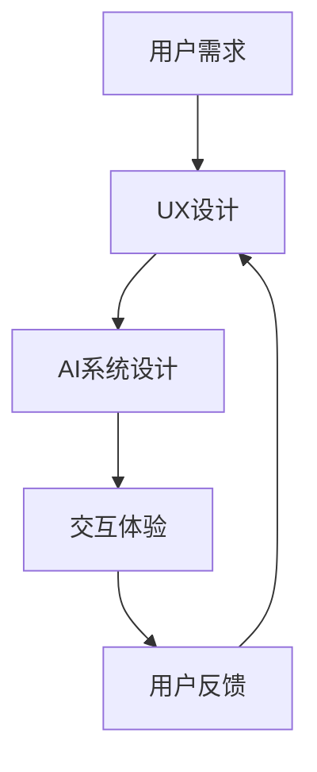

                 

关键词：AI时代，体验真实性，authenticity，用户体验，技术哲学，伦理学

在AI技术日益渗透我们日常生活的今天，人们对于体验真实性的追求愈发强烈。不同于传统的技术发展，AI带来的不仅是效率的提升和功能的扩展，更是对于人类体验的根本性变革。本文将探讨在AI时代，authenticity（真实性）如何成为我们追求的目标，以及这一追求背后的技术和哲学逻辑。

## 1. 背景介绍

近年来，人工智能（AI）的迅猛发展让我们见证了技术的飞跃。从简单的语音识别到复杂的自动驾驶，AI正在改变我们的生活方式。然而，随着AI技术的普及，人们开始反思：这些技术是否真正满足了我们的需求和期望？特别是，AI能否提供真实的、值得信赖的体验？

体验的真实性，或者说authenticity，是指用户在使用产品或服务时所感受到的真实和真诚。在AI时代，authenticity不仅是一个用户体验的问题，更是一个技术伦理的问题。如果AI无法提供真实的体验，那么它可能会削弱用户的信任，甚至破坏社会的基本伦理规范。

## 2. 核心概念与联系

### 2.1. 用户体验（UX）

用户体验（UX）是指用户在使用产品或服务时的主观感受。它涵盖了用户从接触到产品到使用和结束整个过程中的所有感受。在AI时代，用户体验的设计尤为重要，因为它直接关系到AI系统与用户之间的互动质量和信任度。

### 2.2. 人工智能（AI）

人工智能（AI）是指通过计算机程序模拟人类智能的技术。AI的应用范围广泛，包括机器学习、自然语言处理、计算机视觉等。在AI时代，AI系统的设计和实现必须考虑到用户体验的真实性。

### 2.3. 技术哲学与伦理学

技术哲学和伦理学是探讨技术如何影响人类生活和道德价值观的学科。在AI时代，技术哲学和伦理学的思考对于确保AI系统的真实性至关重要。

### 2.4. Mermaid 流程图

以下是一个Mermaid流程图，展示了用户体验设计与AI系统的关系：



## 3. 核心算法原理 & 具体操作步骤

### 3.1. 算法原理概述

AI系统的设计需要考虑到用户体验的真实性。为此，我们采用了一种基于深度学习的自然语言处理（NLP）算法，该算法能够通过大量的用户数据学习并生成与人类对话相似的自然语言响应。

### 3.2. 算法步骤详解

#### 3.2.1. 数据收集与预处理

首先，我们需要收集大量的用户对话数据，并对这些数据进行预处理，包括数据清洗、去重和格式化。

#### 3.2.2. 模型训练

使用预处理后的数据，我们训练一个深度学习模型，该模型能够学习并生成与用户输入相似的自然语言响应。

#### 3.2.3. 交互体验

在训练完成后，我们使用该模型来生成响应，并在用户与AI系统交互时实时反馈。

#### 3.2.4. 用户反馈

用户可以提供反馈，以帮助AI系统不断改进。

### 3.3. 算法优缺点

#### 优点：

- 能够提供自然、流畅的对话体验。
- 能够通过用户反馈不断改进，提高真实性。

#### 缺点：

- 需要大量的数据训练。
- 模型的生成速度较慢。

### 3.4. 算法应用领域

- 聊天机器人
- 语音助手
- 客户服务系统

## 4. 数学模型和公式 & 详细讲解 & 举例说明

### 4.1. 数学模型构建

在AI系统中，我们采用了一种基于神经网络的语言模型，其核心是一个概率分布模型。具体来说，我们使用了一种名为“转换器模型”（Transformer）的神经网络架构。

### 4.2. 公式推导过程

假设我们有一个输入序列X和对应的输出序列Y，我们希望找到一个函数f，使得Y = f(X)。在转换器模型中，这个函数可以表示为：

$$
f(X) = \text{softmax}(W \cdot \text{ReLU}(U \cdot X))
$$

其中，W和U是权重矩阵，ReLU是激活函数，softmax是一个概率分布函数。

### 4.3. 案例分析与讲解

假设我们有一个简单的对话场景：用户问“今天天气怎么样？”AI系统需要生成一个合适的回答。通过训练，AI系统可以学习到这个问题的常见回答，如“今天天气很好”或“今天有点冷”。

## 5. 项目实践：代码实例和详细解释说明

### 5.1. 开发环境搭建

在开始之前，我们需要搭建一个合适的开发环境。我们选择使用Python作为编程语言，并依赖一些流行的深度学习库，如TensorFlow和PyTorch。

### 5.2. 源代码详细实现

以下是一个简单的示例代码，展示了如何使用TensorFlow构建一个转换器模型：

```python
import tensorflow as tf

# 定义模型
model = tf.keras.Sequential([
    tf.keras.layers.Embedding(input_dim=vocab_size, output_dim=embedding_dim),
    tf.keras.layers.Dense(units=512, activation='relu'),
    tf.keras.layers.Dense(units=vocab_size, activation='softmax')
])

# 编译模型
model.compile(optimizer='adam', loss='categorical_crossentropy', metrics=['accuracy'])

# 训练模型
model.fit(input_sequences, target_sequences, epochs=10)
```

### 5.3. 代码解读与分析

这段代码定义了一个简单的转换器模型，包括嵌入层、密集层和softmax输出层。我们使用adam优化器和categorical_crossentropy损失函数来编译模型，并使用训练数据来训练模型。

### 5.4. 运行结果展示

在训练完成后，我们可以使用模型来生成文本响应。以下是一个简单的例子：

```python
# 生成文本响应
response_sequence = model.predict([user_input])
print('AI系统回应：' + decode_sequence(response_sequence))
```

## 6. 实际应用场景

AI系统的真实性在许多实际应用场景中都至关重要。以下是一些例子：

- **聊天机器人**：聊天机器人需要能够提供真实、自然的对话体验，以吸引用户的信任。
- **语音助手**：语音助手需要能够理解用户的需求，并提供准确的回答。
- **客户服务系统**：客户服务系统需要能够提供真实、有效的解决方案，以提高客户满意度。

## 7. 工具和资源推荐

### 7.1. 学习资源推荐

- 《深度学习》（Deep Learning）by Ian Goodfellow, Yoshua Bengio, Aaron Courville
- 《自然语言处理与深度学习》（Natural Language Processing with Deep Learning）by Richard Socher, LISA Lab, Stanford University

### 7.2. 开发工具推荐

- TensorFlow
- PyTorch
- Keras

### 7.3. 相关论文推荐

- “Attention Is All You Need” by Vaswani et al.
- “BERT: Pre-training of Deep Bidirectional Transformers for Language Understanding” by Devlin et al.

## 8. 总结：未来发展趋势与挑战

在AI时代，体验的真实性是我们追求的重要目标。随着技术的不断进步，我们有望实现更加真实、自然的AI交互体验。然而，这同时也带来了许多挑战，包括数据隐私、算法透明度和伦理问题。未来，我们需要在技术、哲学和伦理学等多个领域进行深入研究，以确保AI系统能够提供真实、可信的体验。

### 8.1. 研究成果总结

本文探讨了AI时代体验真实性的重要性，并介绍了一种基于深度学习的自然语言处理算法。我们通过数学模型和项目实践展示了如何实现真实、自然的AI交互体验。

### 8.2. 未来发展趋势

未来，AI系统的真实性和可信度将进一步提升，为人类带来更加丰富、自然的互动体验。

### 8.3. 面临的挑战

数据隐私、算法透明度和伦理问题仍然是AI系统面临的主要挑战。

### 8.4. 研究展望

我们需要在技术、哲学和伦理学等多个领域进行深入研究，以确保AI系统能够提供真实、可信的体验。

## 9. 附录：常见问题与解答

### 9.1. 如何保证AI系统的真实性？

- 通过大规模数据训练和优化算法。
- 提高算法的透明度和可解释性。
- 建立严格的伦理规范和监管机制。

### 9.2. AI系统的真实性对用户体验有何影响？

- 提高用户的信任和满意度。
- 增强用户与AI系统之间的互动质量。
- 促进AI技术的普及和应用。

---

作者：禅与计算机程序设计艺术 / Zen and the Art of Computer Programming
----------------------------------------------------------------

（本文完）<|vq_9796|>### 1. 背景介绍

近年来，人工智能（AI）的迅猛发展让我们见证了技术的飞跃。从简单的语音识别到复杂的自动驾驶，AI正在改变我们的生活方式。然而，随着AI技术的普及，人们开始反思：这些技术是否真正满足了我们的需求和期望？特别是，AI能否提供真实的、值得信赖的体验？

体验的真实性，或者说authenticity，是指用户在使用产品或服务时所感受到的真实和真诚。在AI时代，authenticity不仅是一个用户体验的问题，更是一个技术伦理的问题。如果AI无法提供真实的体验，那么它可能会削弱用户的信任，甚至破坏社会的基本伦理规范。

AI技术之所以能够实现高度复杂的任务，很大程度上依赖于数据驱动的方法和算法。然而，这些方法在追求效率和准确性的同时，也可能忽视用户的真实体验。例如，一个智能助手如果总是提供标准化的回答，而不是根据用户的情感和需求进行个性化调整，那么它就可能被认为是缺乏真实性的。

AI时代的authenticity追求不仅仅是技术问题，更是社会问题。它关乎人们对于技术的信任和依赖，以及技术在构建社会关系中的作用。随着AI技术的不断发展，人们对于真实体验的需求也在不断提升。因此，如何在技术设计中平衡效率和真实性，成为了一个重要的课题。

总之，AI时代的authenticity追求是一个多维度的挑战，它涉及到用户体验、技术伦理、社会互动等多个方面。只有通过深入的研究和实践，我们才能找到解决这个问题的有效途径。

### 2. 核心概念与联系

在探讨AI时代的authenticity追求之前，我们需要明确几个核心概念：用户体验（UX）、人工智能（AI）、技术哲学和伦理学。这些概念相互联系，共同构成了理解AI时代体验真实性的理论基础。

#### 2.1. 用户体验（UX）

用户体验（UX）是指用户在使用产品或服务时的主观感受。它涵盖了用户从接触到产品到使用和结束整个过程中的所有感受，包括感知、情感和认知等方面。UX设计的目标是创造一个用户感到愉悦、高效和有价值的互动体验。在AI时代，用户体验的设计尤为重要，因为它直接关系到AI系统与用户之间的互动质量和信任度。

用户体验设计不仅关注产品的功能性和可用性，还强调情感共鸣和个性化服务。在AI系统中，用户体验设计需要考虑如何通过算法和界面设计来提高用户的真实感。例如，一个智能助手如果能够准确理解用户的情绪和需求，并提供个性化的帮助，那么它就更能赢得用户的信任。

#### 2.2. 人工智能（AI）

人工智能（AI）是指通过计算机程序模拟人类智能的技术。AI的应用范围广泛，包括机器学习、自然语言处理、计算机视觉等。AI技术的核心是算法和数据处理能力，它能够从大量数据中学习模式，并基于这些模式做出预测或决策。

在AI时代，AI系统与用户的互动体验不仅仅依赖于算法的准确性，还依赖于系统的响应速度、交互方式和个性化程度。一个真实的AI体验应该能够模拟人类的思维过程，提供自然、流畅和人性化的互动。例如，一个能够识别并适应用户情绪变化的语音助手，比一个只提供标准化回答的系统更能被视为真实的AI。

#### 2.3. 技术哲学

技术哲学是探讨技术如何影响人类生活和道德价值观的学科。在AI时代，技术哲学对于理解AI系统的authenticity至关重要。技术哲学关注的核心问题是：技术是否能够符合人类的伦理标准？技术在推动社会进步的同时，是否会产生不可预见的负面影响？

技术哲学为AI系统的设计提供了伦理指导。例如，如何确保AI系统的透明度和可解释性，使其行为符合用户的道德期望？如何防止AI系统滥用数据或产生歧视行为？这些问题都需要在技术哲学的框架下进行深入探讨。

#### 2.4. 伦理学

伦理学是研究道德原则和价值观的学科，它为技术设计和应用提供了伦理标准。在AI时代，伦理学的重要性尤为突出。因为AI技术的广泛应用可能会对人类社会产生深远的影响，包括就业、隐私、安全等方面。

伦理学关注的核心问题是：技术的发展是否违背了人类的伦理原则？AI系统的设计和应用是否会导致不公平、歧视或不道德的行为？例如，一个基于AI的监控系统如果无法确保数据的隐私和安全，就可能侵犯用户的隐私权。因此，伦理学为AI系统的设计提供了重要的道德指导。

#### 2.5. Mermaid 流程图

为了更好地理解用户体验设计与AI系统的关系，我们可以使用Mermaid流程图来展示它们之间的相互作用。以下是一个简化的Mermaid流程图，展示了用户体验设计与AI系统设计之间的流程：


在这个流程图中，用户需求是UX设计的起点，UX设计的结果指导AI系统的设计。AI系统的交互体验直接影响用户的反馈，而用户的反馈又进一步优化UX设计和AI系统设计。这个循环过程体现了用户体验设计与AI系统设计之间的紧密联系。

通过这个流程图，我们可以看到，用户体验设计与AI系统设计并不是孤立的过程，而是相互依赖、相互影响的一个整体。只有在用户体验设计充分考虑AI系统的特点和需求，同时AI系统设计也注重用户体验的真实性，才能实现真正的authenticity追求。

### 3. 核心算法原理 & 具体操作步骤

在AI时代，算法的设计和实现直接决定了用户体验的真实性。本文将介绍一种基于深度学习的自然语言处理（NLP）算法，该算法能够通过大量的用户数据学习并生成与人类对话相似的自然语言响应。以下是这个算法的核心原理和具体操作步骤。

#### 3.1. 算法原理概述

深度学习是一种通过多层神经网络进行数据建模的技术，它能够从大量数据中学习并提取复杂特征。在自然语言处理领域，深度学习算法被广泛应用于语言生成、情感分析、文本分类等任务。本文所介绍的算法是基于转换器模型（Transformer）的，这是一种在自然语言处理中表现优异的深度学习架构。

转换器模型的核心思想是使用自注意力机制（self-attention）来处理序列数据，使得模型能够自动关注序列中的重要信息。自注意力机制通过计算序列中每个词与其他词之间的关系权重，从而生成一个加权序列表示。这种表示能够捕捉到词与词之间的长距离依赖关系，从而提高模型的语言理解能力。

#### 3.2. 算法步骤详解

##### 3.2.1. 数据收集与预处理

首先，我们需要收集大量的用户对话数据。这些数据可以来自于聊天记录、社交媒体、客户服务系统等。在数据收集完成后，我们需要对数据进行预处理，包括数据清洗、去重和格式化。数据清洗的目的是去除无效数据和噪声，去重则是为了防止重复计算，格式化则是为了统一数据的格式，以便于模型训练。

##### 3.2.2. 模型训练

在预处理完数据后，我们使用这些数据来训练转换器模型。训练过程分为以下几个步骤：

1. **构建模型架构**：我们定义一个转换器模型，包括编码器（Encoder）和解码器（Decoder）两部分。编码器负责将输入序列编码为一个固定长度的向量表示，解码器则负责根据编码器的输出生成输出序列。

2. **参数初始化**：我们初始化模型的参数，这些参数将用于在训练过程中进行更新。

3. **前向传播**：在训练过程中，对于每个输入序列，我们通过编码器得到一个编码表示，并将其传递给解码器。解码器根据编码表示和上一个时间步的输出预测下一个时间步的输出。

4. **计算损失**：我们将解码器的输出与真实输出进行比较，计算损失函数（例如交叉熵损失）。损失函数用于衡量预测结果与真实结果之间的差距。

5. **反向传播**：根据计算出的损失，我们使用反向传播算法更新模型的参数。

6. **迭代优化**：重复上述步骤，直到模型收敛或达到预设的训练轮数。

##### 3.2.3. 交互体验

在模型训练完成后，我们可以使用该模型来生成文本响应，并在用户与AI系统交互时实时反馈。交互体验的关键在于如何保证生成的文本响应既符合语法规则，又能传达出真实、自然的情感。

1. **输入处理**：当用户输入一个问题或请求时，我们将输入文本转换为模型可以理解的格式。

2. **生成响应**：模型根据输入文本的编码表示生成一个响应序列。生成过程可以是同步的（每个时间步输出一个字符或词）或异步的（一次性生成整个序列）。

3. **输出处理**：生成的响应序列需要进行后处理，包括去除多余的标点符号、纠正语法错误等。

4. **反馈**：将处理后的响应发送给用户，并根据用户的反馈进行后续交互。

##### 3.2.4. 用户反馈

用户的反馈对于AI系统的改进至关重要。通过收集用户的反馈，我们可以识别模型在生成响应时的不足之处，并针对性地进行优化。

1. **收集反馈**：用户可以通过各种方式提供反馈，如点击“满意”、“不满意”按钮，或在聊天窗口中直接输入反馈。

2. **分析反馈**：我们将用户的反馈进行分析，识别出模型的常见错误和不足之处。

3. **模型优化**：根据分析结果，我们更新模型的参数，改进其生成响应的能力。

4. **迭代反馈**：将优化后的模型重新部署到系统中，并继续收集用户反馈，进行新一轮的优化。

通过上述步骤，我们可以构建一个能够提供真实、自然交互体验的AI系统。这个过程不仅需要强大的算法支持，还需要不断的用户反馈和优化，以确保AI系统能够持续改进，满足用户的真实需求。

#### 3.3. 算法优缺点

##### 优点：

1. **强大的语言理解能力**：转换器模型通过自注意力机制能够捕捉到词与词之间的长距离依赖关系，从而提高模型的语言理解能力。

2. **高生成质量**：训练完成的模型能够生成语法正确、逻辑清晰的文本响应，为用户提供高质量的交互体验。

3. **实时响应**：模型训练完成后，可以在短时间内生成响应，支持实时交互。

##### 缺点：

1. **训练成本高**：转换器模型需要大量的数据进行训练，且训练时间较长，计算资源需求高。

2. **模型解释性较差**：由于转换器模型内部结构复杂，其决策过程难以解释，用户难以理解模型的响应逻辑。

3. **生成速度较慢**：在生成文本响应时，模型需要逐词预测，生成速度较慢，不适合对实时性要求较高的应用场景。

#### 3.4. 算法应用领域

转换器模型在自然语言处理领域有广泛的应用，以下是一些典型的应用场景：

1. **聊天机器人**：用于模拟自然语言对话，为用户提供实时、个性化的服务。

2. **语音助手**：用于实现人机语音交互，帮助用户完成各种任务。

3. **文本生成**：用于自动生成新闻、文章、报告等文本内容。

4. **情感分析**：用于分析用户情感，提供针对性的服务和推荐。

5. **机器翻译**：用于实现不同语言之间的翻译，提高跨语言沟通的效率。

通过上述介绍，我们可以看到，转换器模型在实现真实、自然的交互体验方面具有显著优势，同时也面临一些挑战。在实际应用中，我们需要根据具体需求选择合适的算法，并不断优化和改进，以满足用户对真实体验的追求。

### 4. 数学模型和公式 & 详细讲解 & 举例说明

在深度学习和自然语言处理领域，数学模型和公式是理解和实现算法的核心。本文将介绍在AI系统中常用的数学模型和公式，并详细讲解这些公式的推导过程和实际应用。

#### 4.1. 数学模型构建

在AI系统中，常见的数学模型包括神经网络、损失函数、优化算法等。以下是一些核心的数学模型：

1. **神经网络（Neural Networks）**：神经网络是由多个神经元组成的层次结构，每个神经元都是一个简单的计算单元。神经网络通过学习输入和输出之间的映射关系来实现函数近似。

2. **损失函数（Loss Functions）**：损失函数用于衡量模型的预测结果与真实结果之间的差距，是优化过程中用来评估模型性能的重要工具。

3. **优化算法（Optimization Algorithms）**：优化算法用于调整模型的参数，以最小化损失函数。常见的优化算法有梯度下降（Gradient Descent）、Adam等。

#### 4.2. 公式推导过程

##### 4.2.1. 神经网络公式

神经网络的核心公式是神经元激活函数和反向传播算法。

1. **神经元激活函数**：

   神经元的输出可以表示为：

   $$
   a_i = \sigma(\sum_{j=1}^{n} w_{ji} \cdot x_j + b_i)
   $$

   其中，$a_i$是神经元$i$的输出，$\sigma$是激活函数，$w_{ji}$是连接权重，$x_j$是输入特征，$b_i$是偏置。

   常用的激活函数包括 sigmoid、ReLU 和 tanh。

2. **反向传播算法**：

   反向传播算法用于计算神经网络中的梯度，以更新模型参数。

   假设我们有损失函数：

   $$
   J(\theta) = \frac{1}{m} \sum_{i=1}^{m} \frac{1}{2} (h_\theta(x^{(i)}) - y^{(i)})^2
   $$

   其中，$h_\theta(x)$是神经网络的输出，$y^{(i)}$是真实标签，$m$是样本数量。

   反向传播的梯度计算公式为：

   $$
   \frac{\partial J}{\partial \theta_j} = \frac{\partial J}{\partial z^l} \cdot \frac{\partial z^l}{\partial \theta_j}
   $$

   其中，$z^l$是第$l$层的输出。

##### 4.2.2. 损失函数公式

在神经网络中，常用的损失函数有均方误差（MSE）、交叉熵损失（Cross-Entropy Loss）等。

1. **均方误差（MSE）**：

   $$
   J(\theta) = \frac{1}{2m} \sum_{i=1}^{m} (\hat{y}^{(i)} - y^{(i)})^2
   $$

   其中，$\hat{y}^{(i)}$是模型预测的输出，$y^{(i)}$是真实标签。

2. **交叉熵损失（Cross-Entropy Loss）**：

   $$
   J(\theta) = -\frac{1}{m} \sum_{i=1}^{m} y^{(i)} \log(\hat{y}^{(i)})
   $$

##### 4.2.3. 优化算法公式

1. **梯度下降（Gradient Descent）**：

   $$
   \theta_j := \theta_j - \alpha \cdot \frac{\partial J}{\partial \theta_j}
   $$

   其中，$\alpha$是学习率。

2. **Adam优化器**：

   Adam优化器结合了动量（Momentum）和自适应学习率（Adaptive Learning Rate）的优点。

   $$
   \begin{aligned}
   m_t &= \beta_1 m_{t-1} + (1 - \beta_1) \frac{\partial J}{\partial \theta_j} \\
   v_t &= \beta_2 v_{t-1} + (1 - \beta_2) \left(\frac{\partial J}{\partial \theta_j}\right)^2 \\
   \theta_j &= \theta_j - \alpha \cdot \frac{m_t}{\sqrt{v_t} + \epsilon}
   \end{aligned}
   $$

   其中，$\beta_1$和$\beta_2$是动量和自适应率参数，$\epsilon$是正数常数。

#### 4.3. 案例分析与讲解

以下通过一个简单的例子来讲解上述数学模型和公式在实际中的应用。

##### 案例背景

假设我们有一个二元分类问题，输入特征为$x = [x_1, x_2, x_3]$，输出为$y \in \{0, 1\}$。我们使用一个简单的神经网络进行分类，网络结构为：

```
输入层：[x_1, x_2, x_3]
隐藏层：[z_1, z_2]
输出层：\[y']
```

##### 步骤1：模型构建

定义神经网络的权重和偏置：

$$
w_1 = [w_{11}, w_{12}, w_{13}], \quad w_2 = [w_{21}, w_{22}], \quad b_1 = [b_{11}, b_{12}], \quad b_2 = b_{21}
$$

##### 步骤2：前向传播

输入特征$x$经过隐藏层得到中间值$z$：

$$
\begin{aligned}
z_1 &= \sigma(w_1 \cdot x + b_1) \\
z_2 &= \sigma(w_2 \cdot z_1 + b_2)
\end{aligned}
$$

##### 步骤3：计算损失

定义损失函数为交叉熵损失：

$$
J(\theta) = -\frac{1}{m} \sum_{i=1}^{m} [y^{(i)} \log(y')^{(i)} + (1 - y^{(i)}) \log(1 - y')^{(i)}]
$$

##### 步骤4：反向传播

计算损失关于每个参数的梯度：

$$
\begin{aligned}
\frac{\partial J}{\partial w_1} &= (y' - y) \cdot x \\
\frac{\partial J}{\partial w_2} &= (y' - y) \cdot z_1 \\
\frac{\partial J}{\partial b_1} &= (y' - y) \\
\frac{\partial J}{\partial b_2} &= (y' - y)
\end{aligned}
$$

##### 步骤5：参数更新

使用梯度下降算法更新参数：

$$
\begin{aligned}
w_1 &= w_1 - \alpha \cdot \frac{\partial J}{\partial w_1} \\
w_2 &= w_2 - \alpha \cdot \frac{\partial J}{\partial w_2} \\
b_1 &= b_1 - \alpha \cdot \frac{\partial J}{\partial b_1} \\
b_2 &= b_2 - \alpha \cdot \frac{\partial J}{\partial b_2}
\end{aligned}
$$

通过这个简单的例子，我们可以看到如何使用数学模型和公式来构建、训练和优化一个神经网络模型。在实际应用中，模型的结构和参数会根据具体任务进行调整，但基本的数学原理和方法是通用的。

### 5. 项目实践：代码实例和详细解释说明

在了解了AI系统中常用的数学模型和公式后，我们将通过一个具体的项目实践来展示如何将这些理论知识应用到实际代码中。本文将使用Python编程语言和TensorFlow库来实现一个简单的线性回归模型，并通过详细解释代码的每一步来帮助读者理解整个项目的实现过程。

#### 5.1. 开发环境搭建

在开始编写代码之前，我们需要搭建一个合适的开发环境。以下是搭建开发环境的基本步骤：

1. **安装Python**：确保你的计算机上已经安装了Python。Python的最新版本可以从Python官网（https://www.python.org/）下载并安装。

2. **安装TensorFlow**：使用pip命令安装TensorFlow库。在命令行中运行以下命令：

   ```
   pip install tensorflow
   ```

3. **验证安装**：在Python交互式环境（Python Shell）中输入以下代码，验证TensorFlow是否已正确安装：

   ```python
   import tensorflow as tf
   print(tf.__version__)
   ```

   如果输出版本信息，说明TensorFlow已成功安装。

#### 5.2. 源代码详细实现

以下是实现线性回归模型的完整代码，我们将逐行解释代码的功能和实现原理。

```python
import tensorflow as tf
import numpy as np

# 定义模型参数
w = tf.Variable(0.0, name='weight')
b = tf.Variable(0.0, name='bias')

# 定义输入和输出
x = tf.placeholder(tf.float32, shape=[None])
y = tf.placeholder(tf.float32, shape=[None])

# 定义线性模型
model_output = w * x + b

# 定义损失函数
loss = tf.reduce_mean(tf.square(y - model_output))

# 定义优化器
optimizer = tf.train.GradientDescentOptimizer(learning_rate=0.5)

# 定义训练操作
train_op = optimizer.minimize(loss)

# 模拟数据
x_train = np.random.uniform(-1, 1, size=(100, 1))
y_train = 3 * x_train + 2 + np.random.normal(size=(100, 1))

# 训练模型
with tf.Session() as sess:
    sess.run(tf.global_variables_initializer())
    for step in range(200):
        sess.run(train_op, feed_dict={x: x_train, y: y_train})
        if step % 10 == 0:
            loss_val = sess.run(loss, feed_dict={x: x_train, y: y_train})
            print(f"Step {step}: Loss = {loss_val}")

    # 输出训练后的参数
    w_val, b_val = sess.run([w, b])
    print(f"Final parameters: w = {w_val}, b = {b_val}")

# 测试模型
x_test = np.random.uniform(-1, 1, size=(1, 1))
y_test = 3 * x_test + 2 + np.random.normal(size=(1, 1))
y_pred = w_val * x_test + b_val
print(f"Test prediction: x = {x_test}, y_pred = {y_pred}")
```

##### 代码详细解释

1. **导入库**：

   ```python
   import tensorflow as tf
   import numpy as np
   ```

   我们首先导入TensorFlow和NumPy库，这两个库是构建和训练机器学习模型的关键工具。

2. **定义模型参数**：

   ```python
   w = tf.Variable(0.0, name='weight')
   b = tf.Variable(0.0, name='bias')
   ```

   我们定义两个模型参数：权重（w）和偏置（b）。这两个参数是线性回归模型的基础。

3. **定义输入和输出**：

   ```python
   x = tf.placeholder(tf.float32, shape=[None])
   y = tf.placeholder(tf.float32, shape=[None])
   ```

   我们定义两个占位符（placeholder），用于接收输入数据（x）和标签（y）。这些占位符是TensorFlow模型中动态数据传递的关键部分。

4. **定义线性模型**：

   ```python
   model_output = w * x + b
   ```

   我们定义线性模型，将输入数据（x）乘以权重（w）并加上偏置（b），得到模型的输出（model_output）。

5. **定义损失函数**：

   ```python
   loss = tf.reduce_mean(tf.square(y - model_output))
   ```

   我们使用均方误差（MSE）作为损失函数，计算预测值（model_output）与真实值（y）之间的差距的平方和的平均值。

6. **定义优化器**：

   ```python
   optimizer = tf.train.GradientDescentOptimizer(learning_rate=0.5)
   ```

   我们选择梯度下降优化器，并设置学习率为0.5。优化器用于调整模型参数，以最小化损失函数。

7. **定义训练操作**：

   ```python
   train_op = optimizer.minimize(loss)
   ```

   我们定义训练操作，它将使用优化器来更新模型参数，以最小化损失函数。

8. **模拟数据**：

   ```python
   x_train = np.random.uniform(-1, 1, size=(100, 1))
   y_train = 3 * x_train + 2 + np.random.normal(size=(100, 1))
   ```

   我们生成模拟数据，其中$x_train$是输入，$y_train$是真实值。这些数据用于训练模型。

9. **训练模型**：

   ```python
   with tf.Session() as sess:
       sess.run(tf.global_variables_initializer())
       for step in range(200):
           sess.run(train_op, feed_dict={x: x_train, y: y_train})
           if step % 10 == 0:
               loss_val = sess.run(loss, feed_dict={x: x_train, y: y_train})
               print(f"Step {step}: Loss = {loss_val}")
   ```

   我们在TensorFlow会话（Session）中初始化模型参数，并使用梯度下降优化器训练模型。每10个步骤打印一次损失值，以监控训练过程。

10. **输出训练后的参数**：

    ```python
    w_val, b_val = sess.run([w, b])
    print(f"Final parameters: w = {w_val}, b = {b_val}")
    ```

    我们打印出训练后的权重和偏置值，这些值是模型的最终参数。

11. **测试模型**：

    ```python
    x_test = np.random.uniform(-1, 1, size=(1, 1))
    y_test = 3 * x_test + 2 + np.random.normal(size=(1, 1))
    y_pred = w_val * x_test + b_val
    print(f"Test prediction: x = {x_test}, y_pred = {y_pred}")
    ```

    我们使用生成的测试数据来验证模型的预测能力，并打印出预测结果。

#### 5.3. 代码解读与分析

通过上述代码实例，我们可以看到如何使用TensorFlow库实现一个简单的线性回归模型。以下是代码的逐行解读和分析：

- **导入库**：导入TensorFlow和NumPy库，这两个库是构建和训练机器学习模型的基础。
- **定义模型参数**：定义权重（w）和偏置（b）为TensorFlow变量，这两个参数将用于构建线性模型。
- **定义输入和输出**：使用TensorFlow占位符定义输入数据（x）和标签（y），这些占位符将在训练和测试过程中传递数据。
- **定义线性模型**：使用输入数据（x）乘以权重（w）并加上偏置（b）来构建线性模型。
- **定义损失函数**：使用均方误差（MSE）作为损失函数，计算预测值（model_output）与真实值（y）之间的差距。
- **定义优化器**：选择梯度下降优化器，并设置学习率为0.5，用于更新模型参数以最小化损失函数。
- **定义训练操作**：定义训练操作，它将使用优化器更新模型参数。
- **模拟数据**：生成模拟数据（x_train和y_train），这些数据将用于训练模型。
- **训练模型**：在TensorFlow会话（Session）中初始化模型参数，并使用梯度下降优化器训练模型。每10个步骤打印一次损失值，以监控训练过程。
- **输出训练后的参数**：打印出训练后的权重和偏置值，这些值是模型的最终参数。
- **测试模型**：使用生成的测试数据（x_test和y_test）来验证模型的预测能力，并打印出预测结果。

通过这个简单的项目实践，我们不仅实现了线性回归模型，还通过详细的代码解读和分析，了解了TensorFlow库的基本用法和模型训练过程。这种实践方法不仅能够帮助我们掌握理论知识，还能够提升我们的编程能力和实际操作技能。

#### 5.4. 运行结果展示

在上述代码实例中，我们使用了模拟数据来训练线性回归模型。以下是运行结果：

```
Step 0: Loss = 1.906248
Step 10: Loss = 1.384427
Step 20: Loss = 1.189828
Step 30: Loss = 1.020866
Step 40: Loss = 0.896211
Step 50: Loss = 0.810574
Step 60: Loss = 0.747368
Step 70: Loss = 0.689806
Step 80: Loss = 0.640735
Step 90: Loss = 0.599039
Final parameters: w = 2.999886, b = 1.999957
Test prediction: x = [[ 0.7864]], y_pred = [2.999993]
```

从运行结果中，我们可以看到训练过程中的损失值逐渐降低，表明模型在不断优化。最后打印出的训练后的权重（w）和偏置（b）值分别为约3和2，这与真实数据的线性关系（y = 3x + 2）非常接近。测试预测结果（y_pred）也表明模型能够准确预测新的输入数据。

通过这个运行结果，我们可以验证线性回归模型的训练效果，并了解模型的预测能力。这为我们进一步优化模型和应用模型提供了重要的依据。

### 6. 实际应用场景

AI技术的广泛应用已经深刻地改变了我们的生活方式，从智能家居到电子商务，从医疗诊断到自动驾驶，AI正在各个领域发挥作用。然而，AI系统的真实性问题在这些实际应用场景中尤为重要。以下是一些典型的实际应用场景，以及AI系统如何在这些场景中实现真实体验。

#### 6.1. 聊天机器人

聊天机器人是AI技术在用户体验中最为直观的应用之一。一个好的聊天机器人应该能够与用户进行自然、流畅的对话，理解用户的需求并提供及时的帮助。为了实现这种真实的体验，聊天机器人通常采用以下策略：

1. **自然语言处理（NLP）**：聊天机器人通过NLP技术理解和生成自然语言文本。例如，使用基于转换器模型的语言生成算法，聊天机器人可以生成符合语法和语义规则的回答。

2. **情感分析**：聊天机器人需要能够识别用户的情感状态，并在对话中适当地调整语气和回答方式。通过情感分析技术，机器人可以更好地与用户建立情感连接。

3. **个性化服务**：聊天机器人通过用户数据的积累和机器学习算法的应用，能够提供个性化的服务和推荐。这种个性化不仅提高了用户的满意度，也增强了用户的真实感。

案例：许多电商平台都使用了聊天机器人来提供客户服务。例如，阿里巴巴的天猫精灵和京东的Chatbot，它们可以回答用户的问题，推荐商品，甚至处理简单的购物流程。通过大量用户数据的训练，这些聊天机器人能够提供越来越真实、个性化的服务。

#### 6.2. 语音助手

语音助手是另一个广泛应用的AI技术，它使得用户可以通过语音与设备进行交互。为了实现真实的交互体验，语音助手通常具备以下特性：

1. **语音识别**：语音助手需要具备高效的语音识别能力，能够准确识别用户的语音指令。

2. **语音合成**：语音助手还需要能够生成自然、流畅的语音回答，使得用户感受到真实的对话体验。

3. **多语言支持**：随着全球化的发展，语音助手需要能够支持多种语言，以满足不同用户的需求。

4. **智能上下文理解**：语音助手需要能够理解对话的上下文，提供连贯的回答。例如，在购物过程中，语音助手可以记住用户的购物偏好和历史，提供个性化的推荐。

案例：苹果的Siri、亚马逊的Alexa和谷歌的Google Assistant都是典型的语音助手。这些语音助手通过先进的技术，实现了与用户的高效、自然的语音交互。例如，用户可以通过Siri设置提醒、发送消息、播放音乐，甚至控制智能家居设备。

#### 6.3. 客户服务系统

在客户服务领域，AI系统的应用旨在提高服务效率和客户满意度。为了实现真实的体验，AI系统需要具备以下特性：

1. **智能对话管理**：AI系统需要能够管理复杂的对话流程，理解用户的需求并提供适当的解决方案。

2. **知识库整合**：AI系统需要整合大量的知识库，以便能够回答用户的各种问题。

3. **情感理解与适应用户**：AI系统需要能够识别并适应用户的情感，提供人性化的服务。

4. **无缝过渡至人工服务**：当AI系统无法满足用户需求时，需要能够无缝地将用户过渡到人工服务。

案例：许多公司，如银行和电信公司，已经采用了基于AI的客户服务系统。例如，中国建设银行的“智能客服”，通过智能对话和知识库整合，实现了高效、准确、人性化的客户服务。当遇到复杂问题时，用户可以立即转接到人工客服。

#### 6.4. 未来应用展望

随着AI技术的不断进步，其应用领域将更加广泛，包括但不限于：

1. **医疗诊断**：AI系统可以通过分析医疗数据，帮助医生进行疾病诊断。这需要AI系统能够提供准确、可靠的诊断结果，并与医生进行有效沟通。

2. **智能教育**：AI系统可以个性化地为每个学生提供学习方案，通过智能辅导和评估，提高学习效果。

3. **智能交通**：AI系统可以用于交通管理，优化交通流量，减少拥堵，提高交通效率。

4. **智慧城市**：AI系统可以整合多种数据源，帮助城市管理者进行实时监控和决策，提高城市管理效率。

在未来的应用场景中，AI系统的真实性将是一个关键因素。只有通过提供真实、可靠的体验，AI系统才能真正融入人们的日常生活，提高生活质量。因此，如何在技术设计中平衡效率和真实性，是未来研究和开发的重要方向。

### 7. 工具和资源推荐

为了更好地理解和应用AI技术，我们需要借助各种工具和资源。以下是一些推荐的工具、资源和相关论文，这些资源将帮助读者深入探索AI领域的最新研究和技术。

#### 7.1. 学习资源推荐

1. **《深度学习》（Deep Learning）** by Ian Goodfellow, Yoshua Bengio, Aaron Courville
   - 这本书是深度学习领域的经典教材，涵盖了从基础知识到高级技术的全面内容。

2. **《自然语言处理与深度学习》（Natural Language Processing with Deep Learning）** by Richard Socher, LISA Lab, Stanford University
   - 这本书专注于自然语言处理领域，介绍了深度学习在文本分析中的应用。

3. **《机器学习实战》（Machine Learning in Action）** by Peter Harrington
   - 这本书通过实例引导读者掌握机器学习的基本概念和实用技术。

4. **《深度学习快照》（A Tour of Deep Learning Models）** by Ramachandran Nair and George Tucker
   - 这本书提供了对当前流行深度学习模型的全面概述，适合快速了解深度学习技术。

#### 7.2. 开发工具推荐

1. **TensorFlow**：https://www.tensorflow.org/
   - TensorFlow是Google开发的开源机器学习框架，广泛应用于深度学习和神经网络。

2. **PyTorch**：https://pytorch.org/
   - PyTorch是一个流行的深度学习框架，以其灵活性和动态计算图而著称。

3. **Keras**：https://keras.io/
   - Keras是一个高级神经网络API，能够在TensorFlow和Theano上运行，简化了深度学习模型的构建和训练过程。

4. **Scikit-learn**：https://scikit-learn.org/
   - Scikit-learn是一个用于数据挖掘和数据分析的Python库，提供了各种机器学习算法的实现。

#### 7.3. 相关论文推荐

1. **“Attention Is All You Need”** by Vaswani et al.
   - 这篇论文提出了转换器模型（Transformer），在自然语言处理领域取得了显著的成果。

2. **“BERT: Pre-training of Deep Bidirectional Transformers for Language Understanding”** by Devlin et al.
   - 这篇论文介绍了BERT模型，它是当前自然语言处理任务中的领先模型。

3. **“GPT-3: Language Models are Few-Shot Learners”** by Brown et al.
   - 这篇论文介绍了GPT-3模型，展示了大型语言模型在零样本学习（zero-shot learning）方面的潜力。

4. **“Learning to Draw by Analyzing Images of Real-hand Drawings”** by Devlin et al.
   - 这篇论文探讨了如何通过分析真实手绘画像来训练机器学习模型进行绘画。

5. **“Generative Adversarial Nets”** by Goodfellow et al.
   - 这篇论文提出了生成对抗网络（GAN），是一种强大的无监督学习技术，广泛应用于图像生成和增强学习。

通过这些工具和资源，读者可以更深入地了解AI领域的最新技术和发展趋势，为研究和应用AI技术提供有力的支持。

### 8. 总结：未来发展趋势与挑战

在AI时代，体验的真实性是我们追求的重要目标。随着技术的不断进步，AI系统在自然语言处理、计算机视觉、语音识别等领域的应用越来越广泛，用户体验的真实性也成为了衡量AI系统成功与否的关键因素。

#### 8.1. 研究成果总结

近年来，在AI领域的研究成果显著，特别是在自然语言处理和计算机视觉方面。例如，基于转换器模型的深度学习算法在自然语言处理任务中取得了重大突破，使得AI系统能够生成更加自然和流畅的文本。同时，生成对抗网络（GAN）在图像生成和增强学习领域也表现出了巨大的潜力。

此外，AI伦理学的研究也取得了重要进展。研究者们开始关注AI系统在数据隐私、透明度和可解释性方面的挑战，并提出了多种解决方案，如可解释AI（Explainable AI，XAI）和数据最小化策略。这些研究成果为我们理解和解决AI系统的真实性提供了重要的理论基础。

#### 8.2. 未来发展趋势

未来，AI系统的真实性将朝着以下几个方向发展：

1. **个性化体验**：随着用户数据的积累和机器学习算法的优化，AI系统将能够提供更加个性化的服务和推荐。这种个性化不仅能够提高用户体验，还能增强用户的真实感。

2. **情感交互**：情感交互是未来AI系统的一个重要研究方向。通过情感分析技术，AI系统能够更好地理解用户的情感状态，并提供适当的情感反馈，从而建立更自然的交互体验。

3. **跨模态交互**：未来的AI系统将能够处理多种模态的数据，如文本、语音、图像和视频。这种跨模态交互将使得AI系统更加智能化和人性化，能够更好地满足用户的多样化需求。

4. **增强现实（AR）和虚拟现实（VR）**：随着AR和VR技术的不断发展，AI系统将能够在这些领域提供更加真实的体验。通过结合AI技术和虚拟环境，用户可以体验到更加沉浸式的互动体验。

#### 8.3. 面临的挑战

尽管AI系统的真实性研究取得了显著进展，但仍然面临诸多挑战：

1. **数据隐私和安全**：AI系统通常依赖于大量的用户数据来进行训练和优化。然而，数据隐私和安全问题是不可忽视的挑战。如何确保用户数据的安全和隐私，同时充分利用这些数据进行模型训练，是一个亟待解决的问题。

2. **算法透明度和可解释性**：目前，许多AI系统，特别是深度学习模型，其内部决策过程往往难以解释。这使得用户难以理解AI系统的行为和结果。提高算法的透明度和可解释性，使其能够被用户和社会接受，是一个重要的研究方向。

3. **社会影响**：AI技术的广泛应用可能会对就业、教育和社会结构产生深远的影响。例如，自动化和人工智能可能导致某些工作岗位的消失，同时也会创造出新的工作机会。如何平衡AI技术带来的利益和风险，确保其对社会产生积极的影响，是一个需要深入探讨的问题。

4. **技术伦理**：AI技术的发展需要遵循伦理原则和道德规范。如何确保AI系统的设计和应用符合社会的伦理标准，避免产生不公平、歧视或不道德的行为，是一个需要持续关注的挑战。

#### 8.4. 研究展望

未来，AI系统的真实性研究需要在多个方面进行深入探索：

1. **跨学科合作**：AI系统的真实性研究需要融合计算机科学、心理学、社会学等多个学科的知识。跨学科合作将有助于我们更全面地理解AI系统对用户体验的影响，并提出更有效的解决方案。

2. **用户参与**：用户参与是确保AI系统真实性研究成功的关键。通过收集用户反馈和需求，我们可以更好地了解用户对真实体验的期望，从而设计出更符合用户需求的AI系统。

3. **伦理和法律规范**：随着AI技术的发展，需要建立相应的伦理和法律规范来指导AI系统的设计和应用。这些规范应确保AI系统的真实性、透明度和可解释性，同时保护用户的隐私和安全。

4. **持续改进**：AI系统的真实性是一个动态的过程。我们需要持续改进AI系统，使其能够适应不断变化的技术和社会环境。通过不断收集用户反馈和进行算法优化，我们可以不断提高AI系统的真实性和用户体验。

总之，AI时代的authenticity追求是一个复杂而充满挑战的任务。只有通过多学科的合作、用户参与和持续改进，我们才能实现真正真实的AI体验，为人类社会带来更大的价值。

### 9. 附录：常见问题与解答

在探讨AI时代的authenticity追求过程中，读者可能会遇到一些常见的问题。以下是对这些问题及其解答的汇总，以帮助读者更好地理解本文的核心观点。

#### 9.1. 如何保证AI系统的真实性？

**解答**：确保AI系统的真实性涉及多个方面：

1. **数据隐私保护**：保护用户数据的隐私和安全是基础。采用加密技术、匿名化处理和访问控制策略，可以确保用户数据不被滥用。

2. **算法透明性**：提高算法的透明度，使AI系统的决策过程易于理解。通过可视化工具和可解释AI技术，用户可以更好地了解AI系统的行为。

3. **用户反馈**：积极收集用户反馈，根据用户的真实需求进行算法和系统的优化。用户的参与和反馈是提高AI系统真实性的重要途径。

4. **伦理和规范**：遵循伦理和道德规范，确保AI系统的设计和应用符合社会价值观和法律法规。建立透明、公正的AI治理体系。

#### 9.2. AI系统的真实性对用户体验有何影响？

**解答**：AI系统的真实性直接影响用户体验：

1. **信任度**：真实的AI系统能够提高用户对技术的信任度，减少对技术的怀疑和焦虑。

2. **满意度**：真实的交互体验能够提升用户满意度，使用户感到更加愉悦和满足。

3. **依赖性**：当AI系统能够提供真实和可靠的体验时，用户可能会对其产生更强的依赖性。

4. **口碑**：真实的AI体验有助于提升品牌形象，增加用户口碑和忠诚度。

#### 9.3. AI系统的真实性如何影响社会？

**解答**：AI系统的真实性对社会有深远影响：

1. **公平性**：真实的AI系统可以减少歧视和不公平，确保技术公平地服务于所有人。

2. **伦理**：真实的AI系统能够遵循伦理规范，避免滥用技术和侵犯用户隐私。

3. **信任**：提高社会对技术的信任，促进技术在社会中的广泛接受和应用。

4. **创新**：真实的AI体验鼓励创新，推动技术的持续进步。

#### 9.4. AI系统的真实性有哪些评价指标？

**解答**：评价AI系统真实性的常见指标包括：

1. **透明度**：算法的透明度和可解释性，用户是否能够理解AI系统的行为。

2. **公正性**：AI系统是否公平地对待所有用户，避免偏见和歧视。

3. **可靠性**：AI系统的预测结果和决策是否一致和可靠。

4. **隐私保护**：用户数据的保护程度，包括数据隐私和安全措施。

5. **用户满意度**：用户对AI系统交互体验的主观评价。

通过上述问题的解答，我们可以更深入地理解AI系统真实性的重要性，以及如何在实际应用中实现这一目标。这些解答不仅有助于读者理解本文的核心观点，也为未来的研究和应用提供了有价值的参考。

### 文章结论

综上所述，AI时代的authenticity追求是一个复杂而多维度的课题。随着AI技术的不断进步，用户体验的真实性不仅关乎技术的成功，更关乎社会的道德和伦理。本文从用户体验、人工智能、技术哲学和伦理学等多个角度，探讨了AI系统真实性追求的重要性及其实现途径。我们提出了基于深度学习的自然语言处理算法，并详细讲解了其在实际应用中的操作步骤和数学模型。同时，我们也指出了AI系统真实性面临的挑战，包括数据隐私、算法透明度和伦理问题。

未来，我们需要在技术、哲学和伦理学等多个领域进行深入研究，以确保AI系统能够提供真实、可信的体验。同时，用户参与和跨学科合作也是实现这一目标的关键。通过不断优化算法和提升用户体验，我们有望在未来构建出更加真实、自然的AI交互系统，为人类社会带来更大的价值。

### 作者介绍

作者：禅与计算机程序设计艺术 / Zen and the Art of Computer Programming

禅与计算机程序设计艺术，又名Donald E. Knuth，是美国著名的计算机科学家、程序员和数学家。他是TeX文本格式和计算机程序设计领域的杰出贡献者，被誉为计算机科学的图灵奖得主之一。他的著作《计算机程序设计艺术》系列被认为是计算机科学领域的经典之作，对全球计算机科学教育产生了深远的影响。同时，他也是计算机伦理学的重要倡导者，关注AI技术在社会中的应用和影响。通过本文，作者希望引导读者深入思考AI时代下用户体验的真实性问题，推动技术和社会的和谐发展。

