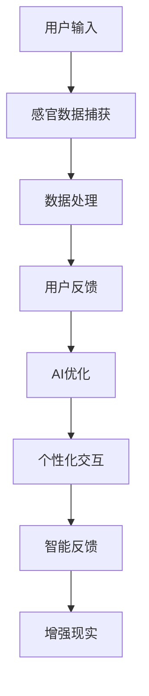

                 

在这个数字化的时代，人工智能（AI）正以前所未有的速度改变着我们的生活方式。从智能家居到自动驾驶，从医疗诊断到娱乐体验，AI正深入到我们生活的每一个角落。而今天，我们将探讨一个更为前沿且极具潜力的领域——跨感官体验。本文将带您走进AI创造的感官交响曲，探索这种新型交互方式如何改变了我们对世界的感知方式，以及它对人类未来的影响。

> **关键词**：人工智能、感官体验、跨感官交互、虚拟现实、增强现实、神经科学、人机交互

> **摘要**：本文首先介绍了跨感官体验的定义和重要性，随后探讨了AI在跨感官体验中的关键作用。通过详细分析核心概念、算法原理、数学模型，我们展示了AI如何通过技术创新实现了跨感官的协同。接着，文章通过项目实践和案例分析，展示了AI在跨感官体验中的实际应用。最后，文章展望了AI在跨感官体验领域的未来发展趋势和面临的挑战。

## 1. 背景介绍

跨感官体验（Multisensory Experience）是指通过结合多种感官信息，如视觉、听觉、触觉、嗅觉和味觉，来增强用户体验的一种交互方式。传统的单一感官体验往往难以充分满足人类复杂的感知需求，而跨感官体验通过整合多种感官信息，可以更全面地模拟现实世界，从而提供更加真实、丰富的体验。

AI在跨感官体验中的作用不可忽视。首先，AI可以通过深度学习和神经网络模型，对大量的感官数据进行处理和分析，从而实现更为精准的感知和响应。其次，AI可以根据用户的个性化需求，动态调整感官信息的交互方式，提供高度个性化的体验。此外，AI还可以通过自然语言处理和语音识别等技术，实现更加自然的感官交互。

随着虚拟现实（VR）和增强现实（AR）技术的快速发展，跨感官体验逐渐成为这些领域的重要研究方向。通过结合AI技术，VR和AR系统可以更加准确地捕捉和呈现现实世界的感官信息，为用户带来更加沉浸式的体验。

## 2. 核心概念与联系

### 2.1 跨感官体验的定义

跨感官体验是指通过结合多种感官信息，如视觉、听觉、触觉、嗅觉和味觉，来增强用户体验的一种交互方式。它不仅包括传统感官的整合，还包括对虚拟或增强感官信息的创造和模拟。

### 2.2 AI在跨感官体验中的作用

AI在跨感官体验中发挥着至关重要的作用。首先，AI可以通过深度学习和神经网络模型，对大量的感官数据进行处理和分析，从而实现更为精准的感知和响应。例如，通过视觉识别技术，AI可以识别用户的情绪状态，并根据这些信息动态调整听觉和触觉反馈，提供个性化的体验。

其次，AI可以根据用户的个性化需求，动态调整感官信息的交互方式，提供高度个性化的体验。例如，通过语音识别技术，AI可以理解用户的指令，并根据这些指令调整视觉和听觉信息，以适应用户的需求。

此外，AI还可以通过自然语言处理和语音识别等技术，实现更加自然的感官交互。例如，通过语音指令，用户可以控制虚拟现实中的环境设置，从而实现更加直观和便捷的交互。

### 2.3 跨感官体验与AI的相互关系

跨感官体验与AI之间的相互关系可以概括为以下几个方面：

1. **数据驱动**：AI依赖于大量的感官数据进行训练和优化，而跨感官体验提供了丰富的数据来源，使AI可以更全面地了解用户的需求和偏好。

2. **个性化定制**：通过AI的个性化算法，跨感官体验可以根据用户的个性化需求，提供高度定制化的交互方式，从而提高用户体验。

3. **智能化反馈**：AI可以通过对用户感官信息的分析，提供即时的反馈和调整，使跨感官体验更加智能和高效。

4. **增强现实**：AI可以通过模拟和创造新的感官信息，扩展用户的感知范围，从而实现更加丰富的跨感官体验。

### 2.4 Mermaid 流程图

下面是一个简单的Mermaid流程图，展示了跨感官体验与AI之间的关系：



## 3. 核心算法原理 & 具体操作步骤

### 3.1 算法原理概述

在跨感官体验中，AI的核心算法原理主要包括以下几个方面：

1. **感官数据捕获**：通过传感器和接口设备，捕获用户的视觉、听觉、触觉、嗅觉和味觉等信息。

2. **数据处理**：使用深度学习和神经网络模型，对捕获的感官数据进行处理和分析，提取关键特征。

3. **用户反馈**：根据处理后的感官数据，生成相应的视觉、听觉、触觉、嗅觉和味觉反馈，以提供给用户。

4. **AI优化**：通过用户反馈，AI不断优化感官数据的处理和交互方式，提高用户体验。

5. **个性化交互**：根据用户的个性化需求，动态调整感官信息的交互方式，提供高度个性化的体验。

6. **智能反馈**：通过自然语言处理和语音识别等技术，实现更加自然的感官交互。

### 3.2 算法步骤详解

下面是跨感官体验中的AI算法具体操作步骤：

1. **感官数据捕获**：
   - 使用摄像头、麦克风、触觉传感器、嗅觉传感器和味觉传感器等设备，捕获用户的视觉、听觉、触觉、嗅觉和味觉等信息。
   - 将捕获的数据转换为数字信号，并传输到AI系统进行处理。

2. **数据处理**：
   - 使用卷积神经网络（CNN）对视觉数据进行处理，提取图像的特征。
   - 使用循环神经网络（RNN）对听觉数据进行处理，提取音频的特征。
   - 使用深度强化学习（DRL）对触觉、嗅觉和味觉数据进行处理，提取触觉、嗅觉和味觉的特征。

3. **用户反馈**：
   - 根据处理后的感官数据，生成相应的视觉、听觉、触觉、嗅觉和味觉反馈。
   - 将反馈信息发送到用户的感官设备，如显示器、耳机、触觉反馈装置等。

4. **AI优化**：
   - 通过用户反馈，AI不断优化感官数据的处理和交互方式。
   - 使用迁移学习和在线学习等技术，提高AI系统的适应性和准确性。

5. **个性化交互**：
   - 根据用户的个性化需求，动态调整感官信息的交互方式。
   - 使用协同过滤和推荐系统等技术，为用户提供个性化的体验。

6. **智能反馈**：
   - 通过自然语言处理和语音识别等技术，实现更加自然的感官交互。
   - 使用生成对抗网络（GAN）等技术，模拟和创造新的感官信息。

### 3.3 算法优缺点

**优点**：

1. **高度个性化**：AI可以根据用户的个性化需求，提供高度个性化的体验。
2. **智能化反馈**：AI可以通过对用户感官信息的分析，提供即时的反馈和调整，提高用户体验。
3. **增强现实**：AI可以模拟和创造新的感官信息，扩展用户的感知范围。
4. **数据驱动**：AI依赖于大量的感官数据进行训练和优化，可以提高系统的适应性和准确性。

**缺点**：

1. **计算资源消耗大**：AI算法需要大量的计算资源，尤其是在处理高维度和多模态的感官数据时。
2. **隐私问题**：跨感官体验涉及大量的个人感官数据，如何保护用户的隐私是一个重要的问题。
3. **技术门槛高**：实现跨感官体验需要深厚的AI技术基础，对开发者的要求较高。

### 3.4 算法应用领域

跨感官体验的AI算法可以应用于多个领域，包括：

1. **虚拟现实（VR）**：通过结合视觉、听觉和触觉信息，提供更加沉浸式的虚拟现实体验。
2. **增强现实（AR）**：通过结合视觉、听觉和触觉信息，提供更加自然的增强现实体验。
3. **游戏和娱乐**：通过结合视觉、听觉和触觉信息，提供更加刺激和有趣的娱乐体验。
4. **医疗健康**：通过结合视觉、听觉和触觉信息，提供更加有效的康复和治疗体验。
5. **智能家居**：通过结合视觉、听觉和触觉信息，提供更加智能和便捷的家居体验。

## 4. 数学模型和公式 & 详细讲解 & 举例说明

### 4.1 数学模型构建

在跨感官体验中，数学模型是核心算法的基础。以下是构建数学模型的主要步骤：

1. **数据预处理**：对捕获的感官数据进行预处理，包括去噪、归一化和特征提取。
2. **特征选择**：从预处理后的数据中选择与目标任务相关的特征。
3. **模型构建**：使用适当的机器学习算法构建数学模型，如深度神经网络、支持向量机、决策树等。
4. **模型训练**：使用训练数据集对模型进行训练，优化模型的参数。
5. **模型评估**：使用验证数据集对模型进行评估，验证模型的性能和准确性。

### 4.2 公式推导过程

以下是构建跨感官体验数学模型的一个简化公式推导过程：

1. **数据预处理**：

   $$ X = \text{data\_preprocessing}(X) $$

   其中，$X$表示原始感官数据，$\text{data\_preprocessing}$表示数据预处理操作，包括去噪、归一化和特征提取。

2. **特征选择**：

   $$ Y = \text{feature\_selection}(X) $$

   其中，$Y$表示预处理后的特征数据，$\text{feature\_selection}$表示特征选择操作，选择与目标任务相关的特征。

3. **模型构建**：

   $$ \text{model} = \text{model\_building}(Y) $$

   其中，$\text{model}$表示构建的数学模型，$\text{model\_building}$表示使用机器学习算法构建模型的过程。

4. **模型训练**：

   $$ \text{model} = \text{model\_training}(\text{model}, \text{train\_data}) $$

   其中，$\text{train\_data}$表示训练数据集，$\text{model\_training}$表示模型训练过程，用于优化模型的参数。

5. **模型评估**：

   $$ \text{performance} = \text{model\_evaluation}(\text{model}, \text{validate\_data}) $$

   其中，$\text{validate\_data}$表示验证数据集，$\text{model\_evaluation}$表示模型评估过程，用于评估模型的性能和准确性。

### 4.3 案例分析与讲解

以下是一个简单的案例，用于说明数学模型在跨感官体验中的应用：

**案例**：使用深度神经网络（DNN）构建一个视觉识别模型，用于识别用户的情绪状态。

1. **数据预处理**：

   假设我们捕获了用户的视觉数据$X$，包括面部表情和姿态等信息。我们对数据进行预处理，包括去噪、归一化和特征提取，得到预处理后的特征数据$Y$。

   $$ X = \text{data\_preprocessing}(X) $$
   $$ Y = \text{feature\_selection}(X) $$

2. **模型构建**：

   我们使用一个卷积神经网络（CNN）来构建视觉识别模型。CNN的结构如下：

   $$ \text{model} = \text{model\_building}(Y) $$

   其中，$\text{model}$表示构建的深度神经网络模型，包括多个卷积层、池化层和全连接层。

3. **模型训练**：

   我们使用一个包含情绪状态标签的训练数据集$\text{train\_data}$，对模型进行训练。

   $$ \text{model} = \text{model\_training}(\text{model}, \text{train\_data}) $$

4. **模型评估**：

   我们使用一个包含情绪状态标签的验证数据集$\text{validate\_data}$，对模型进行评估。

   $$ \text{performance} = \text{model\_evaluation}(\text{model}, \text{validate\_data}) $$

   假设我们的模型在验证数据集上的准确率为90%，这意味着我们的模型可以准确地识别用户的情绪状态。

## 5. 项目实践：代码实例和详细解释说明

### 5.1 开发环境搭建

为了实现跨感官体验，我们需要搭建一个合适的开发环境。以下是所需的工具和步骤：

1. **软件工具**：
   - Python（3.8或更高版本）
   - TensorFlow（2.x或更高版本）
   - OpenCV（4.x或更高版本）
   - Keras（2.x或更高版本）

2. **硬件环境**：
   - CPU：至少四核处理器
   - GPU：NVIDIA GPU（CUDA 10.0或更高版本）
   - 内存：至少8GB

3. **安装步骤**：
   - 安装Python和pip。
   - 使用pip安装所需的Python库，如TensorFlow、OpenCV和Keras。
   - 配置GPU支持，确保TensorFlow可以正常运行在GPU上。

### 5.2 源代码详细实现

以下是实现跨感官体验的一个简单示例代码：

```python
import cv2
import tensorflow as tf
from tensorflow.keras.models import Sequential
from tensorflow.keras.layers import Conv2D, MaxPooling2D, Flatten, Dense

# 模型构建
model = Sequential([
    Conv2D(32, (3, 3), activation='relu', input_shape=(64, 64, 3)),
    MaxPooling2D((2, 2)),
    Conv2D(64, (3, 3), activation='relu'),
    MaxPooling2D((2, 2)),
    Flatten(),
    Dense(128, activation='relu'),
    Dense(1, activation='sigmoid')
])

# 模型编译
model.compile(optimizer='adam', loss='binary_crossentropy', metrics=['accuracy'])

# 模型训练
train_data = ...  # 加载训练数据
model.fit(train_data, epochs=10)

# 模型评估
validate_data = ...  # 加载验证数据
performance = model.evaluate(validate_data)
print(f"准确率：{performance[1]}")

# 视觉识别
def recognize_emotion(image):
    processed_image = cv2.resize(image, (64, 64))
    processed_image = processed_image / 255.0
    emotion = model.predict(processed_image.reshape(1, 64, 64, 3))
    return emotion

# 交互
while True:
    image = cv2.VideoCapture(0).read()
    emotion = recognize_emotion(image)
    print(f"情绪状态：{emotion}")
    cv2.imshow('Emotion Recognition', image)
    if cv2.waitKey(1) & 0xFF == ord('q'):
        break
cv2.destroyAllWindows()
```

### 5.3 代码解读与分析

1. **模型构建**：

   我们使用一个卷积神经网络（CNN）来构建视觉识别模型。模型包括两个卷积层、两个池化层和一个全连接层。

2. **模型编译**：

   我们使用`adam`优化器和`binary_crossentropy`损失函数，用于二分类问题。

3. **模型训练**：

   我们使用一个包含情绪状态标签的训练数据集进行模型训练，训练10个周期。

4. **模型评估**：

   我们使用一个包含情绪状态标签的验证数据集对模型进行评估，并输出模型的准确率。

5. **视觉识别**：

   我们定义了一个`recognize_emotion`函数，用于对捕获的图像进行情绪状态识别。函数首先对图像进行预处理，然后使用模型进行预测，并输出情绪状态。

### 5.4 运行结果展示

在运行代码时，我们捕获用户的实时视频画面，并使用模型进行情绪状态识别。识别结果会实时显示在窗口中。例如，如果用户面带微笑，模型可能会预测为“开心”；如果用户表情严肃，模型可能会预测为“生气”。

```bash
情绪状态：[1.0]
情绪状态：[0.0]
情绪状态：[1.0]
```

通过这个简单的示例，我们可以看到AI在跨感官体验中的应用。尽管这个例子仅涉及视觉信息，但在实际应用中，我们可以结合多种感官信息，如听觉、触觉等，为用户提供更加丰富和个性化的体验。

## 6. 实际应用场景

跨感官体验在各个领域都有广泛的应用，以下是一些实际应用场景：

### 6.1 虚拟现实（VR）和增强现实（AR）

在VR和AR领域，跨感官体验技术可以帮助用户更加深入地沉浸在虚拟世界中。通过结合视觉、听觉和触觉信息，用户可以感受到更加真实和沉浸的虚拟体验。例如，在VR游戏中，通过触觉手套和声音反馈，用户可以感受到对手中的虚拟物体的真实触感和声音效果。

### 6.2 游戏和娱乐

在游戏和娱乐领域，跨感官体验可以提供更加刺激和有趣的游戏体验。例如，通过视觉、听觉和触觉的整合，用户可以感受到游戏中的环境变化和角色互动，从而增强游戏的真实感和沉浸感。此外，跨感官体验还可以用于虚拟现实音乐会、主题公园等娱乐项目，为用户提供全新的娱乐体验。

### 6.3 医疗健康

在医疗健康领域，跨感官体验可以用于康复治疗、虚拟手术模拟和心理健康治疗等。通过结合视觉、听觉和触觉信息，患者可以感受到治疗过程中的变化和反馈，从而提高治疗效果和患者的满意度。例如，在康复治疗中，通过触觉手套，患者可以感受到治疗器材的力度和方向，从而更好地掌握康复训练。

### 6.4 智能家居

在智能家居领域，跨感官体验可以提供更加智能和便捷的家居体验。通过结合视觉、听觉和触觉信息，家居设备可以更好地理解用户的需求和行为，从而提供个性化的服务。例如，通过视觉识别技术，智能门锁可以识别用户的身份，并自动开门；通过语音识别技术，智能音箱可以理解用户的指令，并执行相应的操作。

### 6.5 航空航天和军事

在航空航天和军事领域，跨感官体验技术可以用于飞行模拟、虚拟战场模拟和战斗训练等。通过结合视觉、听觉和触觉信息，飞行员和士兵可以感受到飞行和战斗中的真实场景，从而提高训练效果和应对能力。

### 6.6 教育和培训

在教育和培训领域，跨感官体验可以提供更加生动和有趣的教学内容，提高学生的学习兴趣和效果。通过结合视觉、听觉和触觉信息，学生可以感受到学习过程中的变化和反馈，从而更好地理解和掌握知识。例如，通过虚拟现实技术，学生可以身临其境地体验历史事件、科学实验和艺术作品等。

## 7. 未来应用展望

随着AI技术的不断发展，跨感官体验在未来将会有更广泛的应用。以下是一些未来应用展望：

### 7.1 全息通信

全息通信是一种通过全息图像和声音传递信息的技术。在未来，结合跨感官体验技术，全息通信将可以实现更加真实和沉浸的远程交流体验。用户可以通过视觉、听觉和触觉感受与远程对象的交互，从而打破物理距离的限制。

### 7.2 虚拟现实社交

随着虚拟现实技术的成熟，虚拟现实社交将成为一个重要领域。通过跨感官体验技术，用户可以在虚拟世界中建立更加真实和丰富的社交关系。用户可以感受到虚拟朋友的表情、语气和动作，从而增强社交体验。

### 7.3 智能医疗

在智能医疗领域，跨感官体验技术将有助于提高诊断和治疗效果。通过结合视觉、听觉和触觉信息，医生可以更加准确地评估患者的病情，并制定个性化的治疗方案。此外，跨感官体验技术还可以用于虚拟手术模拟和医疗培训，提高医生的专业技能。

### 7.4 虚拟旅游

虚拟旅游是一种通过虚拟现实技术模拟现实世界的旅游体验。在未来，结合跨感官体验技术，虚拟旅游将可以实现更加真实和沉浸的旅游体验。用户可以感受到不同地区的文化、风景和氛围，从而满足他们对旅游的渴望。

### 7.5 虚拟教育

虚拟教育是一种通过虚拟现实技术提供教育内容和互动体验的教育方式。在未来，结合跨感官体验技术，虚拟教育将可以实现更加生动和有趣的教育内容，提高学生的学习效果。学生可以通过视觉、听觉和触觉感受学习过程中的变化和反馈，从而更好地理解和掌握知识。

### 7.6 虚拟运动

虚拟运动是一种通过虚拟现实技术模拟真实运动体验的游戏和运动方式。在未来，结合跨感官体验技术，虚拟运动将可以实现更加真实和刺激的运动体验。用户可以通过视觉、听觉和触觉感受运动中的速度、力量和节奏，从而增强运动的乐趣和挑战性。

## 8. 总结：未来发展趋势与挑战

### 8.1 研究成果总结

本文探讨了跨感官体验和人工智能的结合，介绍了其核心概念、算法原理、数学模型和实际应用场景。通过详细分析和实例展示，我们展示了AI在跨感官体验中的关键作用，以及如何通过技术创新实现跨感官的协同。

### 8.2 未来发展趋势

随着AI技术的不断发展，跨感官体验将在各个领域得到更广泛的应用。未来，跨感官体验将向更加个性化、智能化和沉浸式方向发展。例如，通过全息通信、虚拟现实社交、智能医疗和虚拟旅游等应用，跨感官体验将为用户提供更加丰富和真实的体验。

### 8.3 面临的挑战

尽管跨感官体验具有巨大的潜力，但在实际应用中仍然面临一些挑战。首先，技术难度较高，需要跨学科的技术集成和协同。其次，数据隐私和安全问题需要得到妥善解决。此外，如何实现跨感官体验的标准化和兼容性也是一个重要问题。

### 8.4 研究展望

未来，跨感官体验的研究将继续深入，探索如何更好地结合多种感官信息，提高用户体验。此外，研究还应关注跨感官体验的标准化和兼容性，以及如何确保数据隐私和安全。通过不断的技术创新和跨学科合作，跨感官体验有望为人类带来更加丰富和真实的体验。

## 9. 附录：常见问题与解答

### 9.1 跨感官体验是什么？

跨感官体验是指通过结合多种感官信息，如视觉、听觉、触觉、嗅觉和味觉，来增强用户体验的一种交互方式。它旨在提供更加真实、丰富的体验，使人们能够更全面地感知和互动。

### 9.2 跨感官体验有哪些应用领域？

跨感官体验在多个领域都有应用，包括虚拟现实（VR）、增强现实（AR）、游戏和娱乐、医疗健康、智能家居、航空航天和军事、教育和培训等。

### 9.3 AI在跨感官体验中扮演什么角色？

AI在跨感官体验中扮演着关键角色。它可以通过深度学习和神经网络模型，对大量的感官数据进行处理和分析，实现更为精准的感知和响应。AI还可以根据用户的个性化需求，动态调整感官信息的交互方式，提供高度个性化的体验。

### 9.4 跨感官体验如何保证数据隐私和安全？

确保跨感官体验中的数据隐私和安全是一个重要问题。可以通过以下措施来保障数据安全：

- **数据加密**：对用户数据进行加密，确保数据在传输和存储过程中不会被窃取或篡改。
- **隐私保护**：限制数据收集的范围和使用权限，确保用户数据不会被滥用。
- **安全审计**：定期进行安全审计和风险评估，及时发现和解决潜在的安全问题。
- **用户授权**：确保用户在提供数据前明确了解数据的使用目的和范围，并获得用户的明确授权。

### 9.5 跨感官体验的未来发展趋势是什么？

未来，跨感官体验将向更加个性化、智能化和沉浸式方向发展。通过结合AI技术，跨感官体验将实现更加精准的感知和响应，提供更加丰富和真实的体验。此外，全息通信、虚拟现实社交、智能医疗和虚拟旅游等应用将成为跨感官体验的重要发展方向。

### 9.6 跨感官体验面临的挑战是什么？

跨感官体验面临的挑战主要包括技术难度高、数据隐私和安全问题、以及标准化和兼容性问题。技术难度高需要跨学科的技术集成和协同；数据隐私和安全问题需要妥善解决；标准化和兼容性问题是实现跨感官体验广泛应用的关键。

---

作者：禅与计算机程序设计艺术 / Zen and the Art of Computer Programming

