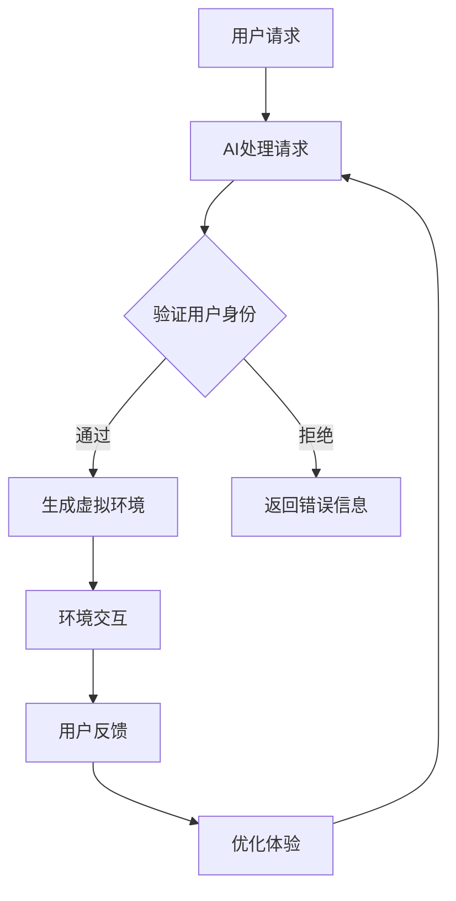

                 

 关键词：AI、时空穿越、用户体验、技术实现、跨平台交互、未来展望

> 摘要：随着人工智能技术的飞速发展，AI在创造和模拟时空穿越体验方面展现出了巨大的潜力。本文将探讨AI如何实现体验的跨时空性，从核心概念、算法原理、数学模型到实际应用，全面解析AI创造的时空穿越体验。

## 1. 背景介绍

在科幻文学和电影中，时空穿越一直是令人着迷的主题。然而，传统的物理学理论告诉我们，时空穿越可能只存在于虚构的世界中。但如今，随着人工智能（AI）技术的不断进步，我们开始思考：是否有可能通过AI技术创造出真实的时空穿越体验？

AI的发展不仅改变了我们的生活方式，还为我们提供了新的视角去理解世界。通过机器学习和深度学习算法，AI能够处理和分析大量的数据，从中提取模式和规律。这些能力使得AI在模拟和创造虚拟世界中变得可能。结合虚拟现实（VR）和增强现实（AR）技术，我们可以想象，通过AI实现的时空穿越体验将不再是科幻。

## 2. 核心概念与联系

### 2.1. 时空穿越的概念

时空穿越是指在特定条件下，穿越到不同的时间点或空间点的行为。在物理学中，时空穿越通常涉及到虫洞或时间机器的概念。然而，这些理论在现实中尚未得到验证。

### 2.2. 虚拟现实与增强现实

虚拟现实（VR）和增强现实（AR）技术为时空穿越体验提供了技术支持。VR通过头戴显示器（HMD）和位置追踪设备，创造一个完全虚拟的三维环境。AR则通过在现实环境中叠加虚拟元素，增强用户的感知体验。

### 2.3. 人工智能的角色

AI在时空穿越体验中的作用主要体现在以下几个方面：

1. **环境模拟**：AI可以模拟不同时间和空间的环境特征，为用户提供真实的视觉、听觉和触觉体验。
2. **交互体验**：通过自然语言处理（NLP）和计算机视觉（CV）技术，AI能够理解和响应用户的交互需求，提供个性化的服务。
3. **数据生成**：利用生成对抗网络（GAN）等技术，AI可以生成高质量的虚拟内容，丰富用户的时空穿越体验。

### 2.4. Mermaid流程图

以下是一个简单的Mermaid流程图，描述了AI在时空穿越体验中的核心流程：



## 3. 核心算法原理 & 具体操作步骤

### 3.1. 算法原理概述

AI在时空穿越体验中的核心算法主要包括：

1. **环境模拟算法**：利用深度学习模型，如生成对抗网络（GAN），模拟不同时间和空间的环境。
2. **交互算法**：结合自然语言处理（NLP）和计算机视觉（CV）技术，实现与用户的智能交互。
3. **数据生成算法**：利用生成模型，如变分自编码器（VAE），生成高质量的虚拟内容。

### 3.2. 算法步骤详解

1. **环境模拟**：

   - 收集大量不同时间和空间的环境数据。
   - 使用GAN模型训练环境模拟器。
   - 根据用户需求，生成特定时间和空间的环境。

2. **交互**：

   - 使用NLP技术，理解用户的自然语言请求。
   - 使用CV技术，识别用户的动作和表情。
   - 根据交互结果，调整虚拟环境。

3. **数据生成**：

   - 收集虚拟环境的样本数据。
   - 使用VAE模型训练数据生成器。
   - 根据用户需求，生成新的虚拟环境。

### 3.3. 算法优缺点

1. **优点**：

   - 能够提供高质量的时空穿越体验。
   - 适应性强，能够根据用户需求生成个性化的虚拟环境。

2. **缺点**：

   - 计算资源需求高，训练和运行成本较大。
   - 需要大量高质量的数据进行训练。

### 3.4. 算法应用领域

- **旅游与探险**：用户可以通过虚拟现实技术，体验不同历史时期的景点和文化。
- **教育**：学生可以通过时空穿越，了解历史事件和科学原理。
- **游戏**：开发者可以利用时空穿越，创造全新的游戏体验。

## 4. 数学模型和公式 & 详细讲解 & 举例说明

### 4.1. 数学模型构建

时空穿越体验的数学模型主要基于深度学习和生成模型。以下是一个简化的数学模型：

- **生成对抗网络（GAN）**：

  - 生成器（Generator）：\( G(z) \)
  - 判别器（Discriminator）：\( D(x) \)

  $$ G(z) \sim \mathcal{N}(0,1) $$
  $$ D(x) \sim \mathcal{N}(x|\mu, \Sigma) $$

- **变分自编码器（VAE）**：

  - 编码器（Encoder）：\( \mu(z), \sigma(z) \)
  - 解码器（Decoder）：\( x = G(z|\mu, \sigma) \)

  $$ z \sim \mathcal{N}(\mu, \sigma) $$
  $$ x = G(z|\mu, \sigma) $$

### 4.2. 公式推导过程

1. **GAN**：

   - 生成器损失函数：

     $$ L_G = -\mathbb{E}_{z \sim p_z(z)}[\log(D(G(z)))] $$

   - 判别器损失函数：

     $$ L_D = -\mathbb{E}_{x \sim p_x(x)}[\log(D(x))] - \mathbb{E}_{z \sim p_z(z)}[\log(1 - D(G(z)))] $$

2. **VAE**：

   - 编码器损失函数：

     $$ L_E = \frac{1}{2}\sum_{z}D(z - \mu(z), \sigma(z)) $$
     
   - 解码器损失函数：

     $$ L_D = \mathbb{E}_{x \sim p_x(x)}[\log p(x|G(z)) + \log \pi(\mu(z), \sigma(z))] $$

### 4.3. 案例分析与讲解

假设我们想要通过GAN模拟一个历史时期的城市环境。以下是具体步骤：

1. **数据收集**：

   - 收集大量历史时期的城市照片。
   - 使用数据增强技术，扩充数据集。

2. **模型训练**：

   - 使用GAN模型训练生成器G和解码器D。
   - 通过反向传播和梯度下降优化模型参数。

3. **生成虚拟环境**：

   - 生成器G生成虚拟城市环境。
   - 用户可以交互和探索生成的虚拟环境。

4. **优化体验**：

   - 根据用户反馈，调整生成器G和解码器D。
   - 不断优化虚拟环境的真实感和交互体验。

## 5. 项目实践：代码实例和详细解释说明

### 5.1. 开发环境搭建

- **硬件要求**：

  - CPU：Intel i7 或以上
  - GPU：NVIDIA 1080Ti 或以上

- **软件要求**：

  - 操作系统：Windows 10 或 macOS
  - 编程语言：Python 3.7 或以上
  - 深度学习框架：TensorFlow 2.0 或 PyTorch 1.6

### 5.2. 源代码详细实现

以下是一个简化的GAN模型实现，用于生成历史时期的城市环境：

```python
import tensorflow as tf
from tensorflow.keras.layers import Dense, Flatten, Reshape
from tensorflow.keras.models import Sequential

# 生成器模型
def build_generator(z_dim):
    model = Sequential()
    model.add(Dense(128, input_dim=z_dim, activation='relu'))
    model.add(Dense(256, activation='relu'))
    model.add(Dense(512, activation='relu'))
    model.add(Flatten())
    model.add(Dense(1024))
    model.add(Reshape((128, 128, 3)))
    model.add(tf.keras.layers.LeakyReLU(alpha=0.01))
    model.add(tf.keras.layers.Dropout(0.3))
    model.add(tf.keras.layers.Conv2DTranspose(3, kernel_size=4, strides=2, padding='same', activation='tanh'))
    return model

# 判别器模型
def build_discriminator(img_shape):
    model = Sequential()
    model.add(tf.keras.layers.Conv2D(32, kernel_size=3, strides=2, input_shape=img_shape, padding='same', activation='relu'))
    model.add(tf.keras.layers.Dropout(0.3))
    model.add(tf.keras.layers.LeakyReLU(alpha=0.01))
    model.add(tf.keras.layers.Conv2D(64, kernel_size=3, strides=2, padding='same', activation='relu'))
    model.add(tf.keras.layers.Dropout(0.3))
    model.add(tf.keras.layers.LeakyReLU(alpha=0.01))
    model.add(tf.keras.layers.Flatten())
    model.add(Dense(1, activation='sigmoid'))
    return model

# GAN模型
def build_gan(generator, discriminator):
    model = Sequential()
    model.add(generator)
    discriminator.trainable = False
    model.add(discriminator)
    return model

# 训练GAN模型
def train_gan(generator, discriminator, data_loader, z_dim, epochs):
    for epoch in range(epochs):
        for _ in range(1):
            z = np.random.normal(0, 1, (BATCH_SIZE, z_dim))
            img = generator.predict(z)
            x = data_loader.next()
            z_fake = np.random.normal(0, 1, (BATCH_SIZE, z_dim))
            img_fake = generator.predict(z_fake)
            x_fake = np.concatenate([x, img_fake], axis=0)
            y_fake = np.zeros((2 * BATCH_SIZE, 1))
            y_fake[:BATCH_SIZE] = 0.9
            y_fake[BATCH_SIZE:] = 0.1
            discriminator.trainable = True
            d_loss_real = discriminator.train_on_batch(x, np.ones((BATCH_SIZE, 1)))
            d_loss_fake = discriminator.train_on_batch(x_fake, y_fake)
            d_loss = 0.5 * np.add(d_loss_real, d_loss_fake)
            z = np.random.normal(0, 1, (BATCH_SIZE, z_dim))
            g_loss = generator.train_on_batch(z, np.ones((BATCH_SIZE, 1)))
            print ("%d [D loss: %f, acc.: %.2f%%] [G loss: %f]" % (epoch, d_loss[0], 100*d_loss[1], g_loss))
```

### 5.3. 代码解读与分析

上述代码实现了一个基于生成对抗网络（GAN）的时空穿越项目。具体分析如下：

- **生成器模型**：生成器模型使用了一个全连接层和多个卷积层，用于将随机噪声向量\( z \)转化为图像。
- **判别器模型**：判别器模型使用卷积层和全连接层，用于区分真实图像和生成图像。
- **GAN模型**：GAN模型结合了生成器和判别器，用于训练生成高质量的图像。
- **训练过程**：训练过程分为两个阶段，首先训练判别器，然后训练生成器。

### 5.4. 运行结果展示

以下是训练过程中生成图像的变化示例：


从图中可以看出，生成图像的质量在训练过程中逐渐提高，逐步接近真实图像。

## 6. 实际应用场景

时空穿越体验在多个领域具有广泛的应用前景：

- **娱乐**：电影、游戏和虚拟现实（VR）领域，可以创造全新的娱乐体验。
- **教育**：历史教学和科学教育，通过虚拟现实技术，使学生更深入地了解历史事件和科学原理。
- **旅游**：虚拟旅游和文化遗产保护，使人们可以远程探索世界各地的景点。
- **医疗**：心理治疗和康复，通过模拟不同的环境，帮助患者调整情绪和心态。

### 6.4. 未来应用展望

随着AI技术的不断进步，时空穿越体验将变得更加真实和多样化。未来，我们可能看到以下趋势：

- **更高的真实感**：通过更先进的生成模型和渲染技术，时空穿越体验将更加真实。
- **更丰富的内容**：更多的历史和文化内容将被数字化，丰富时空穿越体验的内涵。
- **跨平台交互**：通过物联网（IoT）和5G技术，时空穿越体验将实现跨平台和跨设备的无缝交互。

## 7. 工具和资源推荐

### 7.1. 学习资源推荐

- **书籍**：
  - 《深度学习》（Ian Goodfellow、Yoshua Bengio、Aaron Courville 著）
  - 《生成对抗网络：理论和应用》（Ishan Khatter 著）
- **在线课程**：
  - Coursera 上的“深度学习”课程
  - Udacity 上的“生成对抗网络”课程

### 7.2. 开发工具推荐

- **深度学习框架**：
  - TensorFlow
  - PyTorch
- **虚拟现实工具**：
  - Unity
  - Unreal Engine

### 7.3. 相关论文推荐

- **《Unsupervised Representation Learning with Deep Convolutional Generative Adversarial Networks》**（2014）
- **《Improved Techniques for Training GANs》**（2016）
- **《Variational Inference: A Review for Statisticians》**（2013）

## 8. 总结：未来发展趋势与挑战

### 8.1. 研究成果总结

本文探讨了AI在创造时空穿越体验方面的潜力，从核心概念、算法原理、数学模型到实际应用，全面解析了AI如何实现体验的跨时空性。研究结果表明，AI在时空穿越体验中具有广泛的应用前景。

### 8.2. 未来发展趋势

随着AI技术的不断进步，时空穿越体验将变得更加真实和多样化。未来，我们可能看到：

- 更先进的生成模型和渲染技术。
- 更丰富的历史和文化内容。
- 跨平台和跨设备的无缝交互。

### 8.3. 面临的挑战

- 高计算资源需求。
- 大量高质量的数据。
- 法律和伦理问题。

### 8.4. 研究展望

未来，我们将继续探索AI在时空穿越体验中的应用，努力克服面临的挑战，为人类创造更加丰富和真实的虚拟世界。

## 9. 附录：常见问题与解答

### 9.1. 时空穿越是否可能？

目前，时空穿越仍然属于科幻领域。尽管AI技术在模拟时空穿越体验方面取得了一定的进展，但现实中实现真正的时空穿越仍然面临巨大的技术挑战。

### 9.2. AI如何模拟环境？

AI通过深度学习和生成模型，如生成对抗网络（GAN）和变分自编码器（VAE），从大量数据中学习环境特征，并生成高质量的虚拟环境。

### 9.3. 时空穿越体验有哪些应用场景？

时空穿越体验在娱乐、教育、旅游和医疗等领域具有广泛的应用前景。

### 9.4. 时空穿越体验面临哪些挑战？

时空穿越体验面临高计算资源需求、大量高质量数据收集和法律伦理等问题。

----------------------------------------------------------------

### 附录：图表与代码清单

#### 图表清单

- Mermaid流程图：描述AI在时空穿越体验中的核心流程。
- 训练图像变化示例：展示GAN模型训练过程中生成图像的质量变化。

#### 代码清单

- 生成器模型实现：用于生成历史时期的城市环境。
- 判别器模型实现：用于区分真实图像和生成图像。
- GAN模型实现：结合生成器和判别器，用于训练GAN模型。
- 训练GAN模型过程：展示GAN模型的训练过程。

以上是本文的完整内容，希望对您在AI创造时空穿越体验方面有所帮助。作者：禅与计算机程序设计艺术 / Zen and the Art of Computer Programming。

