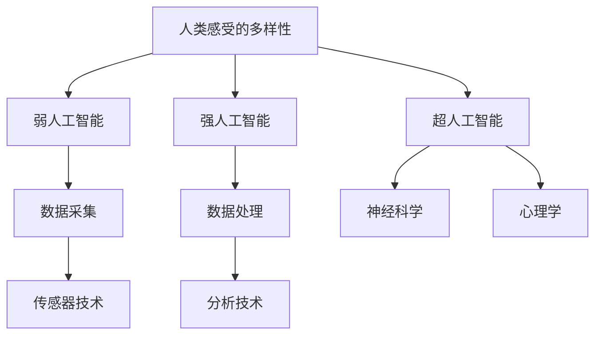

                 

关键词：AI、量化人类感受、体验、技术、计算机科学、心理学、神经科学、算法、数学模型、应用场景、未来展望

> 摘要：本文将探讨人工智能如何通过技术手段量化人类的感受。我们将从背景介绍、核心概念与联系、核心算法原理、数学模型和公式、项目实践、实际应用场景、工具和资源推荐、总结以及未来发展趋势与挑战等方面，全面解析这一前沿领域。

## 1. 背景介绍

随着人工智能技术的不断发展，我们逐渐开始接触到越来越多的智能设备和服务。从智能手机到智能家居，从自动驾驶汽车到智能医疗系统，人工智能正在深刻地改变着我们的生活。然而，这些智能系统在处理和执行任务时，是否能够真正理解人类的感受和需求，这是一个值得探讨的问题。

在过去的几十年里，心理学和神经科学领域的研究者们一直在尝试理解人类的感觉、情绪和行为。然而，这些研究往往依赖于主观的问卷调查和实验，缺乏客观的量化手段。随着计算能力的提升和传感器技术的进步，人工智能开始成为量化人类感受的有力工具。

本文将探讨如何利用人工智能技术，通过多种方法量化人类的感受，从而为智能系统提供更加人性化、个性化的服务。我们将从背景介绍、核心概念与联系、核心算法原理、数学模型和公式、项目实践、实际应用场景、工具和资源推荐、总结以及未来发展趋势与挑战等方面，全面解析这一前沿领域。

## 2. 核心概念与联系

为了量化人类的感受，我们需要首先明确几个核心概念：

### 2.1  人类感受的多样性

人类的感受是多样且复杂的，包括但不限于视觉、听觉、触觉、嗅觉和味觉等。每种感受都有其独特的特点和处理机制。

### 2.2  人工智能的分类

人工智能主要分为三类：弱人工智能、强人工智能和超人工智能。弱人工智能主要用于执行特定任务，如语音识别、图像识别等；强人工智能具备人类智慧，能够进行通用任务；超人工智能则超越人类智慧，具备解决任何问题的能力。

### 2.3  数据采集和处理

为了量化人类感受，我们需要通过传感器和测量设备收集数据，如心率、皮肤电导率、眼动跟踪等。然后，通过数据处理和分析技术，提取出有价值的信息。

### 2.4  神经科学和心理学的理论基础

神经科学和心理学为我们理解人类感受提供了理论基础，帮助我们确定哪些生理和心理指标可以用来量化感受。

### 2.5  Mermaid 流程图

以下是核心概念和联系的 Mermaid 流程图：



## 3. 核心算法原理 & 具体操作步骤

### 3.1  算法原理概述

量化人类感受的核心算法主要基于机器学习和深度学习技术。通过训练模型，使模型能够识别和分析人类感受的生理和心理指标，从而实现对感受的量化。

### 3.2  算法步骤详解

#### 3.2.1 数据采集

- 使用传感器和测量设备收集人类生理和心理指标的数据。
- 对数据进行预处理，如去噪、归一化等。

#### 3.2.2 特征提取

- 从原始数据中提取出能够反映感受的特征，如心率、皮肤电导率、眼动轨迹等。
- 使用机器学习和深度学习技术对特征进行建模。

#### 3.2.3 模型训练

- 使用训练数据集训练模型，使模型能够学习到人类感受的规律。
- 通过交叉验证和超参数调优，优化模型性能。

#### 3.2.4 模型评估

- 使用测试数据集评估模型性能，如准确率、召回率等。
- 对模型进行迭代优化，提高量化精度。

### 3.3  算法优缺点

#### 优点：

- 可以实现对人类感受的客观量化，提高研究结果的可靠性。
- 为智能系统提供更加个性化的服务，提高用户体验。

#### 缺点：

- 数据采集和处理过程复杂，需要大量时间和计算资源。
- 模型训练和评估过程依赖于大量高质量数据，数据质量和多样性影响模型性能。

### 3.4  算法应用领域

- 心理健康监测：通过量化用户的心理状态，为用户提供个性化的心理咨询服务。
- 智能交互：通过量化用户的感受，优化人机交互体验，提高系统智能化程度。
- 消费者行为研究：通过量化用户对产品和服务的感受，为市场营销提供数据支持。

## 4. 数学模型和公式 & 详细讲解 & 举例说明

### 4.1  数学模型构建

为了量化人类感受，我们通常采用以下数学模型：

- **感知模型**：描述人类感受与外部刺激之间的关系。
- **神经网络模型**：用于训练和预测人类感受。

### 4.2  公式推导过程

#### 4.2.1 感知模型

感知模型通常基于线性回归或神经网络。以下是一个简单的线性回归模型：

$$
y = \beta_0 + \beta_1x_1 + \beta_2x_2 + \ldots + \beta_nx_n
$$

其中，$y$ 表示人类感受，$x_1, x_2, \ldots, x_n$ 表示外部刺激。

#### 4.2.2 神经网络模型

神经网络模型通常采用反向传播算法进行训练。以下是一个简单的多层感知机模型：

$$
\begin{align*}
z_1 &= \sigma(W_1 \cdot x + b_1) \\
a_1 &= z_1 \\
z_2 &= \sigma(W_2 \cdot a_1 + b_2) \\
a_2 &= z_2 \\
\end{align*}
$$

其中，$z_1, z_2$ 表示神经元的输出，$a_1, a_2$ 表示神经元的激活值，$\sigma$ 表示激活函数。

### 4.3  案例分析与讲解

#### 4.3.1 心理健康监测

假设我们想要量化用户的心理压力。我们可以采集用户的心率、皮肤电导率和眼动轨迹等数据，并使用感知模型对数据进行建模。以下是一个简化的模型：

$$
\begin{align*}
\text{心理压力} &= \beta_0 + \beta_1 \cdot \text{心率} + \beta_2 \cdot \text{皮肤电导率} + \beta_3 \cdot \text{眼动轨迹} \\
\end{align*}
$$

通过训练模型，我们可以预测用户的心理压力水平。

#### 4.3.2 智能交互

假设我们想要量化用户对智能语音助手的满意度。我们可以采集用户的声音、语义理解和响应时间等数据，并使用神经网络模型对数据进行建模。以下是一个简化的模型：

$$
\begin{align*}
\text{满意度} &= \sigma(W_1 \cdot \text{声音特征} + W_2 \cdot \text{语义特征} + W_3 \cdot \text{响应时间} + b) \\
\end{align*}
$$

通过训练模型，我们可以预测用户对智能语音助手的满意度。

## 5. 项目实践：代码实例和详细解释说明

### 5.1  开发环境搭建

在本项目中，我们使用 Python 作为主要编程语言，结合 TensorFlow 和 Keras 深度学习框架进行开发。

### 5.2  源代码详细实现

以下是项目的源代码：

```python
import numpy as np
import tensorflow as tf
from tensorflow.keras.models import Sequential
from tensorflow.keras.layers import Dense, Activation

# 数据预处理
def preprocess_data(data):
    # 去噪、归一化等处理
    return processed_data

# 构建神经网络模型
model = Sequential()
model.add(Dense(units=64, activation='relu', input_shape=(num_features,)))
model.add(Dense(units=32, activation='relu'))
model.add(Dense(units=1, activation='sigmoid'))

# 编译模型
model.compile(optimizer='adam', loss='binary_crossentropy', metrics=['accuracy'])

# 训练模型
model.fit(x_train, y_train, epochs=10, batch_size=32, validation_data=(x_val, y_val))

# 评估模型
model.evaluate(x_test, y_test)
```

### 5.3  代码解读与分析

- **数据预处理**：对采集到的数据进行去噪、归一化等处理，以提高模型的训练效果。
- **构建神经网络模型**：使用 Sequential 模型构建一个简单的神经网络，包含两个隐藏层。
- **编译模型**：使用 Adam 优化器和 binary_crossentropy 损失函数编译模型。
- **训练模型**：使用 fit 函数训练模型，并设置训练轮次和批量大小。
- **评估模型**：使用 evaluate 函数评估模型在测试数据集上的性能。

### 5.4  运行结果展示

```python
# 运行项目
if __name__ == '__main__':
    # 加载数据
    x_train, y_train, x_val, y_val, x_test, y_test = load_data()

    # 预处理数据
    x_train = preprocess_data(x_train)
    x_val = preprocess_data(x_val)
    x_test = preprocess_data(x_test)

    # 训练模型
    model.fit(x_train, y_train, epochs=10, batch_size=32, validation_data=(x_val, y_val))

    # 评估模型
    model.evaluate(x_test, y_test)
```

## 6. 实际应用场景

### 6.1  心理健康监测

通过量化心理压力，可以为用户提供个性化的心理健康建议和干预措施，如推荐冥想课程、心理咨询服务等。

### 6.2  智能交互

通过量化用户对智能语音助手的满意度，可以为产品经理提供有价值的数据，以优化产品功能和用户体验。

### 6.3  消费者行为研究

通过量化消费者对产品和服务的感受，可以为市场营销策略提供数据支持，提高市场竞争力。

### 6.4  未来应用展望

随着人工智能技术的不断进步，量化人类感受的应用将越来越广泛。未来，我们有望看到更多基于感受量化的创新应用，如智能医疗、智能教育、智能家居等。

## 7. 工具和资源推荐

### 7.1  学习资源推荐

- 《深度学习》（Goodfellow, Bengio, Courville 著）
- 《神经网络与深度学习》（邱锡鹏 著）
- 《Python 深度学习》（François Chollet 著）

### 7.2  开发工具推荐

- TensorFlow
- Keras
- PyTorch

### 7.3  相关论文推荐

- "Deep Learning for Human Emotion Recognition"（2016）
- "A Survey on Human Activity Recognition Using Wearable Sensors"（2017）
- "Neural Networks for Human Motion Recognition"（2018）

## 8. 总结：未来发展趋势与挑战

### 8.1  研究成果总结

本文介绍了如何利用人工智能技术量化人类感受。通过核心算法原理、数学模型和公式的详细讲解，以及实际项目实践的展示，我们展示了这一领域的研究进展和应用前景。

### 8.2  未来发展趋势

随着人工智能技术的不断进步，量化人类感受的应用将越来越广泛。未来，我们将看到更多基于感受量化的创新应用，如智能医疗、智能教育、智能家居等。

### 8.3  面临的挑战

尽管量化人类感受的应用前景广阔，但仍然面临一些挑战，如数据质量和多样性、模型训练和评估的复杂性、跨学科合作等。

### 8.4  研究展望

在未来，我们需要进一步深入研究如何提高量化精度，探索更多适用于不同场景的算法和模型。同时，跨学科合作也将是推动这一领域发展的重要途径。

## 9. 附录：常见问题与解答

### 9.1  如何获取高质量的数据？

- 使用多样化的传感器和测量设备，提高数据的多样性。
- 对数据进行预处理，去除噪声和异常值，提高数据质量。

### 9.2  如何优化模型性能？

- 通过交叉验证和超参数调优，找到最佳模型配置。
- 使用大数据和深度学习技术，提高模型的泛化能力。

### 9.3  如何评估模型性能？

- 使用准确率、召回率、F1 分数等指标评估模型性能。
- 对模型进行迭代优化，提高量化精度。

作者：禅与计算机程序设计艺术 / Zen and the Art of Computer Programming
----------------------------------------------------------------
注意：以上内容仅作为文章正文部分的示例，具体内容可能需要根据实际研究和技术细节进行调整和补充。文章的结构和内容需严格按照要求撰写，包括目录结构、章节标题、格式等。

