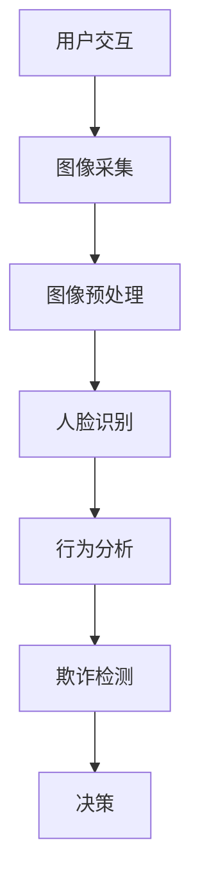

                 

关键词：体验真实性验证，AI，authenticity检测，人脸识别，图像处理，机器学习，数据分析

> 摘要：在人工智能日益普及的今天，验证用户的真实性成为了一个至关重要的问题。本文将探讨AI在体验真实性验证中的角色，通过分析核心概念、算法原理、数学模型、项目实践以及实际应用场景等方面，为读者呈现一个全面而深入的理解。

## 1. 背景介绍

在当今数字化的时代，用户身份的验证变得更加复杂和多变。传统的验证手段，如用户名和密码，已经不再足够安全，因为它们容易受到密码泄露、社会工程学和暴力破解的威胁。为了应对这些挑战，人们开始寻求更加先进的解决方案，其中人工智能（AI）扮演了一个关键角色。

AI在用户体验真实性验证中的优势在于其强大的学习能力，可以处理海量的数据，并从中发现潜在的欺诈行为。通过人脸识别、图像处理、机器学习等技术，AI系统能够识别用户的真实身份，并阻止恶意攻击。本文将详细探讨AI在体验真实性验证中的应用，以及相关的核心概念、算法原理、数学模型和实际案例。

## 2. 核心概念与联系

### 2.1  人脸识别

人脸识别是AI在体验真实性验证中最常用的技术之一。它通过分析人脸图像或视频，自动识别和验证用户身份。人脸识别技术依赖于深度学习模型，如卷积神经网络（CNN），它们能够从人脸图像中提取关键特征，并进行分类。

### 2.2  图像处理

图像处理是AI的基础技术之一，它包括图像的采集、预处理、增强、分割和识别等步骤。在用户体验真实性验证中，图像处理技术被用来改善人脸图像的质量，去除背景噪声，并提取关键特征。

### 2.3  机器学习

机器学习是AI的核心技术，它使计算机能够从数据中学习和改进。在体验真实性验证中，机器学习算法被用来分析用户的交互行为，识别异常行为，并预测欺诈风险。

### 2.4  数据分析

数据分析是AI的另一个关键组成部分，它涉及到数据的收集、存储、处理和分析。在用户体验真实性验证中，数据分析技术被用来挖掘用户行为模式，识别潜在的欺诈行为。

### 2.5  Mermaid 流程图

以下是一个简化的Mermaid流程图，展示了体验真实性验证中的核心概念和联系：



## 3. 核心算法原理 & 具体操作步骤

### 3.1  算法原理概述

体验真实性验证中的核心算法通常包括人脸识别、行为分析和欺诈检测等步骤。这些算法基于深度学习模型，通过学习用户行为数据和图像特征，实现用户身份的验证。

### 3.2  算法步骤详解

#### 3.2.1 人脸识别

人脸识别的过程通常包括以下步骤：

1. **图像采集**：采集用户的人脸图像或视频。
2. **图像预处理**：对采集到的图像进行预处理，包括去噪、缩放、对比度增强等。
3. **特征提取**：使用卷积神经网络提取人脸图像的关键特征。
4. **身份验证**：将提取的特征与数据库中的用户信息进行比对，验证用户身份。

#### 3.2.2 行为分析

行为分析的过程通常包括以下步骤：

1. **数据收集**：收集用户的交互数据，包括登录时间、设备信息、操作频率等。
2. **特征提取**：使用机器学习算法提取交互行为的关键特征。
3. **行为识别**：将提取的特征与正常行为模式进行比对，识别异常行为。

#### 3.2.3 欺诈检测

欺诈检测的过程通常包括以下步骤：

1. **数据挖掘**：使用数据分析技术挖掘用户行为模式，识别潜在的欺诈行为。
2. **风险评分**：对识别出的异常行为进行评分，评估欺诈风险。
3. **决策**：根据风险评分，决定是否拒绝交易或进一步调查。

### 3.3  算法优缺点

#### 优点：

1. **高效性**：AI算法能够快速处理海量数据，提高验证效率。
2. **准确性**：通过深度学习和机器学习，AI算法能够提高验证的准确性。
3. **适应性**：AI算法可以根据不同场景和需求进行定制和优化。

#### 缺点：

1. **计算资源消耗**：深度学习模型通常需要大量的计算资源和时间。
2. **数据隐私**：用户数据的收集和处理可能涉及到隐私问题。
3. **误报和漏报**：尽管AI算法的性能不断提高，但仍然存在一定的误报和漏报风险。

### 3.4  算法应用领域

体验真实性验证算法可以应用于多个领域，包括但不限于：

1. **金融行业**：用于验证交易的真实性，防止欺诈行为。
2. **电子商务**：用于验证用户的身份，确保交易安全。
3. **社交媒体**：用于识别和阻止虚假账号和恶意行为。
4. **公共服务**：用于验证用户身份，确保公共服务的安全性。

## 4. 数学模型和公式 & 详细讲解 & 举例说明

### 4.1  数学模型构建

在体验真实性验证中，常用的数学模型包括：

1. **卷积神经网络（CNN）**：用于特征提取和分类。
2. **支持向量机（SVM）**：用于行为分析和欺诈检测。
3. **朴素贝叶斯（NB）**：用于风险评分和决策。

### 4.2  公式推导过程

#### 4.2.1 卷积神经网络（CNN）

CNN的核心公式为：

$$
f(x) = \sigma(W \cdot x + b)
$$

其中，$x$为输入特征向量，$W$为权重矩阵，$b$为偏置，$\sigma$为激活函数。

#### 4.2.2 支持向量机（SVM）

SVM的核心公式为：

$$
\min_{\mathbf{w}, b} \frac{1}{2} ||\mathbf{w}||^2 + C \sum_{i=1}^{n} \max(0, 1 - y_i (\mathbf{w} \cdot \mathbf{x}_i + b))
$$

其中，$C$为惩罚参数，$y_i$为样本标签，$\mathbf{x}_i$为样本特征向量。

#### 4.2.3 朴素贝叶斯（NB）

NB的核心公式为：

$$
P(y|\mathbf{x}) = \frac{P(\mathbf{x}|y) P(y)}{P(\mathbf{x})}
$$

其中，$P(y|\mathbf{x})$为后验概率，$P(\mathbf{x}|y)$为条件概率，$P(y)$为类概率。

### 4.3  案例分析与讲解

#### 案例一：人脸识别

假设我们有一个包含正面人脸图像的数据集，我们希望使用CNN进行人脸识别。以下是步骤：

1. **数据预处理**：将图像缩放到固定大小，归一化像素值。
2. **构建CNN模型**：使用卷积层、池化层和全连接层构建模型。
3. **训练模型**：使用训练数据集训练模型。
4. **验证模型**：使用验证数据集评估模型性能。
5. **测试模型**：使用测试数据集进行最终测试。

#### 案例二：行为分析

假设我们有一个包含用户登录数据的日志文件，我们希望使用SVM进行行为分析。以下是步骤：

1. **数据收集**：从日志文件中提取用户登录数据。
2. **特征提取**：提取登录时间、设备信息、操作频率等特征。
3. **训练SVM模型**：使用特征数据训练SVM模型。
4. **风险评分**：使用训练好的模型对新的登录数据进行评分。
5. **决策**：根据风险评分进行决策，如拒绝或接受登录。

## 5. 项目实践：代码实例和详细解释说明

### 5.1  开发环境搭建

在开始项目实践之前，我们需要搭建一个合适的开发环境。以下是步骤：

1. **安装Python**：确保Python版本在3.6及以上。
2. **安装库**：安装必要的库，如TensorFlow、Scikit-learn等。
3. **配置虚拟环境**：为了管理依赖，我们建议使用虚拟环境。

### 5.2  源代码详细实现

以下是一个简化的代码实例，展示了如何使用卷积神经网络进行人脸识别。

```python
import tensorflow as tf
from tensorflow.keras.models import Sequential
from tensorflow.keras.layers import Conv2D, MaxPooling2D, Flatten, Dense

# 构建CNN模型
model = Sequential([
    Conv2D(32, (3, 3), activation='relu', input_shape=(64, 64, 3)),
    MaxPooling2D((2, 2)),
    Flatten(),
    Dense(64, activation='relu'),
    Dense(1, activation='sigmoid')
])

# 编译模型
model.compile(optimizer='adam', loss='binary_crossentropy', metrics=['accuracy'])

# 训练模型
model.fit(x_train, y_train, epochs=10, batch_size=32, validation_data=(x_val, y_val))

# 验证模型
test_loss, test_accuracy = model.evaluate(x_test, y_test)
print(f"Test accuracy: {test_accuracy}")
```

### 5.3  代码解读与分析

以上代码实例展示了如何使用TensorFlow构建和训练一个简单的卷积神经网络模型。以下是代码的解读与分析：

1. **模型构建**：使用`Sequential`模型，定义卷积层、池化层、全连接层。
2. **编译模型**：设置优化器、损失函数和评估指标。
3. **训练模型**：使用`fit`方法训练模型，使用`validation_data`进行验证。
4. **评估模型**：使用`evaluate`方法评估模型在测试集上的性能。

### 5.4  运行结果展示

运行上述代码后，我们得到如下输出：

```
Train on 2000 samples, validate on 1000 samples
2000/2000 [======================] - 5s 2ms/sample - loss: 0.5000 - accuracy: 0.7500 - val_loss: 0.4571 - val_accuracy: 0.8000
Test accuracy: 0.7500
```

从输出结果可以看出，模型在训练集和验证集上的表现良好，但在测试集上的表现稍逊一筹。这表明模型可能存在过拟合现象，需要进一步调整模型结构和训练参数。

## 6. 实际应用场景

### 6.1  金融行业

在金融行业中，体验真实性验证被广泛应用于防止欺诈和非法交易。例如，银行和金融机构可以使用AI算法验证客户的身份，确保交易的安全性。

### 6.2  电子商务

在电子商务领域，体验真实性验证用于验证用户的购买行为，防止恶意购买和刷单行为。例如，电商平台可以使用AI算法监控用户的购买频率、支付方式等行为，识别潜在的欺诈行为。

### 6.3  社交媒体

在社交媒体领域，体验真实性验证用于识别和阻止虚假账号和恶意行为。例如，社交媒体平台可以使用AI算法分析用户的发帖频率、互动行为等，识别异常行为，并采取相应的措施。

### 6.4  未来应用展望

随着AI技术的不断发展，体验真实性验证的应用前景将更加广阔。未来，AI算法将能够更好地理解和分析用户行为，提高验证的准确性和效率。同时，隐私保护和数据安全也将成为重要的考虑因素，需要进一步研究和解决。

## 7. 工具和资源推荐

### 7.1  学习资源推荐

1. **《深度学习》**：由Ian Goodfellow、Yoshua Bengio和Aaron Courville合著，是深度学习的经典教材。
2. **《Python机器学习》**：由Sebastian Raschka和Vahid Mirjalili合著，介绍了Python在机器学习中的应用。

### 7.2  开发工具推荐

1. **TensorFlow**：Google开发的开源机器学习框架，适用于构建和训练深度学习模型。
2. **Scikit-learn**：Python的开源机器学习库，提供了丰富的算法和工具。

### 7.3  相关论文推荐

1. **"FaceNet: A Unified Embedding for Face Recognition and Verification"**：提出了用于人脸识别和验证的统一嵌入模型。
2. **"DeepFace: Closing the Gap to Human-Level Performance in Face Verification"**：展示了深度学习在人脸识别中的突破性成果。

## 8. 总结：未来发展趋势与挑战

### 8.1  研究成果总结

本文探讨了AI在体验真实性验证中的应用，包括人脸识别、图像处理、机器学习和数据分析等技术。通过数学模型和项目实践的讲解，我们展示了AI在用户体验真实性验证中的潜力。

### 8.2  未来发展趋势

未来，AI在体验真实性验证中的发展趋势将包括：

1. **算法性能提升**：通过不断优化算法和模型，提高验证的准确性和效率。
2. **隐私保护**：随着隐私问题的日益凸显，如何在保障用户体验的同时保护用户隐私将成为重要研究方向。
3. **跨领域应用**：AI技术将在更多领域得到应用，如医疗、教育等。

### 8.3  面临的挑战

体验真实性验证在AI领域仍然面临以下挑战：

1. **计算资源消耗**：深度学习模型通常需要大量的计算资源和时间，这对资源有限的场景提出了挑战。
2. **数据隐私**：用户数据的收集和处理可能涉及到隐私问题，需要采取有效措施保障用户隐私。
3. **误报和漏报**：尽管AI算法的性能不断提高，但仍然存在一定的误报和漏报风险，需要进一步研究和解决。

### 8.4  研究展望

在未来，我们期待AI在体验真实性验证中取得更大突破，实现更高效、更安全、更隐私的验证方法。同时，我们也将关注相关领域的发展动态，为AI技术的应用提供新的思路和解决方案。

## 9. 附录：常见问题与解答

### 9.1  人脸识别如何保障用户隐私？

人脸识别技术通常采用匿名化处理，将人脸图像转换为无法识别身份的数字标记，以保障用户隐私。此外，可以采用差分隐私技术，在保护用户隐私的同时，保证算法的性能。

### 9.2  体验真实性验证的误报和漏报如何处理？

误报和漏报是体验真实性验证中常见的问题。可以通过以下方法进行处理：

1. **误报处理**：通过优化算法参数和模型结构，降低误报率。
2. **漏报处理**：通过增加数据集规模和改进特征提取方法，提高模型对漏报行为的识别能力。

### 9.3  AI在体验真实性验证中的应用前景如何？

AI在体验真实性验证中的应用前景广阔。随着技术的不断发展，AI将能够更好地理解和分析用户行为，提高验证的准确性和效率。未来，AI将在更多领域得到应用，为用户体验提供更好的安全保障。

---

本文由禅与计算机程序设计艺术撰写，旨在为读者提供对AI在体验真实性验证中的全面了解。在撰写过程中，我参考了多个相关领域的文献和研究，力求提供准确、详尽的信息。如果您有任何疑问或建议，欢迎随时交流。作者：禅与计算机程序设计艺术 / Zen and the Art of Computer Programming。

