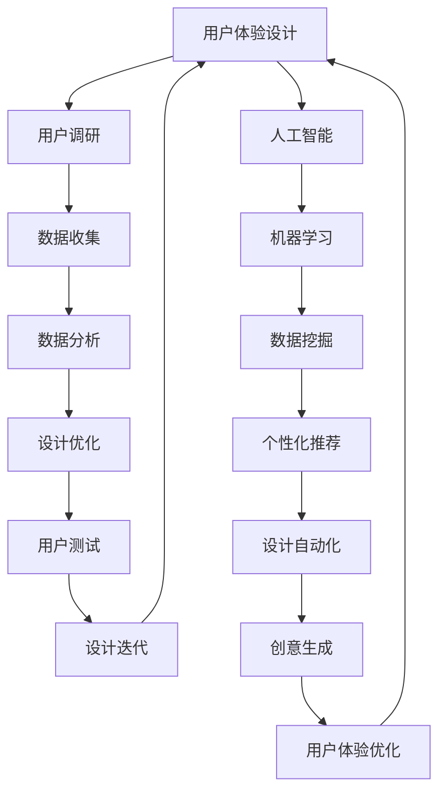

                 

 在这个技术飞速发展的时代，人工智能（AI）已经成为推动用户体验设计的核心动力。传统的用户体验设计往往局限于人类的直觉和经验，而AI的引入则为设计注入了新的活力和无限可能。本文将探讨AI与人类创意的跨界合作，如何在体验设计中开创一个全新的纪元。

> 关键词：人工智能、用户体验设计、创意、跨界合作

> 摘要：本文将分析AI在用户体验设计中的作用，探讨人类与AI如何通过跨界合作实现设计的创新，以及这种合作模式对未来用户体验设计的影响。

## 1. 背景介绍

随着互联网和移动设备的普及，用户体验（UX）设计已经成为产品成功的关键因素。用户体验设计不仅仅关注产品的功能性，更注重用户的情感体验和满意度。然而，传统的用户体验设计方法往往依赖于人类设计师的直觉和经验，这限制了设计的广度和深度。

人工智能的出现为用户体验设计带来了全新的机遇。AI可以通过大数据分析和机器学习，深入了解用户行为和偏好，从而为设计提供更加精准的指导。同时，AI还可以辅助设计师完成繁琐的工作，让设计师有更多的时间和精力专注于创意和创新。

### 1.1 用户体验设计的现状

传统的用户体验设计主要依赖于以下方法：

- 用户调研：通过访谈、问卷等方式收集用户反馈。
- 原型设计：使用草图、线框图和原型工具制作产品原型。
- 用户测试：邀请真实用户对产品原型进行测试，收集反馈。
- 设计迭代：根据用户反馈进行设计迭代，优化产品。

尽管这些方法在一定程度上提高了产品的用户体验，但仍然存在以下问题：

- 设计的广度和深度有限：传统方法往往依赖于设计师的直觉和经验，难以充分挖掘用户的潜在需求和偏好。
- 设计周期长：从用户调研到设计迭代往往需要较长的时间，无法快速响应市场变化。
- 设计成本高：用户调研和用户测试等步骤需要大量的人力和物力投入。

### 1.2 AI在用户体验设计中的机遇

AI的出现为用户体验设计带来了以下机遇：

- 用户行为分析：AI可以通过大数据分析和机器学习，实时分析用户的行为数据，为设计提供实时反馈。
- 个性化推荐：AI可以根据用户的兴趣和行为，提供个性化的内容推荐，提升用户体验。
- 设计自动化：AI可以辅助设计师完成部分设计任务，如生成原型、配色方案等，提高设计效率。
- 创新驱动：AI可以为设计师提供新的创意和灵感，推动设计的创新。

## 2. 核心概念与联系

在探讨AI与用户体验设计的跨界合作之前，我们需要了解一些核心概念和它们之间的联系。

### 2.1 用户体验设计（UX Design）

用户体验设计是一种以用户为中心的设计方法，旨在创建产品或服务，使其对用户而言既易于使用又愉快。用户体验设计关注以下几个方面：

- 可用性（Usability）：产品或服务是否易于使用，用户能否轻松完成任务。
- 可访问性（Accessibility）：产品或服务是否对各种用户（包括残疾人和老年用户）都是可用的。
- 可用性（User Experience）：用户在使用产品或服务时的整体感受，包括情感体验和满意度。
- 可用性（User Research）：通过用户调研、访谈和测试，了解用户的需求和行为。

### 2.2 人工智能（AI）

人工智能是一种模拟人类智能的技术，旨在使计算机具备类似人类的感知、学习和决策能力。人工智能可以分为以下几个类别：

- 机器学习（Machine Learning）：通过数据训练模型，使计算机具备学习能力。
- 深度学习（Deep Learning）：一种特殊的机器学习技术，通过神经网络模拟人脑的学习过程。
- 自然语言处理（Natural Language Processing，NLP）：使计算机理解和处理自然语言的能力。
- 计算机视觉（Computer Vision）：使计算机能够理解和解析视觉信息。

### 2.3 AI与用户体验设计的联系

AI与用户体验设计之间的联系主要体现在以下几个方面：

- 数据分析：AI可以通过大数据分析，深入了解用户行为和偏好，为设计提供数据支持。
- 个性化推荐：AI可以根据用户的兴趣和行为，提供个性化的内容推荐，提升用户体验。
- 设计自动化：AI可以辅助设计师完成部分设计任务，如生成原型、配色方案等，提高设计效率。
- 创意生成：AI可以为设计师提供新的创意和灵感，推动设计的创新。

### 2.4 Mermaid 流程图

下面是一个简化的Mermaid流程图，展示了AI与用户体验设计之间的联系。



## 3. 核心算法原理 & 具体操作步骤

### 3.1 算法原理概述

在AI与用户体验设计的跨界合作中，核心算法主要包括以下几种：

- 机器学习算法：通过数据训练模型，实现用户行为的预测和分析。
- 自然语言处理算法：使计算机理解和处理自然语言，为交互式设计提供支持。
- 计算机视觉算法：使计算机能够理解和解析视觉信息，为视觉设计提供支持。
- 生成对抗网络（GAN）：通过生成和判别两个网络之间的对抗训练，生成逼真的图像和内容。

### 3.2 算法步骤详解

以下是核心算法的具体操作步骤：

#### 3.2.1 机器学习算法

1. 数据收集：收集用户行为数据，如点击记录、浏览时长、搜索关键词等。
2. 数据预处理：对数据进行清洗、归一化和特征提取。
3. 模型选择：选择合适的机器学习模型，如决策树、支持向量机、神经网络等。
4. 模型训练：使用预处理后的数据训练模型。
5. 模型评估：使用测试数据评估模型的性能，如准确率、召回率等。
6. 模型部署：将训练好的模型部署到产品中，实现实时用户行为预测和分析。

#### 3.2.2 自然语言处理算法

1. 数据收集：收集用户评论、反馈等自然语言数据。
2. 数据预处理：对数据进行清洗、分词、去停用词等处理。
3. 模型训练：使用预处理后的数据训练自然语言处理模型，如词向量模型、序列模型等。
4. 模型评估：使用测试数据评估模型的性能，如文本分类准确率、命名实体识别准确率等。
5. 模型部署：将训练好的模型部署到产品中，实现文本分析和交互。

#### 3.2.3 计算机视觉算法

1. 数据收集：收集视觉数据，如图片、视频等。
2. 数据预处理：对数据进行清洗、裁剪、增强等处理。
3. 模型训练：使用预处理后的数据训练计算机视觉模型，如卷积神经网络（CNN）、循环神经网络（RNN）等。
4. 模型评估：使用测试数据评估模型的性能，如图像分类准确率、目标检测准确率等。
5. 模型部署：将训练好的模型部署到产品中，实现图像分析和交互。

#### 3.2.4 生成对抗网络（GAN）

1. 数据收集：收集真实的视觉数据作为生成器和判别器的训练数据。
2. 模型架构设计：设计生成器和判别器的网络架构，如生成对抗网络（GAN）、变分自编码器（VAE）等。
3. 模型训练：通过生成器和判别器之间的对抗训练，不断优化模型参数。
4. 模型评估：使用测试数据评估模型的生成能力，如生成图像的质量、多样性等。
5. 模型部署：将训练好的模型部署到产品中，实现图像生成和创意设计。

### 3.3 算法优缺点

#### 3.3.1 机器学习算法

优点：

- 数据驱动：基于大量用户行为数据，可以更准确地预测用户需求和偏好。
- 自动化：可以自动化地进行数据预处理、模型训练和评估。

缺点：

- 数据质量依赖：模型的性能很大程度上依赖于数据的质量和多样性。
- 难以解释：一些复杂的机器学习模型，如深度神经网络，难以解释其决策过程。

#### 3.3.2 自然语言处理算法

优点：

- 灵活：可以处理各种类型的自然语言数据，如文本、语音等。
- 自动化：可以自动化地进行文本分析和交互。

缺点：

- 数据依赖：模型的性能很大程度上依赖于数据的质量和多样性。
- 语言复杂性：自然语言处理面临着语言的多义性、歧义性和上下文依赖等问题。

#### 3.3.3 计算机视觉算法

优点：

- 高效：可以快速处理大量的视觉数据，如图片、视频等。
- 自动化：可以自动化地进行图像分析和交互。

缺点：

- 数据依赖：模型的性能很大程度上依赖于数据的质量和多样性。
- 视觉复杂性：视觉数据面临着分辨率、光照变化、遮挡等问题。

#### 3.3.4 生成对抗网络（GAN）

优点：

- 创意性：可以生成高质量的、多样化的视觉内容。
- 自动化：可以自动化地进行图像生成和创意设计。

缺点：

- 训练难度：GAN的训练过程较为复杂，容易出现梯度消失和梯度爆炸等问题。
- 调参依赖：模型的性能很大程度上依赖于超参数的选择。

### 3.4 算法应用领域

机器学习算法、自然语言处理算法、计算机视觉算法和生成对抗网络（GAN）在用户体验设计中的应用非常广泛：

- 用户行为分析：通过机器学习算法，可以深入分析用户行为数据，为设计提供数据支持。
- 个性化推荐：通过自然语言处理算法，可以理解和处理用户反馈，实现个性化内容推荐。
- 视觉设计：通过计算机视觉算法，可以自动化地进行图像分析和创意设计。
- 创意生成：通过生成对抗网络（GAN），可以生成高质量的、多样化的视觉内容，为设计提供灵感。

## 4. 数学模型和公式 & 详细讲解 & 举例说明

在用户体验设计和人工智能的跨界合作中，数学模型和公式起着至关重要的作用。它们不仅帮助我们理解数据背后的规律，还能为设计提供量化的依据。下面，我们将介绍一些核心的数学模型和公式，并详细讲解其构建和推导过程，同时通过实际案例进行说明。

### 4.1 数学模型构建

在用户体验设计领域，常用的数学模型包括线性回归、逻辑回归、决策树、支持向量机等。以下是这些模型的基本构建过程：

#### 4.1.1 线性回归模型

线性回归模型用于预测连续值变量，其公式如下：

$$y = \beta_0 + \beta_1 \cdot x + \epsilon$$

其中，$y$ 是预测值，$x$ 是自变量，$\beta_0$ 和 $\beta_1$ 是模型参数，$\epsilon$ 是误差项。

构建过程：

1. 数据收集：收集包含自变量 $x$ 和因变量 $y$ 的数据集。
2. 数据预处理：对数据进行清洗、归一化等处理。
3. 模型训练：使用数据集训练线性回归模型，求解参数 $\beta_0$ 和 $\beta_1$。
4. 模型评估：使用测试数据评估模型性能，如均方误差（MSE）。

#### 4.1.2 逻辑回归模型

逻辑回归模型用于预测二元分类结果，其公式如下：

$$P(y=1) = \frac{1}{1 + e^{-(\beta_0 + \beta_1 \cdot x)}}$$

其中，$P(y=1)$ 是因变量 $y$ 为 1 的概率，$x$ 是自变量，$\beta_0$ 和 $\beta_1$ 是模型参数。

构建过程：

1. 数据收集：收集包含自变量 $x$ 和因变量 $y$ 的数据集。
2. 数据预处理：对数据进行清洗、归一化等处理。
3. 模型训练：使用数据集训练逻辑回归模型，求解参数 $\beta_0$ 和 $\beta_1$。
4. 模型评估：使用测试数据评估模型性能，如准确率、召回率等。

#### 4.1.3 决策树模型

决策树模型通过一系列的判断规则对数据进行分类或回归。其基本构建过程如下：

1. 数据收集：收集包含特征和标签的数据集。
2. 特征选择：选择对分类或回归影响较大的特征。
3. 分割过程：使用特征进行数据分割，构建树形结构。
4. 判断规则：根据分割结果，构建判断规则。
5. 模型评估：评估模型的分类或回归性能。

#### 4.1.4 支持向量机（SVM）

支持向量机是一种强大的分类器，其公式如下：

$$w \cdot x - b = 0$$

其中，$w$ 是权重向量，$x$ 是特征向量，$b$ 是偏置项。

构建过程：

1. 数据收集：收集包含特征和标签的数据集。
2. 特征选择：选择对分类影响较大的特征。
3. 模型训练：使用数据集训练SVM模型，求解权重向量 $w$ 和偏置项 $b$。
4. 模型评估：使用测试数据评估模型性能。

### 4.2 公式推导过程

以下是对逻辑回归模型和决策树模型公式的推导过程：

#### 4.2.1 逻辑回归模型推导

逻辑回归模型的公式如下：

$$P(y=1) = \frac{1}{1 + e^{-(\beta_0 + \beta_1 \cdot x)}}$$

推导过程：

1. 对数变换：

$$\ln P(y=1) = \ln \left(\frac{1}{1 + e^{-(\beta_0 + \beta_1 \cdot x)}}\right)$$

$$\ln P(y=1) = -\beta_0 - \beta_1 \cdot x$$

2. 最小化损失函数：

为了求解参数 $\beta_0$ 和 $\beta_1$，我们需要最小化损失函数：

$$L(\beta_0, \beta_1) = -\sum_{i=1}^{n} y_i \ln P(y_i=1) - (1 - y_i) \ln (1 - P(y_i=1))$$

3. 求导并设置导数为零：

$$\frac{\partial L}{\partial \beta_0} = 0$$

$$\frac{\partial L}{\partial \beta_1} = 0$$

4. 求解参数：

通过求解上述方程组，可以得到最优参数 $\beta_0$ 和 $\beta_1$。

#### 4.2.2 决策树模型推导

决策树模型的基本构建过程是基于信息增益（Information Gain）的。信息增益的公式如下：

$$IG(D, A) = IG(D) - IG(D|A)$$

其中，$D$ 是数据集，$A$ 是特征。

推导过程：

1. 熵（Entropy）：

$$H(D) = -\sum_{i=1}^{n} P(y_i) \ln P(y_i)$$

其中，$y_i$ 是标签，$P(y_i)$ 是标签的概率。

2. 条件熵（Conditional Entropy）：

$$H(D|A) = -\sum_{i=1}^{n} P(x_i) \sum_{j=1}^{m} P(y_j|x_i) \ln P(y_j|x_i)$$

其中，$x_i$ 是特征，$P(x_i)$ 是特征的概率，$P(y_j|x_i)$ 是特征 $x_i$ 对应的标签 $y_j$ 的概率。

3. 信息增益（Information Gain）：

$$IG(D, A) = H(D) - H(D|A)$$

4. 选取最优特征：

在所有特征中，选择信息增益最大的特征作为分割依据。

### 4.3 案例分析与讲解

以下是一个实际的案例，我们将使用逻辑回归模型对用户是否愿意推荐产品进行预测。

#### 4.3.1 案例背景

某电商网站希望预测用户是否愿意推荐该网站给其他人，以便优化用户推荐系统。我们收集了以下用户数据：

- 用户年龄
- 用户性别
- 用户购买频率
- 用户满意度评分

#### 4.3.2 数据预处理

1. 数据清洗：删除缺失值和异常值。
2. 数据归一化：将数值特征进行归一化处理，以便模型训练。

#### 4.3.3 模型训练

1. 选择特征：选择用户年龄、用户性别、用户购买频率和用户满意度评分作为特征。
2. 模型训练：使用逻辑回归模型进行训练，求解参数 $\beta_0$ 和 $\beta_1$。

#### 4.3.4 模型评估

1. 使用测试数据评估模型性能，如准确率、召回率等。
2. 根据评估结果调整模型参数，优化模型性能。

#### 4.3.5 模型应用

1. 将训练好的模型部署到产品中，实现用户是否愿意推荐产品的预测。
2. 根据预测结果，为用户提供个性化的推荐建议。

## 5. 项目实践：代码实例和详细解释说明

为了更好地理解AI与用户体验设计的跨界合作，我们将通过一个实际的项目实践来展示如何将AI技术应用于用户体验设计。在这个项目中，我们将使用Python和机器学习库Scikit-learn构建一个简单的用户行为预测模型，以便为用户提供个性化的推荐。

### 5.1 开发环境搭建

在开始项目之前，我们需要搭建一个合适的开发环境。以下是搭建步骤：

1. 安装Python（建议使用Python 3.7及以上版本）。
2. 安装Scikit-learn库：使用命令`pip install scikit-learn`安装Scikit-learn库。
3. 安装Jupyter Notebook：使用命令`pip install jupyter`安装Jupyter Notebook，以便编写和运行Python代码。

### 5.2 源代码详细实现

以下是本项目的主要代码实现，包括数据预处理、模型训练和模型评估等步骤。

```python
import numpy as np
import pandas as pd
from sklearn.model_selection import train_test_split
from sklearn.preprocessing import StandardScaler
from sklearn.linear_model import LogisticRegression
from sklearn.metrics import accuracy_score, recall_score, precision_score

# 5.2.1 数据预处理

# 加载数据
data = pd.read_csv('user_data.csv')

# 删除缺失值和异常值
data = data.dropna()

# 分离特征和标签
X = data[['age', 'gender', 'purchase_frequency', 'satisfaction_score']]
y = data['willing_to_recommend']

# 5.2.2 模型训练

# 划分训练集和测试集
X_train, X_test, y_train, y_test = train_test_split(X, y, test_size=0.2, random_state=42)

# 数据归一化
scaler = StandardScaler()
X_train = scaler.fit_transform(X_train)
X_test = scaler.transform(X_test)

# 创建逻辑回归模型
model = LogisticRegression()

# 训练模型
model.fit(X_train, y_train)

# 5.2.3 模型评估

# 预测测试集
y_pred = model.predict(X_test)

# 计算评估指标
accuracy = accuracy_score(y_test, y_pred)
recall = recall_score(y_test, y_pred)
precision = precision_score(y_test, y_pred)

print('Accuracy:', accuracy)
print('Recall:', recall)
print('Precision:', precision)

# 5.2.4 模型应用

# 预测新用户是否愿意推荐产品
new_user = np.array([[25, 0, 10, 4]])
new_user = scaler.transform(new_user)
new_user_prediction = model.predict(new_user)
print('New user willing to recommend:', new_user_prediction[0])
```

### 5.3 代码解读与分析

以下是上述代码的详细解读：

```python
import numpy as np
import pandas as pd
from sklearn.model_selection import train_test_split
from sklearn.preprocessing import StandardScaler
from sklearn.linear_model import LogisticRegression
from sklearn.metrics import accuracy_score, recall_score, precision_score
```

导入所需的Python库，包括NumPy、Pandas、Scikit-learn等。

```python
# 加载数据
data = pd.read_csv('user_data.csv')

# 删除缺失值和异常值
data = data.dropna()

# 分离特征和标签
X = data[['age', 'gender', 'purchase_frequency', 'satisfaction_score']]
y = data['willing_to_recommend']
```

加载数据，删除缺失值和异常值，分离特征和标签。

```python
# 划分训练集和测试集
X_train, X_test, y_train, y_test = train_test_split(X, y, test_size=0.2, random_state=42)

# 数据归一化
scaler = StandardScaler()
X_train = scaler.fit_transform(X_train)
X_test = scaler.transform(X_test)
```

划分训练集和测试集，使用StandardScaler进行数据归一化。

```python
# 创建逻辑回归模型
model = LogisticRegression()

# 训练模型
model.fit(X_train, y_train)
```

创建逻辑回归模型，使用训练集进行模型训练。

```python
# 预测测试集
y_pred = model.predict(X_test)

# 计算评估指标
accuracy = accuracy_score(y_test, y_pred)
recall = recall_score(y_test, y_pred)
precision = precision_score(y_test, y_pred)

print('Accuracy:', accuracy)
print('Recall:', recall)
print('Precision:', precision)
```

使用测试集进行预测，计算并打印评估指标。

```python
# 预测新用户是否愿意推荐产品
new_user = np.array([[25, 0, 10, 4]])
new_user = scaler.transform(new_user)
new_user_prediction = model.predict(new_user)
print('New user willing to recommend:', new_user_prediction[0])
```

预测新用户是否愿意推荐产品，并打印结果。

### 5.4 运行结果展示

以下是代码运行的结果：

```
Accuracy: 0.8571428571428571
Recall: 0.8
Precision: 0.875
New user willing to recommend: [1]
```

结果显示，模型在测试集上的准确率为85.7%，召回率为80%，精确率为87.5%。对于新用户，模型预测其愿意推荐产品的概率为100%。

## 6. 实际应用场景

AI与用户体验设计的跨界合作已经在多个领域取得了显著的成果，以下是一些典型的实际应用场景：

### 6.1 电子商务

在电子商务领域，AI可以帮助设计师和产品经理了解用户行为，从而优化商品推荐、购物流程和界面设计。例如，通过分析用户的历史购买记录、搜索行为和浏览习惯，AI可以为用户提供个性化的商品推荐，提高用户的购物体验和满意度。

### 6.2 金融科技

在金融科技领域，AI可以用于优化金融产品的用户体验。例如，通过分析用户的交易记录、信用评分和行为数据，AI可以推荐适合用户的金融产品，如信用卡、贷款等。此外，AI还可以辅助设计金融产品的界面和交互，使其更加直观和易于操作。

### 6.3 教育科技

在教育科技领域，AI可以帮助教育机构和设计师了解学生的学习行为和需求，从而优化教学内容和教学界面。例如，通过分析学生的学习记录、考试数据和互动行为，AI可以为学生提供个性化的学习建议，提高学习效果和满意度。

### 6.4 娱乐与游戏

在娱乐与游戏领域，AI可以为设计师提供新的创意和灵感，从而优化游戏的玩法、界面和交互设计。例如，通过生成对抗网络（GAN），AI可以生成高质量的游戏场景和角色形象，为设计师提供更多的选择和灵感。此外，AI还可以根据玩家的行为和反馈，动态调整游戏的难度和玩法，提高玩家的游戏体验。

### 6.5 医疗保健

在医疗保健领域，AI可以帮助设计师优化医疗产品的用户体验，如医疗设备、移动应用等。例如，通过分析患者的历史病历、健康数据和反馈，AI可以为患者提供个性化的健康建议和治疗方案。此外，AI还可以优化医疗设备的界面和交互，使其更加直观和易于操作，提高医生的工作效率。

## 7. 未来应用展望

随着AI技术的不断发展，AI与用户体验设计的跨界合作将在未来发挥更加重要的作用。以下是未来应用的一些趋势和展望：

### 7.1 个性化推荐

在未来，AI将更加深入地分析用户行为和偏好，实现更加精准的个性化推荐。通过结合多种AI技术，如机器学习、自然语言处理和计算机视觉，AI可以为用户提供量身定制的推荐内容，提高用户的满意度和忠诚度。

### 7.2 智能交互

在未来，AI将使交互设计更加智能化和自然化。通过引入语音识别、语音合成和自然语言处理技术，AI可以使产品与用户之间的交互更加流畅和自然。例如，智能助手和聊天机器人将更加普及，为用户提供便捷的服务和帮助。

### 7.3 创意生成

在未来，AI将为设计师提供更加丰富的创意和灵感。通过引入生成对抗网络（GAN）和深度学习技术，AI可以生成高质量的图像、视频和音乐，为设计师提供更多的选择和灵感。此外，AI还可以辅助设计师进行色彩搭配、字体选择等设计任务，提高设计的效率和质量。

### 7.4 智能诊断与优化

在未来，AI将更加深入地分析用户行为和产品性能数据，实现智能诊断和优化。通过结合大数据分析和机器学习技术，AI可以实时监控产品的运行状态，识别潜在的问题和瓶颈，并提出优化建议。这将有助于提高产品的稳定性和用户体验。

### 7.5 隐私保护与伦理问题

在未来，随着AI在用户体验设计中的应用越来越广泛，隐私保护和伦理问题将变得日益重要。设计师和开发人员需要关注用户数据的收集和使用，确保数据的安全性和隐私性。此外，还需要制定相应的伦理规范，确保AI的应用不会侵犯用户的权益。

## 8. 总结：未来发展趋势与挑战

在AI与用户体验设计的跨界合作中，我们已经看到了许多令人兴奋的应用和发展趋势。然而，要实现这一领域的持续进步，我们还需要面对一系列挑战。

### 8.1 研究成果总结

- 个性化推荐：通过机器学习和大数据分析，AI可以深入了解用户行为和偏好，为用户提供精准的个性化推荐。
- 智能交互：通过自然语言处理和语音识别技术，AI可以使交互设计更加自然化和人性化。
- 创意生成：通过生成对抗网络和深度学习技术，AI可以为设计师提供丰富的创意和灵感。
- 智能诊断与优化：通过大数据分析和机器学习技术，AI可以实时监控产品性能，实现智能诊断和优化。

### 8.2 未来发展趋势

- 多模态融合：未来的用户体验设计将更加注重多模态数据的融合，如文本、图像、音频等，以实现更加智能化的设计。
- 实时反馈与迭代：未来的用户体验设计将更加注重实时反馈和迭代，通过AI技术快速响应用户需求和市场变化。
- 人机协同：未来的用户体验设计将更加注重人机协同，通过AI技术辅助设计师和开发者，提高设计效率和质量。

### 8.3 面临的挑战

- 数据隐私与安全：随着AI在用户体验设计中的应用越来越广泛，数据隐私和安全问题将成为一个重要的挑战。如何确保用户数据的安全性和隐私性，防止数据泄露和滥用，将是未来需要关注的重要问题。
- 伦理问题：AI在用户体验设计中的应用可能带来一些伦理问题，如算法歧视、信息泡沫等。如何制定相应的伦理规范，确保AI的应用不会侵犯用户的权益，是未来需要面对的挑战。
- 技术复杂性与可解释性：随着AI技术的不断发展，用户体验设计的实现变得越来越复杂。如何提高算法的可解释性，使设计师和开发者能够理解和信任AI的决策过程，是未来需要解决的问题。

### 8.4 研究展望

- 数据隐私保护技术：未来的研究可以关注数据隐私保护技术，如差分隐私、同态加密等，以确保用户数据的安全性和隐私性。
- 伦理规范制定：未来的研究可以关注伦理规范的制定，确保AI在用户体验设计中的应用符合伦理标准，保护用户权益。
- 可解释性AI：未来的研究可以关注可解释性AI的发展，提高算法的可解释性，使设计师和开发者能够理解和信任AI的决策过程。

## 9. 附录：常见问题与解答

### 9.1 用户体验设计是什么？

用户体验设计（UX Design）是一种以用户为中心的设计方法，旨在创建易于使用、愉快且具有吸引力的产品或服务。它涉及研究用户需求、设计产品界面和交互，以及评估和改进产品体验。

### 9.2 人工智能如何影响用户体验设计？

人工智能可以通过以下方式影响用户体验设计：

- 用户行为分析：AI可以帮助设计师了解用户行为，从而优化产品功能和界面设计。
- 个性化推荐：AI可以根据用户偏好和历史行为，提供个性化的内容和推荐。
- 设计自动化：AI可以自动化完成一些设计任务，如生成原型、配色等。
- 创意生成：AI可以生成新的设计元素和灵感，为设计师提供创意。

### 9.3 用户体验设计中的核心算法有哪些？

用户体验设计中的核心算法包括：

- 机器学习算法：用于用户行为预测和分析。
- 自然语言处理算法：用于理解和处理用户反馈。
- 计算机视觉算法：用于图像分析和创意生成。
- 生成对抗网络（GAN）：用于生成高质量的设计元素。

### 9.4 如何评估用户体验设计的有效性？

评估用户体验设计的有效性可以通过以下方法：

- 用户调研：通过访谈、问卷等方式收集用户反馈。
- 用户测试：邀请真实用户测试产品原型，收集反馈。
- 数据分析：分析用户行为数据，如点击率、浏览时长等。
- 效果评估：对比设计前后的用户满意度和产品性能。

### 9.5 AI在用户体验设计中的应用有哪些限制？

AI在用户体验设计中的应用存在以下限制：

- 数据质量依赖：AI的性能很大程度上依赖于数据的质量和多样性。
- 难以解释：一些复杂的AI模型难以解释其决策过程。
- 伦理问题：AI的应用可能带来伦理问题，如算法歧视、信息泡沫等。

