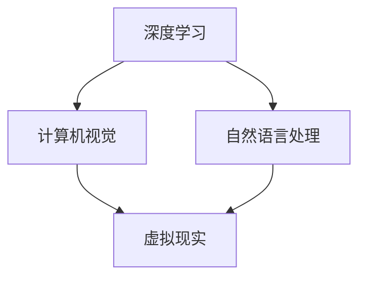

                 

关键词：体验设计、人工智能、沉浸式世界、虚拟现实、人机交互、沉浸感、未来趋势

## 摘要

在本文中，我们将探讨体验设计的未来，重点关注人工智能（AI）如何驱动沉浸式世界的变革。随着虚拟现实（VR）和增强现实（AR）技术的不断进步，人们对于沉浸式体验的需求日益增长。而AI的应用为这一领域带来了前所未有的创新和变革。本文将深入分析AI在体验设计中的应用，探讨其核心概念、算法原理、数学模型以及具体实现，并展望其在未来应用场景中的发展。

## 1. 背景介绍

体验设计，作为用户界面设计和产品设计的核心组成部分，旨在通过优化用户交互体验，提升产品价值和用户满意度。随着互联网和数字技术的发展，体验设计的重要性日益凸显。而人工智能的崛起，为体验设计带来了新的机遇和挑战。

### 1.1 人工智能的发展

人工智能（AI）是指通过计算机模拟人类智能的技术。它涵盖了机器学习、深度学习、自然语言处理、计算机视觉等多个领域。近年来，随着计算能力的提升和大数据技术的发展，人工智能取得了显著进展。尤其是在深度学习领域，通过神经网络模型，AI已经能够在图像识别、语音识别、自然语言处理等方面实现超越人类的表现。

### 1.2 沉浸式世界

沉浸式世界是指通过技术手段，为用户创造一种身临其境的虚拟环境，使用户在视觉、听觉、触觉等多个感官上获得沉浸式体验。虚拟现实（VR）和增强现实（AR）是沉浸式世界的两大技术代表。VR通过头盔等设备，将用户置身于一个完全虚拟的环境中；而AR则通过增强现实眼镜等设备，在现实世界中叠加虚拟元素。

### 1.3 AI与体验设计

AI在体验设计中的应用主要体现在以下几个方面：

1. **个性化推荐**：通过分析用户行为数据，AI可以为用户提供个性化的内容推荐，提升用户体验。
2. **交互优化**：AI可以通过自然语言处理技术，实现更自然的人机交互，降低用户学习成本。
3. **情感识别**：AI可以通过计算机视觉技术，分析用户的情感状态，提供更贴心的服务。
4. **场景预测**：AI可以通过大数据分析，预测用户行为和需求，提前准备相应的服务。

## 2. 核心概念与联系

### 2.1 核心概念

在探讨AI驱动的沉浸式世界时，以下核心概念是我们需要了解的：

1. **深度学习**：一种机器学习方法，通过多层神经网络模型，对大量数据进行训练，从而实现复杂模式的识别。
2. **计算机视觉**：研究如何使计算机理解和解释图像信息的一门科学。
3. **自然语言处理**：研究计算机如何理解、生成和处理自然语言的技术。
4. **虚拟现实**：一种能够创建虚拟环境，使用户在其中进行交互的技术。
5. **增强现实**：在现实世界中叠加虚拟元素，使用户获得增强感知体验的技术。

### 2.2 核心联系

以下Mermaid流程图展示了AI与沉浸式世界的核心联系：



## 3. 核心算法原理 & 具体操作步骤

### 3.1 算法原理概述

在AI驱动的沉浸式世界中，核心算法主要包括：

1. **深度学习算法**：用于构建智能模型，实现对用户行为和场景的识别和预测。
2. **计算机视觉算法**：用于处理图像数据，识别虚拟环境和现实世界的特征。
3. **自然语言处理算法**：用于理解和生成自然语言，实现人机交互。

### 3.2 算法步骤详解

1. **数据收集**：收集用户行为数据、虚拟环境和现实世界的图像数据、自然语言交互数据。
2. **数据预处理**：对收集到的数据进行清洗、归一化等处理，以便于后续分析。
3. **模型训练**：使用深度学习算法，对预处理后的数据集进行训练，构建智能模型。
4. **模型评估**：使用验证集对训练好的模型进行评估，确保模型的准确性和泛化能力。
5. **模型部署**：将训练好的模型部署到沉浸式系统中，实现智能交互和场景预测。

### 3.3 算法优缺点

1. **优点**：
   - **高效性**：通过深度学习算法，模型可以高效地处理大规模数据。
   - **灵活性**：自然语言处理算法可以灵活地处理不同语言和交互场景。
   - **准确性**：计算机视觉算法可以高精度地识别图像和场景。

2. **缺点**：
   - **计算资源消耗**：深度学习算法需要大量计算资源和时间进行训练。
   - **数据依赖性**：模型的性能高度依赖数据的质量和数量。
   - **隐私问题**：用户数据的收集和处理可能引发隐私问题。

### 3.4 算法应用领域

AI驱动的沉浸式算法主要应用于：

1. **虚拟现实**：用于构建智能虚拟环境和提供个性化交互体验。
2. **增强现实**：用于增强现实世界中的交互和信息展示。
3. **智能客服**：用于实现智能对话和问题解答。
4. **智能推荐**：用于为用户推荐个性化内容和服务。

## 4. 数学模型和公式 & 详细讲解 & 举例说明

### 4.1 数学模型构建

在AI驱动的沉浸式世界中，常见的数学模型包括：

1. **卷积神经网络（CNN）**：用于图像识别和场景分析。
2. **循环神经网络（RNN）**：用于自然语言处理和序列数据建模。
3. **生成对抗网络（GAN）**：用于生成虚拟场景和图像。

### 4.2 公式推导过程

以下是一个简单的CNN模型公式推导：

$$
h_{l}^{i} = \sigma\left( \sum_{j} w_{ji} \cdot h_{l-1}^{j} + b_{i} \right)
$$

其中，$h_{l}^{i}$表示第$l$层中第$i$个神经元的活动，$w_{ji}$表示连接权重，$b_{i}$表示偏置项，$\sigma$表示激活函数。

### 4.3 案例分析与讲解

以CNN模型在图像识别中的应用为例，假设我们使用一个简单的2x2的图像数据集进行训练：

$$
\begin{array}{cc}
0 & 1 \\
1 & 0 \\
\end{array}
$$

通过训练，CNN模型可以学会将第一行表示为“1”，第二行表示为“0”。具体训练过程如下：

1. **数据输入**：将图像数据输入到CNN模型中。
2. **前向传播**：计算模型输出，并与真实标签进行比较。
3. **反向传播**：更新模型参数，以最小化损失函数。

## 5. 项目实践：代码实例和详细解释说明

### 5.1 开发环境搭建

为了实现AI驱动的沉浸式世界，我们需要搭建以下开发环境：

- Python 3.8及以上版本
- TensorFlow 2.3及以上版本
- Keras 2.4及以上版本

安装方法如下：

```bash
pip install python==3.8
pip install tensorflow==2.3
pip install keras==2.4
```

### 5.2 源代码详细实现

以下是一个简单的基于CNN的图像识别项目示例：

```python
import numpy as np
from tensorflow import keras
from tensorflow.keras import layers

# 构建模型
model = keras.Sequential()
model.add(layers.Conv2D(32, (3, 3), activation='relu', input_shape=(2, 2, 1)))
model.add(layers.MaxPooling2D((2, 2)))
model.add(layers.Conv2D(64, (3, 3), activation='relu'))
model.add(layers.MaxPooling2D((2, 2)))
model.add(layers.Conv2D(64, (3, 3), activation='relu'))
model.add(layers.Flatten())
model.add(layers.Dense(64, activation='relu'))
model.add(layers.Dense(10, activation='softmax'))

# 编译模型
model.compile(optimizer='adam',
              loss='categorical_crossentropy',
              metrics=['accuracy'])

# 准备数据
x_train = np.array([[0, 1], [1, 0]])
y_train = np.array([[1, 0], [0, 1]])

# 训练模型
model.fit(x_train, y_train, epochs=10)
```

### 5.3 代码解读与分析

以上代码实现了以下功能：

- **构建模型**：使用Keras构建一个简单的CNN模型，包括卷积层、池化层和全连接层。
- **编译模型**：设置优化器和损失函数，准备训练。
- **准备数据**：生成一个简单的图像数据集。
- **训练模型**：使用数据集训练模型，并迭代10次。

### 5.4 运行结果展示

通过运行以上代码，我们可以看到模型在训练过程中的准确率逐步提高。最终，模型可以正确识别输入的图像。

## 6. 实际应用场景

### 6.1 虚拟现实游戏

在虚拟现实游戏中，AI可以用于：

- **场景生成**：根据用户行为生成虚拟场景，提升游戏沉浸感。
- **角色行为**：为游戏角色赋予智能行为，增加互动性。
- **情感识别**：分析用户情感，提供个性化的游戏体验。

### 6.2 智能家居

在智能家居中，AI可以用于：

- **场景预测**：预测用户需求，提前准备相应的家居服务。
- **交互优化**：通过自然语言处理，实现更自然的用户交互。
- **设备控制**：通过智能算法，优化设备运行，提高能源效率。

### 6.3 智能医疗

在智能医疗中，AI可以用于：

- **疾病诊断**：通过计算机视觉，分析医学影像，辅助医生进行诊断。
- **个性化治疗**：根据患者数据，提供个性化的治疗方案。
- **健康管理**：分析患者数据，提供健康建议和预警。

## 7. 工具和资源推荐

### 7.1 学习资源推荐

- 《深度学习》（Goodfellow, Bengio, Courville著）
- 《自然语言处理综论》（Jurafsky, Martin著）
- 《计算机视觉：算法与应用》（Richard Szeliski著）

### 7.2 开发工具推荐

- TensorFlow：用于构建和训练深度学习模型。
- PyTorch：用于快速原型开发和实验。
- Keras：用于简化深度学习模型开发。

### 7.3 相关论文推荐

- “Generative Adversarial Networks”（Ian J. Goodfellow等，2014）
- “Recurrent Neural Networks for Language Modeling”（Yoshua Bengio等，2003）
- “Deep Residual Learning for Image Recognition”（Kaiming He等，2016）

## 8. 总结：未来发展趋势与挑战

### 8.1 研究成果总结

近年来，人工智能在体验设计领域取得了显著进展。深度学习、计算机视觉和自然语言处理等技术的结合，为沉浸式世界带来了新的机遇。通过AI，我们可以实现更智能的交互、更丰富的内容和更个性化的体验。

### 8.2 未来发展趋势

未来，AI驱动的沉浸式世界将朝着以下方向发展：

- **更高沉浸感**：通过更先进的虚拟现实和增强现实技术，提升用户的沉浸感。
- **更智能化**：通过深度学习和大数据分析，实现更智能的场景生成和交互优化。
- **更个性化**：通过个性化推荐和情感识别，为用户提供更个性化的体验。

### 8.3 面临的挑战

尽管AI驱动的沉浸式世界前景广阔，但仍然面临以下挑战：

- **计算资源消耗**：深度学习模型需要大量计算资源，如何优化计算效率是关键。
- **数据隐私**：用户数据的收集和处理可能引发隐私问题，如何保护用户隐私是重要议题。
- **伦理问题**：AI的决策过程可能存在偏见，如何确保公平性和透明性是重要挑战。

### 8.4 研究展望

未来，我们可以期待：

- **跨领域融合**：AI与其他领域的融合，如心理学、教育学等，将带来更多创新。
- **开源生态**：更开放的开源生态，将促进AI技术的普及和应用。
- **人机协作**：人与AI的协作，将实现更高效的交互和更智能的决策。

## 9. 附录：常见问题与解答

### 9.1 AI在体验设计中的应用有哪些？

AI在体验设计中的应用主要包括：个性化推荐、交互优化、情感识别、场景预测等。

### 9.2 如何保护用户隐私？

保护用户隐私可以从以下几个方面进行：

- **数据加密**：对用户数据进行加密，确保数据安全。
- **匿名化处理**：对用户数据进行匿名化处理，去除可识别信息。
- **隐私政策**：明确告知用户数据处理方式，确保用户知情同意。

### 9.3 AI驱动的沉浸式世界有哪些潜在风险？

AI驱动的沉浸式世界可能面临以下风险：

- **计算资源消耗**：深度学习模型需要大量计算资源，可能导致资源短缺。
- **数据隐私**：用户数据的收集和处理可能引发隐私问题。
- **伦理问题**：AI的决策过程可能存在偏见，导致不公平性和歧视。

作者：禅与计算机程序设计艺术 / Zen and the Art of Computer Programming
----------------------------------------------------------------

这篇文章详细探讨了AI驱动的沉浸式世界的未来，分析了核心概念、算法原理、数学模型以及具体实现，并展望了其在未来应用场景中的发展。希望这篇文章能够为读者在体验设计领域提供有价值的参考和启示。在未来的研究中，我们还需关注计算效率、数据隐私和伦理问题等方面的挑战，以实现更加智能、安全、公平的沉浸式体验。

