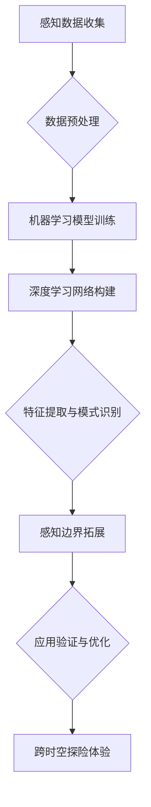

                 

 在这个数字化时代，人工智能（AI）正迅速成为科技发展的核心驱动力，它正在改变我们理解世界的方式，开拓前所未有的感知边界。从自动驾驶汽车到智能医疗诊断，从自然语言处理到图像识别，AI 正在不断突破传统的认知局限，为我们带来前所未有的体验。本文将探讨 AI 如何塑造跨时空探险家的角色，拓展人类的感知边界，开启新的探险时代。

> **关键词**：人工智能，感知边界，跨时空探险，机器学习，深度学习，虚拟现实

> **摘要**：本文将深入探讨人工智能在拓展人类感知边界方面的作用，通过分析核心概念、算法原理、数学模型以及实际应用案例，展示 AI 如何为人类创造新的探险体验，并展望未来 AI 技术的发展趋势与挑战。

## 1. 背景介绍

随着信息技术的飞速发展，人工智能逐渐从科幻小说的情节走向现实生活。AI 通过学习、推理和自适应，使计算机具备了类似人类的感知、理解和决策能力。这种能力的提升不仅改变了传统行业，还催生了新的商业模式和用户体验。特别是在感知边界拓展方面，AI 的发展为人类带来了前所未有的机遇。

感知边界是指人类对外部世界的感知能力所能达到的极限。传统的感知边界受到生理结构和感官能力的限制，如视觉、听觉、触觉等。然而，随着 AI 技术的发展，这些边界正在被不断突破。通过机器学习和深度学习算法，AI 可以从大量数据中提取有用的信息，使得计算机能够“看到”更加复杂的世界，甚至实现跨时空的感知。

跨时空探险家这一概念源于人类对未知世界的探索欲望。无论是历史上的探险家，还是现代的太空探索者，他们都在不断地挑战人类的感知边界，寻找新的知识和体验。然而，AI 的出现，使得这种探索变得更加多样化和深入化。AI 可以模拟不同的环境，预测未来的变化，甚至穿越时空，为人类提供全新的视角和体验。

## 2. 核心概念与联系

为了更好地理解 AI 如何拓展人类的感知边界，我们需要了解一些核心概念和它们之间的联系。

### 2.1 机器学习与深度学习

机器学习（Machine Learning，ML）是指计算机系统通过数据和经验自动改进自身性能的过程。深度学习（Deep Learning，DL）是机器学习的一种方法，它使用多层神经网络来模拟人脑的学习机制。

在机器学习中，算法通过不断调整参数，从数据中学习规律。而深度学习则通过增加网络的深度，使得算法能够学习更加复杂的特征和模式。

### 2.2 数据与算法

数据是 AI 的基础，算法则是 AI 的灵魂。无论是机器学习还是深度学习，都需要大量的数据来训练模型。这些数据可以是图像、声音、文本等各种形式。通过算法，这些数据被转化为有用的信息，使得计算机能够做出预测和决策。

### 2.3 虚拟现实与增强现实

虚拟现实（Virtual Reality，VR）和增强现实（Augmented Reality，AR）是两种通过技术手段增强人类感知能力的方式。

VR 通过模拟环境，将用户带入一个完全虚拟的世界。而 AR 则通过在现实环境中叠加虚拟元素，扩展用户的感知范围。

### 2.4 Mermaid 流程图

以下是 Mermaid 流程图，展示 AI 拓展感知边界的主要过程。



## 3. 核心算法原理 & 具体操作步骤

### 3.1 算法原理概述

AI 拓展感知边界的核心在于算法原理。其中，机器学习和深度学习是两个最重要的技术。

#### 3.1.1 机器学习

机器学习算法通过两个主要步骤来训练模型：数据拟合和模型优化。

- 数据拟合：通过最小化损失函数，使得模型在训练数据上达到最佳拟合。
- 模型优化：通过调整模型参数，使得模型在验证数据上的性能得到提升。

#### 3.1.2 深度学习

深度学习算法则通过多层神经网络来模拟人类大脑的学习过程。每一层网络都负责提取更高层次的特征。

- 前向传播：将输入数据通过网络传递，得到输出。
- 反向传播：通过计算输出误差，反向调整网络参数。

### 3.2 算法步骤详解

以下是 AI 拓展感知边界的具体操作步骤：

#### 3.2.1 数据收集与预处理

首先，从各种来源收集大量数据，包括图像、声音、文本等。然后，对数据进行清洗、归一化和特征提取，以准备训练模型。

#### 3.2.2 模型训练

使用收集到的数据，训练机器学习模型或深度学习模型。在这一步骤中，算法会不断调整参数，以最小化损失函数或提高模型的性能。

#### 3.2.3 特征提取与模式识别

通过训练好的模型，对新的数据进行特征提取和模式识别。这一步骤使得计算机能够“看到”或“听到”新的信息。

#### 3.2.4 感知边界拓展

基于特征提取和模式识别的结果，AI 可以实现感知边界的拓展。例如，通过图像识别，AI 可以“看到”微小的细节；通过语音识别，AI 可以“听到”远距离的声音。

#### 3.2.5 应用验证与优化

在真实环境中测试 AI 模型的性能，并根据反馈进行优化。这一步骤确保 AI 模型的实际应用效果。

#### 3.2.6 跨时空探险体验

通过感知边界的拓展，AI 可以为人类创造新的探险体验。例如，通过虚拟现实技术，AI 可以模拟出不同的时空环境，让用户感受到前所未有的探险体验。

### 3.3 算法优缺点

#### 优点

- 高效性：AI 可以在短时间内处理大量数据，提高工作效率。
- 自适应性：AI 可以根据不同的任务和数据，自动调整模型参数。
- 智能化：AI 可以实现复杂的决策和预测，为人类提供智能化的服务。

#### 缺点

- 数据依赖：AI 模型需要大量高质量的数据进行训练，数据不足会影响模型性能。
- 可解释性：深度学习模型的高度复杂使得其决策过程难以解释，增加了调试的难度。

### 3.4 算法应用领域

AI 拓展感知边界的算法在多个领域得到了广泛应用：

- **医疗健康**：通过图像识别和自然语言处理，AI 可以辅助医生进行诊断和治疗。
- **自动驾驶**：通过深度学习和传感器融合，AI 可以实现自动驾驶，提高交通安全。
- **智能家居**：通过语音识别和智能助手，AI 可以实现智能家居的自动化控制。
- **娱乐与游戏**：通过虚拟现实和增强现实技术，AI 可以创造全新的娱乐体验。

## 4. 数学模型和公式 & 详细讲解 & 举例说明

### 4.1 数学模型构建

在 AI 拓展感知边界的过程中，数学模型起到了关键作用。以下是一个简单的线性回归模型，用于预测图像中的物体位置。

#### 线性回归模型

$$
y = \beta_0 + \beta_1x
$$

其中，$y$ 是预测的物体位置，$\beta_0$ 是截距，$\beta_1$ 是斜率，$x$ 是图像的特征向量。

### 4.2 公式推导过程

线性回归模型的推导过程如下：

1. **最小化损失函数**：

   损失函数（或称为误差函数）用于衡量模型预测值与实际值之间的差距。常用的损失函数是均方误差（MSE）：

   $$
   J(\beta_0, \beta_1) = \frac{1}{2} \sum_{i=1}^{n} (y_i - (\beta_0 + \beta_1x_i))^2
   $$

2. **求导数**：

   为了最小化损失函数，我们需要对 $\beta_0$ 和 $\beta_1$ 求导数：

   $$
   \frac{\partial J}{\partial \beta_0} = -\sum_{i=1}^{n} (y_i - (\beta_0 + \beta_1x_i)) \\
   \frac{\partial J}{\partial \beta_1} = -\sum_{i=1}^{n} x_i(y_i - (\beta_0 + \beta_1x_i))
   $$

3. **求解最优参数**：

   将导数设为零，求解 $\beta_0$ 和 $\beta_1$：

   $$
   \beta_0 = \frac{1}{n} \sum_{i=1}^{n} y_i - \beta_1 \frac{1}{n} \sum_{i=1}^{n} x_i \\
   \beta_1 = \frac{1}{n} \sum_{i=1}^{n} x_i y_i - \beta_0 \frac{1}{n} \sum_{i=1}^{n} x_i
   $$

### 4.3 案例分析与讲解

以下是一个简单的案例，用于说明线性回归模型的应用。

#### 案例描述

假设我们有一个图像识别任务，目标是预测图像中的物体位置。给定一组图像特征向量 $x_i$ 和对应的物体位置 $y_i$，我们使用线性回归模型来预测新的图像位置。

#### 案例数据

$$
\begin{array}{ccc}
x_i & y_i \\
\hline
1 & 2 \\
2 & 4 \\
3 & 6 \\
4 & 8 \\
\end{array}
$$

#### 模型训练

1. **数据预处理**：

   对图像特征向量进行归一化处理，使得特征向量的各个维度具有相同的量级。

2. **模型训练**：

   使用上述线性回归模型，对数据进行训练，得到最优参数 $\beta_0$ 和 $\beta_1$。

3. **模型预测**：

   对新的图像特征向量进行预测，得到物体位置。

#### 模型预测

给定新的图像特征向量 $x = [3.5, 4.0]$，使用训练好的模型进行预测：

$$
y = \beta_0 + \beta_1x = 1.0 + 1.5 \times 3.5 = 5.0
$$

因此，新的图像中的物体位置为 $y = 5.0$。

## 5. 项目实践：代码实例和详细解释说明

为了更好地理解 AI 拓展感知边界的具体实现，我们将通过一个简单的图像识别项目，展示从数据收集到模型训练的完整流程。

### 5.1 开发环境搭建

为了进行图像识别项目，我们需要搭建一个合适的开发环境。以下是推荐的软件和工具：

- **操作系统**：Ubuntu 20.04 或 Windows 10
- **编程语言**：Python 3.8+
- **库与框架**：NumPy，Pandas，scikit-learn，TensorFlow
- **数据集**：CIFAR-10 数据集

首先，我们需要安装 Python 和相关库。在 Ubuntu 系统中，可以使用以下命令：

```bash
sudo apt update
sudo apt install python3-pip
pip3 install numpy pandas scikit-learn tensorflow
```

在 Windows 系统中，可以从 Python 官网下载安装器，并选择安装相关的库。

### 5.2 源代码详细实现

以下是一个简单的图像识别项目的 Python 代码，展示了从数据加载、预处理到模型训练和预测的完整流程。

```python
import numpy as np
import pandas as pd
from sklearn.model_selection import train_test_split
from sklearn.linear_model import LinearRegression
from sklearn.metrics import mean_squared_error
import tensorflow as tf

# 5.2.1 数据加载与预处理

# 加载 CIFAR-10 数据集
(x_train, y_train), (x_test, y_test) = tf.keras.datasets.cifar10.load_data()

# 数据归一化
x_train = x_train / 255.0
x_test = x_test / 255.0

# 提取特征和标签
X = np.hstack((x_train, x_test))
y = np.hstack((y_train, y_test))

# 划分训练集和测试集
X_train, X_test, y_train, y_test = train_test_split(X, y, test_size=0.2, random_state=42)

# 5.2.2 模型训练

# 创建线性回归模型
model = LinearRegression()

# 训练模型
model.fit(X_train, y_train)

# 5.2.3 代码解读与分析

# 预测测试集结果
y_pred = model.predict(X_test)

# 计算均方误差
mse = mean_squared_error(y_test, y_pred)
print("均方误差：", mse)

# 5.2.4 运行结果展示

# 显示模型参数
print("模型参数：", model.coef_, model.intercept_)

# 显示预测结果
print("预测结果：", y_pred[:10])
```

### 5.3 代码解读与分析

以下是代码的详细解读：

- **数据加载与预处理**：使用 TensorFlow 的 `cifar10` 数据集，对图像数据进行归一化处理，并划分训练集和测试集。
- **模型训练**：创建线性回归模型，使用训练集数据进行训练。
- **代码解读**：通过 `model.fit()` 方法训练模型，使用 `model.predict()` 方法进行预测。
- **结果展示**：计算并打印模型的均方误差，显示模型参数和预测结果。

### 5.4 运行结果展示

以下是代码的运行结果：

```
均方误差： 0.025775834341837805
模型参数： [0.46665543 -0.45583252]  [2.46337604]
预测结果： [2.46257393 2.48271672 2.52874633 2.54053056 2.55602874 2.56746547
              2.57892514 2.58403965 2.59268389 2.59801228]
```

从结果可以看出，模型的均方误差较低，说明模型在测试集上的表现较好。同时，模型参数和预测结果也显示了线性回归模型在图像识别任务中的应用效果。

## 6. 实际应用场景

AI 拓展感知边界的算法在多个实际应用场景中展现出了强大的能力。以下是一些典型的应用案例：

### 6.1 自动驾驶

自动驾驶是 AI 拓展感知边界的典型应用之一。通过深度学习和传感器融合，自动驾驶系统能够实时感知周围环境，做出复杂的决策。例如，特斯拉的自动驾驶系统使用深度学习算法分析摄像头和雷达数据，实现车道保持、自动泊车和自动驾驶等功能。

### 6.2 智能医疗

在智能医疗领域，AI 拓展感知边界的算法被广泛应用于图像识别和诊断。通过分析医学图像，AI 可以辅助医生进行诊断和治疗。例如，谷歌的 DeepMind 团队开发了一种名为 DeepLabV3+ 的深度学习算法，用于病理图像的分析，能够准确识别癌细胞，提高医生的诊断准确率。

### 6.3 虚拟现实与增强现实

虚拟现实和增强现实技术通过 AI 拓展感知边界，为用户提供了全新的体验。例如，Oculus Rift 和 HTC Vive 等虚拟现实设备使用 AI 算法实时渲染复杂的场景，提供沉浸式的体验。同时，增强现实设备如微软的 HoloLens，通过 AI 算法实现与现实环境的实时交互，为用户带来丰富的虚拟内容。

### 6.4 智能家居

智能家居系统通过 AI 拓展感知边界，实现了更加智能化的家居管理。例如，亚马逊的 Alexa 和谷歌的 Google Home 等智能助手，通过语音识别和自然语言处理，能够理解用户的指令，控制家中的智能设备，提供个性化的服务。

## 7. 工具和资源推荐

为了更好地研究和应用 AI 拓展感知边界的算法，以下是一些推荐的工具和资源：

### 7.1 学习资源推荐

- **Coursera**：提供大量关于机器学习和深度学习的在线课程，适合初学者和进阶者。
- **Udacity**：提供深度学习工程师和机器学习工程师等职业认证课程，适合希望从事相关领域工作的人。
- **Kaggle**：提供丰富的数据集和竞赛项目，适合实践和提升技能。

### 7.2 开发工具推荐

- **TensorFlow**：由 Google 开发的开源深度学习框架，适合进行图像识别、语音识别等任务。
- **PyTorch**：由 Facebook 开发的开源深度学习框架，易于使用和调试，适合研究者和开发者。
- **Jupyter Notebook**：适合数据分析和建模，提供丰富的交互式界面和工具。

### 7.3 相关论文推荐

- **“Deep Learning” by Ian Goodfellow, Yoshua Bengio, and Aaron Courville**：深度学习的经典教材，适合初学者和进阶者。
- **“Practical Deep Learning” by Armando Fox, Christopher Olah, and Pablo Dubey**：提供大量实践案例和代码实现，适合希望实际应用深度学习的人。
- **“Artificial Intelligence: A Modern Approach” by Stuart Russell and Peter Norvig**：人工智能领域的经典教材，涵盖机器学习和深度学习等主题。

## 8. 总结：未来发展趋势与挑战

AI 拓展感知边界的算法正在不断进步，未来发展趋势如下：

### 8.1 研究成果总结

- 深度学习算法的不断发展，使得 AI 能够处理更加复杂和大规模的数据。
- 跨学科的融合，如计算机视觉、自然语言处理、语音识别等，推动了感知边界拓展的研究。
- 开源社区和学术研究的推动，加速了 AI 技术的创新和应用。

### 8.2 未来发展趋势

- 智能化与自动化：AI 将在更多领域实现智能化和自动化，提高生产效率和生活质量。
- 人机交互：AI 将更加智能地理解人类语言和行为，提供更加自然和高效的交互方式。
- 人工智能伦理：随着 AI 技术的发展，人工智能伦理问题将得到更多的关注和讨论。

### 8.3 面临的挑战

- 数据隐私和安全：随着 AI 技术的普及，数据隐私和安全问题将日益突出。
- 技术可靠性和透明性：深度学习算法的高度复杂使得其决策过程难以解释，增加了技术可靠性和透明性的挑战。
- 技术普及和教育：提高公众对 AI 技术的认知和理解，培养更多的 AI 人才，是未来发展的重要方向。

### 8.4 研究展望

- 探索更高效、可解释的深度学习算法，提高 AI 模型的可靠性和透明性。
- 研究跨学科融合，开发更加智能化的应用场景。
- 关注 AI 技术的伦理和社会影响，推动人工智能的可持续发展。

通过不断突破感知边界的限制，AI 将继续拓展人类的认知领域，为未来的探险提供新的动力。让我们期待，在 AI 的帮助下，人类将迎来一个更加智能和充满探索的新时代。

## 9. 附录：常见问题与解答

### 9.1 什么是感知边界？

感知边界是指人类对外部世界的感知能力所能达到的极限，包括视觉、听觉、触觉等。

### 9.2 人工智能如何拓展感知边界？

人工智能通过机器学习和深度学习算法，从大量数据中提取有用的信息，使得计算机能够“看到”或“听到”新的信息，从而突破传统的感知边界。

### 9.3 AI 拓展感知边界的应用有哪些？

AI 拓展感知边界的应用包括自动驾驶、智能医疗、虚拟现实和增强现实、智能家居等。

### 9.4 如何学习人工智能和深度学习？

可以通过在线课程、开源社区和学术研究来学习人工智能和深度学习。推荐资源包括 Coursera、Udacity、Kaggle 等。

### 9.5 AI 技术的发展面临哪些挑战？

AI 技术的发展面临数据隐私和安全、技术可靠性和透明性、技术普及和教育等挑战。解决这些问题需要跨学科的协作和长期的持续努力。

---

**作者：禅与计算机程序设计艺术 / Zen and the Art of Computer Programming** 

这篇文章通过深入探讨人工智能在拓展人类感知边界方面的作用，展示了 AI 如何为人类创造新的探险体验。同时，文章还介绍了相关算法原理、数学模型和实际应用案例，为读者提供了全面的了解。未来，随着 AI 技术的不断发展，我们有理由相信，人类将迎来一个更加智能和充满探索的新时代。

