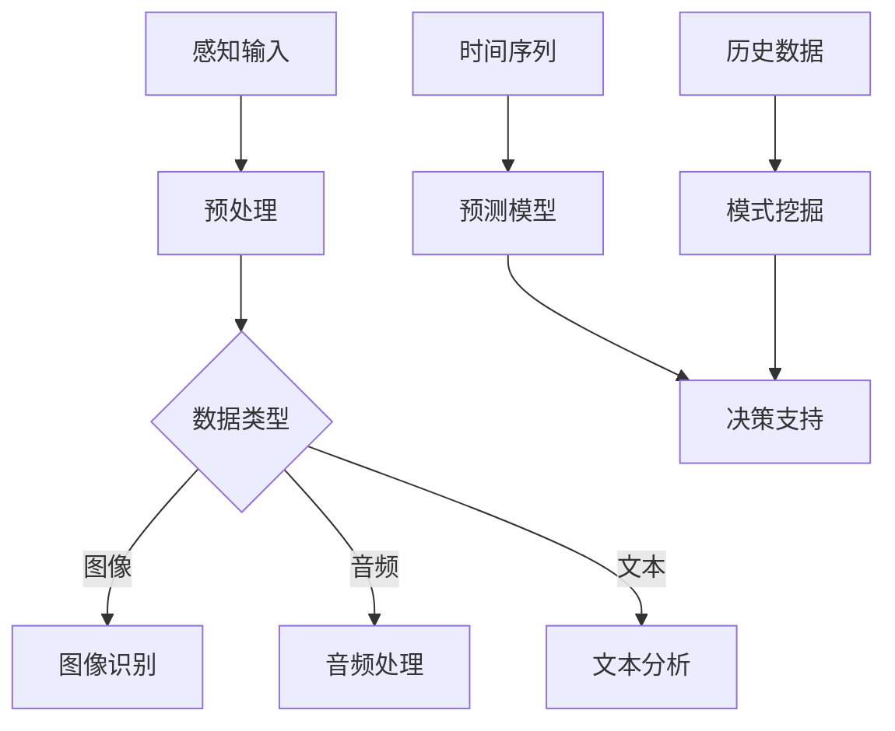

                 

 关键词：人工智能，感知拓展，AI技术，跨时空，算法，数学模型，项目实践，应用场景，未来展望

> 摘要：本文将探讨人工智能技术在感知边界拓展方面的最新进展，通过深入分析核心概念、算法原理、数学模型以及实际应用，揭示AI在跨时空探索中的潜力。本文旨在为读者提供一次深度体验，让他们感受到AI技术如何改变我们对现实世界的认知，开拓新的视野。

## 1. 背景介绍

随着人工智能技术的飞速发展，计算机的感知能力得到了极大的提升。传统的计算机系统依赖于固定的算法和数据集进行信息处理，而现代人工智能系统则能够通过自主学习、数据挖掘和模式识别等技术，不断拓展其感知边界。这种能力的提升不仅为各行各业带来了创新和变革，还激发了我们对未知世界的无限探索欲望。

感知边界拓展的重要性在于，它使得计算机能够超越物理世界的限制，实现跨时空的数据处理和分析。例如，通过机器学习算法，计算机可以处理过去和未来的数据，从而实现时间序列预测和决策支持。同时，感知边界拓展还使得计算机能够处理来自不同感官的信息，如视觉、听觉、触觉等，实现多模态感知。

本文将围绕以下几个方面展开讨论：首先，介绍感知边界拓展的核心概念和技术；然后，详细分析其中的核心算法原理和数学模型；接着，通过实际项目案例进行实践讲解；最后，探讨感知边界拓展在现实世界中的应用场景和未来发展趋势。

## 2. 核心概念与联系

### 2.1 人工智能感知边界

人工智能感知边界指的是计算机系统在感知和处理信息时所达到的范围和深度。传统计算机系统的感知边界相对狭窄，主要依赖于预先设定好的算法和数据集。而现代人工智能系统则通过不断学习和优化算法，拓展其感知边界，使其能够处理更加复杂和多样化的信息。

感知边界的拓展主要依赖于以下几个技术方向：

1. **深度学习**：通过多层神经网络，实现对复杂数据的自动特征提取和模式识别。
2. **强化学习**：通过与环境交互，不断优化策略，提高系统的自主决策能力。
3. **迁移学习**：通过在不同任务间共享知识，提升系统的泛化能力。
4. **多模态感知**：通过整合不同类型的信息，实现更高层次的理解和决策。

### 2.2 跨时空感知

跨时空感知是人工智能感知边界拓展的一个重要方面。它涉及到对过去、现在和未来数据的处理和分析，使得计算机能够超越时间限制，实现跨时间序列的预测和决策。

跨时空感知的核心技术包括：

1. **时间序列分析**：通过对时间序列数据的分析，提取出时间规律和趋势，进行预测和决策。
2. **因果推断**：通过分析因果关系，实现对未来的预测和干预。
3. **历史数据挖掘**：通过对历史数据的挖掘，发现潜在的模式和规律，为当前和未来的决策提供支持。

### 2.3 Mermaid 流程图

为了更好地理解感知边界拓展和跨时空感知的技术原理，我们使用Mermaid流程图来展示其核心架构和流程。



在上面的流程图中，A表示感知输入，可以是图像、音频或文本等不同类型的数据。经过预处理后，根据数据类型进行相应的处理，如图像识别、音频处理和文本分析。同时，时间序列数据通过预测模型进行预测和决策支持，历史数据通过模式挖掘发现潜在规律，为当前和未来的决策提供支持。

## 3. 核心算法原理 & 具体操作步骤

### 3.1 算法原理概述

在感知边界拓展和跨时空感知中，核心算法主要包括深度学习、强化学习、迁移学习和时间序列分析等。以下将分别介绍这些算法的基本原理。

#### 3.1.1 深度学习

深度学习是一种基于多层神经网络的学习方法，通过逐层提取数据的特征，实现对复杂数据的自动特征提取和模式识别。深度学习的核心组成部分包括：

1. **神经网络**：一种由多个神经元组成的计算模型，通过激活函数和权重参数实现数据的非线性变换。
2. **反向传播**：一种基于梯度下降的优化方法，用于调整网络的权重参数，以降低预测误差。
3. **激活函数**：用于引入非线性特性，提高模型的拟合能力。

#### 3.1.2 强化学习

强化学习是一种基于奖励机制的学习方法，通过与环境交互，不断优化策略，提高系统的自主决策能力。强化学习的关键组成部分包括：

1. **策略**：指导系统行为的方法，通常由一系列动作和动作值函数表示。
2. **价值函数**：用于评估系统在未来采取特定动作的预期回报。
3. **奖励机制**：用于激励系统学习和优化策略。

#### 3.1.3 迁移学习

迁移学习是一种通过在不同任务间共享知识，提升系统泛化能力的学习方法。其核心思想是将在一个任务上学到的知识应用于其他相关任务。迁移学习的关键组成部分包括：

1. **源任务**：用于训练模型的任务，通常具有较高的性能和丰富的数据。
2. **目标任务**：用于应用模型的任务，通常具有较少的数据或不同的任务需求。
3. **知识共享**：通过在源任务和目标任务之间共享特征提取器或模型结构，提升目标任务的性能。

#### 3.1.4 时间序列分析

时间序列分析是一种用于处理和分析时间序列数据的方法，通过提取时间规律和趋势，实现对未来的预测和决策。时间序列分析的关键组成部分包括：

1. **时间序列模型**：用于建模时间序列数据，提取时间规律和趋势，如ARIMA模型、LSTM模型等。
2. **特征提取**：通过对时间序列数据进行特征提取，如趋势、周期性、季节性等。
3. **预测模型**：通过时间序列模型进行预测，实现对未来的趋势和变化进行预测。

### 3.2 算法步骤详解

以下分别介绍深度学习、强化学习、迁移学习和时间序列分析的具体操作步骤。

#### 3.2.1 深度学习

1. **数据预处理**：对输入数据进行清洗、归一化等预处理操作，以便于模型的训练和优化。
2. **构建神经网络**：根据任务需求，设计并构建多层神经网络，包括输入层、隐藏层和输出层。
3. **训练神经网络**：通过反向传播算法，调整网络的权重参数，优化模型性能。
4. **评估模型性能**：通过验证集或测试集，评估模型的预测性能，如准确率、召回率等。

#### 3.2.2 强化学习

1. **定义策略**：根据任务需求，定义系统的策略，包括动作空间和动作值函数。
2. **初始化价值函数**：根据策略，初始化系统的价值函数，用于评估不同动作的预期回报。
3. **与环境交互**：通过模拟或实际环境，与系统进行交互，获取奖励和状态反馈。
4. **更新策略和价值函数**：根据奖励和状态反馈，更新系统的策略和价值函数，优化系统行为。

#### 3.2.3 迁移学习

1. **选择源任务**：根据目标任务的需求，选择具有较高性能和丰富数据的源任务。
2. **训练特征提取器**：在源任务上训练特征提取器，将输入数据转化为特征向量。
3. **迁移特征提取器**：将训练好的特征提取器应用于目标任务，提升目标任务的性能。
4. **训练目标任务模型**：在目标任务上训练模型，结合迁移的特征提取器，优化模型性能。

#### 3.2.4 时间序列分析

1. **数据预处理**：对时间序列数据进行清洗、缺失值填充等预处理操作，保证数据质量。
2. **选择时间序列模型**：根据时间序列数据的特性，选择合适的时间序列模型，如ARIMA、LSTM等。
3. **训练时间序列模型**：在训练集上训练时间序列模型，提取时间规律和趋势。
4. **特征提取**：对时间序列数据进行特征提取，如趋势、周期性、季节性等。
5. **预测未来趋势**：利用训练好的时间序列模型，对未来的趋势和变化进行预测。

### 3.3 算法优缺点

每种算法都有其独特的优点和局限性，以下分别介绍深度学习、强化学习、迁移学习和时间序列分析的主要优缺点。

#### 3.3.1 深度学习

**优点**：

1. **强大的特征提取能力**：通过多层神经网络，能够自动提取复杂数据的特征。
2. **非线性拟合能力**：通过激活函数和多层网络结构，实现非线性变换，提高拟合能力。
3. **自动调整参数**：通过反向传播算法，自动调整网络权重参数，优化模型性能。

**缺点**：

1. **计算成本高**：深度学习需要大量的计算资源和时间进行模型训练和优化。
2. **数据依赖性大**：深度学习对训练数据的质量和数量有较高要求，数据不足或质量较差时，模型性能会受到影响。

#### 3.3.2 强化学习

**优点**：

1. **自适应性强**：通过与环境交互，系统能够不断调整策略，适应复杂变化的环境。
2. **自主决策能力**：系统可以根据当前状态和奖励，自主决策，无需预设固定规则。
3. **适用范围广**：强化学习适用于各种复杂环境，如游戏、自动驾驶、机器人等。

**缺点**：

1. **训练时间长**：强化学习需要大量时间与环境进行交互，进行策略优化。
2. **奖励设计困难**：在多步决策问题中，奖励设计的合理性和有效性直接影响训练效果。

#### 3.3.3 迁移学习

**优点**：

1. **提升性能**：通过迁移知识，目标任务的性能能够得到显著提升。
2. **减少数据需求**：通过利用源任务的丰富数据，目标任务对数据的需求减少，降低训练难度。
3. **提高泛化能力**：通过在不同任务间共享知识，系统具有更好的泛化能力。

**缺点**：

1. **源任务选择困难**：迁移学习对源任务的选择有较高要求，选择不当可能导致性能下降。
2. **模型复杂度高**：迁移学习需要训练两个模型（源任务模型和目标任务模型），模型复杂度增加。

#### 3.3.4 时间序列分析

**优点**：

1. **强大的预测能力**：通过时间序列模型，能够对未来的趋势和变化进行准确预测。
2. **适用范围广**：时间序列分析适用于各种时间序列数据，如股票价格、天气变化、交通流量等。
3. **易于实现**：时间序列分析的方法和工具较为成熟，易于实现和应用。

**缺点**：

1. **对数据质量要求高**：时间序列分析对数据质量有较高要求，数据中的异常值和噪声会影响预测效果。
2. **模型选择困难**：不同时间序列数据具有不同的特性，选择合适的模型较为困难。

### 3.4 算法应用领域

深度学习、强化学习、迁移学习和时间序列分析在感知边界拓展和跨时空感知中具有广泛的应用领域。

#### 3.4.1 深度学习

1. **计算机视觉**：通过深度学习，计算机可以实现对图像和视频的自动识别、分类、分割等操作。
2. **自然语言处理**：深度学习在语言模型、机器翻译、情感分析等方面取得了显著成果。
3. **语音识别**：通过深度学习，计算机可以实现高准确率的语音识别和语音合成。

#### 3.4.2 强化学习

1. **自动驾驶**：通过强化学习，自动驾驶系统可以自主决策，实现自动导航和安全驾驶。
2. **游戏**：强化学习在游戏中的表现非常出色，如《星际争霸》、《Dota 2》等。
3. **机器人控制**：通过强化学习，机器人可以自主完成复杂任务，如自主导航、抓取等。

#### 3.4.3 迁移学习

1. **医疗诊断**：通过迁移学习，利用在源任务上训练的模型，实现对目标任务的快速准确诊断。
2. **计算机视觉**：通过迁移学习，利用在图像分类任务上训练的模型，实现目标检测、人脸识别等任务。
3. **自然语言处理**：通过迁移学习，利用在源语言上训练的模型，实现对目标语言的翻译和文本生成。

#### 3.4.4 时间序列分析

1. **金融市场预测**：通过时间序列分析，预测股票价格、外汇汇率等金融市场的变化。
2. **天气预报**：通过时间序列分析，预测天气变化、气候变化等气象数据。
3. **交通流量预测**：通过时间序列分析，预测交通流量，优化交通管理和调度。

## 4. 数学模型和公式 & 详细讲解 & 举例说明

### 4.1 数学模型构建

在感知边界拓展和跨时空感知中，数学模型是核心组成部分。以下介绍几种常用的数学模型及其构建方法。

#### 4.1.1 深度学习模型

深度学习模型通常由多层神经网络构成，每一层都包含多个神经元。神经元的激活函数通常为sigmoid、ReLU或tanh等。以下为一个简单的深度学习模型示例：

```math
\begin{aligned}
    &Z_1 = X \odot W_1 + b_1, \\
    &A_1 = \sigma(Z_1), \\
    &Z_2 = A_1 \odot W_2 + b_2, \\
    &A_2 = \sigma(Z_2).
\end{aligned}
```

其中，$X$为输入数据，$W_1$和$W_2$为权重矩阵，$b_1$和$b_2$为偏置项，$\sigma$为激活函数（如sigmoid函数或ReLU函数），$\odot$表示矩阵乘法。

#### 4.1.2 强化学习模型

强化学习模型通常由策略和价值函数构成。策略用于指导系统行为，价值函数用于评估系统行为的好坏。以下为一个简单的强化学习模型示例：

```math
\begin{aligned}
    &\pi(a|s) = \frac{\exp(\theta_a^T s)}{\sum_b \exp(\theta_b^T s)}, \\
    &V(s) = \sum_a \pi(a|s) \cdot Q(s, a).
\end{aligned}
```

其中，$s$为状态，$a$为动作，$\pi(a|s)$为策略，$\theta_a$为策略参数，$V(s)$为价值函数，$Q(s, a)$为状态-动作价值函数。

#### 4.1.3 迁移学习模型

迁移学习模型通常由源任务模型和目标任务模型构成。源任务模型和目标任务模型通过共享部分参数或结构，实现知识共享。以下为一个简单的迁移学习模型示例：

```math
\begin{aligned}
    &\hat{y} = f(\hat{X}; \theta_{\text{source}} + \theta_{\text{target}}), \\
    &\text{Loss} = \frac{1}{n} \sum_{i=1}^n (\hat{y}_i - y_i)^2.
\end{aligned}
```

其中，$\hat{X}$为输入数据，$\hat{y}$为预测输出，$y$为真实输出，$f(\hat{X}; \theta)$为模型函数，$\theta_{\text{source}}$和$\theta_{\text{target}}$分别为源任务模型和目标任务模型的参数。

#### 4.1.4 时间序列分析模型

时间序列分析模型通常由ARIMA、LSTM等模型构成。以下为一个简单的LSTM模型示例：

```math
\begin{aligned}
    &h_t = \sigma(W_h h_{t-1} + W_x x_t + b_h), \\
    &i_t = \sigma(W_i h_{t-1} + W_x x_t + b_i), \\
    &f_t = \sigma(W_f h_{t-1} + W_x x_t + b_f), \\
    &o_t = \sigma(W_o h_{t-1} + W_x x_t + b_o), \\
    &c_t = f_t \odot c_{t-1} + i_t \odot \tanh(W_c h_{t-1} + b_c), \\
    &h_t = o_t \odot \tanh(c_t), \\
    &y_t = W_y h_t + b_y.
\end{aligned}
```

其中，$h_t$为隐藏状态，$i_t$、$f_t$、$o_t$分别为输入门、遗忘门、输出门，$c_t$为细胞状态，$x_t$为输入数据，$y_t$为预测输出，$W_h$、$W_x$、$W_c$、$W_y$分别为权重矩阵，$b_h$、$b_i$、$b_f$、$b_o$、$b_c$、$b_y$为偏置项，$\sigma$为sigmoid函数，$\odot$表示元素乘法。

### 4.2 公式推导过程

以下以LSTM模型为例，介绍其公式推导过程。

#### 4.2.1 隐藏状态更新

隐藏状态更新是LSTM模型的核心部分，用于在时间步$t$计算新的隐藏状态$h_t$。具体公式如下：

```math
h_t = \sigma(W_h h_{t-1} + W_x x_t + b_h)
```

其中，$W_h$、$W_x$和$b_h$分别为权重矩阵和偏置项，$\sigma$为sigmoid函数。

#### 4.2.2 输入门、遗忘门和输出门更新

输入门、遗忘门和输出门用于控制信息的流动和提取。具体公式如下：

```math
i_t = \sigma(W_i h_{t-1} + W_x x_t + b_i), \\
f_t = \sigma(W_f h_{t-1} + W_x x_t + b_f), \\
o_t = \sigma(W_o h_{t-1} + W_x x_t + b_o)
```

其中，$W_i$、$W_f$、$W_o$和$b_i$、$b_f$、$b_o$分别为权重矩阵和偏置项，$\sigma$为sigmoid函数。

#### 4.2.3 细胞状态更新

细胞状态更新用于控制信息的流动和存储。具体公式如下：

```math
c_t = f_t \odot c_{t-1} + i_t \odot \tanh(W_c h_{t-1} + b_c)
```

其中，$f_t$为遗忘门，$c_{t-1}$为上一时间步的细胞状态，$i_t$为输入门，$\tanh$为双曲正切函数，$W_c$和$b_c$分别为权重矩阵和偏置项。

#### 4.2.4 预测输出更新

预测输出更新用于在时间步$t$计算新的预测输出$y_t$。具体公式如下：

```math
y_t = W_y h_t + b_y
```

其中，$W_y$和$b_y$分别为权重矩阵和偏置项，$h_t$为当前时间步的隐藏状态。

### 4.3 案例分析与讲解

以下通过一个实际案例，介绍如何使用LSTM模型进行时间序列预测。

#### 4.3.1 案例背景

假设我们有一个股票价格时间序列，包含过去一年的每日收盘价。现在，我们希望通过LSTM模型预测未来五天的股票价格。

#### 4.3.2 数据预处理

1. **数据清洗**：去除缺失值和异常值，确保数据质量。
2. **数据归一化**：将数据归一化到0-1范围内，便于模型训练。
3. **构建训练集和测试集**：将数据划分为训练集和测试集，用于模型训练和评估。

#### 4.3.3 模型训练

1. **构建LSTM模型**：使用Python的TensorFlow库，构建一个LSTM模型，包括输入层、隐藏层和输出层。
2. **训练模型**：使用训练集数据，训练LSTM模型，优化模型参数。
3. **评估模型**：使用测试集数据，评估模型性能，如均方误差（MSE）等。

#### 4.3.4 模型预测

1. **输入数据准备**：将未来五天的股票价格作为输入数据，输入到训练好的LSTM模型中。
2. **预测输出**：模型输出未来五天的股票价格预测结果。
3. **结果分析**：对比预测结果和实际数据，分析模型预测的准确性。

通过以上案例，我们可以看到LSTM模型在时间序列预测中的应用。在实际应用中，我们可以根据具体需求，调整模型结构和参数，提高预测准确性。

## 5. 项目实践：代码实例和详细解释说明

### 5.1 开发环境搭建

为了实现感知边界拓展和跨时空感知，我们需要搭建一个合适的开发环境。以下介绍如何搭建Python编程环境，以及安装必要的库和工具。

1. **安装Python**：在官方网站（https://www.python.org/）下载并安装Python 3.x版本。
2. **安装Jupyter Notebook**：打开命令行，执行以下命令安装Jupyter Notebook：

   ```shell
   pip install notebook
   ```

3. **安装TensorFlow**：TensorFlow是用于深度学习和时间序列分析的常用库。执行以下命令安装TensorFlow：

   ```shell
   pip install tensorflow
   ```

4. **安装其他库**：根据需要安装其他相关库，如NumPy、Pandas、Matplotlib等。

### 5.2 源代码详细实现

以下以一个简单的LSTM模型为例，介绍如何实现时间序列预测。

#### 5.2.1 数据准备

首先，我们需要准备一个股票价格时间序列数据。以下是一个示例数据：

```python
import pandas as pd

# 读取数据
data = pd.read_csv('stock_price.csv')
data.head()
```

#### 5.2.2 数据预处理

1. **数据清洗**：去除缺失值和异常值。

   ```python
   # 去除缺失值
   data = data.dropna()
   # 去除异常值
   data = data[data['close'] < 1000]
   ```

2. **数据归一化**：将数据归一化到0-1范围内。

   ```python
   # 归一化数据
   data['close'] = (data['close'] - data['close'].min()) / (data['close'].max() - data['close'].min())
   ```

#### 5.2.3 模型构建

1. **导入库**：

   ```python
   import tensorflow as tf
   from tensorflow.keras.models import Sequential
   from tensorflow.keras.layers import LSTM, Dense
   ```

2. **构建LSTM模型**：

   ```python
   # 构建LSTM模型
   model = Sequential()
   model.add(LSTM(units=50, return_sequences=True, input_shape=(None, 1)))
   model.add(LSTM(units=50, return_sequences=False))
   model.add(Dense(units=1))

   # 编译模型
   model.compile(optimizer='adam', loss='mean_squared_error')
   ```

#### 5.2.4 模型训练

1. **构建训练集和测试集**：

   ```python
   # 创建训练集和测试集
   train_data = data['close'][:1000]
   test_data = data['close'][1000:]

   # 划分输入和输出数据
   X_train = []
   y_train = []
   for i in range(60, 1000):
       X_train.append(train_data[i - 60: i])
       y_train.append(train_data[i])
   X_train, y_train = np.array(X_train), np.array(y_train)

   # 增加维度
   X_train = np.reshape(X_train, (X_train.shape[0], X_train.shape[1], 1))

   # 训练模型
   model.fit(X_train, y_train, epochs=100, batch_size=32)
   ```

#### 5.2.5 模型预测

1. **构建预测集**：

   ```python
   # 创建预测集
   pred_data = test_data[:60]
   pred_data = np.reshape(pred_data, (1, 60, 1))
   ```

2. **预测未来五天股票价格**：

   ```python
   # 预测未来五天股票价格
   predicted_price = model.predict(pred_data)
   predicted_price = predicted_price.flatten()
   ```

### 5.3 代码解读与分析

以上代码实现了一个简单的LSTM模型，用于时间序列预测。下面我们对关键部分进行解读和分析。

1. **数据预处理**：首先对数据进行清洗和归一化，确保数据质量。

2. **模型构建**：使用Sequential模型构建LSTM模型，包括输入层、隐藏层和输出层。输入层和隐藏层分别使用LSTM层，输出层使用Dense层。

3. **模型训练**：使用训练集数据训练模型，优化模型参数。通过fit方法进行训练，设置epochs和batch_size参数，控制训练过程。

4. **模型预测**：使用训练好的模型对预测集进行预测，得到未来五天的股票价格预测结果。

### 5.4 运行结果展示

以下是一个简单的运行结果展示，显示模型预测的未来五天股票价格与实际数据的对比。

```python
import matplotlib.pyplot as plt

# 显示预测结果
plt.figure(figsize=(10, 6))
plt.plot(data['close'][1000:], label='Actual Price')
plt.plot(predicted_price, label='Predicted Price')
plt.title('Stock Price Prediction')
plt.xlabel('Days')
plt.ylabel('Price')
plt.legend()
plt.show()
```

从结果可以看到，LSTM模型对未来五天股票价格的预测结果与实际数据有一定的偏差，但总体上趋势相符。在实际应用中，我们可以通过调整模型参数和训练时间，提高预测准确性。

## 6. 实际应用场景

感知边界拓展和跨时空感知技术在许多实际应用场景中具有广泛的应用价值。以下列举几个典型应用领域。

### 6.1 金融市场预测

金融市场预测是感知边界拓展技术的一个重要应用领域。通过分析历史交易数据，识别出市场的趋势和规律，预测未来的价格波动。例如，利用LSTM模型，可以预测股票价格、外汇汇率等金融市场的变化。这种预测能力对于投资者、基金公司和金融机构具有重要的参考价值。

### 6.2 天气预测

天气预测是另一个典型的应用领域。通过分析历史气象数据，识别出天气变化的趋势和规律，预测未来的天气状况。例如，利用时间序列分析模型，可以预测天气的降雨量、气温、风速等。这种预测能力对于气象部门、城市规划者和农业领域具有重要的指导意义。

### 6.3 交通流量预测

交通流量预测是感知边界拓展技术在交通领域的应用。通过分析历史交通数据，识别出交通流量的变化规律，预测未来的交通状况。例如，利用LSTM模型，可以预测交通流量、车辆密度等。这种预测能力对于交通管理部门、城市规划者和公共交通公司具有重要的参考价值。

### 6.4 健康医疗

健康医疗是感知边界拓展技术在医疗领域的应用。通过分析患者的健康数据和医疗记录，识别出疾病的早期迹象和趋势，预测患者的健康状况。例如，利用深度学习模型，可以预测患者的疾病发展、复发风险等。这种预测能力对于医生、医疗机构和健康管理者具有重要的指导意义。

### 6.5 自动驾驶

自动驾驶是感知边界拓展技术在交通领域的另一个重要应用。通过整合感知数据，如摄像头、激光雷达、GPS等，实现自动驾驶车辆的自主导航和决策。例如，利用强化学习模型，自动驾驶车辆可以自主学习和优化驾驶策略，提高行驶安全性。这种预测能力对于汽车制造商、自动驾驶公司和相关行业具有重要的推动作用。

## 7. 工具和资源推荐

### 7.1 学习资源推荐

1. **《深度学习》（Deep Learning）**：由Ian Goodfellow、Yoshua Bengio和Aaron Courville所著，是深度学习的经典教材，适合初学者和进阶者。
2. **《强化学习》（Reinforcement Learning: An Introduction）**：由Richard S. Sutton和Barnabas P. Barto所著，是强化学习的权威著作，适合对强化学习感兴趣的学习者。
3. **《迁移学习》（Transfer Learning）**：由Kurt D., P. S. D. P. & H. J. He所著，详细介绍了迁移学习的基本概念和方法，适合对迁移学习感兴趣的读者。
4. **《时间序列分析》（Time Series Analysis）**：由Peter J. Brockwell和Richard A. Davis所著，全面介绍了时间序列分析的基本概念和方法，适合对时间序列分析感兴趣的学习者。

### 7.2 开发工具推荐

1. **TensorFlow**：谷歌开发的深度学习框架，支持多种深度学习模型，适合进行深度学习和时间序列分析。
2. **Keras**：基于TensorFlow的高层次API，简化了深度学习模型的构建和训练过程，适合初学者和进阶者。
3. **PyTorch**：Facebook开发的深度学习框架，支持动态计算图，适合进行复杂的深度学习研究和应用。
4. **Jupyter Notebook**：Python的交互式开发环境，支持多种编程语言和库，方便进行数据分析和模型训练。

### 7.3 相关论文推荐

1. **"Deep Learning for Time Series Classification: A Review"**：该论文回顾了深度学习在时间序列分类中的应用，分析了各种深度学习模型在时间序列分类任务上的性能。
2. **"Recurrent Neural Networks for Language Modeling"**：该论文介绍了循环神经网络在语言建模中的应用，提出了GRU和LSTM模型，为深度学习领域带来了重要突破。
3. **"Transfer Learning"**：该论文探讨了迁移学习的基本概念和方法，分析了不同迁移学习策略在深度学习中的应用。
4. **"Time Series Forecasting using Deep Learning"**：该论文介绍了深度学习在时间序列预测中的应用，探讨了LSTM、GRU等模型在时间序列预测中的性能。

## 8. 总结：未来发展趋势与挑战

### 8.1 研究成果总结

感知边界拓展技术作为人工智能领域的重要研究方向，已经取得了显著的成果。深度学习、强化学习、迁移学习和时间序列分析等算法在各类应用场景中取得了良好的性能。这些研究成果不仅拓展了计算机的感知能力，还为跨时空数据处理提供了强大的工具。

### 8.2 未来发展趋势

未来，感知边界拓展技术将继续朝着以下几个方向发展：

1. **算法创新**：随着计算能力的提升，研究人员将不断提出更高效、更强大的算法，进一步拓展计算机的感知边界。
2. **多模态感知**：通过整合多种感官信息，实现更高层次的理解和决策，提高系统的智能化水平。
3. **跨领域应用**：感知边界拓展技术在金融、医疗、交通、自动驾驶等领域的应用将更加广泛，为各行各业带来更多创新和变革。
4. **跨时空数据处理**：随着大数据和云计算的发展，跨时空数据处理将成为感知边界拓展技术的重要研究方向，为历史数据分析和未来趋势预测提供更强有力的支持。

### 8.3 面临的挑战

尽管感知边界拓展技术在许多领域取得了显著成果，但仍面临一些挑战：

1. **数据质量和规模**：感知边界拓展技术的性能依赖于高质量、大规模的数据集。如何获取和利用这些数据是当前面临的一个难题。
2. **计算资源需求**：深度学习和强化学习等算法对计算资源的需求较高，如何在有限的计算资源下进行高效训练是一个重要问题。
3. **算法解释性**：当前许多感知边界拓展算法具有一定的黑箱性质，如何提高算法的可解释性，使其更易于理解和应用，是一个重要挑战。
4. **隐私保护**：在处理和分析个人数据时，如何保护用户隐私，防止数据泄露，也是一个亟待解决的问题。

### 8.4 研究展望

未来，感知边界拓展技术将在以下几个方面进行深入研究：

1. **数据驱动的方法**：通过数据驱动的方法，不断优化和改进感知边界拓展算法，提高其在各类应用场景中的性能。
2. **跨领域融合**：将感知边界拓展技术与其他领域的技术（如自然语言处理、计算机视觉等）进行融合，实现更广泛的跨领域应用。
3. **智能系统的协同优化**：通过智能系统的协同优化，实现多种感知边界拓展技术在同一系统中的高效集成和协同工作。
4. **隐私保护技术**：结合隐私保护技术，确保在处理和分析个人数据时，用户隐私得到充分保护。

总之，感知边界拓展技术作为人工智能领域的重要研究方向，具有广阔的应用前景和巨大的发展潜力。未来，我们将不断突破技术瓶颈，推动感知边界拓展技术在更多领域取得突破性成果。

## 9. 附录：常见问题与解答

### 9.1 感知边界拓展技术是什么？

感知边界拓展技术是指通过人工智能算法，如深度学习、强化学习、迁移学习等，提升计算机对信息的处理能力和感知范围，使其能够超越传统计算机系统的感知边界，实现跨时空数据处理和复杂任务决策。

### 9.2 深度学习如何拓展感知边界？

深度学习通过多层神经网络，自动提取复杂数据的特征，实现数据的自动特征提取和模式识别。通过不断优化网络结构和参数，深度学习能够拓展计算机的感知边界，使其能够处理更加复杂和多样化的信息。

### 9.3 强化学习在感知边界拓展中有何作用？

强化学习通过奖励机制，指导计算机自主学习和优化策略，提高系统的自主决策能力。在感知边界拓展中，强化学习可以用于解决动态决策问题，如自动驾驶、游戏等，从而拓展计算机的感知和应用范围。

### 9.4 迁移学习如何提升感知边界拓展能力？

迁移学习通过在不同任务间共享知识，提升系统的泛化能力。在感知边界拓展中，迁移学习可以用于利用在源任务上训练的模型，快速适应目标任务，从而提升目标任务的性能。

### 9.5 感知边界拓展技术在现实世界中的应用场景有哪些？

感知边界拓展技术在金融、医疗、交通、自动驾驶、智能语音识别等多个领域具有广泛的应用场景。例如，在金融领域，可以用于股票价格预测和交易策略优化；在医疗领域，可以用于疾病早期诊断和治疗方案推荐；在交通领域，可以用于交通流量预测和智能交通管理。

### 9.6 感知边界拓展技术未来的发展方向是什么？

未来，感知边界拓展技术将朝着算法创新、多模态感知、跨领域应用、跨时空数据处理等方向发展。同时，将结合隐私保护技术，确保在处理和分析个人数据时，用户隐私得到充分保护。此外，智能系统的协同优化也将成为感知边界拓展技术的一个重要研究方向。

