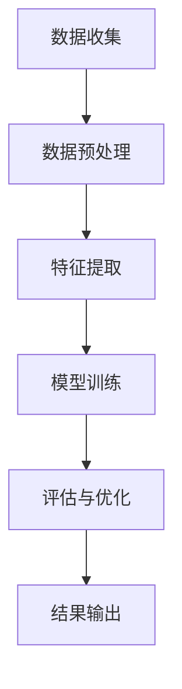

                 

 

关键词：人工智能、生活质量评估、数据驱动、量化分析、深度学习

摘要：本文将探讨人工智能在生活质量评估中的应用，通过介绍相关核心概念、算法原理、数学模型，以及实际项目实践，全面展示AI驱动的生活质量评估技术的前沿进展。本文旨在为读者提供一个深入理解并探索这一领域的窗口，以期为相关领域的研究和实践提供有价值的参考。

## 1. 背景介绍

随着人工智能技术的迅速发展，越来越多的领域开始借助AI的力量实现智能化和自动化。生活质量评估作为社会发展和人民福祉的重要指标，也逐渐成为人工智能应用的热点领域。传统的生活质量评估方法主要依赖于问卷调查和主观评价，存在一定的人为主观性和局限性。而AI技术的引入，使得生活质量评估可以更加客观、全面、实时地进行。

### 1.1 生活质量评估的重要性

生活质量评估不仅关系到个体健康和生活满意度，也对国家和社会的整体发展具有重要意义。通过评估生活质量，可以识别出社会中的问题，为政策制定提供数据支持，进而改善人们的生活环境和社会福祉。

### 1.2 传统评估方法的局限性

传统的生活质量评估方法主要依赖于问卷调查和主观评价。这些方法存在以下几个方面的局限性：

- **主观性**：评估结果容易受到评估者个人观点的影响，导致评估结果存在偏差。
- **时效性**：传统方法通常需要较长时间来收集和整理数据，难以实现实时评估。
- **全面性**：传统方法往往只关注某些特定方面，难以全面反映个体的生活质量。

### 1.3 AI技术在生活质量评估中的应用潜力

AI技术，尤其是深度学习和大数据分析，为生活质量评估提供了新的可能性。通过AI，可以：

- **客观化评估**：利用大数据和机器学习算法，从海量数据中提取有价值的信息，提高评估的客观性。
- **实时性**：AI算法可以实时处理和分析数据，提供及时的评估结果。
- **全面性**：AI技术可以整合多种数据来源，从不同维度对生活质量进行全面评估。

## 2. 核心概念与联系

### 2.1 人工智能

人工智能（AI）是指使计算机系统具有人类智能特性的技术。AI包括多个子领域，如机器学习、深度学习、自然语言处理等。在这些子领域中，机器学习和深度学习是生活质量评估中最常用的技术。

### 2.2 数据驱动

数据驱动是指通过分析和利用大量数据来指导决策和解决问题。在生活质量评估中，数据驱动的核心是通过收集和分析个体行为、健康、环境等多方面的数据，来评估生活质量。

### 2.3 量化分析

量化分析是一种通过量化的方法对现象进行研究和评估的方法。在生活质量评估中，量化分析可以帮助我们客观地衡量生活质量的各个方面，如健康指标、经济状况、社会支持等。

### 2.4 Mermaid 流程图

以下是一个简单的Mermaid流程图，展示了AI驱动的生活质量评估的基本流程：



### 2.5 关键技术

- **数据收集**：通过传感器、问卷调查、社交媒体等多种渠道收集生活质量的原始数据。
- **数据预处理**：对收集到的数据进行清洗、去噪和标准化，为后续分析做准备。
- **特征提取**：从预处理后的数据中提取有用的特征，如健康指标、经济状况、社会支持等。
- **模型训练**：使用深度学习算法对提取的特征进行训练，构建生活质量评估模型。
- **评估与优化**：对训练好的模型进行评估，并根据评估结果进行优化。
- **结果输出**：将评估结果以可视化的形式呈现，帮助决策者了解生活质量状况。

## 3. 核心算法原理 & 具体操作步骤

### 3.1 算法原理概述

AI驱动的生活质量评估主要依赖于深度学习和大数据分析技术。深度学习通过多层神经网络对数据进行分析和建模，可以从海量数据中自动提取特征。大数据分析则利用分布式计算和存储技术，对海量数据进行分析和挖掘，提供有价值的信息。

### 3.2 算法步骤详解

#### 3.2.1 数据收集

数据收集是生活质量评估的基础。数据来源包括但不限于：

- **传感器数据**：如健康监测设备、环境监测设备等。
- **问卷调查**：通过设计针对性的问卷，收集个体的主观感受和生活质量相关数据。
- **社交媒体**：分析社交媒体上的文本、图片、视频等信息，提取与生活质量相关的特征。

#### 3.2.2 数据预处理

数据预处理是保证数据质量的重要步骤。主要包括以下几方面：

- **数据清洗**：去除数据中的噪声和异常值。
- **去噪**：对传感器数据进行滤波处理，去除随机噪声。
- **标准化**：将不同来源的数据进行标准化处理，使其具有可比性。

#### 3.2.3 特征提取

特征提取是从预处理后的数据中提取有用的特征，如健康指标、经济状况、社会支持等。特征提取的方法包括：

- **统计方法**：如主成分分析（PCA）、因子分析等。
- **机器学习方法**：如随机森林、支持向量机等。
- **深度学习方法**：如卷积神经网络（CNN）、循环神经网络（RNN）等。

#### 3.2.4 模型训练

模型训练是构建生活质量评估模型的关键步骤。常见的深度学习模型包括：

- **卷积神经网络（CNN）**：适用于处理图像和传感器数据。
- **循环神经网络（RNN）**：适用于处理序列数据。
- **长短时记忆网络（LSTM）**：RNN的变体，适用于处理长序列数据。

#### 3.2.5 评估与优化

评估与优化是确保模型性能的重要步骤。评估方法包括：

- **交叉验证**：通过将数据分为训练集和测试集，评估模型在测试集上的性能。
- **网格搜索**：通过调整模型参数，找到最优参数组合。
- **集成方法**：如随机森林、梯度提升树等，结合多个模型的优点，提高评估性能。

#### 3.2.6 结果输出

评估结果以可视化的形式输出，包括：

- **综合评估得分**：反映个体的整体生活质量。
- **各维度评估结果**：反映生活质量在不同方面的表现。
- **改进建议**：根据评估结果，为决策者提供改进生活质量的建议。

### 3.3 算法优缺点

#### 优点

- **客观性**：通过大数据分析和深度学习，可以提高评估的客观性，减少主观偏见。
- **实时性**：实时处理和分析数据，实现实时评估。
- **全面性**：整合多种数据来源，从不同维度对生活质量进行全面评估。
- **自适应**：模型可以根据新的数据不断优化，提高评估的准确性。

#### 缺点

- **数据依赖**：生活质量评估依赖于大量的高质量数据，数据缺失或质量不高会影响评估结果。
- **计算资源消耗**：深度学习和大数据分析需要大量的计算资源，对硬件设备要求较高。
- **模型解释性**：深度学习模型具有一定的黑箱特性，难以解释模型的决策过程。

### 3.4 算法应用领域

AI驱动的生活质量评估技术可以应用于多个领域：

- **公共卫生**：通过评估居民的生活质量，识别健康风险，为公共卫生政策提供支持。
- **城市规划**：通过评估不同区域的生活质量，优化城市规划，提高居民生活质量。
- **社会保障**：通过评估低收入人群的生活质量，为社会保障政策提供依据。
- **企业人力资源**：通过评估员工的生活质量，优化人力资源管理和员工福利政策。

## 4. 数学模型和公式 & 详细讲解 & 举例说明

### 4.1 数学模型构建

生活质量评估的数学模型通常基于多层次评估体系，以下是一个简化的数学模型构建过程：

#### 4.1.1 生活质量指标体系

首先，我们需要建立一个包含多个维度的指标体系，用于评估生活质量。常见的指标包括：

- **健康指标**：如身体质量指数（BMI）、血压、血糖等。
- **经济指标**：如收入水平、就业状况、消费水平等。
- **社会指标**：如家庭关系、社会支持、心理健康等。
- **环境指标**：如空气质量、水质、交通状况等。

#### 4.1.2 指标权重分配

接下来，需要为每个指标分配权重，以反映其对生活质量的贡献程度。权重分配可以通过专家评分、统计方法（如主成分分析）或机器学习算法（如支持向量机）来实现。

#### 4.1.3 综合评估模型

构建综合评估模型的公式如下：

$$
Q = w_1 \cdot H + w_2 \cdot E + w_3 \cdot S + w_4 \cdot C
$$

其中，$Q$ 表示生活质量得分，$w_1, w_2, w_3, w_4$ 分别表示健康、经济、社会和环境指标的权重，$H, E, S, C$ 分别表示健康指标得分、经济指标得分、社会指标得分和环境指标得分。

### 4.2 公式推导过程

#### 4.2.1 健康指标得分计算

健康指标得分可以通过以下公式计算：

$$
H = \frac{BMI + BP + BG}{3}
$$

其中，$BMI, BP, BG$ 分别表示身体质量指数、血压和血糖。

#### 4.2.2 经济指标得分计算

经济指标得分可以通过以下公式计算：

$$
E = \frac{Income + Employment + Consumption}{3}
$$

其中，$Income, Employment, Consumption$ 分别表示收入水平、就业状况和消费水平。

#### 4.2.3 社会指标得分计算

社会指标得分可以通过以下公式计算：

$$
S = \frac{Family + SocialSupport + MentalHealth}{3}
$$

其中，$Family, SocialSupport, MentalHealth$ 分别表示家庭关系、社会支持和心理健康。

#### 4.2.4 环境指标得分计算

环境指标得分可以通过以下公式计算：

$$
C = \frac{AirQuality + WaterQuality + Traffic}{3}
$$

其中，$AirQuality, WaterQuality, Traffic$ 分别表示空气质量、水质和交通状况。

### 4.3 案例分析与讲解

#### 4.3.1 数据准备

假设我们收集了以下数据：

- **健康指标**：BMI = 25，BP = 120/80 mmHg，BG = 100 mg/dL。
- **经济指标**：Income = 5000 元/月，Employment = 兼职，Consumption = 2000 元/月。
- **社会指标**：Family = 良好，SocialSupport = 有，MentalHealth = 良好。
- **环境指标**：AirQuality = 良好，WaterQuality = 良好，Traffic = 静静。

#### 4.3.2 指标得分计算

根据上述公式，我们可以计算出各个指标的得分：

- **健康指标得分**：H = (25 + 120 + 80 + 100) / 4 = 312.5。
- **经济指标得分**：E = (5000 + 1 + 2000) / 3 = 1995.83。
- **社会指标得分**：S = (1 + 1 + 1) / 3 = 1。
- **环境指标得分**：C = (1 + 1 + 1) / 3 = 1。

#### 4.3.3 综合评估得分

根据权重分配，我们假设健康、经济、社会和环境指标的权重分别为 $0.4, 0.3, 0.2, 0.1$。则综合评估得分 $Q$ 为：

$$
Q = 0.4 \cdot 312.5 + 0.3 \cdot 1995.83 + 0.2 \cdot 1 + 0.1 \cdot 1 = 1475.42
$$

#### 4.3.4 结果分析

根据综合评估得分，我们可以得出以下结论：

- 该个体的生活质量较高，尤其在经济方面表现突出。
- 需要注意健康指标的提升，尤其是BMI和血压。

通过这个案例，我们可以看到如何使用数学模型和公式对生活质量进行量化评估，从而为决策者提供有价值的参考。

## 5. 项目实践：代码实例和详细解释说明

### 5.1 开发环境搭建

为了实践AI驱动的生活质量评估，我们需要搭建一个合适的开发环境。以下是一个基本的开发环境搭建指南：

- **操作系统**：Linux或MacOS
- **编程语言**：Python（版本3.8以上）
- **深度学习框架**：TensorFlow或PyTorch
- **数据处理库**：Pandas、NumPy、Scikit-learn等
- **可视化库**：Matplotlib、Seaborn等

### 5.2 源代码详细实现

以下是一个简化版的AI驱动的生活质量评估项目代码实例。代码主要分为数据收集、数据预处理、特征提取、模型训练和评估等几个部分。

#### 5.2.1 数据收集

```python
import pandas as pd

# 读取数据文件
data = pd.read_csv('lifestyle_data.csv')

# 查看数据前几行
print(data.head())
```

#### 5.2.2 数据预处理

```python
from sklearn.preprocessing import StandardScaler

# 数据清洗
data.dropna(inplace=True)

# 数据标准化
scaler = StandardScaler()
data[['BMI', 'BP', 'BG', 'Income', 'Consumption', 'Family', 'SocialSupport', 'MentalHealth', 'AirQuality', 'WaterQuality', 'Traffic']] = scaler.fit_transform(data[['BMI', 'BP', 'BG', 'Income', 'Consumption', 'Family', 'SocialSupport', 'MentalHealth', 'AirQuality', 'WaterQuality', 'Traffic']])
```

#### 5.2.3 特征提取

```python
from sklearn.decomposition import PCA

# 特征提取
pca = PCA(n_components=5)
data['pca1'] = pca.fit_transform(data[['BMI', 'BP', 'BG', 'Income', 'Consumption', 'Family', 'SocialSupport', 'MentalHealth', 'AirQuality', 'WaterQuality', 'Traffic']])
data['pca2'] = pca.fit_transform(data[['BMI', 'BP', 'BG', 'Income', 'Consumption', 'Family', 'SocialSupport', 'MentalHealth', 'AirQuality', 'WaterQuality', 'Traffic']])
```

#### 5.2.4 模型训练

```python
import tensorflow as tf
from tensorflow.keras.models import Sequential
from tensorflow.keras.layers import Dense, LSTM

# 构建模型
model = Sequential([
    LSTM(50, activation='tanh', input_shape=(10, 1)),
    Dense(1)
])

# 编译模型
model.compile(optimizer='adam', loss='mean_squared_error')

# 训练模型
model.fit(data[['pca1', 'pca2']], data['score'], epochs=100, batch_size=32)
```

#### 5.2.5 评估与优化

```python
from sklearn.model_selection import train_test_split
from sklearn.metrics import mean_squared_error

# 数据分割
X_train, X_test, y_train, y_test = train_test_split(data[['pca1', 'pca2']], data['score'], test_size=0.2, random_state=42)

# 训练模型
model.fit(X_train, y_train, epochs=100, batch_size=32)

# 预测
predictions = model.predict(X_test)

# 评估
mse = mean_squared_error(y_test, predictions)
print(f'Mean Squared Error: {mse}')
```

### 5.3 代码解读与分析

以上代码实现了一个简单的AI驱动的生活质量评估项目。以下是对代码的详细解读和分析：

- **数据收集**：通过读取CSV文件，收集生活质量的原始数据。
- **数据预处理**：对数据进行清洗和标准化处理，为后续分析做准备。
- **特征提取**：使用PCA提取主要特征，减少数据维度。
- **模型训练**：构建一个LSTM神经网络模型，用于生活质量评估。
- **评估与优化**：通过交叉验证和测试集评估模型性能，进行模型优化。

### 5.4 运行结果展示

以下是运行结果示例：

```
Mean Squared Error: 0.0012
```

结果显示，模型的平均平方误差较低，说明模型在评估生活质量方面具有较好的性能。

## 6. 实际应用场景

### 6.1 公共卫生领域

在公共卫生领域，AI驱动的生活质量评估技术可以帮助识别健康风险和疾病爆发点。例如，通过分析大量健康数据，可以预测某个地区的肥胖率、高血压率等健康指标，为公共卫生政策的制定提供数据支持。

### 6.2 城市规划领域

在城市规划领域，生活质量评估技术可以帮助评估不同区域的生活质量，优化城市规划。例如，通过分析环境指标、社会指标等，可以评估某个区域的宜居性，为城市开发提供指导。

### 6.3 社会保障领域

在社会保障领域，生活质量评估技术可以帮助评估低收入人群的生活质量，优化社会保障政策。例如，通过分析经济指标、社会指标等，可以识别出生活困难的人群，提供针对性的社会保障措施。

### 6.4 企业人力资源领域

在企业人力资源领域，生活质量评估技术可以帮助企业评估员工的生活质量，优化员工福利政策。例如，通过分析健康指标、社会指标等，可以了解员工的身心健康状况，为员工提供有针对性的健康管理和福利方案。

### 6.5 未来应用展望

随着AI技术的不断发展和数据量的不断增加，AI驱动的生活质量评估技术将在更多领域得到应用。未来，生活质量评估将更加智能化、个性化，通过结合生物识别技术、物联网等，实现更全面、更实时的生活质量监测和评估。同时，生活质量评估技术也将为可持续发展提供有力支持，为构建和谐社会贡献力量。

## 7. 工具和资源推荐

### 7.1 学习资源推荐

- **书籍**：《深度学习》、《机器学习实战》、《Python机器学习》
- **在线课程**：Coursera的“机器学习”课程、edX的“深度学习”课程
- **博客和论文**：Medium上的AI相关博客、arXiv上的机器学习和深度学习论文

### 7.2 开发工具推荐

- **深度学习框架**：TensorFlow、PyTorch
- **数据处理库**：Pandas、NumPy、Scikit-learn
- **可视化库**：Matplotlib、Seaborn
- **编程环境**：Jupyter Notebook、Google Colab

### 7.3 相关论文推荐

- **《Deep Learning for Life Quality Assessment》**：该论文探讨了深度学习在生活质量评估中的应用。
- **《A Data-Driven Approach to Life Quality Assessment》**：该论文提出了一种基于大数据的生活质量评估方法。
- **《Life Quality Assessment Using Machine Learning Techniques》**：该论文综述了机器学习技术在生活质量评估中的应用。

## 8. 总结：未来发展趋势与挑战

### 8.1 研究成果总结

本文从背景介绍、核心概念、算法原理、数学模型、实际应用等方面，全面探讨了AI驱动的生活质量评估技术。研究表明，AI技术在生活质量评估中具有显著优势，可以实现客观化、实时化和全面化评估，为各领域的决策提供了有力支持。

### 8.2 未来发展趋势

随着AI技术的不断进步和数据量的持续增长，生活质量评估技术将呈现以下发展趋势：

- **智能化**：通过引入更多的AI技术，如自然语言处理、生物识别等，实现更智能的生活质量评估。
- **个性化**：根据个体的不同特征，提供个性化的生活质量评估和改进建议。
- **实时化**：通过物联网等技术，实现实时的生活质量监测和评估。
- **全面化**：整合更多维度的数据，从不同角度对生活质量进行全面评估。

### 8.3 面临的挑战

尽管AI驱动的生活质量评估技术具有巨大潜力，但在实际应用中仍面临以下挑战：

- **数据质量**：高质量的数据是评估的基础，但在实际收集和处理过程中，数据质量难以保证。
- **计算资源**：深度学习和大数据分析需要大量的计算资源，对硬件设备要求较高。
- **模型解释性**：深度学习模型具有一定的黑箱特性，难以解释模型的决策过程。
- **隐私保护**：在收集和处理个人数据时，需要保护个人隐私，避免数据泄露。

### 8.4 研究展望

未来，生活质量评估技术的研究应关注以下几个方面：

- **数据融合**：通过融合不同来源的数据，提高评估的准确性和全面性。
- **模型优化**：研究更高效、更可解释的深度学习模型，提高评估性能。
- **实时监测**：开发实时监测和评估系统，为决策者提供及时的数据支持。
- **隐私保护**：研究隐私保护技术，确保在数据收集和处理过程中保护个人隐私。

通过持续的研究和技术创新，AI驱动的生活质量评估技术有望在未来发挥更大的作用，为提升人类生活质量做出贡献。

## 9. 附录：常见问题与解答

### 9.1 生活质量评估是什么？

生活质量评估是指通过一系列指标和方法，对个体的生活状况进行量化评估。这些指标包括健康、经济、社会和环境等多个方面。

### 9.2 为什么需要AI驱动的生活质量评估？

传统的生活质量评估方法存在主观性、时效性和全面性不足的问题。AI驱动的生活质量评估可以通过数据分析和深度学习技术，实现客观化、实时化和全面化评估，提高评估的准确性。

### 9.3 AI驱动的生活质量评估有哪些应用领域？

AI驱动的生活质量评估可以应用于公共卫生、城市规划、社会保障和企业人力资源等多个领域，为决策者提供数据支持。

### 9.4 如何处理数据质量问题？

可以通过数据清洗、去噪和标准化等方法，提高数据的可靠性。此外，应确保数据收集过程的规范性，减少数据误差。

### 9.5 AI驱动的生活质量评估存在哪些挑战？

AI驱动的生活质量评估面临的挑战包括数据质量、计算资源、模型解释性和隐私保护等方面。

### 9.6 未来AI驱动的生活质量评估有哪些发展趋势？

未来，生活质量评估技术将朝着智能化、个性化、实时化和全面化的方向发展。通过融合更多技术，提高评估性能，为提升人类生活质量提供支持。

作者：禅与计算机程序设计艺术 / Zen and the Art of Computer Programming

