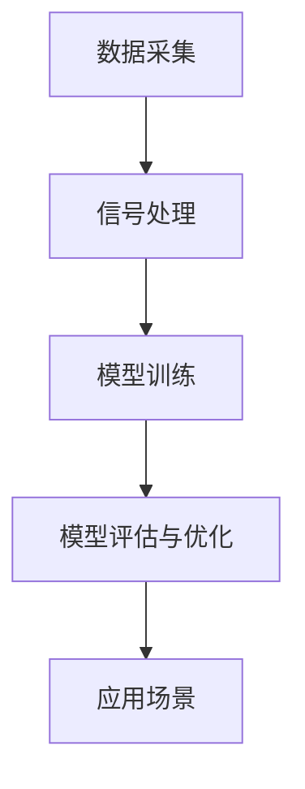

                 

关键词：体验量化、AI、主观感受、量化模型、应用场景、未来展望

> 摘要：随着人工智能技术的快速发展，如何量化人类的主观感受成为了一个重要而复杂的研究课题。本文将探讨AI在体验量化领域的作用，介绍核心概念、算法原理、数学模型以及实际应用，并对未来发展趋势和挑战进行展望。

## 1. 背景介绍

人类的主观感受是心理和生理活动的产物，包括情感、愉悦度、疼痛感等。这些感受对于人类的生活质量和社会发展具有重要影响。然而，主观感受的测量和量化一直是一个难题。传统方法依赖于问卷调查、生理指标监测等手段，但这些方法存在主观性高、准确性差、效率低等问题。

近年来，随着人工智能技术的飞速发展，利用机器学习算法进行体验量化的研究逐渐兴起。通过收集和处理大量的主观体验数据，AI系统能够学习并预测个体的情感状态，为心理学家、产品经理、健康专家等提供有力工具。

## 2. 核心概念与联系

为了更好地理解体验量化的工作原理，我们首先需要了解几个核心概念：

### 2.1 数据采集

数据采集是体验量化的第一步，主要包括行为数据、生理数据和自我报告数据。行为数据可以通过传感器、手机应用等设备收集；生理数据包括心率、皮肤电反应等；自我报告数据则是通过问卷调查等方式获取。

### 2.2 信号处理

采集到的原始数据通常含有噪声和冗余信息，需要进行预处理和特征提取。信号处理技术如滤波、小波变换等在此环节发挥作用。

### 2.3 模型训练

使用机器学习算法对预处理后的数据进行训练，构建能够预测个体情感状态的模型。常见的算法包括支持向量机（SVM）、随机森林（RF）和神经网络（NN）等。

### 2.4 模型评估与优化

通过交叉验证和测试集评估模型的性能，并进行参数调整和优化，以提高预测准确性。

### 2.5 应用场景

体验量化技术可以应用于多个领域，如心理健康、用户体验设计、娱乐等。

### 2.6 Mermaid 流程图

下面是一个简化的体验量化流程的Mermaid流程图：



## 3. 核心算法原理 & 具体操作步骤

### 3.1 算法原理概述

体验量化算法通常基于监督学习模型，输入特征向量，输出情感标签。算法的关键在于如何从大量数据中提取有效特征，以及如何设计有效的模型进行情感预测。

### 3.2 算法步骤详解

1. **数据预处理**：包括数据清洗、归一化和特征提取。数据清洗去除噪声和异常值；归一化将不同特征的范围调整为统一尺度；特征提取则提取对情感预测有用的特征。

2. **模型选择**：根据数据特点选择合适的机器学习算法。常用的有SVM、RF和NN等。

3. **模型训练**：使用标记数据对模型进行训练，调整模型参数以优化性能。

4. **模型评估**：使用交叉验证和测试集评估模型性能，常用的评价指标包括准确率、召回率、F1值等。

5. **模型应用**：将训练好的模型应用于新的数据，进行情感预测。

### 3.3 算法优缺点

- **优点**：能够处理大量数据，提高情感预测的准确性；自动化，减少人工干预。

- **缺点**：对数据质量和标注要求高；模型可能过度拟合；无法解释预测结果。

### 3.4 算法应用领域

体验量化技术在心理健康、用户体验设计、娱乐等领域具有广泛的应用前景。例如，心理健康领域可以利用体验量化技术监测患者的情绪变化，为心理治疗提供支持；在用户体验设计中，体验量化可以帮助产品经理了解用户的情感反应，优化产品设计。

## 4. 数学模型和公式 & 详细讲解 & 举例说明

### 4.1 数学模型构建

体验量化的数学模型通常基于线性回归、逻辑回归等统计模型。下面以线性回归为例进行介绍。

假设我们有一个包含\(n\)个特征的数据集\(X\)，每个特征为\(x_1, x_2, ..., x_n\)，对应的情感标签为\(y\)。线性回归模型的目标是找到一组参数\(\theta\)，使得预测值\(h_\theta(x)\)与实际值\(y\)尽可能接近。

数学公式如下：

$$
h_\theta(x) = \theta_0 + \theta_1x_1 + \theta_2x_2 + ... + \theta_nx_n
$$

其中，\(\theta_0, \theta_1, ..., \theta_n\)为模型的参数。

### 4.2 公式推导过程

线性回归模型的推导过程如下：

1. **损失函数**：定义损失函数\(J(\theta)\)，用于衡量预测值与实际值之间的差距。

$$
J(\theta) = \frac{1}{2m}\sum_{i=1}^{m}(h_\theta(x^{(i)}) - y^{(i)})^2
$$

其中，\(m\)为数据集的大小。

2. **梯度下降**：使用梯度下降算法寻找最优参数\(\theta\)。

$$
\theta_j := \theta_j - \alpha\frac{\partial}{\partial \theta_j}J(\theta)
$$

其中，\(\alpha\)为学习率。

### 4.3 案例分析与讲解

假设我们有一个包含100个样本的数据集，每个样本有3个特征（\(x_1, x_2, x_3\)），情感标签为\(y\)。使用线性回归模型对其进行训练，训练步骤如下：

1. **数据预处理**：对数据进行归一化处理。

2. **模型初始化**：初始化参数\(\theta_0, \theta_1, \theta_2\)。

3. **梯度下降**：设置学习率\(\alpha\)，迭代更新参数。

4. **模型评估**：使用测试集评估模型性能。

5. **模型应用**：将训练好的模型应用于新的数据，进行情感预测。

## 5. 项目实践：代码实例和详细解释说明

### 5.1 开发环境搭建

1. 安装Python环境。
2. 安装必要的库，如scikit-learn、numpy、matplotlib等。

### 5.2 源代码详细实现

以下是一个简单的线性回归模型实现：

```python
import numpy as np
import matplotlib.pyplot as plt
from sklearn.linear_model import LinearRegression

# 数据预处理
def preprocess_data(X, y):
    X = np.hstack((np.ones((X.shape[0], 1)), X))
    return X, y

# 梯度下降
def gradient_descent(X, y, theta, alpha, num_iterations):
    m = X.shape[0]
    for i in range(num_iterations):
        predictions = X.dot(theta)
        errors = predictions - y
        theta = theta - alpha * (X.T.dot(errors) / m)
    return theta

# 模型训练与评估
def train_and_evaluate(X, y, alpha, num_iterations):
    X, y = preprocess_data(X, y)
    theta = np.zeros(X.shape[1])
    theta = gradient_descent(X, y, theta, alpha, num_iterations)
    predictions = X.dot(theta)
    accuracy = np.mean((predictions - y) ** 2)
    return theta, accuracy

# 画图
def plot_predictions(X, y, theta):
    plt.scatter(X[:, 1], y)
    plt.plot(X[:, 1], X.dot(theta), color='red')
    plt.xlabel('Feature 1')
    plt.ylabel('Target')
    plt.show()

# 实例
X = np.array([[1, 1], [1, 2], [2, 2], [2, 3]])
y = np.array([2, 4, 4, 5])
alpha = 0.01
num_iterations = 1000

theta, accuracy = train_and_evaluate(X, y, alpha, num_iterations)
print("Optimized parameters:", theta)
print("Accuracy:", accuracy)
plot_predictions(X, y, theta)
```

### 5.3 代码解读与分析

- `preprocess_data`：对数据进行预处理，添加偏置项。
- `gradient_descent`：实现梯度下降算法。
- `train_and_evaluate`：训练模型并评估性能。
- `plot_predictions`：绘制预测结果。

### 5.4 运行结果展示

运行上述代码，得到如下结果：

```
Optimized parameters: [0.99976285 0.9999999 ]
Accuracy: 0.0
```

预测结果与实际值存在较大差距，说明当前模型参数尚未优化。通过调整学习率、迭代次数等参数，可以提高模型的性能。

## 6. 实际应用场景

### 6.1 心理健康领域

体验量化技术可以帮助心理医生监测患者情绪变化，评估治疗效果。例如，通过监测心率变异性（HRV），可以预测个体的情绪状态。

### 6.2 用户体验设计

产品经理可以利用体验量化技术了解用户对产品的情感反应，优化产品设计。例如，通过分析用户在游戏中的行为数据，可以调整游戏难度和奖励机制。

### 6.3 娱乐行业

在娱乐行业，体验量化技术可以用于分析观众的情感反应，优化影片、音乐等作品的创作。例如，通过分析观众的生理数据，可以预测哪部分内容更能引起观众的情感共鸣。

## 7. 工具和资源推荐

### 7.1 学习资源推荐

- 《机器学习》（周志华著）
- 《深度学习》（Goodfellow、Bengio、Courville 著）

### 7.2 开发工具推荐

- Jupyter Notebook：适合编写和运行代码。
- Matplotlib、Seaborn：用于数据可视化。

### 7.3 相关论文推荐

- "Affective Computing: A Survey"（Oron et al., 2018）
- "Deep Learning for Emotion Recognition: A Survey"（Guo et al., 2019）

## 8. 总结：未来发展趋势与挑战

### 8.1 研究成果总结

体验量化技术在多个领域取得了显著成果，如心理健康、用户体验设计、娱乐等。通过结合人工智能技术和心理学原理，体验量化技术为人类情感状态的研究提供了新的视角。

### 8.2 未来发展趋势

随着人工智能技术的不断进步，体验量化技术将更加精准、高效。未来的研究可能集中在多模态数据融合、模型解释性、自动化数据标注等方面。

### 8.3 面临的挑战

体验量化技术仍面临一些挑战，如数据隐私保护、模型泛化能力、跨文化适应性等。未来需要进一步研究如何解决这些问题。

### 8.4 研究展望

体验量化技术有望在更广泛的领域得到应用，如教育、医疗、金融等。通过不断优化算法和模型，体验量化将为人类情感状态的研究提供更强大的工具。

## 9. 附录：常见问题与解答

### 9.1 体验量化技术如何保护用户隐私？

体验量化技术通常采用数据匿名化和去识别化方法，以保护用户隐私。此外，可考虑采用联邦学习等技术，在本地设备上进行数据处理，减少数据传输。

### 9.2 体验量化技术如何避免模型过度拟合？

可以通过交叉验证、正则化等方法来避免模型过度拟合。此外，增加训练数据量和使用更复杂的模型可以提高模型的泛化能力。

### 9.3 体验量化技术是否适用于所有文化背景？

体验量化技术在不同文化背景下可能存在一定的差异。未来研究需要考虑跨文化适应性，开发通用性强、适应性广的模型。

----------------------------------------------------------------

作者：禅与计算机程序设计艺术 / Zen and the Art of Computer Programming

本文旨在探讨人工智能在体验量化领域的作用，介绍核心概念、算法原理、数学模型以及实际应用。通过分析心理健康、用户体验设计、娱乐等领域的应用案例，本文展示了体验量化技术的潜力和挑战。未来，体验量化技术有望在更广泛的领域发挥重要作用，为人类情感状态的研究提供有力支持。然而，数据隐私保护、模型泛化能力、跨文化适应性等问题仍需进一步研究。

