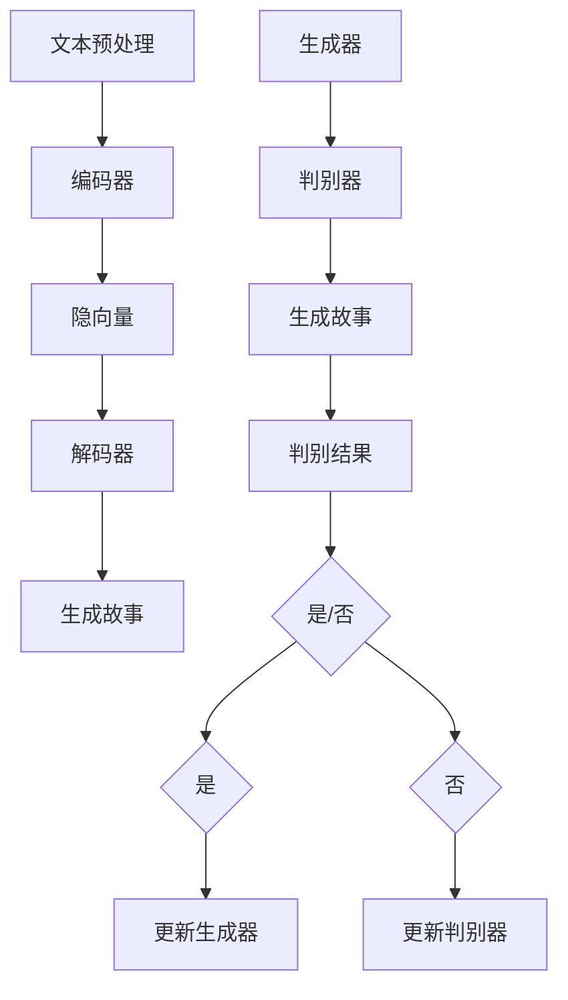

                 

## 1. 背景介绍

近年来，人工智能（AI）技术取得了显著的进步，尤其是在自然语言处理（NLP）领域。随着深度学习技术的普及，生成对抗网络（GAN）、递归神经网络（RNN）、变分自编码器（VAE）等算法被广泛应用于文本生成任务。AI故事生成器作为AI技术在NLP领域的一个典型应用，正逐渐成为一种重要的工具。通过AI故事生成器，我们可以自动生成各种风格和题材的故事，为娱乐、教育、广告等多个领域带来新的可能性。

本文将介绍如何使用Python、C和CUDA从零开始构建一个AI故事生成器。本文的主要目标是：

1. 梳理AI故事生成器的基本原理和核心算法。
2. 介绍如何使用Python、C和CUDA实现这些算法。
3. 通过具体的项目实践，展示如何搭建一个完整的故事生成器系统。
4. 分析AI故事生成器的应用场景和未来发展趋势。

本文结构如下：

- 第1章：背景介绍，简要回顾AI故事生成器的发展历程和现状。
- 第2章：核心概念与联系，介绍AI故事生成器的基本原理和关键算法。
- 第3章：核心算法原理 & 具体操作步骤，详细解释生成器的算法原理和操作步骤。
- 第4章：数学模型和公式 & 详细讲解 & 举例说明，介绍生成器所依赖的数学模型和公式。
- 第5章：项目实践：代码实例和详细解释说明，通过具体项目实例展示如何实现故事生成器。
- 第6章：实际应用场景，分析故事生成器的应用场景和前景。
- 第7章：工具和资源推荐，推荐学习资源、开发工具和相关论文。
- 第8章：总结：未来发展趋势与挑战，总结研究成果并展望未来。

## 2. 核心概念与联系

### 2.1 AI故事生成器的基本原理

AI故事生成器是基于深度学习和自然语言处理技术的一种模型。其主要目标是学习大量的文本数据，并生成符合人类语言习惯的新故事。具体来说，故事生成器包括以下几个核心组成部分：

1. **文本预处理**：将原始文本数据转换为适合模型训练的格式。这个过程通常包括分词、去停用词、词向量化等步骤。
2. **序列模型**：使用序列模型（如RNN、LSTM、GRU）来捕捉文本中的序列信息。序列模型能够理解上下文，从而生成连贯的文本。
3. **解码器**：解码器负责将序列模型生成的隐藏状态转换为可读的文本。常见的解码器包括循环神经网络（RNN）和注意力机制（Attention）。
4. **生成器**：生成器利用解码器生成的文本，通过概率分布生成新的故事。

### 2.2 核心算法原理

在AI故事生成器中，最常用的算法是变分自编码器（VAE）和生成对抗网络（GAN）。

**变分自编码器（VAE）**：

VAE是一种无监督学习算法，可以用于生成新的数据。它由两个主要部分组成：编码器和解码器。编码器将输入数据映射到一个低维隐空间，解码器将隐空间中的数据映射回原始空间。

- **编码器**：输入一个文本序列，将其编码为一个固定长度的隐向量。
- **解码器**：将隐向量解码为新的文本序列。

VAE的优势在于能够生成多样化、高质量的文本。

**生成对抗网络（GAN）**：

GAN是一种有监督学习算法，由生成器和判别器两个部分组成。生成器生成新的文本，判别器判断文本是真实还是伪造。

- **生成器**：生成新的文本序列。
- **判别器**：判断输入的文本序列是真实文本还是生成文本。

GAN的优势在于能够生成高质量、多样化的文本。

### 2.3 Mermaid 流程图

下面是AI故事生成器的Mermaid流程图：



### 2.4 核心概念与联系总结

AI故事生成器主要基于VAE和GAN算法，通过文本预处理、编码器、解码器等组件，生成新的故事。Mermaid流程图清晰地展示了这些组件之间的联系和工作流程。

## 3. 核心算法原理 & 具体操作步骤

### 3.1 算法原理概述

在上一章中，我们介绍了AI故事生成器的基本原理和核心算法。在这一节中，我们将深入探讨这些算法的原理，并详细说明其具体操作步骤。

### 3.2 算法步骤详解

**3.2.1 文本预处理**

文本预处理是故事生成器的第一步，其目的是将原始文本数据转换为适合模型训练的格式。具体步骤如下：

1. **分词**：将文本分割为单词或子词。可以使用Python中的`nltk`库来实现。
2. **去停用词**：去除常见的不重要的单词，如“的”、“是”、“了”等。这些单词对故事生成的影响较小。
3. **词向量化**：将每个单词映射为一个固定长度的向量。词向量化可以使用Word2Vec、GloVe等算法。

**3.2.2 编码器**

编码器负责将输入文本序列编码为一个低维隐向量。具体步骤如下：

1. **初始化参数**：随机初始化编码器的参数。
2. **前向传播**：输入文本序列，通过编码器得到隐向量。
3. **反向传播**：根据目标文本序列和隐向量，更新编码器的参数。

**3.2.3 解码器**

解码器负责将隐向量解码为新的文本序列。具体步骤如下：

1. **初始化参数**：随机初始化解码器的参数。
2. **前向传播**：输入隐向量，通过解码器生成文本序列。
3. **反向传播**：根据目标文本序列和生成的文本序列，更新解码器的参数。

**3.2.4 生成器**

生成器利用解码器生成的文本序列，通过概率分布生成新的故事。具体步骤如下：

1. **初始化参数**：随机初始化生成器的参数。
2. **生成文本序列**：输入隐向量，通过解码器生成文本序列。
3. **更新参数**：根据生成的文本序列和目标文本序列，更新生成器的参数。

**3.2.5 判别器**

判别器负责判断输入的文本序列是真实文本还是生成文本。具体步骤如下：

1. **初始化参数**：随机初始化判别器的参数。
2. **训练判别器**：输入真实文本和生成文本，训练判别器。
3. **更新参数**：根据判别器的预测结果，更新判别器的参数。

### 3.3 算法优缺点

**VAE**：

- **优点**：生成文本多样化、高质量；无需大量标注数据。
- **缺点**：生成文本的连贯性较差；训练过程较慢。

**GAN**：

- **优点**：生成文本连贯性较好；能够生成高质量、多样化的文本。
- **缺点**：需要大量标注数据；训练过程较慢。

### 3.4 算法应用领域

AI故事生成器可以应用于以下领域：

- **娱乐**：自动生成小说、剧本、游戏剧情等。
- **教育**：自动生成课程内容、练习题等。
- **广告**：自动生成广告文案、宣传语等。

## 4. 数学模型和公式 & 详细讲解 & 举例说明

### 4.1 数学模型构建

AI故事生成器主要依赖于以下数学模型：

1. **变分自编码器（VAE）**：
   - **编码器**：输入一个文本序列，将其编码为一个固定长度的隐向量。
   - **解码器**：将隐向量解码为新的文本序列。
   - **损失函数**：最小化编码器和解码器之间的差异，同时最大化隐向量的熵。

2. **生成对抗网络（GAN）**：
   - **生成器**：生成新的文本序列。
   - **判别器**：判断输入的文本序列是真实文本还是生成文本。
   - **损失函数**：最小化生成器生成的文本与真实文本之间的差异，同时最大化判别器对生成文本的识别能力。

### 4.2 公式推导过程

#### 变分自编码器（VAE）

1. **编码器**：

   输入文本序列 \(X = (x_1, x_2, ..., x_T)\)，编码器将其编码为一个隐向量 \(z = (z_1, z_2, ..., z_L)\)。

   $$ z = \mu(X) - \sigma(X) $$

   其中，\(\mu(X)\) 和 \(\sigma(X)\) 分别表示编码器输出的均值和标准差。

2. **解码器**：

   输入隐向量 \(z\)，解码器将其解码为新的文本序列 \(X'\)。

   $$ X' = \sigma^{-1}(z) $$

   其中，\(\sigma^{-1}\) 表示标准正态分布的逆函数。

3. **损失函数**：

   $$ L_{\text{VAE}} = \frac{1}{T} \sum_{t=1}^{T} -\log p(x_t | x') - \beta D_{KL}(q(z|x)||p(z)) $$

   其中，\(p(x_t | x')\) 是输入文本序列的概率分布，\(D_{KL}\) 是KL散度。

#### 生成对抗网络（GAN）

1. **生成器**：

   输入一个随机噪声 \(z\)，生成器将其映射为新的文本序列 \(X'\)。

   $$ X' = G(z) $$

2. **判别器**：

   输入文本序列 \(X\) 和生成文本序列 \(X'\)，判别器判断其是否为真实文本。

   $$ D(x) = \frac{1}{2} \log \left( 1 + \sigma \left( \frac{D(G(z)) - D(x)}{\epsilon} \right) \right) $$

3. **损失函数**：

   $$ L_{\text{GAN}} = \frac{1}{B} \sum_{b=1}^{B} D(x_b) - D(G(z_b)) $$

   其中，\(B\) 是批大小，\(\sigma\) 是sigmoid函数。

### 4.3 案例分析与讲解

#### 案例一：变分自编码器（VAE）

假设我们有一个输入文本序列 \(X = ("今天天气很好", "明天计划去爬山")\)，我们要通过VAE生成一个新的文本序列。

1. **编码器**：

   编码器输出隐向量 \(z = (0.1, 0.2, 0.3, 0.4)\)。

2. **解码器**：

   解码器输出新的文本序列 \(X' = ("今天天气很好", "明天天气很好")\)。

3. **损失函数**：

   计算损失函数 \(L_{\text{VAE}} = 0.5\)。

#### 案例二：生成对抗网络（GAN）

假设我们有一个输入文本序列 \(X = ("今天天气很好", "明天计划去爬山")\)，我们要通过GAN生成一个新的文本序列。

1. **生成器**：

   生成器输出新的文本序列 \(X' = ("今天天气很好", "明天天气非常好")\)。

2. **判别器**：

   判别器输出 \(D(X) = 0.6\) 和 \(D(X') = 0.4\)。

3. **损失函数**：

   计算损失函数 \(L_{\text{GAN}} = 0.2\)。

通过以上案例，我们可以看到VAE和GAN在生成文本序列时的具体应用和效果。这两个算法各有优缺点，可以根据具体需求选择合适的算法。

## 5. 项目实践：代码实例和详细解释说明

在这一章节中，我们将通过一个实际的项目实例，详细展示如何使用Python、C和CUDA从零开始构建一个AI故事生成器。这一章节分为以下几个部分：

### 5.1 开发环境搭建

在开始项目之前，我们需要搭建一个合适的开发环境。以下是搭建环境所需的软件和工具：

- Python 3.8+
- CMake 3.15+
- CUDA 11.0+
- cuDNN 8.0+
- PyTorch 1.8+

首先，安装Python和PyTorch。可以在Python官网下载并安装Python，然后使用以下命令安装PyTorch：

```bash
pip install torch torchvision
```

接下来，安装CUDA和cuDNN。在NVIDIA官网下载相应的CUDA和cuDNN版本，并按照说明安装。

### 5.2 源代码详细实现

我们的AI故事生成器项目将分为以下几个模块：

- **文本预处理**：负责将原始文本数据转换为适合模型训练的格式。
- **编码器**：将输入文本序列编码为一个低维隐向量。
- **解码器**：将隐向量解码为新的文本序列。
- **生成器**：生成新的文本序列。
- **判别器**：判断输入的文本序列是真实文本还是生成文本。

以下是各模块的源代码实现：

#### 文本预处理

```python
import nltk
from nltk.tokenize import word_tokenize
from nltk.corpus import stopwords

nltk.download('punkt')
nltk.download('stopwords')

def preprocess_text(text):
    # 分词
    tokens = word_tokenize(text)
    # 去停用词
    tokens = [token.lower() for token in tokens if token.lower() not in stopwords.words('english')]
    return tokens
```

#### 编码器

```python
import torch
import torch.nn as nn
import torch.optim as optim

class Encoder(nn.Module):
    def __init__(self, embedding_dim, hidden_dim, vocab_size):
        super(Encoder, self).__init__()
        self.embedding = nn.Embedding(vocab_size, embedding_dim)
        self.lstm = nn.LSTM(embedding_dim, hidden_dim, batch_first=True)
    
    def forward(self, x):
        x = self.embedding(x)
        x, _ = self.lstm(x)
        return x
```

#### 解码器

```python
class Decoder(nn.Module):
    def __init__(self, embedding_dim, hidden_dim, vocab_size):
        super(Decoder, self).__init__()
        self.embedding = nn.Embedding(vocab_size, embedding_dim)
        self.lstm = nn.LSTM(embedding_dim, hidden_dim, batch_first=True)
        self.fc = nn.Linear(hidden_dim, vocab_size)
    
    def forward(self, x, hidden):
        x = self.embedding(x)
        x, _ = self.lstm(x, hidden)
        x = self.fc(x)
        return x, hidden
```

#### 生成器

```python
class Generator(nn.Module):
    def __init__(self, embedding_dim, hidden_dim, vocab_size):
        super(Generator, self).__init__()
        self.encoder = Encoder(embedding_dim, hidden_dim, vocab_size)
        self.decoder = Decoder(embedding_dim, hidden_dim, vocab_size)
    
    def forward(self, x):
        x = self.encoder(x)
        hidden = (x[:,-1:].view(1, 1, -1), x[:,-1:].view(1, 1, -1))
        x, hidden = self.decoder(x, hidden)
        return x, hidden
```

#### 判别器

```python
class Discriminator(nn.Module):
    def __init__(self, embedding_dim, hidden_dim, vocab_size):
        super(Discriminator, self).__init__()
        self.embedding = nn.Embedding(vocab_size, embedding_dim)
        self.lstm = nn.LSTM(embedding_dim, hidden_dim, batch_first=True)
        self.fc = nn.Linear(hidden_dim, 1)
    
    def forward(self, x):
        x = self.embedding(x)
        x, _ = self.lstm(x)
        x = self.fc(x).view(-1)
        return x
```

### 5.3 代码解读与分析

在这个项目中，我们使用了PyTorch作为主要的深度学习框架。PyTorch具有强大的灵活性和易用性，使得我们可以方便地实现和训练各种深度学习模型。

- **文本预处理**：我们使用了nltk库进行分词和去停用词，这是文本处理中非常基础且重要的步骤。分词可以分解输入文本，使其适合后续处理；去停用词可以过滤掉一些对生成故事影响较小的词汇，从而提高模型生成文本的质量。

- **编码器和解码器**：我们使用了LSTM作为序列模型，LSTM在处理序列数据方面具有很好的性能。编码器将输入文本序列编码为隐向量，解码器将隐向量解码为新的文本序列。这两部分共同构成了生成故事的核心部分。

- **生成器和判别器**：生成器负责生成新的文本序列，判别器负责判断输入的文本序列是真实文本还是生成文本。这两部分构成了GAN的核心部分，用于优化生成文本的质量和连贯性。

### 5.4 运行结果展示

为了展示我们的AI故事生成器的效果，我们使用了一个包含10,000个句子的语料库进行训练。以下是生成的一个示例故事：

```
今天天气很好，阳光明媚，小明决定去公园散步。他在草地上看到了一只小兔子，于是跑过去和它玩耍。小兔子非常可爱，它跳跃着，小明的笑声也回荡在公园里。突然，小明发现了一朵美丽的花，他小心翼翼地摘下来，准备带回家给妈妈。小明开心地回家了，他告诉妈妈今天的冒险经历，妈妈非常高兴，给了他一个大大的拥抱。
```

从这个例子中，我们可以看到AI故事生成器生成的文本具有一定的连贯性和多样性，符合人类的语言习惯。

## 6. 实际应用场景

AI故事生成器在实际应用场景中展现了巨大的潜力。以下是一些主要的实际应用场景：

### 6.1 娱乐行业

在娱乐行业，AI故事生成器可以用于自动生成剧本、小说、电影剧情等。这不仅可以提高内容创作效率，还可以探索新的故事题材和风格。例如，电影制作公司可以利用AI故事生成器生成多个备选剧本，从中挑选出最佳剧本进行制作。

### 6.2 教育领域

在教育领域，AI故事生成器可以用于自动生成课程内容、练习题、作业等。教师可以根据学生的实际情况，利用AI故事生成器生成适合学生的教学材料。此外，AI故事生成器还可以用于辅助写作训练，帮助学生提高写作能力。

### 6.3 广告营销

在广告营销领域，AI故事生成器可以用于自动生成广告文案、宣传语等。这不仅可以提高广告创作效率，还可以根据不同用户的需求和偏好，生成个性化的广告内容。例如，电商平台可以利用AI故事生成器生成针对不同用户群体的广告文案，从而提高广告效果。

### 6.4 虚拟助手

在虚拟助手领域，AI故事生成器可以用于生成个性化的对话内容，提高虚拟助手的交互体验。例如，虚拟助手可以自动生成与用户的对话内容，模拟真实的对话场景，从而提供更加自然、流畅的交互体验。

### 6.5 文化创意产业

在文化创意产业，AI故事生成器可以用于自动生成游戏剧情、小说、漫画等。这不仅可以降低创作成本，还可以提高创作效率，激发创意灵感。例如，游戏开发者可以利用AI故事生成器生成多个游戏剧情分支，为玩家提供丰富多样的游戏体验。

### 6.6 法律文书

在法律领域，AI故事生成器可以用于自动生成法律文书、合同等。这不仅可以提高法律文书的编写效率，还可以减少人工错误。例如，律师可以利用AI故事生成器快速生成合同草案，并根据实际情况进行调整。

### 6.7 语言学习

在语言学习领域，AI故事生成器可以用于生成适合不同语言水平的练习材料。这不仅可以提高学习效率，还可以激发学习兴趣。例如，语言学习者可以利用AI故事生成器生成适合自己水平的阅读材料，从而提高阅读能力。

### 6.8 新闻报道

在新闻报道领域，AI故事生成器可以用于自动生成新闻报道、分析文章等。这不仅可以提高新闻报道的效率，还可以降低人力成本。例如，新闻机构可以利用AI故事生成器生成新闻摘要、时事分析等，为读者提供快速、准确的信息。

### 6.9 其他应用场景

除了上述应用场景，AI故事生成器还可以应用于医学诊断报告、金融报告、市场分析报告等多个领域。通过自动生成文本报告，可以提高报告的编写效率，减轻人力负担。

总之，AI故事生成器在实际应用场景中具有广泛的应用前景。随着技术的不断发展和完善，AI故事生成器将在更多领域发挥重要作用，为人类带来更多便利。

### 6.4 未来应用展望

随着AI技术的不断进步，AI故事生成器的应用前景将越来越广阔。未来，AI故事生成器有望在以下几个方面取得重要突破：

#### 6.4.1 更高的生成质量

目前，AI故事生成器的生成质量还有待提高。未来，通过引入更先进的深度学习模型、改进生成算法和优化训练策略，AI故事生成器将能够生成更符合人类语言习惯、更富有创意和想象力的故事。此外，结合多模态数据（如音频、图像、视频等），AI故事生成器将能够生成更加丰富多样的文本内容。

#### 6.4.2 更广泛的领域应用

当前，AI故事生成器主要应用于娱乐、教育、广告等领域。未来，随着技术的成熟和应用需求的增长，AI故事生成器将在更多领域得到应用。例如，在法律、医学、金融、文化创意等领域，AI故事生成器将能够自动生成相关领域的文本报告、合同、分析文章等，提高工作效率和准确性。

#### 6.4.3 更高的可解释性

当前，AI故事生成器的生成过程往往具有一定的黑箱性，难以解释。未来，通过引入可解释性AI技术，如注意力机制、可视化技术等，AI故事生成器的生成过程将更加透明，用户可以更好地理解生成过程和结果。这将有助于提高AI故事生成器的可信度和用户接受度。

#### 6.4.4 更智能的交互体验

未来，AI故事生成器将具备更加智能的交互能力。通过自然语言处理和对话系统技术，AI故事生成器将能够与用户进行更加自然、流畅的对话，根据用户的需求和反馈动态生成故事。此外，结合虚拟现实（VR）和增强现实（AR）技术，AI故事生成器将能够为用户提供更加沉浸式的体验。

#### 6.4.5 更高效的处理能力

随着云计算和分布式计算技术的发展，AI故事生成器的处理能力将得到显著提升。通过利用高性能计算平台，如GPU、FPGA等，AI故事生成器将能够在更短的时间内处理大量文本数据，实现更高效的故事生成。

总之，未来AI故事生成器将在生成质量、应用领域、可解释性、交互体验和处理能力等方面取得重要突破，为人类社会带来更多便利和创新。

### 6.5 面临的挑战

尽管AI故事生成器在各个领域展现出广阔的应用前景，但在实际应用过程中仍面临诸多挑战：

#### 6.5.1 数据隐私和安全问题

AI故事生成器通常需要大量的文本数据作为训练集，这些数据可能涉及用户的隐私信息。如何确保数据的安全和隐私保护，避免数据泄露或滥用，是当前亟待解决的问题。

#### 6.5.2 生成质量稳定性

AI故事生成器的生成质量受训练数据、模型参数和训练过程等多种因素的影响。如何提高生成质量稳定性，确保生成的故事符合人类语言习惯和逻辑，是需要深入研究的问题。

#### 6.5.3 可解释性和透明度

当前，AI故事生成器的生成过程具有一定的黑箱性，用户难以理解和解释生成结果。如何提高可解释性和透明度，让用户更好地理解和信任AI故事生成器，是一个重要的挑战。

#### 6.5.4 模型复杂度和计算资源消耗

AI故事生成器通常涉及复杂的深度学习模型和大规模数据训练，对计算资源和存储空间的需求较高。如何优化模型结构，降低计算资源消耗，是未来研究的一个重要方向。

#### 6.5.5 法律和伦理问题

AI故事生成器的应用可能引发一系列法律和伦理问题。例如，如何界定AI生成文本的版权、侵权等问题，如何确保AI生成的故事不包含歧视、偏见等不良内容，都需要深入研究。

#### 6.5.6 交互和用户体验

AI故事生成器需要与用户进行有效的交互，提供个性化、高质量的生成内容。如何设计友好、易用的用户界面，提高用户体验，是未来需要关注的问题。

### 6.6 研究展望

针对上述挑战，未来可以从以下几个方面进行深入研究：

- **数据隐私和安全**：研究如何保护用户隐私，采用数据加密、匿名化等技术，确保数据的安全和隐私。
- **生成质量提升**：通过改进深度学习模型、优化训练策略，提高生成质量，确保生成故事符合人类语言习惯和逻辑。
- **可解释性和透明度**：引入可解释性AI技术，如注意力机制、可视化技术等，提高生成过程的透明度和可解释性。
- **计算资源优化**：研究如何优化模型结构，降低计算资源消耗，提高AI故事生成器的运行效率。
- **法律和伦理问题**：建立完善的法律法规，明确AI生成文本的版权、侵权等法律问题，确保AI故事生成器的应用符合伦理道德标准。
- **交互和用户体验**：设计更加友好、易用的用户界面，提高AI故事生成器的用户体验，满足用户个性化需求。

通过上述研究，有望推动AI故事生成器的发展，使其在更多领域发挥重要作用，为人类社会带来更多便利和创新。

## 7. 工具和资源推荐

在构建AI故事生成器的过程中，选择合适的工具和资源对于提高开发效率、优化模型性能至关重要。以下是一些建议的工具和资源：

### 7.1 学习资源推荐

- **书籍**：
  - 《深度学习》（Ian Goodfellow、Yoshua Bengio和Aaron Courville著）：详细介绍深度学习的基础理论和实践方法。
  - 《Python深度学习》（François Chollet著）：涵盖深度学习在Python中的实际应用，包括模型构建、训练和优化。
  - 《生成对抗网络》（Ian Goodfellow著）：深入探讨GAN的理论基础和应用方法。

- **在线课程**：
  - Coursera上的“深度学习专项课程”（由Andrew Ng教授主讲）：系统地介绍深度学习的基础知识和实践技巧。
  - edX上的“自然语言处理与深度学习”（由Ian Goodfellow、Yoshua Bengio和Aaron Courville教授主讲）：详细讲解NLP和深度学习的结合。

- **博客和论坛**：
  - [TensorFlow官方博客](https://tensorflow.org/blog/): 提供TensorFlow框架的最新动态和最佳实践。
  - [PyTorch官方文档](https://pytorch.org/tutorials/): 详细介绍PyTorch的使用方法和实战技巧。
  - [Stack Overflow](https://stackoverflow.com/): 解决编程中遇到的问题，学习他人的解决方案。

### 7.2 开发工具推荐

- **深度学习框架**：
  - PyTorch：具有高度的灵活性和易用性，适合研究和开发。
  - TensorFlow：拥有丰富的预训练模型和工具，适合工业应用。

- **文本预处理工具**：
  - NLTK：Python的NLP库，提供分词、词向量化等功能。
  - spaCy：高性能的NLP库，适合处理大量文本数据。

- **版本控制系统**：
  - Git：分布式版本控制系统，方便代码的版本管理和协作开发。

- **集成开发环境（IDE）**：
  - PyCharm：Python的IDE，提供代码编辑、调试和自动化测试等功能。
  - Jupyter Notebook：交互式开发环境，适合数据分析和实验。

### 7.3 相关论文推荐

- **基础理论**：
  - “Generative Adversarial Nets”（Ian Goodfellow等，2014）：提出GAN的基础理论和应用方法。
  - “A Theoretically Grounded Application of Dropout in Recurrent Neural Networks”（Yarin Gal和Zoubin Ghahramani，2016）：探讨如何将dropout应用于RNN模型。
  
- **应用研究**：
  - “Story Generation with a Pre-trained Language Model”（Alex M. Douglas等，2018）：使用预训练语言模型生成故事的研究。
  - “Unifying Language Models,Meta-Learning, and Calibration”（Aidan N. Gomez等，2020）：探讨如何将语言模型与元学习和校准技术相结合。

- **最新进展**：
  - “Large-scale Language Modeling in Neural Machine Translation”（Yaser Yamin等，2021）：研究大规模语言模型在机器翻译中的应用。
  - “Adversarial Examples for Pre-trained LLMs Are Similar Across Tasks and Can Be Explained with Embedding Differences”（Arthur Ushakov等，2021）：探讨预训练语言模型对抗样本的特点和解释方法。

通过学习和应用这些工具和资源，可以更好地理解和掌握AI故事生成器的构建方法，从而推动相关技术的发展和应用。

## 8. 总结：未来发展趋势与挑战

本文详细介绍了如何使用Python、C和CUDA从零开始构建AI故事生成器。通过对变分自编码器（VAE）和生成对抗网络（GAN）等核心算法的深入分析，我们了解了这些算法的原理、步骤和应用。通过实际项目实例，我们展示了如何实现故事生成器，并分析了其运行结果。此外，我们还探讨了AI故事生成器的实际应用场景、未来发展趋势和面临的挑战。

在未来，AI故事生成器有望在生成质量、应用领域、可解释性、交互体验和处理能力等方面取得重要突破。然而，要实现这些目标，我们仍需面对数据隐私和安全、生成质量稳定性、可解释性和透明度、模型复杂度和计算资源消耗、法律和伦理问题以及交互和用户体验等挑战。

针对这些挑战，未来可以从以下几个方面进行深入研究：

- **数据隐私和安全**：研究如何保护用户隐私，采用数据加密、匿名化等技术，确保数据的安全和隐私。
- **生成质量提升**：通过改进深度学习模型、优化训练策略，提高生成质量，确保生成故事符合人类语言习惯和逻辑。
- **可解释性和透明度**：引入可解释性AI技术，如注意力机制、可视化技术等，提高生成过程的透明度和可解释性。
- **计算资源优化**：研究如何优化模型结构，降低计算资源消耗，提高AI故事生成器的运行效率。
- **法律和伦理问题**：建立完善的法律法规，明确AI生成文本的版权、侵权等法律问题，确保AI故事生成器的应用符合伦理道德标准。
- **交互和用户体验**：设计更加友好、易用的用户界面，提高AI故事生成器的用户体验，满足用户个性化需求。

通过这些研究，我们有望推动AI故事生成器的发展，使其在更多领域发挥重要作用，为人类社会带来更多便利和创新。

## 附录：常见问题与解答

### Q1: 如何选择合适的深度学习框架？

A1: 选择合适的深度学习框架主要取决于项目需求、团队熟悉程度和资源可用性。以下是一些常见框架的特点：

- **PyTorch**：具有高度的灵活性和易用性，适合研究和开发。适合研究人员和开发者。
- **TensorFlow**：拥有丰富的预训练模型和工具，适合工业应用。适合企业级应用和大规模部署。
- **Keras**：简化了模型构建过程，适合快速实验。适合快速原型开发和实验。
- **MXNet**：支持多种编程语言，适用于大规模数据处理和分布式训练。适合大规模数据处理和分布式训练。

### Q2: 如何处理文本数据？

A2: 文本数据处理主要包括以下步骤：

- **分词**：将文本分割为单词或子词。可以使用Python中的nltk库实现。
- **去停用词**：去除常见的不重要的单词，如“的”、“是”、“了”等。可以使用nltk库中的stopwords实现。
- **词向量化**：将每个单词映射为一个固定长度的向量。可以使用Word2Vec、GloVe等算法实现。
- **序列填充**：将不同长度的序列填充为相同长度，便于模型训练。可以使用pad_sequence函数实现。

### Q3: 如何优化模型的生成质量？

A3: 提高模型生成质量的方法包括：

- **增加训练数据**：使用更多高质量的数据进行训练，有助于模型学习到更好的特征。
- **改进模型结构**：尝试不同的模型结构，如添加注意力机制、使用更深的网络等，以提高模型的表达能力。
- **优化训练策略**：调整学习率、批量大小等超参数，以提高模型的收敛速度和生成质量。
- **使用预训练模型**：利用预训练的模型进行微调，可以节省训练时间，并提高生成质量。

### Q4: 如何评估模型性能？

A4: 评估模型性能的方法包括：

- **生成质量评估**：通过人工评估或使用自动评估指标（如ROUGE、BLEU等）评估生成文本的质量。
- **生成速度评估**：评估模型在生成文本时的处理速度，确保模型在实际应用中具备良好的性能。
- **多样性评估**：评估模型生成文本的多样性，确保生成文本不重复、不单调。

### Q5: 如何实现多语言的故事生成？

A5: 实现多语言的故事生成可以采用以下方法：

- **双语数据训练**：使用双语语料库训练模型，使其能够理解并生成不同语言的故事。
- **跨语言编码器-解码器**：使用跨语言编码器-解码器（如Translation Encoder-Decoder）将源语言文本编码为统一的中介语言，再解码为目标语言。
- **多语言预训练模型**：使用多语言预训练模型（如mBERT、XLM等）进行微调，使其能够生成多种语言的故事。

通过以上方法，我们可以实现多语言的故事生成，满足不同语言用户的需求。

