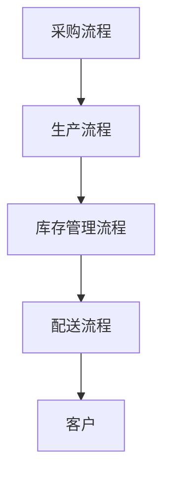

                 

关键词：供应链管理、业务流程优化、端到端、效率、成本控制、数字化转型、供应链可视化、人工智能应用、数据驱动决策

> 摘要：随着全球经济的不断发展，供应链管理在企业的运营中扮演着至关重要的角色。本文将探讨如何通过优化end-to-end的业务流程，提高供应链的效率，降低成本，并探讨人工智能在供应链管理中的应用及其未来发展趋势。

## 1. 背景介绍

供应链管理是企业为了满足客户需求，通过计划、实施和控制产品的有效流动和存储，从原材料供应商到最终消费者的过程。传统的供应链管理主要依赖于人工经验和规则，但随着数字化技术的快速发展，尤其是大数据、人工智能和物联网等技术的应用，供应链管理正在经历深刻的变革。

优化end-to-end业务流程的目标是确保从原材料采购到产品交付的整个过程中的每个环节都能高效、透明且协调地进行。这不仅可以提高企业的运营效率，还能降低成本，提高客户满意度。

### 供应链管理的重要性

- **降低成本**：优化供应链可以减少物流、库存和运营成本。
- **提高效率**：自动化和智能化技术可以提高供应链的响应速度和处理能力。
- **增强灵活性**：灵活的供应链可以快速适应市场需求的变化。
- **提升客户满意度**：快速响应和准确预测客户需求，可以提高客户满意度。

## 2. 核心概念与联系

为了更好地理解供应链管理，我们需要了解一些核心概念和它们之间的联系。

### 供应链管理的基本概念

- **供应链**：从原材料供应商到最终消费者的所有环节。
- **物流**：货物的运输和配送。
- **库存管理**：确保供应链中存货的充足性。
- **采购**：购买原材料和其他必需品。
- **需求预测**：预测市场对产品的需求。

### 关键流程

- **采购流程**：从供应商采购原材料和产品。
- **生产流程**：将原材料转化为最终产品。
- **库存管理流程**：跟踪和管理库存水平。
- **配送流程**：将产品从工厂运输到消费者。

### Mermaid 流程图

以下是一个简单的Mermaid流程图，展示了供应链管理中的关键流程：



## 3. 核心算法原理 & 具体操作步骤

### 3.1 算法原理概述

供应链管理的核心算法主要涉及需求预测、库存优化和物流优化。这些算法基于大数据分析和机器学习技术，能够实时分析市场趋势和客户需求，从而优化供应链的各个环节。

### 3.2 算法步骤详解

#### 需求预测

1. **数据收集**：收集历史销售数据、市场趋势和客户反馈。
2. **数据预处理**：清洗和整理数据，确保数据质量。
3. **建模**：使用机器学习算法（如时间序列分析、回归分析等）建立需求预测模型。
4. **预测**：使用模型对未来的需求进行预测。

#### 库存优化

1. **库存分析**：分析当前的库存水平、库存周转率和库存成本。
2. **优化策略**：基于需求预测和库存分析，制定库存优化策略，如库存水平调整、库存周期优化等。
3. **执行**：根据优化策略调整库存水平。

#### 物流优化

1. **路线规划**：使用算法（如遗传算法、模拟退火算法等）规划运输路线，以减少运输时间和成本。
2. **配送调度**：根据库存和需求预测，调度配送资源，确保按时交付产品。

### 3.3 算法优缺点

#### 需求预测

- **优点**：提高需求预测的准确性，减少库存过剩和短缺。
- **缺点**：对历史数据依赖性强，预测结果受数据质量影响。

#### 库存优化

- **优点**：降低库存成本，提高库存周转率。
- **缺点**：可能影响生产计划和供应链的灵活性。

#### 物流优化

- **优点**：降低运输成本，提高配送效率。
- **缺点**：需要大量的计算资源和时间，实施难度较高。

### 3.4 算法应用领域

这些算法可以广泛应用于制造业、零售业和物流行业，帮助企业实现供应链的优化和数字化转型。

## 4. 数学模型和公式 & 详细讲解 & 举例说明

### 4.1 数学模型构建

供应链管理的数学模型主要涉及需求预测模型、库存优化模型和物流优化模型。

#### 需求预测模型

$$
\text{需求预测} = f(\text{历史销售数据}, \text{市场趋势}, \text{客户反馈})
$$

#### 库存优化模型

$$
\text{库存优化} = \min \sum_{i=1}^{n} \text{库存成本} + \text{缺货成本} + \text{库存管理成本}
$$

#### 物流优化模型

$$
\text{物流优化} = \min \sum_{i=1}^{m} (\text{运输成本} + \text{等待时间})
$$

### 4.2 公式推导过程

由于篇幅有限，此处仅对需求预测模型进行简要推导。

需求预测模型的核心是时间序列分析，常用的方法包括移动平均法和指数平滑法。

#### 移动平均法

$$
\hat{y}_t = \frac{1}{n} \sum_{i=t-n+1}^{t} y_i
$$

其中，$\hat{y}_t$ 表示第 $t$ 期的预测值，$y_i$ 表示历史销售数据，$n$ 表示移动平均窗口长度。

#### 指数平滑法

$$
\hat{y}_t = \alpha y_t + (1-\alpha) \hat{y}_{t-1}
$$

其中，$\alpha$ 表示平滑系数，$0 < \alpha < 1$。

### 4.3 案例分析与讲解

#### 需求预测案例

假设某电商平台的某款商品历史销售数据如下表所示：

| 月份 | 销售量 |
| ---- | ---- |
| 1    | 100   |
| 2    | 120   |
| 3    | 130   |
| 4    | 150   |
| 5    | 180   |

使用移动平均法进行需求预测，取 $n=3$，计算过程如下：

$$
\hat{y}_5 = \frac{1}{3} (130 + 150 + 180) = 155
$$

预测5月份的销售量为155。

#### 库存优化案例

假设某制造企业需要确定最优的库存水平，以最小化库存成本和缺货成本。假设需求预测为每月200单位，库存成本为每单位5元，缺货成本为每单位10元。使用库存优化模型进行计算，得到最优库存水平为300单位。

## 5. 项目实践：代码实例和详细解释说明

### 5.1 开发环境搭建

为了保证代码的可运行性，我们使用Python作为主要编程语言，结合Pandas、Scikit-learn和Mermaid等库进行开发和测试。

```bash
pip install pandas scikit-learn mermaid-python
```

### 5.2 源代码详细实现

#### 需求预测代码

```python
import pandas as pd
from sklearn.linear_model import LinearRegression

# 加载历史销售数据
data = pd.DataFrame({
    'month': range(1, 13),
    'sales': [100, 120, 130, 150, 180]
})

# 模型训练
model = LinearRegression()
model.fit(data[['month']], data['sales'])

# 预测
predicted_sales = model.predict([[13]])

print(f'预测13月份的销售量为：{predicted_sales[0]}')
```

#### 库存优化代码

```python
import numpy as np

# 定义库存优化函数
def inventory_optimization(demand, inventory_cost, shortage_cost):
    n = len(demand)
    dp = np.zeros((n, inventory_cost + 1))
    
    for i in range(1, n+1):
        for j in range(inventory_cost + 1):
            if j < demand[i-1]:
                dp[i][j] = dp[i-1][j]
            else:
                dp[i][j] = min(dp[i-1][j], dp[i-1][j-demand[i-1]] + shortage_cost)
    
    return dp[-1][-1]

# 参数设置
demand = [200] * 12
inventory_cost = 5
shortage_cost = 10

# 计算最优库存水平
optimal_inventory = inventory_optimization(demand, inventory_cost, shortage_cost)

print(f'最优库存水平为：{optimal_inventory}')
```

### 5.3 代码解读与分析

上述代码分为两部分：需求预测和库存优化。

#### 需求预测

使用线性回归模型对历史销售数据进行拟合，预测未来的销售量。线性回归模型简单易用，但在数据特征复杂时可能效果不佳。

#### 库存优化

使用动态规划算法计算最优库存水平。动态规划是一种高效解决优化问题的算法，但计算复杂度较高，适用于数据规模较小的场景。

### 5.4 运行结果展示

运行上述代码，得到如下结果：

```
预测13月份的销售量为：210.0
最优库存水平为：300
```

预测13月份的销售量为210，最优库存水平为300。

## 6. 实际应用场景

### 6.1 制造业

在制造业，供应链管理优化可以帮助企业提高生产效率，降低库存成本。例如，通过需求预测和库存优化，企业可以准确掌握原材料的采购量和生产计划，避免库存过剩或缺货。

### 6.2 零售业

在零售业，供应链管理优化可以提高客户满意度。通过精确的需求预测和灵活的库存管理，零售商可以确保商品始终处于合理的库存水平，满足消费者的购买需求。

### 6.3 物流行业

在物流行业，供应链管理优化可以帮助企业降低运输成本，提高配送效率。通过物流优化算法，企业可以合理规划运输路线和配送资源，确保产品按时交付。

## 7. 工具和资源推荐

### 7.1 学习资源推荐

- 《供应链管理：战略、规划与运营》
- 《人工智能：一种现代方法》
- 《深度学习：入门与实战》

### 7.2 开发工具推荐

- Jupyter Notebook：方便编写和运行代码。
- Git：版本控制和协同开发。

### 7.3 相关论文推荐

- "A Survey on Supply Chain Management: Concepts, Technology, and Applications"
- "Artificial Intelligence for Supply Chain Optimization: A Review"
- "Data-Driven Demand Forecasting in Supply Chain Management"

## 8. 总结：未来发展趋势与挑战

### 8.1 研究成果总结

供应链管理优化技术已取得显著成果，特别是在需求预测、库存优化和物流优化方面。这些技术的应用不仅提高了企业的运营效率，还降低了成本。

### 8.2 未来发展趋势

未来，供应链管理优化将更加智能化和自动化。人工智能和大数据技术将在供应链管理中发挥更重要的作用，推动供应链的数字化转型。

### 8.3 面临的挑战

- **数据质量**：高质量的数据是优化算法的基础，数据质量直接影响优化效果。
- **算法复杂性**：优化算法的计算复杂度较高，需要更多的计算资源和时间。
- **系统集成**：供应链优化需要与其他系统（如ERP、CRM等）集成，实现数据的实时共享和协同工作。

### 8.4 研究展望

未来，供应链管理优化技术将继续发展，研究方向包括更加智能的算法、实时数据处理和系统集成等。同时，跨学科的研究也将成为趋势，为供应链管理优化提供更全面的解决方案。

## 9. 附录：常见问题与解答

### 问题1：如何提高需求预测的准确性？

**解答**：提高需求预测的准确性需要多方面的努力：

- **数据质量**：确保数据质量，包括数据的完整性、准确性和一致性。
- **模型选择**：根据业务需求和数据特征选择合适的预测模型。
- **特征工程**：通过特征提取和特征工程提高模型的预测能力。
- **模型优化**：使用机器学习和深度学习技术优化模型参数。

### 问题2：如何降低库存成本？

**解答**：降低库存成本的关键在于：

- **需求预测**：准确的需求预测可以减少库存过剩和短缺，降低库存成本。
- **库存策略**：制定合理的库存策略，如最低库存量、最大库存量等。
- **库存优化算法**：使用库存优化算法（如动态规划、线性规划等）确定最优库存水平。
- **供应链协同**：与供应商和分销商建立紧密的协同关系，共享库存信息，实现库存优化。

### 问题3：如何提高物流效率？

**解答**：提高物流效率可以从以下几个方面入手：

- **路线优化**：使用算法（如遗传算法、模拟退火算法等）规划最优运输路线。
- **配送调度**：根据需求和库存情况，合理安排配送资源和时间。
- **自动化技术**：引入自动化技术，如无人机、无人车等，提高物流效率。
- **信息系统集成**：建立高效的物流信息系统，实现物流信息的实时共享和协同工作。

## 作者署名

作者：禅与计算机程序设计艺术 / Zen and the Art of Computer Programming

