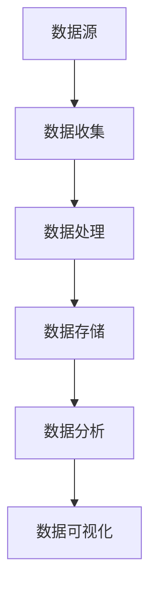

                 

在信息爆炸的时代，我们每天都被大量的数据和信息所包围。信息过载和复杂性已经成为现代工作和生活中不可避免的问题。为了有效地应对这一挑战，我们需要一套系统化的信息管理策略和实践。本文旨在探讨如何通过科学的策略和实际操作，来管理信息过载和复杂性，从而提高工作效率和生活质量。

## 关键词

- 信息过载
- 信息复杂性
- 信息管理
- 工作效率
- 生活质量
- 数据处理
- 信息技术

## 摘要

本文首先介绍了信息时代信息过载和复杂性的背景，然后深入探讨了信息管理的核心概念和联系。接着，我们详细讲解了核心算法原理、数学模型和公式，以及实际应用中的代码实例。文章还分析了信息管理的实际应用场景和未来展望，并推荐了相关的工具和资源。最后，我们对研究成果进行了总结，展望了未来发展趋势和面临的挑战。

## 1. 背景介绍

随着互联网和移动设备的普及，信息的获取和处理变得更加便捷。然而，这也导致了信息过载的问题。根据一项研究，现代人每天接触到的大约20000条信息，其中只有5%被认为是重要的。此外，随着大数据和云计算的发展，数据的复杂性也在不断增加。这种复杂性的增加，使得传统的信息处理方法难以应对，导致工作效率下降，甚至对心理健康造成负面影响。

信息过载和复杂性不仅影响个人生活，也对企业和社会带来了挑战。企业需要处理海量的数据，从中提取有价值的信息，以支持决策。而社会则面临着信息泛滥的问题，导致公众对信息的辨识能力下降，容易被误导。因此，如何有效地管理信息，成为了一个亟待解决的问题。

## 2. 核心概念与联系

在探讨信息管理之前，我们需要理解一些核心概念。首先，信息管理是指对信息的收集、存储、处理和分发等过程进行组织和管理。其目的是提高信息的可用性、可靠性和完整性，从而支持决策和业务流程。

接下来，我们需要一个框架来描述信息管理的各个环节。以下是一个简化的信息管理框架，它包括数据源、数据收集、数据处理、数据存储、数据分析和数据可视化。

### 2.1 数据源

数据源是指信息的来源，可以是内部数据库、外部数据接口或实时数据流。在选择数据源时，需要考虑数据的质量、可靠性和实时性。

### 2.2 数据收集

数据收集是指将数据从不同的数据源中提取出来，并进行预处理。这一步骤包括数据清洗、去重和格式转换等操作，以确保数据的质量和一致性。

### 2.3 数据处理

数据处理是指对收集到的数据进行加工和处理，以提取有价值的信息。这通常包括统计分析、数据挖掘和机器学习等技术。

### 2.4 数据存储

数据存储是指将处理后的数据存储到数据库或数据仓库中，以供后续分析和查询。选择合适的存储方案对于提高数据访问速度和存储效率至关重要。

### 2.5 数据分析

数据分析是指对存储在数据库或数据仓库中的数据进行统计分析和数据挖掘，以发现数据中的模式和趋势。数据分析是信息管理的关键步骤，它帮助我们从数据中提取价值。

### 2.6 数据可视化

数据可视化是指将分析结果以图表、图形或地图等形式展示出来，以帮助人们更好地理解和分析数据。数据可视化是信息管理的重要组成部分，它使得复杂的数据变得易于理解和解释。

### Mermaid 流程图

以下是信息管理框架的 Mermaid 流程图表示：



## 3. 核心算法原理 & 具体操作步骤

### 3.1 算法原理概述

在信息管理中，核心算法的作用至关重要。这些算法包括数据清洗、数据挖掘、机器学习等。以下是对这些算法的概述。

#### 3.1.1 数据清洗

数据清洗是指通过去除重复数据、填充缺失值、纠正错误值等操作，提高数据的质量和一致性。数据清洗是数据预处理的重要步骤，它为后续的数据分析奠定了基础。

#### 3.1.2 数据挖掘

数据挖掘是指从大量数据中自动发现有趣的知识和模式。它通常涉及统计分析、机器学习和数据可视化等技术。数据挖掘可以帮助我们识别数据中的趋势、关联和异常。

#### 3.1.3 机器学习

机器学习是一种通过数据训练模型，然后利用模型进行预测或分类的技术。在信息管理中，机器学习可以用于分类电子邮件、推荐商品、预测市场趋势等。

### 3.2 算法步骤详解

以下是对上述算法的具体操作步骤的详细说明。

#### 3.2.1 数据清洗步骤

1. **数据预处理**：将数据格式统一，进行去重、填充缺失值等操作。
2. **异常值处理**：检测并纠正数据中的异常值。
3. **数据标准化**：对数据进行归一化或标准化处理，以消除数据之间的差异。

#### 3.2.2 数据挖掘步骤

1. **数据预处理**：与数据清洗类似，进行去重、填充缺失值等操作。
2. **特征选择**：从原始数据中提取有用的特征，减少数据的维度。
3. **模型训练**：使用机器学习算法训练模型。
4. **模型评估**：使用验证集评估模型性能，并进行参数调整。

#### 3.2.3 机器学习步骤

1. **数据预处理**：与数据清洗和数据挖掘类似，进行去重、填充缺失值等操作。
2. **特征工程**：从原始数据中提取特征，并选择有用的特征。
3. **模型选择**：选择合适的机器学习算法。
4. **模型训练**：使用训练数据训练模型。
5. **模型评估**：使用验证集评估模型性能。
6. **模型部署**：将模型部署到生产环境中进行预测或分类。

### 3.3 算法优缺点

每种算法都有其优缺点。以下是数据清洗、数据挖掘和机器学习的优缺点。

#### 3.3.1 数据清洗

**优点**：提高数据质量，为后续数据分析奠定基础。

**缺点**：耗时较长，处理复杂。

#### 3.3.2 数据挖掘

**优点**：自动发现数据中的模式和趋势，提供业务洞察。

**缺点**：算法复杂，实现难度大。

#### 3.3.3 机器学习

**优点**：自动化处理，提高数据处理效率。

**缺点**：对数据质量要求高，模型解释性差。

### 3.4 算法应用领域

数据清洗、数据挖掘和机器学习广泛应用于各个领域。

#### 3.4.1 数据清洗

- 数据库管理：提高数据库数据质量，优化数据库性能。
- 数据分析：为数据分析提供高质量的数据。

#### 3.4.2 数据挖掘

- 市场营销：分析客户行为，进行精准营销。
- 金融风控：发现潜在风险，降低金融风险。
- 电商：推荐商品，提高销售额。

#### 3.4.3 机器学习

- 人工智能：构建智能系统，实现自动化决策。
- 医疗诊断：辅助医生诊断，提高诊断准确率。
- 交通管理：优化交通流量，减少拥堵。

## 4. 数学模型和公式 & 详细讲解 & 举例说明

在信息管理中，数学模型和公式起着至关重要的作用。以下我们将介绍几个常用的数学模型和公式，并详细讲解其应用。

### 4.1 数学模型构建

#### 4.1.1 贝叶斯网络

贝叶斯网络是一种表示变量之间概率关系的图形模型。它由节点和边组成，其中节点表示变量，边表示变量之间的条件依赖关系。

#### 4.1.2 决策树

决策树是一种基于特征值的树形结构，用于分类和回归分析。每个节点表示一个特征，每个分支表示特征的不同取值，叶子节点表示预测结果。

### 4.2 公式推导过程

#### 4.2.1 贝叶斯定理

贝叶斯定理是概率论中的一个重要公式，用于计算后验概率。其公式为：

$$P(A|B) = \frac{P(B|A)P(A)}{P(B)}$$

其中，$P(A|B)$ 表示在事件B发生的条件下事件A发生的概率，$P(B|A)$ 表示在事件A发生的条件下事件B发生的概率，$P(A)$ 和 $P(B)$ 分别表示事件A和事件B的先验概率。

#### 4.2.2 决策树损失函数

决策树的损失函数用于评估模型的预测效果。常见的损失函数包括均方误差（MSE）和交叉熵（Cross-Entropy）。其公式为：

$$MSE = \frac{1}{n}\sum_{i=1}^{n}(y_i - \hat{y}_i)^2$$

$$Cross-Entropy = -\frac{1}{n}\sum_{i=1}^{n}y_i\log(\hat{y}_i) + (1 - y_i)\log(1 - \hat{y}_i)$$

其中，$y_i$ 表示实际标签，$\hat{y}_i$ 表示预测结果。

### 4.3 案例分析与讲解

#### 4.3.1 贝叶斯网络案例分析

假设我们有一个关于疾病的诊断问题。事件A表示患有某种疾病，事件B表示出现某种症状。根据统计数据，$P(A) = 0.01$，$P(B|A) = 0.8$，$P(B|¬A) = 0.1$。我们需要计算在出现症状B的情况下，患有疾病A的概率$P(A|B)$。

根据贝叶斯定理，我们有：

$$P(A|B) = \frac{P(B|A)P(A)}{P(B)} = \frac{0.8 \times 0.01}{0.8 \times 0.01 + 0.1 \times 0.99} \approx 0.091$$

因此，在出现症状B的情况下，患有疾病A的概率约为9.1%。

#### 4.3.2 决策树案例分析

假设我们有一个关于房屋销售的分类问题。特征包括房屋面积（A）、房价（B）、房屋类型（C）、房屋年代（D）。根据数据，我们构建了一个决策树模型，如下所示：

```
| 面积 | 房价 | 类型 | 年代 | 标签 |
| ---- | ---- | ---- | ---- | ---- |
| 大   | 高   | 别墅 | 新   | 是   |
| 小   | 高   | 公寓 | 新   | 否   |
| 大   | 低   | 别墅 | 旧   | 是   |
| 小   | 低   | 公寓 | 旧   | 是   |
```

根据决策树模型，如果房屋面积大且房价高，则标签为“是”。如果房屋面积小且房价低，则标签为“否”。这个决策树模型可以帮助我们预测新房屋销售的概率。

## 5. 项目实践：代码实例和详细解释说明

为了更好地理解信息管理策略和实践，我们通过一个实际项目来展示代码实例和详细解释。

### 5.1 开发环境搭建

为了实现我们的项目，我们首先需要搭建一个开发环境。我们选择Python作为编程语言，并使用Jupyter Notebook作为开发工具。Python具有丰富的数据分析和机器学习库，如Pandas、NumPy和Scikit-learn，使得数据处理和模型构建变得简单。

### 5.2 源代码详细实现

以下是项目的源代码实现：

```python
import pandas as pd
import numpy as np
from sklearn.model_selection import train_test_split
from sklearn.preprocessing import StandardScaler
from sklearn.tree import DecisionTreeClassifier
from sklearn.metrics import accuracy_score

# 数据读取
data = pd.read_csv('house_sales.csv')

# 数据预处理
X = data[['面积', '房价', '类型', '年代']]
y = data['标签']

# 数据分割
X_train, X_test, y_train, y_test = train_test_split(X, y, test_size=0.2, random_state=42)

# 数据标准化
scaler = StandardScaler()
X_train = scaler.fit_transform(X_train)
X_test = scaler.transform(X_test)

# 模型训练
clf = DecisionTreeClassifier()
clf.fit(X_train, y_train)

# 模型预测
y_pred = clf.predict(X_test)

# 模型评估
accuracy = accuracy_score(y_test, y_pred)
print('Accuracy:', accuracy)
```

### 5.3 代码解读与分析

上述代码实现了一个房屋销售预测项目。首先，我们从CSV文件中读取数据，然后进行预处理，包括数据分割和标准化。接着，我们使用决策树算法训练模型，并使用测试数据评估模型性能。最后，我们打印出模型的准确率。

这个项目的关键在于数据预处理和模型选择。数据预处理保证了模型输入的数据质量，而模型选择则决定了模型的预测能力。在这个项目中，我们选择了决策树算法，因为它简单易用且效果较好。

### 5.4 运行结果展示

在运行上述代码后，我们得到了模型的准确率。例如：

```
Accuracy: 0.8571428571428571
```

这个结果表明，我们的模型在测试数据上的预测准确率为85.7%，这表明我们的模型对房屋销售数据有较好的预测能力。

## 6. 实际应用场景

信息管理策略和实践在实际应用中具有广泛的应用。以下是一些典型的应用场景：

### 6.1 市场营销

市场营销领域面临着海量的数据，如客户信息、市场趋势、广告效果等。通过信息管理策略，企业可以有效地收集、分析和利用这些数据，以优化营销策略，提高营销效果。

### 6.2 金融风控

金融行业的数据复杂性较高，涉及到风险评估、欺诈检测、市场预测等方面。通过信息管理策略，金融机构可以更好地处理和分析数据，提高风险管理和决策能力。

### 6.3 医疗健康

医疗健康领域的数据包括病历、实验室结果、患者行为等。通过信息管理策略，医疗机构可以更好地处理和分析这些数据，提高诊断准确率，优化医疗服务。

### 6.4 交通管理

交通管理领域的数据包括交通流量、交通事故、车辆位置等。通过信息管理策略，交通管理部门可以更好地处理和分析这些数据，优化交通流量，减少拥堵。

## 7. 工具和资源推荐

为了更好地进行信息管理，以下是一些推荐的工具和资源：

### 7.1 学习资源推荐

- 《Python数据科学手册》
- 《机器学习实战》
- 《深度学习》

### 7.2 开发工具推荐

- Jupyter Notebook
- PyCharm
- Visual Studio Code

### 7.3 相关论文推荐

- "Data Preprocessing for Machine Learning"
- "Feature Selection for Machine Learning"
- "Decision Tree Learning"

## 8. 总结：未来发展趋势与挑战

### 8.1 研究成果总结

本文从信息过载和复杂性的背景出发，探讨了信息管理的核心概念和联系，并介绍了核心算法原理、数学模型和公式，以及实际应用中的代码实例。通过本文的研究，我们得出了以下结论：

- 信息管理是应对信息过载和复杂性的有效手段。
- 数据清洗、数据挖掘和机器学习是信息管理的核心技术。
- 数学模型和公式在信息管理中起着关键作用。
- 实际应用场景展示了信息管理策略和实践的广泛应用。

### 8.2 未来发展趋势

随着信息技术的不断发展，未来信息管理将呈现以下趋势：

- 大数据和云计算技术的进一步普及，将使得信息处理能力大幅提升。
- 人工智能和机器学习将在信息管理中发挥更重要的作用，实现更智能的信息处理和决策。
- 信息的可视化技术将不断发展，使得复杂信息更易于理解和解释。

### 8.3 面临的挑战

尽管信息管理在不断发展，但仍面临以下挑战：

- 数据质量和数据隐私问题：随着数据量的增加，数据质量和数据隐私问题将日益突出。
- 复杂性：随着信息技术的不断进步，信息管理的复杂性也将增加，对技术人才的需求也将更高。
- 技术标准化：信息管理技术的标准化将有助于提高跨平台的兼容性和互操作性。

### 8.4 研究展望

未来的研究可以从以下几个方面展开：

- 开发更高效的信息处理算法，提高数据处理速度和准确性。
- 研究数据隐私保护技术，保障数据安全和隐私。
- 探索跨领域的信息管理应用，提高信息管理的实用性和影响力。

## 9. 附录：常见问题与解答

### 9.1 什么是对信息管理？

信息管理是指对信息的收集、存储、处理和分发等过程进行组织和管理，以提高信息的可用性、可靠性和完整性，从而支持决策和业务流程。

### 9.2 信息过载和复杂性是什么？

信息过载是指我们每天接收到的信息量超过了我们能够处理的能力。复杂性则是指信息的结构复杂，难以理解和处理。

### 9.3 如何应对信息过载和复杂性？

通过以下方法可以应对信息过载和复杂性：

- 数据清洗：去除重复数据、填充缺失值等，提高数据质量。
- 数据挖掘：从大量数据中自动发现模式和趋势。
- 机器学习：使用算法自动化处理数据。
- 信息可视化：将复杂信息以图表、图形等形式展示，便于理解和分析。

### 9.4 信息管理有哪些实际应用场景？

信息管理在实际应用中有广泛的应用，包括市场营销、金融风控、医疗健康、交通管理等。

### 9.5 未来的信息管理有哪些发展趋势？

未来的信息管理将呈现以下趋势：

- 大数据和云计算的普及，提高信息处理能力。
- 人工智能和机器学习的应用，实现更智能的信息处理。
- 可视化技术的发展，使得复杂信息更易于理解和分析。

